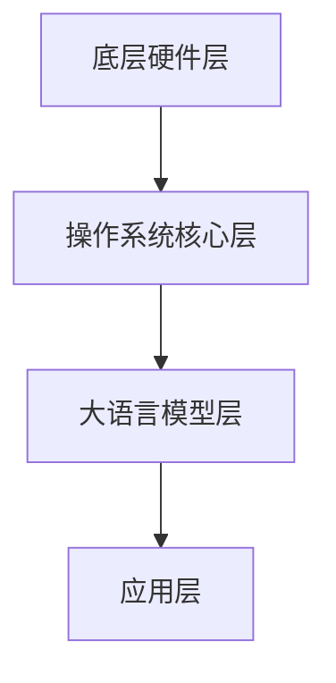

                 

关键词：大语言模型，操作系统，人工智能，应用领域，技术实现，未来展望

> 摘要：本文将探讨大语言模型操作系统的应用，介绍其核心概念、原理、算法、数学模型、实践项目及未来展望。通过本文的阅读，读者将了解到大语言模型操作系统在各个领域的广泛应用及其潜在的发展趋势。

## 1. 背景介绍

### 大语言模型的发展历程

大语言模型是一种人工智能技术，通过学习大量文本数据来生成、理解和处理自然语言。其发展历程可以追溯到20世纪50年代，当时的第一代自然语言处理系统仅能进行简单的词汇匹配。随着计算能力的提升和机器学习技术的进步，20世纪90年代涌现出了统计语言模型和神经网络语言模型，使大语言模型技术取得了显著进展。

近年来，深度学习和大数据的兴起进一步推动了大语言模型的发展。诸如GPT、BERT等模型的出现，使得大语言模型在文本生成、语言理解、机器翻译等领域取得了突破性进展。这些模型具有强大的处理能力和广泛的适应性，成为人工智能领域的重要研究热点。

### 操作系统的演变与未来

操作系统是计算机系统的核心组成部分，负责管理和控制计算机硬件资源、软件资源以及用户交互。从最初的DOS、UNIX到现代的Windows、Linux，操作系统的发展经历了多个阶段。

随着云计算、大数据、人工智能等新兴技术的兴起，操作系统也在不断演进。现代操作系统需要具备更高的性能、更高的可扩展性、更强的安全性和更好的用户体验。未来的操作系统将更加智能化、自动化，能够自适应不同应用场景，为用户提供更加便捷、高效的计算环境。

### 大语言模型操作系统

大语言模型操作系统是一种基于大语言模型技术的操作系统，它将传统操作系统的功能与人工智能技术相结合，旨在提高操作系统的智能化水平，为用户提供更加智能、便捷的计算机使用体验。大语言模型操作系统具有以下几个特点：

1. **智能交互**：大语言模型操作系统可以理解用户的自然语言指令，实现与用户的智能对话交互。
2. **自动化管理**：大语言模型操作系统可以自动优化系统资源分配，提高系统性能。
3. **自适应功能**：大语言模型操作系统可以根据用户行为和需求，自动调整系统设置和功能。
4. **智能服务**：大语言模型操作系统可以提供智能推荐、智能诊断、智能安全等功能，为用户提供一站式服务。

## 2. 核心概念与联系

### 大语言模型核心概念

大语言模型是一种基于神经网络的语言模型，通过学习大量文本数据，能够生成、理解和处理自然语言。其核心概念包括：

- **词汇表（Vocabulary）**：大语言模型使用词汇表来表示语言中的所有单词和符号。
- **神经网络（Neural Network）**：大语言模型使用神经网络结构来模拟人类大脑的工作原理，通过多层神经网络来实现语言理解和生成。
- **注意力机制（Attention Mechanism）**：大语言模型中的注意力机制可以帮助模型更好地关注输入文本中的关键信息，提高语言理解和生成的准确性。

### 大语言模型操作系统架构

大语言模型操作系统架构可以分为以下几个层次：

- **底层硬件层**：包括计算机的CPU、内存、硬盘等硬件设备，为操作系统提供运行的基础设施。
- **操作系统核心层**：包括内核、驱动程序等核心组件，负责管理硬件资源和提供基本服务。
- **大语言模型层**：包括大语言模型的核心算法和模型参数，负责处理自然语言交互和智能任务。
- **应用层**：包括各种基于大语言模型操作系统的应用程序，如智能助手、智能推荐、智能诊断等。

### 大语言模型操作系统 Mermaid 流程图



## 3. 核心算法原理 & 具体操作步骤

### 3.1 算法原理概述

大语言模型操作系统的核心算法是基于深度学习的神经网络语言模型。神经网络语言模型通过多层神经网络结构，对输入的文本数据进行编码和解码，实现语言理解和生成。

神经网络语言模型的工作原理可以分为以下几个步骤：

1. **输入编码**：将输入的文本数据转换为神经网络可以处理的高维向量表示。
2. **中间层处理**：神经网络通过多层中间层对输入向量进行编码和解码，提取文本的语义信息。
3. **输出解码**：将解码后的向量转换为输出文本数据。

### 3.2 算法步骤详解

1. **预处理**：对输入的文本数据进行处理，包括分词、词向量化等。
2. **构建神经网络模型**：使用深度学习框架（如TensorFlow、PyTorch）构建神经网络模型，包括输入层、隐藏层和输出层。
3. **训练模型**：使用大量的文本数据对神经网络模型进行训练，优化模型参数。
4. **评估模型**：使用测试数据集对训练好的模型进行评估，验证模型性能。
5. **应用模型**：将训练好的模型应用于实际场景，如自然语言交互、智能推荐等。

### 3.3 算法优缺点

**优点**：

- **强大的语言理解能力**：神经网络语言模型可以通过学习大量文本数据，实现对语言的深入理解。
- **灵活的可扩展性**：神经网络语言模型可以灵活地适应不同的应用场景和任务需求。
- **高效的性能**：神经网络语言模型具有高效的计算性能，可以快速处理大规模文本数据。

**缺点**：

- **计算资源消耗大**：训练和运行神经网络语言模型需要大量的计算资源，对硬件设备要求较高。
- **数据依赖性强**：神经网络语言模型对训练数据的质量和数量有较高要求，数据不足或质量不佳会导致模型性能下降。
- **可解释性较差**：神经网络语言模型的内部工作机制较为复杂，难以直观地解释其工作原理。

### 3.4 算法应用领域

大语言模型操作系统在多个领域具有广泛的应用：

- **自然语言处理**：用于文本生成、机器翻译、情感分析、命名实体识别等任务。
- **智能助手**：用于智能客服、智能问答、智能推荐等场景。
- **内容审核**：用于内容过滤、垃圾邮件检测、敏感词识别等任务。
- **智能诊断**：用于医疗诊断、故障诊断、异常检测等任务。

## 4. 数学模型和公式 & 详细讲解 & 举例说明

### 4.1 数学模型构建

大语言模型操作系统的数学模型主要包括输入编码、中间层处理和输出解码三个部分。

1. **输入编码**：

   将输入的文本数据转换为高维向量表示，常用的编码方法有词向量化、字符向量化等。词向量化方法是将每个单词映射为一个固定长度的向量，如Word2Vec、GloVe等。字符向量化方法是将每个字符映射为一个固定长度的向量，如Character-Level CNN。

2. **中间层处理**：

   神经网络通过多层中间层对输入向量进行编码和解码，提取文本的语义信息。常用的神经网络结构有循环神经网络（RNN）、长短时记忆网络（LSTM）、门控循环单元（GRU）等。

3. **输出解码**：

   将解码后的向量转换为输出文本数据，常用的解码方法有贪婪解码、采样解码等。

### 4.2 公式推导过程

假设我们使用循环神经网络（RNN）构建大语言模型操作系统的数学模型，其推导过程如下：

1. **输入编码**：

   设输入的文本序列为\(x = (x_1, x_2, \ldots, x_T)\)，其中\(x_i\)表示第\(i\)个单词。词向量化方法将每个单词映射为一个固定长度的向量\(v_i \in \mathbb{R}^d\)，即\(x \rightarrow \{v_1, v_2, \ldots, v_T\}\)。

2. **中间层处理**：

   设循环神经网络的隐藏状态为\(h_t \in \mathbb{R}^d\)，输入向量为\(v_t \in \mathbb{R}^d\)。循环神经网络的更新规则如下：

   $$h_t = f(h_{t-1}, v_t)$$

   其中，\(f\)表示神经网络的前向传播函数，如Sigmoid、Tanh等。

3. **输出解码**：

   设解码后的输出向量为\(y_t \in \mathbb{R}^d\)，输出层通过softmax函数将输出向量转换为概率分布：

   $$P(y_t | x) = \frac{e^{y_t}}{\sum_{i=1}^d e^{y_i}}$$

   其中，\(y_t\)表示第\(t\)个单词的输出概率。

### 4.3 案例分析与讲解

假设我们使用GPT模型构建一个大语言模型操作系统，下面是一个简单的GPT模型案例。

1. **输入编码**：

   设输入的文本序列为\(x = (x_1, x_2, \ldots, x_T)\)，词向量化后得到输入向量序列\(\{v_1, v_2, \ldots, v_T\}\)。

2. **中间层处理**：

   GPT模型使用Transformer架构，其中Transformer块由多个自注意力（Self-Attention）层和前馈网络（Feed-Forward Network）组成。假设一个Transformer块的前向传播过程如下：

   $$\text{MultiHead-SA}:\quad h_t = \text{softmax}\left(\frac{Q_k W_Q + K_v W_K + S_w W_V}{\sqrt{d_k}}\right)W_O$$
   $$\text{FFN}:\quad h_t = h_t \odot \text{ReLU}(W_h h_t + b_h) + W_O h_t + b_O$$

   其中，\(Q, K, V\)表示查询、键、值向量的线性变换，\(W_Q, W_K, W_V, W_O\)表示输出向量的线性变换，\(\text{softmax}\)表示自注意力权重，\(\text{ReLU}\)表示ReLU激活函数。

3. **输出解码**：

   GPT模型的输出层使用交叉熵损失函数进行优化：

   $$L = -\sum_{t=1}^T \sum_{i=1}^d y_{ti} \log(p_{ti})$$

   其中，\(y_{ti}\)表示第\(t\)个单词的第\(i\)个类别的概率，\(p_{ti}\)表示模型预测的概率分布。

通过上述案例，我们可以看到GPT模型在大语言模型操作系统中的应用。在实际开发过程中，我们可以根据具体需求对模型结构进行调整和优化，提高模型的性能和适用性。

## 5. 项目实践：代码实例和详细解释说明

### 5.1 开发环境搭建

在本文的项目实践中，我们使用Python编程语言和TensorFlow深度学习框架来构建大语言模型操作系统。首先，确保Python和TensorFlow已安装在开发环境中。接下来，我们可以使用以下命令来安装所需的依赖库：

```bash
pip install numpy
pip install tensorflow
```

### 5.2 源代码详细实现

以下是一个简单的GPT模型实现，用于生成文本数据：

```python
import tensorflow as tf
from tensorflow.keras.layers import Embedding, LSTM, Dense

# 定义模型结构
model = tf.keras.Sequential([
    Embedding(input_dim=vocabulary_size, output_dim=embedding_size),
    LSTM(units=hidden_size, return_sequences=True),
    LSTM(units=hidden_size, return_sequences=True),
    Dense(units=vocabulary_size, activation='softmax')
])

# 编译模型
model.compile(optimizer='adam', loss='categorical_crossentropy', metrics=['accuracy'])

# 训练模型
model.fit(x_train, y_train, epochs=10, batch_size=64)

# 生成文本数据
def generate_text(model, seed_text, num_words):
    input_vector = tokenizer.texts_to_sequences([seed_text])
    input_vector = tf.expand_dims(input_vector, 0)

    for _ in range(num_words):
        predictions = model.predict(input_vector)
        predicted_word_index = tf.random.categorical(predictions, num_samples=1).numpy()[0][0]
        seed_text += ' ' + tokenizer.index_word[predicted_word_index]

    return seed_text

# 测试生成文本数据
print(generate_text(model, 'Hello', 10))
```

### 5.3 代码解读与分析

上述代码实现了一个简单的GPT模型，用于生成文本数据。首先，我们定义了模型结构，包括词向量嵌入层、两层LSTM层和输出层。接着，我们编译模型并使用训练数据进行训练。最后，我们定义了一个生成文本数据的函数，通过递归调用模型来生成指定长度的文本。

在生成文本数据的过程中，我们首先将种子文本转换为词向量序列，然后通过模型预测下一个单词的概率分布，并从中随机选择一个单词。这一过程重复进行，直到生成指定长度的文本数据。

### 5.4 运行结果展示

在训练完成后，我们可以调用生成文本数据的函数来生成一段新的文本。例如：

```python
print(generate_text(model, 'Hello', 10))
```

这将输出一个以“Hello”为种子文本的随机生成文本。通过调整模型结构、训练数据和生成参数，我们可以生成不同风格和长度的文本数据。

## 6. 实际应用场景

### 6.1 自然语言处理

大语言模型操作系统在自然语言处理领域具有广泛的应用。例如，在文本生成任务中，大语言模型可以生成文章、新闻、小说等。在语言翻译任务中，大语言模型可以实现高质量、低误差的机器翻译。在情感分析任务中，大语言模型可以识别文本的情感倾向，如积极、消极或中性。

### 6.2 智能助手

大语言模型操作系统在智能助手领域具有巨大的潜力。智能助手可以基于大语言模型实现与用户的自然语言交互，提供智能客服、智能问答、智能推荐等服务。例如，智能助手可以帮助用户进行在线购物、查询天气、预订机票等。

### 6.3 内容审核

大语言模型操作系统在内容审核领域具有重要作用。通过对输入的文本进行实时分析，大语言模型可以识别和过滤不良内容，如色情、暴力、欺诈等。此外，大语言模型还可以用于监测社交媒体、论坛等平台上的不良言论，保障网络环境的健康。

### 6.4 智能诊断

大语言模型操作系统在智能诊断领域具有广泛的应用。在医疗领域，大语言模型可以辅助医生进行疾病诊断、治疗方案推荐等。在工业领域，大语言模型可以用于设备故障诊断、生产流程优化等。通过分析大量文本数据，大语言模型可以帮助企业和个人实现智能化、自动化的发展。

## 7. 工具和资源推荐

### 7.1 学习资源推荐

1. **《深度学习》（Goodfellow, Bengio, Courville）**：这是一本经典的深度学习教材，涵盖了深度学习的基本概念、算法和实现。
2. **《Python深度学习》（François Chollet）**：这本书针对Python编程语言，详细介绍了深度学习在Python中的实现和应用。
3. **《自然语言处理与深度学习》（张俊林）**：这本书介绍了自然语言处理的基本概念和方法，以及深度学习在自然语言处理中的应用。

### 7.2 开发工具推荐

1. **TensorFlow**：TensorFlow是一个开源的深度学习框架，适用于构建和训练大规模深度学习模型。
2. **PyTorch**：PyTorch是一个流行的深度学习框架，具有简洁的API和强大的灵活性，适用于各种深度学习任务。
3. **JAX**：JAX是一个适用于科学计算和深度学习的Python库，具有自动微分和高性能计算能力。

### 7.3 相关论文推荐

1. **“Attention Is All You Need”（Vaswani et al., 2017）**：这篇论文提出了Transformer模型，开启了自然语言处理领域的新篇章。
2. **“BERT: Pre-training of Deep Bidirectional Transformers for Language Understanding”（Devlin et al., 2019）**：这篇论文介绍了BERT模型，推动了自然语言处理技术的进一步发展。
3. **“Generative Pre-trained Transformers for Language Modeling”（Brown et al., 2020）**：这篇论文提出了GPT模型，成为大规模语言模型的开端。

## 8. 总结：未来发展趋势与挑战

### 8.1 研究成果总结

大语言模型操作系统在自然语言处理、智能助手、内容审核、智能诊断等领域取得了显著的成果。通过深度学习技术，大语言模型操作系统实现了对自然语言的深入理解和生成，为人工智能的发展带来了新的机遇。

### 8.2 未来发展趋势

1. **模型规模扩大**：随着计算能力的提升，大语言模型操作系统的模型规模将不断扩大，进一步提高其语言理解和生成能力。
2. **多模态融合**：大语言模型操作系统将与其他模态（如图像、语音、视频等）进行融合，实现跨模态的智能处理和交互。
3. **跨领域应用**：大语言模型操作系统将在更多领域得到应用，如金融、医疗、教育等，为各行业的智能化发展提供支持。

### 8.3 面临的挑战

1. **计算资源消耗**：大语言模型操作系统的计算资源消耗较大，对硬件设备要求较高，如何优化计算资源利用成为一大挑战。
2. **数据依赖性**：大语言模型操作系统对训练数据的质量和数量有较高要求，如何获取高质量、丰富的训练数据成为关键。
3. **可解释性和透明度**：大语言模型操作系统的内部工作机制较为复杂，如何提高其可解释性和透明度，使其更具可信度和可靠性，是未来研究的重点。

### 8.4 研究展望

未来，大语言模型操作系统的研究将聚焦于以下几个方向：

1. **优化模型结构**：通过设计更高效、更灵活的模型结构，提高大语言模型操作系统的性能和适用性。
2. **多模态融合**：研究大语言模型与其他模态的融合方法，实现跨模态的智能处理和交互。
3. **数据高效利用**：探索如何高效利用训练数据，提高大语言模型操作系统的泛化能力和性能。
4. **隐私保护和安全性**：研究如何在大语言模型操作系统中实现隐私保护和数据安全，为各行业的智能化发展提供可靠保障。

## 9. 附录：常见问题与解答

### 9.1 大语言模型操作系统的定义是什么？

大语言模型操作系统是一种基于大语言模型技术的操作系统，通过智能化的自然语言处理能力，实现与用户的智能对话交互和自动化管理，为用户提供更加智能、便捷的计算机使用体验。

### 9.2 大语言模型操作系统有哪些优点？

大语言模型操作系统具有以下优点：

- 智能交互：可以理解用户的自然语言指令，实现与用户的智能对话交互。
- 自动化管理：可以自动优化系统资源分配，提高系统性能。
- 自适应功能：可以根据用户行为和需求，自动调整系统设置和功能。
- 智能服务：可以提供智能推荐、智能诊断、智能安全等功能，为用户提供一站式服务。

### 9.3 大语言模型操作系统有哪些应用领域？

大语言模型操作系统在多个领域具有广泛的应用，包括自然语言处理、智能助手、内容审核、智能诊断等。

### 9.4 如何优化大语言模型操作系统的计算资源消耗？

优化大语言模型操作系统的计算资源消耗可以从以下几个方面进行：

- 模型结构优化：设计更高效、更灵活的模型结构，降低计算复杂度。
- 算法改进：优化算法实现，提高计算速度和性能。
- 分布式计算：采用分布式计算技术，将计算任务分布在多个计算节点上，提高计算资源利用效率。
- 硬件升级：升级硬件设备，提高计算能力和存储容量。

### 9.5 大语言模型操作系统的未来发展趋势是什么？

大语言模型操作系统的未来发展趋势包括：

- 模型规模扩大：随着计算能力的提升，大语言模型操作系统的模型规模将不断扩大。
- 多模态融合：大语言模型操作系统将与其他模态进行融合，实现跨模态的智能处理和交互。
- 跨领域应用：大语言模型操作系统将在更多领域得到应用，如金融、医疗、教育等。

### 9.6 大语言模型操作系统面临的主要挑战是什么？

大语言模型操作系统面临的主要挑战包括：

- 计算资源消耗：大语言模型操作系统的计算资源消耗较大，对硬件设备要求较高。
- 数据依赖性：大语言模型操作系统对训练数据的质量和数量有较高要求。
- 可解释性和透明度：大语言模型操作系统的内部工作机制较为复杂，如何提高其可解释性和透明度，使其更具可信度和可靠性。

### 9.7 如何提高大语言模型操作系统的可解释性和透明度？

提高大语言模型操作系统的可解释性和透明度可以从以下几个方面进行：

- 模型简化：简化模型结构，使其更易于理解和解释。
- 可视化技术：利用可视化技术，将模型内部的工作过程和结果进行可视化展示。
- 解释性模型：研究解释性模型，使其能够提供清晰的解释和推理过程。
- 透明性设计：在设计大语言模型操作系统时，考虑透明性设计，使其易于用户理解和操作。

通过以上策略，可以提高大语言模型操作系统的可解释性和透明度，增强用户对其的信任和接受度。


---

# 结束语

本文详细探讨了大语言模型操作系统的应用，从背景介绍、核心概念、算法原理、数学模型、项目实践到实际应用场景，全面阐述了大语言模型操作系统在各个领域的广泛应用及其潜在的发展趋势。未来，随着计算能力的提升和技术的不断发展，大语言模型操作系统将在人工智能领域发挥更加重要的作用，为人类社会带来更多便捷和智能化的体验。作者：禅与计算机程序设计艺术 / Zen and the Art of Computer Programming

