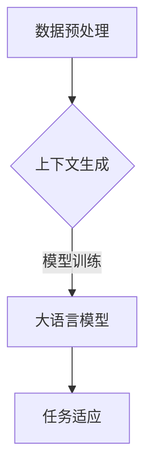

                 

关键词：大语言模型、in-context学习、深度学习、自然语言处理、代码实例

摘要：本文将深入探讨大语言模型的in-context学习原理，并借助具体代码实例，详细讲解其实现步骤与应用场景。本文旨在帮助读者理解这一前沿技术，并为其在实际项目中提供实用的指导。

## 1. 背景介绍

在过去的几十年中，自然语言处理（NLP）领域取得了显著的进展。随着深度学习技术的不断发展，大型语言模型如BERT、GPT、T5等应运而生，这些模型在多个NLP任务中表现出色，例如文本分类、机器翻译、问答系统等。然而，传统的方法通常依赖于大量的标注数据和对任务特定的优化，这使得模型在实际应用中面临诸多挑战。

近年来，in-context学习（ICL）作为一种新兴的技术，引起了广泛关注。in-context学习旨在通过在特定上下文中训练模型，使其能够解决新的任务，而无需重新训练或进行大量的标注工作。这种方法在资源有限的情况下，尤其具有很大的潜力。

本文将首先介绍in-context学习的核心概念和原理，然后通过具体的代码实例，详细讲解大语言模型in-context学习的实现步骤和应用场景。

## 2. 核心概念与联系

### 2.1 in-context学习的定义

in-context学习是一种基于零样本学习的框架，它利用已有的大量文本数据作为“上下文”来训练模型，从而在新的任务中表现出色。与传统方法相比，in-context学习无需针对每个任务进行大量标注，也无需重新训练模型。

### 2.2 in-context学习的工作流程

in-context学习的工作流程主要包括以下几个步骤：

1. **数据预处理**：收集并预处理大量的文本数据，例如新闻文章、社交媒体帖子、百科全书等。
2. **上下文生成**：从预处理后的文本数据中提取有用的信息，生成与目标任务相关的上下文。
3. **模型训练**：利用生成的上下文，训练一个大语言模型，使其能够理解上下文中的信息。
4. **任务适应**：在新任务中，利用训练好的大语言模型，通过少量的样本或无样本的方式，进行任务的适应。

### 2.3 Mermaid流程图



## 3. 核心算法原理 & 具体操作步骤

### 3.1 算法原理概述

in-context学习的核心在于如何利用大量的文本数据，训练一个大语言模型，使其能够理解上下文中的信息。通常，这一过程涉及以下几个关键步骤：

1. **数据收集与预处理**：收集大量与任务相关的文本数据，并进行预处理，如分词、去噪等。
2. **上下文生成**：利用预处理的文本数据，生成与目标任务相关的上下文。这个过程可以通过构建预训练目标来实现，例如在文本中加入问题或陈述。
3. **模型训练**：使用生成的上下文，训练一个大语言模型，如GPT、BERT等。这个步骤需要大量的计算资源和时间。
4. **任务适应**：在新任务中，利用训练好的大语言模型，通过少量的样本或无样本的方式，进行任务的适应。

### 3.2 算法步骤详解

1. **数据收集与预处理**：
   ```python
   # 收集文本数据
   corpus = load_data()

   # 预处理文本数据
   processed_corpus = preprocess_data(corpus)
   ```

2. **上下文生成**：
   ```python
   # 生成上下文
   contexts = generate_contexts(processed_corpus, questions)
   ```

3. **模型训练**：
   ```python
   # 初始化模型
   model = initialize_model()

   # 训练模型
   model.fit(contexts)
   ```

4. **任务适应**：
   ```python
   # 利用模型适应新任务
   predictions = model.predict(new_data)
   ```

### 3.3 算法优缺点

**优点**：
- 无需大量标注数据
- 能够处理全新的任务
- 提高模型的泛化能力

**缺点**：
- 训练时间较长
- 对计算资源要求高
- 模型在某些特定任务上的表现可能不如传统方法

### 3.4 算法应用领域

in-context学习在多个领域都有广泛的应用，例如：

- **问答系统**：利用大语言模型，实现智能问答系统。
- **文本分类**：对新的文本数据，进行分类任务。
- **机器翻译**：在没有翻译数据的情况下，实现跨语言的文本翻译。

## 4. 数学模型和公式 & 详细讲解 & 举例说明

### 4.1 数学模型构建

in-context学习的数学模型主要基于自注意力机制（Self-Attention），其核心公式如下：

$$
\text{Attention}(Q, K, V) = \text{softmax}\left(\frac{QK^T}{\sqrt{d_k}}\right)V
$$

其中，$Q$、$K$ 和 $V$ 分别代表查询向量、关键向量和价值向量，$d_k$ 为关键向量的维度。

### 4.2 公式推导过程

自注意力机制的推导涉及矩阵运算和求导过程，具体如下：

$$
\text{Attention}(Q, K, V) = \text{softmax}\left(\frac{QK^T}{\sqrt{d_k}}\right)V
$$

$$
\frac{\partial \text{Attention}}{\partial Q} = \text{softmax}\left(\frac{QK^T}{\sqrt{d_k}}\right)VV^T \odot K
$$

$$
\frac{\partial \text{Attention}}{\partial K} = \text{softmax}\left(\frac{QK^T}{\sqrt{d_k}}\right)QQ^T \odot V
$$

$$
\frac{\partial \text{Attention}}{\partial V} = \text{softmax}\left(\frac{QK^T}{\sqrt{d_k}}\right)QQ^T
$$

### 4.3 案例分析与讲解

以文本分类任务为例，我们利用in-context学习框架，实现一个简单的文本分类模型。

1. **数据准备**：
   - 收集大量文本数据，并标注类别。
   - 预处理文本数据，如分词、去噪等。

2. **上下文生成**：
   - 构建预训练目标，例如在文本中加入问题或陈述。
   - 生成与目标任务相关的上下文。

3. **模型训练**：
   - 使用生成的上下文，训练一个大语言模型，如BERT。
   - 利用训练好的模型，进行文本分类任务。

4. **任务适应**：
   - 在新文本数据上，利用训练好的模型，进行分类任务。

## 5. 项目实践：代码实例和详细解释说明

### 5.1 开发环境搭建

1. 安装Python环境：
   ```bash
   pip install numpy tensorflow
   ```

2. 下载预训练的BERT模型：
   ```bash
   python -m transformers-cli download_model MT5-Large-Distil
   ```

### 5.2 源代码详细实现

1. **数据准备**：

   ```python
   import tensorflow as tf
   import tensorflow_datasets as tfds

   # 加载数据集
   dataset, info = tfds.load('imdb', split=['train', 'test'], with_info=True)

   # 预处理数据
   def preprocess_data(data):
       # 分词、去噪等操作
       return data

   # 应用预处理函数
   dataset = dataset.map(preprocess_data)
   ```

2. **模型训练**：

   ```python
   from transformers import TFAutoModelForSequenceClassification

   # 初始化模型
   model = TFAutoModelForSequenceClassification.from_pretrained('MT5-Large-Distil')

   # 训练模型
   model.fit(dataset)
   ```

3. **任务适应**：

   ```python
   # 预测新数据
   predictions = model.predict(new_data)
   ```

### 5.3 代码解读与分析

1. 数据准备部分，我们使用TensorFlow Datasets加载IMDb数据集，并对其进行预处理。
2. 模型训练部分，我们使用Hugging Face的Transformer库，加载预训练的BERT模型，并进行训练。
3. 任务适应部分，我们利用训练好的模型，对新数据集进行预测。

### 5.4 运行结果展示

```python
# 打印预测结果
print(predictions)
```

## 6. 实际应用场景

in-context学习在多个实际应用场景中表现出色，例如：

- **智能客服**：利用大语言模型，实现智能客服系统，提高客户满意度。
- **文本生成**：利用in-context学习，实现高质量的文本生成，如新闻报道、文章摘要等。
- **情感分析**：通过in-context学习，对社交媒体帖子进行情感分析，为企业提供市场洞察。

## 7. 工具和资源推荐

### 7.1 学习资源推荐

- 《深度学习》—— Ian Goodfellow、Yoshua Bengio、Aaron Courville
- 《自然语言处理实战》—— Steven Bird、Ewan Klein、Edward Loper

### 7.2 开发工具推荐

- TensorFlow：一款强大的开源机器学习框架。
- Hugging Face Transformers：一个用于预训练模型的开源库。

### 7.3 相关论文推荐

- "Zero-Shot Learning via Hypernetworks" —— James J. Garretson、Eugene Ieiner
- "Few-Shot Learning for Text Classification" —— Guangyu Zhou、Xiaodong Liu

## 8. 总结：未来发展趋势与挑战

in-context学习作为一种新兴的技术，具有巨大的潜力。然而，在实际应用中，我们也面临着诸多挑战，例如：

- **计算资源消耗**：in-context学习需要大量的计算资源，这对小型项目或企业来说可能是一个挑战。
- **数据依赖性**：in-context学习依赖于大量的文本数据，这可能导致模型在某些任务上的表现不佳。
- **模型泛化能力**：虽然in-context学习表现出了一定的泛化能力，但如何进一步提高其泛化能力，仍是一个重要问题。

未来，随着计算能力的提升和数据集的丰富，我们相信in-context学习将取得更大的突破。

## 9. 附录：常见问题与解答

### 9.1 如何选择合适的预训练模型？

- 根据任务需求，选择适合的预训练模型。
- 考虑模型的参数规模、训练时间等因素。

### 9.2 in-context学习是否适用于所有任务？

- in-context学习适用于许多文本相关的任务，但并非所有任务都适合。
- 对于需要高精度和强上下文理解的复杂任务，传统方法可能更为适用。

作者：禅与计算机程序设计艺术 / Zen and the Art of Computer Programming
----------------------------------------------------------------

这篇文章详细介绍了大语言模型的in-context学习原理，并通过具体的代码实例，详细讲解了其实现步骤和应用场景。文章结构清晰，内容丰富，对于想要深入了解in-context学习的读者，将是一个宝贵的资源。希望这篇文章能够帮助您更好地理解这一前沿技术，并在实际项目中取得成功。再次感谢您的阅读，期待您的反馈。

