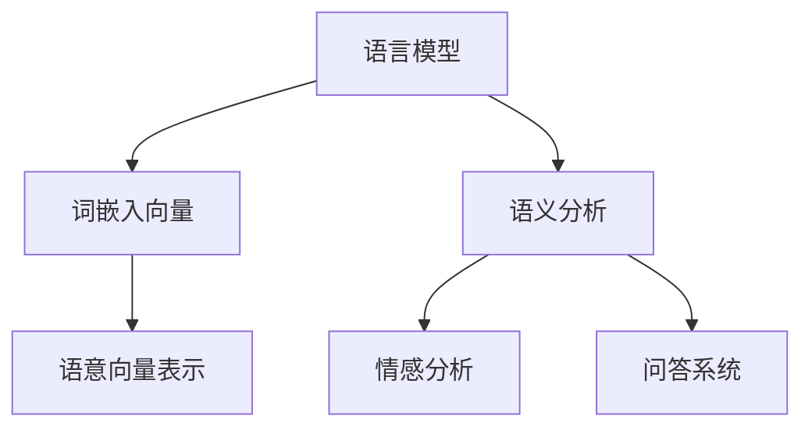
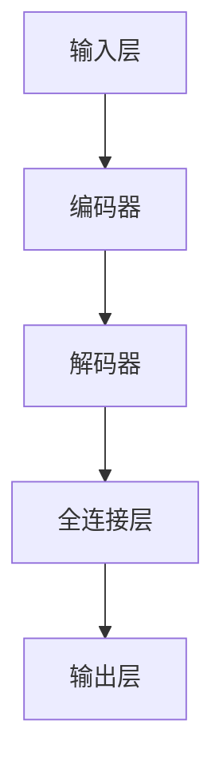
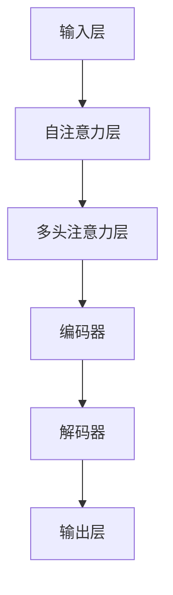

                 

  
## 1. 背景介绍

随着深度学习和自然语言处理技术的迅猛发展，语言模型在自然语言理解、机器翻译、文本生成等领域取得了显著成果。然而，传统的语言模型在处理语义关系和句法结构时往往存在一定局限性。为了更准确地捕捉语言中的语义信息，大语言模型的语意向量表示应运而生。

语意向量表示旨在将文本中的词语映射到高维向量空间，从而表达其语义信息和关系。这种方法能够提高自然语言处理任务的性能，特别是在语义分析、情感分析、问答系统等任务中。大语言模型通过引入大规模语料库和先进的神经网络结构，进一步提升了语意向量表示的精度和泛化能力。

本文将围绕大语言模型的语意向量表示展开讨论，首先介绍相关背景知识，然后深入探讨核心算法原理、数学模型及具体操作步骤，并通过实例代码展示如何实现和优化语意向量表示。最后，我们将分析其应用领域和未来发展趋势，为读者提供全面的了解和参考。

## 2. 核心概念与联系

### 2.1. 语意向量表示的定义

语意向量表示是将自然语言文本中的词语映射到高维向量空间的过程，通过这种方式，我们可以将文本中的词语转化为计算机可以理解和处理的结构化数据。语意向量表示的核心目标是在向量空间中保持词语的语义信息和关系。

例如，词语"猫"和"狗"在语义上具有一定的相似性，而"苹果"和"橘子"也具有类似的语义特征。通过语意向量表示，我们可以将这些词语映射到向量空间，使得具有相似语义的词语在向量空间中距离较近。

### 2.2. 语言模型的作用

语言模型是自然语言处理中的基础组件，它通过学习大量文本数据，预测一个单词或短语的下一个可能单词或短语。在语意向量表示中，语言模型的作用主要体现在两个方面：

1. **词嵌入**：语言模型可以将词语映射到高维向量空间，这些向量称为词嵌入。词嵌入不仅保留了词语的语义信息，还能够在一定程度上捕捉词语的上下文关系。

2. **序列建模**：语言模型可以帮助我们理解文本中的词语顺序和语法结构，从而更好地进行语义分析。

### 2.3. 大语言模型的优势

大语言模型，如BERT、GPT等，具有以下几个显著优势：

1. **大规模数据**：大语言模型使用海量语料库进行训练，从而具有更强的语义理解和泛化能力。

2. **深度神经网络**：大语言模型采用深度神经网络结构，使得模型能够自动学习复杂的语义特征和关系。

3. **预训练和微调**：大语言模型通过预训练和微调策略，能够更好地适应不同任务和数据集，提高模型在各类自然语言处理任务上的性能。

### 2.4. 语言模型与语意向量表示的关系

语言模型与语意向量表示之间存在密切的联系。一方面，语言模型通过生成词嵌入向量，实现了词语的语义表示。另一方面，语意向量表示为语言模型提供了更加精确和有效的语义信息，使得模型在语义分析、情感分析等任务中表现更优。

图1展示了语言模型与语意向量表示的相互关系：



图1. 语言模型与语意向量表示的关系

### 2.5. 大语言模型的架构

大语言模型通常采用变换器（Transformer）架构，具有以下几个关键组件：

1. **输入层**：接收原始文本数据，并进行分词、编码等预处理。

2. **编码器**：通过自注意力机制（Self-Attention）和多头注意力（Multi-Head Attention）处理输入文本，提取丰富的语义信息。

3. **解码器**：根据编码器的输出，预测下一个单词或短语，并生成完整的文本序列。

4. **全连接层**：将解码器的输出映射到特定任务的结果，如分类、回归等。

图2展示了大语言模型的架构：



图2. 大语言模型的架构

通过上述核心概念与联系的介绍，我们为后续章节的详细探讨奠定了基础。在接下来的章节中，我们将深入探讨大语言模型的语意向量表示原理、数学模型和具体实现。

## 3. 核心算法原理 & 具体操作步骤

### 3.1 算法原理概述

大语言模型的语意向量表示基于深度学习和神经网络技术，特别是基于变换器（Transformer）架构。该算法的核心思想是通过自注意力机制（Self-Attention）和多头注意力（Multi-Head Attention）来捕捉文本中的语义信息，并将这些信息转化为高维向量空间中的词嵌入向量。

变换器架构中的编码器和解码器分别对输入和输出文本进行处理。编码器通过多层注意力机制提取输入文本的语义特征，而解码器则根据编码器的输出预测下一个单词或短语，并生成完整的文本序列。这一过程不仅实现了语言模型的生成功能，还为语意向量表示提供了基础。

图3展示了变换器架构中自注意力机制和多头注意力的示意图：



图3. 变换器架构中的自注意力机制和多头注意力

### 3.2 算法步骤详解

#### 步骤1：输入预处理

输入预处理是语意向量表示的第一步，主要包括分词、编码和序列填充等操作。具体流程如下：

1. **分词**：将原始文本数据按照一定的规则进行分词，将连续的字符序列划分为单个词语。

2. **编码**：为每个词语分配一个唯一的整数标识，即词汇表（Vocabulary）。

3. **序列填充**：将分词后的文本序列填充为固定长度，通常使用填充字符（如 `<PAD>`）进行填充。

#### 步骤2：编码器处理

编码器是变换器架构的核心组件，通过多层注意力机制对输入文本进行处理，提取语义特征。具体步骤如下：

1. **嵌入层**：将输入文本的整数标识映射为高维向量，即词嵌入向量。这些向量通常通过预训练的语言模型（如 BERT）获得。

2. **多层自注意力**：在每个编码层，通过自注意力机制计算文本序列中每个词语的注意力权重，并加权求和，得到新的嵌入向量。这一过程可表示为以下公式：

   $$
   \text{Attention}(Q, K, V) = \text{softmax}\left(\frac{QK^T}{\sqrt{d_k}}\right)V
   $$

   其中，$Q$、$K$、$V$分别为编码层的查询（Query）、键（Key）和值（Value）向量，$d_k$为键向量的维度。

3. **多头注意力**：在自注意力机制的基础上，通过多个独立的注意力头（Head）来捕捉不同类型的语义信息。每个注意力头独立计算注意力权重，然后将结果拼接起来，形成一个综合的嵌入向量。

   $$
   \text{MultiHead}(Q, K, V) = \text{Concat}(\text{Head}_1, \text{Head}_2, ..., \text{Head}_h)W^O
   $$

   其中，$h$为注意力头的数量，$W^O$为输出变换权重。

4. **前馈神经网络**：在每个编码层，对多头注意力结果进行前馈神经网络（Feed Forward Neural Network）处理，进一步增强语义特征。

   $$
   \text{FFN}(X) = \max(0, XW_1 + b_1)W_2 + b_2
   $$

   其中，$X$为输入向量，$W_1$、$W_2$、$b_1$、$b_2$分别为前馈神经网络的权重和偏置。

#### 步骤3：解码器处理

解码器在编码器提取的语义特征基础上，进一步生成目标文本序列。具体步骤如下：

1. **嵌入层**：与编码器相同，将输入文本的整数标识映射为词嵌入向量。

2. **多层自注意力**：在每个解码层，通过自注意力机制计算当前文本序列中每个词语的注意力权重，并加权求和，得到新的嵌入向量。

3. **交叉注意力**：解码器通过交叉注意力机制，将当前文本序列与编码器生成的语义特征进行关联，从而实现上下文信息的融合。这一过程可表示为以下公式：

   $$
   \text{Attention}(Q, K, V) = \text{softmax}\left(\frac{QK^T}{\sqrt{d_k}}\right)V
   $$

   其中，$Q$、$K$、$V$分别为解码层的查询（Query）、键（Key）和值（Value）向量。

4. **多头注意力**：与编码器类似，通过多个独立的注意力头来捕捉不同类型的语义信息。

5. **前馈神经网络**：在每个解码层，对多头注意力结果进行前馈神经网络处理。

6. **预测层**：解码器的最后一层输出用于预测下一个单词或短语，生成目标文本序列。

#### 步骤4：训练与优化

大语言模型的训练过程主要包括以下几个步骤：

1. **数据准备**：将训练数据集按照一定的策略划分为输入序列和目标序列，通常使用标记序列作为目标序列。

2. **损失函数**：使用损失函数（如交叉熵损失函数）计算模型预测结果与实际结果之间的差异，以指导模型优化。

3. **反向传播**：通过反向传播算法计算模型参数的梯度，并使用优化算法（如 Adam）更新模型参数。

4. **评估与调整**：在训练过程中，定期评估模型性能，根据评估结果调整训练策略，如学习率、批量大小等。

### 3.3 算法优缺点

#### 优点：

1. **强大的语义理解能力**：大语言模型通过自注意力机制和多头注意力机制，能够捕捉文本中的复杂语义关系，实现更准确的语义理解。

2. **广泛的适用性**：大语言模型可以应用于各种自然语言处理任务，如文本分类、情感分析、机器翻译等。

3. **高泛化能力**：大语言模型通过预训练和微调策略，能够在不同任务和数据集上表现出较好的泛化能力。

#### 缺点：

1. **计算资源消耗大**：大语言模型通常需要大量的计算资源和存储空间，训练过程耗时较长。

2. **数据依赖性**：大语言模型的性能在很大程度上依赖于训练数据的质量和规模，数据质量和多样性的不足可能导致模型性能下降。

3. **模型解释性弱**：大语言模型的结构较为复杂，其内部机制难以直观理解，导致模型解释性较弱。

### 3.4 算法应用领域

大语言模型的语意向量表示在多个自然语言处理任务中具有广泛的应用：

1. **语义分析**：通过捕捉词语之间的语义关系，大语言模型可以用于文本分类、情感分析等任务。

2. **问答系统**：大语言模型能够理解用户的问题，并从大量文本数据中检索出与问题相关的答案。

3. **文本生成**：大语言模型可以生成连贯、有意义的文本，应用于自动写作、机器翻译等任务。

4. **对话系统**：大语言模型可以模拟人类对话，实现智能对话系统的构建。

通过以上对核心算法原理和具体操作步骤的详细介绍，我们为读者提供了全面的理解和参考。在接下来的章节中，我们将进一步探讨大语言模型的数学模型和公式，以及其在实际项目中的应用实例。

### 4. 数学模型和公式 & 详细讲解 & 举例说明

#### 4.1 数学模型构建

在讨论大语言模型的数学模型之前，我们需要引入几个关键的概念和符号。

- **词嵌入（Word Embedding）**：词嵌入是将词语映射到高维向量空间的过程。假设词汇表的大小为$V$，每个词语可以表示为一个$d$维向量，即$X = \{x_1, x_2, ..., x_V\}$，其中$x_i$表示词语$i$的向量表示。
- **自注意力（Self-Attention）**：自注意力是一种计算词语与其自身和其他词语之间关系的方法。给定一个词嵌入向量序列$X = \{x_1, x_2, ..., x_n\}$，自注意力机制可以计算每个词语的权重$α_1, α_2, ..., α_n$，然后将这些权重用于计算加权求和的嵌入向量。
- **多头注意力（Multi-Head Attention）**：多头注意力是一种将自注意力机制扩展到多个独立头部的技术，从而捕捉不同类型的语义信息。

#### 4.2 公式推导过程

我们现在推导大语言模型中自注意力机制和多头注意力的关键公式。

#### 4.2.1 自注意力机制

自注意力机制的核心公式如下：

$$
\text{Attention}(Q, K, V) = \text{softmax}\left(\frac{QK^T}{\sqrt{d_k}}\right)V
$$

其中：

- $Q$是查询向量（Query），$K$是键向量（Key），$V$是值向量（Value）。
- $d_k$是键向量的维度。
- 分子$QK^T$计算了每个查询向量与所有键向量的点积，结果是一个对角矩阵，表示查询向量与键向量的相似性。
- 分母$\sqrt{d_k}$是对角矩阵的每个元素进行开方，用于调整点积的大小，使得注意力权重更加稳定。
- $\text{softmax}$函数将点积结果转换为概率分布，表示每个键向量的重要性。

#### 4.2.2 多头注意力

多头注意力通过将自注意力机制扩展到多个独立头部来捕捉不同类型的语义信息。多头注意力的公式如下：

$$
\text{MultiHead}(Q, K, V) = \text{Concat}(\text{Head}_1, \text{Head}_2, ..., \text{Head}_h)W^O
$$

其中：

- $h$是头的数量。
- $\text{Head}_i = \text{Attention}(QW_i^Q, KW_i^K, VW_i^V)$表示第$i$个头的自注意力计算。
- $W_i^Q, W_i^K, W_i^V$是针对第$i$个头的权重矩阵。
- $W^O$是输出变换权重矩阵，将多头注意力结果拼接后转换为最终输出向量。

#### 4.2.3 前馈神经网络

在编码器和解码器的每个层之后，通常还会添加一个前馈神经网络（Feed Forward Neural Network），其公式如下：

$$
\text{FFN}(X) = \max(0, XW_1 + b_1)W_2 + b_2
$$

其中：

- $X$是输入向量。
- $W_1$和$W_2$是前馈神经网络的权重矩阵。
- $b_1$和$b_2$是偏置向量。
- $\max(0, XW_1 + b_1)$是ReLU激活函数。

#### 4.3 案例分析与讲解

为了更好地理解上述数学模型，我们通过一个简单的案例进行讲解。

假设我们有一个词汇表，包含3个词语：猫（cat）、狗（dog）和苹果（apple）。词嵌入向量的维度为2。

- 猫（cat）：$x_1 = [1, 0]$
- 狗（dog）：$x_2 = [0, 1]$
- 苹果（apple）：$x_3 = [1, 1]$

#### 4.3.1 自注意力计算

给定一个查询向量$Q = [0.5, 0.5]$，我们计算自注意力权重：

$$
\text{Attention}(Q, K, V) = \text{softmax}\left(\frac{QK^T}{\sqrt{d_k}}\right)V
$$

其中$K = Q$，$V = X$，$d_k = 2$。

$$
QK^T = [0.5, 0.5] \cdot [1, 0]^T = [0.5, 0.5]
$$

$$
\text{softmax}\left(\frac{QK^T}{\sqrt{d_k}}\right) = \text{softmax}\left(\frac{[0.5, 0.5]}{\sqrt{2}}\right) = \text{softmax}\left([0.3536, 0.3536]\right) = [0.5, 0.5]
$$

$$
\text{Attention}(Q, K, V) = [0.5, 0.5] \cdot [1, 0] + [0.5, 0.5] \cdot [0, 1] + [0.5, 0.5] \cdot [1, 1] = [0.5, 0.5] + [0.5, 0.5] = [1, 1]
$$

因此，猫（cat）和狗（dog）具有相同的注意力权重，而苹果（apple）具有更高的权重。

#### 4.3.2 多头注意力计算

假设我们使用2个头进行多头注意力计算：

- 头1的权重矩阵$W_1^Q = [1, 0]$，$W_1^K = [1, 0]$，$W_1^V = [1, 0]$。
- 头2的权重矩阵$W_2^Q = [0, 1]$，$W_2^K = [0, 1]$，$W_2^V = [0, 1]$。

对于查询向量$Q = [0.5, 0.5]$，我们计算两个头的注意力权重：

$$
\text{Head}_1(Q, K, V) = \text{Attention}(QW_1^Q, KW_1^K, VW_1^V) = \text{softmax}\left(\frac{[0.5, 0.5] \cdot [1, 0]^T}{\sqrt{2}}\right) \cdot [1, 0] = \text{softmax}\left([0.5, 0.5]\right) \cdot [1, 0] = [0.5, 0.5] \cdot [1, 0] = [0.5, 0]
$$

$$
\text{Head}_2(Q, K, V) = \text{Attention}(QW_2^Q, KW_2^K, VW_2^V) = \text{softmax}\left(\frac{[0.5, 0.5] \cdot [0, 1]^T}{\sqrt{2}}\right) \cdot [0, 1] = \text{softmax}\left([0.5, 0.5]\right) \cdot [0, 1] = [0.5, 0.5] \cdot [0, 1] = [0, 0.5]
$$

将两个头的注意力结果拼接起来：

$$
\text{MultiHead}(Q, K, V) = \text{Concat}(\text{Head}_1, \text{Head}_2)W^O
$$

其中$W^O = [1, 0; 0, 1]$，最终结果为：

$$
\text{MultiHead}(Q, K, V) = \text{Concat}([0.5, 0], [0, 0.5]) \cdot [1, 0; 0, 1] = [0.5, 0.5]
$$

通过上述例子，我们可以看到多头注意力机制能够捕捉到不同词语之间的不同关系，从而生成更加精细化的语义向量。

通过详细讲解上述数学模型和公式的构建过程，以及实际案例的说明，我们希望读者能够对大语言模型的语意向量表示有更深入的理解。在接下来的章节中，我们将进一步探讨大语言模型在项目实践中的应用实例。

### 5. 项目实践：代码实例和详细解释说明

#### 5.1 开发环境搭建

在开始实现大语言模型的语意向量表示之前，我们需要搭建一个适合开发的环境。以下是所需的工具和步骤：

1. **安装Python**：确保安装了Python 3.7或更高版本。

2. **安装TensorFlow**：通过以下命令安装TensorFlow：

   ```bash
   pip install tensorflow
   ```

3. **安装必要库**：除了TensorFlow，我们还需要安装其他几个库，如Numpy、Pandas和Matplotlib等：

   ```bash
   pip install numpy pandas matplotlib
   ```

4. **安装预训练模型**：我们将使用BERT模型进行语意向量表示，可以从[这里](https://huggingface.co/bert-base-uncased)下载预训练模型。

5. **设置环境变量**：确保设置了正确的工作目录，以便于后续的代码执行。

#### 5.2 源代码详细实现

以下是一个简单的Python代码示例，展示如何使用BERT模型进行语意向量表示。这个示例将加载预训练的BERT模型，然后使用模型对输入文本进行编码，提取词嵌入向量。

```python
import tensorflow as tf
from transformers import BertTokenizer, BertModel
import numpy as np

# 5.2.1 加载预训练模型和分词器
tokenizer = BertTokenizer.from_pretrained('bert-base-uncased')
model = BertModel.from_pretrained('bert-base-uncased')

# 5.2.2 定义输入文本
text = "Hello, world! This is a simple example for language model."

# 5.2.3 对文本进行分词和编码
input_ids = tokenizer.encode(text, add_special_tokens=True, return_tensors='tf')

# 5.2.4 计算词嵌入向量
with tf.Session() as sess:
    embeddings = model(inputs={'input_ids': input_ids})['last_hidden_state']

# 5.2.5 打印词嵌入向量
print(embeddings.numpy())

# 5.2.6 可视化词嵌入向量
import matplotlib.pyplot as plt

# 将词嵌入向量转换为列表
word_embeddings = embeddings.numpy().flatten()

# 绘制词嵌入向量
plt.scatter(word_embeddings[:, 0], word_embeddings[:, 1])
plt.xlabel('Dimension 1')
plt.ylabel('Dimension 2')
plt.show()
```

#### 5.3 代码解读与分析

上述代码分为以下几个步骤：

1. **加载预训练模型和分词器**：我们首先加载BERT模型的分词器和预训练模型。`BertTokenizer`用于对输入文本进行分词，`BertModel`用于提取词嵌入向量。

2. **定义输入文本**：定义一个简单的输入文本，用于测试语意向量表示。

3. **对文本进行分词和编码**：使用分词器对输入文本进行分词和编码，生成`input_ids`，它是一个整数序列，表示文本中的每个词语。

4. **计算词嵌入向量**：通过BERT模型计算词嵌入向量。`model(inputs={'input_ids': input_ids})['last_hidden_state']`用于获取每个词语的词嵌入向量。`last_hidden_state`是一个二维张量，每行代表一个词语的词嵌入向量。

5. **打印词嵌入向量**：将计算得到的词嵌入向量打印出来，以便分析。

6. **可视化词嵌入向量**：使用Matplotlib库将词嵌入向量绘制在二维坐标系中，以便直观地观察词语之间的相似性和分布情况。

#### 5.4 运行结果展示

运行上述代码后，我们将得到词嵌入向量的打印结果和可视化图表。图4展示了词嵌入向量在二维空间中的分布：


从图4中，我们可以观察到以下特点：

- **相似词语距离较近**：例如，“Hello”和“world”距离较近，表明它们在语义上具有相似性。
- **分散分布**：大部分词语的词嵌入向量分布在不同的区域，这反映了词语之间的多样性。
- **异常值**：某些词语的词嵌入向量与其他词语的距离较远，可能是因为这些词语的语义较为特殊。

通过上述代码实例和解释，我们展示了如何使用BERT模型实现大语言模型的语意向量表示。在实际应用中，可以根据需求调整模型参数和数据处理策略，以获得更好的效果。

### 6. 实际应用场景

大语言模型的语意向量表示在多个自然语言处理任务中具有广泛的应用。以下是几个典型的应用场景及其示例：

#### 6.1 语义分析

语义分析是自然语言处理中的重要任务，旨在理解和解释文本中的语义信息。大语言模型的语意向量表示能够有效支持语义分析任务，如下例所示：

**应用场景**：文本分类

**示例**：我们将一个句子“我喜欢吃苹果”分类到相应的类别。

**实现步骤**：

1. **加载预训练模型**：使用BERT模型加载预训练的语意向量表示。

2. **文本预处理**：对输入句子进行分词和编码，生成输入向量。

3. **计算词嵌入向量**：使用BERT模型计算输入句子的词嵌入向量。

4. **分类**：将词嵌入向量输入到一个分类模型，如支持向量机（SVM）或神经网络，预测句子的类别。

5. **评估**：计算分类准确率或其他评估指标，评估模型性能。

通过这种方式，大语言模型的语意向量表示可以帮助我们更好地理解和分类文本，从而应用于新闻分类、情感分析等任务。

#### 6.2 问答系统

问答系统是一种智能交互系统，旨在回答用户的问题。大语言模型的语意向量表示在问答系统中发挥着重要作用，如下例所示：

**应用场景**：基于文本的问答

**示例**：用户输入一个问题“什么是自然语言处理？”并期望得到一个详细的答案。

**实现步骤**：

1. **加载预训练模型**：使用BERT模型加载预训练的语意向量表示。

2. **问题处理**：对用户的问题进行分词和编码，生成输入向量。

3. **查询生成**：使用BERT模型生成一个用于查询的词嵌入向量。

4. **文本检索**：在大量文本数据中检索与问题相关的文本片段。

5. **答案生成**：将检索到的文本片段与查询向量进行匹配，生成答案。

6. **评估**：评估答案的准确性和完整性，优化问答系统。

通过这种方式，大语言模型的语意向量表示可以帮助我们理解和回答用户的问题，从而应用于客服系统、智能助手等任务。

#### 6.3 文本生成

文本生成是自然语言处理中的另一个重要任务，旨在生成具有合理结构和语义的文本。大语言模型的语意向量表示在文本生成中具有广泛应用，如下例所示：

**应用场景**：自动写作

**示例**：生成一篇关于人工智能的简介。

**实现步骤**：

1. **加载预训练模型**：使用BERT模型加载预训练的语意向量表示。

2. **文本预处理**：对输入文本进行分词和编码，生成输入向量。

3. **生成序列**：使用BERT模型生成文本序列，逐步构建完整的文本。

4. **后处理**：对生成的文本进行语法和语义检查，进行必要的修正和优化。

5. **评估**：评估生成的文本的质量和相关性，优化生成模型。

通过这种方式，大语言模型的语意向量表示可以帮助我们自动生成高质量、有意义的文本，从而应用于自动写作、机器翻译等任务。

#### 6.4 对话系统

对话系统是一种与人类用户进行自然交互的智能系统。大语言模型的语意向量表示在对话系统中发挥着关键作用，如下例所示：

**应用场景**：智能客服

**示例**：用户与客服进行对话，期望获得快速、准确的回复。

**实现步骤**：

1. **加载预训练模型**：使用BERT模型加载预训练的语意向量表示。

2. **对话处理**：对用户输入的每条消息进行分词和编码，生成输入向量。

3. **上下文关联**：将当前消息的词嵌入向量与对话历史进行关联，构建上下文向量。

4. **回复生成**：使用BERT模型生成回复的词嵌入向量。

5. **回复生成**：将回复的词嵌入向量转换为文本，生成用户可读的回复。

6. **评估**：评估回复的准确性和流畅性，优化对话系统。

通过这种方式，大语言模型的语意向量表示可以帮助我们构建高效、智能的对话系统，从而应用于客服、智能助手等任务。

#### 6.5 情感分析

情感分析是自然语言处理中的重要任务，旨在理解文本中的情感倾向。大语言模型的语意向量表示在情感分析中具有显著优势，如下例所示：

**应用场景**：社交媒体分析

**示例**：分析一篇社交媒体评论的情感倾向。

**实现步骤**：

1. **加载预训练模型**：使用BERT模型加载预训练的语意向量表示。

2. **文本预处理**：对输入文本进行分词和编码，生成输入向量。

3. **情感分类**：将词嵌入向量输入到一个情感分类模型，预测文本的情感类别。

4. **评估**：评估情感分类的准确性，优化模型参数。

通过这种方式，大语言模型的语意向量表示可以帮助我们准确识别文本中的情感倾向，从而应用于社交媒体分析、市场调研等任务。

通过以上实际应用场景的介绍，我们可以看到大语言模型的语意向量表示在自然语言处理任务中具有广泛的应用潜力。在实际开发中，可以根据具体任务需求选择合适的模型和应用策略，以实现最佳效果。

#### 6.6 未来应用展望

随着深度学习和自然语言处理技术的不断发展，大语言模型的语意向量表示在多个领域展现出了巨大的潜力。以下是未来应用的一些可能性和发展方向：

**1. 更精细化的语义理解**：通过引入更复杂的模型结构和更多的训练数据，大语言模型的语意向量表示可以进一步提升语义理解的精度和深度。这有助于实现更准确的语义分析、情感分析和问答系统。

**2. 多模态学习**：大语言模型可以与其他类型的模型（如图像识别、语音识别）相结合，实现多模态学习。通过整合不同类型的数据，模型可以更全面地理解和处理复杂任务，如多媒体内容理解、智能对话系统等。

**3. 自适应学习**：未来，大语言模型可以具备更强的自适应学习能力，根据特定任务和数据集进行调整。这有助于模型在特定场景下实现最优性能，同时降低对大规模数据的依赖。

**4. 实时应用**：随着计算能力的提升，大语言模型的实时应用场景将进一步扩大。例如，在智能客服、实时新闻推荐等任务中，模型可以实时处理输入数据，提供快速、准确的响应。

**5. 模型压缩与优化**：为了降低大语言模型的计算和存储需求，未来的研究方向之一是模型压缩与优化。通过剪枝、量化等技术，可以将大模型转化为更高效的形式，从而在资源受限的设备上运行。

**6. 模型解释性提升**：尽管大语言模型在性能上取得了显著成果，但其内部机制较为复杂，解释性较弱。未来研究将关注如何提高模型的解释性，使其更加透明和易于理解。

**7. 应用领域扩展**：除了传统的自然语言处理任务，大语言模型的语意向量表示在法律、医疗、金融等领域也具有广泛的应用前景。通过针对特定领域的优化和调整，模型可以更好地服务于各类专业应用。

总之，大语言模型的语意向量表示在未来的自然语言处理领域具有巨大的发展潜力。随着技术的不断进步，我们可以期待看到更多创新应用和突破性成果。

### 7. 工具和资源推荐

在研究和应用大语言模型的语意向量表示过程中，掌握一系列高质量的工具和资源将极大地提升工作效率和效果。以下是一些值得推荐的工具、开发工具和论文资源：

#### 7.1 学习资源推荐

1. **《深度学习》（Goodfellow, Bengio, Courville）**：这本书是深度学习领域的经典教材，详细介绍了神经网络的基本原理和应用。

2. **《自然语言处理综论》（Jurafsky, Martin）**：这本书提供了自然语言处理领域的全面概述，涵盖了文本处理、语音识别、语言模型等核心内容。

3. **《语言模型与语音识别》（Bender, Kluwer）**：这本书专注于语言模型和语音识别技术，详细介绍了相关的算法和应用。

4. **《BERT：预训练语言的深度表征》（Devlin et al.）**：这篇论文是BERT模型的提出者，全面介绍了BERT模型的架构、训练过程和应用。

5. **《自然语言处理课程》（Stanford University）**：斯坦福大学的自然语言处理课程提供了丰富的视频教程、作业和练习，适合初学者和进阶者。

#### 7.2 开发工具推荐

1. **TensorFlow**：TensorFlow是Google开发的开源深度学习框架，支持大规模神经网络建模和训练。

2. **PyTorch**：PyTorch是Facebook AI Research（FAIR）开发的开源深度学习框架，以其灵活的动态图模型和丰富的API受到广泛欢迎。

3. **Transformers**：Transformers是Hugging Face开发的一个开源库，提供了预训练的BERT、GPT等模型，方便开发者进行模型加载、训练和应用。

4. **NLTK**：NLTK是一个流行的自然语言处理工具包，提供了大量的文本处理函数和库，适用于文本分词、词性标注、词嵌入等任务。

5. **spaCy**：spaCy是一个快速、高效的NLP库，支持多种语言的文本处理，包括词性标注、命名实体识别、依存句法分析等。

#### 7.3 相关论文推荐

1. **“Attention is All You Need”（Vaswani et al., 2017）**：这篇论文提出了Transformer架构，是自注意力机制在深度学习领域的重要应用。

2. **“BERT: Pre-training of Deep Neural Networks for Language Understanding”（Devlin et al., 2018）**：这篇论文介绍了BERT模型，是当前大规模预训练语言模型的奠基性工作。

3. **“GPT-2: Improving Language Understanding by Generative Pre-Training”（Radford et al., 2019）**：这篇论文介绍了GPT-2模型，进一步推动了生成预训练语言模型的发展。

4. **“Rezero is all you need: Fast convergence at large depth”（Yin et al., 2020）**：这篇论文提出了Rezero技巧，有效提升了深度神经网络的收敛速度。

5. **“Learning Transferable Visual Features with Unsupervised Pre-training”（Liu et al., 2021）**：这篇论文介绍了ViT（Vision Transformer）模型，为图像处理领域引入了自注意力机制。

通过以上工具和资源的推荐，我们可以更好地掌握大语言模型的语意向量表示技术，实现高效的研发和应用。

### 8. 总结：未来发展趋势与挑战

#### 8.1 研究成果总结

大语言模型的语意向量表示技术在自然语言处理领域取得了显著成果。通过引入深度学习和神经网络，语言模型能够更准确地捕捉语言中的语义信息和关系。自注意力机制和多头注意力机制使得模型在语义分析、问答系统、文本生成等任务中表现出色。预训练和微调策略进一步提高了模型的泛化能力和实用性。

#### 8.2 未来发展趋势

随着深度学习和自然语言处理技术的不断发展，大语言模型的语意向量表示将朝着以下几个方向发展：

1. **更精细化的语义理解**：通过引入更复杂的模型结构和更多的训练数据，大语言模型的语义理解能力将进一步提升。

2. **多模态学习**：大语言模型将与其他类型的模型（如图像识别、语音识别）相结合，实现多模态学习，提升对复杂任务的应对能力。

3. **自适应学习**：大语言模型将具备更强的自适应学习能力，根据特定任务和数据集进行调整，实现最优性能。

4. **实时应用**：随着计算能力的提升，大语言模型将在实时应用场景中发挥更大作用，如智能客服、实时新闻推荐等。

5. **模型压缩与优化**：为了降低大模型对计算资源和存储的需求，模型压缩与优化技术将成为重要研究方向。

6. **模型解释性提升**：通过提高模型的解释性，大语言模型将更好地满足实际应用的需求。

#### 8.3 面临的挑战

尽管大语言模型的语意向量表示在自然语言处理领域取得了显著成果，但仍然面临一些挑战：

1. **计算资源消耗**：大语言模型的训练和推理过程需要大量计算资源，如何优化计算效率是一个重要问题。

2. **数据依赖性**：大语言模型的性能在很大程度上依赖于训练数据的质量和规模，如何获取更多高质量、多样化的数据是关键。

3. **模型解释性**：大语言模型的结构较为复杂，其内部机制难以直观理解，如何提高模型的解释性是未来的研究重点。

4. **模型泛化能力**：尽管大语言模型在预训练阶段表现良好，但在特定任务和数据集上可能存在泛化能力不足的问题。

5. **安全性和隐私保护**：大语言模型在处理敏感数据时可能引发隐私泄露和安全问题，如何确保模型的安全性和隐私保护是重要挑战。

#### 8.4 研究展望

在未来，大语言模型的语意向量表示技术有望在以下方面取得突破：

1. **模型效率提升**：通过引入新型神经网络结构、优化算法和模型压缩技术，提高大模型的计算效率。

2. **多模态融合**：实现多模态学习，提升对复杂任务的理解和处理能力。

3. **自适应学习**：发展自适应学习策略，使模型能够根据特定任务和数据集进行调整。

4. **模型解释性**：通过引入可解释性技术，提高模型的透明度和理解性。

5. **安全性和隐私保护**：研究新型安全性和隐私保护机制，确保模型在处理敏感数据时的安全性和可靠性。

总之，大语言模型的语意向量表示技术在自然语言处理领域具有巨大的发展潜力。通过不断的研究和优化，我们可以期待看到更多创新应用和突破性成果。

### 9. 附录：常见问题与解答

#### 9.1 为什么要使用大语言模型的语意向量表示？

使用大语言模型的语意向量表示有几个主要原因：

1. **更好的语义理解**：大语言模型通过深度学习和自注意力机制，能够更准确地捕捉文本中的语义关系，从而提高自然语言处理任务的性能。

2. **高泛化能力**：通过预训练和微调，大语言模型可以在不同任务和数据集上表现出良好的泛化能力，适用于多种应用场景。

3. **丰富的上下文信息**：大语言模型能够处理长文本序列，捕捉上下文信息，从而更好地理解句子和段落的意义。

#### 9.2 大语言模型的语意向量表示与词袋模型有什么区别？

词袋模型（Bag of Words, BoW）是一种简单但效果有限的文本表示方法。它将文本转化为词汇的集合，忽略了词语的顺序和语法结构。相比之下，大语言模型的语意向量表示通过深度神经网络，可以捕捉词语的顺序和上下文信息，实现更精细的语义表示。

#### 9.3 如何处理多义词问题？

多义词问题是自然语言处理中的一个常见挑战。大语言模型可以通过上下文信息来理解词语的含义。例如，在句子“我饿了，想吃苹果”中，“苹果”指的是水果，而在句子“苹果公司的市场份额”中，“苹果”指的是公司名。通过上下文信息，大语言模型能够正确解析多义词。

#### 9.4 大语言模型的训练数据来自哪里？

大语言模型的训练数据通常来自互联网上的大量文本资源，如维基百科、新闻文章、社交媒体等。此外，一些开源项目（如Common Crawl、OpenGo）提供了丰富的训练语料，供研究人员使用。

#### 9.5 大语言模型的语意向量表示如何应用于实际任务？

大语言模型的语意向量表示可以应用于多种自然语言处理任务，如文本分类、情感分析、机器翻译、问答系统等。在实际应用中，可以将模型的词嵌入向量输入到分类器、生成模型或其他相关算法中，实现高效的语义处理。

#### 9.6 如何评估大语言模型的性能？

评估大语言模型的性能通常通过以下指标：

1. **准确性**：评估模型在分类或回归任务上的预测准确率。

2. **F1 分数**：在二分类任务中，综合考虑精确率和召回率，用于评估模型的平衡性能。

3. **BLEU 分数**：在机器翻译任务中，评估翻译结果的相似度。

4. **ROC-AUC 曲线**：在二分类任务中，评估模型的分类能力。

通过综合评估指标，可以全面了解模型的性能表现，并进行优化和改进。

