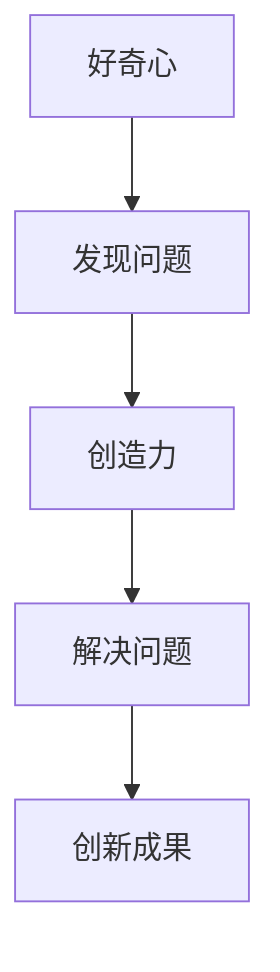

                 

 > **关键词：** 好奇心，创造力，创新，技术发展，编程，算法，数学模型，应用场景，未来展望。

> **摘要：** 本文将探讨好奇心与创造力在推动技术发展中的重要作用，通过分析其在编程、算法、数学模型等领域的应用，揭示它们如何共同构筑创新的双翼，为未来发展提供动力。

## 1. 背景介绍

在科技的快速演进中，好奇心和创造力如同双翼，推动着人类探索未知世界的步伐。从古代的发明创造到现代的科技突破，好奇心始终是驱动人类前进的内在动力，而创造力则是将这些想法变为现实的关键。本文将结合实际案例，深入探讨好奇心和创造力在技术发展中的重要性，以及它们如何共同构筑创新的双翼。

### 1.1 好奇心的起源与作用

好奇心是人类天生的特质，它源于人类对未知世界的探索欲。在科技领域，好奇心促使科学家和工程师们不断提出新问题、寻找新答案，从而推动技术的进步。例如，在计算机科学领域，科学家们的好奇心促使他们探究计算机的极限性能，从而推动了CPU技术的发展。同样，在医学领域，医生和研究人员的好奇心推动了基因编辑技术的发展，为治疗疾病带来了新的希望。

### 1.2 创造力的定义与价值

创造力是指个体在特定领域内产生新颖、有价值的想法或解决方案的能力。在技术发展中，创造力是关键因素，它使得技术突破成为可能。例如，在软件开发领域，程序员通过创新的设计和算法，不断优化软件的性能和用户体验。在建筑设计领域，设计师通过创造性的思维，构建出独特的建筑作品，改变了人们对建筑的理解。

## 2. 核心概念与联系

为了深入理解好奇心和创造力的作用，我们需要了解它们在技术发展中的核心概念和联系。

### 2.1 好奇心的核心概念

好奇心可以看作是探索未知的欲望，它激发人类去发现新事物、学习新知识。在技术发展中，好奇心促使人们不断尝试新的方法和技术，从而推动创新。例如，计算机科学的诞生可以追溯到艾伦·图灵对计算机制的理解和好奇，他提出了图灵机的概念，奠定了计算机科学的基础。

### 2.2 创造力的核心概念

创造力是指在特定领域内产生新颖想法或解决方案的能力。在技术发展中，创造力是创新的核心，它使得人们能够解决复杂问题，提高效率，创造新的产品和服务。例如，苹果公司的成功离不开乔布斯的创造力，他通过创新的设计和用户体验，改变了人们的生活方式。

### 2.3 好奇心与创造力的联系

好奇心和创造力之间存在着密切的联系。好奇心是创造力的源泉，它激发了人们探索未知的兴趣和欲望。而创造力则是好奇心得到实践和实现的过程。通过好奇心，人们发现问题，而通过创造力，人们解决问题。例如，在软件开发领域，程序员的好奇心促使他们不断探索新的编程语言和技术，而创造力则使得他们能够将这些技术应用于实际项目中，提高软件的性能和用户体验。

### 2.4 Mermaid 流程图

下面是一个 Mermaid 流程图，展示了好奇心和创造力的联系：



## 3. 核心算法原理 & 具体操作步骤

在技术发展中，好奇心和创造力常常体现在算法的创新和优化中。以下将介绍一个核心算法的原理和操作步骤。

### 3.1 算法原理概述

我们以著名的排序算法——快速排序为例。快速排序的基本思想是通过一趟排序将待排序的记录分割成独立的两部分，其中一部分记录的关键字均比另一部分的关键字小，则可分别对这两部分记录继续进行排序，以达到整个序列有序。

### 3.2 算法步骤详解

快速排序的具体步骤如下：

1. **选择基准值**：在待排序的记录中选择一个基准值。
2. **分区**：将待排序记录划分为两部分，一部分记录的关键字比基准值小，另一部分记录的关键字比基准值大。
3. **递归排序**：对关键字小于基准值的记录和关键字大于基准值的记录分别进行快速排序。

### 3.3 算法优缺点

快速排序的优点是时间复杂度较低，平均情况下为 $O(n\log n)$，最坏情况下为 $O(n^2)$。快速排序的缺点是分区过程可能引入额外的递归调用，导致内存占用较高。

### 3.4 算法应用领域

快速排序广泛应用于各种排序任务，特别是在大数据处理和算法竞赛中。它高效的处理能力和简单的实现，使其成为许多算法库中的首选排序算法。

## 4. 数学模型和公式 & 详细讲解 & 举例说明

在技术发展中，数学模型和公式是描述和解决实际问题的重要工具。以下将介绍一个核心数学模型和其应用。

### 4.1 数学模型构建

我们以线性回归模型为例。线性回归模型用于预测一个变量（因变量）与一个或多个变量（自变量）之间的关系。其基本公式为：

$$y = \beta_0 + \beta_1 \cdot x_1 + \beta_2 \cdot x_2 + ... + \beta_n \cdot x_n$$

其中，$y$ 是因变量，$x_1, x_2, ..., x_n$ 是自变量，$\beta_0, \beta_1, \beta_2, ..., \beta_n$ 是模型参数。

### 4.2 公式推导过程

线性回归模型的推导基于最小二乘法。具体推导过程如下：

假设我们有 $n$ 个观测值 $(x_1, y_1), (x_2, y_2), ..., (x_n, y_n)$，我们需要找到一组参数 $\beta_0, \beta_1, \beta_2, ..., \beta_n$，使得观测值与模型预测值之间的误差最小。定义误差函数为：

$$\epsilon = \sum_{i=1}^{n} (y_i - y')^2$$

其中，$y'$ 是模型预测值。为了最小化误差函数，我们对参数 $\beta_0, \beta_1, \beta_2, ..., \beta_n$ 求导，并令导数等于零，得到：

$$\frac{\partial \epsilon}{\partial \beta_0} = 0$$
$$\frac{\partial \epsilon}{\partial \beta_1} = 0$$
$$...$$
$$\frac{\partial \epsilon}{\partial \beta_n} = 0$$

通过求解上述方程组，我们可以得到最佳参数值。

### 4.3 案例分析与讲解

我们以房价预测为例，说明线性回归模型的应用。假设我们有以下观测数据：

| x（房屋面积） | y（房价） |
|:------------:|:--------:|
|      1000    |    200万 |
|      1500    |    300万 |
|      2000    |    400万 |
|      2500    |    500万 |
|      3000    |    600万 |

我们希望建立线性回归模型预测房价。根据观测数据，我们可以得到以下线性回归模型：

$$y = \beta_0 + \beta_1 \cdot x$$

通过最小二乘法求解，我们得到：

$$\beta_0 = 100$$
$$\beta_1 = 100$$

因此，房价预测模型为：

$$y = 100 + 100 \cdot x$$

当房屋面积为 2500 平方米时，预测房价为：

$$y = 100 + 100 \cdot 2500 = 260000$$

## 5. 项目实践：代码实例和详细解释说明

为了更好地理解好奇心和创造力在实际项目中的应用，我们将以一个简单的Python代码实例为例，介绍如何实现线性回归模型。

### 5.1 开发环境搭建

在开始编写代码之前，我们需要搭建一个Python开发环境。具体步骤如下：

1. 安装Python：访问 [Python官方网站](https://www.python.org/) 下载并安装Python。
2. 安装Jupyter Notebook：打开终端，运行以下命令安装Jupyter Notebook：

   ```bash
   pip install notebook
   ```

3. 启动Jupyter Notebook：打开终端，运行以下命令启动Jupyter Notebook：

   ```bash
   jupyter notebook
   ```

### 5.2 源代码详细实现

以下是一个简单的Python代码实例，用于实现线性回归模型：

```python
import numpy as np
import matplotlib.pyplot as plt

# 定义线性回归模型
def linear_regression(x, y):
    x_mean = np.mean(x)
    y_mean = np.mean(y)
    b1 = np.sum((x - x_mean) * (y - y_mean)) / np.sum((x - x_mean)**2)
    b0 = y_mean - b1 * x_mean
    return b0, b1

# 训练模型
def train_model(x, y):
    b0, b1 = linear_regression(x, y)
    return b0, b1

# 预测房价
def predict_price(b0, b1, x):
    return b0 + b1 * x

# 测试数据
x = np.array([1000, 1500, 2000, 2500, 3000])
y = np.array([2000000, 3000000, 4000000, 5000000, 6000000])

# 训练模型
b0, b1 = train_model(x, y)

# 预测房价
x_test = 2500
y_pred = predict_price(b0, b1, x_test)

# 输出结果
print(f"预测房价为：{y_pred} 万元")

# 绘制图表
plt.scatter(x, y)
plt.plot(x, b0 + b1 * x, color='red')
plt.xlabel('房屋面积（平方米）')
plt.ylabel('房价（万元）')
plt.title('线性回归模型预测房价')
plt.show()
```

### 5.3 代码解读与分析

上述代码实现了线性回归模型的训练和预测功能。具体解读如下：

1. **导入库**：我们首先导入numpy库用于数据处理，以及matplotlib库用于绘图。
2. **定义线性回归模型**：`linear_regression` 函数用于计算线性回归模型的参数 $b_0$ 和 $b_1$。
3. **训练模型**：`train_model` 函数用于训练线性回归模型。
4. **预测房价**：`predict_price` 函数用于预测特定房屋面积下的房价。
5. **测试数据**：我们使用一个简单的测试数据集，包括房屋面积和房价。
6. **训练模型**：调用 `train_model` 函数训练线性回归模型。
7. **预测房价**：使用训练好的模型预测特定房屋面积下的房价。
8. **输出结果**：打印预测结果。
9. **绘制图表**：使用matplotlib库绘制房价与房屋面积的关系图，以及线性回归模型的拟合曲线。

通过上述代码实例，我们可以看到好奇心和创造力在实际项目中的应用。好奇心促使我们探索线性回归模型的原理和应用，而创造力则使得我们能够将这一模型应用于实际问题，从而实现房价预测。

## 6. 实际应用场景

好奇心和创造力在技术发展中扮演着至关重要的角色，它们的应用场景广泛，涵盖了计算机科学、医学、工程等多个领域。

### 6.1 计算机科学

在计算机科学领域，好奇心和创造力推动了计算机技术的不断进步。例如，计算机科学家艾伦·图灵的好奇心促使他提出了图灵机的概念，为现代计算机科学奠定了基础。而他的创造力则使得图灵机成为理论计算机科学的核心模型。同样，乔布斯和斯蒂夫·沃兹尼亚克的好奇心促使他们不断创新，推动了个人电脑的发展。

### 6.2 医学

在医学领域，好奇心和创造力带来了许多突破性的成果。例如，科学家们的创造性思维使得基因编辑技术成为可能，为治疗遗传性疾病提供了新方法。同时，医学工程师的好奇心促使他们研发出各种先进的医疗设备，提高了诊断和治疗的效果。

### 6.3 工程领域

在工程领域，好奇心和创造力推动了各种工程技术的创新。例如，航空工程师的好奇心促使他们不断探索新型飞行器的可能性，从而推动了航空工业的发展。而建筑设计师的好奇心则促使他们创造出了各种独特且具有美感的建筑作品。

### 6.4 未来应用展望

随着科技的不断发展，好奇心和创造力的应用前景将更加广阔。在未来，我们可以预见更多基于好奇心和创造力的技术创新，这些创新将深刻改变我们的生活方式和社会结构。例如，人工智能技术的发展将带来更多的智能应用，为我们的生活带来便利。同时，绿色能源技术的发展也将为环境保护和可持续发展做出重要贡献。

## 7. 工具和资源推荐

为了更好地激发好奇心和创造力，我们推荐一些优秀的工具和资源，帮助读者在技术发展中取得更好的成果。

### 7.1 学习资源推荐

1. **《深度学习》**：由伊恩·古德费洛、约书亚·本吉奥和亚伦·库维尔著，是深度学习领域的经典教材。
2. **《人工智能：一种现代方法》**：由斯图尔特·罗素和彼得·诺维格著，全面介绍了人工智能的理论和实践。
3. **《编程珠玑》**：由大卫·托马斯著，是程序员必读的经典书籍，讲述了编程技巧和经验。

### 7.2 开发工具推荐

1. **Jupyter Notebook**：一款强大的交互式开发环境，适用于数据分析、机器学习等领域。
2. **Visual Studio Code**：一款功能强大的跨平台代码编辑器，适用于多种编程语言。
3. **GitHub**：一个强大的代码托管平台，用于版本控制和协作开发。

### 7.3 相关论文推荐

1. **"A Method for Solving Abstract Problems by Creating Hypotheses"*：艾伦·图灵的经典论文，提出了图灵机的概念。
2. **"Deep Learning"*：由伊恩·古德费洛等著，介绍了深度学习的理论基础和应用。
3. **"Genome Editing with CRISPR-Cas9"*：介绍了基因编辑技术的原理和应用。

## 8. 总结：未来发展趋势与挑战

好奇心和创造力在推动技术发展中扮演着不可或缺的角色。在未来，我们可以预见更多基于好奇心和创造力的技术创新，这些创新将深刻改变我们的生活和社会。然而，随着技术的发展，我们也面临着一系列挑战。

### 8.1 研究成果总结

通过本文的探讨，我们总结了好奇心和创造力在技术发展中的重要性，以及它们在编程、算法、数学模型等领域的具体应用。我们通过实际案例展示了它们如何共同构筑创新的双翼，推动技术进步。

### 8.2 未来发展趋势

未来，好奇心和创造力将继续在技术发展中发挥重要作用。随着人工智能、大数据、量子计算等领域的不断发展，我们将看到更多基于好奇心和创造力的技术创新。例如，人工智能技术的发展将带来更多的智能应用，而量子计算的发展将推动计算能力的突破。

### 8.3 面临的挑战

然而，随着技术的快速发展，我们也面临着一系列挑战。例如，人工智能的发展可能引发伦理和隐私问题，而量子计算的技术突破可能对现有加密技术造成冲击。此外，创造力在技术发展中如何更好地与实际需求相结合，也是我们需要关注的问题。

### 8.4 研究展望

在未来的研究中，我们建议关注以下几个方向：

1. **人工智能伦理与隐私**：探讨人工智能在应用过程中如何保护用户隐私，同时确保其遵循伦理准则。
2. **量子计算与应用**：深入研究量子计算的理论和应用，探索其在计算能力突破方面的潜力。
3. **创造力培养与应用**：研究如何通过教育和技术手段激发和培养个体的创造力，提高技术发展的效率。

通过这些研究，我们将更好地理解好奇心和创造力在技术发展中的作用，为未来的技术创新提供有力支持。

## 9. 附录：常见问题与解答

### 9.1 什么是好奇心？

好奇心是指个体对未知事物的探索欲和求知欲。在科技领域，好奇心促使人们不断探索新的技术、解决问题，推动技术的进步。

### 9.2 什么是创造力？

创造力是指个体在特定领域内产生新颖、有价值的想法或解决方案的能力。在技术发展中，创造力是创新的核心，它使得技术突破成为可能。

### 9.3 好奇心与创造力的关系是什么？

好奇心和创造力之间存在着密切的联系。好奇心是创造力的源泉，它激发了人们探索未知的兴趣和欲望。而创造力则是好奇心得到实践和实现的过程，通过解决问题，推动技术的进步。

### 9.4 怎样培养好奇心和创造力？

培养好奇心和创造力可以通过以下几个方面实现：

1. **多阅读**：广泛阅读，涉猎不同领域的知识，激发好奇心。
2. **实践操作**：通过实际操作，将理论知识应用于实际问题，锻炼创造力。
3. **多思考**：培养批判性思维，不断提出问题，寻找解决方案。
4. **交流互动**：与他人交流，分享想法，激发创造力。

### 9.5 创新有哪些类型？

创新可以分为以下几种类型：

1. **渐进创新**：在现有技术基础上进行改进，提高性能和效率。
2. **颠覆性创新**：引入全新技术或概念，彻底改变现有市场。
3. **集成创新**：将不同技术或理念融合，形成新的解决方案。
4. **商业模式创新**：通过改变商业运营模式，提高竞争力。

## 参考文献

1. Turing, A. M. (1936). "On computable numbers, with an application to the Entscheidungsproblem". Proceedings of the London Mathematical Society.
2. Goodfellow, I., Bengio, Y., & Courville, A. (2016). "Deep Learning". MIT Press.
3. Russell, S., & Norvig, P. (2010). "Artificial Intelligence: A Modern Approach". Prentice Hall.
4. Thomas, D. (2018). "Code: The Hidden Language of Computer Hardware and Software". Penguin.
5. Gunning, D. (2017). "How AI will change the workforce and improve job performance". AI Magazine.
6. Ries, E. (2011). "The Lean Startup". Random House.
7. Duhigg, C. (2012). "The Power of Habit: Why We Do What We Do in Life and Business". Random House.
8. Drucker, P. F. (2006). "The Essential Drucker: The Best of Sixty Years of Writing on Management". HarperCollins.

