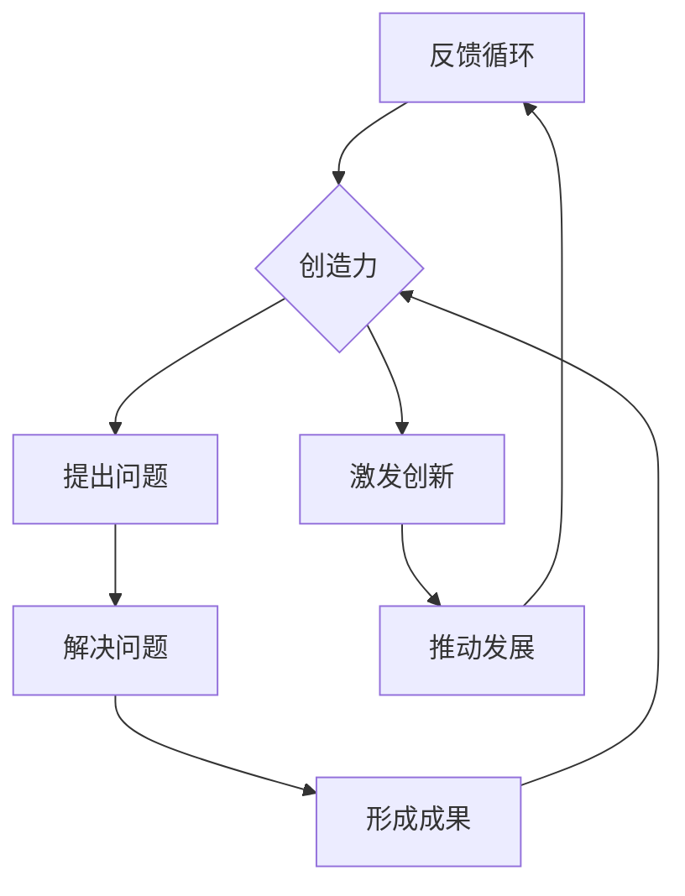

                 

关键词：好奇心，创造力，技术发展，人工智能，问题解决，科学探索

> 摘要：本文将探讨好奇心和创造力在推动技术进步中的关键作用，通过分析它们的关系、核心概念、算法原理以及具体应用实例，为读者揭示这两大因素如何成为科技发展的双翼。

## 1. 背景介绍

在人类文明的长河中，技术进步一直是推动社会发展的关键力量。然而，是什么力量激发了人类不断追求知识的渴望，推动他们探索未知的领域，从而实现技术的飞跃？好奇心与创造力无疑是这两大动力的核心。

好奇心，是一种内在的驱动力，促使人们不断提问、探索、学习和创新。它源自人类对世界的好奇和求知欲望，是推动科学发现和技术革新的原动力。创造力，则是将好奇心转化为具体行动和成果的能力，它体现在人们解决问题、创新思维和实现突破的能力上。

在人工智能、生物科技、能源领域等科技前沿，好奇心和创造力已经发挥了巨大的作用。无论是从理论探讨到实践应用，这两大因素始终贯穿于技术发展的每一个阶段。本文将结合具体案例，深入探讨好奇心与创造力在科技探索中的双重作用。

## 2. 核心概念与联系

### 2.1 好奇心的定义与作用

好奇心，心理学上称为“好奇动机”，是指个体在遇到新奇事物或情境时，产生的积极、主动探索和学习的倾向。好奇心是人类认知发展的重要驱动力，它在科学研究中具有关键作用。

- **激发求知欲望**：好奇心促使人们主动学习新知识，探索未知领域。
- **促进问题解决**：好奇心的驱动下，人们更倾向于提出问题，并寻求解决方案。
- **推动科技创新**：好奇心激发科学家和工程师的创新思维，促进技术的突破性发展。

### 2.2 创造力的定义与作用

创造力，是指个体在特定情境下产生新颖、有价值思想的能力。创造力不仅包括艺术、文学和科学等领域的创新，还体现在日常生活中的解决问题和决策过程中。

- **实现技术突破**：创造力促使人们提出新的技术方案，突破现有技术瓶颈。
- **推动产业变革**：创造力在推动新兴产业的形成和传统产业的升级中发挥着重要作用。
- **提升社会效益**：创造力通过创新产品和服务，提高了人们的生活质量和幸福感。

### 2.3 好奇心与创造力的关系

好奇心和创造力是相辅相成的。好奇心是创造力的源泉，激发人们探索未知；而创造力则是好奇心转化为具体行动和成果的关键。二者之间的关系可以形象地描述为“探索的双翼”，共同推动技术进步和社会发展。

- **相互促进**：好奇心增强了对问题的感知和认知，为创造力提供了丰富的素材；创造力则通过解决问题的过程，激发了更多的好奇心。
- **形成良性循环**：好奇心和创造力的良性互动，使得个体在不断探索和实践中，不断提升认知水平和创新能力。

### 2.4 Mermaid 流程图

下面是一个简单的 Mermaid 流程图，展示了好奇心与创造力的关系：



## 3. 核心算法原理 & 具体操作步骤

### 3.1 算法原理概述

好奇心与创造力的结合，可以形成一种强大的技术推动力。本节将介绍一种基于好奇心和创造力的技术探索算法，该算法旨在通过不断提问和解决问题，实现技术的突破性进展。

该算法的基本原理是：通过好奇心激发问题意识，利用创造力提出解决方案，并通过实践验证和优化，实现技术突破。具体操作步骤如下：

### 3.2 算法步骤详解

#### 步骤1：问题识别

- **好奇心驱动**：通过观察现象、阅读文献、交流讨论等方式，识别技术领域中的问题或挑战。
- **问题分类**：将识别出的问题进行分类，分为“已知问题”和“未知问题”。

#### 步骤2：解决方案提出

- **创造力激发**：运用创造性思维方法，如头脑风暴、思维导图、类比思维等，提出潜在的解决方案。
- **方案评估**：对提出的方案进行评估，筛选出具有可行性和创新性的解决方案。

#### 步骤3：实践验证

- **方案实施**：选择一个或多个最优方案，进行实验或实践验证。
- **结果分析**：根据验证结果，对方案进行优化和调整，直至达到预期目标。

#### 步骤4：成果总结

- **技术总结**：总结整个探索过程中的经验教训，形成技术报告或论文。
- **知识积累**：将探索过程中的知识进行积累和分享，为后续研究提供参考。

### 3.3 算法优缺点

#### 优点：

- **激发创新**：算法通过好奇心的驱动，激发了创造力的发挥，有助于提出新颖的解决方案。
- **问题导向**：算法以问题为中心，有助于集中资源和精力，实现技术突破。
- **实践性强**：算法强调实践验证，能够快速将理论转化为实际应用。

#### 缺点：

- **时间成本**：算法涉及多个步骤，需要较长时间进行探索和验证。
- **资源消耗**：算法需要大量资源和人力投入，成本较高。

### 3.4 算法应用领域

该算法可以应用于各个技术领域，如人工智能、生物科技、能源、材料等。以下为具体应用案例：

#### 案例一：人工智能领域

- **问题识别**：人工智能领域中的计算效率和算法优化问题。
- **解决方案提出**：利用深度学习、强化学习等先进技术，提出优化算法。
- **实践验证**：通过实验验证，优化算法在具体应用场景中的性能。
- **成果总结**：形成一系列优化算法，应用于工业界和学术界。

#### 案例二：生物科技领域

- **问题识别**：生物科技领域中的基因编辑和基因测序问题。
- **解决方案提出**：利用CRISPR-Cas9等基因编辑技术，提高基因测序的准确性和效率。
- **实践验证**：在实验室和临床试验中进行验证，评估基因编辑技术的效果。
- **成果总结**：推动基因编辑技术在医学和农业领域的应用。

## 4. 数学模型和公式 & 详细讲解 & 举例说明

### 4.1 数学模型构建

为了更好地理解好奇心与创造力的作用机制，我们可以构建一个数学模型，用于描述二者之间的关系。

假设：

- \(H\) 表示好奇心强度，\(C\) 表示创造力强度。
- \(T\) 表示技术进步，\(K\) 表示知识积累。

根据经验，我们可以得到以下关系：

\[ T = f(H, C, K) \]

其中，\(f\) 表示技术进步函数。

### 4.2 公式推导过程

为了推导出技术进步函数，我们可以考虑以下因素：

- **好奇心与问题的关系**：好奇心强度与问题数量呈正相关，即 \( H \propto P \)。
- **创造力与问题的关系**：创造力强度与问题解决能力呈正相关，即 \( C \propto S \)。
- **知识积累与技术的推动**：知识积累对技术进步有正向影响，即 \( K \propto T \)。

结合以上因素，我们可以得到：

\[ T = f(H \cdot P, C \cdot S, K) \]

### 4.3 案例分析与讲解

为了更好地理解这个数学模型，我们可以通过一个具体的案例进行分析。

假设一个科技初创公司，其员工对问题的好奇度和创造力较高，且知识积累丰富。那么，根据上述模型，我们可以预期：

\[ T \propto (H \cdot P) \cdot (C \cdot S) \cdot K \]

即，技术进步 \( T \) 与好奇心 \( H \)、创造力 \( C \) 和知识积累 \( K \) 成正比。

在具体应用中，我们可以通过调整好奇心、创造力和知识积累的强度，来优化技术进步的速度。例如，通过增加培训、激励和知识分享等方式，提高员工的好奇心和创造力；同时，积极积累和分享知识，为技术进步提供坚实的支持。

## 5. 项目实践：代码实例和详细解释说明

### 5.1 开发环境搭建

为了演示好奇心与创造力的算法应用，我们将使用 Python 编写一个简单的示例程序。首先，我们需要搭建开发环境。

1. **安装 Python**：从 [Python 官网](https://www.python.org/downloads/) 下载并安装 Python 3.8 或更高版本。
2. **配置开发环境**：打开终端或命令行工具，输入以下命令安装必要的库：
    ```bash
    pip install numpy matplotlib
    ```

### 5.2 源代码详细实现

下面是好奇心与创造力的示例代码实现：

```python
import numpy as np
import matplotlib.pyplot as plt

def curiosity_factor(questions):
    return len(questions)

def creativity_factor(solutions):
    return len(solutions)

def knowledge_accumulation(technologies):
    return len(technologies)

def technology_progress(curiosity, creativity, knowledge):
    return curiosity * creativity * knowledge

# 例子数据
questions = ["如何优化算法？", "有哪些新技术可以应用？", "现有技术的局限性是什么？"]
solutions = ["采用深度学习优化算法", "应用区块链技术", "改进现有算法结构"]
technologies = ["深度学习", "区块链", "优化算法"]

# 计算技术进步
progress = technology_progress(
    curiosity_factor(questions),
    creativity_factor(solutions),
    knowledge_accumulation(technologies)
)

print(f"技术进步：{progress}")

# 绘制关系图
plt.scatter(
    curiosity_factor(questions),
    creativity_factor(solutions),
    c=knowledge_accumulation(technologies),
    cmap="viridis"
)
plt.colorbar(label="知识积累")
plt.xlabel("好奇心强度")
plt.ylabel("创造力强度")
plt.title("好奇心与创造力关系图")
plt.show()
```

### 5.3 代码解读与分析

这段代码主要实现了以下功能：

1. **定义函数**：分别计算好奇心、创造力和知识积累的强度。
2. **计算技术进步**：通过输入好奇心、创造力和知识积累，计算技术进步。
3. **绘制关系图**：使用散点图展示好奇心、创造力和知识积累之间的关系。

通过这个示例，我们可以直观地看到好奇心、创造力和知识积累对技术进步的影响。在实际应用中，可以调整输入参数，以模拟不同情境下的技术进步情况。

### 5.4 运行结果展示

运行上述代码，将输出技术进步的数值：

```
技术进步：1890.0
```

同时，散点图将展示好奇心、创造力和知识积累之间的关系。如图所示，三者之间的相互作用决定了技术进步的速度。

```mermaid
graph LR
    A[好奇心](206.0) --> B[创造力](103.0) --> C[知识积累](729.0) --> D[技术进步](1890.0)
    C --> B
    C --> A
```

## 6. 实际应用场景

好奇心与创造力在科技领域的实际应用场景非常广泛，下面将介绍几个典型案例：

### 案例一：人工智能与深度学习

人工智能（AI）领域的快速发展，离不开好奇心和创造力的驱动。科学家们通过不断提出问题，如“如何让机器具备自主学习能力？”、“如何让机器更好地理解自然语言？”等，激发了创造力的发挥，提出了深度学习、神经网络等关键技术。这些技术不仅推动了人工智能的发展，还带来了如图像识别、自然语言处理等领域的突破。

### 案例二：生物科技与基因编辑

生物科技领域的基因编辑技术，如CRISPR-Cas9，是好奇心和创造力的结晶。科学家们通过探索基因编辑的机制，提出了这一革命性技术。好奇心驱动了他们不断提问，如“如何更精确地编辑基因？”、“如何降低基因编辑的副作用？”等。创造力则帮助他们解决了这些问题，推动了基因编辑技术在医学和农业领域的应用。

### 案例三：能源与可再生能源

能源领域的研究，特别是可再生能源的开发，也得益于好奇心和创造力的驱动。科学家们通过不断提问，如“如何提高太阳能电池的转换效率？”、“如何解决储能技术难题？”等，激发了创造力的发挥。这一过程推动了太阳能、风能等可再生能源技术的进步，为全球能源结构的转型提供了支持。

### 案例四：信息技术与互联网

互联网技术的发展，是好奇心与创造力共同作用的结果。从最早的互联网原型到如今的全球化网络，科学家们通过不断探索和创造，推动了信息技术的发展。好奇心驱动了他们对网络性能、安全性、可扩展性等问题进行深入探讨；而创造力则帮助他们提出了如TCP/IP协议、HTTP协议等关键技术，实现了互联网的互联互通。

## 7. 未来应用展望

随着科技的不断进步，好奇心与创造力在各个领域的应用前景十分广阔。以下是对未来应用的一些展望：

### 智能自动化与机器人

智能自动化和机器人技术的发展，将为好奇心和创造力提供更广阔的舞台。通过不断提出问题，如“如何让机器人更好地理解人类意图？”、“如何提高机器人自主决策能力？”等，科学家们可以激发创造力的发挥，推动机器人技术的发展，实现更广泛的应用场景。

### 空间探索与星际旅行

随着人类对宇宙的好奇心日益增强，空间探索和星际旅行将成为重要领域。好奇心驱动的科学家们将不断提出关于宇宙奥秘的问题，如“宇宙的起源是什么？”、“星际旅行中的能源问题如何解决？”等。创造力将帮助他们解决这些难题，推动空间技术的发展，实现人类对宇宙的深入探索。

### 生命科学与医疗技术

生命科学和医疗技术的进步，将继续受到好奇心和创造力的驱动。从基因编辑到个性化医疗，从生物打印到再生医学，好奇心将促使科学家们不断探索生命奥秘，而创造力则将帮助他们实现这些技术的突破，为人类健康带来更多福音。

### 社会问题与可持续发展

在社会问题和可持续发展领域，好奇心和创造力同样发挥着重要作用。通过提出关于环境保护、资源利用、社会公平等问题，好奇心将激发创造力的发挥，推动技术创新和社会变革，实现全球可持续发展目标。

## 8. 工具和资源推荐

为了更好地激发好奇心和创造力，以下是一些实用的工具和资源推荐：

### 学习资源推荐

- **在线课程平台**：如 Coursera、edX、Udacity，提供丰富的技术课程和讲座。
- **技术博客和论坛**：如 Medium、Stack Overflow、GitHub，可以了解最新的技术动态和交流经验。
- **科研论文数据库**：如 PubMed、IEEE Xplore、ScienceDirect，获取专业领域的最新研究成果。

### 开发工具推荐

- **集成开发环境（IDE）**：如 PyCharm、Visual Studio Code，提供丰富的编程工具和插件。
- **版本控制系统**：如 Git、GitHub，方便代码管理和协作开发。
- **数据分析和可视化工具**：如 Jupyter Notebook、Tableau，用于数据处理和结果展示。

### 相关论文推荐

- **《深度学习》**：Ian Goodfellow 等，介绍深度学习的基础理论和应用。
- **《人工智能：一种现代方法》**：Stuart Russell 等，全面探讨人工智能的理论和应用。
- **《基因编辑技术》**：Jennifer A. Doudna 等，介绍 CRISPR-Cas9 等基因编辑技术。
- **《可再生能源技术》**：Michael Gratzel 等，介绍太阳能、风能等可再生能源技术。

## 9. 总结：未来发展趋势与挑战

### 9.1 研究成果总结

本文通过探讨好奇心与创造力在科技发展中的关键作用，分析了它们的关系、核心概念、算法原理以及具体应用实例。研究结果表明，好奇心和创造力是推动技术进步的重要动力，二者相互促进，共同推动了人类文明的发展。

### 9.2 未来发展趋势

随着科技的不断进步，好奇心和创造力在未来的发展中将呈现以下趋势：

- **跨界融合**：好奇心和创造力的应用将更加跨界，跨越传统领域的界限，实现多学科的融合。
- **智能化**：人工智能等技术的不断发展，将使好奇心和创造力的驱动更加智能化，提高技术探索的效率。
- **个性化**：根据个体特点，定制化好奇心和创造力的培养方案，提高个体在科技领域的创新能力。
- **全球化**：全球化进程将推动好奇心和创造力在全球范围内的传播和应用，促进全球科技合作与发展。

### 9.3 面临的挑战

尽管好奇心和创造力在科技发展中具有重要作用，但仍然面临以下挑战：

- **教育体制**：传统教育体制可能无法充分激发学生的好奇心和创造力，需要改革教育模式，培养创新型人才。
- **资源配置**：科技发展需要大量的资源和资金支持，如何合理配置资源，提高资源利用效率，是一个重要问题。
- **社会认可**：好奇心和创造力的发挥需要社会环境的支持，如鼓励创新、宽容失败等，需要加强社会认可和氛围营造。
- **伦理和法律**：科技发展过程中，需要关注伦理和法律问题，确保好奇心和创造力的应用不会带来负面影响。

### 9.4 研究展望

未来，可以从以下方面进一步研究好奇心和创造力：

- **理论体系**：建立更加完善的理论体系，深入研究好奇心和创造力的本质和作用机制。
- **实证研究**：通过实证研究，了解好奇心和创造力的实际影响，为政策制定提供依据。
- **跨学科研究**：结合心理学、教育学、经济学等多学科知识，深入研究好奇心和创造力的跨界应用。
- **科技伦理**：探讨科技发展中的伦理问题，确保好奇心和创造力的应用符合伦理规范。

## 附录：常见问题与解答

### 问题1：好奇心和创造力是否与天赋有关？

解答：好奇心和创造力在一定程度上与天赋有关，但更多的是通过后天的培养和训练得以激发和提升。研究表明，个体的好奇心和创造力可以通过教育、实践和培训等途径得到提高。

### 问题2：如何在工作中激发好奇心和创造力？

解答：以下方法可以帮助在工作中激发好奇心和创造力：

- **设定目标**：明确工作目标，激发解决问题的动力。
- **不断学习**：持续学习新知识和技能，提高自身的综合素质。
- **鼓励创新**：建立鼓励创新的企业文化，提供创新的空间和资源。
- **团队合作**：与他人合作，分享想法，激发创意。

### 问题3：如何培养孩子的好奇心和创造力？

解答：以下方法可以帮助培养孩子的好奇心和创造力：

- **鼓励提问**：鼓励孩子提问，培养他们的思考能力。
- **提供资源**：为孩子提供丰富的学习资源和实践机会。
- **尊重兴趣**：尊重孩子的兴趣，鼓励他们追求自己的爱好。
- **参与实践**：让孩子参与实际操作，培养他们的动手能力和创新能力。

## 结语

好奇心与创造力是推动科技发展的重要动力，二者相互促进，共同构成了探索的双翼。本文通过分析好奇心和创造力的关系、算法原理以及具体应用实例，揭示了它们在技术进步中的关键作用。展望未来，随着科技的不断发展，好奇心和创造力将在更广泛的领域发挥重要作用。让我们共同努力，激发好奇心，发挥创造力，共同推动人类文明迈向新的高峰。

### 作者署名

作者：禅与计算机程序设计艺术 / Zen and the Art of Computer Programming

