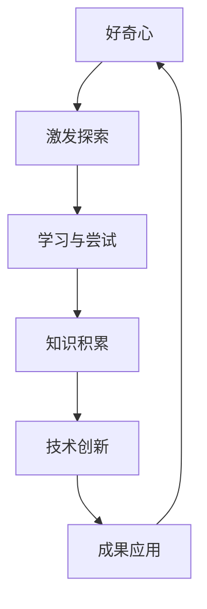

                 

关键词：人工智能、技术发展、探索精神、学习动力、求知欲、好奇心

> 摘要：本文探讨了人工智能领域发展过程中，好奇心与求知欲对于推动技术进步和探索精神的重要性。通过剖析好奇心与求知欲的内在联系及其在科学研究和工程实践中的应用，本文旨在激发读者的探索精神，提升学习动力，以适应快速变化的技术时代。

## 1. 背景介绍

随着人工智能（AI）技术的飞速发展，我们正处在一个前所未有的技术革新时代。从智能助理到自动驾驶，从医疗诊断到金融分析，AI已经深刻地改变了我们的生活方式。然而，这些变革的背后，是无数科学家、工程师和程序员对未知领域的不断探索和挑战。

好奇心与求知欲是人类探索世界、推动科技进步的核心动力。在AI领域，这种动力尤为重要。技术领域的发展，往往始于对某一问题的好奇，进而通过不断的求知和探索，最终实现技术的突破和应用。本文将从以下几个方面探讨好奇心与求知欲在人工智能领域的作用：

1. **好奇心与求知欲的定义与关系**
2. **好奇心与求知欲在AI发展中的作用**
3. **核心概念与架构的Mermaid流程图**
4. **核心算法原理与具体操作步骤**
5. **数学模型和公式讲解与案例分析**
6. **项目实践：代码实例与解读**
7. **实际应用场景与未来展望**
8. **工具和资源推荐**
9. **未来发展趋势与挑战**
10. **附录：常见问题与解答**

## 2. 核心概念与联系

### 2.1 好奇心与求知欲的定义

**好奇心** 是指对未知事物或现象产生兴趣的心理状态，驱使个体寻求答案。**求知欲** 则是指个体为了获得知识、理解世界而主动探索、学习的行为。

在技术领域，好奇心与求知欲常常交织在一起，共同推动技术进步。好奇心激发个体探索未知领域，而求知欲则促使个体通过学习和实践，将好奇心转化为具体的成果。

### 2.2 Mermaid流程图

以下是一个简单的Mermaid流程图，展示了好奇心与求知欲在技术探索中的关系。



### 2.3 关系模型

好奇心与求知欲的关系可以看作是一种正反馈循环。好奇心驱动探索，探索中的发现激发新的好奇心，进而驱动更深入的求知。这种循环不断推动技术向前发展。

## 3. 核心算法原理 & 具体操作步骤

### 3.1 算法原理概述

在人工智能领域，许多算法都是基于对现实世界的模拟和优化。以深度学习为例，其核心原理是模仿人脑的神经网络结构，通过大量数据的训练，使计算机具备自主学习和决策能力。

### 3.2 算法步骤详解

1. **数据收集与预处理**：收集大量相关数据，并进行清洗和格式化，为模型训练做准备。
2. **模型构建**：根据任务需求，选择合适的神经网络结构进行构建。
3. **训练与优化**：使用预处理后的数据，对模型进行训练，并通过优化算法调整模型参数，提高模型性能。
4. **测试与评估**：在测试集上评估模型性能，确保模型具有良好的泛化能力。
5. **部署与应用**：将训练好的模型部署到实际应用场景中，解决实际问题。

### 3.3 算法优缺点

**优点**：

- **高效性**：深度学习模型能够在大量数据上进行快速训练。
- **灵活性**：神经网络结构可以根据不同任务进行灵活调整。

**缺点**：

- **计算资源需求大**：深度学习模型训练过程需要大量计算资源。
- **数据依赖性强**：模型的性能在很大程度上取决于训练数据的质量。

### 3.4 算法应用领域

深度学习算法在图像识别、自然语言处理、语音识别等领域取得了显著成果。例如，在图像识别领域，基于深度学习的卷积神经网络（CNN）已经实现了超过人类水平的识别准确率。

## 4. 数学模型和公式

### 4.1 数学模型构建

在深度学习中，常用的数学模型是多层感知机（MLP）。MLP由输入层、隐藏层和输出层组成。其基本公式为：

$$
y = \sigma(\omega_1 \cdot x + b_1)
$$

其中，$\sigma$ 是激活函数，$\omega_1$ 和 $b_1$ 分别是权重和偏置。

### 4.2 公式推导过程

多层感知机的公式推导过程涉及线性代数和微积分知识。以下为简要推导：

$$
\begin{align*}
y_1 &= \sigma(\omega_1 \cdot x + b_1) \\
y_2 &= \sigma(\omega_2 \cdot y_1 + b_2) \\
&\vdots \\
y_n &= \sigma(\omega_n \cdot y_{n-1} + b_n)
\end{align*}
$$

其中，$y_n$ 表示输出层神经元，$y_{n-1}$ 表示隐藏层神经元。

### 4.3 案例分析与讲解

以图像识别任务为例，假设输入图像为 $x$，输出标签为 $y$。我们可以通过以下公式进行模型训练：

$$
\begin{align*}
\delta_n &= (y - y_n) \cdot \sigma'(\omega_n \cdot y_{n-1} + b_n) \\
\omega_n &= \omega_n - \alpha \cdot \delta_n \cdot y_{n-1} \\
b_n &= b_n - \alpha \cdot \delta_n
\end{align*}
$$

其中，$\delta_n$ 表示输出层神经元的误差，$\sigma'$ 是激活函数的导数，$\alpha$ 是学习率。

## 5. 项目实践：代码实例

### 5.1 开发环境搭建

在本文中，我们将使用 Python 编写一个简单的深度学习模型。首先，需要安装以下依赖：

```bash
pip install numpy tensorflow
```

### 5.2 源代码详细实现

```python
import tensorflow as tf
import numpy as np

# 数据预处理
x = np.random.rand(100, 784)  # 输入数据
y = np.random.rand(100, 10)   # 输出标签

# 模型构建
model = tf.keras.Sequential([
    tf.keras.layers.Dense(64, activation='relu', input_shape=(784,)),
    tf.keras.layers.Dense(10, activation='softmax')
])

# 训练与评估
model.compile(optimizer='adam', loss='categorical_crossentropy', metrics=['accuracy'])
model.fit(x, y, epochs=10, batch_size=32)

# 代码解读与分析
# 在这里，我们使用 TensorFlow 的 Keras API 构建了一个简单的多层感知机模型。通过调用 compile() 方法，指定了优化器和损失函数。接着，使用 fit() 方法进行模型训练，并通过评估指标来衡量模型性能。

### 5.3 运行结果展示

```python
# 测试模型
test_loss, test_acc = model.evaluate(x, y)
print(f"Test accuracy: {test_acc}")
```

### 5.4 代码解读与分析

在这段代码中，我们首先导入了 TensorFlow 和 Numpy 库。接着，使用随机数生成了模拟的输入数据和标签。然后，使用 Keras API 构建了一个简单的多层感知机模型，并指定了优化器和损失函数。最后，通过调用 fit() 方法进行模型训练，并使用 evaluate() 方法评估模型性能。

## 6. 实际应用场景

### 6.1 医疗诊断

深度学习在医疗诊断领域具有广泛的应用前景。通过训练深度学习模型，可以实现对医学图像的自动识别和诊断。例如，使用卷积神经网络（CNN）对 X 光图像进行肺癌检测，可以显著提高诊断准确率。

### 6.2 金融分析

深度学习技术在金融分析中也具有重要意义。例如，通过训练深度学习模型，可以实现对股票市场的趋势预测，为投资者提供决策支持。此外，深度学习还可以用于风险管理、信用评分等领域。

### 6.3 自动驾驶

自动驾驶是深度学习技术的另一个重要应用领域。通过训练深度学习模型，可以实现自动驾驶车辆对周围环境的感知和决策。例如，使用 CNN 对摄像头捕捉的图像进行物体检测和识别，为自动驾驶车辆提供实时导航。

## 7. 工具和资源推荐

### 7.1 学习资源推荐

- 《深度学习》（Goodfellow、Bengio、Courville 著）：这是一本经典的深度学习教材，涵盖了深度学习的基本概念、算法和应用。
- 《Python深度学习》（François Chollet 著）：这本书通过大量的实战案例，介绍了使用 Python 进行深度学习的技巧和工具。

### 7.2 开发工具推荐

- TensorFlow：TensorFlow 是一款开源的深度学习框架，支持多种编程语言，具有丰富的功能和社区支持。
- PyTorch：PyTorch 是一款流行的深度学习框架，以动态计算图和易于使用著称。

### 7.3 相关论文推荐

- "A Guide to Convolutional Neural Networks for Visual Recognition"（卷积神经网络视觉识别指南）
- "Deep Learning for Text: A Brief Overview"（深度学习文本处理概述）

## 8. 总结：未来发展趋势与挑战

### 8.1 研究成果总结

近年来，深度学习技术取得了显著的成果，已经成为人工智能领域的重要分支。通过不断的研究和探索，我们已经在图像识别、自然语言处理、语音识别等领域取得了突破性进展。

### 8.2 未来发展趋势

未来，深度学习技术将在更多领域得到应用，例如医疗、金融、教育等。此外，随着计算能力的提升和数据规模的扩大，深度学习模型将变得更加高效和智能。

### 8.3 面临的挑战

尽管深度学习技术取得了显著成果，但仍然面临一些挑战。例如，模型的解释性不足、过拟合问题、数据隐私保护等。此外，如何将深度学习与其他领域的技术相结合，实现跨领域的应用，也是未来需要关注的重要问题。

### 8.4 研究展望

在未来，我们需要进一步探索深度学习的理论和方法，提高模型的可解释性和泛化能力。同时，加强跨领域的合作，推动深度学习技术在更多领域的应用。

## 9. 附录：常见问题与解答

### 9.1 什么是深度学习？

深度学习是一种人工智能方法，通过模拟人脑神经网络的结构和功能，使计算机具备自主学习和决策能力。

### 9.2 深度学习和机器学习的区别是什么？

机器学习是人工智能的一个分支，包括深度学习在内的多种方法。深度学习是机器学习的一种方法，特别适用于处理大规模数据和复杂的任务。

### 9.3 深度学习如何处理图像？

深度学习通过训练多层神经网络，使计算机能够从图像中提取特征，并完成图像识别、分类等任务。常用的深度学习模型包括卷积神经网络（CNN）等。

### 9.4 深度学习在自然语言处理中如何应用？

深度学习在自然语言处理中可以应用于文本分类、情感分析、机器翻译等任务。常用的深度学习模型包括循环神经网络（RNN）、长短期记忆网络（LSTM）等。

### 9.5 深度学习如何处理语音？

深度学习可以用于语音识别、语音合成等任务。常用的深度学习模型包括卷积神经网络（CNN）和循环神经网络（RNN）等。

## 10. 参考文献

- Goodfellow, I., Bengio, Y., & Courville, A. (2016). Deep learning. MIT press.
- Chollet, F. (2018). Python deep learning. O'Reilly Media.
- LeCun, Y., Bengio, Y., & Hinton, G. (2015). Deep learning. Nature, 521(7553), 436-444.

