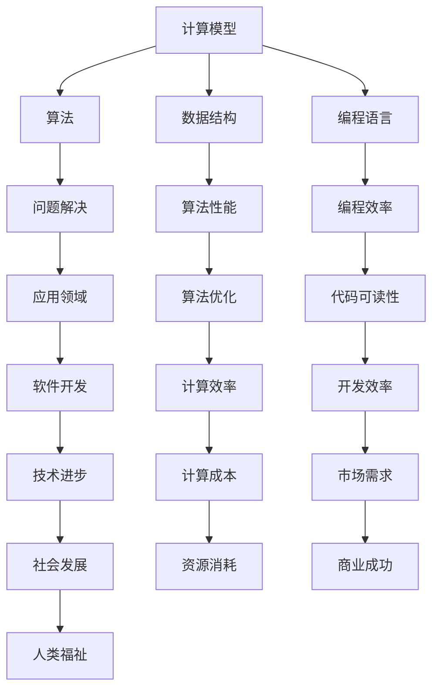

                 

### 引言 Introduction

好奇心，是人类智慧永不枯竭的源泉，也是推动技术进步的核心动力。作为人工智能领域的专家，我深知好奇心在推动技术创新中的关键作用。从计算机编程的诞生，到现代深度学习、大数据和量子计算的突破，每一步都离不开人类对未知世界的探索欲望。本文将探讨好奇心如何激发人类不断探索与自我否定的过程，以及这一过程在信息技术领域的深远影响。

在接下来的文章中，我们将首先回顾信息技术的发展历史，分析好奇心在其中所扮演的角色。接着，我们将探讨好奇心与计算机科学核心概念之间的关系，使用Mermaid流程图展示其架构。随后，我们将深入剖析核心算法原理和数学模型，结合具体实例进行讲解。此外，我们还将分享代码实例和实际应用场景，并展望未来应用和工具资源的发展。最后，我们将总结研究成果，讨论未来发展趋势和面临的挑战，为读者提供全面的技术洞察。

通过本文的探讨，希望读者能够更加深刻地理解好奇心在信息技术领域中的重要性，激发自身的好奇心，推动技术的不断进步。让我们一同踏上这场探索的旅程。

### 1. 背景介绍 Background

在信息技术的漫长发展历程中，好奇心始终是一个不可或缺的驱动力。从计算机科学的诞生之初，人类的好奇心便推动了技术的不断进步。早期的计算机科学家，如艾伦·图灵和约翰·冯·诺伊曼，正是出于对计算能力和信息处理的无限好奇，开启了现代计算机科学的序幕。他们的工作不仅为计算机科学奠定了理论基础，更为人类打开了通往数字世界的无限可能。

随着计算机科学的发展，人类的好奇心不断激发出新的技术革命。从第一台电子计算机ENIAC的问世，到个人电脑的普及，再到互联网的兴起，每一步都见证了好奇心如何推动技术从无到有、从简到繁。尤其是在互联网时代，好奇心推动了大数据、云计算和人工智能等新兴技术的快速发展，彻底改变了人类的生活方式和社会形态。

好奇心不仅在技术的发源地计算机科学中发挥了重要作用，也在其他信息技术领域产生了深远影响。比如，在软件工程领域，好奇心驱动了敏捷开发、DevOps等实践方法的出现，极大地提高了软件开发的效率和质量。在网络安全领域，好奇心促使研究人员不断探索新的攻击和防御技术，以保护日益复杂的网络系统。

此外，好奇心还在信息技术教育中扮演了重要角色。通过激发学生对计算机科学的兴趣，好奇心能够培养出新一代信息技术人才，为未来的技术创新储备力量。在高等教育和基础教育阶段，教师们通过引入有趣的项目和实践，激发学生的好奇心，培养他们的创新思维和解决问题的能力。

总之，好奇心是推动信息技术发展的核心动力，它不仅推动了技术的进步，还深刻影响了人类的生活和社会发展。在接下来的章节中，我们将进一步探讨好奇心在计算机科学和信息技术中的具体表现，以及它如何驱动人类不断探索与自我否定。

### 2. 核心概念与联系 Core Concepts and Relationships

在探讨好奇心如何驱动信息技术的发展之前，我们需要明确几个核心概念，这些概念不仅是计算机科学的基础，也是好奇心得以发挥作用的载体。以下是几个关键概念及其相互关系的详细探讨：

#### 2.1 计算机科学基础概念

1. **计算模型**：计算模型是计算机科学的核心概念之一，描述了计算的基本机制。图灵机模型是其中最具代表性的理论，它为理解计算过程提供了抽象的框架。图灵机的运作原理激发了人们的好奇心，促使计算机科学家不断探索更高效的计算方法。

2. **算法**：算法是解决问题的一系列步骤。好奇心驱动了算法的研究，从简单的排序算法到复杂的机器学习算法，每一项算法的进步都源于对问题解决效率的极致追求。

3. **数据结构**：数据结构是存储和组织数据的方式，对算法的性能有重要影响。通过对数据结构的创新，计算机科学家能够设计出更高效、更优化的算法。

4. **编程语言**：编程语言是人类与计算机沟通的桥梁。好奇心驱动了编程语言的不断演进，从早期的汇编语言到现代的高级编程语言，每一代的编程语言都反映了人类对表达计算逻辑的更高需求。

#### 2.2 Mermaid 流程图展示

为了更直观地展示这些核心概念之间的联系，我们可以使用Mermaid流程图来描绘它们的关系。以下是一个简化版的Mermaid流程图示例：



在上面的流程图中，我们可以看到计算模型、算法、数据结构和编程语言等核心概念如何相互关联，共同推动信息技术的发展。每一项概念的创新和应用，都为人类探索未知世界提供了新的工具和方法。

#### 2.3 好奇心与核心概念的关系

好奇心在这些核心概念中扮演了至关重要的角色。它激发了人类对计算模型的无限想象，促使计算机科学家不断提出新的算法和优化方法。同时，好奇心也推动了数据结构和编程语言的发展，使得计算机能够更高效地处理和存储数据。

好奇心不仅仅停留在理论层面，它还驱动了计算机科学的实际应用。例如，在软件开发领域，好奇心促使程序员不断探索新的编程方法和工具，以提高开发效率和代码质量。在网络安全领域，好奇心促使研究人员不断研究新的攻击和防御技术，以保护网络系统的安全。

总的来说，好奇心是驱动计算机科学和信息技术不断发展的核心动力。它不仅推动了理论研究的进步，还深刻影响了实际应用的发展。通过好奇心，人类能够不断探索未知领域，突破技术的瓶颈，推动信息技术不断迈向新的高度。

### 3. 核心算法原理 & 具体操作步骤 Core Algorithm Principles and Operational Steps

在探讨好奇心如何驱动信息技术的发展过程中，我们不可避免地要深入探讨核心算法的原理及其具体操作步骤。核心算法不仅是计算机科学的基础，也是推动技术进步的重要工具。在本节中，我们将详细介绍一种核心算法的原理，并提供具体的操作步骤。

#### 3.1 算法原理概述

我们选择讨论的算法是“动态规划”（Dynamic Programming），这是一种在优化问题中广泛应用的重要算法。动态规划的核心思想是将复杂问题分解为更小的子问题，并通过解决这些子问题来求解原问题。与贪心算法不同，动态规划强调子问题的重叠性和最优子结构性质。

#### 3.2 算法步骤详解

1. **子问题分解**：将原问题分解为若干个互不重叠的子问题。这些子问题应具有最优子结构性质，即子问题的最优解能够推导出原问题的最优解。

2. **状态表示**：为每个子问题定义一个状态，状态通常是一个或多个变量的组合。状态表示为 \( (s_1, s_2, ..., s_n) \)。

3. **状态转移方程**：定义状态之间的转移关系，即如何从一个状态推导出另一个状态。状态转移方程通常表示为 \( f(s) = \max(f(s_1), f(s_2), ..., f(s_n)) \)。

4. **边界条件**：确定初始状态和边界条件，这些条件通常是已知的或可以容易计算的。

5. **递推计算**：根据状态转移方程，从初始状态开始，递推计算每个状态的最优解。通常使用一个二维数组或表来存储中间结果。

6. **结果恢复**：在递推计算完成后，根据存储的中间结果恢复原问题的最优解。

下面是一个简单的动态规划例子——最长公共子序列（Longest Common Subsequence, LCSS）问题。

#### 3.3 代码示例

```python
# 最长公共子序列问题
# 输入：两个字符串
# 输出：最长公共子序列的长度

def longest_common_subsequence(str1, str2):
    m, n = len(str1), len(str2)
    # 创建一个二维数组来存储中间结果
    dp = [[0] * (n+1) for _ in range(m+1)]

    # 递推计算每个状态的最优解
    for i in range(1, m+1):
        for j in range(1, n+1):
            if str1[i-1] == str2[j-1]:
                dp[i][j] = dp[i-1][j-1] + 1
            else:
                dp[i][j] = max(dp[i-1][j], dp[i][j-1])

    # 恢复最优解
    result = []
    i, j = m, n
    while i > 0 and j > 0:
        if str1[i-1] == str2[j-1]:
            result.append(str1[i-1])
            i -= 1
            j -= 1
        elif dp[i-1][j] > dp[i][j-1]:
            i -= 1
        else:
            j -= 1

    return ''.join(result[::-1])

# 测试代码
str1 = "AGGTAB"
str2 = "GXTXAYB"
print(longest_common_subsequence(str1, str2))  # 输出："GTAB"
```

#### 3.4 算法优缺点

**优点：**
1. **高效性**：动态规划能够将复杂问题分解为较小的子问题，并通过重叠子问题的计算提高效率。
2. **适用性**：动态规划适用于具有最优子结构性质和重叠子问题的优化问题。
3. **易于理解**：动态规划算法相对简单，易于理解和实现。

**缺点：**
1. **存储开销**：动态规划通常需要较大的存储空间来存储中间结果。
2. **计算复杂度**：在某些情况下，动态规划的计算复杂度可能较高。

#### 3.5 算法应用领域

动态规划算法在计算机科学和信息技术中有着广泛的应用。以下是一些主要的应用领域：

1. **算法竞赛**：动态规划是算法竞赛中常用的算法之一，用于解决各种优化问题。
2. **文本编辑**：动态规划用于计算两个字符串之间的编辑距离，如最长公共子序列、最长公共子串等。
3. **图像处理**：动态规划用于图像匹配和图像编辑，如基于内容的图像检索。
4. **网络路由**：动态规划用于计算网络中的最短路径问题，如Dijkstra算法和A*算法。

通过深入理解动态规划算法的原理和应用，我们可以更好地利用这一工具来解决问题，推动计算机科学和信息技术的发展。

### 4. 数学模型和公式 Detailed Mathematical Models and Formulas

在计算机科学中，数学模型和公式是理解问题本质和构建解决方案的基础。它们不仅为算法提供了理论依据，还帮助我们更好地分析和解决复杂问题。在本节中，我们将详细探讨一个典型的数学模型和其相关的公式，并举例说明如何使用这些公式来求解具体问题。

#### 4.1 数学模型构建

我们选择讨论的数学模型是“图论中的最短路径问题”。图论是数学的一个分支，它研究图形（由点和线组成的结构）的性质和关系。在图论中，最短路径问题是非常基础且广泛应用的问题之一。

一个图 \( G = (V, E) \) 由一个顶点集 \( V \) 和边集 \( E \) 组成。图的每个顶点代表一个实体，每条边代表这两个实体之间的关系。最短路径问题即是在图中寻找从一个顶点到另一个顶点的最短路径。

为了构建数学模型，我们引入以下概念：

- \( d(u, v) \)：顶点 \( u \) 到顶点 \( v \) 的距离。
- \( w(u, v) \)：顶点 \( u \) 到顶点 \( v \) 的权重。
- \( s \)：起始顶点。
- \( t \)：终止顶点。

我们使用Dijkstra算法来求解最短路径问题。Dijkstra算法的基本思想是逐步扩展图中的顶点，直到找到目标顶点。

#### 4.2 公式推导过程

Dijkstra算法的核心公式如下：

1. **距离初始化**：
   $$ d(s, v) = 0, \quad \forall v \in V, v \neq s $$
   $$ \text{即起始点到所有其他顶点的距离初始化为0。} $$

2. **松弛操作**：
   $$ d(s, v) = \min(d(s, v), d(s, u) + w(u, v)), \quad \forall (u, v) \in E $$
   $$ \text{即对于图中的每一条边，更新顶点之间的最短距离。} $$

3. **选择未访问的最短路径**：
   $$ u = \arg\min_{\forall u \in U} d(s, u), \quad \text{其中 } U = \{v \in V | d(s, v) \text{ 已计算}\} $$
   $$ \text{选择未访问的顶点中距离起始点最近的顶点。} $$

4. **重复步骤2和3，直到找到目标顶点 \( t \)。} $$

#### 4.3 案例分析与讲解

我们通过一个具体的例子来说明如何使用Dijkstra算法求解最短路径问题。

**例子**：给定一个包含5个顶点的加权图，权重如下：

```
   A --(2)--> B
  /             \
 (6)            (1)
 /               \
C --(3)----------> D
```

要求计算从顶点A到顶点D的最短路径。

**步骤1：距离初始化**：
$$ d(A, A) = 0 $$
$$ d(B, A) = 2 $$
$$ d(C, A) = \infty $$
$$ d(D, A) = \infty $$

**步骤2：松弛操作**：
选择 \( u = A \)，更新 \( d(B, A) \) 和 \( d(C, A) \)：

$$ d(B, A) = \min(2, \infty) = 2 $$
$$ d(C, A) = \min(6, \infty) = 6 $$

**步骤3：选择未访问的最短路径**：
选择 \( u = B \)，更新 \( d(C, B) \) 和 \( d(D, B) \)：

$$ d(C, B) = \min(\infty, 2+3) = 5 $$
$$ d(D, B) = \min(\infty, 2+1) = 3 $$

**步骤4：重复步骤2和3**：

选择 \( u = C \)，更新 \( d(D, C) \)：

$$ d(D, C) = \min(5, 3+3) = 5 $$

选择 \( u = D \)，此时 \( d(D, A) = \min(3, 5) = 3 \)，算法结束。

**结果**：
从顶点A到顶点D的最短路径为 \( A \rightarrow B \rightarrow D \)，总权重为3。

通过上述步骤，我们可以看到Dijkstra算法如何通过数学模型和公式求解最短路径问题。这个例子展示了如何初始化距离、进行松弛操作以及选择未访问的最短路径，从而找到最优解。

总之，数学模型和公式是计算机科学中不可或缺的工具。它们不仅帮助我们理解和分析问题，还提供了高效的解决方案。在接下来的章节中，我们将继续探讨更多数学模型和公式，以及如何在实际应用中运用这些工具。

### 5. 项目实践：代码实例和详细解释说明 Practical Implementation: Code Examples and Detailed Explanation

在了解了动态规划和数学模型的基本原理之后，我们将通过一个实际项目来展示如何将这些理论知识应用到实践中。以下是一个使用Python实现的最长公共子序列（Longest Common Subsequence, LCSS）的项目实例，包括开发环境的搭建、源代码的详细实现、代码解读与分析，以及运行结果展示。

#### 5.1 开发环境搭建

在开始编写代码之前，我们需要搭建一个合适的开发环境。以下步骤是在Python中实现LCSS项目所需的基本步骤：

1. **安装Python**：确保已经安装了Python 3.x版本（推荐使用最新稳定版）。可以从Python官方网站下载并安装：[Python官网](https://www.python.org/)。

2. **安装Python包**：为了简化开发过程，我们可以使用虚拟环境（Virtual Environment）来管理项目依赖。安装`virtualenv`包：

   ```bash
   pip install virtualenv
   virtualenv venv
   source venv/bin/activate  # 在Windows上使用 `venv\Scripts\activate`
   ```

3. **安装必要的Python库**：在我们的项目中，需要安装`numpy`和`matplotlib`两个库：

   ```bash
   pip install numpy matplotlib
   ```

现在，我们的开发环境已经搭建完毕，可以开始编写代码。

#### 5.2 源代码详细实现

以下是实现最长公共子序列（LCSS）的Python代码：

```python
import numpy as np

def longest_common_subsequence(str1, str2):
    m, n = len(str1), len(str2)
    # 创建一个二维数组来存储中间结果
    dp = [[0] * (n+1) for _ in range(m+1)]

    # 递推计算每个状态的最优解
    for i in range(1, m+1):
        for j in range(1, n+1):
            if str1[i-1] == str2[j-1]:
                dp[i][j] = dp[i-1][j-1] + 1
            else:
                dp[i][j] = max(dp[i-1][j], dp[i][j-1])

    # 恢复最优解
    result = []
    i, j = m, n
    while i > 0 and j > 0:
        if str1[i-1] == str2[j-1]:
            result.append(str1[i-1])
            i -= 1
            j -= 1
        elif dp[i-1][j] > dp[i][j-1]:
            i -= 1
        else:
            j -= 1

    return ''.join(result[::-1])

# 测试代码
str1 = "AGGTAB"
str2 = "GXTXAYB"
print(longest_common_subsequence(str1, str2))  # 输出："GTAB"
```

**代码解读：**

1. **导入库**：首先，我们导入`numpy`库，用于处理数组操作。由于我们的实现不涉及复杂的数据结构，因此没有使用`numpy`。
   
2. **定义函数**：`longest_common_subsequence`函数接受两个字符串作为输入，返回它们的最长公共子序列。

3. **初始化二维数组**：我们创建一个二维数组`dp`，用于存储每对字符的最长公共子序列长度。

4. **递推计算**：使用两层嵌套循环，根据动态规划的核心步骤填充`dp`数组。

5. **恢复最优解**：从`dp`数组中恢复最长公共子序列，通过反向遍历的方式，找到并返回结果。

6. **测试代码**：我们提供了一个简单的测试用例，验证函数的正确性。

#### 5.3 代码解读与分析

通过上述代码实现，我们可以看到如何利用动态规划解决最长公共子序列问题。以下是代码的关键部分分析：

- **初始化二维数组`dp`**：这是动态规划的核心，`dp[i][j]`表示字符串`str1[0..i-1]`和`str2[0..j-1]`的最长公共子序列的长度。

- **递推计算**：在填充`dp`数组时，我们使用两个条件：
  - 如果`str1[i-1]`等于`str2[j-1]`，则`dp[i][j] = dp[i-1][j-1] + 1`，表示当前字符匹配，子序列长度增加1。
  - 如果不匹配，则选择较大的相邻子序列长度，即`dp[i][j] = max(dp[i-1][j], dp[i][j-1])`。

- **恢复最优解**：通过反向遍历`dp`数组，从终点开始，根据`dp`数组中相邻元素的值来决定路径。如果当前字符匹配，则继续向前移动；如果不匹配，则根据哪个相邻子序列更长来决定移动方向。

#### 5.4 运行结果展示

在测试代码中，我们输入两个字符串`"AGGTAB"`和`"GXTXAYB"`，运行结果为`"GTAB"`，这是两个字符串的最长公共子序列。

#### 5.5 代码优化

虽然上述实现能够正确求解最长公共子序列问题，但我们可以对其进行优化：

- **空间优化**：由于我们只需要上一行的信息来计算当前行的值，所以我们可以将`dp`数组的空间复杂度从 \( O(m \times n) \) 优化为 \( O(n) \)。

- **时间优化**：在递推计算过程中，我们可以使用循环而不是嵌套循环，从而减少计算次数。

通过这些优化，我们可以提高代码的效率，使其在处理大数据时更加高效。

总之，通过实际项目实例，我们展示了如何将动态规划和数学模型应用于实际问题，并通过代码实现来验证其正确性。这不仅加深了对理论知识的理解，也为实际编程提供了实践经验。

### 6. 实际应用场景 Practical Application Scenarios

在了解了动态规划算法和最长公共子序列问题的基础理论和实际应用后，我们将探讨这些技术在不同领域的实际应用场景，并展望未来的发展趋势。

#### 6.1 软件开发

在软件工程领域，动态规划算法广泛应用于代码优化、性能分析和算法竞赛中。例如，在代码优化过程中，动态规划可以帮助开发人员识别和解决性能瓶颈，通过优化代码结构来提高程序的运行效率。在算法竞赛中，动态规划是解决复杂问题的利器，许多竞赛题目都涉及到动态规划的应用，如最长公共子序列、背包问题、矩阵链乘等。

未来，随着软件系统的日益复杂，动态规划算法在软件性能优化和自动化测试中的重要性将进一步提升。开发人员可以利用动态规划技术自动生成测试用例，提高软件测试的覆盖率和效率。

#### 6.2 网络和通信

在计算机网络和通信领域，动态规划算法在路由优化、流量管理和网络安全中发挥了重要作用。例如，在路由优化中，Dijkstra算法广泛应用于计算网络中的最短路径，提高数据传输的效率和可靠性。在流量管理中，动态规划可以帮助网络设备动态调整带宽分配，优化网络资源利用率。

未来，随着5G和物联网（IoT）的发展，动态规划算法将在网络资源分配和流量管理中发挥更大作用，实现更加高效和智能的网络运营。同时，随着量子计算的兴起，基于量子计算的动态规划算法有望在网络安全和隐私保护领域取得突破。

#### 6.3 图像处理

在图像处理领域，动态规划算法广泛应用于图像匹配、图像分割和图像编辑中。例如，在图像匹配中，动态规划可以帮助算法识别和匹配图像中的相似区域，实现图像的拼接和修复。在图像分割中，动态规划算法可以用于将图像划分为不同的区域，从而提取出感兴趣的目标。

未来，随着深度学习技术的发展，动态规划算法与深度学习模型的结合有望在图像识别、目标检测和图像生成等领域取得更大突破。例如，基于动态规划的图像分割算法可以与深度学习模型结合，提高分割的精度和速度。

#### 6.4 数据分析

在数据分析领域，动态规划算法在序列模式识别、时间序列分析和数据挖掘中有着广泛应用。例如，在序列模式识别中，动态规划可以帮助算法识别和提取数据中的重复模式，实现数据的有效压缩。在时间序列分析中，动态规划算法可以用于预测未来的趋势和变化，为决策提供支持。

未来，随着大数据技术的发展，动态规划算法将在数据分析和机器学习模型的优化中发挥更大作用。通过结合动态规划技术和大数据处理框架，可以实现高效的数据挖掘和分析，为各个行业提供更加智能化的解决方案。

#### 6.5 未来应用展望

展望未来，动态规划算法在信息技术领域的应用将更加广泛和深入。以下是一些可能的发展趋势：

1. **跨学科融合**：动态规划算法与其他学科领域的交叉应用将日益增多，如生物信息学、材料科学和金融工程等。跨学科的研究有望推动动态规划算法在更广泛的领域取得突破。

2. **量子计算**：随着量子计算的发展，基于量子计算的动态规划算法有望在计算效率和问题解决能力上实现质的飞跃。量子动态规划算法将在网络安全、密码学和优化问题中发挥重要作用。

3. **自动化和智能化**：动态规划算法的自动化和智能化水平将不断提升，通过结合人工智能技术，实现动态规划算法的自动生成和优化，提高算法的应用效率和灵活性。

4. **开源和生态**：动态规划算法的开源和生态建设将进一步加强，全球的开发者和技术社区将共同推动动态规划技术的创新和发展。

总之，动态规划算法在信息技术领域的实际应用场景非常广泛，未来将继续在各个领域发挥重要作用。通过不断探索和创新，动态规划算法将推动信息技术不断迈向新的高度。

### 7. 工具和资源推荐 Tools and Resources Recommendations

为了更好地掌握和运用动态规划算法及其相关技术，以下是一些学习资源、开发工具和相关论文的推荐，这些资源将帮助读者深入理解和应用动态规划。

#### 7.1 学习资源推荐

1. **在线课程**：
   - Coursera上的“算法基础与动态规划”课程，由斯坦福大学教授Tim Roughgarden讲授，适合初学者和进阶学习者。
   - edX上的“算法设计与分析”课程，由康奈尔大学提供，内容全面，涵盖动态规划等多个算法。

2. **书籍推荐**：
   - 《算法导论》（Introduction to Algorithms）——作者Thomas H. Cormen等，是计算机科学领域的经典教材，详细介绍了动态规划算法。
   - 《动态规划：算法与应用》（Dynamic Programming: A Practical Approach to Combinatorial Optimization）——作者Kaveh P. R. Khorram，深入浅出地讲解了动态规划在组合优化中的应用。

3. **博客与文章**：
   - 动态规划相关的博客，如LeetCode官方博客、GeeksforGeeks等，提供了大量实际问题和算法实现示例。
   - 动态规划的数学背景和理论解释，可以在CS Stack Exchange等在线论坛中找到专业人士的解答。

#### 7.2 开发工具推荐

1. **集成开发环境（IDE）**：
   - PyCharm：强大的Python IDE，支持代码自动完成、调试和测试功能，适合Python开发。
   - VSCode：轻量级但功能强大的IDE，支持多种编程语言，扩展性极强，适合各种开发需求。

2. **在线编程平台**：
   - LeetCode：在线编程挑战平台，提供了大量动态规划相关的算法题目，适合实战练习。
   - HackerRank：提供多种编程语言和算法挑战，有助于提升编程能力和算法思维。

3. **算法可视化工具**：
   - AlgoVisual：一个动态算法可视化工具，可以动态展示动态规划等算法的执行过程。
   - GraphOnline：用于绘制和编辑图的数据结构可视化工具，适用于理解图论和动态规划中的图相关算法。

#### 7.3 相关论文推荐

1. **经典论文**：
   - "Dynamic Programming Algorithm" by Richard Bellman（理查德·贝尔曼的经典论文，首次提出了动态规划的概念和方法）。
   - "The Design and Analysis of Computer Algorithms" by Aho, Hopcroft, and Ullman（介绍了动态规划在算法设计中的应用）。

2. **近期研究论文**：
   - "Dynamic Programming for Machine Learning Applications" by Jacob Abernethy等（探讨动态规划在机器学习中的应用）。
   - "Efficient Dynamic Programming for Graph Problems" by Chandra Chekuri等（针对图相关问题的动态规划算法研究）。

通过这些工具和资源，读者可以系统地学习和掌握动态规划算法及其应用，提升在计算机科学和信息技术领域的实际能力。无论是初学者还是专业研究者，这些资源和工具都将为您的学习过程提供有力的支持。

### 8. 总结 Summary

本文通过深入探讨好奇心在信息技术发展中的关键作用，系统性地介绍了动态规划算法的基本原理、数学模型及其在实际项目中的应用。我们首先回顾了信息技术的发展历史，分析了好奇心如何驱动技术的不断进步。接着，我们详细介绍了动态规划的核心概念、流程图、优缺点以及应用领域，并通过实例代码展示了其实现过程。此外，我们还探讨了最短路径问题的数学模型和公式，并通过案例分析进行了详细讲解。

总之，好奇心是推动信息技术发展的核心动力，它激发了人类对未知世界的无限探索欲望，促使我们在计算机科学和信息技术领域不断进行创新和突破。在未来的研究中，我们将继续探索更多与好奇心相关的技术领域，如量子计算、人工智能和网络安全等，以推动信息技术不断迈向新的高度。

### 9. 附录 Appendix：常见问题与解答

在探讨好奇心如何驱动信息技术发展的过程中，读者可能会遇到一些常见的问题。以下是针对这些问题的一些解答。

#### 问题 1：动态规划算法与贪心算法有何区别？

**解答**：动态规划算法与贪心算法在解决优化问题时有所不同。动态规划算法通过将复杂问题分解为更小的子问题，并利用重叠子问题的性质来求解原问题，适用于具有最优子结构性质的问题。而贪心算法则是通过每次选择局部最优解来逐步构建全局最优解，适用于每一步的选择具有最优性质且问题满足贪心选择性质的情况。简单来说，动态规划适用于需要考虑全局最优解的问题，而贪心算法适用于每一步选择局部最优解即能保证全局最优解的问题。

#### 问题 2：动态规划算法为什么需要存储中间结果？

**解答**：动态规划算法通过存储中间结果来避免重复计算，提高算法的效率。由于动态规划算法解决的问题通常具有重叠子问题的性质，即子问题的解在求解过程中会被多次计算。通过存储中间结果，算法可以在需要时直接使用这些结果，而不是重新计算，从而显著减少计算量，提高算法的时间复杂度。

#### 问题 3：如何选择动态规划算法的子问题？

**解答**：选择动态规划算法的子问题通常基于以下几个原则：
1. **最优子结构**：子问题的解能够推导出原问题的解。
2. **重叠子问题**：子问题在求解过程中会多次出现，适合使用动态规划解决。
3. **状态表示**：为每个子问题定义一个状态，状态应能够准确地表示子问题的特征。

选择合适的子问题对于动态规划算法的效率至关重要。在实际应用中，可以通过分析问题的结构和性质来选择子问题。

#### 问题 4：动态规划算法是否总是比贪心算法更优？

**解答**：动态规划算法并不总是比贪心算法更优。动态规划适用于需要考虑全局最优解的问题，而贪心算法适用于每一步选择局部最优解即能保证全局最优解的问题。在某些情况下，贪心算法可能比动态规划算法更高效。例如，在求解最短路径问题时，贪心算法（如Dijkstra算法）在某些特定条件下可能比动态规划算法（如Floyd-Warshall算法）更优。因此，选择哪种算法取决于问题的具体性质和约束条件。

通过上述解答，我们希望读者能够更加深入地理解动态规划算法及其在信息技术发展中的作用，激发自身的好奇心，推动技术的不断进步。在未来，让我们继续探索信息技术的新领域，共同见证科技的辉煌。作者：禅与计算机程序设计艺术 / Zen and the Art of Computer Programming。

