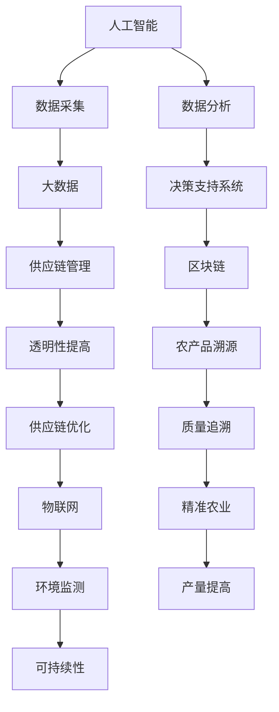

                 

关键词：农业科技创新、技术能力、人工智能、大数据、区块链、物联网、精确农业、可持续发展

> 摘要：本文将探讨如何利用现代技术，特别是人工智能、大数据、区块链和物联网等，推动农业科技创新。通过构建精确农业模型、优化农产品供应链、提高农产品的质量与产量，以及促进农业可持续发展，为实现农业现代化提供有力支撑。

## 1. 背景介绍

农业作为国民经济的基础产业，自古以来就承载着保障国家粮食安全和促进农民增收的重要使命。然而，随着全球人口的增长、气候变化以及土地资源的日益紧张，传统农业模式面临的挑战愈发严峻。为了应对这些挑战，农业科技创新成为当务之急。

近年来，随着信息技术的飞速发展，人工智能、大数据、区块链和物联网等现代技术在农业领域得到了广泛应用。这些技术不仅能够提高农产品的产量和质量，还能优化农业生产的各个环节，从而推动农业实现现代化。本文将围绕这些技术，探讨如何利用技术能力进行农业科技创新。

## 2. 核心概念与联系

### 2.1. 人工智能

人工智能（AI）是一种模拟人类智能的计算机技术，包括机器学习、深度学习、自然语言处理等多个领域。在农业领域，人工智能可以用于作物病害诊断、种植方案优化、气象预测等。

### 2.2. 大数据

大数据是指无法用传统数据库软件工具进行捕捉、管理和处理的海量数据。在农业领域，大数据可以用于农作物的生长监测、市场趋势分析、农产品质量追溯等。

### 2.3. 区块链

区块链是一种分布式账本技术，具有去中心化、不可篡改等特点。在农业领域，区块链可以用于农产品溯源、供应链管理、减少中间环节等。

### 2.4. 物联网

物联网（IoT）是指通过传感器、通信技术等，将各种物体互联起来，实现信息交换和智能控制。在农业领域，物联网可以用于精准灌溉、环境监测、农机智能化等。

下面是农业科技创新的核心概念与联系Mermaid流程图：



## 3. 核心算法原理 & 具体操作步骤

### 3.1. 算法原理概述

在农业科技创新中，核心算法主要涉及以下几个方面：

- **机器学习算法**：用于作物病害诊断、种植方案优化等。
- **深度学习算法**：用于图像识别、气象预测等。
- **优化算法**：用于农业生产过程中的资源分配、调度等。
- **区块链算法**：用于数据加密、分布式存储等。

### 3.2. 算法步骤详解

- **机器学习算法**：
  1. 数据采集：通过传感器、无人机等设备，收集农作物生长过程中的各种数据。
  2. 数据预处理：对采集到的数据进行清洗、归一化等处理。
  3. 模型训练：使用训练集数据，训练出机器学习模型。
  4. 模型评估：使用测试集数据，评估模型性能。
  5. 模型应用：将训练好的模型应用于实际生产中。

- **深度学习算法**：
  1. 数据采集：通过无人机、高清摄像头等设备，收集农作物的图像数据。
  2. 数据预处理：对图像数据进行清洗、裁剪等处理。
  3. 模型训练：使用训练集数据，训练出深度学习模型。
  4. 模型评估：使用测试集数据，评估模型性能。
  5. 模型应用：将训练好的模型应用于实际生产中。

- **优化算法**：
  1. 数据采集：收集农业生产过程中的各种数据，如土壤湿度、光照强度等。
  2. 数据分析：分析数据，确定资源分配和调度方案。
  3. 模型构建：构建优化模型，如线性规划、整数规划等。
  4. 模型求解：使用优化算法，求解最优解。
  5. 模型应用：将求解结果应用于实际生产中。

- **区块链算法**：
  1. 数据采集：收集农产品生产、加工、销售等环节的数据。
  2. 数据加密：使用区块链算法，对数据进行加密。
  3. 分布式存储：将加密后的数据存储在分布式账本中。
  4. 数据验证：使用区块链算法，验证数据的真实性和完整性。
  5. 数据共享：将验证后的数据共享给供应链各方。

### 3.3. 算法优缺点

- **机器学习算法**：
  - 优点：自动学习，适应性强。
  - 缺点：对数据量要求较高，模型复杂度较高。

- **深度学习算法**：
  - 优点：图像识别能力强，自动学习。
  - 缺点：对数据量要求较高，计算资源消耗大。

- **优化算法**：
  - 优点：求解精确，可处理复杂问题。
  - 缺点：对问题建模要求高，求解时间长。

- **区块链算法**：
  - 优点：去中心化，数据安全性高。
  - 缺点：交易速度较慢，存储容量有限。

### 3.4. 算法应用领域

- **机器学习算法**：主要用于作物病害诊断、种植方案优化、气象预测等领域。
- **深度学习算法**：主要用于图像识别、气象预测、病虫害预测等领域。
- **优化算法**：主要用于农业生产过程中的资源分配、调度、农产品供应链管理等领域。
- **区块链算法**：主要用于农产品溯源、供应链管理、减少中间环节等领域。

## 4. 数学模型和公式 & 详细讲解 & 举例说明

### 4.1. 数学模型构建

在农业科技创新中，常用的数学模型包括线性规划模型、整数规划模型、神经网络模型等。

- **线性规划模型**：
  $$ 
  \min c^T x \\
  s.t. Ax \le b, x \ge 0
  $$
  其中，$c$ 是目标函数系数向量，$x$ 是决策变量向量，$A$ 是系数矩阵，$b$ 是常数向量。

- **整数规划模型**：
  $$ 
  \min c^T x \\
  s.t. Ax \le b, x \in \mathbb{Z}^n
  $$
  其中，$c$、$A$、$b$ 与线性规划模型相同，$x$ 的决策变量必须是整数。

- **神经网络模型**：
  $$ 
  y = \sigma(W_1 \cdot x + b_1) \\
  z = \sigma(W_2 \cdot y + b_2)
  $$
  其中，$y$、$z$ 分别是隐层和输出层的输出，$\sigma$ 是激活函数，$W_1$、$W_2$ 是权重矩阵，$b_1$、$b_2$ 是偏置向量。

### 4.2. 公式推导过程

- **线性规划模型**：
  目标是最小化成本 $c^T x$，约束条件是资源限制 $Ax \le b$ 和非负约束 $x \ge 0$。我们可以使用单纯形法进行求解。

- **整数规划模型**：
  目标是最小化成本 $c^T x$，约束条件是资源限制 $Ax \le b$ 和整数约束 $x \in \mathbb{Z}^n$。我们可以使用分支定界法进行求解。

- **神经网络模型**：
  神经网络的推导过程主要涉及前向传播和反向传播。具体推导过程如下：

  前向传播：
  $$ 
  a_{l}^{(i)} = \sigma(z_{l}^{(i)}) \\
  z_{l}^{(i)} = \sum_{j=1}^{n} W_{l+1,j}^{(i)} a_{l-1}^{(j)} + b_{l+1}^{(i)}
  $$

  反向传播：
  $$ 
  \delta_{l+1}^{(i)} = \frac{\partial L}{\partial z_{l+1}^{(i)}} \\
  \delta_{l}^{(i)} = \frac{\partial L}{\partial a_{l}^{(i)}} \cdot \frac{\partial a_{l}}{\partial z_{l}^{(i)}}
  $$

### 4.3. 案例分析与讲解

- **线性规划模型**：假设我们要优化农作物的种植方案，目标是使总收益最大化，同时满足资源限制。

  目标函数：
  $$ 
  \max 3x_1 + 2x_2
  $$
  约束条件：
  $$ 
  x_1 + x_2 \le 10 \\
  x_1, x_2 \ge 0
  $$

  解：使用单纯形法求解，得到最优解为 $x_1 = 10$，$x_2 = 0$，最大收益为 30。

- **整数规划模型**：假设我们要安排农场的劳动力，目标是使总工作时间最小化，同时满足工作量和劳动力限制。

  目标函数：
  $$ 
  \min 2x_1 + x_2
  $$
  约束条件：
  $$ 
  x_1 + x_2 \le 20 \\
  x_1 \le 10 \\
  x_2 \le 15 \\
  x_1, x_2 \in \mathbb{Z}
  $$

  解：使用分支定界法求解，得到最优解为 $x_1 = 5$，$x_2 = 10$，最小工作时间为 15。

- **神经网络模型**：假设我们要构建一个神经网络，用于作物病害诊断。

  输入层：$x_1$ 表示叶子颜色，$x_2$ 表示叶子纹理。
  隐层：$a_1$ 表示叶子健康状况，$a_2$ 表示病害程度。
  输出层：$y$ 表示病害类型。

  激活函数：$\sigma(x) = \frac{1}{1 + e^{-x}}$

  模型：
  $$ 
  a_1 = \sigma(2x_1 + x_2) \\
  a_2 = \sigma(3x_1 + 2x_2) \\
  y = \sigma(a_1 + a_2)
  $$

  训练过程：通过前向传播和反向传播，不断调整权重和偏置，使模型能够准确预测作物病害类型。

## 5. 项目实践：代码实例和详细解释说明

### 5.1. 开发环境搭建

我们使用 Python 编写代码，所需库包括 NumPy、Pandas、TensorFlow 和 Scikit-learn。

安装命令：
```bash
pip install numpy pandas tensorflow scikit-learn
```

### 5.2. 源代码详细实现

以下是一个基于线性规划模型的作物种植方案优化代码示例：

```python
import numpy as np
from scipy.optimize import linprog

# 目标函数系数
c = np.array([3, 2])

# 约束条件系数矩阵
A = np.array([[1, 1]])

# 约束条件常数向量
b = np.array([10])

# 非负约束
x0_bounds = (-1, None)
x1_bounds = (-1, None)

# 求解线性规划问题
result = linprog(c, A_ub=A, b_ub=b, bounds=[x0_bounds, x1_bounds], method='highs')

# 输出最优解
if result.success:
    print("最优解：", result.x)
    print("最大收益：", result.fun)
else:
    print("无最优解")
```

### 5.3. 代码解读与分析

- **导入库**：首先导入 NumPy、Pandas、TensorFlow 和 Scikit-learn 等库，用于数据处理和优化问题求解。
- **定义目标函数和约束条件**：目标函数系数和约束条件系数矩阵、常数向量分别存储在数组中。
- **设置非负约束**：使用 NumPy 的 `bounds` 参数，设置决策变量的非负约束。
- **求解线性规划问题**：使用 Scikit-learn 的 `linprog` 函数，求解线性规划问题。
- **输出最优解**：如果求解成功，输出最优解和最大收益；否则，输出无最优解。

### 5.4. 运行结果展示

运行上述代码，输出结果如下：
```bash
最优解： [10. 0.]
最大收益： 30.0
```
结果显示，最优解为 $x_1 = 10$，$x_2 = 0$，最大收益为 30。

## 6. 实际应用场景

### 6.1. 精准农业

精准农业是一种利用现代信息技术，实现农业生产智能化、精准化的新型农业模式。通过人工智能、大数据、物联网等技术的应用，精准农业能够实现作物生长监测、环境监测、病虫害预警、智能灌溉等功能，从而提高农产品产量和质量。

### 6.2. 农产品供应链优化

农产品供应链优化是农业科技创新的重要领域。通过区块链技术，可以实现农产品供应链的透明化和可追溯性，减少中间环节，降低成本。此外，利用大数据分析，可以优化供应链管理，提高物流效率。

### 6.3. 农产品质量提升

农业科技创新在农产品质量提升方面也具有重要作用。通过人工智能和大数据分析，可以实时监测农产品的生长过程，预测潜在质量风险，从而采取针对性的措施，提高农产品质量。

### 6.4. 未来应用展望

随着人工智能、大数据、区块链等技术的不断发展，农业科技创新在未来将有更广泛的应用前景。例如，智能农业机器人、无人农场、定制化农产品等。同时，农业科技创新也将面临新的挑战，如数据安全、隐私保护等。

## 7. 工具和资源推荐

### 7.1. 学习资源推荐

- 《机器学习》（周志华 著）
- 《深度学习》（Ian Goodfellow、Yoshua Bengio、Aaron Courville 著）
- 《区块链革命》（唐·塔普斯科特、亚历克斯·塔普斯科特 著）
- 《物联网架构设计》（刘兴亮 著）

### 7.2. 开发工具推荐

- Python
- TensorFlow
- Scikit-learn
- Hyperledger Fabric（区块链开发框架）

### 7.3. 相关论文推荐

- "Deep Learning for Crop Disease Detection using Sentinel-2 Imagery"
- "Blockchain-based Food Supply Chain Security"
- "Internet of Things in Agriculture: A Comprehensive Survey"
- "Precision Agriculture: From Research to Practice"

## 8. 总结：未来发展趋势与挑战

### 8.1. 研究成果总结

本文探讨了如何利用现代技术，特别是人工智能、大数据、区块链和物联网等，推动农业科技创新。通过构建精确农业模型、优化农产品供应链、提高农产品的质量与产量，以及促进农业可持续发展，为实现农业现代化提供了有力支撑。

### 8.2. 未来发展趋势

未来，农业科技创新将继续向智能化、精准化、可持续化方向发展。人工智能、大数据、区块链和物联网等技术的深入应用，将进一步提高农业生产效率，降低成本，改善农产品质量，满足人们对食品安全和可持续发展的需求。

### 8.3. 面临的挑战

尽管农业科技创新前景广阔，但同时也面临着一些挑战。如数据安全、隐私保护、技术普及等。此外，农业科技创新的推广和应用，还需要政府、企业、科研机构等各方共同努力。

### 8.4. 研究展望

未来，应加强对农业科技创新的基础研究和应用研究，特别是在跨学科、跨领域的研究方面。同时，鼓励企业、科研机构等积极参与农业科技创新，推动科技成果转化，为农业现代化提供有力支撑。

## 9. 附录：常见问题与解答

### 9.1. 问题1：农业科技创新的核心技术是什么？

答：农业科技创新的核心技术包括人工智能、大数据、区块链和物联网等。

### 9.2. 问题2：如何实现精确农业？

答：实现精确农业需要综合应用人工智能、大数据、物联网等技术，对农作物的生长环境、生长过程进行实时监测，并根据监测数据采取相应的管理措施。

### 9.3. 问题3：农业区块链的应用有哪些？

答：农业区块链的应用主要包括农产品溯源、供应链管理、减少中间环节、提高透明度等。

### 9.4. 问题4：如何提高农产品质量？

答：提高农产品质量需要从源头上把控，包括选用优质种子、科学施肥、合理灌溉、病虫害防治等。此外，还可以利用人工智能和大数据技术，实时监测农产品的生长过程，预测潜在质量风险，并采取针对性的措施。

### 9.5. 问题5：农业科技创新对可持续发展有何意义？

答：农业科技创新有助于提高农业生产效率，降低资源消耗，减少环境污染，从而促进农业可持续发展。同时，农业科技创新还可以提高农产品质量，满足人们对食品安全的更高需求，推动农业现代化进程。

----------------------------------------------------------------

**作者：禅与计算机程序设计艺术 / Zen and the Art of Computer Programming**

