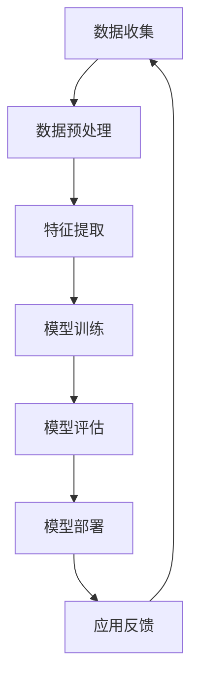
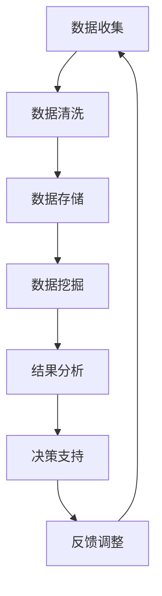
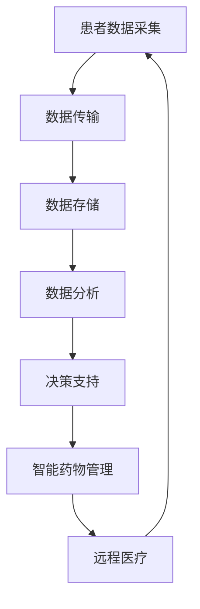
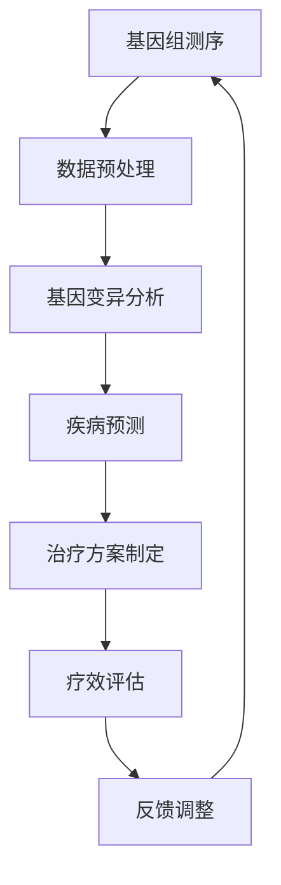

                 

关键词：医疗科技、人工智能、大数据分析、物联网、数字健康、精准医疗、基因组学、医疗影像分析、医疗数据处理、医疗可穿戴设备。

> 摘要：本文旨在探讨如何利用先进的技术能力，推动医疗科技创新。通过人工智能、大数据、物联网、基因组学等领域的深入分析，本文将阐述这些技术在医疗领域中的应用，以及未来的发展趋势和挑战。

## 1. 背景介绍

医疗科技是近年来快速发展的重要领域，它利用现代信息技术和生物技术，为人类健康带来了前所未有的变革。随着人工智能、大数据、物联网等技术的不断进步，医疗科技正在朝着更加精准、高效、个性化的方向发展。

医疗科技创新的核心在于利用技术手段解决医疗领域面临的重大挑战，如提高诊断准确率、降低医疗成本、改善患者体验等。当前，医疗科技已经取得了一系列显著的成果，例如医疗影像分析、基因组学、精准医疗等。然而，要实现医疗科技的全面突破，还需要进一步挖掘和利用先进的技术能力。

## 2. 核心概念与联系

### 2.1 人工智能在医疗中的应用

人工智能（AI）在医疗领域的应用日益广泛，其主要优势在于大数据处理、模式识别、预测分析等方面。通过深度学习、自然语言处理等技术，人工智能可以帮助医生进行疾病诊断、治疗方案的制定，以及药物研发等。

下面是人工智能在医疗中的架构图（使用Mermaid流程图）：



### 2.2 大数据在医疗中的应用

大数据技术在医疗领域发挥着重要作用，它可以帮助医疗机构进行病患数据的管理、分析，从而发现潜在的疾病趋势和风险因素。此外，大数据还可以用于个性化医疗、公共卫生监测等方面。

下面是大数据在医疗中的架构图（使用Mermaid流程图）：



### 2.3 物联网在医疗中的应用

物联网（IoT）技术可以通过医疗可穿戴设备、智能家居等手段，实时监测患者的生理指标，为医生提供更加全面的健康数据。此外，物联网还可以实现远程医疗、智能药物管理等应用。

下面是物联网在医疗中的架构图（使用Mermaid流程图）：



### 2.4 基因组学在医疗中的应用

基因组学是研究生物体基因组的结构、功能、变异和进化的一门学科。在医疗领域，基因组学可以帮助医生进行疾病诊断、预测、治疗方案的制定等。通过全基因组测序、基因突变分析等技术，基因组学为个性化医疗提供了强有力的支持。

下面是基因组学在医疗中的架构图（使用Mermaid流程图）：



## 3. 核心算法原理 & 具体操作步骤

### 3.1 算法原理概述

医疗科技创新涉及多种核心算法，如深度学习、数据挖掘、基因组学算法等。这些算法分别利用神经网络、决策树、支持向量机等技术，实现疾病的诊断、预测、治疗等功能。

### 3.2 算法步骤详解

以深度学习算法为例，其具体操作步骤如下：

#### 3.2.1 数据预处理

1. 数据清洗：去除缺失值、异常值等。
2. 数据归一化：将数据缩放到统一范围内。

#### 3.2.2 模型构建

1. 选择合适的神经网络结构。
2. 设置网络参数，如学习率、激活函数等。

#### 3.2.3 模型训练

1. 利用训练数据集对模型进行训练。
2. 采用反向传播算法更新网络参数。

#### 3.2.4 模型评估

1. 利用验证数据集对模型进行评估。
2. 计算模型的准确率、召回率等指标。

#### 3.2.5 模型部署

1. 将训练好的模型部署到实际应用场景中。
2. 对模型进行实时更新和优化。

### 3.3 算法优缺点

深度学习算法具有强大的特征提取能力和自适应能力，但训练过程复杂，对计算资源要求较高。数据挖掘算法可以处理大规模数据，但存在过拟合问题。基因组学算法能够揭示基因变异与疾病的关系，但需要大量实验数据支持。

### 3.4 算法应用领域

深度学习算法广泛应用于医疗影像分析、疾病诊断等领域。数据挖掘算法可用于公共卫生监测、流行病学研究等。基因组学算法在个性化医疗、疾病预测方面具有重要作用。

## 4. 数学模型和公式 & 详细讲解 & 举例说明

### 4.1 数学模型构建

以深度学习算法为例，其数学模型主要包括输入层、隐藏层和输出层。输入层接收外部输入，隐藏层通过非线性变换提取特征，输出层生成预测结果。

### 4.2 公式推导过程

深度学习算法的核心是前向传播和反向传播。前向传播过程如下：

$$
z_i = \sum_{j=1}^{n} w_{ij} \cdot a_{j} + b_i
$$

$$
a_i = f(z_i)
$$

反向传播过程如下：

$$
\delta_i = \frac{\partial L}{\partial z_i}
$$

$$
w_{ij} := w_{ij} - \alpha \cdot \delta_i \cdot a_j
$$

$$
b_i := b_i - \alpha \cdot \delta_i
$$

其中，$L$ 为损失函数，$f$ 为激活函数，$w_{ij}$ 和 $b_i$ 为网络参数，$\alpha$ 为学习率。

### 4.3 案例分析与讲解

以乳腺癌诊断为例，利用深度学习算法对乳腺影像进行分类。数据集包括正常乳腺影像和乳腺癌影像，训练集和验证集的比例为8:2。

1. 数据预处理：对乳腺影像进行归一化处理，并转换为灰度图。
2. 模型构建：采用卷积神经网络（CNN）结构，输入层为28x28的灰度图，输出层为2个类别。
3. 模型训练：利用训练集进行模型训练，采用交叉熵损失函数和随机梯度下降优化算法。
4. 模型评估：利用验证集对模型进行评估，计算准确率、召回率等指标。
5. 模型部署：将训练好的模型部署到实际应用场景中，如乳腺影像诊断系统。

## 5. 项目实践：代码实例和详细解释说明

### 5.1 开发环境搭建

1. 安装Python环境，版本3.8以上。
2. 安装深度学习框架TensorFlow。
3. 准备乳腺癌诊断数据集。

### 5.2 源代码详细实现

```python
import tensorflow as tf
from tensorflow.keras.layers import Conv2D, MaxPooling2D, Flatten, Dense
from tensorflow.keras.models import Sequential
from tensorflow.keras.optimizers import Adam
from tensorflow.keras.losses import CategoricalCrossentropy

# 数据预处理
# ...

# 模型构建
model = Sequential([
    Conv2D(32, (3, 3), activation='relu', input_shape=(28, 28, 1)),
    MaxPooling2D((2, 2)),
    Flatten(),
    Dense(128, activation='relu'),
    Dense(2, activation='softmax')
])

# 模型训练
model.compile(optimizer=Adam(), loss=CategoricalCrossentropy(), metrics=['accuracy'])
model.fit(train_images, train_labels, epochs=10, validation_data=(val_images, val_labels))

# 模型评估
# ...

# 模型部署
# ...
```

### 5.3 代码解读与分析

上述代码实现了乳腺癌诊断的深度学习模型。首先，对数据集进行预处理，包括数据归一化和数据增强。然后，构建卷积神经网络模型，包括卷积层、池化层、全连接层。最后，使用训练数据集对模型进行训练，并利用验证数据集进行评估。

## 6. 实际应用场景

医疗科技创新在多个领域有着广泛的应用，如：

1. **医疗影像分析**：通过深度学习算法对医学影像进行自动诊断，提高诊断准确率。
2. **基因组学**：利用基因组学技术进行个性化医疗，为患者提供精准治疗方案。
3. **远程医疗**：通过物联网技术实现远程医疗，提高医疗服务的可及性。
4. **智能药物管理**：利用大数据分析和机器学习技术，优化药物管理，提高治疗效果。

## 7. 工具和资源推荐

### 7.1 学习资源推荐

1. **书籍**：
    - 《深度学习》（Goodfellow, Bengio, Courville著）
    - 《Python机器学习》（Sahni著）
2. **在线课程**：
    - Coursera的“深度学习”课程（吴恩达教授）
    - edX的“机器学习基础”课程（MIT）

### 7.2 开发工具推荐

1. **编程语言**：Python
2. **深度学习框架**：TensorFlow、PyTorch
3. **数据预处理工具**：NumPy、Pandas
4. **可视化工具**：Matplotlib、Seaborn

### 7.3 相关论文推荐

1. **医疗影像分析**：
    - “Deep Learning for Medical Image Analysis” （Ronneberger et al., 2015）
    - “Convolutional Neural Networks for Radiology” （Liang et al., 2017）
2. **基因组学**：
    - “Whole-genome Sequencing” （Topol, 2015）
    - “Genomics and Personalized Medicine” （Collins et al., 2018）

## 8. 总结：未来发展趋势与挑战

### 8.1 研究成果总结

医疗科技创新在人工智能、大数据、物联网、基因组学等领域取得了显著成果。深度学习算法在医疗影像分析、基因组学应用等方面表现突出，大数据分析为公共卫生监测、个性化医疗提供了有力支持。

### 8.2 未来发展趋势

1. **更加精准的疾病诊断**：利用深度学习和基因组学技术，实现更加精准的疾病诊断。
2. **智能化医疗服务**：通过物联网和大数据分析，提升医疗服务的智能化水平。
3. **个性化医疗**：结合基因组学数据，实现个性化治疗方案。

### 8.3 面临的挑战

1. **数据隐私与安全**：医疗数据涉及患者隐私，如何保障数据安全是关键挑战。
2. **技术落地与监管**：如何将先进技术落地并得到监管机构的认可，也是一个重要问题。
3. **技术人才短缺**：医疗科技创新需要大量跨学科的技术人才，人才培养是关键。

### 8.4 研究展望

未来，医疗科技创新将继续朝着更加精准、高效、个性化的方向发展。人工智能、大数据、物联网等技术的融合将为医疗领域带来更多创新。同时，研究应关注数据隐私保护、技术落地与监管等问题，确保医疗科技创新的可持续发展。

## 9. 附录：常见问题与解答

### 问题1：医疗科技创新中的数据隐私如何保障？

解答：医疗数据隐私保护是医疗科技创新的重要问题。为保障数据隐私，可以采取以下措施：

1. **数据匿名化**：对医疗数据进行匿名化处理，去除个人身份信息。
2. **数据加密**：采用数据加密技术，确保数据在传输和存储过程中的安全性。
3. **隐私保护算法**：利用差分隐私、同态加密等技术，实现数据隐私保护。

### 问题2：医疗科技创新中的技术落地与监管如何实现？

解答：医疗科技创新的技术落地与监管需要多方协作：

1. **标准化**：制定医疗科技领域的相关标准和规范，确保技术落地过程中的合规性。
2. **监管合作**：政府、医疗机构、科技公司等各方共同参与，建立监管合作机制。
3. **风险评估**：对医疗科技创新项目进行风险评估，及时发现和解决潜在问题。

### 问题3：医疗科技创新中的技术人才短缺怎么办？

解答：解决技术人才短缺问题可以从以下几个方面入手：

1. **教育培养**：加强医学、计算机、生物等相关学科的教育培养，提高人才培养质量。
2. **跨学科合作**：鼓励跨学科合作，培养具有跨学科背景的技术人才。
3. **人才引进**：引进国际先进技术人才，提高医疗科技创新水平。

---

作者：禅与计算机程序设计艺术 / Zen and the Art of Computer Programming
----------------------------------------------------------------

以上就是《如何利用技术能力进行医疗科技创新》的完整文章。文章详细探讨了人工智能、大数据、物联网、基因组学等技术在医疗领域中的应用，以及未来的发展趋势和挑战。希望通过这篇文章，能够为读者提供一个全面、深入的医疗科技创新概述。在未来的医疗科技创新中，我们期待看到更多突破性的成果，为人类健康事业贡献力量。

