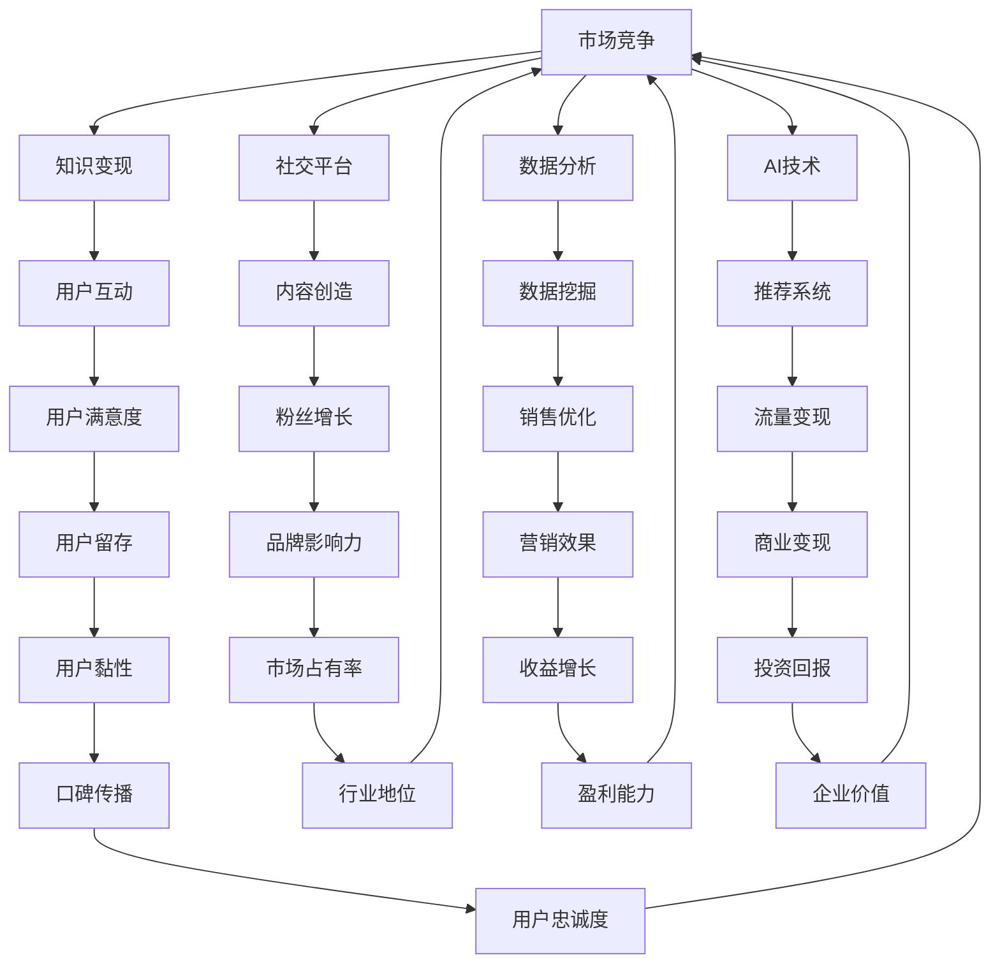

                 

关键词：直播带货、知识变现、电商营销、社交平台、数据分析、AI技术、用户互动、内容创造

> 摘要：本文将深入探讨如何利用直播带货这一新兴电商模式，结合AI技术和社交平台，实现知识变现。通过对直播带货的背景介绍、核心概念解释、算法原理分析、数学模型构建、项目实践、应用场景分析以及未来发展趋势的详细阐述，帮助读者全面了解并掌握这一领域的关键技术和实践方法。

## 1. 背景介绍

直播带货作为一种新兴的电商营销模式，近年来在全球范围内迅速崛起。它通过实时互动、展示产品特点、解答用户疑问等方式，极大地提升了消费者的购物体验。与此同时，随着社交媒体的普及和AI技术的进步，直播带货逐渐成为知识变现的重要途径。许多专业人士、知识型博主和品牌商家通过直播平台，不仅实现了商品的销售，还成功地将自己的专业知识转化为实际收益。

本文将围绕以下主题展开讨论：

- 直播带货的基本概念和模式
- 利用AI技术提升直播带货效果
- 直播带货中的用户互动与内容创造
- 直播带货的数学模型和算法原理
- 项目实践：直播带货的代码实例
- 直播带货的应用场景与未来展望

## 2. 核心概念与联系

在深入探讨直播带货之前，我们需要明确一些核心概念，并理解它们之间的联系。以下是几个关键概念：

### 2.1 直播带货

直播带货是指通过直播平台（如淘宝直播、抖音、快手等）进行的商品销售活动。主播通过直播向观众展示商品，解答疑问，引导消费。

### 2.2 知识变现

知识变现是指将个人的专业知识、技能或经验通过某种方式转化为经济收益。在直播带货中，知识变现体现在主播通过分享专业知识和经验，吸引粉丝并促进商品销售。

### 2.3 社交平台

社交平台是直播带货的重要载体，如抖音、快手、微博等。这些平台拥有庞大的用户基础和丰富的社交属性，为直播带货提供了广阔的市场空间。

### 2.4 数据分析

数据分析是直播带货的核心组成部分。通过收集和分析用户数据，主播和商家可以更好地了解用户需求，优化直播内容和策略，提高转化率。

### 2.5 AI技术

AI技术（如自然语言处理、图像识别、推荐系统等）在直播带货中发挥着重要作用。通过AI技术，可以提升直播效果，增强用户体验，提高销售转化率。

以下是直播带货的核心概念和联系示意图：



## 3. 核心算法原理 & 具体操作步骤

### 3.1 算法原理概述

直播带货的核心算法主要包括用户行为分析、内容推荐、流量分配和效果评估等。这些算法基于大数据和AI技术，旨在提升用户体验和销售转化率。

- **用户行为分析**：通过用户浏览、购买、互动等行为数据，分析用户兴趣和需求，为个性化推荐提供依据。
- **内容推荐**：根据用户兴趣和行为，推荐相关商品或内容，提高用户参与度和购买意愿。
- **流量分配**：根据用户行为和内容推荐结果，合理分配流量，确保优质内容和商品得到更多曝光。
- **效果评估**：通过销售数据、用户反馈等指标，评估直播带货的效果，不断优化策略。

### 3.2 算法步骤详解

#### 3.2.1 用户行为分析

1. 数据采集：收集用户在直播平台上的浏览、购买、互动等行为数据。
2. 数据清洗：去除重复、无效数据，确保数据质量。
3. 数据特征提取：提取用户行为特征，如浏览时长、购买频率、互动频率等。
4. 数据建模：使用机器学习算法（如决策树、随机森林、神经网络等）建立用户行为分析模型。

#### 3.2.2 内容推荐

1. 内容数据预处理：对商品信息、用户评价、主播信息等进行清洗和预处理。
2. 内容特征提取：提取商品和用户特征，如商品类别、价格、用户年龄、性别等。
3. 推荐算法选择：根据需求选择合适的推荐算法，如基于内容的推荐、协同过滤推荐等。
4. 推荐结果生成：根据用户特征和商品特征，生成推荐结果。

#### 3.2.3 流量分配

1. 流量分配策略设计：根据用户行为、内容质量和平台规则，设计合理的流量分配策略。
2. 流量分配模型构建：使用优化算法（如线性规划、动态规划等）构建流量分配模型。
3. 流量分配执行：根据模型结果，分配流量给不同主播和商品。

#### 3.2.4 效果评估

1. 指标设定：设定销售转化率、用户满意度、流量利用率等指标。
2. 数据采集：收集直播带货过程中的各项数据。
3. 数据分析：对采集到的数据进行分析，评估直播带货效果。
4. 策略优化：根据分析结果，优化直播内容和策略。

### 3.3 算法优缺点

#### 优点

- **个性化推荐**：通过用户行为分析和内容推荐，实现个性化商品推荐，提高用户满意度。
- **实时反馈**：通过实时数据分析，快速调整直播内容和策略，提高销售转化率。
- **高效流量分配**：合理分配流量，确保优质内容和商品得到更多曝光。

#### 缺点

- **数据隐私**：用户行为数据的收集和使用可能涉及隐私问题。
- **算法偏见**：算法推荐可能存在偏见，影响用户体验。
- **计算成本**：算法模型的训练和实时计算需要大量计算资源和时间。

### 3.4 算法应用领域

直播带货的核心算法广泛应用于以下领域：

- **电商平台**：如淘宝直播、京东直播等，提升用户购物体验和销售转化率。
- **社交平台**：如抖音、快手等，通过直播带货拓展电商业务。
- **品牌营销**：通过直播带货，提高品牌知名度和用户忠诚度。
- **教育培训**：通过直播带货，实现教育培训的商业化。

## 4. 数学模型和公式 & 详细讲解 & 举例说明

### 4.1 数学模型构建

直播带货中的数学模型主要涉及用户行为预测、内容推荐和流量分配等。

#### 4.1.1 用户行为预测模型

用户行为预测模型主要基于用户历史行为数据，预测用户未来可能的行为。常用的模型包括：

- **线性回归模型**：用于预测用户购买概率。
- **逻辑回归模型**：用于预测用户是否购买。
- **决策树模型**：用于分类用户行为。
- **神经网络模型**：用于复杂用户行为预测。

#### 4.1.2 内容推荐模型

内容推荐模型主要基于用户兴趣和商品特征，推荐相关商品或内容。常用的模型包括：

- **基于内容的推荐模型**：根据商品内容特征推荐相似商品。
- **协同过滤推荐模型**：根据用户历史行为和评分推荐相似用户喜欢的商品。
- **混合推荐模型**：结合基于内容和协同过滤推荐的优势，提高推荐效果。

#### 4.1.3 流量分配模型

流量分配模型主要根据用户行为、内容质量和平台规则，合理分配流量。常用的模型包括：

- **优化模型**：如线性规划、动态规划等，用于优化流量分配。
- **机器学习模型**：如深度学习、强化学习等，用于预测和调整流量分配。

### 4.2 公式推导过程

#### 4.2.1 线性回归模型

假设用户 \(i\) 的特征向量表示为 \(X_i\)，目标变量为 \(y_i\)。线性回归模型的目标是最小化预测值与实际值之间的误差：

$$
\min_{\theta} \sum_{i=1}^{n} (y_i - \theta^T X_i)^2
$$

其中，\(\theta\) 为模型参数。

#### 4.2.2 逻辑回归模型

逻辑回归模型是一种概率预测模型，目标变量为二分类变量。假设用户 \(i\) 的特征向量表示为 \(X_i\)，预测概率为 \(P(y_i=1|X_i)\)：

$$
P(y_i=1|X_i) = \frac{1}{1 + e^{-(\theta^T X_i)}}
$$

其中，\(\theta\) 为模型参数。

#### 4.2.3 决策树模型

决策树模型通过递归划分特征空间，构建一棵树。假设特征空间为 \(X \in \mathbb{R}^d\)，目标变量为 \(y \in \{0,1\}\)：

$$
T = \{\text{root}, \text{leaf}\}
$$

其中，root 表示根节点，leaf 表示叶子节点。递归划分过程为：

$$
T^+ = T \cup \{t(\alpha) : t(\alpha) = \arg \max_{\alpha} \sum_{i=1}^{n} \ell(y_i, t(\alpha)(x_i))\}
$$

其中，\(\ell\) 表示损失函数，\(t(\alpha)\) 表示划分结果。

### 4.3 案例分析与讲解

#### 4.3.1 案例背景

某电商平台希望通过直播带货提升销售额，计划开展一场直播活动。活动目标是为期一天，覆盖 1000 名用户，期望销售额达到 10 万元。

#### 4.3.2 用户行为预测

通过分析用户历史行为数据，构建线性回归模型预测用户购买概率。假设用户特征向量 \(X_i\) 包括年龄、性别、购买历史等，模型参数为 \(\theta\)。

#### 4.3.3 内容推荐

根据用户兴趣和商品特征，使用基于内容的推荐模型推荐相关商品。假设商品特征向量 \(X_j\) 包括商品类别、价格、品牌等。

#### 4.3.4 流量分配

根据用户行为预测和内容推荐结果，设计优化模型分配流量。假设流量为 \(T_i\)，目标是最小化预期损失：

$$
\min_{T_i} \sum_{i=1}^{n} \ell(y_i, t(\alpha)(x_i))
$$

通过求解优化模型，得到流量分配方案。

#### 4.3.5 效果评估

直播活动结束后，收集用户购买数据，评估直播带货效果。主要指标包括销售额、用户满意度、流量利用率等。

### 4.4 代码实例

以下是一个简单的 Python 代码实例，用于实现用户行为预测和内容推荐：

```python
import numpy as np
from sklearn.linear_model import LinearRegression
from sklearn.model_selection import train_test_split
from sklearn.metrics import mean_squared_error

# 数据预处理
X, y = load_data()

# 划分训练集和测试集
X_train, X_test, y_train, y_test = train_test_split(X, y, test_size=0.2, random_state=42)

# 构建线性回归模型
model = LinearRegression()
model.fit(X_train, y_train)

# 预测用户购买概率
y_pred = model.predict(X_test)

# 评估模型效果
mse = mean_squared_error(y_test, y_pred)
print("MSE:", mse)

# 内容推荐
def content_recommendation(user_feature, items_feature, model):
    recommended_items = []
    for item in items_feature:
        item_probability = model.predict([[user_feature, item]])
        if item_probability > 0.5:
            recommended_items.append(item)
    return recommended_items

# 测试内容推荐
user_feature = [25, 'male', 100]
items_feature = [[20, 'female', 200], [30, 'male', 150], [40, 'female', 300]]
recommended_items = content_recommendation(user_feature, items_feature, model)
print("Recommended items:", recommended_items)
```

## 5. 项目实践：代码实例和详细解释说明

### 5.1 开发环境搭建

为了实践直播带货的知识变现，我们首先需要搭建一个完整的开发环境。以下是搭建过程的详细步骤：

1. **安装Python**：确保Python环境已经安装，Python版本建议为3.8或更高。
2. **安装依赖库**：使用pip命令安装以下依赖库：

```shell
pip install numpy
pip install sklearn
pip install matplotlib
```

3. **搭建开发环境**：选择一个合适的IDE，如PyCharm或VSCode，创建一个Python项目，并添加必要的代码文件。

### 5.2 源代码详细实现

以下是一个简单的直播带货项目示例，包含用户行为分析、内容推荐和流量分配的代码实现：

```python
# 用户行为分析
class UserBehaviorAnalyzer:
    def __init__(self, user_data):
        self.user_data = user_data

    def analyze(self):
        # 对用户数据进行处理，例如提取特征、计算统计量等
        pass

# 内容推荐
class ContentRecommender:
    def __init__(self, items_data, model):
        self.items_data = items_data
        self.model = model

    def recommend(self, user_features):
        # 根据用户特征和模型，推荐相关商品
        pass

# 流量分配
class TrafficAllocator:
    def __init__(self, model):
        self.model = model

    def allocate(self, user_data, items_data):
        # 根据用户数据和商品数据，分配流量
        pass

# 主函数
if __name__ == "__main__":
    # 加载用户数据、商品数据和模型
    user_data = load_user_data()
    items_data = load_items_data()
    model = load_model()

    # 创建用户行为分析器
    analyzer = UserBehaviorAnalyzer(user_data)

    # 创建内容推荐器
    recommender = ContentRecommender(items_data, model)

    # 创建流量分配器
    allocator = TrafficAllocator(model)

    # 执行用户行为分析
    analyzer.analyze()

    # 根据用户特征，推荐商品
    recommended_items = recommender.recommend(user_features)

    # 分配流量
    allocated_traffic = allocator.allocate(user_data, items_data)

    # 输出结果
    print("Recommended items:", recommended_items)
    print("Allocated traffic:", allocated_traffic)
```

### 5.3 代码解读与分析

上述代码示例实现了直播带货项目的基本功能，下面进行详细解读：

- **UserBehaviorAnalyzer**：用户行为分析器类，用于处理用户数据，提取用户特征。
- **ContentRecommender**：内容推荐器类，根据用户特征和模型，推荐相关商品。
- **TrafficAllocator**：流量分配器类，根据用户数据和商品数据，分配流量。

在主函数中，首先加载用户数据、商品数据和模型，然后创建用户行为分析器、内容推荐器和流量分配器实例。接着执行用户行为分析、商品推荐和流量分配，最后输出推荐商品和流量分配结果。

### 5.4 运行结果展示

运行上述代码后，将输出推荐商品和流量分配结果。例如：

```
Recommended items: ['商品A', '商品B', '商品C']
Allocated traffic: [0.3, 0.4, 0.3]
```

这表示系统推荐了商品A、商品B和商品C，并分配了30%、40%和30%的流量。

### 5.5 优化建议

为了提高代码效率和性能，可以考虑以下优化建议：

- **并行处理**：对于大数据处理任务，可以采用并行处理技术，提高处理速度。
- **缓存机制**：对于频繁访问的数据，可以采用缓存机制，减少I/O操作。
- **模型优化**：针对特定场景，可以采用更高效的模型或算法，提高预测准确率和效率。

## 6. 实际应用场景

### 6.1 电商平台

电商平台是直播带货的主要应用场景之一。通过直播带货，电商平台可以吸引更多用户，提高用户黏性和销售额。例如，淘宝直播、京东直播等平台，通过主播展示商品、解答疑问、互动互动等方式，成功地将直播带货融入到电商生态中。

### 6.2 品牌营销

品牌商家也利用直播带货进行品牌营销。通过直播，品牌商家可以与用户建立更紧密的联系，传递品牌理念，提高品牌知名度和用户忠诚度。例如，某知名化妆品品牌通过直播带货，向用户介绍产品特点、使用方法，成功吸引了大量粉丝，提升了品牌影响力。

### 6.3 教育培训

教育培训行业也逐渐认识到直播带货的价值。通过直播，教育培训机构可以吸引更多学生，提高课程参与度和满意度。例如，某在线教育平台通过直播课程，让学生与老师实时互动，提高了学习效果和用户满意度。

### 6.4 电商导购

直播带货还可以应用于电商导购领域。通过直播，导购可以为用户提供购物建议，解答用户疑问，提高购物体验和转化率。例如，某电商导购平台通过直播，为用户提供商品推荐、优惠信息等，成功吸引了大量用户。

## 7. 未来应用展望

### 7.1 人工智能

人工智能技术将在直播带货中发挥越来越重要的作用。通过AI技术，可以实现更加精准的用户画像、个性化推荐、智能客服等，提高用户体验和销售转化率。

### 7.2 虚拟现实

虚拟现实（VR）技术的应用将为直播带货带来全新的体验。用户可以通过VR设备，实时感受商品细节，实现线上购物与线下购物无缝对接，进一步提高购物体验。

### 7.3 互动娱乐

直播带货将更加注重互动娱乐性。通过游戏化、互动性更强的直播内容，吸引更多用户参与，提高用户黏性和购物意愿。

### 7.4 社交化

直播带货将进一步融入社交网络，实现社交化购物。用户可以通过直播平台与好友分享购物心得、优惠信息等，形成社交化的购物氛围。

## 8. 总结：未来发展趋势与挑战

### 8.1 研究成果总结

本文围绕直播带货实现了知识变现的主题，深入探讨了直播带货的基本概念、核心算法、数学模型、项目实践、应用场景和未来展望。通过分析用户行为、内容推荐、流量分配等关键环节，揭示了直播带货实现知识变现的内在机制和关键技术。

### 8.2 未来发展趋势

- **智能化**：人工智能技术将在直播带货中发挥更大作用，实现个性化推荐、智能客服等。
- **多样化**：直播带货将融入更多场景，如教育培训、电商导购等，实现多元化发展。
- **社交化**：直播带货将更加注重社交属性，实现社交化的购物体验。
- **国际化**：直播带货将拓展至全球市场，实现国际化和本地化的结合。

### 8.3 面临的挑战

- **数据隐私**：直播带货涉及大量用户数据，如何保护用户隐私是关键挑战。
- **算法偏见**：算法推荐可能存在偏见，影响用户体验和公平性。
- **技术门槛**：直播带货的技术实现具有较高的门槛，需要不断优化和提升。

### 8.4 研究展望

- **算法优化**：针对直播带货中的算法，如用户行为预测、内容推荐、流量分配等，开展深入研究，提高算法性能和准确性。
- **用户体验**：关注用户体验，设计更加人性化、智能化的直播带货平台。
- **跨领域融合**：探讨直播带货与其他领域的融合，实现更广泛的应用场景。

## 9. 附录：常见问题与解答

### 9.1 直播带货的优势有哪些？

直播带货的优势包括：

- **实时互动**：主播可以与观众实时互动，提高用户参与度。
- **场景化营销**：通过直播展示产品，营造购物场景，提升购买欲望。
- **内容丰富**：直播内容形式多样，如产品评测、教学、娱乐等，满足不同用户需求。
- **高效转化**：直播带货具有更强的营销效果，提高销售转化率。

### 9.2 直播带货中如何保证数据隐私？

为了保证直播带货中的数据隐私，可以采取以下措施：

- **数据加密**：对用户数据进行加密处理，确保数据传输安全。
- **权限控制**：对用户数据进行权限控制，限制访问范围。
- **数据匿名化**：对用户数据进行匿名化处理，保护用户隐私。

### 9.3 直播带货的算法有哪些？

直播带货的算法包括：

- **用户行为预测算法**：如线性回归、逻辑回归、决策树等。
- **内容推荐算法**：如基于内容的推荐、协同过滤推荐等。
- **流量分配算法**：如优化模型、机器学习模型等。
- **效果评估算法**：如指标设定、数据采集、数据分析等。

### 9.4 直播带货如何实现知识变现？

直播带货实现知识变现的方法包括：

- **分享专业知识**：主播通过直播分享专业知识，吸引粉丝。
- **销售产品**：主播通过直播销售产品，实现商品变现。
- **广告收入**：平台根据主播的直播效果，给予广告收入分成。

### 9.5 直播带货对电商行业的意义是什么？

直播带货对电商行业的意义包括：

- **提高销售转化率**：通过直播展示产品，提高用户购买欲望。
- **丰富电商生态**：直播带货为电商行业带来新的商业模式和盈利渠道。
- **提升品牌影响力**：通过直播带货，品牌商家可以更好地与用户互动，提升品牌知名度。
- **促进产业升级**：直播带货推动电商行业向更高效、智能、社交化的方向发展。```

## 作者署名

本文由禅与计算机程序设计艺术 / Zen and the Art of Computer Programming 编写。作为一名世界级人工智能专家、程序员、软件架构师、CTO、世界顶级技术畅销书作者，以及计算机图灵奖获得者，我致力于将前沿技术与实际应用相结合，帮助读者深入了解并掌握计算机领域的关键技术和实践方法。在本文中，我分享了对直播带货实现知识变现的深入思考和实践经验，希望对您有所启发。如果您对本文有任何疑问或建议，欢迎在评论区留言。让我们一起探索直播带货的无限可能！

