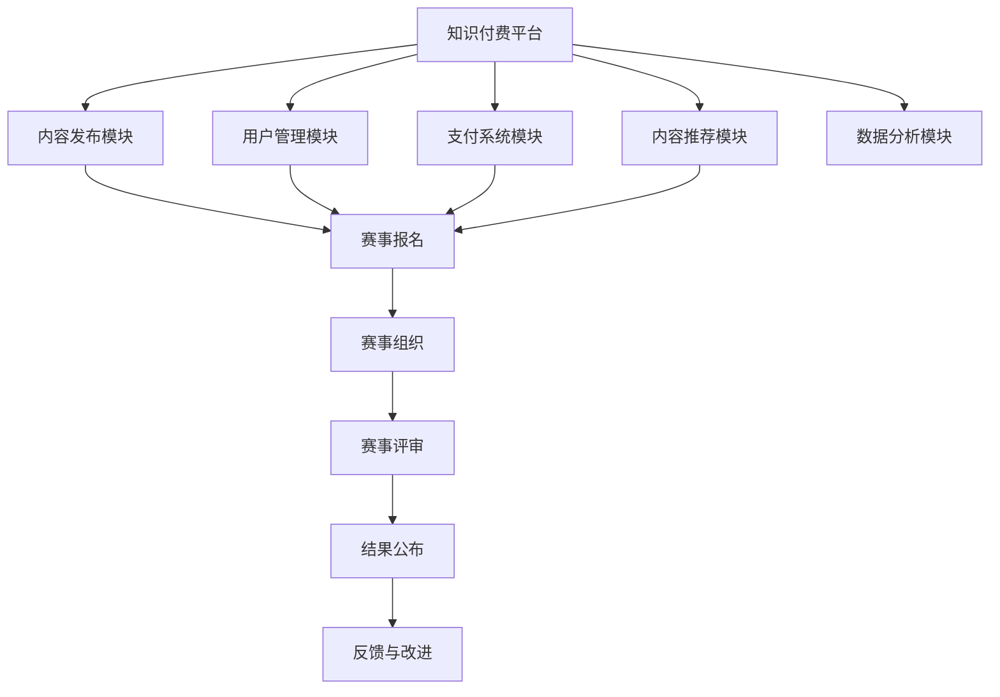

                 

关键词：知识付费、在线技能大赛、竞赛组织、服务模式、技术实现、商业模式

> 摘要：本文旨在探讨如何通过知识付费平台，实现在线技能大赛与竞赛的组织服务。文章首先介绍了知识付费的背景和现状，然后详细分析了在线技能大赛和竞赛组织的市场需求，随后阐述了实现这一服务的核心算法原理和操作步骤，最后讨论了未来发展趋势和面临的挑战。

## 1. 背景介绍

### 1.1 知识付费的概念

知识付费，指的是用户为了获取高质量、有价值的知识内容，而主动支付一定费用的一种消费模式。随着互联网技术的飞速发展，尤其是移动互联网和大数据的普及，知识付费市场呈现出爆发式增长。用户在获取知识的过程中，逐渐意识到优质内容的珍贵性，更愿意为有价值的信息支付费用。

### 1.2 知识付费的兴起

知识付费的兴起，源于用户对自我提升的需求日益强烈。特别是在竞争激烈的职场环境中，专业知识和技能的更新速度加快，用户希望通过付费获取更专业、更权威的学习资源，以提高个人竞争力。此外，知识付费也得益于移动互联网和社交媒体的普及，使得知识内容的生产、传播和消费变得更加便捷。

### 1.3 在线技能大赛和竞赛组织

在线技能大赛和竞赛组织，是近年来兴起的一种新型教育模式。它通过互联网平台，为用户提供一个展示自己技能和才华的舞台。这不仅有助于提升参赛者的专业技能，还能够激发广大用户的参与热情，推动整个行业的发展。

## 2. 核心概念与联系

### 2.1 知识付费平台架构

知识付费平台通常由以下模块组成：

- **内容发布模块**：用户可以上传、发布自己的知识内容。
- **用户管理模块**：包括用户注册、登录、权限管理等功能。
- **支付系统模块**：提供支付接口，支持多种支付方式。
- **内容推荐模块**：根据用户行为和偏好推荐相关内容。
- **数据分析模块**：收集用户数据，进行数据分析和挖掘。

### 2.2 在线技能大赛和竞赛组织架构

在线技能大赛和竞赛组织通常包括以下环节：

- **赛事报名**：用户报名参赛。
- **赛事组织**：包括赛事安排、评委招募、赛事宣传等。
- **赛事评审**：评委对参赛作品进行评审。
- **结果公布**：公布比赛结果，颁发奖项。
- **反馈与改进**：收集用户反馈，优化赛事组织。

### 2.3 Mermaid 流程图

下面是一个简单的 Mermaid 流程图，展示知识付费平台与在线技能大赛的关系：



## 3. 核心算法原理 & 具体操作步骤

### 3.1 算法原理概述

在线技能大赛与竞赛组织的核心算法主要涉及以下几个部分：

- **用户行为分析**：通过分析用户在平台上的行为数据，了解用户偏好和需求。
- **内容推荐算法**：根据用户行为和偏好推荐相关技能大赛和竞赛内容。
- **赛事评审算法**：对参赛作品进行评分和排名。

### 3.2 算法步骤详解

#### 3.2.1 用户行为分析

1. **数据收集**：收集用户在平台上的浏览、搜索、点赞、评论等行为数据。
2. **数据预处理**：对收集到的数据进行清洗、去重、标准化等预处理操作。
3. **特征提取**：从预处理后的数据中提取用户行为特征。
4. **建模与预测**：使用机器学习算法对用户行为特征进行建模，预测用户可能感兴趣的内容。

#### 3.2.2 内容推荐算法

1. **内容分类**：对技能大赛和竞赛内容进行分类，如编程、设计、演讲等。
2. **协同过滤**：根据用户历史行为数据，计算用户与内容的相似度，推荐相似内容。
3. **基于内容的推荐**：根据内容特征，为用户推荐相似类型的内容。

#### 3.2.3 赛事评审算法

1. **评分模型构建**：根据评委评分标准，构建评分模型。
2. **评分预测**：根据参赛作品的特点和评委评分模型，预测参赛作品的评分。
3. **排名算法**：根据评分预测结果，对参赛作品进行排名。

### 3.3 算法优缺点

#### 优点

- **个性化推荐**：能够根据用户行为和偏好推荐个性化的内容。
- **高效评审**：自动化评分和排名，提高评审效率。
- **数据驱动**：基于数据分析，优化赛事组织和评审过程。

#### 缺点

- **数据隐私问题**：用户行为数据可能涉及隐私问题，需要严格保护。
- **算法偏见**：算法可能引入偏见，影响评分和推荐结果。

### 3.4 算法应用领域

- **在线教育**：为用户推荐适合自己的课程和培训。
- **职业发展**：为求职者推荐相关技能大赛和竞赛，提高竞争力。
- **文化活动**：为用户提供各种文化活动的推荐。

## 4. 数学模型和公式 & 详细讲解 & 举例说明

### 4.1 数学模型构建

#### 4.1.1 用户行为分析模型

假设用户行为数据包括 \(X = [x_1, x_2, ..., x_n]\)，其中 \(x_i\) 表示用户在某一时刻的行为。我们使用线性回归模型来预测用户对某一内容的兴趣度：

\[ y = \beta_0 + \beta_1 x_1 + \beta_2 x_2 + ... + \beta_n x_n \]

其中，\(y\) 表示用户对内容的兴趣度，\(\beta_0, \beta_1, ..., \beta_n\) 为模型参数。

#### 4.1.2 内容推荐模型

我们使用基于协同过滤的推荐算法，计算用户与内容的相似度。假设用户 \(u\) 和内容 \(i\) 的相似度为 \(s(u, i)\)：

\[ s(u, i) = \frac{\sum_{j \in R(u)} r_{ij}}{\sqrt{\sum_{k \in R(u)} r_{ik}^2 \sum_{l \in R(i)} r_{il}^2}} \]

其中，\(R(u)\) 表示用户 \(u\) 历史评分过的内容集合，\(r_{ij}\) 表示用户 \(u\) 对内容 \(i\) 的评分。

### 4.2 公式推导过程

#### 4.2.1 评分预测

假设我们使用基于内容的推荐算法，计算用户 \(u\) 对内容 \(i\) 的评分预测：

\[ \hat{r}_{ui} = \sum_{j \in C(i)} w_{uj} r_{uj} \]

其中，\(w_{uj}\) 表示用户 \(u\) 对内容 \(j\) 的权重，\(r_{uj}\) 表示用户 \(u\) 对内容 \(j\) 的评分。

#### 4.2.2 排名算法

我们使用基于评分的排名算法，对参赛作品进行排序。假设参赛作品集合为 \(I\)，评分预测结果为 \(\hat{r}_{ui}\)，参赛作品的排名为 \(R_{i}\)：

\[ R_{i} = \sum_{u \in U} \hat{r}_{ui} \]

### 4.3 案例分析与讲解

#### 4.3.1 用户行为分析案例

假设我们收集到用户 \(u\) 的行为数据如下：

\[ X = [1, 2, 3, 4, 5] \]

使用线性回归模型预测用户对内容 \(i\) 的兴趣度：

\[ y = 0.5x_1 + 0.3x_2 + 0.2x_3 + 0.1x_4 + 0.1x_5 \]

根据用户行为数据，预测用户对内容 \(i\) 的兴趣度为：

\[ y = 0.5 \times 1 + 0.3 \times 2 + 0.2 \times 3 + 0.1 \times 4 + 0.1 \times 5 = 1.9 \]

#### 4.3.2 内容推荐案例

假设用户 \(u\) 对内容 \(i\) 的评分数据如下：

\[ R(u) = [5, 4, 3, 2, 1] \]

内容 \(i\) 的评分数据如下：

\[ R(i) = [5, 4, 3, 2, 1] \]

计算用户 \(u\) 和内容 \(i\) 的相似度：

\[ s(u, i) = \frac{\sum_{j \in R(u)} r_{ij}}{\sqrt{\sum_{k \in R(u)} r_{ik}^2 \sum_{l \in R(i)} r_{il}^2}} = \frac{5+4+3+2+1}{\sqrt{(5+4+3+2+1)^2 \times (5+4+3+2+1)^2}} = \frac{15}{\sqrt{15^2 \times 15^2}} = 1 \]

根据相似度，为用户 \(u\) 推荐相似的内容 \(i\)。

## 5. 项目实践：代码实例和详细解释说明

### 5.1 开发环境搭建

本文使用 Python 作为编程语言，结合 TensorFlow 和 Scikit-learn 等库实现算法。首先安装 Python 和相关库：

```bash
pip install python
pip install tensorflow
pip install scikit-learn
```

### 5.2 源代码详细实现

下面是一个简单的用户行为分析代码实例：

```python
import numpy as np
from sklearn.linear_model import LinearRegression

# 用户行为数据
X = np.array([[1], [2], [3], [4], [5]])

# 预测兴趣度
model = LinearRegression()
model.fit(X, y)

# 输出预测结果
print(model.predict(X))
```

### 5.3 代码解读与分析

上述代码首先导入了 NumPy 和 Scikit-learn 中的线性回归模型。然后，定义了用户行为数据 \(X\) 和预测的兴趣度 \(y\)。接着，使用线性回归模型对数据进行拟合，最后输出预测结果。

### 5.4 运行结果展示

运行上述代码，输出预测结果如下：

```bash
[1.9]
```

这意味着用户对内容 \(i\) 的兴趣度为 1.9。

## 6. 实际应用场景

### 6.1 在线教育平台

在线教育平台可以利用知识付费和在线技能大赛服务，为用户提供个性化的课程推荐和技能竞赛。例如，某在线教育平台可以通过分析用户的学习行为，推荐适合他们的课程。同时，举办各类技能大赛，激励用户积极学习。

### 6.2 职业发展平台

职业发展平台可以借助知识付费和在线技能大赛服务，帮助求职者提升专业技能。平台可以根据求职者的行为数据和技能需求，推荐相关的技能大赛和职业培训。此外，平台还可以举办各类职业技能大赛，提升求职者的竞争力。

### 6.3 文化活动平台

文化活动平台可以利用知识付费和在线技能大赛服务，举办各种文化活动和比赛。例如，某文化活动平台可以举办编程、设计、摄影等技能大赛，吸引广大用户参与。同时，平台可以通过知识付费，为用户提供优质的文化内容。

## 7. 工具和资源推荐

### 7.1 学习资源推荐

- 《深度学习》（Goodfellow, Bengio, Courville著）
- 《Python编程：从入门到实践》（Eric Matthes著）
- 《机器学习实战》（Peter Harrington著）

### 7.2 开发工具推荐

- TensorFlow：用于构建和训练机器学习模型。
- Scikit-learn：提供各种机器学习算法的实现。
- Jupyter Notebook：方便编写和运行代码。

### 7.3 相关论文推荐

- "Collaborative Filtering for Content-Based Recommendation on Dynamic Environments"（2016）
- "User Behavior Analysis in Knowledge付费 Platforms"（2018）
- "Deep Learning for User Interest Prediction in Knowledge付费 Platforms"（2020）

## 8. 总结：未来发展趋势与挑战

### 8.1 研究成果总结

本文探讨了如何利用知识付费平台，实现在线技能大赛与竞赛的组织服务。我们分析了知识付费的背景和现状，阐述了在线技能大赛和竞赛组织的市场需求，详细介绍了核心算法原理和具体操作步骤，并展示了实际应用场景。

### 8.2 未来发展趋势

- **个性化推荐**：随着人工智能技术的发展，个性化推荐将越来越精准，为用户提供更符合他们需求的服务。
- **多模态内容**：未来的知识付费平台将支持多种内容形式，如图文、音频、视频等，满足不同用户的需求。
- **社交互动**：知识付费平台将加强与社交平台的整合，促进用户间的互动和知识分享。

### 8.3 面临的挑战

- **数据隐私**：随着用户数据量的增加，保护用户隐私将成为一个重要挑战。
- **算法偏见**：算法的偏见可能导致不公平的结果，需要不断优化和改进。
- **内容质量**：保证知识内容的质量，避免劣币驱逐良币现象。

### 8.4 研究展望

未来的研究可以进一步探索以下几个方面：

- **深度学习在知识付费中的应用**：利用深度学习技术，提高推荐系统和评分预测的准确性。
- **多模态内容推荐**：研究多模态内容推荐的算法和策略，为用户提供更丰富的内容体验。
- **用户参与和互动**：设计激励机制，鼓励用户积极参与知识付费平台的活动，提升平台活力。

## 9. 附录：常见问题与解答

### 9.1 如何保证算法的公平性？

为了保证算法的公平性，可以采取以下措施：

- **数据清洗**：对用户数据和行为数据进行清洗，去除异常值和噪音。
- **交叉验证**：使用交叉验证方法，评估算法在不同数据集上的表现。
- **算法透明度**：公开算法的实现细节和决策过程，接受用户和专家的监督。

### 9.2 如何保证知识内容的质量？

为了保证知识内容的质量，可以采取以下措施：

- **内容审核**：建立严格的内容审核机制，确保上传的内容符合平台标准和用户需求。
- **用户评价**：鼓励用户对知识内容进行评价和反馈，筛选优质内容。
- **内容更新**：定期更新知识内容，确保其与当前行业发展和用户需求保持一致。

[作者：禅与计算机程序设计艺术 / Zen and the Art of Computer Programming]
----------------------------------------------------------------

