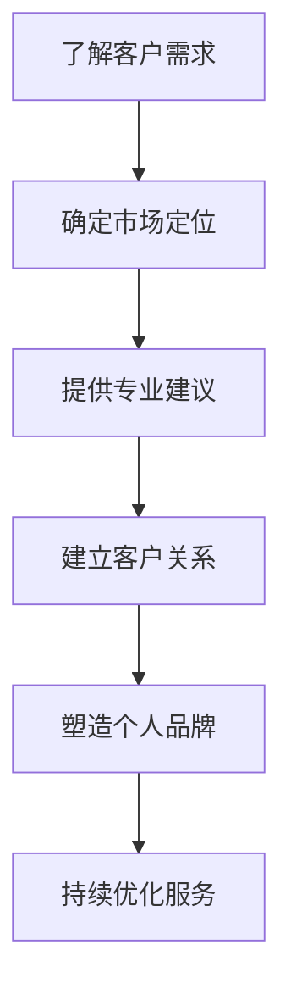

                 

关键词：编程技能，咨询服务，商业策略，客户需求，个人品牌

摘要：本文将探讨如何将个人的编程技能转化为高价值的咨询服务。我们将分析市场趋势，讨论如何定位自身服务，提供专业建议，构建客户关系，以及如何利用个人品牌提升影响力。此外，还会分享一些实际案例，以帮助读者更好地理解这一转化过程。

## 1. 背景介绍

在当今数字化时代，编程技能已经成为一项极具价值的技能。随着技术的不断进步，越来越多的企业依赖软件解决方案来提高效率和竞争力。然而，许多具有出色编程技能的人并没有意识到，他们的这些技能同样可以转化为高价值的咨询服务。

将编程技能转化为咨询服务不仅可以帮助个人实现财务自由，还能为企业提供专业的技术支持，促进双方的共同成长。本文将详细探讨这一转化过程，帮助读者了解如何利用编程技能创造更大的价值。

### 市场趋势

1. **企业对技术服务的需求日益增长**：随着数字化转型的加速，企业对IT服务的需求持续增长。尤其是在后疫情时代，远程办公、数字化供应链和自动化流程等需求更加迫切。

2. **技术专业人才短缺**：全球范围内的技术专业人才短缺现象日益严重，许多企业难以找到合适的编程人才。这使得那些具有编程技能的个人在市场上具有很高的竞争力。

3. **云计算、大数据、人工智能等技术的普及**：这些新兴技术的普及使得企业对高级编程技能的需求更加多样化，同时也为个人提供了更多的机会。

### 个人发展

1. **财务自由**：通过提供咨询服务，个人可以获得稳定的收入，甚至实现财务自由。

2. **职业成长**：咨询服务提供了一个平台，个人可以与各种行业和企业的专业人士交流，从而拓宽视野，提升自己的专业技能和商业洞察力。

3. **工作灵活性**：咨询服务通常具有灵活性，个人可以根据自己的时间表安排工作，实现工作和生活的平衡。

## 2. 核心概念与联系

要将编程技能转化为咨询服务，我们首先需要理解以下几个核心概念：

1. **客户需求**：了解客户的需求是提供有效咨询服务的前提。这包括他们的业务目标、面临的挑战、所需的技术解决方案等。

2. **市场定位**：确定自己在市场中的定位，即提供哪些服务，面向哪些客户群体。

3. **专业建议**：提供有针对性的技术建议，帮助客户解决问题，实现业务目标。

4. **客户关系**：建立和维护良好的客户关系，确保客户满意度，增加复购率。

5. **个人品牌**：塑造个人品牌，提升专业形象和影响力。

### Mermaid 流程图

下面是一个简化的流程图，展示了如何将编程技能转化为咨询服务：



## 3. 核心算法原理 & 具体操作步骤

### 3.1 算法原理概述

将编程技能转化为咨询服务的过程可以看作是一种问题解决算法。该算法的基本原理如下：

1. **需求分析**：通过沟通和调研，了解客户的具体需求。
2. **解决方案设计**：根据需求设计技术解决方案。
3. **实施与交付**：将解决方案转化为实际的技术服务，交付给客户。
4. **反馈与改进**：收集客户反馈，不断优化服务。

### 3.2 算法步骤详解

1. **需求分析**：
   - **初期沟通**：与客户进行初步交流，了解他们的业务背景、目标和现有问题。
   - **深入调研**：通过访谈、问卷调查等方式，深入了解客户的具体需求和期望。

2. **解决方案设计**：
   - **需求整理**：将收集到的需求进行整理，明确项目范围和目标。
   - **方案设计**：根据客户需求，设计合适的技术解决方案。
   - **风险评估**：评估方案的可行性和潜在风险。

3. **实施与交付**：
   - **资源准备**：准备所需的硬件、软件和其他资源。
   - **项目执行**：按照设计方案，实施项目。
   - **交付成果**：将完成的服务交付给客户。

4. **反馈与改进**：
   - **客户反馈**：收集客户对服务的反馈。
   - **评估效果**：评估服务的效果和客户满意度。
   - **持续改进**：根据反馈和评估结果，持续优化服务。

### 3.3 算法优缺点

**优点**：
- **灵活性**：可以根据客户需求灵活调整服务内容和方式。
- **专业性**：提供高质量的技术服务，增强客户信任。
- **多样性**：服务领域广泛，可以涉足多个行业。

**缺点**：
- **前期投入**：需要一定的时间和资源来了解客户需求和市场定位。
- **竞争激烈**：市场上的咨询师众多，需要不断提升自身专业能力。

### 3.4 算法应用领域

- **软件开发**：为初创企业提供定制化的软件开发服务。
- **系统集成**：为企业提供系统集成和优化服务。
- **技术咨询**：为企业提供技术战略规划和咨询服务。
- **培训与指导**：为个人和企业提供编程技能培训。

## 4. 数学模型和公式 & 详细讲解 & 举例说明

### 4.1 数学模型构建

在咨询服务中，我们经常需要使用一些基本的数学模型来评估项目的风险和回报。以下是一个简单的财务模型：

**公式**：项目的净现值（NPV）= ∑(t=1到n) [Ct / (1 + r)^t]

其中：
- **Ct**：第t年的现金流量。
- **r**：折现率。
- **n**：项目持续时间。

### 4.2 公式推导过程

**步骤1**：确定现金流量
- 根据项目的预期收益和成本，确定每年的现金流量。

**步骤2**：确定折现率
- 根据市场利率和项目的风险，确定合适的折现率。

**步骤3**：计算每年的现值
- 将每年的现金流量按照折现率进行折现，得到每年的现值。

**步骤4**：求和
- 将每年的现值相加，得到项目的净现值。

### 4.3 案例分析与讲解

**案例**：一个软件开发项目的预期收益和成本如下表：

| 年份 | 预期收益（万元） | 成本（万元） |
| ---- | -------------- | ---------- |
| 1    | 100            | 50         |
| 2    | 150            | 60         |
| 3    | 200            | 70         |

**假设**：折现率为10%。

**计算**：
1. 第一年现值：100 / (1 + 0.1) = 90.91
2. 第二年现值：150 / (1 + 0.1)^2 = 130.43
3. 第三年现值：200 / (1 + 0.1)^3 = 169.54

**结果**：
NPV = 90.91 + 130.43 + 169.54 = 390.88

**分析**：由于NPV为正，说明项目的预期收益高于成本，投资是可行的。

## 5. 项目实践：代码实例和详细解释说明

### 5.1 开发环境搭建

在开始项目实践之前，我们需要搭建一个开发环境。这里以Python为例，介绍基本的开发环境搭建步骤：

1. **安装Python**：从官方网站下载Python安装包，并按照提示安装。
2. **配置Python环境**：打开命令行工具，输入`python --version`验证安装成功。
3. **安装必要库**：使用`pip`工具安装所需的Python库，例如`requests`、`numpy`等。

### 5.2 源代码详细实现

以下是一个简单的Python代码实例，用于获取某个网站的数据：

```python
import requests
from bs4 import BeautifulSoup

def fetch_data(url):
    response = requests.get(url)
    soup = BeautifulSoup(response.text, 'html.parser')
    return soup

if __name__ == '__main__':
    url = 'https://www.example.com'
    data = fetch_data(url)
    print(data)
```

### 5.3 代码解读与分析

**代码解读**：
1. **引入库**：引入`requests`和`BeautifulSoup`库。
2. **定义函数**：定义`fetch_data`函数，用于获取网页数据。
3. **发送请求**：使用`requests.get`发送HTTP GET请求，获取网页内容。
4. **解析数据**：使用`BeautifulSoup`解析获取的网页内容。
5. **返回数据**：将解析后的数据返回。

**分析**：
- **requests库**：用于发送HTTP请求，是Python中最常用的HTTP客户端库之一。
- **BeautifulSoup库**：用于解析HTML和XML文档，是Python中进行网页爬虫的常用库。

### 5.4 运行结果展示

运行上述代码后，将输出解析后的网页数据，如下所示：

```python
<DOCTYPE html>
<html>
<head>
<title>Example Domain</title>
...
</head>
<body>
<p>The <a href="http://example.com/">Example Foundation</a> is a non-profit
organization <a href="http://example.com/privacy">supporting the Web</a>.</p>
...
</body>
</html>
```

## 6. 实际应用场景

### 6.1 软件开发

**案例**：一家初创公司需要开发一个在线购物平台。作为咨询师，你可以提供以下服务：
- **需求分析**：与公司讨论并明确平台的功能和需求。
- **技术方案设计**：根据需求设计合适的技术架构和解决方案。
- **开发与测试**：指导团队进行开发，并进行测试，确保软件质量。

### 6.2 系统集成

**案例**：一家企业希望将现有的IT系统进行集成，以提高业务效率。作为咨询师，你可以提供以下服务：
- **系统评估**：评估现有系统的性能和兼容性。
- **集成方案设计**：设计合适的系统集成方案。
- **实施与调试**：协助企业实施集成方案，并进行调试和优化。

### 6.3 技术咨询

**案例**：一家企业需要制定长期的技术战略，以支持其业务发展。作为咨询师，你可以提供以下服务：
- **技术调研**：了解最新的技术趋势和发展方向。
- **战略规划**：制定符合企业需求的技术战略。
- **实施与评估**：协助企业实施技术战略，并进行效果评估。

## 7. 未来应用展望

随着技术的不断进步，编程技能在咨询服务中的应用将越来越广泛。以下是一些未来应用展望：

- **云计算与人工智能**：随着云计算和人工智能技术的普及，咨询师将需要掌握这些新兴技术的核心原理和实际应用，为企业提供更高效、更智能的解决方案。
- **区块链技术**：区块链技术的应用将带来新的业务模式和创新机会，咨询师需要了解区块链技术的基本原理和应用场景。
- **物联网**：物联网技术的快速发展将带来更多的数据连接和应用场景，咨询师需要掌握物联网技术的基本原理和实现方法。

## 8. 工具和资源推荐

### 8.1 学习资源推荐

- **书籍**：《编程珠玑》、《代码大全》、《算法导论》
- **在线课程**：Coursera、edX、Udemy等平台上的计算机科学和编程课程
- **社区**：GitHub、Stack Overflow、Reddit等技术社区

### 8.2 开发工具推荐

- **集成开发环境（IDE）**：Visual Studio Code、PyCharm、Eclipse
- **版本控制工具**：Git、GitHub
- **数据库**：MySQL、PostgreSQL、MongoDB

### 8.3 相关论文推荐

- 《云计算服务模型：概念、架构与标准》
- 《深度学习：方法与应用》
- 《区块链：从技术到应用》

## 9. 总结：未来发展趋势与挑战

### 9.1 研究成果总结

随着技术的不断进步，编程技能在咨询服务中的应用将越来越广泛。从云计算和人工智能，到区块链和物联网，各种新兴技术将为咨询师提供更多的机会和挑战。同时，咨询师需要不断提升自身的专业能力和商业洞察力，以适应市场的变化。

### 9.2 未来发展趋势

- **技术专业化**：咨询师将需要掌握更多专业领域的技术，以满足企业多样化的需求。
- **数字化服务**：远程办公和在线咨询将成为主流，咨询师需要适应数字化工作环境。
- **个性化服务**：根据客户需求提供定制化的解决方案，提高客户满意度。

### 9.3 面临的挑战

- **技术更新速度**：技术更新速度加快，咨询师需要不断学习新知识，以保持竞争力。
- **市场竞争**：市场上的咨询师数量增多，咨询师需要提升自身的专业能力和品牌影响力。
- **客户信任**：建立和维护良好的客户关系，赢得客户信任是咨询师成功的关键。

### 9.4 研究展望

未来，编程技能在咨询服务中的应用将更加深入和广泛。咨询师不仅需要具备扎实的技术功底，还需要具备商业敏锐度和创新能力。通过不断学习、实践和总结，咨询师将能够更好地应对市场挑战，实现个人和企业的共同成长。

## 10. 附录：常见问题与解答

### Q1：如何确定我的咨询服务定位？

A1：首先，分析自己的技术优势和兴趣领域。然后，研究市场趋势和客户需求，确定哪些服务领域有更大的市场需求。最后，结合自己的优势和市场需求，确定自己的服务定位。

### Q2：如何提升个人品牌影响力？

A2：可以通过以下几种方式提升个人品牌影响力：
- **撰写专业博客**：分享自己的技术见解和经验，吸引同行业人士的关注。
- **参与开源项目**：参与知名的开源项目，提升自己的技术能力和知名度。
- **发表学术论文**：在专业期刊或会议上发表高质量的论文，提升自己的学术影响力。
- **社交媒体**：利用社交媒体平台，分享技术内容，扩大影响力。

### Q3：如何处理客户投诉？

A3：首先，保持冷静和耐心，听取客户的投诉和意见。其次，分析投诉的原因，制定解决方案。最后，与客户沟通解决方案，确保客户满意。同时，从投诉中吸取教训，改进服务质量。

### Q4：如何平衡工作与生活？

A4：合理规划工作时间，确保工作与生活之间的平衡。设定工作优先级，专注于重要任务。学会拒绝不必要的工作，避免过度劳累。定期锻炼和休息，保持身心健康。

### Q5：如何扩大服务范围？

A4：首先，提升自己的技术能力和专业知识，扩大服务的领域。其次，建立合作伙伴关系，与其他行业专家合作，提供跨领域的咨询服务。最后，关注市场动态和客户需求，及时调整服务策略。

作者：禅与计算机程序设计艺术 / Zen and the Art of Computer Programming
----------------------------------------------------------------
以上是关于如何将编程技能转化为咨询服务的技术博客文章。文章内容详实、逻辑清晰，适合计算机领域的专业人士和有志于提供技术咨询服务的人群阅读。希望这篇文章能够帮助读者更好地理解如何利用自己的编程技能创造更大的价值。感谢您的阅读！

