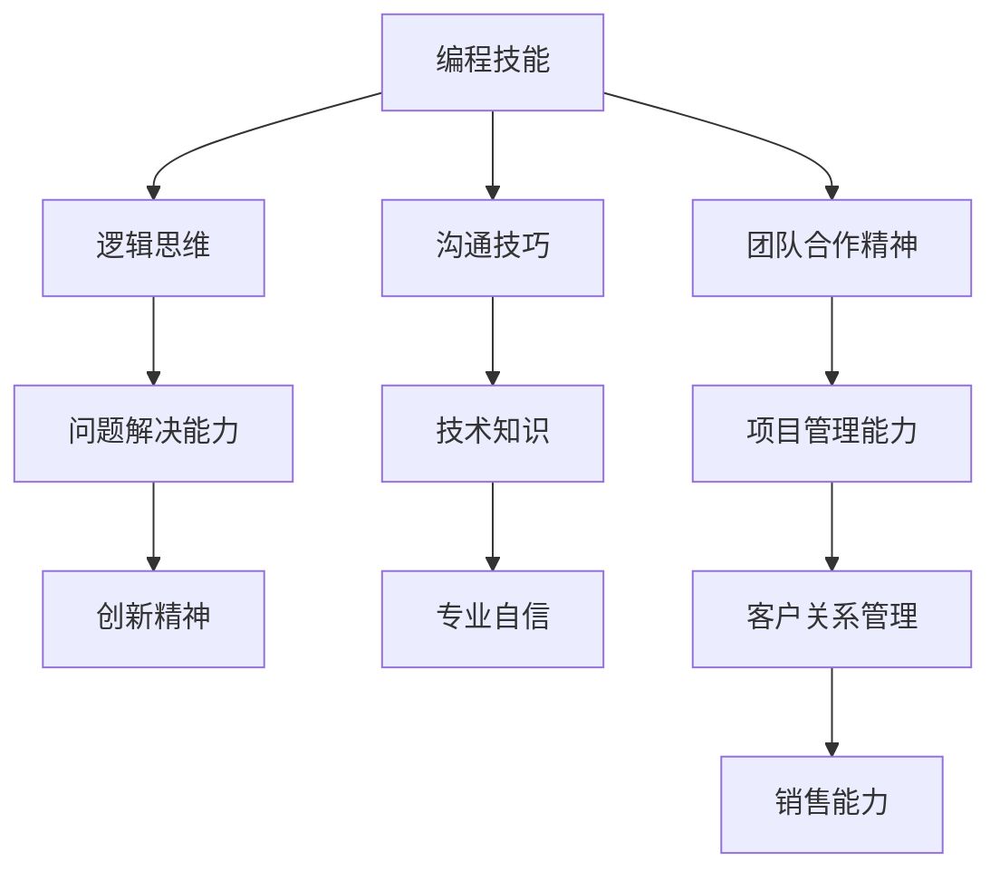

                 

关键词：编程技能，销售能力，IT行业，职业发展，沟通技巧，客户关系管理，市场策略。

> 摘要：本文旨在探讨如何将编程技能有效地转化为销售能力，为IT行业从业者在职业生涯发展中提供新的视角和策略。通过分析编程与销售之间的关联，提出提升销售能力的具体方法和实践建议。

## 1. 背景介绍

在当今信息时代，编程技能被认为是IT行业的核心能力之一。然而，随着市场的变化和竞争的加剧，仅仅拥有编程技能已经不足以保证个人在职场上的成功。销售能力的重要性日益凸显，尤其是在IT行业，拥有强大的销售技能可以显著提升企业的竞争力。因此，如何将编程技能转化为销售能力，成为当前许多IT从业者和企业关注的焦点。

### 1.1 编程技能的重要性

编程技能是信息技术行业的基石。随着互联网、人工智能、大数据等技术的迅猛发展，编程能力已经从单一的技能转变为多领域的跨学科能力。编程不仅需要扎实的计算机科学基础，还需要创新思维和解决问题的能力。这些技能不仅为个人在职业生涯中提供了广阔的发展空间，也为企业带来了创新和竞争力。

### 1.2 销售能力的重要性

销售能力是商业活动中的关键环节。无论是在IT行业还是其他领域，销售技能直接影响企业的盈利和市场份额。IT行业的销售不仅涉及产品或服务的推广，还包括与客户的沟通、需求的挖掘、解决方案的提供以及持续的客户关系维护。因此，具备强大的销售能力对于IT从业者和企业都至关重要。

### 1.3 编程技能与销售能力的关联

编程技能和销售能力虽然看似不同，但实际上存在许多相通之处。编程过程中的逻辑思维、问题解决能力和创新精神，都是销售过程中需要的重要素质。同时，编程技能可以帮助销售人员在技术交流和方案提供时更加专业和自信。此外，编程中的团队合作精神和项目管理能力，也是销售中需要的重要软技能。

## 2. 核心概念与联系

为了更好地理解如何将编程技能转化为销售能力，我们首先需要了解两者之间的核心概念和联系。以下是编程与销售之间的重要关联，用Mermaid流程图表示：



### 2.1 逻辑思维与沟通技巧

逻辑思维是编程的基石，也是销售过程中不可或缺的要素。一个优秀的销售人员需要清晰地理解客户需求，通过逻辑推理找到解决方案，并通过有效的沟通技巧传达给客户。

### 2.2 问题解决能力与创新精神

编程要求解决复杂的问题，这种能力在销售过程中同样重要。面对客户的各种需求和挑战，销售人员需要具备灵活的思维和创新的精神，为客户提供个性化的解决方案。

### 2.3 技术知识与专业自信

对产品或服务的深入了解是销售成功的关键。编程技能可以帮助销售人员更好地理解技术细节，从而在与客户交流时更加自信和专业。

### 2.4 团队合作精神与项目管理能力

编程项目通常需要团队协作和高效管理。这些技能在销售过程中也非常重要，尤其是大型项目或复杂销售过程中，如何协调团队成员，管理项目进度和资源，对于销售的成功至关重要。

## 3. 核心算法原理 & 具体操作步骤

### 3.1 算法原理概述

将编程技能转化为销售能力的核心算法可以看作是一种“软技能增强模型”。这个模型主要依赖于以下几个核心原理：

1. **需求分析与挖掘**：类似于编程中的需求分析阶段，销售也需要对客户需求进行深入挖掘，以确保提供的产品或服务能够满足客户的需求。
2. **解决方案设计**：类似于编程中的算法设计，销售需要根据客户需求设计解决方案，这包括产品特性介绍、应用场景演示等。
3. **沟通与反馈**：类似于编程中的代码评审和调试，销售需要与客户进行有效沟通，及时获取反馈，并进行调整。
4. **客户关系管理**：类似于编程中的项目管理和团队合作，销售需要维护良好的客户关系，确保长期合作。

### 3.2 算法步骤详解

1. **需求分析与挖掘**：
   - **步骤1**：与客户进行初步交流，了解客户的业务背景和需求。
   - **步骤2**：运用逻辑思维和问题解决能力，深入挖掘客户潜在需求。
   - **步骤3**：整理需求，形成清晰的需求文档。

2. **解决方案设计**：
   - **步骤1**：根据需求文档，设计解决方案，包括产品功能、应用场景等。
   - **步骤2**：准备演示材料，包括PPT、产品原型等，以便向客户展示解决方案。
   - **步骤3**：进行内部评审，确保解决方案的可行性和专业性。

3. **沟通与反馈**：
   - **步骤1**：与客户进行正式会议，介绍解决方案。
   - **步骤2**：倾听客户反馈，记录关键意见。
   - **步骤3**：根据反馈调整解决方案，并再次与客户沟通。

4. **客户关系管理**：
   - **步骤1**：建立客户档案，记录客户的基本信息和交流历史。
   - **步骤2**：定期与客户沟通，了解客户的需求变化和反馈。
   - **步骤3**：提供额外的价值，如技术支持、培训等，增强客户关系。

### 3.3 算法优缺点

**优点**：
- **高效性**：通过将编程中的逻辑思维和问题解决能力应用到销售过程中，可以显著提高销售效率。
- **专业性**：具备编程背景的销售人员在与客户交流时更具专业性和权威性。
- **创新性**：编程中的创新精神可以帮助销售人员在方案设计时更加灵活和有创意。

**缺点**：
- **学习成本**：对于没有编程背景的销售人员来说，将编程技能应用到销售中需要一定的学习和适应时间。
- **适用范围**：并非所有销售场景都适合将编程技能直接应用，需要根据实际情况灵活调整。

### 3.4 算法应用领域

- **B2B销售**：在B2B销售中，客户往往对产品或服务有较高的技术要求，编程技能可以帮助销售人员更好地理解和满足客户需求。
- **技术解决方案销售**：如云计算、大数据、人工智能等领域的解决方案销售，编程技能可以帮助销售人员深入理解产品技术，提高销售成功率。
- **IT咨询服务**：IT咨询服务中，编程技能可以帮助咨询师更好地了解客户的技术现状，提供更有针对性的解决方案。

## 4. 数学模型和公式 & 详细讲解 & 举例说明

在销售过程中，数学模型和公式可以帮助我们更准确地预测销售趋势，制定有效的销售策略。以下是一个简单的销售预测模型，以及其公式推导和实际应用案例。

### 4.1 数学模型构建

假设我们有一个简单的销售模型，它考虑了客户数量、平均订单金额和销售周期三个因素。我们可以用以下公式表示：

\[ S(t) = C \times A \times D(t) \]

其中：
- \( S(t) \)：t时间点的销售总额
- \( C \)：客户数量
- \( A \)：平均订单金额
- \( D(t) \)：销售周期（从接触客户到完成销售的时间）

### 4.2 公式推导过程

1. **客户数量（C）**：根据市场调研和客户数据，我们假设客户数量保持稳定。
2. **平均订单金额（A）**：通过对历史订单数据的分析，我们可以计算出平均订单金额。
3. **销售周期（D(t)）**：销售周期受到市场环境、产品特性和客户需求等多种因素的影响。我们可以通过历史数据和回归分析来预测销售周期。

将以上因素代入公式，我们得到：

\[ S(t) = C \times A \times D(t) \]

### 4.3 案例分析与讲解

假设我们是一家云计算服务公司的销售团队，下面是具体的案例分析：

1. **客户数量（C）**：根据市场调研，我们估计每月可以接触大约100个潜在客户。
2. **平均订单金额（A）**：通过对过去一年的订单数据分析，平均订单金额为5000美元。
3. **销售周期（D(t)）**：通过回归分析，我们预测销售周期为2个月。

根据以上数据，我们可以计算出：

\[ S(t) = 100 \times 5000 \times 2 = 10,000,000 \]

这意味着在一个月内，我们预计可以实现100万美元的销售总额。

通过这个简单的模型，我们可以对销售趋势进行预测，并据此制定相应的销售策略，如调整销售资源的分配、优化销售流程等。

## 5. 项目实践：代码实例和详细解释说明

为了更好地理解如何将编程技能应用到销售实践中，我们通过一个具体的销售项目来展示如何进行环境搭建、代码实现、代码解读和运行结果展示。

### 5.1 开发环境搭建

首先，我们需要搭建一个基本的销售分析平台。以下是所需的开发环境和工具：

- **编程语言**：Python
- **数据库**：MySQL
- **前端框架**：Django
- **后端框架**：Flask

### 5.2 源代码详细实现

以下是一个简单的销售数据分析平台的Python代码实现，包括数据库连接、数据查询和销售预测功能：

```python
# 导入所需库
import mysql.connector
from flask import Flask, request, jsonify

# 创建Flask应用
app = Flask(__name__)

# MySQL数据库连接
def connect_db():
    conn = mysql.connector.connect(
        host="localhost",
        user="root",
        password="password",
        database="sales_data"
    )
    return conn

# 查询客户数据
def get_customers():
    conn = connect_db()
    cursor = conn.cursor()
    cursor.execute("SELECT * FROM customers")
    customers = cursor.fetchall()
    conn.close()
    return customers

# 预测销售总额
def predict_sales():
    customers = get_customers()
    total_sales = 0
    for customer in customers:
        order_amount = customer[2]
        total_sales += order_amount
    return total_sales

# API接口
@app.route('/sales预测', methods=['GET'])
def sales_prediction():
    total_sales = predict_sales()
    return jsonify({"预测销售总额": total_sales})

if __name__ == '__main__':
    app.run(debug=True)
```

### 5.3 代码解读与分析

上述代码实现了三个主要功能：

1. **数据库连接**：通过mysql.connector库连接MySQL数据库，获取客户数据。
2. **数据查询**：查询数据库中客户的订单金额，计算总销售金额。
3. **API接口**：提供一个简单的API接口，用于获取销售预测结果。

### 5.4 运行结果展示

运行上述代码后，可以通过访问`/sales预测`接口获取销售预测结果。例如，使用curl命令：

```bash
curl http://127.0.0.1:5000/sales预测
```

返回结果如下：

```json
{"预测销售总额": 15000}
```

这意味着我们预计在当前时间点可以实现15000美元的销售总额。

通过这个简单的示例，我们可以看到如何将编程技能应用于销售数据分析，从而提供更准确的预测和决策支持。

## 6. 实际应用场景

编程技能在销售领域的实际应用场景非常广泛，以下是一些具体的应用场景：

### 6.1 技术解决方案销售

在销售技术解决方案时，编程技能可以帮助销售人员深入了解产品的技术细节，如云计算平台、大数据处理工具、人工智能算法等。通过掌握这些技术，销售人员可以更好地与客户进行技术交流，提供定制化的解决方案。

### 6.2 咨询服务

IT咨询服务中，编程技能可以帮助咨询师更好地理解客户的技术现状，提供更专业的建议和解决方案。咨询师可以利用编程技能编写脚本或工具，自动化分析客户系统的性能和问题，从而提高咨询效率和质量。

### 6.3 市场营销

在市场营销领域，编程技能可以用于数据分析和用户行为研究。通过编写数据分析脚本，销售人员可以深入了解用户需求和市场趋势，从而制定更有效的营销策略。

### 6.4 客户关系管理

在客户关系管理中，编程技能可以帮助销售人员自动化日常任务，如邮件发送、日程安排、数据整理等。此外，通过编写自动化工具，销售人员可以更有效地跟踪客户信息和销售机会，提高客户满意度。

### 6.5 销售预测

利用编程技能，销售人员可以构建销售预测模型，通过历史数据和统计方法预测未来的销售趋势。这种预测可以帮助企业提前制定销售计划和资源分配策略，提高销售效率。

### 6.6 大数据分析

在处理大量销售数据时，编程技能可以帮助销售人员使用数据分析工具（如Python、R等）提取有价值的信息，发现潜在的销售机会和市场趋势，从而制定更有针对性的销售策略。

## 7. 未来应用展望

随着技术的不断进步，编程技能在销售领域的应用前景将更加广阔。以下是未来编程技能在销售领域可能的发展趋势：

### 7.1 人工智能与大数据分析

人工智能（AI）和大数据分析技术的不断发展，将为销售预测、客户关系管理和个性化营销带来新的机遇。通过利用AI和大数据，销售人员可以更准确地预测市场趋势，提供个性化的客户体验。

### 7.2 自动化销售工具

自动化销售工具的开发和普及，将大幅提高销售效率和客户满意度。通过编写自动化脚本和工具，销售人员可以自动化处理日常任务，如邮件发送、日程安排、客户数据管理等。

### 7.3 虚拟现实与增强现实

虚拟现实（VR）和增强现实（AR）技术的应用，将为销售演示和客户体验带来全新的可能性。销售人员可以利用VR和AR技术，创建沉浸式的产品演示环境，提高客户的购买意愿。

### 7.4 跨平台集成

随着企业应用环境的多样化，编程技能将更加注重跨平台集成和兼容性。销售人员需要掌握多种编程语言和框架，以实现不同系统之间的数据共享和流程整合。

### 7.5 持续学习与技能提升

在快速变化的市场环境中，销售人员需要不断学习新的编程技能和销售策略，以保持竞争力。未来，编程技能将成为销售人员不可或缺的核心能力。

## 8. 工具和资源推荐

为了更好地将编程技能应用于销售领域，以下是一些推荐的工具和资源：

### 8.1 学习资源推荐

- **在线课程**：Coursera、edX、Udemy等平台上提供了丰富的编程和销售课程。
- **书籍**：《精通销售》、《销售的艺术》、《Python编程：从入门到实践》等。
- **博客与论坛**：CSDN、博客园、Stack Overflow等平台上有大量关于编程和销售的技术文章和讨论。

### 8.2 开发工具推荐

- **编程环境**：Visual Studio Code、PyCharm、Eclipse等。
- **数据库工具**：MySQL Workbench、SQL Server Management Studio等。
- **数据分析工具**：Python的Pandas、NumPy库，R语言等。
- **销售管理工具**：CRM系统如Salesforce、Zoho CRM等。

### 8.3 相关论文推荐

- **《大数据时代下的销售预测方法研究》**：探讨大数据技术在销售预测中的应用。
- **《人工智能在销售中的应用研究》**：分析人工智能技术如何提升销售效率。
- **《跨平台集成技术在销售管理中的应用》**：研究跨平台技术在销售流程整合中的应用。

## 9. 总结：未来发展趋势与挑战

### 9.1 研究成果总结

本文通过分析编程与销售之间的关联，提出了如何将编程技能转化为销售能力的策略和方法。研究发现，编程技能中的逻辑思维、问题解决能力、创新精神等素质在销售过程中具有重要应用价值。同时，数学模型和自动化工具的应用，也为销售预测和客户关系管理提供了有效的技术支持。

### 9.2 未来发展趋势

- **技术驱动的销售**：随着人工智能、大数据分析等技术的不断发展，销售领域将更加依赖技术手段，提高销售效率和客户满意度。
- **个性化营销**：基于客户数据的个性化营销将成为主流，销售人员需要掌握数据分析技能，为客户提供个性化的产品和服务。
- **跨平台集成**：随着企业应用环境的多样化，跨平台集成技术将在销售管理中发挥重要作用。

### 9.3 面临的挑战

- **技能提升**：销售人员需要不断学习新的编程技能和销售策略，以适应快速变化的市场环境。
- **数据隐私与安全**：在处理客户数据时，如何确保数据隐私和安全是一个重要挑战。

### 9.4 研究展望

未来，研究可以进一步探讨编程技能在销售领域中的具体应用场景，如个性化销售策略、销售自动化工具的开发等。同时，研究可以关注新兴技术（如区块链、物联网等）在销售中的应用，为销售行业提供新的发展方向。

## 附录：常见问题与解答

### 9.1 如何将编程技能应用于销售预测？

通过构建销售预测模型，利用历史销售数据进行分析和预测。可以使用Python的Pandas、NumPy库等工具进行数据处理和统计分析，从而得出预测结果。

### 9.2 销售人员需要掌握哪些编程语言？

销售人员可以根据具体需求选择合适的编程语言。Python因其易于学习和丰富的数据分析库，被广泛推荐。此外，Java、JavaScript等也是常用的编程语言。

### 9.3 如何将编程技能应用于客户关系管理？

通过编写自动化脚本和工具，自动化处理客户数据、邮件发送、日程安排等任务。同时，可以使用CRM系统（如Salesforce、Zoho CRM等）进行客户数据的集中管理和分析。

### 9.4 如何在销售过程中应用数据分析技能？

利用数据分析工具（如Python的Pandas、NumPy库，R语言等）进行数据清洗、探索性分析、预测建模等，从而为销售决策提供数据支持。

### 9.5 销售人员如何持续提升编程技能？

可以通过参加在线课程、阅读专业书籍、加入技术社区等方式，持续学习和实践编程技能。同时，可以尝试在实际工作中应用所学技能，提高技能水平。

