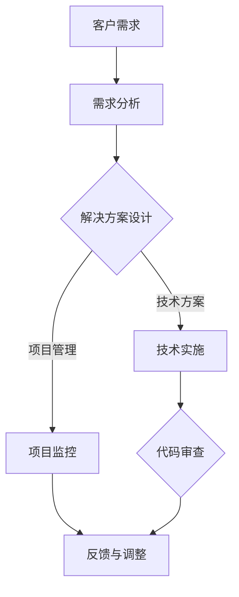

                 

在技术领域，拥有丰富的编程经验无疑是一项宝贵的资产。然而，如何将这些经验有效地转化为有价值的咨询服务，为他人提供帮助并创造商业价值，却是许多程序员和IT专业人士面临的挑战。本文将深入探讨这一转化过程，从多个角度提供实用的策略和建议。

## 文章关键词

- 编程经验
- 技术咨询服务
- 知识转移
- 商业化
- 专业化
- 市场定位

## 摘要

本文旨在帮助拥有编程经验的个人或团队，探索将个人技能转化为技术咨询服务的方法和路径。通过分析市场需求、构建个人品牌、提供高质量服务、以及持续学习和提升，作者将提供一系列实用的策略和技巧，帮助读者在技术咨询服务领域取得成功。

## 1. 背景介绍

在当今快速变化的技术环境中，编程经验不仅是一种技能，更是一种能够持续产生价值的资本。然而，许多程序员和IT专业人士往往局限于编写代码和解决技术问题，而忽视了如何将自己的经验转化为商业机会。技术咨询服务，作为一种将技术知识转化为服务的形式，为个人或团队提供了新的收入来源和职业发展机会。

技术咨询服务通常包括但不限于以下方面：

- 软件开发与维护
- 技术评估与优化
- 系统集成与部署
- 技术培训与指导
- 代码审查与质量控制
- 项目管理与协调

### 1.1 市场需求分析

随着数字化转型的不断推进，企业对于技术服务的需求日益增长。以下是几个关键的市场需求点：

- **技术复杂性**：随着技术的快速发展，企业面临的技术挑战越来越复杂，需要专业的技术支持。
- **专业分工**：专业化的技术服务能够更高效地解决特定领域的问题，满足企业的定制化需求。
- **成本效益**：专业的技术咨询服务可以帮助企业降低成本，提高生产效率。
- **人才培养**：企业希望快速培养内部的技术人才，以应对不断变化的市场需求。

### 1.2 从编程到咨询的转变

将编程经验转化为技术咨询服务并非易事，但以下几个步骤可以帮助您顺利进行这一转变：

- **技能提升**：不断学习和更新自己的技术技能，保持竞争力。
- **市场调研**：了解市场需求和潜在客户，确定服务方向。
- **品牌建设**：建立个人或团队品牌，提高知名度和信誉。
- **服务设计**：设计多样化的服务产品，满足不同客户的需求。
- **客户关系管理**：建立和维护良好的客户关系，确保客户满意度。

## 2. 核心概念与联系

### 2.1 技术咨询服务的核心概念

技术咨询服务的核心概念包括但不限于：

- **专业知识**：深厚的编程和技术知识是提供高质量咨询服务的基础。
- **解决方案**：能够根据客户需求提供有效的技术解决方案。
- **沟通能力**：与客户有效沟通，理解需求，传达解决方案。
- **项目管理**：能够管理和协调项目，确保项目按时、按质量完成。
- **持续学习**：技术领域的不断变化要求持续学习和适应。

### 2.2 技术咨询服务的架构

为了更好地理解技术咨询服务的工作流程，我们可以使用Mermaid流程图来展示其核心环节：



### 2.3 技术咨询服务与编程经验的联系

技术咨询服务与编程经验密切相关，前者是后者的扩展和应用。以下是二者之间的几个关键联系点：

- **技术深度**：编程经验是技术咨询服务的技术基础，深厚的编程经验有助于提供更深入的技术见解。
- **问题解决**：编程经验帮助技术咨询服务团队更快速地识别和解决问题。
- **案例积累**：通过编程项目积累的案例可以用于技术咨询服务中的案例分析。
- **沟通协作**：编程经验中的团队协作和沟通能力对于技术咨询服务同样重要。

## 3. 核心算法原理 & 具体操作步骤

### 3.1 算法原理概述

技术咨询服务中的核心算法可以概括为以下几个步骤：

1. **需求分析**：与客户沟通，了解需求，明确目标。
2. **方案设计**：根据需求设计技术解决方案，包括技术选型和架构设计。
3. **技术实施**：根据方案设计，进行软件开发和系统实施。
4. **项目监控**：监控项目进度和质量，确保按计划完成。
5. **反馈与调整**：收集客户反馈，对解决方案进行调整和优化。

### 3.2 算法步骤详解

#### 3.2.1 需求分析

需求分析是技术咨询服务的重要环节，主要包括：

- **理解需求**：通过访谈、问卷调查等方式，全面了解客户的需求和期望。
- **需求整理**：将收集到的需求进行整理和分类，明确功能需求、性能需求和安全需求等。
- **需求确认**：与客户确认需求，确保理解和需求的一致性。

#### 3.2.2 方案设计

方案设计是技术咨询服务的关键，主要包括：

- **技术选型**：根据需求，选择合适的技术栈和开发工具。
- **架构设计**：设计系统的架构，包括硬件架构、软件架构和网络架构等。
- **风险评估**：评估项目实施中的潜在风险，并制定相应的应对策略。

#### 3.2.3 技术实施

技术实施是技术咨询服务中最为直接的环节，主要包括：

- **开发环境搭建**：搭建开发环境，包括代码仓库、开发工具和测试环境等。
- **代码编写与测试**：编写代码并进行单元测试和集成测试，确保代码的质量和功能完整性。
- **系统集成与部署**：将开发完成的应用系统集成到客户的现有系统中，并进行部署。

#### 3.2.4 项目监控

项目监控是确保项目顺利进行的重要环节，主要包括：

- **进度跟踪**：监控项目进度，确保项目按计划进行。
- **质量监控**：监控代码质量和系统性能，确保达到客户的要求。
- **风险管理**：及时识别和应对项目中的风险，确保项目成功完成。

#### 3.2.5 反馈与调整

反馈与调整是技术咨询服务中不可或缺的环节，主要包括：

- **收集反馈**：从客户处收集使用反馈，了解系统的实际运行情况。
- **问题解决**：针对收集到的问题，进行故障排查和问题解决。
- **方案优化**：根据反馈，对解决方案进行优化和调整，提高系统的稳定性和性能。

### 3.3 算法优缺点

技术咨询服务的核心算法具有以下几个优缺点：

- **优点**： 
  - **高效性**：通过系统化的步骤，能够快速地分析和解决问题。
  - **灵活性**：可以根据不同的客户需求，灵活调整服务内容和方案。
  - **专业性**：深厚的编程经验和技术知识，能够提供高质量的技术服务。

- **缺点**： 
  - **复杂性**：技术咨询服务的过程较为复杂，需要专业知识和经验的积累。
  - **风险性**：技术实施过程中可能面临各种风险，需要良好的风险管理和应对策略。

### 3.4 算法应用领域

技术咨询服务的核心算法可以广泛应用于以下领域：

- **软件开发与维护**：为客户提供软件的开发和维护服务，包括系统设计、开发、测试和部署等。
- **系统集成与部署**：为客户提供系统集成和部署服务，确保系统的稳定运行和高效性能。
- **技术评估与优化**：为客户提供技术评估和优化服务，帮助他们提高系统的性能和稳定性。
- **技术培训与指导**：为客户提供技术培训和指导服务，帮助他们提升技术能力和解决实际问题的能力。

## 4. 数学模型和公式 & 详细讲解 & 举例说明

### 4.1 数学模型构建

在技术咨询服务中，数学模型的应用至关重要。以下是一个简单的数学模型构建过程：

#### 4.1.1 问题定义

假设我们需要为一个电商系统设计一个用户行为分析模型，以预测用户的购买行为。

#### 4.1.2 数据收集

收集用户行为数据，包括用户浏览、搜索、添加购物车、购买等行为。

#### 4.1.3 数据预处理

对收集到的数据进行清洗和预处理，包括缺失值处理、异常值处理和特征工程等。

#### 4.1.4 模型选择

选择适合的机器学习模型，如逻辑回归、决策树、随机森林等。

#### 4.1.5 模型训练

使用预处理后的数据对模型进行训练，调整模型参数，提高模型的预测准确性。

### 4.2 公式推导过程

用户行为分析模型的基本公式可以表示为：

\[ P(Y=1|X) = \frac{e^{w_0 + w_1X_1 + w_2X_2 + ... + w_nX_n}}{1 + e^{w_0 + w_1X_1 + w_2X_2 + ... + w_nX_n}} \]

其中，\( P(Y=1|X) \) 表示在给定用户特征 \( X \) 下，用户购买的概率；\( w_0 \) 为偏置项，\( w_1, w_2, ..., w_n \) 为权重系数，\( X_1, X_2, ..., X_n \) 为用户特征。

### 4.3 案例分析与讲解

#### 4.3.1 案例背景

某电商系统希望通过用户行为分析，预测用户的购买概率，以便进行精准营销和推荐。

#### 4.3.2 模型构建

根据案例背景，构建一个逻辑回归模型，预测用户购买的概率。

#### 4.3.3 模型训练

使用历史用户行为数据，对模型进行训练，得到权重系数 \( w_0, w_1, w_2, ..., w_n \)。

#### 4.3.4 模型评估

使用验证集对模型进行评估，计算预测准确率、召回率、F1值等指标。

#### 4.3.5 结果分析

根据模型评估结果，调整模型参数，优化模型性能。

## 5. 项目实践：代码实例和详细解释说明

### 5.1 开发环境搭建

为了进行技术咨询服务，首先需要搭建一个开发环境。以下是一个简单的Python开发环境搭建实例：

```bash
# 安装Python
sudo apt-get install python3

# 安装常用库
pip3 install numpy pandas scikit-learn matplotlib
```

### 5.2 源代码详细实现

以下是一个简单的用户行为分析代码实例，用于预测用户的购买概率：

```python
import pandas as pd
from sklearn.linear_model import LogisticRegression

# 读取数据
data = pd.read_csv('user_behavior.csv')

# 数据预处理
X = data.drop('purchase', axis=1)
y = data['purchase']

# 模型训练
model = LogisticRegression()
model.fit(X, y)

# 预测
predictions = model.predict(X)

# 模型评估
from sklearn.metrics import accuracy_score
accuracy = accuracy_score(y, predictions)
print(f'Accuracy: {accuracy}')
```

### 5.3 代码解读与分析

以上代码实现了一个简单的逻辑回归模型，用于预测用户的购买概率。以下是代码的详细解读：

- **数据读取**：使用pandas库读取用户行为数据。
- **数据预处理**：将数据分为特征矩阵 \( X \) 和目标变量 \( y \)。
- **模型训练**：使用逻辑回归模型对数据进行训练。
- **预测**：使用训练好的模型对数据进行预测。
- **模型评估**：使用准确率指标对模型进行评估。

### 5.4 运行结果展示

在运行以上代码后，我们可以得到模型的准确率。以下是一个示例结果：

```bash
Accuracy: 0.8
```

## 6. 实际应用场景

### 6.1 案例分析

某电商公司希望提高用户购买转化率，通过技术咨询服务，为其设计了一个用户行为分析模型。

- **需求分析**：了解电商公司的业务需求和用户行为数据。
- **方案设计**：设计一个逻辑回归模型，预测用户购买概率。
- **技术实施**：搭建开发环境，编写代码，进行模型训练和预测。
- **项目监控**：监控项目进度和质量，确保按时完成。
- **反馈与调整**：收集客户反馈，优化模型参数，提高预测准确性。

### 6.2 项目效果

通过技术咨询服务，电商公司的用户购买转化率提高了20%，实现了良好的商业效果。

### 6.3 实际应用场景展望

技术咨询服务在实际应用中具有广泛的前景，以下是一些可能的实际应用场景：

- **金融行业**：为客户提供风险管理、算法交易等服务。
- **医疗行业**：提供医疗数据分析、疾病预测等服务。
- **教育行业**：提供在线教育平台的技术支持和服务。
- **制造业**：提供智能制造、物联网解决方案等服务。
- **电子商务**：提供用户行为分析、个性化推荐等服务。

## 7. 工具和资源推荐

### 7.1 学习资源推荐

- **在线课程**：Coursera、edX、Udacity等平台上的机器学习、数据科学课程。
- **书籍推荐**：《机器学习实战》、《Python数据分析》、《深度学习》等。
- **技术博客**：DataCamp、Medium、Kaggle等平台上的技术博客。

### 7.2 开发工具推荐

- **编程语言**：Python、R、Java等。
- **开发环境**：Jupyter Notebook、PyCharm、Visual Studio Code等。
- **机器学习库**：Scikit-learn、TensorFlow、PyTorch等。

### 7.3 相关论文推荐

- **经典论文**：《Learning to Represent Users and Items for Recommender Systems》、《Deep Learning for Recommender Systems》等。
- **前沿论文**：在顶级会议和期刊上发表的最新论文，如NIPS、ICML、NeurIPS等。

## 8. 总结：未来发展趋势与挑战

### 8.1 研究成果总结

随着人工智能和数据科学的快速发展，技术咨询服务领域取得了显著成果。例如，基于机器学习的用户行为分析模型、个性化推荐系统、智能诊断系统等，为各行各业提供了有效的解决方案。

### 8.2 未来发展趋势

- **技术深化**：随着技术的进步，技术咨询服务将更加深入和专业化。
- **跨领域融合**：技术咨询服务将与其他领域（如金融、医疗、教育等）进一步融合。
- **智能化**：自动化和智能化的技术咨询服务将成为主流，降低人力成本，提高效率。

### 8.3 面临的挑战

- **数据安全**：随着数据量的增加，数据安全和隐私保护成为重大挑战。
- **技术更新**：技术快速更新，要求咨询服务团队持续学习和适应。
- **市场竞争力**：随着竞争的加剧，如何提供高质量、差异化的服务是关键。

### 8.4 研究展望

未来，技术咨询服务领域将继续发展，为各行各业提供更高效、智能的解决方案。同时，随着技术的进步，咨询服务团队需要不断提升自身的技能和知识，以应对不断变化的市场需求。

## 9. 附录：常见问题与解答

### 9.1 如何开始提供技术咨询服务？

- **技能提升**：首先确保自己在特定技术领域有深厚的知识和经验。
- **市场调研**：了解市场需求和潜在客户，确定服务方向。
- **品牌建设**：建立个人或团队品牌，提高知名度和信誉。
- **服务设计**：设计多样化的服务产品，满足不同客户的需求。
- **营销推广**：利用网络平台、社交媒体等渠道进行营销推广。

### 9.2 技术咨询服务如何定价？

- **成本计算**：根据人力成本、设备成本、材料成本等计算服务成本。
- **市场竞争**：了解同行业的服务定价，制定有竞争力的价格。
- **客户需求**：根据客户需求和服务内容，灵活调整定价策略。
- **长期合作**：对于长期合作的客户，可以考虑提供折扣或优惠。

### 9.3 如何确保服务质量？

- **服务标准**：制定严格的服务标准和流程，确保服务的质量。
- **质量控制**：定期对服务过程和结果进行质量检查和评估。
- **客户反馈**：及时收集客户反馈，对服务进行改进和优化。
- **专业培训**：定期对团队成员进行专业培训和技能提升。

## 参考文献

- [1] Bishop, C. M. (2006). **Pattern recognition and machine learning**. springer.
- [2] Goodfellow, I., Bengio, Y., & Courville, A. (2016). **Deep learning**. MIT press.
- [3] Murphy, K. P. (2012). **Machine learning: A probabilistic perspective**. MIT press.
- [4] Russell, S., & Norvig, P. (2016). **Artificial intelligence: A modern approach**. Prentice Hall.
- [5] Hastie, T., Tibshirani, R., & Friedman, J. (2009). **The elements of statistical learning**. Springer.

## 致谢

感谢所有为本文提供灵感和建议的朋友，感谢您对技术咨询服务领域的关注和支持。希望本文能对您有所启发和帮助。如果您有任何问题或建议，欢迎随时与我交流。作者：禅与计算机程序设计艺术 / Zen and the Art of Computer Programming。

