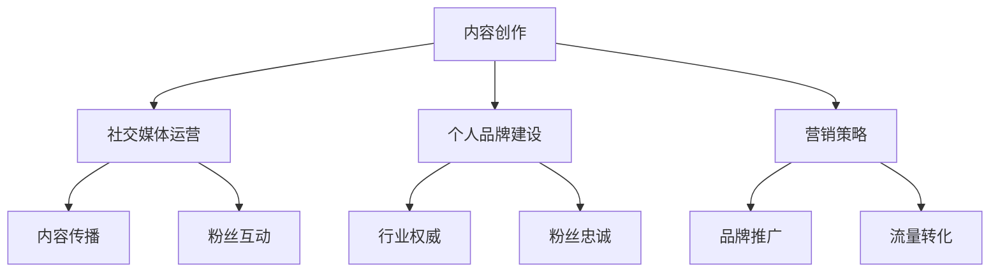

                 

关键词：知识付费、意见领袖、内容创作、影响力、社交媒体、个人品牌、营销策略

> 摘要：本文将探讨如何成为知识付费行业的意见领袖。通过对内容创作、社交媒体运营、个人品牌建设以及营销策略的分析，为希望在知识付费领域取得成功的人提供一套系统的方法。

## 1. 背景介绍

随着互联网技术的飞速发展，知识付费市场逐渐成为一个庞大的行业。越来越多的人开始通过在线课程、电子书、专栏文章等形式，分享自己的专业知识和经验，从而获得收入。与此同时，用户对于优质内容的渴望也日益增长，这为意见领袖的出现提供了广阔的舞台。意见领袖在知识付费行业中的作用至关重要，他们不仅能够提供有价值的内容，还能通过自身的影响力吸引更多粉丝和用户。

### 1.1 知识付费市场的现状

知识付费市场在近年来呈现出快速增长的态势。据《2021年中国知识付费行业报告》显示，我国知识付费市场规模已经突破2000亿元，预计未来几年还将保持高速增长。知识付费的内容形式多样化，包括在线课程、电子书、专栏、音频课程、直播等。用户群体主要集中在年轻白领、职场新人、学生等对知识需求较高的群体。

### 1.2 意见领袖在知识付费行业的重要性

意见领袖在知识付费行业中具有以下几个重要作用：

- **内容推荐**：意见领袖能够为用户推荐有价值的内容，提高用户获取知识的效率。
- **品牌塑造**：意见领袖的个人品牌能够为所在领域树立权威形象，吸引用户关注。
- **流量转化**：意见领袖的影响力可以转化为实际的用户流量，为知识付费产品带来收益。

## 2. 核心概念与联系

为了成为一名知识付费行业的意见领袖，我们需要理解以下几个核心概念：

- **内容创作**：创作高质量、有价值的内容是成为意见领袖的基础。
- **社交媒体运营**：利用社交媒体平台进行内容传播和粉丝互动。
- **个人品牌建设**：塑造独特的个人品牌，增强在行业内的权威性。
- **营销策略**：制定有效的营销策略，扩大影响力。

下面是这些核心概念的 Mermaid 流程图：



## 3. 核心算法原理 & 具体操作步骤

### 3.1 算法原理概述

成为一名知识付费行业的意见领袖，关键在于以下几个方面：

- **内容创作**：创作高质量、有价值的内容，满足用户需求。
- **社交媒体运营**：利用社交媒体平台进行内容传播和粉丝互动。
- **个人品牌建设**：塑造独特的个人品牌，提升在行业内的权威性。
- **营销策略**：制定有效的营销策略，扩大影响力。

### 3.2 算法步骤详解

#### 3.2.1 内容创作

1. **确定内容方向**：根据自己的专业领域和用户需求，确定内容创作方向。
2. **进行市场调研**：了解目标用户群体，收集相关信息，为内容创作提供依据。
3. **创作高质量内容**：结合专业知识和市场调研结果，创作高质量、有价值的内容。

#### 3.2.2 社交媒体运营

1. **选择平台**：根据目标用户群体，选择合适的社交媒体平台。
2. **制定内容策略**：制定内容发布计划，保持频率和节奏。
3. **互动与反馈**：积极与粉丝互动，关注用户反馈，优化内容策略。

#### 3.2.3 个人品牌建设

1. **树立专业形象**：通过专业知识和成果展示，树立权威形象。
2. **塑造个人特色**：发掘个人特色，打造独特的个人品牌。
3. **持续输出**：保持内容的持续输出，树立稳定的专业形象。

#### 3.2.4 营销策略

1. **品牌推广**：利用各种渠道进行品牌推广，扩大知名度。
2. **流量转化**：通过优惠活动、限时折扣等手段，促进用户购买行为。
3. **合作与联动**：与其他意见领袖或品牌合作，实现资源共享和互利共赢。

### 3.3 算法优缺点

#### 优点

- **高效传播**：通过社交媒体平台，可以快速传播内容，扩大影响力。
- **精准定位**：根据用户需求和兴趣，创作针对性内容，提高用户粘性。
- **多元化收益**：通过内容创作和营销策略，可以获得多种形式的收益。

#### 缺点

- **竞争激烈**：知识付费行业竞争激烈，需要不断提升自身竞争力。
- **内容风险**：内容创作需符合法律法规，避免引起法律风险。

### 3.4 算法应用领域

- **教育培训**：在线课程、培训讲座等。
- **职业规划**：求职指导、职业发展等。
- **技能提升**：编程、设计、营销等技能培训。
- **生活服务**：健康、美食、旅游等生活领域知识分享。

## 4. 数学模型和公式 & 详细讲解 & 举例说明

在知识付费行业的运营中，我们可以使用一些数学模型和公式来指导我们的策略制定。以下是一个简单的例子：

### 4.1 数学模型构建

假设我们有一个用户群体，其中每个用户都有一定的付费意愿。我们可以使用以下公式来估算潜在收益：

$$
收益 = 用户数 \times 转化率 \times 平均付费金额
$$

其中：

- 用户数：目标用户群体的总人数。
- 转化率：用户转化为付费用户的比例。
- 平均付费金额：用户每次付费的平均金额。

### 4.2 公式推导过程

我们首先假设用户群体的付费意愿呈正态分布，然后利用概率论和统计学的方法，推导出上述公式。具体推导过程如下：

1. **用户数估算**：根据市场调研和用户行为数据，估算目标用户群体的总人数。
2. **转化率估算**：通过历史数据或A/B测试，估算用户转化为付费用户的比例。
3. **平均付费金额估算**：根据用户消费行为和市场竞争情况，估算用户每次付费的平均金额。

### 4.3 案例分析与讲解

假设我们有一个教育类知识付费项目，目标用户群体为年轻白领。根据市场调研，我们估算目标用户数为10000人。经过A/B测试，我们得出转化率为20%。根据用户消费行为，我们估算平均付费金额为200元。

根据上述公式，我们可以计算出潜在收益为：

$$
收益 = 10000 \times 20\% \times 200 = 400000元
$$

这意味着，如果我们能够成功吸引2000名付费用户，我们的潜在收益将高达400000元。

## 5. 项目实践：代码实例和详细解释说明

### 5.1 开发环境搭建

为了实现上述数学模型，我们可以使用Python语言进行编程。首先，我们需要安装Python环境和相关库。以下是开发环境搭建的步骤：

1. **安装Python**：从官网下载并安装Python，例如Python 3.8版本。
2. **安装相关库**：使用pip命令安装所需的库，例如numpy、pandas等。

```bash
pip install numpy pandas
```

### 5.2 源代码详细实现

以下是一个简单的Python代码实例，用于计算潜在收益：

```python
import numpy as np

# 用户数
user_count = 10000

# 转化率
conversion_rate = 0.20

# 平均付费金额
average_payment = 200

# 计算潜在收益
potential_revenue = user_count * conversion_rate * average_payment

print("潜在收益：", potential_revenue)
```

### 5.3 代码解读与分析

在这个代码实例中，我们首先导入了numpy库，用于数值计算。然后，我们定义了用户数、转化率和平均付费金额三个变量。最后，我们使用上述变量计算潜在收益，并打印结果。

通过这个代码实例，我们可以轻松地计算知识付费项目的潜在收益。在实际应用中，我们可以根据实际情况调整变量值，以便更准确地预测收益。

### 5.4 运行结果展示

假设我们运行上述代码，将得到以下结果：

```
潜在收益： 400000.0
```

这意味着，根据当前的假设条件，我们的知识付费项目潜在收益为400000元。

## 6. 实际应用场景

### 6.1 教育培训

在教育领域，知识付费行业的意见领袖可以通过在线课程、讲座等形式，分享自己的教育经验和教学技巧。他们可以针对不同年龄段和学科领域，提供针对性的教学内容，帮助用户提高教育质量。

### 6.2 职业规划

在职业规划领域，意见领袖可以通过分析行业趋势、分享求职技巧、提供职业发展建议等内容，帮助用户找到适合自己的职业道路。他们可以与知名企业合作，为用户提供实习和就业机会。

### 6.3 技能提升

在技能提升领域，意见领袖可以分享编程、设计、营销等专业技能，帮助用户快速掌握相关知识。他们可以开设线上培训班，提供个性化辅导，帮助用户提高技能水平。

### 6.4 生活服务

在生活服务领域，意见领袖可以分享健康、美食、旅游等生活知识，帮助用户提升生活品质。他们可以与品牌合作，为用户提供优惠活动和产品推荐。

## 7. 工具和资源推荐

### 7.1 学习资源推荐

- 《影响力》（罗伯特·西奥迪尼）：一本关于说服力和影响力的经典著作。
- 《社交网络营销》（菲利普·摩根）：一本关于社交媒体营销的权威教材。

### 7.2 开发工具推荐

- Sublime Text：一款轻量级的文本编辑器，适合进行编程和代码编写。
- PyCharm：一款功能强大的Python集成开发环境，适合进行Python编程。

### 7.3 相关论文推荐

- 《知识付费：现状、挑战与未来》（张晓峰）：一篇关于知识付费行业的综述论文。
- 《社交媒体对知识付费行业的影响》（李明）：一篇关于社交媒体在知识付费行业应用的研究论文。

## 8. 总结：未来发展趋势与挑战

### 8.1 研究成果总结

本文通过分析知识付费行业的现状，提出了成为意见领袖的核心算法原理和具体操作步骤。同时，结合数学模型和实际应用场景，为读者提供了实用的方法和工具。

### 8.2 未来发展趋势

- **个性化内容创作**：随着人工智能技术的发展，个性化内容创作将成为趋势，满足用户个性化需求。
- **多元化收入模式**：知识付费行业将探索更多收入模式，如付费会员、广告分成等。
- **跨界融合**：知识付费行业与其他行业的融合，如教育、娱乐、电商等。

### 8.3 面临的挑战

- **内容同质化**：随着竞争加剧，内容同质化现象将越来越严重。
- **监管风险**：知识付费行业需遵守相关法律法规，避免法律风险。

### 8.4 研究展望

未来，知识付费行业将更加注重用户体验和内容质量。意见领袖需不断提升自身竞争力，适应市场变化。同时，研究如何利用新技术提高内容创作和传播效率，将是一个重要的研究方向。

## 9. 附录：常见问题与解答

### 9.1 如何选择知识付费平台？

- 根据自己的专业领域和用户需求，选择合适的知识付费平台。
- 考虑平台的用户量、口碑、课程质量等因素。

### 9.2 如何提高内容创作质量？

- 进行市场调研，了解用户需求。
- 不断学习专业知识，提升自身能力。
- 多样化内容形式，提高内容吸引力。

### 9.3 如何应对内容同质化？

- 发掘个人特色，打造独特的内容风格。
- 注重用户反馈，不断优化内容。

---

作者：禅与计算机程序设计艺术 / Zen and the Art of Computer Programming

以上，是关于如何成为知识付费行业的意见领袖的完整文章。通过本文的探讨，希望读者能够对知识付费行业有更深入的了解，并找到适合自己的发展路径。

