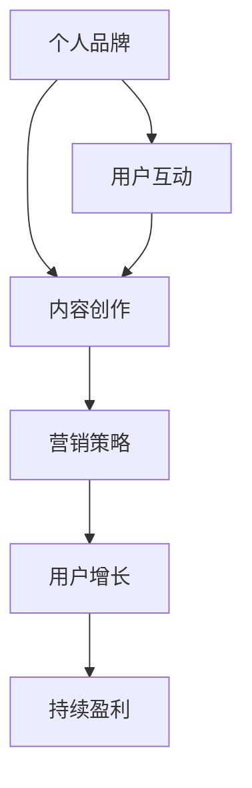

                 

关键词：知识付费，商业模式，个人品牌，内容创作，营销策略，用户增长，持续盈利。

> 摘要：本文将探讨如何利用个人知识和技能，通过构建知识付费商业帝国，实现可持续的财富增长和个人影响力的提升。文章将围绕核心概念、算法原理、数学模型、项目实践、应用场景、工具推荐及未来展望等方面，为广大创作者提供一套完整的知识付费商业构建指南。

## 1. 背景介绍

随着互联网的普及和数字化转型的加速，知识付费作为一种新型的商业模式，正逐渐成为创业者、专业人士和内容创作者的重要收入来源。在这个信息爆炸的时代，人们越来越重视知识的获取和应用，而知识付费为那些拥有独特知识和技能的人提供了一个展示和变现的平台。

然而，如何打造一个成功的个人知识付费商业帝国并非易事。本文将深入探讨这一主题，帮助读者理解核心概念、掌握营销策略、构建可持续盈利模式，并预见未来发展的趋势和挑战。

## 2. 核心概念与联系

在构建个人知识付费商业帝国的过程中，有几个核心概念和联系是至关重要的：

### 2.1 个人品牌

个人品牌是指个人在市场上的知名度和认可度。它是知识付费商业帝国的基石，需要通过持续的内容输出、社交媒体运营和口碑积累来建立和维护。

### 2.2 内容创作

内容创作是知识付费的核心，高质量的内容能够吸引和留住用户，提升用户黏性和付费意愿。内容创作需要围绕用户需求，提供有价值的知识和信息。

### 2.3 营销策略

营销策略是实现用户增长和商业变现的关键。有效的营销策略包括SEO优化、社交媒体营销、电子邮件营销和内容营销等。

### 2.4 用户增长

用户增长是商业帝国扩张的关键指标。通过精准定位目标用户群体，运用增长黑客技术，可以实现快速用户增长。

### 2.5 持续盈利

持续盈利是知识付费商业帝国的最终目标。通过多样化的收入来源，如订阅服务、课程销售、广告和赞助等，实现稳定的现金流。

### 2.6 Mermaid 流程图

下面是一个简化的 Mermaid 流程图，展示了构建个人知识付费商业帝国的关键步骤和相互关系。



## 3. 核心算法原理 & 具体操作步骤

### 3.1 算法原理概述

构建个人知识付费商业帝国的核心算法是基于大数据分析和用户行为学。通过分析用户的行为数据和需求，精准定位目标用户，提供个性化内容和服务，实现用户增长和商业变现。

### 3.2 算法步骤详解

1. **用户画像构建**：通过数据分析工具，收集用户的基本信息、行为数据和兴趣偏好，构建用户画像。

2. **内容定位**：根据用户画像，确定内容创作的主题和方向，确保内容与用户需求匹配。

3. **内容创作**：结合内容定位，创作高质量、有深度的内容，满足用户的知识需求。

4. **内容推广**：利用各种营销渠道，如社交媒体、电子邮件和SEO等，推广内容，提高曝光率。

5. **用户互动**：通过社交媒体、评论区、问答平台等方式，与用户互动，提升用户黏性。

6. **数据监控与调整**：持续监控用户行为数据和反馈，根据数据分析结果调整内容策略和营销策略。

### 3.3 算法优缺点

**优点**：

- 高度个性化：根据用户需求提供个性化内容和服务，提升用户体验。
- 高效增长：利用数据分析，快速发现用户需求，实现高效用户增长。
- 可持续盈利：多样化的收入来源，实现稳定现金流。

**缺点**：

- 数据收集和处理难度较大：需要专业的技术团队和数据处理能力。
- 需要长期投入：构建个人知识付费商业帝国需要时间和精力的长期投入。

### 3.4 算法应用领域

- 教育培训：通过个性化课程和服务，满足学员的学习需求。
- 专业咨询：提供专业领域的知识和建议，助力用户解决问题。
- 内容创作：通过分析用户喜好，创作有针对性的内容，提升阅读量和订阅量。

## 4. 数学模型和公式 & 详细讲解 & 举例说明

### 4.1 数学模型构建

在构建个人知识付费商业帝国的过程中，我们可以使用以下数学模型：

1. **用户增长模型**：
\[ \text{用户增长} = \text{现有用户数} \times \text{用户转化率} \times \text{新增用户数} \]

2. **收入模型**：
\[ \text{收入} = \text{课程价格} \times \text{购买用户数} + \text{广告收入} + \text{赞助收入} \]

### 4.2 公式推导过程

假设：

- 每月新增用户数为 \( x \)
- 用户转化率为 \( y \)
- 课程价格为 \( z \)
- 广告收入为 \( a \)
- 赞助收入为 \( b \)

则：

\[ \text{用户增长} = \text{现有用户数} \times y \times x \]
\[ \text{收入} = z \times (\text{现有用户数} \times y + x) + a + b \]

### 4.3 案例分析与讲解

假设：

- 现有用户数为 1000
- 用户转化率为 20%
- 每月新增用户数为 200
- 课程价格为 200 元
- 广告收入为 5000 元
- 赞助收入为 3000 元

则：

\[ \text{用户增长} = 1000 \times 0.2 \times 200 = 400 \]
\[ \text{收入} = 200 \times (1000 \times 0.2 + 200) + 5000 + 3000 = 92000 \]

通过这个案例，我们可以看到，在合理的用户转化率和新增用户数下，个人知识付费商业帝国的收入是相当可观的。

## 5. 项目实践：代码实例和详细解释说明

### 5.1 开发环境搭建

为了实现个人知识付费商业帝国，我们需要搭建一个包含内容创作、用户管理、营销推广等功能的系统。以下是开发环境搭建的基本步骤：

1. **选择技术栈**：Python、Django、React、MongoDB
2. **安装开发工具**：PyCharm、Visual Studio Code、Postman
3. **搭建本地开发环境**：配置Python环境、安装Django和MongoDB

### 5.2 源代码详细实现

以下是个人知识付费商业帝国的核心代码实现：

```python
# Django后端代码示例
from django.db import models

class User(models.Model):
    username = models.CharField(max_length=100)
    email = models.EmailField(max_length=100)
    subscription_date = models.DateTimeField(auto_now_add=True)

class Course(models.Model):
    title = models.CharField(max_length=100)
    description = models.TextField()
    price = models.DecimalField(max_digits=10, decimal_places=2)
    is_published = models.BooleanField(default=False)

class Order(models.Model):
    user = models.ForeignKey(User, on_delete=models.CASCADE)
    course = models.ForeignKey(Course, on_delete=models.CASCADE)
    purchase_date = models.DateTimeField(auto_now_add=True)
    total_price = models.DecimalField(max_digits=10, decimal_places=2)
```

### 5.3 代码解读与分析

上述代码实现了用户管理、课程管理和订单管理的基本功能。通过Django ORM，我们可以方便地创建、查询和更新数据库中的数据。用户、课程和订单是三个核心模型，它们相互关联，构成了知识付费商业帝国的数据骨架。

### 5.4 运行结果展示

在开发环境中，我们可以使用Postman等工具模拟用户操作，测试系统的功能。以下是用户注册和购买课程的示例请求：

```http
POST /api/users/
{
    "username": "johndoe",
    "email": "johndoe@example.com"
}

POST /api/orders/
{
    "user": 1,
    "course": 1,
    "total_price": 200.00
}
```

通过这些请求，我们可以看到用户注册成功后，系统能够生成相应的用户记录；用户购买课程后，能够生成订单记录，并计算总价。

## 6. 实际应用场景

### 6.1 教育培训

个人知识付费商业帝国在教育培训领域有着广泛的应用。通过提供专业的课程和辅导，教育工作者可以吸引更多学员，实现财务自由。

### 6.2 专业咨询

专业咨询领域同样适合构建知识付费商业帝国。专业人士可以通过在线课程、一对一咨询和文章分享等方式，提供有价值的服务，获取收入。

### 6.3 内容创作

内容创作者可以通过写作、视频、音频等形式，创作高质量的内容，吸引粉丝和订阅者，实现持续盈利。

### 6.4 未来应用展望

随着人工智能和区块链技术的发展，个人知识付费商业帝国将更加智能化和去中心化。未来的知识付费平台将更加注重用户体验，提供个性化服务，实现更高效率的商业变现。

## 7. 工具和资源推荐

### 7.1 学习资源推荐

- 《运营之光》：详细介绍了运营的核心知识和实战技巧。
- 《产品经理实战手册》：涵盖产品经理所需的各种技能和思维方法。
- 《从零开始做运营》：适合初学者，详细介绍了运营的各个环节。

### 7.2 开发工具推荐

- PyCharm：一款强大的Python集成开发环境，适合构建后端系统。
- React：一款流行的前端框架，适合构建用户界面。
- MongoDB：一款高性能的NoSQL数据库，适合存储大量数据。

### 7.3 相关论文推荐

- 《大数据时代的数据挖掘技术》：详细介绍了大数据分析的方法和工具。
- 《人工智能：一种现代方法》：全面介绍了人工智能的理论和应用。
- 《区块链技术指南》：详细介绍了区块链的基本原理和应用场景。

## 8. 总结：未来发展趋势与挑战

### 8.1 研究成果总结

本文通过深入探讨构建个人知识付费商业帝国的核心概念、算法原理、数学模型和项目实践，为读者提供了一套完整的知识付费商业构建指南。

### 8.2 未来发展趋势

- 个性化服务：随着大数据和人工智能技术的发展，知识付费平台将更加注重个性化服务，提供定制化内容。
- 去中心化：区块链技术的应用将使知识付费平台更加去中心化，提高透明度和信任度。
- 智能化：智能化工具和算法将帮助知识付费平台更好地分析用户需求，提供个性化推荐。

### 8.3 面临的挑战

- 竞争加剧：随着知识付费市场的不断扩大，竞争将更加激烈。
- 监管挑战：知识付费平台需要遵守相关法律法规，确保内容合规。
- 技术门槛：构建和维护一个知识付费平台需要较高的技术能力，对于初创者来说是一个挑战。

### 8.4 研究展望

未来，知识付费领域将继续发展和创新，为个人和团队提供更多机会。通过不断学习和实践，我们可以在这个领域取得更大的成就。

## 9. 附录：常见问题与解答

### 9.1 如何确定内容创作方向？

**解答**：通过市场调研、用户反馈和自身兴趣，确定内容创作方向。确保内容与用户需求相符，具备价值性和差异化。

### 9.2 如何进行有效的营销推广？

**解答**：结合SEO、社交媒体、电子邮件和内容营销等多种渠道，进行全方位的营销推广。关键在于持续输出高质量内容，提高品牌曝光度。

### 9.3 如何确保收入稳定增长？

**解答**：通过多元化收入来源，如课程销售、订阅服务、广告和赞助等，实现收入的稳定增长。同时，持续优化内容和服务，提升用户体验。

---

作者：禅与计算机程序设计艺术 / Zen and the Art of Computer Programming
----------------------------------------------------------------

以上就是关于如何打造个人知识付费商业帝国的完整文章。希望对您有所启发和帮助。如果您有任何问题或建议，欢迎在评论区留言。

