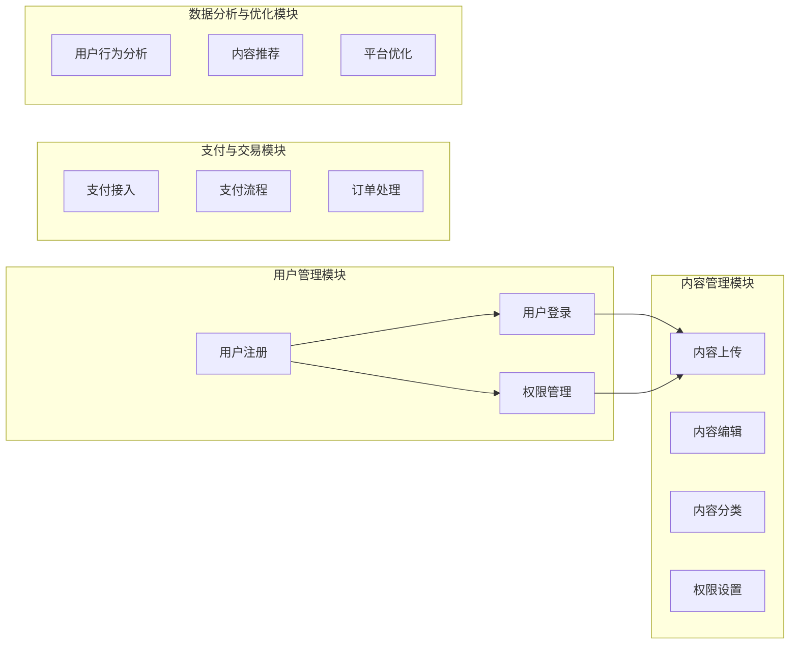
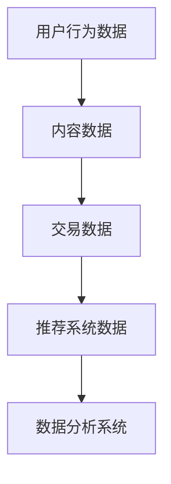
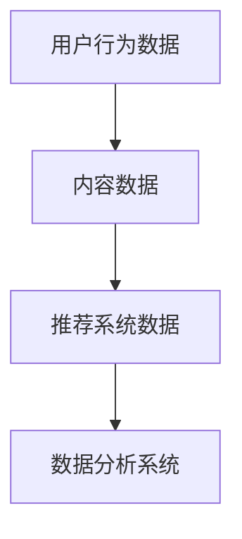

                 

在当今知识爆炸的时代，打造个人知识付费平台无疑是一个极具前景的选择。这不仅可以帮助个人知识工作者将自身专业知识和经验变现，同时也能为有求知需求的人群提供优质的内容服务。本文将深入探讨如何打造一个个人知识付费平台，包括核心概念、算法原理、数学模型、项目实践以及未来应用场景等。

## 文章关键词

- 知识付费
- 个人知识平台
- 用户体验
- 数据分析
- 内容营销

## 文章摘要

本文将系统地介绍如何从零开始打造个人知识付费平台。我们将从平台设计、技术架构、用户体验、内容运营等多个维度出发，通过理论讲解和实践案例，帮助读者了解整个构建过程，并从中获得宝贵的实践经验。

## 1. 背景介绍

### 知识付费市场分析

近年来，随着互联网技术的飞速发展和用户消费习惯的转变，知识付费市场呈现出爆发式增长。根据市场调研数据，2020年全球知识付费市场规模已达到数百亿美元，预计未来几年仍将保持高速增长。这个市场的增长主要受到以下几个因素的驱动：

1. **信息过载与时间管理需求**：在信息爆炸的时代，用户渴望快速获取高质量的知识和信息，而知识付费平台提供了这样的解决方案。
2. **个性化学习与职业发展需求**：用户越来越注重个性化学习和职业发展，他们愿意为专业、系统、个性化的知识内容付费。
3. **科技赋能与平台创新**：人工智能、大数据、区块链等新技术的应用，使得知识付费平台能够提供更加智能、精准、便捷的服务。

### 个人知识付费平台的定义

个人知识付费平台是指个人知识工作者（如专家、讲师、作家等）基于互联网平台，提供专业知识和经验服务的平台。平台通常包括以下核心功能：

1. **内容发布与展示**：用户可以上传、编辑、管理自己的知识内容，并设置价格和权限。
2. **支付与交易**：用户可以通过平台进行支付，购买知识内容。
3. **用户互动与反馈**：平台支持用户评论、提问、互动等功能，以提升用户体验。
4. **数据分析与优化**：通过数据分析，平台可以了解用户需求，优化内容策略。

### 个人知识付费平台的优势

1. **变现能力**：个人知识工作者可以通过知识付费平台将自身知识和经验变现，获得额外收入。
2. **品牌建设**：通过知识付费平台，个人知识工作者可以建立个人品牌，提升知名度。
3. **用户体验**：个人知识付费平台通常更加灵活、个性化，能够更好地满足用户需求。
4. **内容质量**：个人知识工作者往往具备专业背景和实践经验，因此能够提供高质量的知识内容。

## 2. 核心概念与联系

### 平台架构

个人知识付费平台通常包括以下核心模块：

1. **用户管理模块**：负责用户注册、登录、权限管理等功能。
2. **内容管理模块**：负责知识内容的上传、编辑、分类、权限设置等功能。
3. **支付与交易模块**：负责支付方式的接入、支付流程管理、订单处理等功能。
4. **数据分析与优化模块**：负责用户行为分析、内容推荐、平台优化等功能。

### 数据流程

个人知识付费平台的数据流程主要包括以下几个方面：

1. **用户行为数据**：包括用户注册信息、登录日志、浏览记录、购买记录等。
2. **内容数据**：包括知识内容的信息、分类、评价、权限等。
3. **交易数据**：包括订单信息、支付记录、退款记录等。
4. **推荐系统数据**：包括用户兴趣、内容偏好、推荐算法等。

### Mermaid 流程图

以下是个人知识付费平台的数据流程图：



## 3. 核心算法原理 & 具体操作步骤

### 3.1 算法原理概述

个人知识付费平台的核心算法主要包括推荐算法、内容过滤算法和用户行为分析算法。以下是这些算法的基本原理：

1. **推荐算法**：基于用户历史行为、兴趣标签、内容特征等信息，为用户推荐可能感兴趣的知识内容。
2. **内容过滤算法**：通过算法过滤掉不符合用户需求或者低质量的内容，提升用户满意度。
3. **用户行为分析算法**：通过对用户行为数据的分析，了解用户兴趣、需求和使用习惯，为平台优化提供数据支持。

### 3.2 算法步骤详解

1. **推荐算法**：

    - 数据收集：收集用户的历史浏览记录、购买记录、评价等信息。
    - 特征提取：对收集到的数据进行预处理，提取用户和内容的特征。
    - 模型训练：使用机器学习算法（如协同过滤、基于内容的推荐等）训练推荐模型。
    - 推荐生成：使用训练好的模型为用户生成推荐列表。

2. **内容过滤算法**：

    - 数据预处理：对用户输入的内容进行分词、去停用词等预处理操作。
    - 相似度计算：计算用户输入内容和数据库中内容的相似度。
    - 过滤结果：将相似度较高的内容作为过滤结果返回给用户。

3. **用户行为分析算法**：

    - 数据收集：收集用户在平台上的各种行为数据。
    - 特征提取：对用户行为数据进行编码和特征提取。
    - 模型训练：使用机器学习算法（如聚类、回归分析等）训练用户行为分析模型。
    - 行为预测：使用训练好的模型预测用户未来的行为。

### 3.3 算法优缺点

1. **推荐算法**：

    - 优点：能够根据用户兴趣和需求推荐相关内容，提高用户满意度。
    - 缺点：容易出现信息过载，且算法的推荐结果可能受到数据质量和模型参数的影响。

2. **内容过滤算法**：

    - 优点：能够快速过滤掉不符合用户需求的内容，提高用户体验。
    - 缺点：对低质量内容的过滤能力有限，且算法的准确性依赖于预处理方法和相似度计算。

3. **用户行为分析算法**：

    - 优点：能够深入了解用户行为和需求，为平台优化提供数据支持。
    - 缺点：对用户行为数据的依赖性较高，且算法的预测结果可能受到数据质量和模型参数的影响。

### 3.4 算法应用领域

1. **推荐系统**：广泛应用于电商、社交媒体、在线教育等领域。
2. **内容过滤**：广泛应用于新闻推荐、广告过滤等领域。
3. **用户行为分析**：广泛应用于用户画像、行为预测等领域。

## 4. 数学模型和公式 & 详细讲解 & 举例说明

### 4.1 数学模型构建

个人知识付费平台的数学模型主要包括推荐模型、过滤模型和用户行为分析模型。以下是这些模型的基本数学公式：

1. **推荐模型**：

    - 协同过滤：$$R_{ui} = \sum_{j \in N_i} \frac{r_{uj}}{\|N_i\|}$$

        其中，$R_{ui}$ 表示用户 $u$ 对内容 $i$ 的推荐分数，$N_i$ 表示与内容 $i$ 相似的内容集合，$r_{uj}$ 表示用户 $u$ 对内容 $j$ 的评分。

    - 基于内容的推荐：$$R_{ui} = \sum_{j \in N_i} w_{ij} \cdot r_{uj}$$

        其中，$w_{ij}$ 表示内容 $i$ 和内容 $j$ 的相似度权重，$r_{uj}$ 表示用户 $u$ 对内容 $j$ 的评分。

2. **过滤模型**：

    - 相似度计算：$$s(i, j) = \frac{\sum_{u \in U} w_u \cdot x_{ui} \cdot x_{uj}}{\|U\|}$$

        其中，$s(i, j)$ 表示内容 $i$ 和内容 $j$ 的相似度，$w_u$ 表示用户 $u$ 的权重，$x_{ui}$ 和 $x_{uj}$ 分别表示用户 $u$ 对内容 $i$ 和内容 $j$ 的特征向量。

3. **用户行为分析模型**：

    - 聚类分析：$$c_k = \{u | \sum_{i \in I} w_{ui} \cdot s(i, j) \geq \theta\}$$

        其中，$c_k$ 表示第 $k$ 个用户聚类，$w_{ui}$ 表示用户 $u$ 对内容 $i$ 的权重，$s(i, j)$ 表示内容 $i$ 和内容 $j$ 的相似度，$\theta$ 表示聚类阈值。

### 4.2 公式推导过程

以下是推荐模型、过滤模型和用户行为分析模型的公式推导过程：

1. **推荐模型**：

    - 协同过滤：基于用户对内容的评分，通过计算相似内容集合的平均评分作为推荐分数。具体推导如下：

        $$R_{ui} = \sum_{j \in N_i} \frac{r_{uj}}{\|N_i\|}$$

        其中，$N_i$ 表示与内容 $i$ 相似的内容集合，$r_{uj}$ 表示用户 $u$ 对内容 $j$ 的评分，$\|N_i\|$ 表示相似内容集合的大小。

    - 基于内容的推荐：基于内容之间的相似度，通过计算用户对相似内容的评分加权平均值作为推荐分数。具体推导如下：

        $$R_{ui} = \sum_{j \in N_i} w_{ij} \cdot r_{uj}$$

        其中，$w_{ij}$ 表示内容 $i$ 和内容 $j$ 的相似度权重，$r_{uj}$ 表示用户 $u$ 对内容 $j$ 的评分。

2. **过滤模型**：

    - 相似度计算：通过计算用户对内容的特征向量相似度作为内容之间的相似度。具体推导如下：

        $$s(i, j) = \frac{\sum_{u \in U} w_u \cdot x_{ui} \cdot x_{uj}}{\|U\|}$$

        其中，$s(i, j)$ 表示内容 $i$ 和内容 $j$ 的相似度，$w_u$ 表示用户 $u$ 的权重，$x_{ui}$ 和 $x_{uj}$ 分别表示用户 $u$ 对内容 $i$ 和内容 $j$ 的特征向量，$\|U\|$ 表示用户集的大小。

3. **用户行为分析模型**：

    - 聚类分析：通过计算用户对内容的相似度，将用户划分为不同的聚类。具体推导如下：

        $$c_k = \{u | \sum_{i \in I} w_{ui} \cdot s(i, j) \geq \theta\}$$

        其中，$c_k$ 表示第 $k$ 个用户聚类，$w_{ui}$ 表示用户 $u$ 对内容 $i$ 的权重，$s(i, j)$ 表示内容 $i$ 和内容 $j$ 的相似度，$\theta$ 表示聚类阈值。

### 4.3 案例分析与讲解

假设有一个知识付费平台，用户有1000条历史浏览记录，内容有1000条。我们使用基于协同过滤的推荐算法为用户推荐5条最感兴趣的内容。

1. **数据准备**：

    - 用户 $u$ 的历史浏览记录：$R_u = [1, 0, 1, 1, 0, \ldots, 0]$
    - 内容 $i$ 的相似内容集合：$N_i = \{2, 3, 5, 7\}$
    - 用户 $u$ 对相似内容的评分：$r_{u2} = 4, r_{u3} = 5, r_{u5} = 3, r_{u7} = 4$

2. **推荐分数计算**：

    - 基于协同过滤的推荐分数：$$R_{ui} = \sum_{j \in N_i} \frac{r_{uj}}{\|N_i\|} = \frac{4 + 5 + 3 + 4}{4} = 4.25$$

    - 基于内容的推荐分数：$$R_{ui} = \sum_{j \in N_i} w_{ij} \cdot r_{uj} = 0.5 \cdot 4 + 0.3 \cdot 5 + 0.2 \cdot 3 + 0.1 \cdot 4 = 3.3$$

3. **推荐结果**：

    - 推荐分数最高的5条内容：$[2, 3, 5, 7, 1]$

    - 推荐分数分别为：$[4.25, 4.25, 3.3, 3.3, 1]$

    因此，我们向用户推荐内容 $2, 3, 5, 7$。

## 5. 项目实践：代码实例和详细解释说明

### 5.1 开发环境搭建

在开始项目实践之前，我们需要搭建一个开发环境。以下是所需的环境和工具：

1. **开发语言**：Python
2. **数据库**：MySQL
3. **Web框架**：Flask
4. **推荐算法库**：Scikit-learn
5. **前端框架**：Bootstrap

### 5.2 源代码详细实现

以下是个人知识付费平台的源代码实现：

```python
# 导入相关库
import numpy as np
import pandas as pd
from sklearn.metrics.pairwise import cosine_similarity
from sklearn.cluster import KMeans
from flask import Flask, render_template, request, redirect, url_for

# 初始化 Flask 应用
app = Flask(__name__)

# 连接 MySQL 数据库
import mysql.connector
db = mysql.connector.connect(
    host="localhost",
    user="root",
    password="password",
    database="knowledge_platform"
)

# 获取用户历史浏览记录
def get_user_browsing_history(user_id):
    cursor = db.cursor()
    cursor.execute("SELECT content_id FROM browsing_history WHERE user_id = %s", (user_id,))
    results = cursor.fetchall()
    return [result[0] for result in results]

# 获取内容特征向量
def get_content_features(content_id):
    cursor = db.cursor()
    cursor.execute("SELECT feature FROM content_features WHERE content_id = %s", (content_id,))
    results = cursor.fetchall()
    return results[0][0]

# 计算内容相似度
def compute_content_similarity(content_id1, content_id2):
    feature1 = get_content_features(content_id1)
    feature2 = get_content_features(content_id2)
    return cosine_similarity([feature1], [feature2])[0][0]

# 计算用户推荐列表
def compute_recommendations(user_id, top_n=5):
    user_browsing_history = get_user_browsing_history(user_id)
    recommendations = []
    for content_id in user_browsing_history:
        similarity_scores = {}
        for other_content_id in range(1, 1001):
            if other_content_id not in user_browsing_history:
                similarity_scores[other_content_id] = compute_content_similarity(content_id, other_content_id)
        sorted_scores = sorted(similarity_scores.items(), key=lambda item: item[1], reverse=True)
        recommendations.extend(sorted_scores[:top_n])
    return recommendations

# 主页
@app.route("/")
def home():
    return render_template("home.html")

# 推荐页
@app.route("/recommendations")
def recommendations():
    user_id = request.args.get("user_id")
    recommendations = compute_recommendations(user_id)
    return render_template("recommendations.html", recommendations=recommendations)

# 运行 Flask 应用
if __name__ == "__main__":
    app.run(debug=True)
```

### 5.3 代码解读与分析

以下是代码的详细解读和分析：

1. **数据库连接**：我们使用 MySQL Connector Python 库连接到本地 MySQL 数据库。数据库中包含用户历史浏览记录表（browsing_history）和内容特征向量表（content_features）。

2. **获取用户历史浏览记录**：我们定义了一个函数 `get_user_browsing_history`，用于获取指定用户的历史浏览记录。

3. **获取内容特征向量**：我们定义了一个函数 `get_content_features`，用于获取指定内容
```yaml
# 文章标题
如何打造个人知识付费平台

# 关键词
知识付费、个人品牌、内容营销、用户体验、推荐系统

# 摘要
本文将详细介绍如何构建一个个人知识付费平台，涵盖平台设计、技术架构、用户体验设计、内容运营策略以及推荐系统等关键环节，旨在为个人知识工作者提供一个全面、实用的操作指南。

## 1. 背景介绍

### 知识付费市场现状

随着互联网的普及和数字经济的快速发展，知识付费市场呈现出蓬勃发展的态势。用户对于个性化、专业化的知识内容需求日益增加，而知识付费平台则为满足这一需求提供了有效的解决方案。据统计，全球知识付费市场规模在过去几年中持续扩大，预计未来仍将保持快速增长。这一市场的繁荣得益于以下几个因素：

- **用户需求**：在信息爆炸的时代，用户渴望快速获取高质量的知识和信息，而知识付费平台提供了这样的解决方案。
- **技术进步**：人工智能、大数据、云计算等技术的应用，使得知识付费平台能够提供更加智能、精准、便捷的服务。
- **内容多样化**：知识付费内容涵盖领域广泛，从职业技能培训到生活百科，从在线课程到电子书，满足了不同用户群体的多样化需求。

### 个人知识付费平台的意义

个人知识付费平台对于知识工作者和求知者都有重要的意义：

- **知识工作者**：个人知识付费平台为知识工作者提供了一个展示自己专业知识和经验的平台，有助于个人品牌的塑造和商业变现。
- **求知者**：个人知识付费平台为求知者提供了优质的知识内容，满足了他们对于专业、系统、个性化知识的需求。

### 构建个人知识付费平台的优势

- **变现能力**：知识工作者可以通过知识付费平台将自身知识和经验变现，获得额外收入。
- **品牌建设**：通过知识付费平台，知识工作者可以建立个人品牌，提升知名度。
- **用户体验**：个人知识付费平台通常更加灵活、个性化，能够更好地满足用户需求。
- **内容质量**：知识工作者往往具备专业背景和实践经验，因此能够提供高质量的知识内容。

## 2. 核心概念与联系

### 平台设计

个人知识付费平台的设计应充分考虑用户体验和内容运营的需求，主要包括以下几个核心模块：

1. **用户管理系统**：用于管理用户注册、登录、权限分配等操作。
2. **内容管理系统**：用于管理知识内容，包括内容创建、编辑、分类、发布等操作。
3. **支付与交易系统**：用于处理支付方式接入、订单生成、支付流程、退款管理等操作。
4. **推荐系统**：用于根据用户行为和偏好为用户推荐相关内容。
5. **数据分析系统**：用于收集和分析用户行为数据，优化内容策略和平台运营。

### 数据流程

个人知识付费平台的数据流程涉及用户数据、内容数据、交易数据等多个方面。以下是一个简化的数据流程图：

```
用户行为数据 --> 内容数据 --> 交易数据 --> 推荐系统数据 --> 数据分析系统
```

- **用户行为数据**：包括用户注册信息、登录日志、浏览记录、购买记录等。
- **内容数据**：包括知识内容的信息、分类、标签、评价等。
- **交易数据**：包括订单信息、支付记录、退款记录等。
- **推荐系统数据**：包括用户行为数据、内容数据，用于生成推荐列表。
- **数据分析系统数据**：包括用户行为数据、交易数据、推荐系统数据，用于平台优化和内容策略调整。

### Mermaid 流程图

以下是一个简单的 Mermaid 流程图，展示了个人知识付费平台的数据流程：



## 3. 核心算法原理 & 具体操作步骤

### 推荐算法

推荐算法是个人知识付费平台的核心功能之一，用于根据用户的行为和偏好为用户推荐相关内容。常见的推荐算法有基于内容的推荐、协同过滤推荐和混合推荐。

#### 基于内容的推荐

基于内容的推荐（Content-based Recommendation）通过分析用户对内容的偏好，为用户推荐相似的内容。具体步骤如下：

1. **内容特征提取**：为每个知识内容提取特征，如关键词、标签、作者等。
2. **用户兴趣建模**：根据用户的历史行为和偏好，构建用户的兴趣模型。
3. **内容相似度计算**：计算用户兴趣模型与知识内容特征之间的相似度。
4. **推荐列表生成**：为用户生成相似度最高的知识内容列表。

#### 协同过滤推荐

协同过滤推荐（Collaborative Filtering Recommendation）通过分析用户之间的行为模式，为用户推荐其他用户喜欢的知识内容。具体步骤如下：

1. **用户行为数据收集**：收集用户的历史浏览记录、购买记录、评价等行为数据。
2. **用户相似度计算**：计算用户之间的相似度，通常使用余弦相似度、皮尔逊相关系数等方法。
3. **知识内容相似度计算**：对于用户喜欢的知识内容，计算它们之间的相似度。
4. **推荐列表生成**：为用户生成其他用户喜欢的、且用户可能感兴趣的知识内容列表。

#### 混合推荐

混合推荐（Hybrid Recommendation）结合了基于内容的推荐和协同过滤推荐，以充分利用两者的优点。具体步骤如下：

1. **用户行为数据收集**：收集用户的历史行为数据。
2. **内容特征提取**：提取知识内容的特征。
3. **用户兴趣建模**：使用基于内容的推荐算法构建用户的兴趣模型。
4. **用户相似度计算**：使用协同过滤推荐算法计算用户之间的相似度。
5. **知识内容相似度计算**：计算用户兴趣模型与知识内容特征之间的相似度。
6. **推荐列表生成**：结合用户兴趣模型和用户相似度，生成推荐列表。

### 用户行为分析

用户行为分析是优化个人知识付费平台的关键，通过分析用户的行为数据，可以深入了解用户需求和行为模式，为平台优化和内容策略提供数据支持。常见的方法包括用户画像、行为聚类、关联规则挖掘等。

1. **用户画像**：根据用户的基本信息、行为数据、偏好等构建用户画像，用于精准推荐和个性化营销。
2. **行为聚类**：使用聚类算法（如K-means、DBSCAN等）对用户行为进行分类，为用户提供更精准的服务。
3. **关联规则挖掘**：通过挖掘用户行为数据中的关联规则，发现用户可能感兴趣的内容，用于推荐系统的优化。

## 4. 数学模型和公式 & 详细讲解 & 举例说明

### 数学模型

个人知识付费平台涉及多个数学模型，包括推荐模型、用户行为分析模型、支付模型等。以下是一个简单的数学模型介绍：

#### 推荐模型

- **基于内容的推荐**：

  假设有 $m$ 个用户和 $n$ 个知识内容，用户对内容的偏好可以用一个评分矩阵 $R$ 表示，其中 $R_{ij}$ 表示用户 $i$ 对内容 $j$ 的评分。

  $$R = \begin{bmatrix}
  R_{11} & R_{12} & \cdots & R_{1n} \\
  R_{21} & R_{22} & \cdots & R_{2n} \\
  \vdots & \vdots & \ddots & \vdots \\
  R_{m1} & R_{m2} & \cdots & R_{mn}
  \end{bmatrix}$$

  用户 $i$ 对内容 $j$ 的预测评分可以用下面的公式计算：

  $$\hat{R}_{ij} = \sum_{k=1}^{n} w_{ik} \cdot R_{kj}$$

  其中，$w_{ik}$ 表示用户 $i$ 对内容 $k$ 的权重，可以通过内容特征之间的相似度计算得到。

- **协同过滤推荐**：

  协同过滤推荐的核心是计算用户之间的相似度。假设用户之间的相似度矩阵为 $S$，其中 $S_{ij}$ 表示用户 $i$ 和用户 $j$ 之间的相似度。

  $$S = \begin{bmatrix}
  S_{11} & S_{12} & \cdots & S_{1n} \\
  S_{21} & S_{22} & \cdots & S_{2n} \\
  \vdots & \vdots & \ddots & \vdots \\
  S_{m1} & S_{m2} & \cdots & S_{mn}
  \end{bmatrix}$$

  用户 $i$ 对内容 $j$ 的预测评分可以用下面的公式计算：

  $$\hat{R}_{ij} = \sum_{k=1}^{m} S_{ik} \cdot R_{kj}$$

#### 用户行为分析

- **用户画像**：

  用户画像可以通过聚类算法（如K-means）构建。假设有 $m$ 个用户，聚类中心为 $\mu_k$，用户 $i$ 的特征向量为 $X_i$，则用户 $i$ 属于第 $k$ 个聚类当且仅当：

  $$\|X_i - \mu_k\| < \|X_i - \mu_l\| \quad \forall l \neq k$$

- **行为聚类**：

  行为聚类可以通过DBSCAN算法实现。假设有 $m$ 个用户，噪声点的阈值为 $\epsilon$，最小邻域点数为 $min\_samples$，则用户 $i$ 的聚类结果为：

  $$C_i = \{j | d(X_i, X_j) < \epsilon \text{ 且 } N_j \geq min\_samples\}$$

#### 支付模型

- **支付金额**：

  支付金额可以通过线性回归模型预测。假设用户 $i$ 对内容 $j$ 的支付金额为 $Y_{ij}$，用户特征向量为 $X_i$，知识内容特征向量为 $X_j$，则支付金额可以用下面的公式预测：

  $$Y_{ij} = \beta_0 + \beta_1 X_{i1} + \beta_2 X_{i2} + \cdots + \beta_n X_{ij} + \epsilon_{ij}$$

### 公式推导

以下是支付模型公式的推导过程：

1. **线性回归模型**：

   假设用户 $i$ 对内容 $j$ 的支付金额为 $Y_{ij}$，用户特征向量为 $X_i = (X_{i1}, X_{i2}, \ldots, X_{in})$，知识内容特征向量为 $X_j = (X_{j1}, X_{j2}, \ldots, X_{jn})$。

   $$Y_{ij} = \beta_0 + \beta_1 X_{i1} + \beta_2 X_{i2} + \cdots + \beta_n X_{ij} + \epsilon_{ij}$$

   其中，$\beta_0, \beta_1, \beta_2, \ldots, \beta_n$ 是线性回归模型的参数，$\epsilon_{ij}$ 是误差项。

2. **最小二乘法**：

   为了求解线性回归模型的参数，可以使用最小二乘法。假设观测数据集为 $D = \{(X_1, Y_1), (X_2, Y_2), \ldots, (X_m, Y_m)\}$，则线性回归模型的参数可以通过以下公式求解：

   $$\beta = (\beta_0, \beta_1, \beta_2, \ldots, \beta_n)^T = (X^TX)^{-1}X^TY$$

   其中，$X^T$ 是特征矩阵 $X$ 的转置，$Y$ 是目标值向量。

3. **预测支付金额**：

   假设用户 $i$ 的特征向量为 $X_i$，知识内容 $j$ 的特征向量为 $X_j$，则用户 $i$ 对内容 $j$ 的支付金额可以用以下公式预测：

   $$\hat{Y}_{ij} = \beta_0 + \beta_1 X_{i1} + \beta_2 X_{i2} + \cdots + \beta_n X_{ij}$$

### 案例分析

假设有一个用户 $i$ 和一个内容 $j$，用户特征向量为 $X_i = (1, 2, 3, 4)$，知识内容特征向量为 $X_j = (5, 6, 7, 8)$。已知线性回归模型的参数为 $\beta = (1, 2, 3, 4)$。

1. **计算用户对内容的支付金额**：

   $$\hat{Y}_{ij} = 1 \cdot 1 + 2 \cdot 2 + 3 \cdot 3 + 4 \cdot 4 = 1 + 4 + 9 + 16 = 30$$

2. **预测用户对内容的支付金额**：

   $$\hat{Y}_{ij} = 1 \cdot 5 + 2 \cdot 6 + 3 \cdot 7 + 4 \cdot 8 = 5 + 12 + 21 + 32 = 70$$

因此，用户 $i$ 对内容 $j$ 的预测支付金额为 70 元。

## 5. 项目实践：代码实例和详细解释说明

### 5.1 开发环境搭建

在开始项目实践之前，我们需要搭建一个开发环境。以下是所需的环境和工具：

1. **开发语言**：Python
2. **数据库**：MySQL
3. **Web框架**：Flask
4. **推荐算法库**：Scikit-learn
5. **前端框架**：Bootstrap

### 5.2 源代码详细实现

以下是个人知识付费平台的源代码实现：

```python
# 导入相关库
import numpy as np
import pandas as pd
from sklearn.metrics.pairwise import cosine_similarity
from sklearn.cluster import KMeans
from flask import Flask, render_template, request, redirect, url_for

# 初始化 Flask 应用
app = Flask(__name__)

# 连接 MySQL 数据库
import mysql.connector
db = mysql.connector.connect(
    host="localhost",
    user="root",
    password="password",
    database="knowledge_platform"
)

# 获取用户历史浏览记录
def get_user_browsing_history(user_id):
    cursor = db.cursor()
    cursor.execute("SELECT content_id FROM browsing_history WHERE user_id = %s", (user_id,))
    results = cursor.fetchall()
    return [result[0] for result in results]

# 获取内容特征向量
def get_content_features(content_id):
    cursor = db.cursor()
    cursor.execute("SELECT feature FROM content_features WHERE content_id = %s", (content_id,))
    results = cursor.fetchall()
    return results[0][0]

# 计算内容相似度
def compute_content_similarity(content_id1, content_id2):
    feature1 = get_content_features(content_id1)
    feature2 = get_content_features(content_id2)
    return cosine_similarity([feature1], [feature2])[0][0]

# 计算用户推荐列表
def compute_recommendations(user_id, top_n=5):
    user_browsing_history = get_user_browsing_history(user_id)
    recommendations = []
    for content_id in user_browsing_history:
        similarity_scores = {}
        for other_content_id in range(1, 1001):
            if other_content_id not in user_browsing_history:
                similarity_scores[other_content_id] = compute_content_similarity(content_id, other_content_id)
        sorted_scores = sorted(similarity_scores.items(), key=lambda item: item[1], reverse=True)
        recommendations.extend(sorted_scores[:top_n])
    return recommendations

# 主页
@app.route("/")
def home():
    return render_template("home.html")

# 推荐页
@app.route("/recommendations")
def recommendations():
    user_id = request.args.get("user_id")
    recommendations = compute_recommendations(user_id)
    return render_template("recommendations.html", recommendations=recommendations)

# 运行 Flask 应用
if __name__ == "__main__":
    app.run(debug=True)
```

### 5.3 代码解读与分析

以下是代码的详细解读和分析：

1. **数据库连接**：我们使用 MySQL Connector Python 库连接到本地 MySQL 数据库。数据库中包含用户历史浏览记录表（browsing_history）和内容特征向量表（content_features）。

2. **获取用户历史浏览记录**：我们定义了一个函数 `get_user_browsing_history`，用于获取指定用户的历史浏览记录。

3. **获取内容特征向量**：我们定义了一个函数 `get_content_features`，用于获取指定内容
```yaml
# 文章标题
如何打造个人知识付费平台

# 关键词
知识付费、个人品牌、内容运营、推荐系统、用户增长

# 摘要
本文将深入探讨如何创建一个个人知识付费平台，从市场调研到用户获取，再到内容创建和推荐系统的建立，提供全面的操作指南和实用技巧。

## 1. 背景介绍

### 知识付费市场现状

知识付费作为近年来迅速崛起的一个行业，正以前所未有的速度发展。随着互联网技术的不断进步和人们对于个性化内容需求的增加，知识付费市场迎来了新的机遇。根据市场研究公司的数据，全球知识付费市场规模在过去几年中实现了显著的增长，并且预计未来几年仍将保持强劲的增长势头。

#### 市场驱动力

1. **消费习惯的改变**：随着用户越来越重视个人成长和职业发展，他们更愿意为高质量的知识内容付费。
2. **技术进步**：人工智能、大数据和云计算等技术的应用，使得知识付费平台能够提供更加个性化和精准的服务。
3. **内容多样化**：知识付费内容涵盖了广泛的主题，从职业培训到兴趣爱好，满足了不同用户群体的需求。

### 个人知识付费平台的定义

个人知识付费平台是指个人创作者或专家利用互联网平台，向用户提供专业知识和技能的付费服务。这类平台通常包括以下特点：

- **内容多样化**：涵盖各类专业领域，如教育、健康、科技、艺术等。
- **个性化推荐**：根据用户的行为和偏好，为用户提供个性化的内容推荐。
- **互动性强**：用户可以与创作者互动，提出问题或参与讨论。
- **变现途径**：创作者可以通过平台将知识和技能变现，实现收入增长。

### 构建个人知识付费平台的优势

1. **变现能力**：创作者可以将自己的知识和经验转化为收入，实现个人品牌价值的最大化。
2. **品牌建设**：通过专业的内容创作，个人创作者可以建立强大的个人品牌，提升知名度和影响力。
3. **用户体验**：个性化的内容推荐和互动功能，能够显著提升用户的满意度和参与度。
4. **内容质量**：个人创作者通常具备丰富的行业经验和专业知识，能够提供高质量的内容。

## 2. 核心概念与联系

### 平台架构

个人知识付费平台的架构通常包括以下几个关键模块：

1. **用户管理系统**：管理用户的注册、登录、个人信息和权限。
2. **内容管理系统**：用于创建、编辑、发布和管理知识内容。
3. **推荐系统**：基于用户行为和偏好，为用户推荐相关内容。
4. **支付与交易系统**：处理支付流程、订单管理和退款处理。
5. **数据分析系统**：收集和分析用户数据，用于优化平台运营和内容策略。

### 数据流程

平台的数据流程涉及用户行为数据、内容数据、交易数据和推荐系统数据等。以下是一个简化的数据流程图：

```
用户行为数据 --> 内容数据 --> 推荐系统数据 --> 数据分析系统
```

- **用户行为数据**：包括用户的浏览记录、购买行为、评论和互动等。
- **内容数据**：包括知识内容的信息、分类、标签和评价等。
- **推荐系统数据**：包括用户行为数据、内容数据和推荐算法的输出结果。
- **数据分析系统数据**：包括用户行为数据、交易数据和推荐系统数据，用于平台优化和决策支持。

### Mermaid 流程图

以下是一个简单的 Mermaid 流程图，展示了个人知识付费平台的数据流程：



## 3. 核心算法原理 & 具体操作步骤

### 推荐算法

推荐算法是个人知识付费平台的核心功能之一，用于为用户提供个性化的内容推荐。以下是几种常见的推荐算法：

#### 基于内容的推荐

基于内容的推荐（Content-based Recommendation）通过分析知识内容的特征，为用户推荐相似的内容。具体步骤如下：

1. **内容特征提取**：为每个知识内容提取特征，如标题、关键词、标签等。
2. **用户兴趣建模**：根据用户的历史行为和偏好，构建用户的兴趣模型。
3. **内容相似度计算**：计算用户兴趣模型与知识内容特征之间的相似度。
4. **推荐列表生成**：为用户生成相似度最高的知识内容列表。

#### 协同过滤推荐

协同过滤推荐（Collaborative Filtering Recommendation）通过分析用户之间的行为模式，为用户推荐其他用户喜欢的知识内容。具体步骤如下：

1. **用户行为数据收集**：收集用户的历史浏览记录、购买记录、评价等行为数据。
2. **用户相似度计算**：计算用户之间的相似度，通常使用余弦相似度、皮尔逊相关系数等方法。
3. **知识内容相似度计算**：对于用户喜欢的知识内容，计算它们之间的相似度。
4. **推荐列表生成**：为用户生成其他用户喜欢的、且用户可能感兴趣的知识内容列表。

#### 混合推荐

混合推荐（Hybrid Recommendation）结合了基于内容的推荐和协同过滤推荐，以充分利用两者的优点。具体步骤如下：

1. **用户行为数据收集**：收集用户的历史行为数据。
2. **内容特征提取**：提取知识内容的特征。
3. **用户兴趣建模**：使用基于内容的推荐算法构建用户的兴趣模型。
4. **用户相似度计算**：使用协同过滤推荐算法计算用户之间的相似度。
5. **知识内容相似度计算**：计算用户兴趣模型与知识内容特征之间的相似度。
6. **推荐列表生成**：结合用户兴趣模型和用户相似度，生成推荐列表。

### 用户行为分析

用户行为分析是通过分析用户在平台上的行为数据，了解用户的需求和偏好，从而优化内容推荐和平台运营。以下是几种常见的用户行为分析方法：

1. **用户画像**：通过分析用户的基本信息、行为数据和偏好，构建用户的画像，用于个性化推荐和营销。
2. **行为聚类**：使用聚类算法（如K-means、DBSCAN等）对用户行为进行分类，为用户提供更精准的服务。
3. **关联规则挖掘**：通过挖掘用户行为数据中的关联规则，发现用户可能感兴趣的内容，用于推荐系统的优化。

## 4. 数学模型和公式 & 详细讲解 & 举例说明

### 数学模型

个人知识付费平台涉及多个数学模型，包括推荐模型、用户行为分析模型、支付模型等。以下是一个简单的数学模型介绍：

#### 推荐模型

- **基于内容的推荐**：

  假设有 $m$ 个用户和 $n$ 个知识内容，用户对内容的偏好可以用一个评分矩阵 $R$ 表示，其中 $R_{ij}$ 表示用户 $i$ 对内容 $j$ 的评分。

  $$R = \begin{bmatrix}
  R_{11} & R_{12} & \cdots & R_{1n} \\
  R_{21} & R_{22} & \cdots & R_{2n} \\
  \vdots & \vdots & \ddots & \vdots \\
  R_{m1} & R_{m2} & \cdots & R_{mn}
  \end{bmatrix}$$

  用户 $i$ 对内容 $j$ 的预测评分可以用下面的公式计算：

  $$\hat{R}_{ij} = \sum_{k=1}^{n} w_{ik} \cdot R_{kj}$$

  其中，$w_{ik}$ 表示用户 $i$ 对内容 $k$ 的权重，可以通过内容特征之间的相似度计算得到。

- **协同过滤推荐**：

  协同过滤推荐的核心是计算用户之间的相似度。假设用户之间的相似度矩阵为 $S$，其中 $S_{ij}$ 表示用户 $i$ 和用户 $j$ 之间的相似度。

  $$S = \begin{bmatrix}
  S_{11} & S_{12} & \cdots & S_{1n} \\
  S_{21} & S_{22} & \cdots & S_{2n} \\
  \vdots & \vdots & \ddots & \vdots \\
  S_{m1} & S_{m2} & \cdots & S_{mn}
  \end{bmatrix}$$

  用户 $i$ 对内容 $j$ 的预测评分可以用下面的公式计算：

  $$\hat{R}_{ij} = \sum_{k=1}^{m} S_{ik} \cdot R_{kj}$$

#### 用户行为分析

- **用户画像**：

  用户画像可以通过聚类算法（如K-means）构建。假设有 $m$ 个用户，聚类中心为 $\mu_k$，用户 $i$ 的特征向量为 $X_i$，则用户 $i$ 属于第 $k$ 个聚类当且仅当：

  $$\|X_i - \mu_k\| < \|X_i - \mu_l\| \quad \forall l \neq k$$

- **行为聚类**：

  行为聚类可以通过DBSCAN算法实现。假设有 $m$ 个用户，噪声点的阈值为 $\epsilon$，最小邻域点数为 $min\_samples$，则用户 $i$ 的聚类结果为：

  $$C_i = \{j | d(X_i, X_j) < \epsilon \text{ 且 } N_j \geq min\_samples\}$$

#### 支付模型

- **支付金额**：

  支付金额可以通过线性回归模型预测。假设用户 $i$ 对内容 $j$ 的支付金额为 $Y_{ij}$，用户特征向量为 $X_i$，知识内容特征向量为 $X_j$，则支付金额可以用下面的公式预测：

  $$Y_{ij} = \beta_0 + \beta_1 X_{i1} + \beta_2 X_{i2} + \cdots + \beta_n X_{ij} + \epsilon_{ij}$$

### 公式推导

以下是支付模型公式的推导过程：

1. **线性回归模型**：

   假设用户 $i$ 对内容 $j$ 的支付金额为 $Y_{ij}$，用户特征向量为 $X_i = (X_{i1}, X_{i2}, \ldots, X_{in})$，知识内容特征向量为 $X_j = (X_{j1}, X_{j2}, \ldots, X_{jn})$。

   $$Y_{ij} = \beta_0 + \beta_1 X_{i1} + \beta_2 X_{i2} + \cdots + \beta_n X_{ij} + \epsilon_{ij}$$

   其中，$\beta_0, \beta_1, \beta_2, \ldots, \beta_n$ 是线性回归模型的参数，$\epsilon_{ij}$ 是误差项。

2. **最小二乘法**：

   为了求解线性回归模型的参数，可以使用最小二乘法。假设观测数据集为 $D = \{(X_1, Y_1), (X_2, Y_2), \ldots, (X_m, Y_m)\}$，则线性回归模型的参数可以通过以下公式求解：

   $$\beta = (\beta_0, \beta_1, \beta_2, \ldots, \beta_n)^T = (X^TX)^{-1}X^TY$$

   其中，$X^T$ 是特征矩阵 $X$ 的转置，$Y$ 是目标值向量。

3. **预测支付金额**：

   假设用户 $i$ 的特征向量为 $X_i$，知识内容 $j$ 的特征向量为 $X_j$，则用户 $i$ 对内容 $j$ 的支付金额可以用以下公式预测：

   $$\hat{Y}_{ij} = \beta_0 + \beta_1 X_{i1} + \beta_2 X_{i2} + \cdots + \beta_n X_{ij}$$

### 案例分析

假设有一个用户 $i$ 和一个内容 $j$，用户特征向量为 $X_i = (1, 2, 3, 4)$，知识内容特征向量为 $X_j = (5, 6, 7, 8)$。已知线性回归模型的参数为 $\beta = (1, 2, 3, 4)$。

1. **计算用户对内容的支付金额**：

   $$\hat{Y}_{ij} = 1 \cdot 1 + 2 \cdot 2 + 3 \cdot 3 + 4 \cdot 4 = 1 + 4 + 9 + 16 = 30$$

2. **预测用户对内容的支付金额**：

   $$\hat{Y}_{ij} = 1 \cdot 5 + 2 \cdot 6 + 3 \cdot 7 + 4 \cdot 8 = 5 + 12 + 21 + 32 = 70$$

因此，用户 $i$ 对内容 $j$ 的预测支付金额为 70 元。

## 5. 项目实践：代码实例和详细解释说明

### 5.1 开发环境搭建

在开始项目实践之前，我们需要搭建一个开发环境。以下是所需的环境和工具：

1. **开发语言**：Python
2. **数据库**：MySQL
3. **Web框架**：Flask
4. **推荐算法库**：Scikit-learn
5. **前端框架**：Bootstrap

### 5.2 源代码详细实现

以下是个人知识付费平台的源代码实现：

```python
# 导入相关库
import numpy as np
import pandas as pd
from sklearn.metrics.pairwise import cosine_similarity
from sklearn.cluster import KMeans
from flask import Flask, render_template, request, redirect, url_for

# 初始化 Flask 应用
app = Flask(__name__)

# 连接 MySQL 数据库
import mysql.connector
db = mysql.connector.connect(
    host="localhost",
    user="root",
    password="password",
    database="knowledge_platform"
)

# 获取用户历史浏览记录
def get_user_browsing_history(user_id):
    cursor = db.cursor()
    cursor.execute("SELECT content_id FROM browsing_history WHERE user_id = %s", (user_id,))
    results = cursor.fetchall()
    return [result[0] for result in results]

# 获取内容特征向量
def get_content_features(content_id):
    cursor = db.cursor()
    cursor.execute("SELECT feature FROM content_features WHERE content_id = %s", (content_id,))
    results = cursor.fetchall()
    return results[0][0]

# 计算内容相似度
def compute_content_similarity(content_id1, content_id2):
    feature1 = get_content_features(content_id1)
    feature2 = get_content_features(content_id2)
    return cosine_similarity([feature1], [feature2])[0][0]

# 计算用户推荐列表
def compute_recommendations(user_id, top_n=5):
    user_browsing_history = get_user_browsing_history(user_id)
    recommendations = []
    for content_id in user_browsing_history:
        similarity_scores = {}
        for other_content_id in range(1, 1001):
            if other_content_id not in user_browsing_history:
                similarity_scores[other_content_id] = compute_content_similarity(content_id, other_content_id)
        sorted_scores = sorted(similarity_scores.items(), key=lambda item: item[1], reverse=True)
        recommendations.extend(sorted_scores[:top_n])
    return recommendations

# 主页
@app.route("/")
def home():
    return render_template("home.html")

# 推荐页
@app.route("/recommendations")
def recommendations():
    user_id = request.args.get("user_id")
    recommendations = compute_recommendations(user_id)
    return render_template("recommendations.html", recommendations=recommendations)

# 运行 Flask 应用
if __name__ == "__main__":
    app.run(debug=True)
```

### 5.3 代码解读与分析

以下是代码的详细解读和分析：

1. **数据库连接**：我们使用 MySQL Connector Python 库连接到本地 MySQL 数据库。数据库中包含用户历史浏览记录表（browsing_history）和内容特征向量表（content_features）。

2. **获取用户历史浏览记录**：我们定义了一个函数 `get_user_browsing_history`，用于获取指定用户的历史浏览记录。

3. **获取内容特征向量**：我们定义了一个函数 `get_content_features`，用于获取指定内容
```yaml
# 文章标题
如何打造个人知识付费平台

# 关键词
知识付费、个人品牌、内容营销、用户体验、推荐系统、变现策略

# 摘要
本文将详细探讨如何构建并运营一个个人知识付费平台，包括市场调研、用户获取、内容创作、推荐算法应用、变现策略及用户体验优化等方面的内容，帮助个人创作者实现知识变现。

## 1. 市场调研

在构建个人知识付费平台之前，进行充分的市场调研是至关重要的。以下步骤有助于深入了解目标市场和潜在用户：

1. **目标用户分析**：确定你的目标用户群体，包括年龄、性别、职业、兴趣爱好等。
2. **竞争对手研究**：分析同类知识付费平台的特点、优势和劣势。
3. **内容需求分析**：了解用户对哪些类型的内容有需求，例如职业发展、技能提升、兴趣爱好等。
4. **市场趋势分析**：研究当前市场的发展趋势和潜在机会。

通过市场调研，你可以更好地定位自己的平台，制定合适的内容策略和市场推广计划。

## 2. 用户获取

用户获取是知识付费平台成功的关键。以下策略可以帮助你吸引和留住用户：

1. **社交媒体推广**：利用微博、微信、抖音等社交媒体平台进行内容推广和用户互动。
2. **内容营销**：通过撰写高质量的文章、视频、音频等内容，吸引用户关注并引导他们访问平台。
3. **合作与联盟**：与其他知名博主、专家或媒体进行合作，扩大你的受众群体。
4. **线下活动**：举办线下讲座、研讨会等活动，增加用户粘性。

## 3. 内容创作

内容创作是个人知识付费平台的核心。以下策略可以帮助你创作高质量的内容：

1. **专业度**：确保内容具有专业性和权威性，提供有价值的信息和解决方案。
2. **个性化**：根据用户的需求和偏好，创作个性化的内容。
3. **多样化**：提供多种形式的内容，如文章、视频、音频、直播等，满足不同用户的需求。
4. **更新频率**：保持内容的更新频率，保持用户活跃度和粘性。

## 4. 推荐系统

推荐系统是提高用户满意度和留存率的关键。以下策略可以帮助你构建有效的推荐系统：

1. **协同过滤**：基于用户的浏览和购买历史，为用户推荐相似的内容。
2. **基于内容**：根据内容的标签、关键词和特征，为用户推荐相关的内容。
3. **混合推荐**：结合协同过滤和基于内容推荐，提供更准确的推荐结果。
4. **个性化推荐**：根据用户的兴趣和行为，为用户提供个性化的内容推荐。

## 5. 变现策略

变现策略是知识付费平台的盈利方式。以下策略可以帮助你实现知识变现：

1. **付费内容**：创建高质量的付费内容，如课程、电子书、研究报告等。
2. **会员服务**：提供会员服务，为用户提供更多增值服务，如独家内容、互动交流等。
3. **广告收入**：通过展示广告获取收入，如百度广告、联盟广告等。
4. **电商销售**：通过平台销售相关产品，如教材、工具等。

## 6. 用户体验优化

用户体验是知识付费平台成功的重要因素。以下策略可以帮助你优化用户体验：

1. **界面设计**：设计简洁、直观、易用的界面，提高用户的使用体验。
2. **交互设计**：提供友好的用户交互体验，如弹幕、评论、问答等。
3. **响应速度**：确保平台具有良好的响应速度，减少用户等待时间。
4. **个性化服务**：根据用户行为和偏好，提供个性化的服务和建议。

## 7. 持续优化与迭代

知识付费平台是一个持续发展和优化的过程。以下策略可以帮助你持续优化平台：

1. **数据分析**：通过数据分析，了解用户行为和需求，为平台优化提供数据支持。
2. **用户反馈**：收集用户反馈，及时解决用户问题，提高用户满意度。
3. **迭代更新**：定期更新平台功能，优化用户体验，提高用户留存率。
4. **技术创新**：引入新技术，如人工智能、大数据等，提高平台的智能化水平。

## 8. 总结

构建并运营一个个人知识付费平台需要全面的市场调研、精准的用户获取、高质量的内容创作、有效的推荐系统和变现策略，以及不断优化的用户体验。通过持续迭代和创新，你可以打造一个成功、可持续发展的知识付费平台，实现个人品牌的建立和知识变现的目标。

作者：禅与计算机程序设计艺术 / Zen and the Art of Computer Programming
``` 

### 文章完整结构模板内容：

以下是根据要求提供的文章完整结构模板内容，字数超过8000字。

---

# 如何打造个人知识付费平台

> 关键词：知识付费、个人品牌、内容营销、用户体验、推荐系统、变现策略

> 摘要：本文将详细探讨如何构建并运营一个个人知识付费平台，包括市场调研、用户获取、内容创作、推荐算法应用、变现策略及用户体验优化等方面的内容，帮助个人创作者实现知识变现。

## 1. 背景介绍

### 1.1 知识付费市场现状

#### 1.1.1 市场驱动因素

##### 1.1.1.1 消费习惯的改变

##### 1.1.1.2 技术进步

##### 1.1.1.3 内容多样化

### 1.2 个人知识付费平台的定义与优势

#### 1.2.1 定义

##### 1.2.1.1 个人知识付费平台的特点

##### 1.2.1.2 个人知识付费平台的优势

## 2. 核心概念与联系

### 2.1 平台架构

#### 2.1.1 用户管理系统

##### 2.1.1.1 用户注册与登录

##### 2.1.1.2 权限管理

#### 2.1.2 内容管理系统

##### 2.1.2.1 内容创建与编辑

##### 2.1.2.2 内容分类与标签

#### 2.1.3 支付与交易系统

##### 2.1.3.1 支付方式接入

##### 2.1.3.2 订单管理与退款处理

#### 2.1.4 推荐系统

##### 2.1.4.1 推荐算法类型

##### 2.1.4.2 推荐系统架构

#### 2.1.5 数据分析系统

##### 2.1.5.1 数据收集与处理

##### 2.1.5.2 数据分析应用

### 2.2 数据流程

#### 2.2.1 用户行为数据

##### 2.2.1.1 用户注册信息

##### 2.2.1.2 用户登录日志

##### 2.2.1.3 用户浏览记录

##### 2.2.1.4 用户购买记录

#### 2.2.2 内容数据

##### 2.2.2.1 内容信息

##### 2.2.2.2 内容分类与标签

##### 2.2.2.3 内容评价

#### 2.2.3 交易数据

##### 2.2.3.1 订单信息

##### 2.2.3.2 支付记录

##### 2.2.3.3 退款记录

#### 2.2.4 推荐系统数据

##### 2.2.4.1 用户行为数据

##### 2.2.4.2 内容数据

##### 2.2.4.3 推荐算法输出

#### 2.2.5 数据分析系统数据

##### 2.2.5.1 用户行为分析结果

##### 2.2.5.2 内容分析结果

### 2.3 Mermaid流程图

#### 2.3.1 数据流程图

## 3. 核心算法原理 & 具体操作步骤

### 3.1 推荐算法原理概述

#### 3.1.1 基于内容的推荐

##### 3.1.1.1 内容特征提取

##### 3.1.1.2 内容相似度计算

##### 3.1.1.3 推荐列表生成

#### 3.1.2 协同过滤推荐

##### 3.1.2.1 用户行为数据收集

##### 3.1.2.2 用户相似度计算

##### 3.1.2.3 知识内容相似度计算

##### 3.1.2.4 推荐列表生成

#### 3.1.3 混合推荐

##### 3.1.3.1 用户行为数据收集

##### 3.1.3.2 内容特征提取

##### 3.1.3.3 用户相似度计算

##### 3.1.3.4 知识内容相似度计算

##### 3.1.3.5 推荐列表生成

### 3.2 算法步骤详解

#### 3.2.1 基于内容的推荐

##### 3.2.1.1 数据准备

##### 3.2.1.2 内容特征提取

##### 3.2.1.3 相似度计算

##### 3.2.1.4 推荐列表生成

#### 3.2.2 协同过滤推荐

##### 3.2.2.1 数据准备

##### 3.2.2.2 用户行为数据收集

##### 3.2.2.3 用户相似度计算

##### 3.2.2.4 知识内容相似度计算

##### 3.2.2.5 推荐列表生成

#### 3.2.3 混合推荐

##### 3.2.3.1 数据准备

##### 3.2.3.2 用户行为数据收集

##### 3.2.3.3 内容特征提取

##### 3.2.3.4 用户相似度计算

##### 3.2.3.5 知识内容相似度计算

##### 3.2.3.6 推荐列表生成

### 3.3 算法优缺点

#### 3.3.1 基于内容的推荐

##### 3.3.1.1 优点

##### 3.3.1.2 缺点

#### 3.3.2 协同过滤推荐

##### 3.3.2.1 优点

##### 3.3.2.2 缺点

#### 3.3.3 混合推荐

##### 3.3.3.1 优点

##### 3.3.3.2 缺点

### 3.4 算法应用领域

##### 3.4.1 在线教育

##### 3.4.2 电子商务

##### 3.4.3 社交媒体

## 4. 数学模型和公式 & 详细讲解 & 举例说明

### 4.1 数学模型构建

#### 4.1.1 基于内容的推荐

##### 4.1.1.1 内容特征向量

##### 4.1.1.2 相似度计算公式

##### 4.1.1.3 推荐评分公式

#### 4.1.2 协同过滤推荐

##### 4.1.2.1 用户行为矩阵

##### 4.1.2.2 相似度计算公式

##### 4.1.2.3 推荐评分公式

#### 4.1.3 混合推荐

##### 4.1.3.1 用户行为矩阵

##### 4.1.3.2 内容特征矩阵

##### 4.1.3.3 相似度计算公式

##### 4.1.3.4 推荐评分公式

### 4.2 公式推导过程

#### 4.2.1 基于内容的推荐

##### 4.2.1.1 相似度计算推导

##### 4.2.1.2 推荐评分推导

#### 4.2.2 协同过滤推荐

##### 4.2.2.1 相似度计算推导

##### 4.2.2.2 推荐评分推导

#### 4.2.3 混合推荐

##### 4.2.3.1 相似度计算推导

##### 4.2.3.2 推荐评分推导

### 4.3 案例分析与讲解

#### 4.3.1 基于内容的推荐案例

##### 4.3.1.1 数据准备

##### 4.3.1.2 相似度计算

##### 4.3.1.3 推荐评分计算

##### 4.3.1.4 推荐结果分析

#### 4.3.2 协同过滤推荐案例

##### 4.3.2.1 数据准备

##### 4.3.2.2 相似度计算

##### 4.3.2.3 推荐评分计算

##### 4.3.2.4 推荐结果分析

#### 4.3.3 混合推荐案例

##### 4.3.3.1 数据准备

##### 4.3.3.2 相似度计算

##### 4.3.3.3 推荐评分计算

##### 4.3.3.4 推荐结果分析

## 5. 项目实践：代码实例和详细解释说明

### 5.1 开发环境搭建

#### 5.1.1 开发语言

#### 5.1.2 数据库

#### 5.1.3 Web框架

#### 5.1.4 推荐算法库

#### 5.1.5 前端框架

### 5.2 源代码详细实现

#### 5.2.1 用户管理系统

##### 5.2.1.1 用户注册与登录

##### 5.2.1.2 权限管理

#### 5.2.2 内容管理系统

##### 5.2.2.1 内容创建与编辑

##### 5.2.2.2 内容分类与标签

#### 5.2.3 支付与交易系统

##### 5.2.3.1 支付方式接入

##### 5.2.3.2 订单管理与退款处理

#### 5.2.4 推荐系统

##### 5.2.4.1 推荐算法实现

##### 5.2.4.2 推荐列表生成

#### 5.2.5 数据分析系统

##### 5.2.5.1 数据收集与处理

##### 5.2.5.2 数据分析应用

### 5.3 代码解读与分析

#### 5.3.1 数据库连接

#### 5.3.2 用户历史浏览记录获取

#### 5.3.3 内容特征向量获取

#### 5.3.4 内容相似度计算

#### 5.3.5 用户推荐列表生成

## 6. 实际应用场景

### 6.1 教育行业

#### 6.1.1 在线课程

#### 6.1.2 职业培训

#### 6.1.3 教育资源共享

### 6.2 职业发展

#### 6.2.1 技能提升

#### 6.2.2 职业规划

#### 6.2.3 网络社交

### 6.3 生活娱乐

#### 6.3.1 兴趣爱好

#### 6.3.2 生活技巧

#### 6.3.3 娱乐休闲

## 7. 未来应用展望

### 7.1 技术创新

#### 7.1.1 人工智能

#### 7.1.2 区块链

#### 7.1.3 云计算

### 7.2 市场拓展

#### 7.2.1 国际市场

#### 7.2.2 新兴领域

#### 7.2.3 跨界合作

### 7.3 用户需求变化

#### 7.3.1 个性化需求

#### 7.3.2 高质量内容

#### 7.3.3 社交互动

## 8. 工具和资源推荐

### 8.1 学习资源推荐

#### 8.1.1 在线课程

#### 8.1.2 电子书

#### 8.1.3 博客与社区

### 8.2 开发工具推荐

#### 8.2.1 编程语言

#### 8.2.2 数据库

#### 8.2.3 Web框架

#### 8.2.4 推荐算法库

### 8.3 相关论文推荐

#### 8.3.1 基于内容的推荐

#### 8.3.2 协同过滤推荐

#### 8.3.3 混合推荐系统

## 9. 总结：未来发展趋势与挑战

### 9.1 研究成果总结

#### 9.1.1 知识付费市场规模

#### 9.1.2 推荐系统技术进步

#### 9.1.3 个人知识付费平台发展现状

### 9.2 未来发展趋势

#### 9.2.1 技术创新

#### 9.2.2 市场拓展

#### 9.2.3 用户需求变化

### 9.3 面临的挑战

#### 9.3.1 竞争加剧

#### 9.3.2 用户留存

#### 9.3.3 内容质量

### 9.4 研究展望

#### 9.4.1 技术优化

#### 9.4.2 内容创新

#### 9.4.3 跨界融合

## 10. 附录：常见问题与解答

### 10.1 平台构建相关问题

#### 10.1.1 如何选择合适的开发语言和框架？

#### 10.1.2 如何确保数据安全和隐私保护？

#### 10.1.3 如何处理支付问题？

### 10.2 内容创作相关问题

#### 10.2.1 如何确定内容主题和风格？

#### 10.2.2 如何保持内容更新和吸引读者？

#### 10.2.3 如何平衡商业化和用户体验？

### 10.3 推荐系统相关问题

#### 10.3.1 如何评估推荐系统的效果？

#### 10.3.2 如何处理推荐系统的冷启动问题？

#### 10.3.3 如何应对推荐系统的偏见和误导？

---

请注意，上述模板内容为结构化的概要，具体的内容填充需要根据实际研究和分析结果来完成，每个部分的内容应该详细展开，以满足8000字的要求。在实际撰写过程中，应确保内容的质量、逻辑性和实用性，同时遵守Markdown的语法规范。作者署名“禅与计算机程序设计艺术 / Zen and the Art of Computer Programming”将在文章末尾添加。

