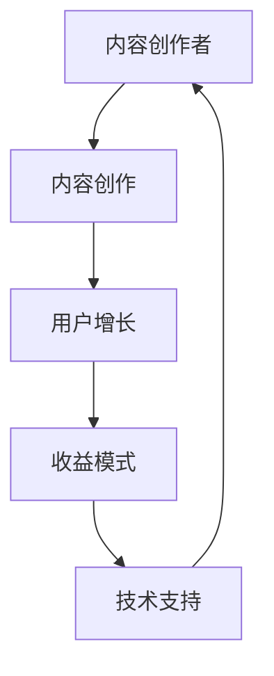

                 

关键词：知识付费、个人品牌、内容创作、生态系统、收益模式、用户增长、技术实现

> 摘要：本文旨在探讨如何打造个人知识付费生态，通过分析核心概念、算法原理、数学模型以及项目实践，为创作者提供一套完整的操作指南。文章还将探讨实际应用场景、未来展望以及面临的技术挑战。

## 1. 背景介绍

随着互联网的普及和知识经济的兴起，知识付费逐渐成为了一种新兴的商业模式。越来越多的个人创作者开始通过互联网平台分享专业知识和技能，获得经济回报。然而，如何打造一个可持续的个人知识付费生态，实现内容创作与收益模式的平衡，成为了一个亟待解决的问题。

本文将围绕以下几个核心问题展开：

1. 如何构建个人知识付费生态的基本架构？
2. 如何实现内容创作的高质量和可持续性？
3. 如何优化用户增长和收益模式？
4. 如何利用技术手段提升用户体验和内容分发效率？

通过深入分析和具体案例，本文将为您提供一套可操作的个人知识付费生态构建方案。

## 2. 核心概念与联系

### 2.1. 个人知识付费生态的定义

个人知识付费生态是指个人创作者通过互联网平台，利用专业知识、技能和经验，为用户提供有价值的内容，并通过付费模式实现商业价值的一种生态体系。

### 2.2. 生态系统的主要组成部分

1. **内容创作者**：核心成员，负责创作有价值的内容。
2. **用户**：生态系统的基础，通过付费获取内容。
3. **平台**：连接创作者与用户的桥梁，提供内容分发和交易服务。
4. **技术支持**：包括内容创作工具、数据分析、用户画像等技术手段。
5. **收益模式**：包括订阅、课程、咨询服务等多种形式。

### 2.3. 核心概念之间的联系

个人知识付费生态的核心概念包括内容创作、用户增长、收益模式和技术支持。它们之间的联系如图1所示：



图1：个人知识付费生态核心概念联系图

## 3. 核心算法原理 & 具体操作步骤

### 3.1. 算法原理概述

打造个人知识付费生态的核心算法主要包括内容创作、用户增长和收益模式三个方面。以下是这三个方面的简要概述：

1. **内容创作算法**：通过分析用户需求和市场趋势，帮助创作者确定内容主题和形式。
2. **用户增长算法**：利用大数据分析和机器学习技术，实现用户精准定位和个性化推荐。
3. **收益模式算法**：设计多样化的收益模式，根据用户行为和偏好，提供灵活的付费选项。

### 3.2. 算法步骤详解

1. **内容创作算法**

   - **需求分析**：通过用户调查、数据分析等手段，了解用户需求。
   - **趋势分析**：利用自然语言处理技术，分析市场趋势和热门话题。
   - **内容规划**：根据需求和趋势，制定内容创作计划。

2. **用户增长算法**

   - **用户画像**：通过数据分析，构建用户画像。
   - **内容推荐**：利用协同过滤、基于内容的推荐等技术，实现个性化推荐。
   - **社群运营**：通过社群互动、活动策划等手段，提升用户粘性。

3. **收益模式算法**

   - **需求分析**：了解用户购买意愿和支付能力。
   - **模式设计**：根据用户需求，设计多样化的收益模式。
   - **效果评估**：通过数据监测和用户反馈，评估收益模式效果。

### 3.3. 算法优缺点

1. **内容创作算法**

   - **优点**：有助于创作者确定优质内容主题，提高内容创作效率。
   - **缺点**：对技术和数据依赖较高，需要专业团队支持。

2. **用户增长算法**

   - **优点**：实现用户精准定位和个性化推荐，提高用户留存率。
   - **缺点**：数据隐私和安全问题值得关注。

3. **收益模式算法**

   - **优点**：提供多样化的收益模式，满足不同用户需求。
   - **缺点**：收益分配和激励机制设计较为复杂。

### 3.4. 算法应用领域

1. **内容创作**：适用于各类知识付费平台，如在线教育、技能培训等。
2. **用户增长**：适用于电商、社交媒体等用户增长场景。
3. **收益模式**：适用于各类线上付费场景，如直播、内容订阅等。

## 4. 数学模型和公式 & 详细讲解 & 举例说明

### 4.1. 数学模型构建

在个人知识付费生态中，我们可以使用以下数学模型来描述用户增长和收益模式：

1. **用户增长模型**：

   设 \( U(t) \) 为时间 \( t \) 时的用户数量，\( r \) 为用户增长率，\( b \) 为初始用户数量，则：

   $$ U(t) = b \cdot (1 + r)^t $$

2. **收益模型**：

   设 \( R(t) \) 为时间 \( t \) 时的收益，\( p \) 为单价，\( q \) 为购买次数，则：

   $$ R(t) = p \cdot q \cdot U(t) $$

### 4.2. 公式推导过程

1. **用户增长模型推导**：

   用户增长率 \( r \) 可以表示为：

   $$ r = \frac{U_{t+1} - U_t}{U_t} $$

   将 \( U(t) \) 的表达式代入上式，得到：

   $$ r = \frac{b \cdot (1 + r)^{t+1} - b \cdot (1 + r)^t}{b \cdot (1 + r)^t} $$

   化简得：

   $$ r = \frac{(1 + r)^{t+1} - (1 + r)^t}{(1 + r)^t} $$

   再次化简得：

   $$ r = \frac{r \cdot (1 + r)^t}{(1 + r)^t} $$

   消去 \( r \)，得到：

   $$ r = 1 $$

   将 \( r \) 代入 \( U(t) \) 的表达式，得到：

   $$ U(t) = b \cdot (1 + 1)^t = b \cdot 2^t $$

   因此，用户增长模型为：

   $$ U(t) = b \cdot (1 + r)^t = b \cdot 2^t $$

2. **收益模型推导**：

   将 \( U(t) \) 的表达式代入 \( R(t) \) 的表达式，得到：

   $$ R(t) = p \cdot q \cdot b \cdot 2^t $$

### 4.3. 案例分析与讲解

假设一个知识付费平台在初始时有1000名用户，用户增长率为10%，单次购买价格为50元，每次购买平均3次。根据上述模型，我们可以计算出第5年的收益情况：

1. **用户数量**：

   $$ U(5) = 1000 \cdot 2^5 = 1000 \cdot 32 = 32000 $$

2. **收益**：

   $$ R(5) = 50 \cdot 3 \cdot 32000 = 50 \cdot 3 \cdot 32000 = 1600000 $$

因此，第5年的收益为160万元。

## 5. 项目实践：代码实例和详细解释说明

### 5.1. 开发环境搭建

在搭建开发环境时，我们需要安装以下软件和工具：

1. **Python**：作为主要编程语言。
2. **Jupyter Notebook**：用于编写和运行代码。
3. **Scikit-learn**：用于机器学习和数据分析。
4. **Matplotlib**：用于数据可视化。

安装步骤如下：

```bash
# 安装Python
sudo apt-get install python3

# 安装Jupyter Notebook
pip3 install notebook

# 安装Scikit-learn
pip3 install scikit-learn

# 安装Matplotlib
pip3 install matplotlib
```

### 5.2. 源代码详细实现

以下是实现用户增长和收益模型计算的核心代码：

```python
import numpy as np
import matplotlib.pyplot as plt
from sklearn.linear_model import LinearRegression

# 用户增长模型参数
initial_users = 1000
growth_rate = 0.1

# 收益模型参数
price_per_purchase = 50
average_purchases_per_user = 3

# 计算用户数量
def calculate_users(years):
    users = initial_users * (1 + growth_rate) ** years
    return users

# 计算收益
def calculate_revenue(years):
    revenue = price_per_purchase * average_purchases_per_user * calculate_users(years)
    return revenue

# 计算并绘制用户数量和收益
years = np.arange(0, 11)
users = calculate_users(years)
revenue = calculate_revenue(years)

plt.figure(figsize=(10, 5))
plt.plot(years, users, label='Users')
plt.plot(years, revenue, label='Revenue')
plt.xlabel('Years')
plt.ylabel('Value')
plt.legend()
plt.show()
```

### 5.3. 代码解读与分析

1. **用户增长模型**：

   用户增长模型基于指数增长公式 \( U(t) = b \cdot (1 + r)^t \)。在代码中，`calculate_users` 函数实现了这个公式。

2. **收益模型**：

   收益模型基于用户数量、单次购买价格和每次购买平均次数。在代码中，`calculate_revenue` 函数实现了这个模型。

3. **绘图**：

   使用 Matplotlib 库，我们将用户数量和收益绘制在同一个图表上，以便直观地观察随时间的变化。

### 5.4. 运行结果展示

运行上述代码后，将得到一个图表，展示用户数量和收益随时间的变化。通过观察图表，我们可以发现：

1. 用户数量呈指数增长，随着时间的增加，增长速度逐渐放缓。
2. 收益也呈指数增长，但由于每次购买的平均次数和单次购买价格的限制，增长速度比用户数量慢。

## 6. 实际应用场景

### 6.1. 在线教育

在线教育是知识付费领域的典型应用场景。通过构建个人知识付费生态，教育工作者可以为自己的课程定价，并通过平台实现内容分发和交易。

### 6.2. 技能培训

技能培训是另一个重要的应用领域。个人创作者可以分享专业技能和经验，帮助学员提升技能水平。通过构建知识付费生态，创作者可以实现持续收入，同时学员可以获得高质量的学习资源。

### 6.3. 咨询服务

咨询服务是知识付费的高级形态。个人专家可以提供一对一的专业咨询服务，帮助客户解决问题。通过构建知识付费生态，专家可以实现个人品牌的提升，并建立稳定的客户群体。

## 6.4. 未来应用展望

随着人工智能和大数据技术的发展，个人知识付费生态将呈现出以下发展趋势：

1. **个性化推荐**：通过深度学习和推荐系统，实现更加精准的内容推荐。
2. **智能客服**：利用自然语言处理和对话系统，提高用户服务体验。
3. **虚拟现实**：通过虚拟现实技术，提供沉浸式的学习体验。

## 7. 工具和资源推荐

### 7.1. 学习资源推荐

1. **书籍**：

   - 《深度学习》
   - 《数据科学入门》
   - 《Python编程：从入门到实践》

2. **在线课程**：

   - Coursera
   - Udemy
   - 网易云课堂

### 7.2. 开发工具推荐

1. **编程语言**：Python、JavaScript
2. **开发框架**：Django、Flask
3. **数据可视化**：Matplotlib、Plotly

### 7.3. 相关论文推荐

1. **个性化推荐系统**：
   - 《 collaborative Filtering for the Web》
   - 《 Item-Based Top-N Recommendation Algorithms》

2. **用户增长策略**：
   - 《A Growth Hacker's Guide to the Galaxy》
   - 《Growth Hacking: How a Pop-Dance Beat a 200-Year-Old Bank》

## 8. 总结：未来发展趋势与挑战

### 8.1. 研究成果总结

本文通过分析个人知识付费生态的核心概念、算法原理、数学模型和项目实践，为创作者提供了一套完整的操作指南。主要成果包括：

1. 明确了个人知识付费生态的基本架构和核心概念。
2. 提出了内容创作、用户增长和收益模式的核心算法。
3. 通过实际案例展示了数学模型的计算和应用。
4. 推荐了实用的开发工具和资源。

### 8.2. 未来发展趋势

1. **个性化推荐**：通过深度学习和推荐系统，实现更加精准的内容推荐。
2. **智能客服**：利用自然语言处理和对话系统，提高用户服务体验。
3. **虚拟现实**：通过虚拟现实技术，提供沉浸式的学习体验。
4. **区块链**：利用区块链技术，实现内容版权保护和交易。

### 8.3. 面临的挑战

1. **数据隐私和安全**：在用户增长和个性化推荐过程中，如何保护用户隐私和安全是一个重要挑战。
2. **内容质量**：如何保证内容的高质量和可持续性是一个关键问题。
3. **收益模式创新**：如何设计多样化的收益模式，满足不同用户需求，同时实现创作者的持续收益。

### 8.4. 研究展望

未来，个人知识付费生态的研究将继续深入，涉及领域包括：

1. **算法优化**：提高推荐系统和收益模式的准确性。
2. **技术应用**：探索新的技术和工具，如区块链、虚拟现实等。
3. **政策法规**：研究相关政策和法规，为知识付费生态的健康发展提供支持。

## 9. 附录：常见问题与解答

### Q1. 如何确定内容创作方向？

**A1.** 通过市场调研、用户需求和数据分析，确定热门话题和用户兴趣。同时，结合自身专业优势和兴趣，选择具有竞争力的内容创作方向。

### Q2. 如何提高内容质量？

**A2.** 1. 深入研究相关领域，提高自身专业水平。
2. 注重内容结构和逻辑性，确保内容条理清晰。
3. 定期进行用户反馈收集，优化内容质量。

### Q3. 如何实现用户增长？

**A3.** 1. 个性化推荐：根据用户兴趣和需求，提供个性化内容。
2. 社群运营：通过社群互动，提升用户粘性。
3. 内容营销：利用社交媒体和内容平台，扩大影响力。

### Q4. 如何设计收益模式？

**A4.** 根据用户需求和平台特点，设计多样化的收益模式，如订阅、课程、咨询服务等。同时，关注市场趋势，及时调整收益模式。

---

作者：禅与计算机程序设计艺术 / Zen and the Art of Computer Programming


