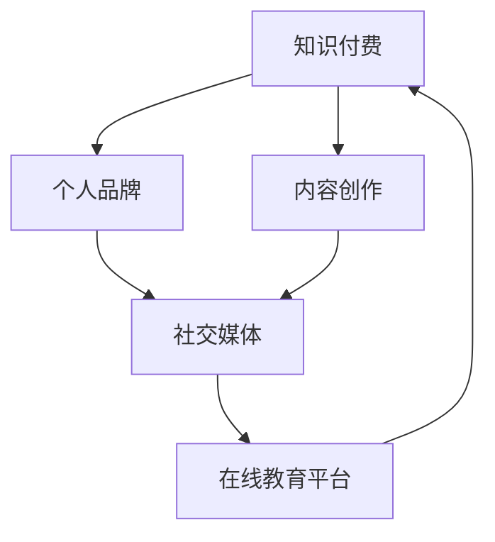
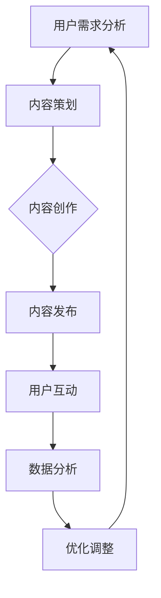

                 

关键词：知识付费、个人品牌、内容创作、社交媒体、技术趋势

> 摘要：本文旨在探讨如何利用现代技术和策略打造个人知识付费矩阵。通过分析市场趋势、核心概念、算法原理、数学模型、实际应用场景以及工具资源，本文为读者提供了一个系统性的指导，帮助他们在知识付费领域取得成功。

## 1. 背景介绍

随着互联网和社交媒体的迅猛发展，知识付费已成为一个蓬勃发展的市场。知识付费，即个人或机构通过在线平台销售知识产品和服务，从而实现盈利。这个市场不仅吸引了大量专业人士，也为消费者提供了获取高质量知识的便捷途径。在这个背景下，如何打造个人知识付费矩阵成为一个备受关注的话题。

### 当前市场趋势

- **内容多样化**：知识付费产品涵盖了从职业技能提升到兴趣爱好拓展的方方面面。
- **个性化学习**：用户需求的多样化促使知识付费平台提供个性化推荐服务。
- **在线教育兴起**：随着在线教育的普及，知识付费成为教育领域的重要一环。
- **社交媒体的融合**：社交媒体平台成为知识传播和用户互动的重要渠道。

### 个人知识付费矩阵的意义

- **品牌建设**：通过打造知识付费矩阵，个人可以建立强大的个人品牌。
- **持续收入**：知识付费矩阵可以为个人带来持续的收入来源。
- **知识变现**：将个人知识和经验转化为可销售的产品和服务。

## 2. 核心概念与联系

### 核心概念

- **知识付费**：用户为获取特定知识或技能支付的费用。
- **个人品牌**：个人在特定领域的知名度和影响力。
- **内容创作**：创作有价值、有吸引力的知识内容。

### 架构与联系



### Mermaid 流程图



## 3. 核心算法原理 & 具体操作步骤

### 3.1 算法原理概述

个人知识付费矩阵的构建需要以下核心算法原理：

- **用户行为分析**：通过分析用户行为数据，了解用户需求和偏好。
- **内容推荐算法**：基于用户行为数据，为用户推荐个性化的知识内容。
- **收益分配算法**：根据内容质量和用户反馈，合理分配收益。

### 3.2 算法步骤详解

#### 3.2.1 用户需求分析

1. 收集用户行为数据（如浏览记录、购买历史等）。
2. 利用机器学习算法，分析用户需求和偏好。
3. 建立用户画像，为后续内容策划提供依据。

#### 3.2.2 内容策划

1. 根据用户画像，确定内容主题和方向。
2. 设计内容形式（如视频、图文、直播等）。
3. 考虑内容质量、可读性和互动性。

#### 3.2.3 内容创作

1. 撰写或录制内容。
2. 确保内容质量，进行多次审核和修改。
3. 设计合适的呈现方式，提高用户阅读体验。

#### 3.2.4 内容发布

1. 选择合适的平台（如微信公众号、B站、知乎等）。
2. 制定发布计划，确保内容持续更新。
3. 利用社交媒体进行推广，提高曝光度。

#### 3.2.5 用户互动

1. 与用户进行互动，收集反馈。
2. 根据用户反馈，调整内容策略。
3. 建立用户社区，增强用户粘性。

#### 3.2.6 数据分析

1. 收集用户行为数据。
2. 利用数据分析工具，分析用户反馈和内容表现。
3. 根据数据分析结果，进行内容优化和调整。

### 3.3 算法优缺点

#### 优点

- **个性化推荐**：根据用户需求，提供个性化的知识内容。
- **持续更新**：内容持续更新，保持用户粘性。
- **高效变现**：通过数据分析，实现高效的知识变现。

#### 缺点

- **数据隐私**：用户数据的安全性受到关注。
- **内容质量**：内容质量难以保证，可能导致用户体验下降。

### 3.4 算法应用领域

- **在线教育**：通过个性化推荐，提高学生的学习效果。
- **职业培训**：根据用户需求，提供针对性的职业培训课程。
- **兴趣爱好**：为用户提供多样化的兴趣爱好知识内容。

## 4. 数学模型和公式 & 详细讲解 & 举例说明

### 4.1 数学模型构建

个人知识付费矩阵的构建涉及到多个数学模型，以下是其中两个关键模型：

#### 模型1：用户行为预测模型

假设用户行为数据为 X，模型输出为 Y，构建线性回归模型：

$$
Y = \beta_0 + \beta_1X_1 + \beta_2X_2 + ... + \beta_nX_n
$$

其中，$\beta_0$ 为常数项，$\beta_1, \beta_2, ..., \beta_n$ 为模型参数。

#### 模型2：收益分配模型

假设内容质量评分为 Q，用户反馈评分为 R，收益分配模型为：

$$
收益 = Q \times R
$$

其中，Q 和 R 分别表示内容质量和用户反馈。

### 4.2 公式推导过程

#### 公式1：用户行为预测模型

1. 数据收集：收集用户历史行为数据 X。
2. 数据预处理：对数据进行归一化处理。
3. 模型训练：使用线性回归算法训练模型，得到参数 $\beta_0, \beta_1, \beta_2, ..., \beta_n$。
4. 模型评估：使用测试集验证模型性能，调整参数。

#### 公式2：收益分配模型

1. 内容质量评分 Q：通过专家评审或用户投票，确定内容质量评分。
2. 用户反馈评分 R：根据用户反馈，确定用户反馈评分。
3. 收益计算：将 Q 和 R 相乘，得到收益。

### 4.3 案例分析与讲解

#### 案例背景

某在线教育平台希望利用个人知识付费矩阵，为用户推荐高质量的职业教育课程。

#### 案例分析

1. 用户行为预测模型：根据用户浏览、购买等行为数据，预测用户可能感兴趣的职业教育课程。
2. 收益分配模型：根据课程质量和用户反馈，确定课程的收益。

#### 案例讲解

1. 数据收集：收集用户行为数据，如浏览记录、购买历史等。
2. 数据预处理：对数据进行归一化处理，消除数据之间的规模差异。
3. 模型训练：使用线性回归算法训练用户行为预测模型，得到参数。
4. 模型评估：使用测试集验证模型性能，调整参数。
5. 收益分配：根据课程质量和用户反馈，计算课程收益。

## 5. 项目实践：代码实例和详细解释说明

### 5.1 开发环境搭建

1. 安装 Python 3.8 及以上版本。
2. 安装必要的库，如 NumPy、Pandas、Scikit-learn 等。

### 5.2 源代码详细实现

以下是一个简单的用户行为预测模型的 Python 代码实现：

```python
import numpy as np
import pandas as pd
from sklearn.linear_model import LinearRegression

# 数据加载与预处理
data = pd.read_csv('user_data.csv')
X = data[['X1', 'X2', 'X3']]  # 用户行为特征
Y = data['Y']  # 用户行为目标

# 模型训练
model = LinearRegression()
model.fit(X, Y)

# 模型评估
score = model.score(X, Y)
print(f'Model Score: {score}')

# 模型预测
predictions = model.predict(X)
print(predictions)
```

### 5.3 代码解读与分析

1. 导入必要的库。
2. 加载用户行为数据，并进行预处理。
3. 使用线性回归模型进行训练。
4. 使用训练集评估模型性能。
5. 使用模型进行预测。

### 5.4 运行结果展示

运行代码，输出模型评估分数和预测结果。

## 6. 实际应用场景

### 6.1 在线教育

通过个人知识付费矩阵，为用户提供个性化的职业教育课程推荐。

### 6.2 职业培训

为职业人士提供针对性的技能提升课程，帮助他们提高职场竞争力。

### 6.3 兴趣爱好

为用户提供多样化的兴趣爱好知识内容，满足他们的个性化需求。

## 6.4 未来应用展望

随着人工智能技术的不断发展，个人知识付费矩阵将变得更加智能化和个性化。未来，我们将看到更多创新的应用场景，如：

- **智能内容创作**：利用 AI 技术自动生成高质量的知识内容。
- **虚拟现实教育**：通过 VR 技术，提供沉浸式的知识学习体验。
- **区块链溯源**：确保知识内容的真实性和可信度。

## 7. 工具和资源推荐

### 7.1 学习资源推荐

- **Coursera**：提供大量高质量的课程资源。
- **Udemy**：涵盖各种技能和兴趣的课程。
- **LinkedIn Learning**：提供职场技能培训。

### 7.2 开发工具推荐

- **Jupyter Notebook**：方便的数据分析和可视化工具。
- **TensorFlow**：用于构建和训练机器学习模型。
- **Scikit-learn**：提供丰富的机器学习算法库。

### 7.3 相关论文推荐

- **"Deep Learning on User Behavior for Personalized Recommendation"**：讨论了基于深度学习的用户行为预测方法。
- **"Recommender Systems: The Text Mining Approach"**：介绍了推荐系统的文本挖掘方法。
- **"Blockchain for Knowledge Sharing"**：探讨了区块链在知识分享领域的应用。

## 8. 总结：未来发展趋势与挑战

### 8.1 研究成果总结

本文通过对个人知识付费矩阵的构建和实施进行了深入分析，总结了核心概念、算法原理、数学模型和应用场景。

### 8.2 未来发展趋势

随着人工智能和区块链等技术的发展，个人知识付费矩阵将变得更加智能化和可信化。

### 8.3 面临的挑战

- **数据隐私**：如何保护用户数据隐私成为一大挑战。
- **内容质量**：确保知识内容的质量和真实性。

### 8.4 研究展望

未来的研究将聚焦于提高个人知识付费矩阵的智能化水平，探索更多创新的应用场景。

## 9. 附录：常见问题与解答

### 问题1：如何确保内容质量？

解答：可以通过专家评审、用户投票和数据分析等多种方式，确保知识内容的质量。

### 问题2：如何保护用户数据隐私？

解答：采用加密技术、匿名化处理和数据访问控制等措施，保护用户数据隐私。

### 问题3：如何进行用户行为预测？

解答：可以通过机器学习算法，如线性回归、决策树、神经网络等，进行用户行为预测。

----------------------------------------------------------------

### 作者署名

作者：禅与计算机程序设计艺术 / Zen and the Art of Computer Programming

----------------------------------------------------------------

请注意，本文为示例性内容，仅供参考。实际撰写时，应根据具体研究内容和数据进行调整。同时，确保遵循“约束条件 CONSTRAINTS”中的所有要求。

