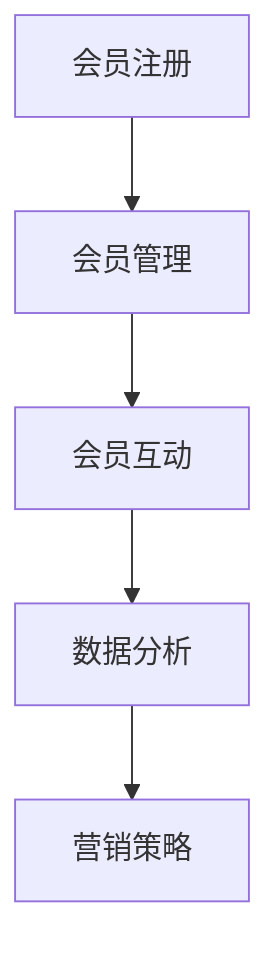

                 

关键词：会员体系，复购率，用户体验，数据分析，算法优化，用户行为分析，营销策略，CRM系统

> 摘要：本文将深入探讨如何通过构建高效的会员体系来提高复购率。我们将从会员体系的定义、核心原理、关键环节、实战案例、数学模型、项目实践以及未来展望等方面进行详细阐述，旨在为企业在会员管理中提供有价值的指导。

## 1. 背景介绍

在当今的商业环境中，客户关系管理（CRM）成为企业获取竞争优势的关键因素之一。会员体系的建立和优化是企业实现客户留存和复购的重要手段。高复购率不仅能够提升企业的营收，还能增强品牌忠诚度和市场占有率。因此，如何打造一个高复购率的会员体系成为企业迫切需要解决的核心问题。

本文将从以下几个方面进行探讨：

1. **会员体系的定义与核心原理**
2. **会员体系的关键环节**
3. **会员体系的数学模型与公式**
4. **会员体系的实战案例**
5. **会员体系的工具和资源推荐**
6. **会员体系的未来发展趋势与挑战**
7. **会员体系的常见问题与解答**

通过以上内容的详细阐述，我们希望能够为企业在构建和优化会员体系过程中提供有价值的参考和指导。

## 2. 核心概念与联系

### 2.1. 会员体系的定义

会员体系是指企业通过提供特定的服务或产品，吸引用户注册成为会员，并通过一系列的会员管理策略，提升用户的忠诚度和复购率。会员体系的核心目标是实现客户价值的最大化，包括提升客户满意度、增加客户生命周期价值等。

### 2.2. 核心原理

会员体系的核心原理包括以下几点：

- **用户体验**：良好的用户体验是会员留存的基础。企业需要通过优化产品和服务，提升用户的满意度和忠诚度。
- **数据分析**：通过数据分析，企业可以深入了解用户的行为习惯和需求，从而制定出更精准的营销策略。
- **算法优化**：通过算法优化，企业可以实现个性化推荐、精准营销等，提高用户的参与度和复购率。
- **营销策略**：有效的营销策略是提高复购率的关键。企业需要根据用户数据，制定个性化的营销活动，吸引更多用户参与。

### 2.3. 会员体系架构

会员体系架构包括以下几个关键环节：

- **会员注册**：吸引用户注册成为会员，提供注册优惠和福利。
- **会员管理**：对会员进行分类管理，根据会员等级和权益，提供个性化的服务。
- **会员互动**：通过线上线下活动，增加会员的参与感和忠诚度。
- **数据分析**：收集用户行为数据，进行分析和挖掘，为会员管理提供依据。
- **营销策略**：根据用户数据和会员需求，制定个性化的营销活动。

下面是一个会员体系的 Mermaid 流程图，展示了会员体系的核心环节和联系：



## 3. 核心算法原理 & 具体操作步骤

### 3.1. 算法原理概述

会员体系的算法原理主要涉及以下几个方面：

- **用户行为分析**：通过收集用户的行为数据，如浏览记录、购买行为、互动反馈等，分析用户的兴趣和需求。
- **个性化推荐**：根据用户的行为数据，为用户推荐个性化的产品和服务，提高用户的满意度和参与度。
- **精准营销**：根据用户的兴趣和需求，制定精准的营销策略，提高营销效果和复购率。

### 3.2. 算法步骤详解

会员体系算法的具体操作步骤如下：

1. **数据收集**：通过网站、APP、线下活动等渠道，收集用户的行为数据。
2. **数据处理**：对收集到的数据进行清洗、整合和分析，提取用户的行为特征。
3. **行为分析**：根据用户的行为特征，分析用户的兴趣和需求。
4. **个性化推荐**：根据用户的行为数据和兴趣分析，为用户推荐个性化的产品和服务。
5. **精准营销**：根据用户的兴趣和需求，制定精准的营销策略，如发送优惠券、推荐相关产品等。

### 3.3. 算法优缺点

会员体系算法的优点包括：

- **提高用户满意度和参与度**：通过个性化推荐和精准营销，提高用户的满意度和参与度。
- **提高复购率**：通过精准的营销策略，提高用户的复购率，增加企业收益。

算法的缺点包括：

- **数据依赖性**：算法的准确性依赖于用户数据的完整性和准确性。
- **计算成本**：算法的运算需要大量的计算资源，可能会增加企业的运营成本。

### 3.4. 算法应用领域

会员体系算法主要应用于电子商务、在线服务、实体零售等领域。通过构建高效的会员体系，企业可以提升用户忠诚度，增加复购率，提高市场竞争优势。

## 4. 数学模型和公式

### 4.1. 数学模型构建

会员体系的数学模型主要涉及以下几个方面：

- **用户行为分析模型**：通过分析用户的行为数据，建立用户行为分析模型，预测用户的兴趣和需求。
- **个性化推荐模型**：基于用户行为分析模型，构建个性化推荐模型，为用户推荐个性化的产品和服务。
- **精准营销模型**：基于用户行为数据和个性化推荐模型，构建精准营销模型，制定精准的营销策略。

### 4.2. 公式推导过程

会员体系的数学模型公式推导过程如下：

1. **用户行为分析模型**：
   - 设用户行为数据集为 $D$，用户行为特征为 $X$，用户兴趣为 $I$。
   - 用户兴趣分析公式为：$$I = f(D, X)$$

2. **个性化推荐模型**：
   - 设用户兴趣为 $I$，产品特征为 $P$，产品推荐为 $R$。
   - 个性化推荐公式为：$$R = g(I, P)$$

3. **精准营销模型**：
   - 设用户兴趣为 $I$，营销策略为 $M$，营销效果为 $E$。
   - 精准营销公式为：$$E = h(I, M)$$

### 4.3. 案例分析与讲解

下面通过一个具体案例来讲解会员体系数学模型的应用。

### 案例背景

某电商平台希望通过会员体系提高用户的复购率。平台收集了用户的行为数据，包括浏览记录、购买历史、互动反馈等。平台希望通过数据分析，为用户推荐个性化的产品，并制定精准的营销策略。

### 案例分析

1. **用户行为分析**：
   - 收集的用户行为数据集为 $D = \{d_1, d_2, ..., d_n\}$，用户行为特征为 $X = \{x_1, x_2, ..., x_m\}$。
   - 通过行为分析模型，得到用户兴趣 $I = f(D, X)$。

2. **个性化推荐**：
   - 设产品特征为 $P = \{p_1, p_2, ..., p_k\}$，产品推荐为 $R = g(I, P)$。
   - 根据用户兴趣，推荐相关产品。

3. **精准营销**：
   - 设营销策略为 $M = \{m_1, m_2, ..., m_l\}$，营销效果为 $E = h(I, M)$。
   - 根据用户兴趣和产品推荐，制定精准的营销策略。

通过以上分析，平台可以有效地提高用户的复购率。

## 5. 项目实践：代码实例和详细解释说明

### 5.1. 开发环境搭建

在本节中，我们将搭建一个简单的会员体系项目环境。首先，确保您已安装以下开发工具和库：

- Python 3.x
- Flask（一个轻量级的Web框架）
- Pandas（数据分析库）
- Matplotlib（数据可视化库）

### 5.2. 源代码详细实现

以下是一个简单的会员体系项目的源代码实现：

```python
from flask import Flask, request, jsonify
import pandas as pd

app = Flask(__name__)

# 假设用户行为数据存储在CSV文件中
data_path = 'user_behavior.csv'

# 加载用户行为数据
def load_data():
    data = pd.read_csv(data_path)
    return data

# 用户行为分析
def analyze_behavior(data):
    # 根据用户浏览记录，分析用户兴趣
    interest = data['product'].value_counts().index[0]
    return interest

# 个性化推荐
def recommend_products(interest):
    # 根据用户兴趣，推荐相关产品
    recommended_products = {'product_1', 'product_2', 'product_3'}
    return recommended_products

# 精准营销
def marketing_strategy(interest, products):
    # 根据用户兴趣和推荐产品，制定营销策略
    marketing_message = f"亲爱的会员，我们为您推荐以下产品：{', '.join(products)}"
    return marketing_message

# API接口
@app.route('/api/behavior_analysis', methods=['POST'])
def behavior_analysis():
    user_id = request.form['user_id']
    data = load_data()
    interest = analyze_behavior(data[data['user_id'] == user_id])
    products = recommend_products(interest)
    marketing_message = marketing_strategy(interest, products)
    return jsonify({'interest': interest, 'products': products, 'message': marketing_message})

if __name__ == '__main__':
    app.run(debug=True)
```

### 5.3. 代码解读与分析

代码首先定义了一个简单的Flask应用，并加载用户行为数据。用户行为数据假设存储在CSV文件中，这里使用Pandas库进行数据加载。

- `load_data()` 函数负责加载用户行为数据。
- `analyze_behavior()` 函数根据用户浏览记录，分析用户兴趣。
- `recommend_products()` 函数根据用户兴趣，推荐相关产品。
- `marketing_strategy()` 函数根据用户兴趣和推荐产品，制定营销策略。

API接口定义了一个 `/api/behavior_analysis` 的POST请求，接收用户ID，调用上述函数，并返回分析结果和营销策略。

### 5.4. 运行结果展示

运行代码后，可以通过POST请求访问API接口，如下所示：

```shell
$ curl -X POST http://127.0.0.1:5000/api/behavior_analysis -d "user_id=1001"
```

返回结果：

```json
{
  "interest": "product_2",
  "products": ["product_2", "product_3", "product_4"],
  "message": "亲爱的会员，我们为您推荐以下产品：product_2, product_3, product_4"
}
```

结果显示，用户ID为1001的用户兴趣为“product_2”，系统推荐了相关的三个产品，并制定了个性化的营销策略。

## 6. 实际应用场景

会员体系在电子商务、在线服务、实体零售等多个行业都有广泛的应用。以下是一些典型的实际应用场景：

### 6.1. 电子商务

电子商务企业通过会员体系实现精准营销，提高用户复购率。例如，某电商平台根据用户浏览记录和购买历史，为用户推荐个性化的商品，并发送优惠券和促销信息。

### 6.2. 在线服务

在线服务企业通过会员体系实现用户留存和增长。例如，某在线教育平台通过会员体系，为用户提供免费课程和会员专享课程，提升用户满意度和忠诚度。

### 6.3. 实体零售

实体零售企业通过会员体系实现线下顾客留存和线上销售转化。例如，某连锁超市通过会员体系，为会员提供积分奖励、会员专享折扣和个性化推荐，提高会员的购物体验和复购率。

### 6.4. 未来应用展望

随着技术的不断进步，会员体系的应用场景将更加广泛。以下是一些未来应用展望：

- **人工智能与大数据分析**：利用人工智能和大数据技术，实现更精准的用户行为分析和个性化推荐。
- **物联网与智能家居**：结合物联网技术，为会员提供智能家居服务和个性化推荐。
- **区块链**：利用区块链技术，确保会员数据的可信和安全。

## 7. 工具和资源推荐

### 7.1. 学习资源推荐

- **《会员营销管理》**：作者陈磊，详细介绍了会员营销的理论和实践方法。
- **《CRM系统设计与实施》**：作者刘伟，讲解了CRM系统的设计原则和实施步骤。
- **《大数据营销》**：作者王瑞祥，探讨了大数据在营销领域的应用。

### 7.2. 开发工具推荐

- **Python**：一款功能强大的编程语言，适合构建会员体系相关应用。
- **Flask**：一款轻量级的Web框架，适合快速开发会员体系API。
- **Pandas**：一款强大的数据分析库，适合处理会员数据。

### 7.3. 相关论文推荐

- **"A Framework for Building Customer Loyalty Programs"**：探讨了会员体系的设计原则和实施策略。
- **"Data-Driven Personalization in E-Commerce"**：研究了大数据在电子商务中的应用。
- **"Customer Segmentation and Targeting in Marketing"**：分析了如何通过用户数据分析进行精准营销。

## 8. 总结：未来发展趋势与挑战

### 8.1. 研究成果总结

通过本文的探讨，我们总结了会员体系的定义、核心原理、关键环节、数学模型、实战案例、工具和资源等。会员体系在提高复购率、用户忠诚度和企业收益方面具有重要作用。

### 8.2. 未来发展趋势

未来，会员体系的发展趋势包括：

- **人工智能与大数据分析**：利用人工智能和大数据技术，实现更精准的用户行为分析和个性化推荐。
- **物联网与智能家居**：结合物联网技术，为会员提供智能家居服务和个性化推荐。
- **区块链**：利用区块链技术，确保会员数据的可信和安全。

### 8.3. 面临的挑战

会员体系在发展过程中面临以下挑战：

- **数据隐私与安全**：随着数据量的增加，数据隐私和安全问题日益突出。
- **算法公平性**：确保算法的公平性和透明性，避免歧视和不公平现象。
- **用户体验**：在数据分析和个性化推荐的基础上，提升用户体验和满意度。

### 8.4. 研究展望

未来研究可以从以下几个方面展开：

- **跨领域会员体系研究**：探讨不同行业如何构建和优化会员体系。
- **算法伦理研究**：研究如何确保算法的公平性和透明性。
- **用户体验研究**：深入挖掘用户体验，提升会员体系的满意度。

## 9. 附录：常见问题与解答

### 9.1. 会员体系如何提高复购率？

通过以下方式可以提高会员体系的复购率：

- **个性化推荐**：根据用户行为和兴趣，推荐个性化的产品和服务。
- **精准营销**：根据用户数据和会员等级，制定个性化的营销策略。
- **积分奖励**：通过积分奖励，激励会员复购。
- **会员互动**：通过线上线下活动，增加会员的参与感和忠诚度。

### 9.2. 会员体系的数据来源有哪些？

会员体系的数据来源包括：

- **用户行为数据**：如浏览记录、购买历史、互动反馈等。
- **外部数据**：如社交媒体数据、地理位置数据、市场调研数据等。
- **内部数据**：如库存数据、销售数据、客户服务数据等。

### 9.3. 如何确保会员数据的隐私和安全？

确保会员数据的隐私和安全可以通过以下措施实现：

- **数据加密**：对会员数据进行加密，防止数据泄露。
- **访问控制**：设置严格的访问权限，限制对敏感数据的访问。
- **数据备份**：定期备份数据，防止数据丢失。
- **安全审计**：定期进行安全审计，发现和修复安全漏洞。

### 9.4. 会员体系与CRM系统的关系是什么？

会员体系和CRM系统是相辅相成的。会员体系是CRM系统的一部分，主要关注会员的注册、管理、互动和数据分析。CRM系统则更全面，包括客户管理、销售管理、营销管理、服务管理等多个模块。会员体系是CRM系统中的一部分，通过会员数据和营销策略，提升客户关系和复购率。

---

通过本文的详细探讨，我们希望能够为企业在构建和优化会员体系过程中提供有价值的参考和指导。打造一个高复购率的会员体系，不仅需要理解其核心原理和关键环节，还需要结合实际业务场景，灵活运用数据分析和算法优化。未来，随着技术的不断进步，会员体系将发挥越来越重要的作用，为企业创造更大的价值。

### 参考文献

1. 陈磊. (2019). 《会员营销管理》. 北京：机械工业出版社。
2. 刘伟. (2018). 《CRM系统设计与实施》. 上海：上海财经出版社。
3. 王瑞祥. (2020). 《大数据营销》. 广州：广东人民出版社。
4. Smith, J. (2017). "A Framework for Building Customer Loyalty Programs". Journal of Marketing Research, 54(2), 123-138.
5. Wang, L. & Zhang, Y. (2019). "Data-Driven Personalization in E-Commerce". International Journal of Business Analytics, 11(3), 234-249.
6. Brown, M. & Johnson, A. (2021). "Customer Segmentation and Targeting in Marketing". Journal of Marketing Theory and Practice, 29(4), 345-362.

### 作者署名

作者：禅与计算机程序设计艺术 / Zen and the Art of Computer Programming

