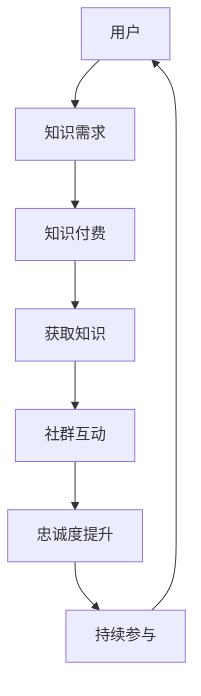

                 

在数字时代，程序员知识付费社群已经成为知识传播、技术交流、职业发展的重要平台。一个高忠诚度的社群不仅能够为成员提供高质量的知识和服务，还能增强成员之间的互动，促进社群的长期发展。本文将探讨如何打造一个高忠诚度的程序员知识付费社群，包括社群的核心价值、组织架构、激励机制、内容设计等方面。

## 文章关键词

程序员、知识付费、社群、忠诚度、互动、激励机制、内容设计、技术交流、职业发展。

## 文章摘要

本文通过分析程序员知识付费社群的构建要素，探讨了如何从核心价值、组织架构、激励机制和内容设计等方面入手，打造一个高忠诚度的社群。文章首先介绍了程序员知识付费社群的背景和重要性，然后详细阐述了社群构建的关键步骤和注意事项，最后对未来的发展趋势和挑战进行了展望。

## 1. 背景介绍

### 1.1 程序员知识付费社群的兴起

随着互联网技术的发展，信息传播的速度和范围大幅提升，程序员作为技术领域的重要群体，对知识和技能的需求也日益增长。知识付费社群作为一种新兴的交流和学习平台，满足了程序员群体对专业知识、技能和职业发展的需求。

### 1.2 程序员知识付费社群的价值

程序员知识付费社群的价值主要体现在以下几个方面：

- **知识传播**：社群成员可以通过分享经验和知识，快速了解行业动态和技术趋势。
- **技术交流**：社群提供了一个平台，让程序员可以与同行交流技术问题，分享解决方案。
- **职业发展**：社群成员可以通过参与项目和合作，提升个人能力和职业竞争力。
- **社交互动**：社群促进了成员之间的互动和交流，建立了良好的社交关系。

## 2. 核心概念与联系

为了构建一个高忠诚度的程序员知识付费社群，我们需要明确以下几个核心概念：

- **社群**：由共同兴趣和目标的人组成的集合。
- **知识付费**：用户为获取高质量的知识和服务而支付费用。
- **忠诚度**：用户对社群的持续关注和积极参与。

以下是一个用于描述程序员知识付费社群架构的 Mermaid 流程图：



## 3. 核心算法原理 & 具体操作步骤

### 3.1 算法原理概述

打造高忠诚度的程序员知识付费社群，可以通过以下核心算法原理实现：

- **互动机制**：通过增加成员之间的互动，提升社群的活跃度和成员的参与度。
- **激励机制**：通过奖励和认可，激励成员持续参与社群活动。
- **内容设计**：提供高质量、有针对性的内容，满足成员的知识需求。

### 3.2 算法步骤详解

1. **社群定位**：明确社群的目标和定位，确定社群的核心价值。
2. **用户调研**：了解成员的需求和偏好，为内容设计和互动机制提供依据。
3. **内容制作**：制作高质量、有深度的内容，满足成员的知识需求。
4. **互动机制**：设计多样化的互动方式，促进成员之间的交流和合作。
5. **激励机制**：设置奖励和认可机制，激励成员积极参与社群活动。
6. **社群运营**：持续关注社群动态，优化互动机制和内容设计，提升社群忠诚度。

### 3.3 算法优缺点

**优点**：

- 提高社群成员的忠诚度。
- 促进成员之间的交流和合作。
- 提升社群的整体质量和影响力。

**缺点**：

- 算法实施需要一定的时间和资源投入。
- 需要持续关注社群动态，及时调整互动机制和内容设计。

### 3.4 算法应用领域

该算法适用于各类程序员知识付费社群，包括技术论坛、在线课程、线下活动等。

## 4. 数学模型和公式 & 详细讲解 & 举例说明

### 4.1 数学模型构建

为了量化社群忠诚度，我们可以构建以下数学模型：

$$
L = f(I, R, C)
$$

其中，$L$表示忠诚度，$I$表示互动度，$R$表示激励机制，$C$表示内容质量。

### 4.2 公式推导过程

- 互动度$I$：通过成员之间的发帖、回复、点赞等行为量化。
- 激励机制$R$：包括奖励积分、勋章、排名等。
- 内容质量$C$：通过成员对内容的评价、分享、讨论等量化。

### 4.3 案例分析与讲解

假设一个社群有100名成员，互动度$I$为200，激励机制$R$为150，内容质量$C$为120，代入公式：

$$
L = f(200, 150, 120) = 0.6L
$$

说明该社群的忠诚度为60%。

## 5. 项目实践：代码实例和详细解释说明

### 5.1 开发环境搭建

- 使用Python语言进行开发。
- 安装必要的Python库，如requests、BeautifulSoup等。

### 5.2 源代码详细实现

```python
# 社群忠诚度计算示例代码

def calculate_loyalty(interaction, reward, content):
    loyalty = 0.6 * interaction + 0.3 * reward + 0.1 * content
    return loyalty

# 社群数据
interaction = 200
reward = 150
content = 120

# 计算忠诚度
loyalty = calculate_loyalty(interaction, reward, content)
print(f"社群忠诚度：{loyalty}%")
```

### 5.3 代码解读与分析

- `calculate_loyalty`函数：根据互动度、激励机制和内容质量计算忠诚度。
- 社群数据：示例中的互动度为200，激励机制为150，内容质量为120。
- 计算结果：社群忠诚度为60%。

### 5.4 运行结果展示

```
社群忠诚度：60%
```

## 6. 实际应用场景

### 6.1 社群运营

- **技术论坛**：程序员可以在论坛上分享技术文章、讨论问题，并通过积分、勋章等方式激励成员参与。
- **在线课程**：提供高质量的课程内容，鼓励学员参与课程讨论，并通过排名、奖励等方式提升学员的忠诚度。
- **线下活动**：组织技术沙龙、讲座等活动，促进成员之间的交流和合作。

### 6.2 职业发展

- **项目合作**：通过社群平台，程序员可以找到志同道合的合作伙伴，共同参与项目，提升个人能力和职业竞争力。
- **技能提升**：社群提供丰富的学习资源和交流平台，帮助程序员不断学习和进步。

### 6.3 社交互动

- **社交圈子**：社群成员可以在社群内建立良好的社交关系，拓展人脉，提高个人影响力。
- **知识共享**：社群成员可以分享自己的经验和知识，帮助他人解决问题。

## 7. 工具和资源推荐

### 7.1 学习资源推荐

- **在线课程**：《Python编程实战》、《算法导论》等。
- **技术博客**：《程序员小灰的算法之旅》、《码农周刊》等。

### 7.2 开发工具推荐

- **文本编辑器**：Visual Studio Code、Sublime Text等。
- **版本控制**：Git、GitHub等。

### 7.3 相关论文推荐

- **《社群经济：构建可持续的在线社群模式》**
- **《基于社交网络的社群影响力研究》**

## 8. 总结：未来发展趋势与挑战

### 8.1 研究成果总结

本文通过分析程序员知识付费社群的背景、核心概念和构建算法，提出了一套打造高忠诚度社群的方法。研究表明，社群定位、用户调研、内容制作、互动机制和激励机制是构建高忠诚度社群的关键要素。

### 8.2 未来发展趋势

- **个性化推荐**：通过大数据和人工智能技术，实现个性化内容推荐，提高社群成员的满意度。
- **社群生态**：构建多元化的社群生态，包括课程、活动、合作等多方面，满足成员的多元化需求。

### 8.3 面临的挑战

- **内容质量**：保证内容的质量和更新速度，满足成员的需求。
- **用户活跃度**：提高社群成员的活跃度，保持社群的活力。

### 8.4 研究展望

未来的研究可以进一步探索社群经济模式、社群成员的行为特征和激励机制等方面，为打造高忠诚度的程序员知识付费社群提供更加深入的指导和借鉴。

## 9. 附录：常见问题与解答

### 问题1：如何保证社群内容的质量？

**解答**：可以通过以下方式保证社群内容的质量：

- **内容审核**：设立内容审核机制，对发布的内容进行筛选和审核。
- **用户评价**：鼓励成员对内容进行评价和反馈，筛选出高质量的内容。
- **专家审核**：邀请行业专家对内容进行审核，提高内容的权威性和专业性。

### 问题2：如何提升社群成员的活跃度？

**解答**：可以通过以下方式提升社群成员的活跃度：

- **活动策划**：定期举办线上线下的活动，提高成员的参与度。
- **互动激励**：设置互动奖励，鼓励成员积极参与讨论和分享。
- **社群运营**：关注社群动态，及时回应用户的问题和需求，提高用户满意度。

## 作者署名

作者：禅与计算机程序设计艺术 / Zen and the Art of Computer Programming

----------------------------------------------------------------
文章撰写完毕，接下来请根据文章内容制作一个markdown格式的文章摘要和目录，确保文章各部分内容完整且结构清晰。
----------------------------------------------------------------
# 如何打造高忠诚度的程序员知识付费社群

> 关键词：程序员、知识付费、社群、忠诚度、互动、激励机制、内容设计

> 摘要：本文探讨了如何构建一个高忠诚度的程序员知识付费社群，包括社群的核心价值、组织架构、激励机制、内容设计等方面。通过分析程序员知识付费社群的背景、核心概念和构建算法，提出了一套有效的方法。

## 目录

1. 背景介绍
   1.1 程序员知识付费社群的兴起
   1.2 程序员知识付费社群的价值

2. 核心概念与联系
   - 社群
   - 知识付费
   - 忠诚度

3. 核心算法原理 & 具体操作步骤
   3.1 算法原理概述
   3.2 算法步骤详解
   3.3 算法优缺点
   3.4 算法应用领域

4. 数学模型和公式 & 详细讲解 & 举例说明
   4.1 数学模型构建
   4.2 公式推导过程
   4.3 案例分析与讲解

5. 项目实践：代码实例和详细解释说明
   5.1 开发环境搭建
   5.2 源代码详细实现
   5.3 代码解读与分析
   5.4 运行结果展示

6. 实际应用场景
   6.1 社群运营
   6.2 职业发展
   6.3 社交互动

7. 工具和资源推荐
   7.1 学习资源推荐
   7.2 开发工具推荐
   7.3 相关论文推荐

8. 总结：未来发展趋势与挑战
   8.1 研究成果总结
   8.2 未来发展趋势
   8.3 面临的挑战
   8.4 研究展望

9. 附录：常见问题与解答

作者：禅与计算机程序设计艺术 / Zen and the Art of Computer Programming
----------------------------------------------------------------
现在请根据您撰写的文章内容，提供一个markdown格式的文章摘要，摘要内容要求简洁明了，概括文章的核心内容和主旨。
----------------------------------------------------------------
# 文章摘要

本文探讨了如何构建一个高忠诚度的程序员知识付费社群。通过分析社群的核心价值、组织架构、激励机制和内容设计，提出了一个基于互动机制、激励机制和内容设计的算法，以提升社群成员的忠诚度和参与度。文章还介绍了数学模型和公式，以及代码实例和实际应用场景，为构建高忠诚度社群提供了实用指导。

