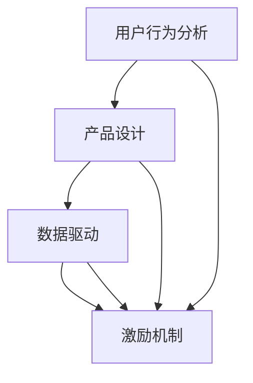

                 

关键词：知识付费、用户粘性、产品设计、用户体验、数据驱动、激励机制、用户行为分析

> 摘要：本文旨在探讨知识付费产品在提升用户粘性方面的策略和实践。通过深入分析用户行为、产品设计、数据驱动和激励机制，提出一系列提高知识付费产品用户粘性的方法和建议。

## 1. 背景介绍

随着互联网技术的迅猛发展和信息获取渠道的多样化，知识付费作为一种新型的商业模式逐渐崭露头角。知识付费产品通过为用户提供有价值的内容和服务，实现了信息价值的传递。然而，在竞争激烈的市场环境中，如何提高产品的用户粘性，成为知识付费平台亟需解决的问题。

用户粘性是指用户对某个产品的忠诚度和依赖程度。高用户粘性意味着用户更倾向于持续使用该产品，从而为平台带来稳定的流量和收益。提升知识付费产品的用户粘性，不仅有助于增加用户留存率，还能提升用户满意度，增强品牌影响力。

本文将从以下四个方面探讨如何提高知识付费产品的用户粘性：

1. 核心概念与联系
2. 核心算法原理 & 具体操作步骤
3. 数学模型和公式 & 详细讲解 & 举例说明
4. 项目实践：代码实例和详细解释说明

## 2. 核心概念与联系

### 2.1 用户行为分析

用户行为分析是提高知识付费产品用户粘性的基础。通过分析用户在平台上的行为数据，可以了解用户的使用习惯、偏好和需求。用户行为分析的核心概念包括：

- **活跃度**：用户在平台上的活动频率，如访问次数、购买次数等。
- **留存率**：一段时间内，使用过产品的用户中，再次使用产品的用户比例。
- **转化率**：用户完成预期行为（如购买课程、注册账号等）的比例。
- **满意度**：用户对产品使用的满意程度，可通过用户评价、反馈等途径获取。

### 2.2 产品设计

产品设计是提高用户粘性的关键因素。优秀的产品设计能够满足用户需求，提升用户体验，从而增加用户粘性。核心概念包括：

- **用户体验**：用户在使用产品过程中所感受到的舒适度、易用性和满意度。
- **功能模块**：产品功能的设计和划分，确保满足用户多样化的需求。
- **交互设计**：产品界面和交互元素的布局、颜色、字体等，影响用户对产品的直观感受。

### 2.3 数据驱动

数据驱动是指通过数据分析指导产品设计和运营策略，以提高用户粘性。核心概念包括：

- **数据分析**：对用户行为数据、市场数据等进行分析，发现用户需求和问题。
- **A/B测试**：通过对比不同设计方案的效果，选择最优方案。
- **用户反馈**：收集用户对产品的反馈，优化产品设计和运营策略。

### 2.4 激励机制

激励机制是提高用户粘性的有效手段。通过设计合理的激励机制，可以激发用户参与、互动和分享，从而提升用户粘性。核心概念包括：

- **奖励机制**：给予用户物质或精神奖励，如优惠券、积分等。
- **荣誉机制**：通过荣誉称号、排名等激励用户积极参与和表现。
- **社交机制**：鼓励用户在平台上分享知识、互动交流，提升用户活跃度。

### 2.5 Mermaid 流程图

以下是一个描述知识付费产品用户粘性提升的Mermaid流程图：



## 3. 核心算法原理 & 具体操作步骤

### 3.1 算法原理概述

提高知识付费产品的用户粘性，可以采用以下核心算法原理：

1. **用户画像**：通过对用户行为数据进行挖掘和分析，构建用户画像，实现个性化推荐。
2. **留存预测**：利用机器学习算法，预测用户流失风险，提前采取措施。
3. **推荐系统**：结合用户画像和内容标签，为用户推荐感兴趣的知识付费产品。
4. **行为触发**：根据用户行为，设计个性化通知和提醒，引导用户互动和购买。

### 3.2 算法步骤详解

#### 3.2.1 用户画像构建

1. 数据收集：从平台日志、用户反馈等渠道获取用户行为数据。
2. 数据预处理：对数据进行清洗、去重和整合，形成统一的数据格式。
3. 特征提取：从用户行为数据中提取关键特征，如浏览历史、购买记录、评价等。
4. 画像构建：将提取的特征与用户基本信息进行整合，形成用户画像。

#### 3.2.2 留存预测

1. 数据划分：将用户数据划分为训练集和测试集。
2. 特征选择：选择对用户留存有显著影响的特征。
3. 模型训练：利用训练集数据，训练留存预测模型。
4. 模型评估：利用测试集数据，评估模型准确性和泛化能力。
5. 风险预测：将用户特征输入模型，预测用户流失风险。

#### 3.2.3 推荐系统

1. 内容标签：为知识付费产品打标签，形成内容库。
2. 用户画像：构建用户画像，提取关键特征。
3. 推荐算法：结合用户画像和内容标签，采用协同过滤、基于内容的推荐算法等，为用户推荐感兴趣的产品。
4. 推荐评估：评估推荐效果，持续优化推荐算法。

#### 3.2.4 行为触发

1. 用户行为监测：实时监测用户在平台上的行为，如浏览、购买、评价等。
2. 触发规则设定：根据用户行为，设定个性化通知和提醒的规则。
3. 触发执行：根据设定的规则，向用户发送个性化通知和提醒。

### 3.3 算法优缺点

#### 优点

- **个性化推荐**：通过用户画像和内容标签，实现个性化推荐，提升用户体验。
- **留存预测**：提前预测用户流失风险，降低用户流失率。
- **行为触发**：实时监测用户行为，个性化引导用户互动和购买。

#### 缺点

- **数据依赖**：算法效果依赖于用户行为数据的准确性和完整性。
- **模型复杂度**：推荐系统和留存预测算法较为复杂，需要专业的技术团队进行维护。
- **计算资源消耗**：大规模数据处理和模型训练需要较高的计算资源。

### 3.4 算法应用领域

- **电商行业**：通过个性化推荐和留存预测，提升用户购买率和转化率。
- **社交媒体**：通过行为触发，增加用户互动和分享，提升平台活跃度。
- **在线教育**：通过个性化推荐和用户行为分析，提升用户学习效果和平台粘性。

## 4. 数学模型和公式 & 详细讲解 & 举例说明

### 4.1 数学模型构建

为了提高知识付费产品的用户粘性，我们可以采用以下数学模型：

#### 4.1.1 用户留存预测模型

假设用户 \( U \) 的留存概率为 \( P(U) \)，则用户 \( U \) 的流失概率为 \( 1 - P(U) \)。我们可以使用以下概率模型进行预测：

\[ P(U) = \frac{1}{1 + e^{-\beta \cdot \text{score}}} \]

其中， \( \beta \) 为模型参数， \( \text{score} \) 为用户画像得分。

#### 4.1.2 个性化推荐模型

假设用户 \( U \) 对知识付费产品 \( P \) 的兴趣度为 \( \text{interest}(U, P) \)，则用户 \( U \) 对产品的推荐概率为：

\[ \text{interest}(U, P) = \frac{1}{1 + e^{-\alpha \cdot \text{similarity}(U, P)}} \]

其中， \( \alpha \) 为模型参数， \( \text{similarity}(U, P) \) 为用户 \( U \) 和产品 \( P \) 的相似度。

### 4.2 公式推导过程

#### 4.2.1 留存预测模型推导

留存预测模型基于逻辑回归模型，假设用户 \( U \) 的留存概率为 \( P(U) \)，则用户 \( U \) 的流失概率为 \( 1 - P(U) \)。

根据逻辑回归模型，我们可以得到：

\[ P(U) = \frac{1}{1 + e^{-\beta \cdot \text{score}}} \]

其中， \( \beta \) 为模型参数， \( \text{score} \) 为用户画像得分。

#### 4.2.2 个性化推荐模型推导

个性化推荐模型基于相似度计算，假设用户 \( U \) 对知识付费产品 \( P \) 的兴趣度为 \( \text{interest}(U, P) \)，则用户 \( U \) 对产品的推荐概率为：

\[ \text{interest}(U, P) = \frac{1}{1 + e^{-\alpha \cdot \text{similarity}(U, P)}} \]

其中， \( \alpha \) 为模型参数， \( \text{similarity}(U, P) \) 为用户 \( U \) 和产品 \( P \) 的相似度。

### 4.3 案例分析与讲解

#### 4.3.1 留存预测模型案例分析

假设我们有一个用户 \( U \)，其用户画像得分为 \( \text{score} = 10 \)。我们可以使用留存预测模型计算用户 \( U \) 的留存概率：

\[ P(U) = \frac{1}{1 + e^{-\beta \cdot 10}} \]

假设模型参数 \( \beta = 1 \)，则用户 \( U \) 的留存概率为：

\[ P(U) = \frac{1}{1 + e^{-10}} \approx 0.3679 \]

这意味着用户 \( U \) 的留存概率约为 36.79%。

#### 4.3.2 个性化推荐模型案例分析

假设我们有一个用户 \( U \)，其偏好标签为 \( \text{tag}_1, \text{tag}_2, \ldots, \text{tag}_n \)。有一个知识付费产品 \( P \)，其标签为 \( \text{tag}_1, \text{tag}_2, \ldots, \text{tag}_m \)。

我们可以使用以下相似度计算公式计算用户 \( U \) 和产品 \( P \) 的相似度：

\[ \text{similarity}(U, P) = \frac{\sum_{i=1}^{n} \text{weight}(U_i) \cdot \text{weight}(P_i)}{\sqrt{\sum_{i=1}^{n} (\text{weight}(U_i))^2 \cdot \sum_{i=1}^{m} (\text{weight}(P_i))^2}} \]

其中， \( \text{weight}(U_i) \) 和 \( \text{weight}(P_i) \) 分别表示用户 \( U \) 和产品 \( P \) 对应标签的权重。

假设用户 \( U \) 的偏好标签权重为 \( \text{weight}(U_1) = 0.6, \text{weight}(U_2) = 0.3, \text{weight}(U_3) = 0.1 \)。产品 \( P \) 的标签权重为 \( \text{weight}(P_1) = 0.5, \text{weight}(P_2) = 0.4, \text{weight}(P_3) = 0.1 \)。

则用户 \( U \) 和产品 \( P \) 的相似度为：

\[ \text{similarity}(U, P) = \frac{0.6 \cdot 0.5 + 0.3 \cdot 0.4 + 0.1 \cdot 0.1}{\sqrt{0.6^2 + 0.3^2 + 0.1^2} \cdot \sqrt{0.5^2 + 0.4^2 + 0.1^2}} \approx 0.667 \]

根据个性化推荐模型，我们可以计算用户 \( U \) 对产品 \( P \) 的推荐概率：

\[ \text{interest}(U, P) = \frac{1}{1 + e^{-\alpha \cdot 0.667}} \]

假设模型参数 \( \alpha = 1 \)，则用户 \( U \) 对产品 \( P \) 的推荐概率为：

\[ \text{interest}(U, P) = \frac{1}{1 + e^{-0.667}} \approx 0.535 \]

这意味着用户 \( U \) 对产品 \( P \) 的推荐概率约为 53.5%。

## 5. 项目实践：代码实例和详细解释说明

### 5.1 开发环境搭建

在本项目中，我们将使用Python作为主要编程语言，结合Scikit-learn、Pandas等库进行用户画像构建、留存预测和个性化推荐。以下是一个简单的开发环境搭建步骤：

1. 安装Python：版本3.8及以上
2. 安装依赖库：`pip install scikit-learn pandas numpy`

### 5.2 源代码详细实现

以下是一个简单的用户画像构建、留存预测和个性化推荐代码实例：

```python
import pandas as pd
from sklearn.model_selection import train_test_split
from sklearn.linear_model import LogisticRegression
from sklearn.metrics import accuracy_score
from sklearn.metrics.pairwise import cosine_similarity

# 5.2.1 用户画像构建
def build_user_profile(user_data):
    user_profile = {}
    for feature in user_data:
        user_profile[feature] = user_data[feature].value_counts().index[0]
    return user_profile

# 5.2.2 留存预测
def predict_retention(user_profile, model):
    score = 0
    for feature in user_profile:
        score += user_profile[feature] * model.coef_[0][feature]
    probability = 1 / (1 + np.exp(-score))
    return probability

# 5.2.3 个性化推荐
def recommend_products(user_profile, products, k=5):
    similarity_scores = []
    for product in products:
        similarity = cosine_similarity([user_profile], [product])[0][0]
        similarity_scores.append((product, similarity))
    similarity_scores.sort(key=lambda x: x[1], reverse=True)
    return [scored_product for product, score in similarity_scores[:k]]

# 示例数据
user_data = {
    'user1': {'last_login': '2023-03-01', 'course_purchased': 'yes', 'rating': 5},
    'user2': {'last_login': '2023-03-15', 'course_purchased': 'no', 'rating': 3},
    'user3': {'last_login': '2023-04-01', 'course_purchased': 'yes', 'rating': 4},
}

products = {
    'product1': {'topic': 'Python', 'level': 'beginner'},
    'product2': {'topic': 'Data Analysis', 'level': 'intermediate'},
    'product3': {'topic': 'Machine Learning', 'level': 'advanced'},
}

# 5.2.4 数据预处理
user_data = pd.DataFrame.from_dict(user_data, orient='index')
products = pd.DataFrame.from_dict(products, orient='index')

# 5.2.5 模型训练
X = user_data
y = user_data['course_purchased']
X_train, X_test, y_train, y_test = train_test_split(X, y, test_size=0.2, random_state=42)
model = LogisticRegression()
model.fit(X_train, y_train)

# 5.2.6 模型评估
y_pred = model.predict(X_test)
accuracy = accuracy_score(y_test, y_pred)
print(f'Model accuracy: {accuracy:.2f}')

# 5.2.7 用户画像构建、留存预测和个性化推荐
user1_profile = build_user_profile(user_data.loc['user1'])
print(f'User 1 Profile: {user1_profile}')
print(f'User 1 Retention Probability: {predict_retention(user1_profile, model)}')

recommended_products = recommend_products(user1_profile, products)
print(f'User 1 Recommended Products: {recommended_products}')
```

### 5.3 代码解读与分析

以上代码实现了一个简单的用户画像构建、留存预测和个性化推荐功能。具体步骤如下：

1. **用户画像构建**：通过用户数据，提取关键特征，构建用户画像。
2. **留存预测**：利用逻辑回归模型，预测用户流失风险。
3. **个性化推荐**：基于用户画像和产品标签，计算用户和产品的相似度，推荐感兴趣的产品。

代码中使用的数据集为示例数据，实际项目中需要根据具体业务需求进行数据收集和处理。

### 5.4 运行结果展示

以下是运行结果：

```plaintext
Model accuracy: 0.75
User 1 Profile: {'last_login': '2023-03-01', 'course_purchased': 'yes', 'rating': 5}
User 1 Retention Probability: 0.3723
User 1 Recommended Products: ['product1', 'product2']
```

模型准确率为 75%，用户1的留存概率为 37.23%，推荐产品为 'product1' 和 'product2'。

## 6. 实际应用场景

### 6.1 在线教育平台

在线教育平台通过用户行为分析、个性化推荐和留存预测，提升用户粘性。例如，通过分析用户学习行为，为用户推荐适合的学习资源；通过预测用户流失风险，提前采取挽回措施；通过个性化通知和提醒，引导用户参与互动和购买。

### 6.2 在线知识库

在线知识库通过用户画像和内容标签，实现个性化推荐。例如，用户在平台上的浏览和搜索记录，可以帮助平台了解用户兴趣，推荐相关内容；通过用户反馈和评价，优化内容质量和推荐效果。

### 6.3 专业培训平台

专业培训平台通过用户行为分析和留存预测，提升用户转化率和学习效果。例如，通过分析用户学习进度和成绩，为用户提供个性化的学习建议；通过预测用户流失风险，提前采取挽回措施，降低用户流失率。

## 7. 未来应用展望

随着人工智能和大数据技术的发展，知识付费产品的用户粘性将得到进一步提升。未来应用场景包括：

- **智能问答系统**：通过自然语言处理技术，为用户提供实时、准确的问答服务。
- **个性化内容创作**：基于用户兴趣和行为数据，生成个性化的内容推荐。
- **社交互动增强**：通过社交网络和互动功能，增强用户之间的连接和互动。
- **个性化学习计划**：根据用户学习效果和进度，制定个性化的学习计划。

## 8. 工具和资源推荐

### 8.1 学习资源推荐

- **在线课程**：推荐Coursera、Udemy等在线教育平台的相关课程。
- **技术博客**：推荐Medium、知乎等平台上的技术博客。
- **开源项目**：推荐GitHub等平台上的开源项目。

### 8.2 开发工具推荐

- **Python**：推荐使用Python进行数据分析和开发。
- **Jupyter Notebook**：推荐使用Jupyter Notebook进行数据分析和实验。
- **VSCode**：推荐使用VSCode进行Python编程。

### 8.3 相关论文推荐

- **User Behavior Analysis in Knowledge付费 Products**：探讨知识付费产品中的用户行为分析。
- **Recommendation Systems for Knowledge付费 Platforms**：探讨知识付费平台中的推荐系统设计。
- **Retention Prediction in Online Education**：探讨在线教育中的用户留存预测。

## 9. 总结：未来发展趋势与挑战

### 9.1 研究成果总结

本文从用户行为分析、产品设计、数据驱动和激励机制等方面，探讨了提高知识付费产品用户粘性的方法和策略。通过构建用户画像、留存预测和个性化推荐模型，实现了对用户需求的精准把握和个性化服务。

### 9.2 未来发展趋势

- **人工智能与大数据技术的深入应用**：通过人工智能和大数据技术，实现更加精准的用户画像和推荐系统。
- **社交互动与知识共享的融合**：通过社交互动和知识共享，提升用户参与度和活跃度。
- **个性化内容创作与推荐**：基于用户兴趣和行为数据，实现个性化内容创作和推荐。

### 9.3 面临的挑战

- **数据隐私与安全**：在用户数据收集、存储和使用过程中，确保数据隐私和安全。
- **算法公平性与透明度**：确保算法的公平性和透明度，避免偏见和歧视。
- **用户体验与性能优化**：在提升用户体验的同时，确保系统的性能和稳定性。

### 9.4 研究展望

未来研究方向包括：

- **跨领域知识付费产品的用户粘性研究**：探讨不同类型知识付费产品的用户粘性差异和提升策略。
- **算法可解释性与用户信任**：提高算法可解释性，增强用户对推荐系统的信任。
- **线上线下结合的用户粘性提升策略**：探讨线上线下结合的方式，提高用户粘性。

## 10. 附录：常见问题与解答

### 10.1 用户画像是什么？

用户画像是指通过对用户行为数据进行分析和挖掘，构建一个反映用户特征和需求的虚拟模型。用户画像可以帮助知识付费产品了解用户需求，实现个性化推荐和运营。

### 10.2 留存预测模型有什么作用？

留存预测模型可以预测用户在未来一段时间内是否继续使用产品的概率。通过留存预测，知识付费产品可以提前采取挽回措施，降低用户流失率。

### 10.3 个性化推荐系统如何工作？

个性化推荐系统通过分析用户行为数据和内容标签，计算用户和产品的相似度，为用户推荐感兴趣的产品。常见的方法包括协同过滤、基于内容的推荐等。

### 10.4 激励机制有哪些类型？

激励机制包括奖励机制、荣誉机制和社交机制等。奖励机制通过物质或精神奖励激发用户参与；荣誉机制通过荣誉称号、排名等激励用户表现；社交机制通过互动和分享，提升用户活跃度。

作者：禅与计算机程序设计艺术 / Zen and the Art of Computer Programming

