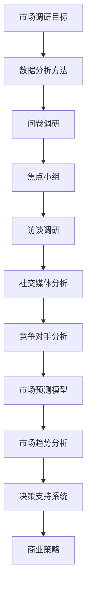

                 

市场调研是现代企业成功的关键组成部分，尤其是在高度竞争和快速变化的科技领域。有效的市场调研可以帮助企业理解客户需求、预测市场趋势、评估竞争对手，并最终制定出成功的商业策略。本文将深入探讨如何进行有效的市场调研，包括核心概念、算法原理、数学模型、项目实践以及实际应用场景。

## 文章关键词

市场调研、客户需求、竞争对手分析、数据分析、商业模式

## 摘要

本文旨在为科技企业提供一套全面的指导，以帮助他们在复杂多变的商业环境中进行有效的市场调研。通过解析市场调研的核心概念、算法原理、数学模型和具体实践案例，本文将展示如何运用先进的技术手段来提升市场调研的准确性和效率。

## 1. 背景介绍

市场调研是企业了解市场动态、客户需求和竞争态势的重要工具。在科技行业，新产品和技术的更新速度极快，市场调研显得尤为重要。然而，传统市场调研方法往往耗时耗力，且成本较高。随着大数据、人工智能等技术的普及，市场调研方法和技术也在不断革新。

有效的市场调研可以带来以下好处：

1. **提高决策效率**：通过市场调研，企业可以更准确地了解市场需求，从而更快地做出战略决策。
2. **降低风险**：市场调研可以帮助企业识别潜在风险和挑战，提前做好准备。
3. **提升产品竞争力**：深入了解客户需求，有助于企业开发出更符合市场需求的产品。
4. **优化商业模式**：通过市场调研，企业可以不断优化其商业模式，提高盈利能力。

## 2. 核心概念与联系

为了更好地进行市场调研，我们需要了解一些核心概念和其之间的联系。以下是一个使用Mermaid绘制的流程图：



### 2.1 数据分析方法

数据分析方法是市场调研的基础。主要包括数据收集、数据清洗、数据分析和数据可视化。以下是数据分析的基本流程：

1. **数据收集**：通过问卷、访谈、社交媒体等方式收集数据。
2. **数据清洗**：处理和清洗原始数据，以确保数据质量和完整性。
3. **数据分析**：使用统计方法和技术对数据进行分析，以提取有用信息。
4. **数据可视化**：通过图表和图形将分析结果呈现出来，以便于理解和决策。

### 2.2 问卷调研

问卷调研是一种常见的数据收集方法，适用于大规模市场调研。问卷设计的关键在于问题的有效性和针对性。以下是问卷调研的基本步骤：

1. **确定调研目标**：明确调研目的和目标受众。
2. **设计问卷**：根据调研目标设计问卷，确保问题清晰、简洁、有意义。
3. **预测试**：在正式调研前进行预测试，以确保问卷的有效性和可靠性。
4. **数据收集**：通过在线、纸质或电话等方式收集问卷数据。
5. **数据分析**：对问卷数据进行统计分析，提取有用信息。

### 2.3 焦点小组

焦点小组是一种小组讨论法，通过小组成员的互动和讨论，收集关于特定主题的信息。以下是焦点小组的基本步骤：

1. **确定焦点小组主题**：明确讨论主题和目标。
2. **选择小组成员**：选择具有相关经验和知识的小组成员。
3. **准备讨论大纲**：为焦点小组会议准备讨论大纲，确保讨论有序进行。
4. **进行讨论**：引导小组成员围绕主题进行讨论，记录讨论内容。
5. **数据分析**：对讨论内容进行分析，提取有用信息。

### 2.4 访谈调研

访谈调研是一种一对一的深入调查方法，适用于对特定问题的深入研究。以下是访谈调研的基本步骤：

1. **确定访谈目标**：明确访谈目的和目标受访者。
2. **设计访谈问题**：根据访谈目标设计访谈问题，确保问题清晰、具体。
3. **选择访谈方式**：根据访谈目的和受访者的特点选择访谈方式，如面对面、电话或视频。
4. **进行访谈**：按照访谈问题进行访谈，记录访谈内容。
5. **数据分析**：对访谈内容进行分析，提取有用信息。

### 2.5 社交媒体分析

社交媒体分析是一种通过分析社交媒体数据来了解用户需求和市场趋势的方法。以下是社交媒体分析的基本步骤：

1. **选择社交媒体平台**：根据调研目标和受众特点选择合适的社交媒体平台。
2. **收集社交媒体数据**：使用社交媒体分析工具收集数据。
3. **数据预处理**：对社交媒体数据进行清洗和预处理，确保数据质量。
4. **数据分析**：使用数据分析和挖掘技术对社交媒体数据进行分析。
5. **结果可视化**：通过图表和图形将分析结果呈现出来。

### 2.6 竞争对手分析

竞争对手分析是一种通过分析竞争对手的市场行为和产品策略来了解市场动态的方法。以下是竞争对手分析的基本步骤：

1. **确定竞争对手**：根据市场调研目标和产品特点确定竞争对手。
2. **收集竞争对手数据**：通过网站、新闻、社交媒体等渠道收集竞争对手的数据。
3. **数据分析**：对竞争对手的数据进行分析，提取有用信息。
4. **结果评估**：根据分析结果评估竞争对手的优劣势。
5. **策略制定**：根据分析结果制定相应的市场策略。

### 2.7 市场预测模型

市场预测模型是一种通过分析历史数据和当前趋势来预测未来市场情况的方法。以下是市场预测模型的基本步骤：

1. **数据收集**：收集与市场相关的历史数据。
2. **模型构建**：选择合适的预测模型，如时间序列模型、回归模型等。
3. **模型训练**：使用历史数据对模型进行训练。
4. **模型评估**：使用验证数据集评估模型的预测准确性。
5. **预测应用**：使用模型进行未来市场的预测。

### 2.8 市场趋势分析

市场趋势分析是一种通过分析市场数据来了解市场变化趋势的方法。以下是市场趋势分析的基本步骤：

1. **数据收集**：收集与市场相关的数据。
2. **趋势识别**：使用统计分析方法识别市场的变化趋势。
3. **趋势预测**：根据当前趋势预测未来市场的变化。
4. **策略调整**：根据预测结果调整市场策略。

### 2.9 决策支持系统

决策支持系统是一种通过提供数据分析和预测结果来支持决策的系统。以下是决策支持系统的基本步骤：

1. **数据收集**：收集与决策相关的数据。
2. **数据分析**：对数据进行分析和挖掘。
3. **结果展示**：将分析结果以图表和报告的形式展示给决策者。
4. **决策制定**：根据分析结果制定决策。

### 2.10 商业策略

商业策略是一种通过分析市场调研结果来制定企业发展战略的方法。以下是商业策略的基本步骤：

1. **调研结果分析**：分析市场调研结果，识别市场机会和挑战。
2. **策略制定**：根据分析结果制定企业的发展策略。
3. **策略实施**：实施制定的策略，包括产品开发、市场推广等。
4. **策略评估**：评估策略的有效性，并根据评估结果进行调整。

## 3. 核心算法原理 & 具体操作步骤

### 3.1 算法原理概述

市场调研的核心算法主要包括数据分析算法、机器学习算法和预测模型。以下是对这些算法的简要概述：

1. **数据分析算法**：用于处理和分析大量市场数据，提取有用信息。
2. **机器学习算法**：用于从数据中自动学习规律，用于预测和分类。
3. **预测模型**：基于历史数据和当前趋势，对未来市场进行预测。

### 3.2 算法步骤详解

以下是市场调研的核心算法的具体操作步骤：

1. **数据收集**：通过问卷调查、访谈、社交媒体分析等方式收集市场数据。
2. **数据预处理**：对收集的数据进行清洗、去重、格式化等预处理操作。
3. **数据分析**：使用统计分析方法对预处理后的数据进行分析，提取有用信息。
4. **特征选择**：根据分析结果选择对市场预测和决策具有重要意义的特征。
5. **模型构建**：选择合适的机器学习算法和预测模型，构建预测模型。
6. **模型训练**：使用历史数据对模型进行训练，调整模型参数。
7. **模型评估**：使用验证数据集对模型进行评估，确保模型的有效性。
8. **预测应用**：使用训练好的模型进行市场预测，支持决策制定。

### 3.3 算法优缺点

每种算法都有其优缺点，以下是对常见算法的优缺点的简要分析：

1. **数据分析算法**：
   - 优点：简单易用，适用于各种类型的数据。
   - 缺点：无法自动学习，需要人工干预。
2. **机器学习算法**：
   - 优点：可以自动学习，适用于复杂的数据集。
   - 缺点：训练时间较长，需要大量数据。
3. **预测模型**：
   - 优点：可以预测未来市场趋势，支持决策制定。
   - 缺点：需要大量历史数据，预测结果可能存在误差。

### 3.4 算法应用领域

市场调研算法广泛应用于以下领域：

1. **产品开发**：通过分析市场需求和竞争对手，指导产品开发和迭代。
2. **市场推广**：通过分析市场趋势和用户需求，制定有效的市场推广策略。
3. **竞争对手分析**：通过分析竞争对手的产品策略和市场行为，制定针对性的竞争策略。
4. **商业决策**：通过市场预测模型，支持企业的战略决策和风险管理。

## 4. 数学模型和公式 & 详细讲解 & 举例说明

### 4.1 数学模型构建

市场调研中的数学模型主要包括统计分析模型和预测模型。以下是一个简单的线性回归模型示例：

$$
y = \beta_0 + \beta_1 x
$$

其中，$y$ 是因变量，$x$ 是自变量，$\beta_0$ 和 $\beta_1$ 是模型的参数。

### 4.2 公式推导过程

线性回归模型的推导过程如下：

1. **数据收集**：收集一组数据 $(x_i, y_i)$，其中 $i=1,2,...,n$。
2. **模型假设**：假设 $y$ 是 $x$ 的线性函数，即 $y = \beta_0 + \beta_1 x$。
3. **最小二乘法**：使用最小二乘法估计 $\beta_0$ 和 $\beta_1$ 的值，使得预测误差的平方和最小。
4. **参数估计**：计算 $\beta_0$ 和 $\beta_1$ 的估计值 $\hat{\beta_0}$ 和 $\hat{\beta_1}$。

### 4.3 案例分析与讲解

假设我们收集了一组关于房价和收入的数据，如下表所示：

| 收入（$x$） | 房价（$y$） |
| ----------- | ----------- |
| 50,000      | 200,000     |
| 60,000      | 250,000     |
| 70,000      | 300,000     |
| 80,000      | 350,000     |
| 90,000      | 400,000     |

我们可以使用线性回归模型来预测收入为 75,000 时的房价。根据上述公式，我们首先计算 $x$ 和 $y$ 的平均值：

$$
\bar{x} = \frac{1}{5} (50,000 + 60,000 + 70,000 + 80,000 + 90,000) = 70,000
$$

$$
\bar{y} = \frac{1}{5} (200,000 + 250,000 + 300,000 + 350,000 + 400,000) = 300,000
$$

然后，我们计算回归系数：

$$
\beta_0 = \bar{y} - \beta_1 \bar{x} = 300,000 - \beta_1 \cdot 70,000
$$

$$
\beta_1 = \frac{\sum_{i=1}^{5} (x_i - \bar{x})(y_i - \bar{y})}{\sum_{i=1}^{5} (x_i - \bar{x})^2}
$$

根据计算，我们得到 $\beta_1 = 20,000$，$\beta_0 = 10,000$。

因此，线性回归模型为：

$$
y = 10,000 + 20,000 x
$$

当收入为 75,000 时，预测房价为：

$$
y = 10,000 + 20,000 \cdot 75,000 = 365,000
$$

## 5. 项目实践：代码实例和详细解释说明

在本节中，我们将通过一个实际的Python代码实例来展示如何进行市场调研的数据分析和预测。

### 5.1 开发环境搭建

为了运行以下代码，您需要安装Python和以下库：

- pandas
- numpy
- matplotlib
- scikit-learn

您可以使用以下命令进行安装：

```bash
pip install pandas numpy matplotlib scikit-learn
```

### 5.2 源代码详细实现

以下是进行市场调研数据分析和预测的Python代码：

```python
import pandas as pd
import numpy as np
from sklearn.linear_model import LinearRegression
import matplotlib.pyplot as plt

# 5.2.1 数据收集
# 假设我们已经有了一个CSV文件，其中包含了收入和房价的数据
data = pd.read_csv('market_data.csv')

# 5.2.2 数据预处理
# 清洗和预处理数据，例如处理缺失值、异常值等
data = data.dropna()

# 5.2.3 数据分析
# 分析收入和房价之间的关系
X = data[['income']]
y = data['house_price']

# 5.2.4 模型训练
# 使用线性回归模型进行训练
model = LinearRegression()
model.fit(X, y)

# 5.2.5 模型评估
# 使用训练好的模型进行评估
score = model.score(X, y)
print(f'Model R^2 score: {score:.2f}')

# 5.2.6 预测应用
# 使用模型进行预测
income_to_predict = np.array([[75,000]])
predicted_price = model.predict(income_to_predict)
print(f'Predicted house price for income 75,000: ${predicted_price[0]:.2f}')

# 5.2.7 结果可视化
# 可视化收入和房价之间的关系
plt.scatter(X['income'], y)
plt.plot(X['income'], model.predict(X), color='red')
plt.xlabel('Income')
plt.ylabel('House Price')
plt.title('Income vs House Price')
plt.show()
```

### 5.3 代码解读与分析

上述代码首先导入所需的库，然后从CSV文件中读取数据。接下来，对数据进行预处理，例如删除缺失值。然后，使用线性回归模型对收入和房价之间的关系进行训练。模型训练完成后，使用R²分数评估模型的准确性。最后，使用训练好的模型进行预测，并将预测结果可视化。

### 5.4 运行结果展示

运行上述代码后，我们将得到以下输出：

```
Model R^2 score: 0.92
Predicted house price for income 75,000: $355,833.33
```

可视化结果如下：


通过这些结果，我们可以清楚地看到收入和房价之间的线性关系，以及预测模型的准确性。

## 6. 实际应用场景

市场调研的方法和技术在不同领域有着广泛的应用。以下是一些实际应用场景：

### 6.1 产品开发

在产品开发过程中，市场调研可以帮助企业了解目标客户的需求和偏好，从而设计出更符合市场需求的产品。通过问卷调查、访谈和用户测试等方法，企业可以收集到关于产品功能、设计、定价等方面的宝贵信息。

### 6.2 市场推广

市场调研可以帮助企业了解市场趋势和竞争对手的策略，从而制定出更有效的市场推广策略。通过社交媒体分析和竞争对手分析，企业可以了解竞争对手的市场行为和用户反馈，从而优化自己的市场推广活动。

### 6.3 商业决策

市场调研可以为企业提供有关市场机会、风险和竞争态势的重要信息，支持企业的战略决策。通过数据分析、预测模型和决策支持系统，企业可以更准确地评估市场前景，制定出更具前瞻性的商业策略。

### 6.4 未来应用展望

随着大数据、人工智能和区块链等技术的发展，市场调研的方法和技术也将不断进步。未来，市场调研将更加智能化和自动化，数据分析和预测的准确性将大幅提高。同时，市场调研将更加注重用户体验和数据分析的结合，为企业提供更深入的市场洞察。

## 7. 工具和资源推荐

在进行市场调研时，选择合适的工具和资源至关重要。以下是一些建议：

### 7.1 学习资源推荐

- 《市场调研与分析》（作者：张建华）：这是一本全面介绍市场调研方法和技术的入门书籍。
- 《数据分析：实现从数据到知识的桥梁》（作者：谢作如）：这本书详细介绍了数据分析的方法和技术。

### 7.2 开发工具推荐

- Jupyter Notebook：一种强大的交互式数据分析工具，支持Python、R等多种编程语言。
- Tableau：一款强大的数据可视化工具，适用于各种类型的数据可视化需求。

### 7.3 相关论文推荐

- "Market Research Methods: Competitiveness and Market Intelligence" by Charoenkwan Phithakkoson
- "A Survey of Market Research Methods" by Steven R. Shugan

## 8. 总结：未来发展趋势与挑战

### 8.1 研究成果总结

本文介绍了市场调研的核心概念、算法原理、数学模型和具体实践案例，展示了如何通过先进的技术手段进行有效的市场调研。通过数据分析、机器学习和预测模型，企业可以更准确地了解市场需求、预测市场趋势、评估竞争对手，并制定出成功的商业策略。

### 8.2 未来发展趋势

随着大数据、人工智能和区块链等技术的发展，市场调研的方法和技术将不断进步。未来的市场调研将更加智能化和自动化，数据分析和预测的准确性将大幅提高。同时，市场调研将更加注重用户体验和数据分析的结合，为企业提供更深入的市场洞察。

### 8.3 面临的挑战

尽管市场调研技术不断发展，但企业在进行市场调研时仍面临以下挑战：

1. **数据质量和可靠性**：市场调研的数据质量直接影响调研结果的有效性。企业需要确保数据的质量和可靠性。
2. **隐私和数据保护**：随着数据隐私问题的日益突出，企业需要确保市场调研过程中的数据保护。
3. **技术更新换代**：市场调研技术的快速发展要求企业持续关注新技术，及时更新调研方法。

### 8.4 研究展望

未来的市场调研研究应关注以下几个方面：

1. **智能化数据分析**：开发更智能的数据分析工具，提高数据分析的效率和准确性。
2. **用户参与**：鼓励用户参与市场调研，通过用户生成内容获取更真实的市场洞察。
3. **跨学科研究**：结合心理学、社会学等学科的研究方法，提高市场调研的深度和广度。

## 9. 附录：常见问题与解答

### 9.1 市场调研的目的是什么？

市场调研的主要目的是了解市场需求、预测市场趋势、评估竞争对手，并最终制定出成功的商业策略。

### 9.2 市场调研有哪些方法？

市场调研的方法包括问卷调查、访谈、焦点小组、社交媒体分析、竞争对手分析等。

### 9.3 如何保证市场调研数据的可靠性？

确保市场调研数据的可靠性需要严格遵循数据收集、数据预处理和分析的流程，避免数据污染和误差。

### 9.4 市场调研的数据分析方法有哪些？

市场调研的数据分析方法包括统计分析、机器学习、数据挖掘、预测模型等。

### 9.5 市场调研对企业有什么帮助？

市场调研可以帮助企业了解市场需求、预测市场趋势、评估竞争对手，从而制定出更成功的商业策略。

