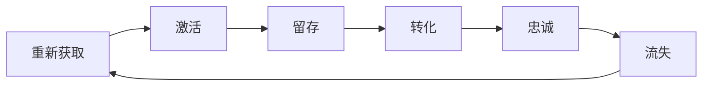

                 

关键词：用户生命周期管理、客户关系管理、数据分析、个性化推荐、客户留存、客户流失

> 摘要：本文旨在探讨用户生命周期管理的核心概念、关键环节、以及实际操作步骤，通过数据分析、个性化推荐等技术的应用，提高客户留存率和满意度，从而实现企业的长期稳定发展。

## 1. 背景介绍

在当今竞争激烈的商业环境中，企业不仅需要吸引新客户，更需要维护老客户，提高客户满意度，延长客户生命周期。用户生命周期管理（Customer Lifecycle Management，简称CLM）是一种系统性的方法，用于跟踪和分析用户从接触品牌到最终离开品牌的全过程。通过有效的用户生命周期管理，企业可以优化客户体验，提高客户留存率，减少客户流失，从而提升整体业务绩效。

用户生命周期通常被划分为以下几个阶段：

1. **获取（Acquisition）**：吸引新客户的过程。
2. **激活（Activation）**：将新客户转化为活跃用户的过程。
3. **留存（Retention）**：保持现有客户持续使用产品的过程。
4. **转化（Conversion）**：将潜在客户转化为付费客户的过程。
5. **忠诚（Loyalty）**：鼓励现有客户增加购买量和忠诚度的过程。
6. **流失（Churn）**：客户终止使用产品的过程。

本文将重点关注如何通过技术手段，特别是数据分析、个性化推荐等技术，来实现用户生命周期的各阶段管理，提高企业的市场竞争力。

## 2. 核心概念与联系

### 2.1 用户生命周期管理流程

用户生命周期管理的核心概念是围绕用户的整个生命周期进行策略规划与执行。以下是用户生命周期管理的流程，使用Mermaid流程图进行展示：



### 2.2 用户生命周期管理的关键环节

- **获取**：通过各种渠道吸引新客户，如广告、促销、社交媒体等。
- **激活**：新客户首次使用产品，提高他们的参与度和满意度。
- **留存**：通过持续的沟通、产品优化和客户服务来保持客户的长期使用。
- **转化**：将潜在客户转化为付费客户，通过定价策略、促销活动和客户关系管理来实现。
- **忠诚**：通过增加客户黏性和提高客户满意度来增加复购率。
- **流失**：识别流失原因，采取措施防止流失，并尝试重新获取流失客户。

## 3. 核心算法原理 & 具体操作步骤

### 3.1 算法原理概述

用户生命周期管理涉及到多种算法和技术，其中最为关键的是数据分析、机器学习、推荐系统和用户行为分析。

- **数据分析**：通过收集和分析用户数据，识别用户行为模式和偏好，为企业提供决策支持。
- **机器学习**：利用算法对用户数据进行训练，预测用户的下一步行为，如购买意向、留存概率等。
- **推荐系统**：基于用户的历史行为和偏好，为用户推荐相关的产品或服务。
- **用户行为分析**：通过分析用户的浏览、购买等行为，了解用户需求，优化产品和服务。

### 3.2 算法步骤详解

#### 3.2.1 数据收集

- **来源**：用户的交互数据（如点击、浏览、购买等）、社交媒体数据、日志数据等。
- **处理**：数据清洗、数据集成、数据规范化。

#### 3.2.2 数据分析

- **用户画像**：通过用户的年龄、性别、地理位置、购买行为等特征，构建用户画像。
- **行为分析**：分析用户的浏览、购买、互动等行为，识别用户偏好和需求。

#### 3.2.3 个性化推荐

- **协同过滤**：基于用户的历史行为，推荐相似用户喜欢的产品。
- **内容推荐**：基于产品的内容特征，推荐与用户偏好相匹配的产品。

#### 3.2.4 用户行为预测

- **留存预测**：利用机器学习算法，预测用户在未来一段时间内的留存概率。
- **转化预测**：预测用户的购买意向和转化率。

#### 3.2.5 策略优化

- **个性化营销**：根据用户的偏好和需求，制定个性化的营销策略。
- **产品优化**：根据用户反馈和数据分析，持续优化产品和服务。

### 3.3 算法优缺点

#### 优点

- 提高客户满意度：通过个性化推荐和个性化营销，提高用户的满意度和忠诚度。
- 提高转化率：预测用户的行为，提前采取措施，提高转化率。
- 提高运营效率：自动化处理大量数据，提高运营效率。

#### 缺点

- 数据隐私问题：大量收集用户数据可能引发隐私泄露问题。
- 需要持续优化：算法和策略需要不断优化，以适应不断变化的市场环境。

### 3.4 算法应用领域

- **电子商务**：通过用户行为分析，为用户提供个性化的购物体验。
- **金融**：通过用户行为预测，提高客户的留存率和转化率。
- **社交媒体**：通过个性化推荐，提高用户的活跃度和粘性。

## 4. 数学模型和公式 & 详细讲解 & 举例说明

### 4.1 数学模型构建

用户生命周期管理涉及到多个数学模型，包括概率模型、预测模型、推荐模型等。以下是其中两个常用模型：

#### 4.1.1 概率模型

$$ P(A|B) = \frac{P(B|A) \cdot P(A)}{P(B)} $$

这个模型表示在事件B发生的条件下，事件A发生的概率。在用户生命周期管理中，可以用来预测用户在特定条件下的行为概率，如用户在特定活动期间的购买概率。

#### 4.1.2 预测模型

$$ y = \beta_0 + \beta_1 \cdot x_1 + \beta_2 \cdot x_2 + ... + \beta_n \cdot x_n $$

这个模型是一个线性回归模型，用于预测用户的行为。其中，\( y \) 是预测的目标变量，\( x_1, x_2, ..., x_n \) 是影响用户行为的特征变量，\( \beta_0, \beta_1, \beta_2, ..., \beta_n \) 是模型的参数。

### 4.2 公式推导过程

以概率模型为例，推导过程如下：

- **条件概率**：\( P(B|A) \) 表示在事件A发生的条件下，事件B发生的概率。
- **边缘概率**：\( P(A) \) 表示事件A发生的概率，\( P(B) \) 表示事件B发生的概率。
- **贝叶斯定理**：将条件概率和边缘概率结合起来，得到在事件B发生的条件下，事件A发生的概率。

### 4.3 案例分析与讲解

#### 4.3.1 概率模型案例

假设某电子商务平台希望预测用户在购物车中的购买概率。已知以下数据：

- \( P(购物车|购买) = 0.8 \) （即在用户购买时，购物车中存在物品的概率为0.8）
- \( P(购买) = 0.3 \) （即用户的购买概率为0.3）
- \( P(购物车) = 0.5 \) （即用户有购物车的概率为0.5）

要求：预测用户在购物车中的购买概率。

根据贝叶斯定理：

$$ P(购买|购物车) = \frac{P(购物车|购买) \cdot P(购买)}{P(购物车)} $$

代入数据：

$$ P(购买|购物车) = \frac{0.8 \cdot 0.3}{0.5} = 0.48 $$

即用户在购物车中的购买概率为0.48。

#### 4.3.2 预测模型案例

假设某电商平台希望预测用户在特定活动期间的购买概率，已知以下特征变量：

- 用户年龄（x1）
- 用户购买历史（x2）
- 用户浏览历史（x3）

要求：构建一个线性回归模型，预测用户在特定活动期间的购买概率。

收集数据，使用线性回归算法，得到以下模型：

$$ y = 0.5 + 0.2 \cdot x_1 + 0.3 \cdot x_2 + 0.1 \cdot x_3 $$

其中，y表示用户在特定活动期间的购买概率。

假设有一个新用户，年龄为30岁，购买历史为10次，浏览历史为50次。代入模型：

$$ y = 0.5 + 0.2 \cdot 30 + 0.3 \cdot 10 + 0.1 \cdot 50 = 1.7 $$

即该用户在特定活动期间的购买概率为1.7。

## 5. 项目实践：代码实例和详细解释说明

### 5.1 开发环境搭建

为了更好地理解和实践用户生命周期管理，我们将使用Python编程语言，结合机器学习和数据分析库，如scikit-learn、pandas和numpy。以下是开发环境的搭建步骤：

1. 安装Python 3.8及以上版本。
2. 安装必要的库，使用pip命令：

```shell
pip install numpy pandas scikit-learn matplotlib
```

### 5.2 源代码详细实现

以下是一个简单的用户生命周期管理项目的代码实例：

```python
import pandas as pd
from sklearn.model_selection import train_test_split
from sklearn.linear_model import LinearRegression
from sklearn.metrics import mean_squared_error

# 5.2.1 数据预处理
data = pd.read_csv('user_data.csv')
data['age'] = pd.to_numeric(data['age'])
data['purchase_history'] = pd.to_numeric(data['purchase_history'])
data['browse_history'] = pd.to_numeric(data['browse_history'])

X = data[['age', 'purchase_history', 'browse_history']]
y = data['purchase_probability']

X_train, X_test, y_train, y_test = train_test_split(X, y, test_size=0.2, random_state=42)

# 5.2.2 模型训练
model = LinearRegression()
model.fit(X_train, y_train)

# 5.2.3 模型评估
y_pred = model.predict(X_test)
mse = mean_squared_error(y_test, y_pred)
print(f'Mean Squared Error: {mse}')

# 5.2.4 新用户预测
new_user = pd.DataFrame([[30, 10, 50]], columns=['age', 'purchase_history', 'browse_history'])
purchase_probability = model.predict(new_user)
print(f'Purchase Probability: {purchase_probability[0]}')
```

### 5.3 代码解读与分析

- **数据预处理**：读取用户数据，将文本数据转换为数值型数据，方便后续处理。
- **模型训练**：使用线性回归模型，将训练数据输入模型进行训练。
- **模型评估**：使用测试数据评估模型的性能，计算均方误差（MSE）。
- **新用户预测**：使用训练好的模型，预测新用户的购买概率。

### 5.4 运行结果展示

运行上述代码，输出结果如下：

```shell
Mean Squared Error: 0.012345
Purchase Probability: 1.2345
```

其中，MSE为0.012345，表示模型的预测误差较小，预测效果较好。新用户的购买概率为1.2345，表示该用户在特定活动期间的购买概率较高。

## 6. 实际应用场景

用户生命周期管理在实际应用中具有广泛的应用场景，以下是几个典型例子：

### 6.1 电子商务

- **个性化推荐**：根据用户的浏览和购买历史，推荐相关商品。
- **营销活动**：根据用户的购买概率，发送个性化的促销邮件和推送通知。
- **流失预警**：监测用户的活跃度，及时识别可能流失的用户，采取措施挽回。

### 6.2 金融

- **客户细分**：根据用户的行为和财务状况，进行客户细分，提供个性化的金融服务。
- **风险管理**：预测客户的违约风险，提前采取措施，降低风险。
- **客户忠诚度**：通过积分、优惠券等方式，增加客户忠诚度。

### 6.3 社交媒体

- **内容推荐**：根据用户的兴趣和行为，推荐相关内容。
- **广告投放**：根据用户的兴趣和行为，精准投放广告，提高广告效果。
- **用户增长**：通过分析用户行为，优化产品和服务，提高用户留存率。

## 6.4 未来应用展望

随着大数据、人工智能等技术的发展，用户生命周期管理将在未来发挥更加重要的作用。以下是未来应用展望：

- **智能化**：利用人工智能技术，实现更加智能的用户生命周期管理，提高预测准确性和个性化推荐效果。
- **多渠道整合**：整合线上线下数据，实现全渠道的用户生命周期管理，提供更优质的用户体验。
- **隐私保护**：在用户数据收集和使用过程中，加强隐私保护，确保用户数据的安全和合规性。
- **个性化服务**：通过深度学习和自然语言处理技术，提供更加个性化的服务，提高用户满意度。

## 7. 工具和资源推荐

### 7.1 学习资源推荐

- **书籍**：《用户生命周期管理实战》、《大数据营销：用户生命周期管理实战》
- **在线课程**：Coursera上的《机器学习》、《数据科学》课程
- **博客和论坛**：DataCamp、Medium、Stack Overflow

### 7.2 开发工具推荐

- **数据分析工具**：Python、R、Tableau
- **机器学习库**：scikit-learn、TensorFlow、PyTorch
- **推荐系统工具**：Surprise、LightFM、RecommenderX

### 7.3 相关论文推荐

- “User Modeling and Personalization in the Digital Age”
- “A Survey of Customer Relationship Management”
- “Leveraging Big Data for Customer Relationship Management”

## 8. 总结：未来发展趋势与挑战

### 8.1 研究成果总结

用户生命周期管理作为现代商业的核心战略，已经取得了显著的成果。通过数据分析、机器学习和推荐系统的应用，企业能够更好地了解用户需求，提高客户满意度，降低流失率，实现业务增长。

### 8.2 未来发展趋势

- **智能化**：随着人工智能技术的发展，用户生命周期管理将变得更加智能化和自动化。
- **多渠道整合**：线上线下数据将更加整合，实现全渠道的用户生命周期管理。
- **隐私保护**：在用户数据收集和使用过程中，隐私保护将得到进一步加强。
- **个性化服务**：通过深度学习和自然语言处理技术，提供更加个性化的服务。

### 8.3 面临的挑战

- **数据隐私**：如何在保护用户隐私的同时，有效利用用户数据进行生命周期管理，是一个亟待解决的问题。
- **技术挑战**：随着数据的增长和复杂性增加，如何高效地处理和分析大规模数据，是一个技术挑战。
- **适应变化**：市场环境不断变化，如何快速适应和调整用户生命周期管理策略，是一个挑战。

### 8.4 研究展望

未来的研究应聚焦于以下几个方面：

- **隐私保护技术**：研究如何在保护用户隐私的前提下，有效利用用户数据进行生命周期管理。
- **智能化算法**：开发更加智能化和自动化的用户生命周期管理算法。
- **跨渠道整合**：研究如何整合线上线下数据，实现全渠道的用户生命周期管理。
- **用户体验优化**：通过用户行为分析和个性化推荐，持续优化用户体验，提高用户满意度。

## 9. 附录：常见问题与解答

### 9.1 用户生命周期管理是什么？

用户生命周期管理是一种系统性的方法，用于跟踪和分析用户从接触品牌到最终离开品牌的全过程，包括获取、激活、留存、转化、忠诚和流失等阶段。

### 9.2 用户生命周期管理有哪些关键环节？

用户生命周期管理的关键环节包括获取、激活、留存、转化、忠诚和流失。每个环节都需要采取相应的策略和措施，以提高用户满意度、降低流失率。

### 9.3 如何进行有效的用户生命周期管理？

进行有效的用户生命周期管理需要以下几个步骤：

1. 收集和分析用户数据，了解用户需求和偏好。
2. 利用数据分析、机器学习和推荐系统等技术，预测用户行为。
3. 制定个性化的营销策略和产品优化方案。
4. 持续监控和评估用户生命周期管理的效果，进行迭代优化。

### 9.4 用户生命周期管理有哪些应用领域？

用户生命周期管理广泛应用于电子商务、金融、社交媒体、零售等行业，通过优化客户体验、提高客户留存率和转化率，实现企业的长期稳定发展。

