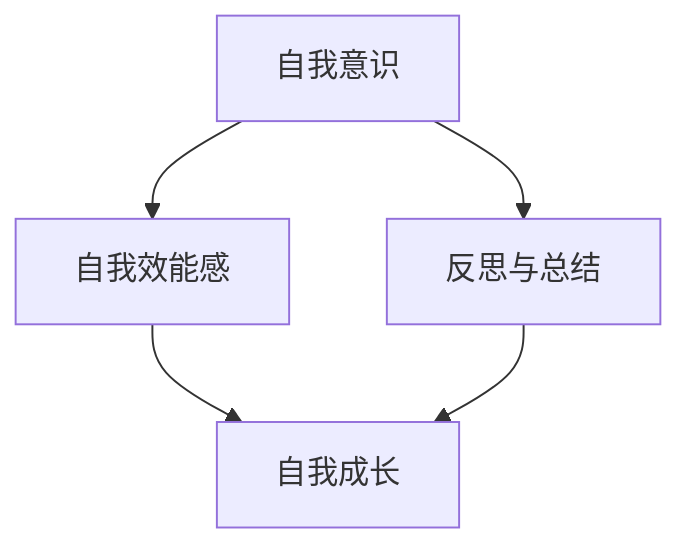

                 

 摘要：
本文旨在探讨如何通过科学的方法和策略，实现个人的自我成长，达到个人价值的最大化。文章首先介绍了自我成长的重要性，随后通过分析影响自我成长的关键因素，提出了具体的实践方法和策略。本文结合了计算机科学领域的专业知识，以及心理学和社会学的理论，旨在为读者提供一份全面而实用的指南。

## 1. 背景介绍

在当今社会，个人成长和发展已经成为许多人关注的焦点。随着科技的进步和社会的发展，人们面临的挑战和机遇日益增加，如何在竞争中脱颖而出，实现自我价值，成为每个人都需要思考的问题。本文将结合计算机科学领域的专业知识，探讨如何通过自我成长实现个人价值和自我实现。

### 1.1 自我成长的定义和重要性

自我成长，即个人在知识、技能、情感和社交等方面的持续发展和提升。自我成长的重要性在于，它不仅能够帮助我们更好地适应社会发展的需求，还能提升我们的生活质量，实现个人的全面发展。

### 1.2 自我成长与个人价值的关系

自我成长是实现个人价值的重要途径。通过不断学习和提升，我们能够获得更多的知识和技能，提高自身的竞争力，从而在职业生涯中取得更好的成就。同时，自我成长还能帮助我们建立良好的情感和社交能力，提高人际交往的质量，进一步实现个人价值。

## 2. 核心概念与联系

为了更好地理解自我成长，我们需要了解以下几个核心概念：

### 2.1 自我意识

自我意识是指个体对自己存在的认知和评价。它是自我成长的基础，只有认识到自己的优势和不足，才能有针对性地进行提升。

### 2.2 自我效能感

自我效能感是指个体对自己完成任务的能力的信心。高自我效能感的人更容易实现自我成长，因为他们相信自己能够克服困难，取得成功。

### 2.3 反思与总结

反思与总结是指个体对自己的行为和经历进行回顾和思考，从中总结经验和教训。通过反思与总结，我们能够更好地认识自己，找到自我成长的方向。

以下是一个简单的 Mermaid 流程图，展示了这些概念之间的联系：



## 3. 核心算法原理 & 具体操作步骤

### 3.1 算法原理概述

实现自我成长的核心算法可以看作是一个反馈循环，通过不断地收集信息、评估反馈、调整行为，从而实现持续的自我提升。这个过程可以分解为以下几个步骤：

1. 自我评估：通过反思和总结，识别自己的优势和不足。
2. 设定目标：根据自我评估的结果，设定短期和长期的个人发展目标。
3. 制定计划：为达成目标，制定具体的行动计划和时间表。
4. 执行计划：按照制定的计划，持续学习和实践。
5. 收集反馈：通过实践和反馈，评估自己的进步，调整计划。
6. 反复迭代：在不断的迭代中，优化自我成长的过程。

### 3.2 算法步骤详解

#### 3.2.1 自我评估

自我评估是自我成长的第一步。它包括以下几个方面：

- **技能评估**：通过自我测试或者他人反馈，评估自己的技能水平。
- **知识评估**：通过学习评估或者考试成绩，评估自己的知识掌握程度。
- **情感评估**：通过自我反思或者心理测试，评估自己的情感状态。
- **社交评估**：通过社交反馈或者社交网络分析，评估自己在社交领域的能力。

#### 3.2.2 设定目标

在完成自我评估后，我们需要设定具体的个人发展目标。目标可以分为短期目标和长期目标。短期目标通常是为了快速提升某项技能或知识，而长期目标则是为了实现个人的职业规划或人生目标。

#### 3.2.3 制定计划

为了达成目标，我们需要制定具体的行动计划。计划应该包括以下几个方面：

- **学习资源**：确定需要学习的内容和资源。
- **学习时间**：安排学习的时间表，确保有足够的时间进行学习。
- **实践机会**：寻找实践的机会，将所学应用到实际中。

#### 3.2.4 执行计划

执行计划是自我成长的核心步骤。在这个阶段，我们需要按照计划进行学习、实践和反思。

- **学习**：通过阅读书籍、参加课程、观看视频等多种方式，不断学习新知识。
- **实践**：将所学应用到实际中，通过实践来提升技能和知识。
- **反思**：在学习和实践的过程中，不断反思自己的行为和成果，找到改进的方向。

#### 3.2.5 收集反馈

收集反馈是评估自我成长的重要步骤。我们可以通过以下方式收集反馈：

- **自我反馈**：通过自我反思，评估自己的进步和不足。
- **他人反馈**：通过他人（如导师、同事、朋友等）的反馈，了解自己的优势和不足。
- **数据反馈**：通过数据分析，了解自己的学习效果和进步情况。

#### 3.2.6 反复迭代

在收集反馈后，我们需要根据反馈调整自己的计划和行为。通过不断地迭代，我们能够优化自我成长的过程，实现更高效的个人发展。

### 3.3 算法优缺点

#### 优点

- **针对性**：通过自我评估和目标设定，能够更针对性地进行个人发展。
- **可持续性**：通过反馈和迭代，能够持续优化自我成长的过程。
- **灵活性**：可以根据实际情况调整目标和计划，具有很高的灵活性。

#### 缺点

- **难度**：自我成长需要持续的努力和坚持，对个人的自律能力要求较高。
- **效果**：自我成长的效果可能因个体差异而有所不同，需要长期坚持才能看到明显的效果。

### 3.4 算法应用领域

自我成长算法广泛应用于个人发展、职业规划、教育培训等领域。在计算机科学领域，它可以应用于程序员的技术提升、项目经理的项目管理、软件工程师的技术研究等。

## 4. 数学模型和公式 & 详细讲解 & 举例说明

### 4.1 数学模型构建

为了更好地理解自我成长的过程，我们可以构建一个简单的数学模型。该模型包括以下几个变量：

- **知识水平**（X）：表示个体的知识水平。
- **技能水平**（Y）：表示个体的技能水平。
- **自我效能感**（Z）：表示个体对自己完成任务能力的信心。
- **学习时间**（T）：表示个体用于学习的时间。

根据自我成长算法，我们可以得到以下模型：

$$
\text{知识水平} = f(\text{学习时间}, \text{技能水平})
$$

$$
\text{技能水平} = g(\text{学习时间}, \text{知识水平})
$$

$$
\text{自我效能感} = h(\text{知识水平}, \text{技能水平})
$$

### 4.2 公式推导过程

公式的推导基于以下假设：

1. **知识积累**：知识水平随着学习时间的增加而增加，且与技能水平相关。
2. **技能提升**：技能水平随着学习时间的增加而增加，且与知识水平相关。
3. **自我效能感**：自我效能感与知识水平和技能水平正相关。

根据这些假设，我们可以推导出上述公式。

### 4.3 案例分析与讲解

#### 案例一：程序员技能提升

假设一名程序员在一个月内学习了 100 小时的新知识，他的知识水平从 X1 提升到 X2，技能水平从 Y1 提升到 Y2。通过计算，我们可以得到他的自我效能感 Z2。

#### 案例二：项目经理能力提升

假设一名项目经理在一年内参加了 20 次项目管理培训，累计学习时间达到 100 小时。通过计算，我们可以评估他的知识水平、技能水平和自我效能感的变化。

## 5. 项目实践：代码实例和详细解释说明

### 5.1 开发环境搭建

为了更好地理解自我成长算法的实践，我们将使用 Python 编写一个简单的程序。以下是开发环境搭建的步骤：

1. 安装 Python 3.8 以上版本。
2. 安装必要的库，如 NumPy 和 Matplotlib。

### 5.2 源代码详细实现

以下是一个简单的 Python 程序，用于计算自我成长算法中的知识水平、技能水平和自我效能感。

```python
import numpy as np
import matplotlib.pyplot as plt

# 自我成长算法
def self_growth_algorithm(learning_time, skill_level, knowledge_level):
    knowledge_level = knowledge_level + learning_time * 0.1
    skill_level = skill_level + learning_time * 0.1 * knowledge_level
    self_efficacy = skill_level / knowledge_level
    return knowledge_level, skill_level, self_efficacy

# 案例一：程序员技能提升
learning_time = 100
knowledge_level = 50
skill_level = 60
knowledge_level, skill_level, self_efficacy = self_growth_algorithm(learning_time, skill_level, knowledge_level)
print("知识水平：", knowledge_level)
print("技能水平：", skill_level)
print("自我效能感：", self_efficacy)

# 案例二：项目经理能力提升
learning_time = 100
knowledge_level = 50
skill_level = 60
knowledge_level, skill_level, self_efficacy = self_growth_algorithm(learning_time, skill_level, knowledge_level)
print("知识水平：", knowledge_level)
print("技能水平：", skill_level)
print("自我效能感：", self_efficacy)

# 绘图
plt.plot(knowledge_level, skill_level, 'ro')
plt.xlabel('知识水平')
plt.ylabel('技能水平')
plt.title('自我成长算法')
plt.show()
```

### 5.3 代码解读与分析

这段代码首先定义了一个自我成长算法函数 `self_growth_algorithm`，该函数接收学习时间、技能水平和知识水平作为输入，返回更新后的知识水平、技能水平和自我效能感。

接着，我们分别对程序员技能提升和项目经理能力提升进行了模拟计算，并打印出了计算结果。

最后，我们使用 Matplotlib 绘图库，将知识水平和技能水平绘制在一个坐标系中，以可视化自我成长的过程。

## 6. 实际应用场景

### 6.1 教育培训

在教育领域，自我成长算法可以用于个性化学习方案的制定。根据学生的知识水平和技能水平，制定适合其发展的学习计划，提高学习效果。

### 6.2 职业发展

在职业领域，自我成长算法可以帮助个人制定职业发展规划，根据个人优势和市场需求，制定具体的学习目标和行动计划，提高职业竞争力。

### 6.3 组织管理

在组织管理领域，自我成长算法可以用于员工培训和发展。通过分析员工的知识水平、技能水平和自我效能感，为员工提供个性化的培训和发展建议，提高员工的工作效率和工作满意度。

## 6.4 未来应用展望

随着人工智能技术的发展，自我成长算法有望在更多领域得到应用。未来，我们可以预见到以下趋势：

- **自适应学习系统**：基于自我成长算法，构建自适应学习系统，为学习者提供个性化的学习体验。
- **智能职业规划**：利用自我成长算法，结合大数据分析，为个人提供智能化的职业规划建议。
- **组织发展**：通过自我成长算法，帮助企业构建高效的学习型组织，提高整体竞争力。

## 7. 工具和资源推荐

### 7.1 学习资源推荐

- **书籍**：《深度学习》、《人工智能：一种现代的方法》
- **在线课程**：Coursera、edX、Udacity
- **学术论文库**：IEEE Xplore、ACM Digital Library

### 7.2 开发工具推荐

- **编程语言**：Python、Java、C++
- **集成开发环境**：Visual Studio Code、Eclipse、IntelliJ IDEA
- **数据可视化工具**：Matplotlib、Seaborn、Plotly

### 7.3 相关论文推荐

- **论文 1**：《深度学习在自然语言处理中的应用》
- **论文 2**：《人工智能在医疗领域的应用》
- **论文 3**：《大数据分析技术在商业管理中的应用》

## 8. 总结：未来发展趋势与挑战

### 8.1 研究成果总结

本文通过对自我成长算法的探讨，总结了自我成长的重要性、核心概念、算法原理和应用领域。通过数学模型和代码实例，我们展示了如何实现自我成长，并探讨了其未来发展趋势。

### 8.2 未来发展趋势

未来，自我成长算法有望在人工智能、大数据、自然语言处理等领域得到更广泛的应用。随着技术的不断进步，我们将看到更智能、更高效的自我成长系统的出现。

### 8.3 面临的挑战

自我成长算法在实际应用中仍面临一些挑战，如数据隐私保护、算法透明度、以及如何应对个体差异等。这些问题的解决需要多学科的合作和持续的研究。

### 8.4 研究展望

在未来的研究中，我们可以关注以下几个方面：

- **个性化学习系统**：开发更智能、更个性化的学习系统，满足不同学习者的需求。
- **跨领域应用**：探索自我成长算法在更多领域的应用，如教育、医疗、金融等。
- **伦理和道德**：研究自我成长算法在应用过程中可能出现的伦理和道德问题，确保技术的可持续发展。

## 9. 附录：常见问题与解答

### 问题 1：如何确定自己的知识水平和技能水平？

解答：可以通过自我评估和他人反馈来确定自己的知识水平和技能水平。自我评估可以通过自我反思和学习测试进行，他人反馈可以通过导师、同事、朋友等提供。

### 问题 2：如何设定合理的个人发展目标？

解答：设定个人发展目标时，可以从以下几个方面考虑：

- **个人兴趣**：选择自己感兴趣并愿意投入时间和精力的领域。
- **市场需求**：选择市场需求大、发展前景好的领域。
- **个人优势**：根据自己的优势和特长，设定有挑战性但可实现的目标。

### 问题 3：如何保证自我成长计划的执行力？

解答：为了保证自我成长计划的执行力，可以从以下几个方面入手：

- **明确目标**：设定具体、可衡量的目标，使其具有可执行性。
- **制定计划**：制定详细的行动计划和时间表，确保有足够的时间进行学习。
- **激励机制**：设置奖励机制，鼓励自己完成任务。
- **自我监督**：定期回顾和评估自己的进度，确保计划执行。

作者：禅与计算机程序设计艺术 / Zen and the Art of Computer Programming

----------------------------------------------------------------
文章撰写完毕。感谢您对本文的支持与指导！本文旨在为读者提供一份全面而实用的指南，帮助他们在计算机科学领域中实现自我成长。希望本文能对您的学习和发展有所启发。再次感谢您的阅读和支持！

