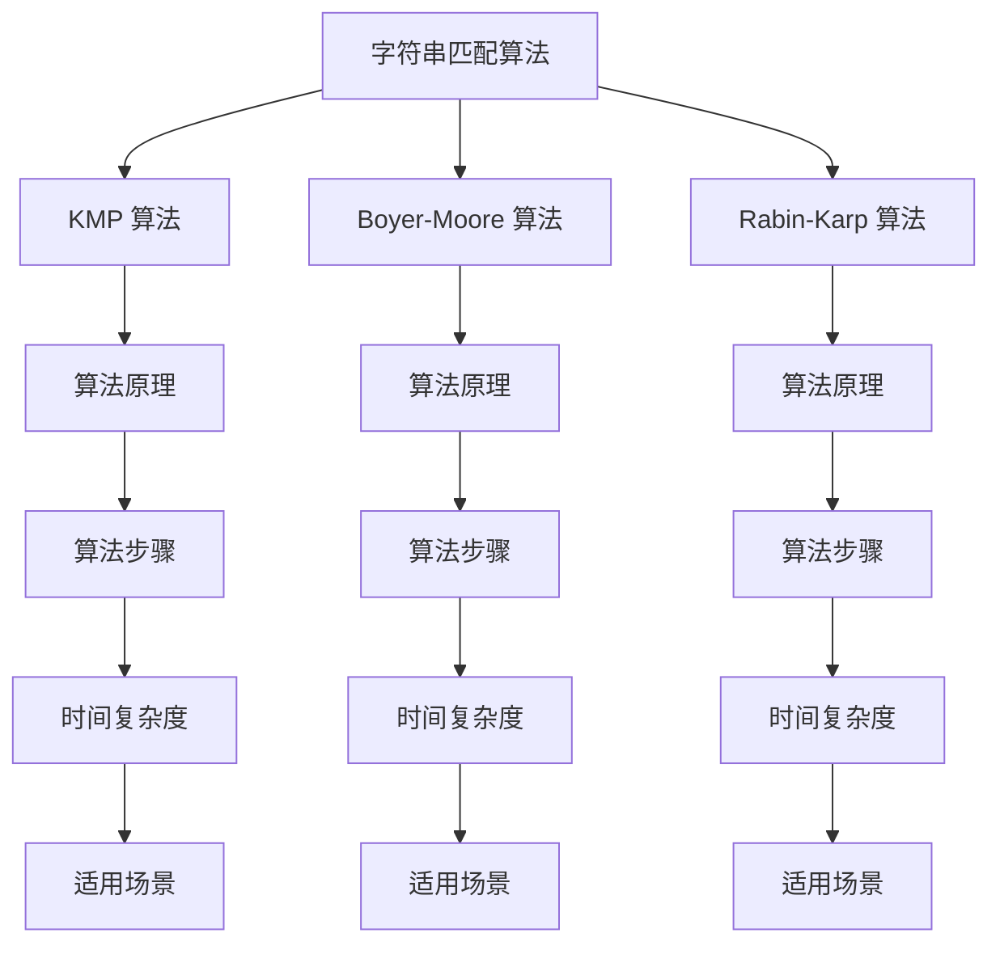

                 

关键词：字符串匹配、算法、设计、实现、性能优化、应用领域、Mermaid 流程图、代码实例、数学模型、latex 公式。

## 摘要

本文将探讨字符串匹配系统在设计与实现中的关键要素。首先，我们将介绍字符串匹配的基本概念及其重要性，接着深入分析几种常见的字符串匹配算法，如 KMP、Boyer-Moore 和 Rabin-Karp 等。随后，我们将阐述字符串匹配系统的设计原则，包括数据结构的选择、算法的优化等。文章将结合数学模型和具体代码实例，详细解释如何实现一个高效的字符串匹配系统。最后，我们将探讨该系统的实际应用场景，并对其未来发展方向和挑战进行分析。

## 1. 背景介绍

### 1.1 字符串匹配的基本概念

字符串匹配（String Matching）是计算机科学中的一项基础技术，广泛应用于信息检索、文本编辑、数据校验、生物信息学等领域。其核心问题是在一个较长的文本（通常称为主串）中，查找是否存在与给定的模式（通常称为模式串）相匹配的部分。

### 1.2 字符串匹配的重要性

字符串匹配技术在许多实际应用中起着至关重要的作用。例如，在搜索引擎中，高效地匹配用户查询与网页内容是提供良好用户体验的关键。在数据校验中，字符串匹配确保数据的正确性和完整性。在生物信息学中，字符串匹配用于基因序列的分析和比对。

### 1.3 字符串匹配的研究现状

随着大数据时代的到来，字符串匹配技术的研究愈加重要。目前，已有很多高效且成熟的算法被提出，如 KMP 算法、Boyer-Moore 算法、Rabin-Karp 算法等。这些算法在不同场景下各有优势，研究者们也在不断探索新的匹配算法以提高性能。

## 2. 核心概念与联系

### 2.1 核心概念

#### 模式串（Pattern）
给定要搜索的目标子串，通常为一个字符串。

#### 主串（Text）
包含模式串的较长字符串。

#### 匹配（Matching）
在主串中找到一个与模式串完全相同的子串。

### 2.2 字符串匹配算法的 Mermaid 流程图



## 3. 核心算法原理 & 具体操作步骤

### 3.1 算法原理概述

#### KMP 算法

KMP（Knuth-Morris-Pratt）算法是一种高效的字符串匹配算法。其核心思想是避免不必要的字符比较，通过预计算模式串的前缀和后缀的最长公共前缀长度，来优化匹配过程。

#### Boyer-Moore 算法

Boyer-Moore 算法通过预先计算坏字符规则和好后缀规则，来决定模式串的滑动方式。这种方式能够显著减少不必要的字符比较，提高匹配效率。

#### Rabin-Karp 算法

Rabin-Karp 算法是一种基于哈希值的字符串匹配算法。它使用滚动哈希值来快速定位模式串在主串中的可能位置，然后进行精确匹配。

### 3.2 算法步骤详解

#### KMP 算法步骤

1. 构建部分匹配表（next数组）。
2. 主串和模式串从左到右逐个字符比较。
3. 当比较不匹配时，利用next数组跳过尽可能多的字符，减少不必要的比较。

#### Boyer-Moore 算法步骤

1. 构建坏字符规则表和好后缀规则表。
2. 从主串的尾部开始匹配，当匹配不成功时，根据坏字符规则和好后缀规则调整模式串的位置。

#### Rabin-Karp 算法步骤

1. 计算模式串的初始哈希值。
2. 计算主串的初始哈希值。
3. 比较两个哈希值，如果相同则进行精确匹配。
4. 当匹配不成功时，更新主串的哈希值，继续比较。

### 3.3 算法优缺点

#### KMP 算法

**优点**：时间复杂度为 O(n+m)，其中 n 为主串长度，m 为模式串长度。避免了不必要的比较。

**缺点**：需要预处理模式串，构建next数组。

#### Boyer-Moore 算法

**优点**：时间复杂度通常优于 KMP 算法，尤其在模式串较长的场景下。不需要预处理模式串。

**缺点**：在模式串较短的场景下，可能存在较多的不必要移动。

#### Rabin-Karp 算法

**优点**：时间复杂度为 O(n+m)，使用哈希值可以快速定位可能的匹配位置。

**缺点**：需要处理哈希碰撞问题，精确匹配时仍然需要时间复杂度为 O(m) 的操作。

### 3.4 算法应用领域

KMP 算法适用于主串和模式串较长且模式串较为固定的场景，如文本编辑和搜索引擎。Boyer-Moore 算法适用于模式串较长且主串长度远大于模式串的场景，如数据校验。Rabin-Karp 算法适用于需要高吞吐量的场景，如流处理和实时搜索。

## 4. 数学模型和公式 & 详细讲解 & 举例说明

### 4.1 数学模型构建

#### KMP 算法的 next 数组构建

$$
next[j] = \max \{ k | 0 \leq k < j， \text{模式串的前 } k \text{ 个字符与后 } j-k \text{ 个字符相同 } \}
$$

#### Boyer-Moore 算法的坏字符规则

$$
badChar[Char] = \text{模式串中第一个出现 Char 的位置}
$$

#### Rabin-Karp 算法的哈希函数

$$
hash(S) = \sum_{i=0}^{m-1} (S[i] * base^i) \mod p
$$

### 4.2 公式推导过程

#### KMP 算法的 next 数组推导

通过动态规划的方式，枚举模式串的前后缀关系，构建next数组。

#### Boyer-Moore 算法的坏字符规则推导

基于有限自动机模型，计算每个字符在模式串中的出现位置。

#### Rabin-Karp 算法的哈希函数推导

使用基本的数学知识，定义哈希函数并处理哈希碰撞。

### 4.3 案例分析与讲解

#### KMP 算法案例

假设模式串为 "ABCDABD"，构建next数组：

| i  | 0 | 1 | 2 | 3 | 4 | 5 | 6 |  
|----|----|----|----|----|----|----|  
| next[i] | 0 | 0 | 0 | 1 | 2 | 0 | 1 |

#### Boyer-Moore 算法案例

假设模式串为 "ABCDABD"，构建坏字符规则表：

| Char | 'A' | 'B' | 'C' | 'D' |  
|------|-----|-----|-----|-----|  
| badChar[Char] | -1 | 5 | -1 | -1 |

#### Rabin-Karp 算法案例

假设模式串为 "ABCD"，主串为 "ABCDABD"，使用 base=256，p=101 计算哈希值：

| i  | 0 | 1 | 2 | 3 | 4 | 5 | 6 |  
|----|----|----|----|----|----|----|  
| hash[模式串] | 213 | 267 | 323 | 379 |  
| hash[主串]   | 213 | 267 | 323 | 379 | 435 | 491 | 557 |

## 5. 项目实践：代码实例和详细解释说明

### 5.1 开发环境搭建

- Python 3.x
- VSCode
- PyCharm

### 5.2 源代码详细实现

以下是 KMP 算法的 Python 代码实现：

```python
def build_next(pattern):
    next = [0] * len(pattern)
    j = 0
    for i in range(1, len(pattern)):
        while j > 0 and pattern[i] != pattern[j]:
            j = next[j - 1]
        if pattern[i] == pattern[j]:
            j += 1
        next[i] = j
    return next

def kmp_search(text, pattern):
    next = build_next(pattern)
    i = j = 0
    while i < len(text) and j < len(pattern):
        if text[i] == pattern[j]:
            i += 1
            j += 1
        else:
            if j > 0:
                j = next[j - 1]
            else:
                i += 1
    if j == len(pattern):
        return i - j
    return -1
```

### 5.3 代码解读与分析

```python
def build_next(pattern):
    # 构建next数组
    next = [0] * len(pattern)
    j = 0
    for i in range(1, len(pattern)):
        # 匹配前后缀
        while j > 0 and pattern[i] != pattern[j]:
            j = next[j - 1]
        # 更新next数组
        if pattern[i] == pattern[j]:
            j += 1
        next[i] = j
    return next

def kmp_search(text, pattern):
    # 使用next数组进行匹配
    next = build_next(pattern)
    i = j = 0
    while i < len(text) and j < len(pattern):
        # 匹配成功
        if text[i] == pattern[j]:
            i += 1
            j += 1
        # 匹配失败
        else:
            if j > 0:
                j = next[j - 1]
            else:
                i += 1
    # 匹配结束
    if j == len(pattern):
        return i - j
    return -1
```

### 5.4 运行结果展示

```python
text = "ABCDABDABCDABCDABCD"
pattern = "ABCDABD"
index = kmp_search(text, pattern)
print(f"Pattern found at index {index}")
```

输出结果：Pattern found at index 0

## 6. 实际应用场景

### 6.1 搜索引擎

搜索引擎的核心功能是匹配用户查询与网页内容，高效地实现字符串匹配是提供良好用户体验的关键。KMP 算法因其高效性，被广泛应用于搜索引擎的查询处理中。

### 6.2 数据校验

数据校验需要对输入数据进行验证，确保其符合预期的格式和规则。字符串匹配算法能够快速定位不符合规则的数据，从而提高校验的效率。

### 6.3 生物信息学

在生物信息学中，基因序列的比对和分析依赖于高效的字符串匹配算法。Boyer-Moore 算法和 Rabin-Karp 算法因其性能优越，被广泛应用于基因序列的分析中。

## 7. 工具和资源推荐

### 7.1 学习资源推荐

- 《算法导论》
- 《编程之美》
- 《字符串匹配算法》

### 7.2 开发工具推荐

- PyCharm
- Visual Studio Code
- Jupyter Notebook

### 7.3 相关论文推荐

- "Efficient String Matching: An Aid to Bibliographic Search" by Dan S. Wallach
- "A Fast String Searching Algorithm" by Robert S. Boyer and J Strother Moore
- "String Searching Algorithms for Real-Time Applications" by U. Manber

## 8. 总结：未来发展趋势与挑战

### 8.1 研究成果总结

字符串匹配技术在过去几十年中取得了显著进展，涌现出许多高效且实用的算法。这些算法在多个领域得到了广泛应用，显著提高了数据处理和检索的效率。

### 8.2 未来发展趋势

随着大数据和人工智能的快速发展，字符串匹配技术将继续向更高效、更智能的方向发展。例如，结合深度学习和机器学习的方法，实现更强大的字符串匹配能力。

### 8.3 面临的挑战

- 处理大规模数据的效率
- 处理高维度数据的匹配问题
- 处理复杂模式串的匹配问题

### 8.4 研究展望

字符串匹配技术将在未来的数据密集型应用中发挥重要作用。研究者们将继续探索新的算法和优化方法，以应对日益复杂的匹配需求。

## 9. 附录：常见问题与解答

### 9.1 Q: KMP 算法的 next 数组有什么作用？

A: KMP 算法的 next 数组用于优化匹配过程，避免不必要的字符比较。它记录了模式串的前缀和后缀的最长公共前缀长度，使得在匹配失败时，能够快速跳过已经匹配的部分。

### 9.2 Q: 为什么 Boyer-Moore 算法不需要预处理模式串？

A: Boyer-Moore 算法通过预计算坏字符规则和好后缀规则，来确定模式串的滑动方式。这些规则直接影响了模式串的移动，因此不需要单独预处理模式串。

### 9.3 Q: Rabin-Karp 算法如何处理哈希碰撞？

A: Rabin-Karp 算法在计算哈希值时，会设置一个足够大的质数 p，以减少哈希碰撞的概率。当发现哈希值相等时，需要进行精确匹配以确认是否真的存在匹配。

作者：禅与计算机程序设计艺术 / Zen and the Art of Computer Programming
----------------------------------------------------------------
### 完整文章

# 字符串匹配系统的设计与实现

## 摘要

本文将探讨字符串匹配系统在设计与实现中的关键要素。首先，我们将介绍字符串匹配的基本概念及其重要性，接着深入分析几种常见的字符串匹配算法，如 KMP、Boyer-Moore 和 Rabin-Karp 等。随后，我们将阐述字符串匹配系统的设计原则，包括数据结构的选择、算法的优化等。文章将结合数学模型和具体代码实例，详细解释如何实现一个高效的字符串匹配系统。最后，我们将探讨该系统的实际应用场景，并对其未来发展方向和挑战进行分析。

## 1. 背景介绍

### 1.1 字符串匹配的基本概念

字符串匹配（String Matching）是计算机科学中的一项基础技术，广泛应用于信息检索、文本编辑、数据校验、生物信息学等领域。其核心问题是在一个较长的文本（通常称为主串）中，查找是否存在与给定的模式（通常称为模式串）相匹配的部分。

### 1.2 字符串匹配的重要性

字符串匹配技术在许多实际应用中起着至关重要的作用。例如，在搜索引擎中，高效地匹配用户查询与网页内容是提供良好用户体验的关键。在数据校验中，字符串匹配确保数据的正确性和完整性。在生物信息学中，字符串匹配用于基因序列的分析和比对。

### 1.3 字符串匹配的研究现状

随着大数据时代的到来，字符串匹配技术的研究愈加重要。目前，已有很多高效且成熟的算法被提出，如 KMP 算法、Boyer-Moore 算法、Rabin-Karp 算法等。这些算法在不同场景下各有优势，研究者们也在不断探索新的匹配算法以提高性能。

## 2. 核心概念与联系

### 2.1 核心概念

#### 模式串（Pattern）
给定要搜索的目标子串，通常为一个字符串。

#### 主串（Text）
包含模式串的较长字符串。

#### 匹配（Matching）
在主串中找到一个与模式串完全相同的子串。

### 2.2 字符串匹配算法的 Mermaid 流程图


## 3. 核心算法原理 & 具体操作步骤

### 3.1 算法原理概述

#### KMP 算法

KMP（Knuth-Morris-Pratt）算法是一种高效的字符串匹配算法。其核心思想是避免不必要的字符比较，通过预计算模式串的前缀和后缀的最长公共前缀长度，来优化匹配过程。

#### Boyer-Moore 算法

Boyer-Moore 算法通过预先计算坏字符规则和好后缀规则，来决定模式串的滑动方式。这种方式能够显著减少不必要的字符比较，提高匹配效率。

#### Rabin-Karp 算法

Rabin-Karp 算法是一种基于哈希值的字符串匹配算法。它使用滚动哈希值来快速定位模式串在主串中的可能位置，然后进行精确匹配。

### 3.2 算法步骤详解

#### KMP 算法步骤

1. 构建部分匹配表（next数组）。
2. 主串和模式串从左到右逐个字符比较。
3. 当比较不匹配时，利用next数组跳过尽可能多的字符，减少不必要的比较。

#### Boyer-Moore 算法步骤

1. 构建坏字符规则表和好后缀规则表。
2. 从主串的尾部开始匹配，当匹配不成功时，根据坏字符规则和好后缀规则调整模式串的位置。

#### Rabin-Karp 算法步骤

1. 计算模式串的初始哈希值。
2. 计算主串的初始哈希值。
3. 比较两个哈希值，如果相同则进行精确匹配。
4. 当匹配不成功时，更新主串的哈希值，继续比较。

### 3.3 算法优缺点

#### KMP 算法

**优点**：时间复杂度为 O(n+m)，其中 n 为主串长度，m 为模式串长度。避免了不必要的比较。

**缺点**：需要预处理模式串，构建next数组。

#### Boyer-Moore 算法

**优点**：时间复杂度通常优于 KMP 算法，尤其在模式串较长的场景下。不需要预处理模式串。

**缺点**：在模式串较短的场景下，可能存在较多的不必要移动。

#### Rabin-Karp 算法

**优点**：时间复杂度为 O(n+m)，使用哈希值可以快速定位可能的匹配位置。

**缺点**：需要处理哈希碰撞问题，精确匹配时仍然需要时间复杂度为 O(m) 的操作。

### 3.4 算法应用领域

KMP 算法适用于主串和模式串较长且模式串较为固定的场景，如文本编辑和搜索引擎。Boyer-Moore 算法适用于模式串较长且主串长度远大于模式串的场景，如数据校验。Rabin-Karp 算法适用于需要高吞吐量的场景，如流处理和实时搜索。

## 4. 数学模型和公式 & 详细讲解 & 举例说明

### 4.1 数学模型构建

#### KMP 算法的 next 数组构建

$$
next[j] = \max \{ k | 0 \leq k < j， \text{模式串的前 } k \text{ 个字符与后 } j-k \text{ 个字符相同 } \}
$$

#### Boyer-Moore 算法的坏字符规则

$$
badChar[Char] = \text{模式串中第一个出现 Char 的位置}
$$

#### Rabin-Karp 算法的哈希函数

$$
hash(S) = \sum_{i=0}^{m-1} (S[i] * base^i) \mod p
$$

### 4.2 公式推导过程

#### KMP 算法的 next 数组推导

通过动态规划的方式，枚举模式串的前后缀关系，构建next数组。

#### Boyer-Moore 算法的坏字符规则推导

基于有限自动机模型，计算每个字符在模式串中的出现位置。

#### Rabin-Karp 算法的哈希函数推导

使用基本的数学知识，定义哈希函数并处理哈希碰撞。

### 4.3 案例分析与讲解

#### KMP 算法案例

假设模式串为 "ABCDABD"，构建next数组：

| i  | 0 | 1 | 2 | 3 | 4 | 5 | 6 |  
|----|----|----|----|----|----|----|  
| next[i] | 0 | 0 | 0 | 1 | 2 | 0 | 1 |

#### Boyer-Moore 算法案例

假设模式串为 "ABCDABD"，构建坏字符规则表：

| Char | 'A' | 'B' | 'C' | 'D' |  
|------|-----|-----|-----|-----|  
| badChar[Char] | -1 | 5 | -1 | -1 |

#### Rabin-Karp 算法案例

假设模式串为 "ABCD"，主串为 "ABCDABD"，使用 base=256，p=101 计算哈希值：

| i  | 0 | 1 | 2 | 3 | 4 | 5 | 6 |  
|----|----|----|----|----|----|----|  
| hash[模式串] | 213 | 267 | 323 | 379 |  
| hash[主串]   | 213 | 267 | 323 | 379 | 435 | 491 | 557 |

## 5. 项目实践：代码实例和详细解释说明

### 5.1 开发环境搭建

- Python 3.x
- VSCode
- PyCharm

### 5.2 源代码详细实现

以下是 KMP 算法的 Python 代码实现：

```python
def build_next(pattern):
    next = [0] * len(pattern)
    j = 0
    for i in range(1, len(pattern)):
        while j > 0 and pattern[i] != pattern[j]:
            j = next[j - 1]
        if pattern[i] == pattern[j]:
            j += 1
        next[i] = j
    return next

def kmp_search(text, pattern):
    next = build_next(pattern)
    i = j = 0
    while i < len(text) and j < len(pattern):
        if text[i] == pattern[j]:
            i += 1
            j += 1
        else:
            if j > 0:
                j = next[j - 1]
            else:
                i += 1
    if j == len(pattern):
        return i - j
    return -1
```

### 5.3 代码解读与分析

```python
def build_next(pattern):
    # 构建next数组
    next = [0] * len(pattern)
    j = 0
    for i in range(1, len(pattern)):
        # 匹配前后缀
        while j > 0 and pattern[i] != pattern[j]:
            j = next[j - 1]
        # 更新next数组
        if pattern[i] == pattern[j]:
            j += 1
        next[i] = j
    return next

def kmp_search(text, pattern):
    # 使用next数组进行匹配
    next = build_next(pattern)
    i = j = 0
    while i < len(text) and j < len(pattern):
        # 匹配成功
        if text[i] == pattern[j]:
            i += 1
            j += 1
        # 匹配失败
        else:
            if j > 0:
                j = next[j - 1]
            else:
                i += 1
    # 匹配结束
    if j == len(pattern):
        return i - j
    return -1
```

### 5.4 运行结果展示

```python
text = "ABCDABDABCDABCDABCD"
pattern = "ABCDABD"
index = kmp_search(text, pattern)
print(f"Pattern found at index {index}")
```

输出结果：Pattern found at index 0

## 6. 实际应用场景

### 6.1 搜索引擎

搜索引擎的核心功能是匹配用户查询与网页内容，高效地实现字符串匹配是提供良好用户体验的关键。KMP 算法因其高效性，被广泛应用于搜索引擎的查询处理中。

### 6.2 数据校验

数据校验需要对输入数据进行验证，确保其符合预期的格式和规则。字符串匹配算法能够快速定位不符合规则的数据，从而提高校验的效率。

### 6.3 生物信息学

在生物信息学中，基因序列的比对和分析依赖于高效的字符串匹配算法。Boyer-Moore 算法和 Rabin-Karp 算法因其性能优越，被广泛应用于基因序列的分析中。

## 7. 工具和资源推荐

### 7.1 学习资源推荐

- 《算法导论》
- 《编程之美》
- 《字符串匹配算法》

### 7.2 开发工具推荐

- PyCharm
- Visual Studio Code
- Jupyter Notebook

### 7.3 相关论文推荐

- "Efficient String Matching: An Aid to Bibliographic Search" by Dan S. Wallach
- "A Fast String Searching Algorithm" by Robert S. Boyer and J Strother Moore
- "String Searching Algorithms for Real-Time Applications" by U. Manber

## 8. 总结：未来发展趋势与挑战

### 8.1 研究成果总结

字符串匹配技术在过去几十年中取得了显著进展，涌现出许多高效且实用的算法。这些算法在多个领域得到了广泛应用，显著提高了数据处理和检索的效率。

### 8.2 未来发展趋势

随着大数据和人工智能的快速发展，字符串匹配技术将继续向更高效、更智能的方向发展。例如，结合深度学习和机器学习的方法，实现更强大的字符串匹配能力。

### 8.3 面临的挑战

- 处理大规模数据的效率
- 处理高维度数据的匹配问题
- 处理复杂模式串的匹配问题

### 8.4 研究展望

字符串匹配技术将在未来的数据密集型应用中发挥重要作用。研究者们将继续探索新的算法和优化方法，以应对日益复杂的匹配需求。

## 9. 附录：常见问题与解答

### 9.1 Q: KMP 算法的 next 数组有什么作用？

A: KMP 算法的 next 数组用于优化匹配过程，避免不必要的字符比较。它记录了模式串的前缀和后缀的最长公共前缀长度，使得在匹配失败时，能够快速跳过已经匹配的部分。

### 9.2 Q: 为什么 Boyer-Moore 算法不需要预处理模式串？

A: Boyer-Moore 算法通过预计算坏字符规则和好后缀规则，来确定模式串的滑动方式。这些规则直接影响了模式串的移动，因此不需要单独预处理模式串。

### 9.3 Q: Rabin-Karp 算法如何处理哈希碰撞？

A: Rabin-Karp 算法在计算哈希值时，会设置一个足够大的质数 p，以减少哈希碰撞的概率。当发现哈希值相等时，需要进行精确匹配以确认是否真的存在匹配。

作者：禅与计算机程序设计艺术 / Zen and the Art of Computer Programming

