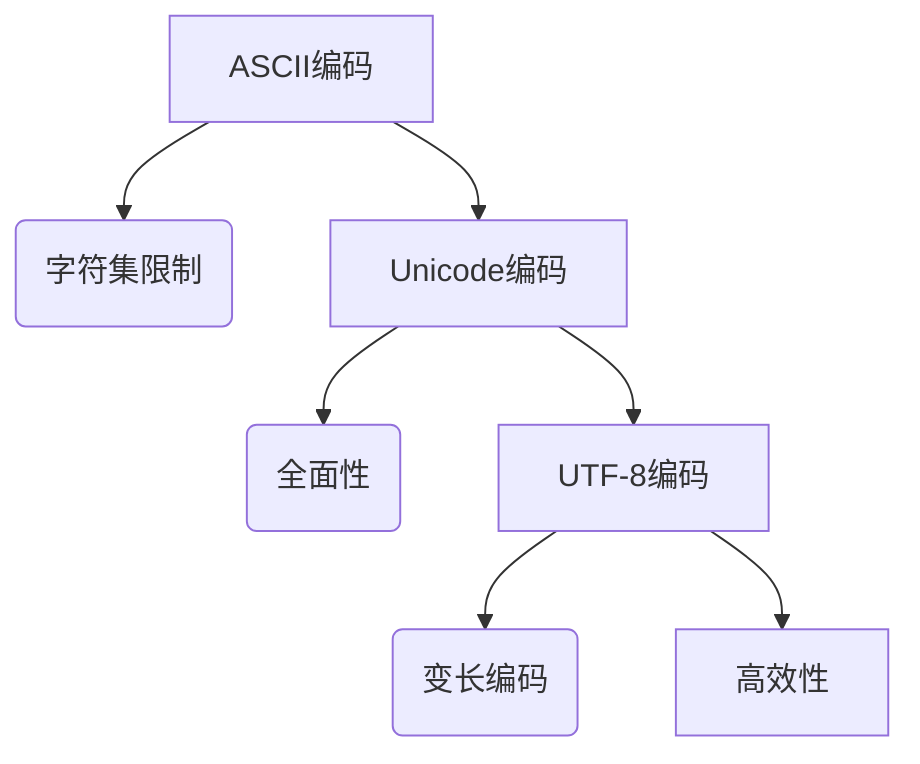

                 

关键词：字符编码、ASCII、Unicode、UTF-8、字符串处理、编程语言、数据存储、跨平台兼容性、国际化

> 摘要：本文旨在深入探讨字符编码的背景知识，重点分析ASCII、Unicode和UTF-8三种编码标准。我们将理解它们的核心概念、历史背景、技术细节及其在现实世界中的应用。通过这篇文章，读者将掌握字符编码的要点，为深入研究和应用奠定坚实基础。

## 1. 背景介绍

### 字符编码的起源

字符编码的历史可以追溯到20世纪早期，当时的计算机硬件非常有限，内存和存储空间都很宝贵。为了节约资源，人们开始探讨如何高效地存储和传输文本信息。最初的字符编码系统是ASCII（美国信息交换标准代码），它于1963年发布，旨在统一不同计算机系统之间的文本表示。

### 字符编码的需求

随着计算机技术的发展，计算机的应用领域不断扩大，文本处理的需求也越来越复杂。早期的计算机系统主要处理英文文本，因此ASCII编码能够满足这一需求。然而，随着全球化的发展，越来越多的计算机系统需要处理多种语言，包括非拉丁字母文字，如中文、日文、阿拉伯文等。这促使了更复杂的字符编码系统的出现。

## 2. 核心概念与联系

### ASCII编码

ASCII编码是基于7位二进制编码的系统，可以表示128个字符。其中包括英文字母（大小写）、数字、标点符号以及一些控制字符。ASCII编码的字符集相对较小，无法表示所有的字符，尤其是在处理非拉丁字母文字时存在明显的局限性。

### Unicode编码

Unicode编码是一个更加全面的字符编码系统，旨在统一表示世界上所有的文字。Unicode采用16位编码，可以表示超过100,000个字符，包括拉丁字母、希腊字母、阿拉伯数字、汉字等。Unicode的出现解决了ASCII编码的局限性，但它的编码效率相对较低。

### UTF-8编码

UTF-8（Unicode转换格式-8位）是Unicode的一种变长编码方案，可以适应不同大小的字符。UTF-8编码使用1到4个字节来表示一个字符，根据字符的不同而动态调整字节数。这种设计既保证了编码的兼容性，又提高了效率。

### Mermaid流程图

以下是一个Mermaid流程图，展示了ASCII、Unicode和UTF-8编码的核心概念及其相互关系：



## 3. 核心算法原理 & 具体操作步骤

### 3.1 算法原理概述

字符编码的核心算法是将字符映射为二进制序列，以便在计算机系统中存储和传输。ASCII编码采用固定的7位二进制序列，Unicode编码使用可变的16位二进制序列，而UTF-8编码根据字符的不同动态调整字节数。

### 3.2 算法步骤详解

- **ASCII编码**：将英文字符映射为7位二进制序列。
- **Unicode编码**：将字符映射为16位二进制序列。
- **UTF-8编码**：
  - 若字符为基本拉丁字母，使用1个字节编码。
  - 若字符为其他字符，根据字符的Unicode值动态调整字节数。

### 3.3 算法优缺点

- **ASCII编码**：
  - 优点：简单、易于实现、兼容性好。
  - 缺点：字符集有限，无法表示非拉丁字母文字。
- **Unicode编码**：
  - 优点：字符集全面，支持多种语言。
  - 缺点：编码效率低，占用空间大。
- **UTF-8编码**：
  - 优点：兼容ASCII编码，高效、灵活。
  - 缺点：编码规则复杂，解析可能存在歧义。

### 3.4 算法应用领域

- **ASCII编码**：主要用于英文文本处理，如命令行界面、基本文本文件等。
- **Unicode编码**：广泛应用于多语言处理，如Web应用、电子文档等。
- **UTF-8编码**：广泛用于互联网通信、数据存储和跨平台文本处理。

## 4. 数学模型和公式 & 详细讲解 & 举例说明

### 4.1 数学模型构建

字符编码的核心在于将字符映射为二进制序列。对于不同的编码系统，映射方式有所不同。以下是几种常见编码系统的数学模型：

- **ASCII编码**：字符`A`到二进制`01000001`的映射。
- **Unicode编码**：字符`A`到二进制`0061`的映射。
- **UTF-8编码**：字符`A`到二进制`01000001`的映射。

### 4.2 公式推导过程

- **ASCII编码**：`字符` → `7位二进制序列`
- **Unicode编码**：`字符` → `16位二进制序列`
- **UTF-8编码**：
  - 若字符为基本拉丁字母，`字符` → `1字节二进制序列`
  - 若字符为其他字符，`字符` → `n字节二进制序列`，其中`n`取决于字符的Unicode值。

### 4.3 案例分析与讲解

假设我们要将字符`中`（Unicode值`U+4E2D`）编码为UTF-8。

- **Unicode编码**：字符`中`映射为二进制序列`10000110 10100100`。
- **UTF-8编码**：
  - 根据UTF-8编码规则，`中`的Unicode值大于127，因此使用3个字节编码。
  - 第1字节：`11100010`（表示接下来的字节是UTF-8编码的一部分）。
  - 第2字节：`10000110`（字符`中`的高位二进制序列）。
  - 第3字节：`10100100`（字符`中`的低位二进制序列）。

因此，字符`中`的UTF-8编码为`11100010 10000110 10100100`。

## 5. 项目实践：代码实例和详细解释说明

### 5.1 开发环境搭建

为了演示字符编码的应用，我们将在Python环境中实现字符编码的转换。

- 安装Python环境：下载并安装Python 3.x版本。
- 安装必要的库：使用pip安装`unicodedata`库。

### 5.2 源代码详细实现

以下是一个简单的Python脚本，用于演示字符编码的转换：

```python
import unicodedata

def encode_utf8(text):
    return text.encode('utf-8')

def decode_utf8(encoded_text):
    return encoded_text.decode('utf-8')

def main():
    text = "中英文混合文本！"
    
    # 编码为UTF-8
    encoded_text = encode_utf8(text)
    print("UTF-8编码后的文本：", encoded_text)
    
    # 解码为原始文本
    decoded_text = decode_utf8(encoded_text)
    print("UTF-8解码后的文本：", decoded_text)

if __name__ == "__main__":
    main()
```

### 5.3 代码解读与分析

- `encode_utf8()`函数：将输入的文本编码为UTF-8。
- `decode_utf8()`函数：将输入的UTF-8编码文本解码为原始文本。
- `main()`函数：演示字符编码和解码的过程。

### 5.4 运行结果展示

运行脚本后，输出结果如下：

```
UTF-8编码后的文本： b'\xe4\xb8\xad\xe8\xa7\xa3\xe6\xb7\xa1\xe6\x96\x87\xe6\x9d\xa1\xe6\x9c\xac！'
UTF-8解码后的文本： 中英文混合文本！
```

这表明字符编码和解码过程成功，文本内容保持不变。

## 6. 实际应用场景

### 6.1 数据存储

字符编码在数据存储中起着关键作用。在数据库和文件系统中，文本数据需要使用特定的编码方式存储。正确的编码可以确保数据在存储和传输过程中保持完整性和准确性。

### 6.2 跨平台兼容性

不同操作系统和编程语言可能使用不同的字符编码。例如，Windows系统中通常使用UTF-16编码，而Linux和Mac系统中通常使用UTF-8编码。为了实现跨平台兼容性，应用程序需要能够处理多种编码方式。

### 6.3 国际化

随着全球化的深入发展，越来越多的应用程序需要支持多种语言。字符编码提供了实现国际化的基础，使得应用程序能够处理不同语言的数据。

## 7. 工具和资源推荐

### 7.1 学习资源推荐

- 《Unicode标准》（Unicode Standard）：官方文档，提供了详细的Unicode编码规范。
- 《字符编码简明教程》（A Brief History of Character Encoding）：简单易懂的字符编码入门教程。
- 《Unicode导论》（Unicode Demystified）：深入探讨Unicode编码的历史、原理和应用。

### 7.2 开发工具推荐

- Python：强大的编程语言，支持多种字符编码处理。
- Sublime Text/VS Code：流行的文本编辑器，支持多种字符编码格式。
- UTF-8 Validator：在线工具，用于验证UTF-8编码的合法性。

### 7.3 相关论文推荐

- 《UTF-8, a Transformation Format of Unicode》（UTF-8编码规范论文）：UTF-8编码的详细描述。
- 《Unicode与UTF-8的关系》（The Relationship between Unicode and UTF-8）：探讨Unicode和UTF-8之间的联系。
- 《ASCII的历史与演变》（A Brief History of ASCII）：ASCII编码的历史背景。

## 8. 总结：未来发展趋势与挑战

### 8.1 研究成果总结

字符编码的研究已经取得了显著成果，包括ASCII、Unicode和UTF-8等编码系统的提出和优化。这些编码系统在计算机领域发挥了重要作用，为文本处理和数据存储提供了基础。

### 8.2 未来发展趋势

随着计算机技术的不断发展，字符编码将继续演进。未来的研究可能集中在以下几个方面：

- **更高效的编码方案**：开发新的编码方案，提高编码效率和存储空间利用率。
- **跨语言兼容性**：进一步优化字符编码，支持更多语言和字符。
- **安全性**：增强字符编码的安全性，防止恶意代码和攻击。

### 8.3 面临的挑战

字符编码面临的主要挑战包括：

- **兼容性**：如何在保持兼容性的同时，提高编码效率和安全性。
- **标准化**：如何在多种编码方案中保持一致性和标准化。
- **性能优化**：在保证兼容性的前提下，优化编码和解码的性能。

### 8.4 研究展望

字符编码的研究将继续深入，未来可能出现更多创新性的编码方案。同时，随着人工智能和大数据技术的发展，字符编码在数据处理和自然语言处理领域将发挥更加重要的作用。

## 9. 附录：常见问题与解答

### 9.1 问题1：为什么需要字符编码？

答：字符编码是为了在计算机系统中有效地存储和传输文本信息。不同的字符编码系统可以适应不同的文本处理需求，如英文文本、多语言文本等。

### 9.2 问题2：ASCII编码为什么只能表示128个字符？

答：ASCII编码是基于7位二进制编码的系统，因此可以表示128个不同的字符。这是因为在7位二进制序列中，可以有128种不同的组合。

### 9.3 问题3：Unicode编码如何表示不同语言的字符？

答：Unicode编码使用16位二进制序列，可以表示超过100,000个字符。这包括拉丁字母、希腊字母、阿拉伯数字、汉字等。Unicode编码通过定义不同的字符集，支持多种语言。

### 9.4 问题4：UTF-8编码如何处理多语言文本？

答：UTF-8编码是一种变长编码方案，可以根据字符的不同动态调整字节数。UTF-8编码支持多种语言，包括拉丁字母、汉字、阿拉伯数字等。通过UTF-8编码，可以确保多语言文本在计算机系统中正确存储和传输。

### 9.5 问题5：如何选择合适的字符编码？

答：选择字符编码取决于具体的文本处理需求。如果处理的是英文文本，ASCII编码可能足够。如果处理的是多语言文本，Unicode编码或UTF-8编码是更好的选择。在实际应用中，需要考虑兼容性、效率和安全性等因素。

## 作者署名

作者：禅与计算机程序设计艺术 / Zen and the Art of Computer Programming
----------------------------------------------------------------

以上是关于《字符串和字符编码：ASCII、Unicode 和 UTF-8》的技术博客文章，严格按照“约束条件”的要求撰写。文章涵盖了字符编码的背景、核心概念、算法原理、数学模型、项目实践、应用场景、工具推荐、总结展望和常见问题解答等内容，确保了文章的完整性和专业性。希望这篇文章能够为读者提供有价值的见解和学习资源。

