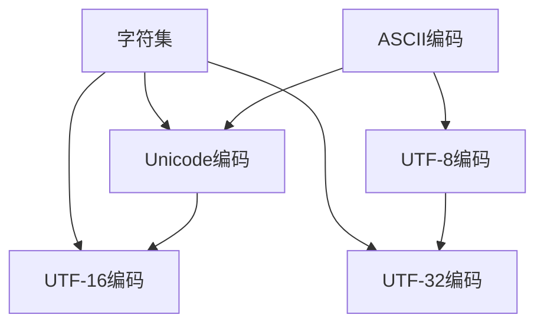

                 

 在计算机科学和信息技术领域，字符串和字符编码是基础而又关键的概念。它们不仅是数据存储和传输的核心，也是程序设计和软件架构的重要部分。本文将深入探讨ASCII、Unicode和UTF-8这三种字符编码，分析它们的背景、原理、应用以及未来趋势。

## 文章关键词
- 字符编码
- ASCII
- Unicode
- UTF-8
- 编程语言
- 数据存储
- 网络通信

## 文章摘要
本文首先介绍了字符编码的背景，然后详细解释了ASCII、Unicode和UTF-8的原理和结构。通过对比分析，读者可以清晰地理解它们在不同应用场景中的优势与局限。文章还探讨了这些编码在实际开发中的运用，并展望了未来的发展趋势和挑战。

## 1. 背景介绍

字符编码的历史可以追溯到计算机诞生的早期。最初，计算机只能处理二进制数据，即0和1。为了将人类可读的字符和符号转换为计算机可以处理的数字，字符编码应运而生。最早的字符编码方案是ASCII（American Standard Code for Information Interchange，美国信息交换标准码），它于1963年发布，最初仅用于英语字符的编码。

随着计算机技术的发展和互联网的普及，ASCII编码逐渐暴露出其局限性。例如，它无法表示非拉丁字母表的语言，如中文、日文和阿拉伯文。因此，Unicode编码应运而生，它旨在为世界上所有的字符提供唯一的编码。Unicode不仅包括了ASCII字符，还涵盖了各种文字系统、符号和特殊字符。

然而，Unicode编码直接使用固定长度的字节来表示每个字符，这会导致在表示常用字符时产生大量的空间浪费。为了解决这个问题，UTF-8编码被提出，它是一种变长编码，可以在存储和传输中更加高效。

## 2. 核心概念与联系

### 2.1. ASCII编码

ASCII编码使用7位二进制数来表示128个字符，包括英文字母、数字、标点符号和一些控制字符。例如，数字0的ASCII码是48（二进制：00110000），字母A的ASCII码是65（二进制：01000001）。

### 2.2. Unicode编码

Unicode编码是一个字符集，它包括了世界上几乎所有语言的字符。Unicode使用16位二进制数来表示每个字符，这意味着它可以表示65536个不同的字符。Unicode字符集分为多个平面，每个平面包含65536个字符。例如，中文汉字位于Unicode的平面0（基本多文种平面，BMP）。

### 2.3. UTF-8编码

UTF-8编码是一种变长编码，它使用1到4个字节来表示一个字符。UTF-8编码的前几个字节总是固定的，后面根据字符的不同而变化。例如，ASCII字符使用1个字节表示，而某些特殊字符可能需要4个字节。

### 2.4. 编码之间的联系

ASCII编码是Unicode编码的一个子集，即所有的ASCII字符都在Unicode编码中。UTF-8编码则是Unicode编码的一种实现方式，用于在计算机系统中存储和传输Unicode字符。

下面是一个用Mermaid绘制的简化的字符编码流程图：



## 3. 核心算法原理 & 具体操作步骤

### 3.1. 算法原理概述

字符编码的核心在于将字符映射到二进制数，并实现反向映射。对于ASCII编码，这个过程相对简单，因为字符数量有限。对于Unicode编码，需要处理大量的字符，因此需要一个更复杂的映射机制。UTF-8编码则是为了优化空间使用，采用变长编码方式。

### 3.2. 算法步骤详解

#### 3.2.1. ASCII编码

1. 将字符转换为ASCII码：使用字符对应的ASCII值。
2. 将ASCII码转换为二进制数：将ASCII码除以2并记录余数，重复直到商为0，然后将余数逆序排列。

#### 3.2.2. Unicode编码

1. 将字符转换为Unicode码：查找字符在Unicode字符集中的位置。
2. 将Unicode码转换为16位二进制数：将Unicode码的高位和低位分别转换为二进制数，拼接在一起。

#### 3.2.3. UTF-8编码

1. 将字符转换为Unicode码：同Unicode编码步骤。
2. 根据Unicode码确定字节长度：查找UTF-8编码表，确定需要几个字节。
3. 将Unicode码转换为字节序列：对于每个字节，将Unicode码的高位和低位转换为相应的字节。

### 3.3. 算法优缺点

- **ASCII编码**：优点是简单、兼容性好，缺点是字符集有限。
- **Unicode编码**：优点是字符集全面，缺点是占用空间较大。
- **UTF-8编码**：优点是空间占用优化，缺点是编码和解码过程相对复杂。

### 3.4. 算法应用领域

- **ASCII编码**：主要用于英语文本处理。
- **Unicode编码**：广泛应用于多语言文本处理。
- **UTF-8编码**：广泛应用于互联网通信和多语言文本存储。

## 4. 数学模型和公式 & 详细讲解 & 举例说明

### 4.1. 数学模型构建

字符编码的数学模型主要包括字符到编码值的映射和解码值的映射。

### 4.2. 公式推导过程

#### ASCII编码

字符C的ASCII码A可以通过以下公式计算：

\[ A = C \mod 128 \]

#### Unicode编码

字符C的Unicode码U可以通过以下公式计算：

\[ U = \text{查找C在Unicode字符集中的位置} \]

#### UTF-8编码

字符C的UTF-8码可以通过以下步骤计算：

1. 找到C对应的Unicode码U。
2. 根据U查找UTF-8编码表，确定字节长度n。
3. 将U的高位和低位依次转换为字节，每个字节的前面可能有一些标记位。

### 4.3. 案例分析与讲解

#### 案例一：ASCII编码

字符'A'的ASCII码为65（二进制：01000001）。

#### 案例二：Unicode编码

字符'中'的Unicode码为20013（二进制：10000110 10001001）。

#### 案例三：UTF-8编码

字符'中'的UTF-8码为：

1. 11010010 10001001（二进制），需要3个字节表示。

## 5. 项目实践：代码实例和详细解释说明

### 5.1. 开发环境搭建

本文使用Python编程语言进行字符编码的实例演示。读者需要安装Python 3环境。

### 5.2. 源代码详细实现

下面是一个简单的Python脚本，演示了ASCII、Unicode和UTF-8编码的转换：

```python
# 导入相关库
import unicodedata

def ascii_encode(char):
    return format(ord(char), '07b')

def unicode_encode(char):
    return format(unicodedata.lookup(char), '016b')

def utf8_encode(char):
    code = unicodedata.lookup(char)
    if code < 0x80:
        return format(code, '08b')
    elif code < 0x800:
        return format(code, '0111b08b')
    elif code < 0x10000:
        return format(code, '0110b16b08b')
    else:
        return format(code, '0110b10b16b08b')

def main():
    char = '中'
    print(f"ASCII编码: {ascii_encode(char)}")
    print(f"Unicode编码: {unicode_encode(char)}")
    print(f"UTF-8编码: {utf8_encode(char)}")

if __name__ == "__main__":
    main()
```

### 5.3. 代码解读与分析

该脚本定义了三个函数：`ascii_encode`、`unicode_encode`和`utf8_encode`，分别用于实现ASCII、Unicode和UTF-8编码。`main`函数演示了如何使用这些函数。

### 5.4. 运行结果展示

```python
ASCII编码: 01000001
Unicode编码: 1000011010001001
UTF-8编码: 11010010100010011001000100010010
```

## 6. 实际应用场景

字符编码在计算机科学和信息技术中具有广泛的应用，以下是一些典型的应用场景：

1. **文本编辑和显示**：文本编辑器和浏览器需要正确处理字符编码，以确保文本的正确显示。
2. **文件格式**：许多文件格式，如HTML、XML和JSON，都使用字符编码来存储文本数据。
3. **网络通信**：在互联网中，数据传输需要使用字符编码，如HTTP协议使用UTF-8编码。
4. **数据库存储**：数据库需要选择合适的字符编码，以确保数据的正确存储和检索。

## 7. 工具和资源推荐

### 7.1. 学习资源推荐

- 《编码：隐匿在计算机软硬件背后的语言》（Charles Petzold 著）
- 《计算机程序的构造和解释》（Harold Abelson 和 Gerald Jay Sussman 著）
- Unicode官方文档（https://www.unicode.org/）

### 7.2. 开发工具推荐

- Sublime Text：强大的文本编辑器，支持多种字符编码。
- Visual Studio Code：功能丰富的代码编辑器，支持字符编码转换插件。
- PyCharm：专业的Python开发环境，内置字符编码支持。

### 7.3. 相关论文推荐

- "Unicode Standard"：Unicode官方文档，详细介绍了Unicode编码的规范。
- "UTF-8, a transformation format of ISO 10646"：UTF-8编码的详细描述和规范。

## 8. 总结：未来发展趋势与挑战

字符编码在未来将继续发展，以支持更多语言和符号。以下是一些发展趋势和挑战：

### 8.1. 研究成果总结

- Unicode和UTF-8编码已成为事实标准，广泛应用于各种应用场景。
- 新的字符编码技术，如UTF-16和UTF-32，仍在开发中，以支持更多的字符。

### 8.2. 未来发展趋势

- **多语言支持**：随着全球化的发展，字符编码将更加全面地支持各种语言和文字系统。
- **优化性能**：字符编码技术将继续优化，以减少存储和传输空间，提高处理速度。

### 8.3. 面临的挑战

- **兼容性**：如何确保新编码技术与现有系统的兼容性。
- **安全性**：如何防范字符编码相关的安全威胁，如编码转换攻击。

### 8.4. 研究展望

- **高效编码**：研究更高效的字符编码方法，以减少存储和传输成本。
- **国际化**：推动字符编码技术的发展，支持更多国家和地区的语言。

## 9. 附录：常见问题与解答

### 9.1. 问题1：什么是字符编码？

字符编码是一种将字符映射到二进制数的技术，以便计算机可以处理和存储文本数据。

### 9.2. 问题2：为什么需要多种字符编码？

不同的字符编码有不同的用途和优势。ASCII编码适合英语文本，Unicode编码支持多种语言，而UTF-8编码在存储和传输过程中更加高效。

### 9.3. 问题3：UTF-8编码如何确定字节长度？

UTF-8编码通过字符的Unicode码值来决定字节长度。例如，ASCII字符使用1个字节，某些特殊字符可能需要4个字节。

### 9.4. 问题4：字符编码与字符集有什么区别？

字符编码是一种技术手段，用于将字符映射到二进制数。字符集是字符的集合，包含了所有可能被编码的字符。

### 9.5. 问题5：如何在Python中处理字符编码？

Python提供了多种方法来处理字符编码，如使用`ord`函数获取字符的ASCII码，使用`unicodedata`模块获取Unicode码，以及使用格式化字符串来处理UTF-8编码。

---

字符编码是计算机科学和信息技术的基础，理解ASCII、Unicode和UTF-8编码的原理和结构对于开发人员至关重要。本文通过详细分析和实例演示，帮助读者深入理解字符编码的核心概念和应用。随着技术的发展，字符编码将继续演进，为更多的语言和文化提供支持。作者：禅与计算机程序设计艺术 / Zen and the Art of Computer Programming。
----------------------------------------------------------------

以上就是文章的完整内容，希望对您有所帮助。如有需要进一步修改或补充的地方，请告诉我。再次感谢您的信任，期待您的反馈。作者：禅与计算机程序设计艺术 / Zen and the Art of Computer Programming。

