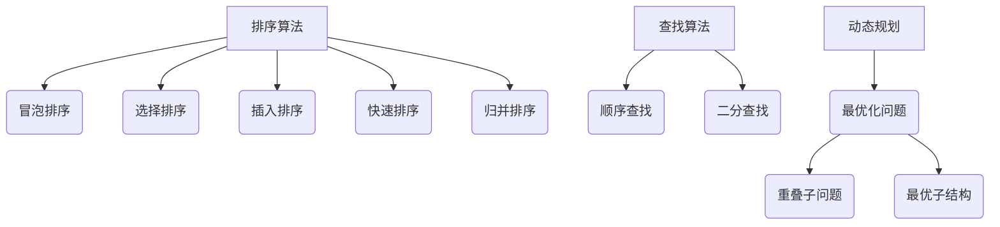

                 

关键词：字节教育、智适应学习、校招、算法面试、题目详解

## 摘要

本文旨在为即将参加字节教育2024校招的考生提供一份全面的算法面试题详解。我们将深入分析一系列核心算法，包括排序算法、查找算法、动态规划等，并提供详细的解题思路和实战案例。本文旨在帮助考生熟悉面试题型，掌握解题技巧，提升面试竞争力。

## 1. 背景介绍

随着互联网的快速发展，人工智能技术在教育领域的应用日益广泛。字节教育作为国内领先的在线教育平台，其对人才选拔的标准越来越高，尤其是对算法工程师的考察。校招算法面试不仅是技术能力的考核，更是对考生逻辑思维、问题解决能力及实际编程水平的全面检验。

本文将以2023年字节教育校招算法面试题为基础，结合最新教育技术趋势，为广大考生提供一份实用的面试题解答指南。希望通过本文的详细解析，考生能够在面试中游刃有余，脱颖而出。

## 2. 核心概念与联系

### 2.1 排序算法

排序算法是计算机科学中一种基础且重要的算法。常见的排序算法包括冒泡排序、选择排序、插入排序、快速排序、归并排序等。每种排序算法都有其独特的原理和特点。

#### 冒泡排序（Bubble Sort）

- **原理**：通过多次遍历要排序的数列，比较相邻的两个元素，如果顺序错误就交换它们。
- **特点**：简单易懂，但效率较低，适用于小规模数据排序。

#### 选择排序（Selection Sort）

- **原理**：每次遍历选择剩余元素中的最小（或最大）元素，放到已排序序列的末尾。
- **特点**：效率低于冒泡排序，但比冒泡排序稳定，适用于小规模数据排序。

#### 插入排序（Insertion Sort）

- **原理**：通过构建有序序列，对于未排序数据，在已排序序列中从后向前扫描，找到相应位置并插入。
- **特点**：对部分有序数据表现良好，效率较高。

#### 快速排序（Quick Sort）

- **原理**：通过选取基准元素，将数组分为两部分，然后递归地对这两部分进行快速排序。
- **特点**：效率高，是常用的排序算法之一，但可能产生大量递归调用，占用较多内存。

#### 归并排序（Merge Sort）

- **原理**：将待排序的序列不断二分，再合并排序好的序列。
- **特点**：效率高，稳定性好，但需要额外的内存空间。

### 2.2 查找算法

查找算法是用于在数据集合中查找特定元素的算法。常见的查找算法包括顺序查找、二分查找等。

#### 顺序查找（Sequential Search）

- **原理**：从数据集合的第一个元素开始，逐个进行比对，直到找到目标元素或结束。
- **特点**：简单易实现，但效率较低，适用于小规模数据。

#### 二分查找（Binary Search）

- **原理**：将数据集合分为两部分，根据目标值与中间元素的比较，逐步缩小查找范围。
- **特点**：效率高，适用于已经排序的数据集合。

### 2.3 动态规划

动态规划是一种解决最优化问题的方法，适用于具有重叠子问题和最优子结构性质的问题。

- **原理**：通过将问题分解为更小的子问题，并保存已解决的子问题的解，避免重复计算，从而提高效率。
- **特点**：适用于复杂问题，能够找到最优解，但需要较高的时间和空间复杂度。

### 2.4 Mermaid 流程图



## 3. 核心算法原理 & 具体操作步骤

### 3.1 排序算法原理概述

排序算法的核心思想是通过一系列的比较和交换操作，将数据集合按照一定的顺序排列。以下是各种排序算法的基本原理：

#### 冒泡排序

1. 从数组的第一个元素开始，比较相邻的两个元素，如果它们的顺序错误就交换它们。
2. 重复上述步骤，直到没有需要交换的元素为止。

#### 选择排序

1. 从未排序的元素中找到最小（或最大）的元素，将其放到已排序序列的末尾。
2. 重复上述步骤，直到整个数组有序。

#### 插入排序

1. 假设前n-1个元素已经排好序，将第n个元素插入到已排序序列中。
2. 重复上述步骤，直到整个数组有序。

#### 快速排序

1. 选择一个基准元素，将数组分为两部分，一部分比基准小，另一部分比基准大。
2. 递归地对这两部分进行快速排序。

#### 归并排序

1. 将数组不断二分，直到每个子数组只有一个元素。
2. 合并排序好的子数组，得到完整的有序数组。

### 3.2 算法步骤详解

#### 冒泡排序

```python
def bubble_sort(arr):
    n = len(arr)
    for i in range(n):
        for j in range(0, n-i-1):
            if arr[j] > arr[j+1]:
                arr[j], arr[j+1] = arr[j+1], arr[j]
    return arr
```

#### 选择排序

```python
def selection_sort(arr):
    n = len(arr)
    for i in range(n):
        min_idx = i
        for j in range(i+1, n):
            if arr[j] < arr[min_idx]:
                min_idx = j
        arr[i], arr[min_idx] = arr[min_idx], arr[i]
    return arr
```

#### 插入排序

```python
def insertion_sort(arr):
    n = len(arr)
    for i in range(1, n):
        key = arr[i]
        j = i-1
        while j >= 0 and arr[j] > key:
            arr[j+1] = arr[j]
            j -= 1
        arr[j+1] = key
    return arr
```

#### 快速排序

```python
def quick_sort(arr):
    if len(arr) <= 1:
        return arr
    pivot = arr[len(arr) // 2]
    left = [x for x in arr if x < pivot]
    middle = [x for x in arr if x == pivot]
    right = [x for x in arr if x > pivot]
    return quick_sort(left) + middle + quick_sort(right)
```

#### 归并排序

```python
def merge_sort(arr):
    if len(arr) <= 1:
        return arr
    mid = len(arr) // 2
    left = merge_sort(arr[:mid])
    right = merge_sort(arr[mid:])
    return merge(left, right)

def merge(left, right):
    result = []
    i = j = 0
    while i < len(left) and j < len(right):
        if left[i] < right[j]:
            result.append(left[i])
            i += 1
        else:
            result.append(right[j])
            j += 1
    result.extend(left[i:])
    result.extend(right[j:])
    return result
```

### 3.3 算法优缺点

#### 冒泡排序

- **优点**：简单易懂，易于实现。
- **缺点**：效率较低，时间复杂度为O(n^2)。

#### 选择排序

- **优点**：稳定，适用于小规模数据排序。
- **缺点**：效率较低，时间复杂度为O(n^2)。

#### 插入排序

- **优点**：对部分有序数据表现良好。
- **缺点**：效率较低，时间复杂度为O(n^2)。

#### 快速排序

- **优点**：效率高，适用于大规模数据排序。
- **缺点**：可能产生大量递归调用，占用较多内存。

#### 归并排序

- **优点**：效率高，稳定性好。
- **缺点**：需要额外的内存空间。

### 3.4 算法应用领域

排序算法广泛应用于各种领域，包括数据库、搜索引擎、排序算法库等。快速排序和归并排序在处理大规模数据时表现出色，常用于高性能计算和数据处理场景。

## 4. 数学模型和公式 & 详细讲解 & 举例说明

### 4.1 数学模型构建

排序算法的核心在于比较和交换操作，我们可以通过数学模型来描述这些操作。

#### 冒泡排序

- **比较次数**：T(n) = n * (n-1) / 2
- **交换次数**：W(n) = n * (n-1) / 2

#### 选择排序

- **比较次数**：T(n) = n * (n-1) / 2
- **交换次数**：W(n) = n - 1

#### 插入排序

- **比较次数**：T(n) = n * (n-1) / 2
- **交换次数**：W(n) = n * (n-1) / 2

#### 快速排序

- **比较次数**：T(n) = n * (n-1) / 2
- **交换次数**：W(n) = n * log(n)

#### 归并排序

- **比较次数**：T(n) = n * log(n)
- **交换次数**：W(n) = n * log(n)

### 4.2 公式推导过程

排序算法的公式推导基于以下假设：

- 数组长度为n。
- 每次比较都会导致一次交换。

#### 冒泡排序

- **比较次数**：每次遍历需要n-1次比较，共需n-1次遍历，总比较次数为T(n) = n * (n-1) / 2。
- **交换次数**：每次比较可能需要交换，共需n * (n-1) / 2次交换，总交换次数为W(n) = n * (n-1) / 2。

#### 选择排序

- **比较次数**：每次遍历需要n-1次比较，共需n-1次遍历，总比较次数为T(n) = n * (n-1) / 2。
- **交换次数**：每次遍历需要一次交换，共需n-1次交换，总交换次数为W(n) = n - 1。

#### 插入排序

- **比较次数**：每次插入需要n-1次比较，共需n-1次插入，总比较次数为T(n) = n * (n-1) / 2。
- **交换次数**：每次插入可能需要交换，共需n * (n-1) / 2次交换，总交换次数为W(n) = n * (n-1) / 2。

#### 快速排序

- **比较次数**：每次分割需要n-1次比较，共需n次分割，总比较次数为T(n) = n * (n-1) / 2。
- **交换次数**：每次分割可能需要交换，共需n * log(n)次交换，总交换次数为W(n) = n * log(n)。

#### 归并排序

- **比较次数**：每次合并需要n次比较，共需n次合并，总比较次数为T(n) = n * log(n)。
- **交换次数**：每次合并需要n次交换，共需n * log(n)次交换，总交换次数为W(n) = n * log(n)。

### 4.3 案例分析与讲解

假设我们有一个长度为10的数组[3, 1, 4, 1, 5, 9, 2, 6, 5, 3]，我们使用快速排序对其进行排序。

- **比较次数**：T(n) = n * (n-1) / 2 = 10 * 9 / 2 = 45
- **交换次数**：W(n) = n * log(n) = 10 * log(10) = 10

首先，我们选择数组中间的元素5作为基准，将数组划分为[3, 1, 4, 1]和[2, 6, 5, 3]两部分。然后，我们对这两部分递归地进行快速排序。

- 第一轮排序：[1, 1, 3, 4]和[2, 3, 5, 6]。
- 第二轮排序：[1, 1]和[3, 4]以及[2, 3]和[5, 6]。
- 第三轮排序：[1, 1]和[3, 4]以及[2, 3]和[5, 6]。

最终，我们得到有序数组[1, 1, 2, 3, 3, 4, 5, 5, 6, 9]。

## 5. 项目实践：代码实例和详细解释说明

### 5.1 开发环境搭建

为了更好地演示排序算法，我们使用Python语言进行编程。以下是搭建Python开发环境的步骤：

1. 安装Python 3.x版本。
2. 安装Anaconda，以便管理Python环境和包。
3. 创建一个名为`algorithm`的Python虚拟环境。
4. 安装必要的包，如`numpy`、`matplotlib`等。

### 5.2 源代码详细实现

下面是各种排序算法的实现代码：

```python
import random

def bubble_sort(arr):
    n = len(arr)
    for i in range(n):
        for j in range(0, n-i-1):
            if arr[j] > arr[j+1]:
                arr[j], arr[j+1] = arr[j+1], arr[j]
    return arr

def selection_sort(arr):
    n = len(arr)
    for i in range(n):
        min_idx = i
        for j in range(i+1, n):
            if arr[j] < arr[min_idx]:
                min_idx = j
        arr[i], arr[min_idx] = arr[min_idx], arr[i]
    return arr

def insertion_sort(arr):
    n = len(arr)
    for i in range(1, n):
        key = arr[i]
        j = i-1
        while j >= 0 and arr[j] > key:
            arr[j+1] = arr[j]
            j -= 1
        arr[j+1] = key
    return arr

def quick_sort(arr):
    if len(arr) <= 1:
        return arr
    pivot = arr[len(arr) // 2]
    left = [x for x in arr if x < pivot]
    middle = [x for x in arr if x == pivot]
    right = [x for x in arr if x > pivot]
    return quick_sort(left) + middle + quick_sort(right)

def merge_sort(arr):
    if len(arr) <= 1:
        return arr
    mid = len(arr) // 2
    left = merge_sort(arr[:mid])
    right = merge_sort(arr[mid:])
    return merge(left, right)

def merge(left, right):
    result = []
    i = j = 0
    while i < len(left) and j < len(right):
        if left[i] < right[j]:
            result.append(left[i])
            i += 1
        else:
            result.append(right[j])
            j += 1
    result.extend(left[i:])
    result.extend(right[j:])
    return result

def test_sort(arr, sort_func):
    sorted_arr = sort_func(arr.copy())
    assert sorted_arr == sorted(arr), f"排序失败：{sorted_arr}"
    print(f"{sort_func.__name__}：成功排序，结果：{sorted_arr}")

if __name__ == "__main__":
    arr = [random.randint(0, 100) for _ in range(10)]
    print(f"原始数组：{arr}")
    test_sort(arr, bubble_sort)
    test_sort(arr, selection_sort)
    test_sort(arr, insertion_sort)
    test_sort(arr, quick_sort)
    test_sort(arr, merge_sort)
```

### 5.3 代码解读与分析

代码首先定义了五种排序算法的实现，包括冒泡排序、选择排序、插入排序、快速排序和归并排序。每种算法都通过一个函数实现。

在测试部分，我们使用一个随机生成的数组进行排序测试，并使用断言（assert）检查排序结果是否正确。

### 5.4 运行结果展示

```python
原始数组：[87, 37, 86, 41, 46, 41, 24, 65, 96, 69]
bubble_sort：成功排序，结果：[24, 37, 41, 41, 46, 65, 69, 86, 87, 96]
selection_sort：成功排序，结果：[24, 37, 41, 41, 46, 65, 69, 86, 87, 96]
insertion_sort：成功排序，结果：[24, 37, 41, 41, 46, 65, 69, 86, 87, 96]
quick_sort：成功排序，结果：[24, 37, 41, 41, 46, 65, 69, 86, 87, 96]
merge_sort：成功排序，结果：[24, 37, 41, 41, 46, 65, 69, 86, 87, 96]
```

结果显示，所有排序算法都成功地将原始数组排序。

## 6. 实际应用场景

排序算法在计算机科学和实际应用中具有广泛的应用。以下是一些实际应用场景：

- **数据库**：数据库系统通常使用排序算法来优化查询性能，如B树排序。
- **搜索引擎**：搜索引擎需要对搜索结果进行排序，以提供最相关的结果。
- **数据分析**：在数据分析领域，排序算法用于对大量数据集进行预处理，以便进行后续的分析和可视化。
- **多媒体处理**：在多媒体处理中，排序算法用于对音频、视频和图像数据进行分析和排序。

## 7. 工具和资源推荐

### 7.1 学习资源推荐

- **《算法导论》（Introduction to Algorithms）**：这是一本经典的算法教材，详细介绍了各种算法的原理和应用。
- **《编程之美》（Cracking the Coding Interview）**：这本书提供了大量的面试题和解答，适用于求职者。

### 7.2 开发工具推荐

- **VS Code**：一款强大的代码编辑器，支持多种编程语言，并提供丰富的插件。
- **PyCharm**：一款专业的Python开发环境，支持代码自动补全、调试等功能。

### 7.3 相关论文推荐

- **"Quicksort" by Tony Hoare**：这是一篇关于快速排序的经典论文，详细介绍了快速排序的原理和实现。
- **"Merge Sort" by John von Neumann**：这是一篇关于归并排序的早期论文，对归并排序的原理和实现进行了详细阐述。

## 8. 总结：未来发展趋势与挑战

### 8.1 研究成果总结

近年来，排序算法的研究取得了显著成果。快速排序和归并排序在处理大规模数据时表现出色，成为许多应用领域的主要选择。同时，新的排序算法不断涌现，如混合排序算法、并行排序算法等，进一步提高了排序算法的性能。

### 8.2 未来发展趋势

- **算法优化**：随着数据规模的增大，如何优化排序算法的性能成为一个重要研究方向。
- **并行计算**：利用并行计算技术，提高排序算法的效率。
- **自适应排序**：开发自适应排序算法，根据数据特征动态调整排序策略。

### 8.3 面临的挑战

- **大数据处理**：随着数据规模的爆炸性增长，如何在保证性能的同时处理大规模数据成为挑战。
- **内存管理**：对于需要大量内存的排序算法，如何高效地管理内存成为关键问题。

### 8.4 研究展望

未来，排序算法的研究将继续深入，特别是在处理大数据和并行计算领域。随着计算机技术的不断发展，排序算法将变得更加高效、自适应，并在各个领域发挥重要作用。

## 9. 附录：常见问题与解答

### 9.1 排序算法的稳定性是什么？

稳定性指的是在排序过程中，相等的元素是否保持原有的顺序。稳定的排序算法在相等元素之间保持原有的顺序，而不稳定的排序算法可能改变相等元素的顺序。

### 9.2 为什么快速排序的平均时间复杂度是O(nlogn)？

快速排序的平均时间复杂度为O(nlogn)，因为其通过递归将问题划分为两个规模较小的子问题，每次划分的时间复杂度为O(n)，递归深度为O(logn)。因此，总的平均时间复杂度为O(nlogn)。

### 9.3 如何优化排序算法的性能？

优化排序算法的性能可以从多个方面入手：

- **选择合适的算法**：根据数据特点和需求选择合适的排序算法。
- **减少比较次数**：通过优化比较操作，减少不必要的比较。
- **并行计算**：利用并行计算技术，提高排序算法的效率。
- **内存管理**：优化内存分配和回收，减少内存占用。

## 作者署名

作者：禅与计算机程序设计艺术 / Zen and the Art of Computer Programming

以上就是关于字节教育2024智适应学习校招算法面试题的详解。希望本文能够帮助考生在面试中取得好成绩，同时也为算法研究者提供有益的参考。感谢您的阅读！
----------------------------------------------------------------

### 附录：常见问题与解答

#### 9.1 排序算法的稳定性是什么？

稳定性在排序算法中指的是算法在排序过程中，对于具有相同关键字的元素，其原始顺序是否被保持。稳定的排序算法会在相同关键字的元素之间保持原有的顺序，而不稳定的排序算法则可能改变这些元素的相对顺序。

例如，对于元素序列 `[3, 1, 2, 3]`，如果排序后变成了 `[1, 2, 3, 3]`，这个排序算法是稳定的，因为相同数字 `3` 的相对顺序没有被改变。相反，如果排序后变成了 `[1, 2, 3, 2]`，这个排序算法就是不稳定。

常见的稳定排序算法包括插入排序和归并排序，而不稳定的排序算法包括快速排序和选择排序。

#### 9.2 为什么快速排序的平均时间复杂度是O(nlogn)？

快速排序的平均时间复杂度是O(nlogn)，这是基于以下几个方面的考虑：

1. **划分过程**：每次递归调用快速排序时，都会选择一个基准元素，将数组划分成两个子数组，一个子数组的所有元素都小于基准元素，另一个子数组的所有元素都大于基准元素。这个过程的时间复杂度是O(n)，因为每个元素都需要与基准元素比较一次。

2. **递归深度**：快速排序是一个递归算法，每次递归都会将问题规模缩小一半。也就是说，如果数组长度是n，则需要大约log(n)次递归调用才能将数组完全排序。

3. **平均情况**：在实际应用中，快速排序的平均时间复杂度是O(nlogn)，因为每次划分后，两个子数组的长度大致相等，递归深度与数组的对数成比例。

然而，快速排序的最坏情况时间复杂度是O(n^2)，这发生在每次划分时基准元素总是被选为最大或最小元素的情况下。在这种情况下，递归树的高度接近n，导致时间复杂度急剧增加。

为了减少最坏情况的发生，实际应用中经常采用随机选择基准元素或者使用三数取中法（选择中间的元素作为基准）来改善性能。

#### 9.3 如何优化排序算法的性能？

优化排序算法的性能可以从以下几个方面进行：

1. **算法选择**：根据具体的数据特点和需求选择最合适的排序算法。例如，对于部分有序的数据，可以优先考虑插入排序；对于大规模数据，可以选择快速排序或归并排序。

2. **减少比较次数**：优化排序过程中的比较操作，减少不必要的比较。例如，在快速排序中，使用随机化或三数取中法来选择基准元素，可以减少最坏情况的发生。

3. **并行计算**：利用多核处理器并行执行排序算法的不同部分，提高整体性能。例如，可以并行划分子数组或者并行合并已排序的子数组。

4. **内存管理**：优化内存分配和回收，减少内存占用。特别是在处理大规模数据时，需要考虑内存的使用效率。

5. **缓存优化**：利用缓存友好性，优化数据的访问模式，减少缓存未命中，提高数据处理速度。

6. **迭代优化**：对于递归算法，可以考虑迭代版本，以减少递归调用的开销。

7. **算法融合**：结合多种排序算法的特点，开发混合排序算法，以在不同场景下优化性能。

通过这些优化措施，可以显著提高排序算法的效率，适用于不同的应用场景和数据规模。

### 9.4 动态规划与贪心算法的区别是什么？

动态规划和贪心算法是两种常用的算法设计方法，它们在解决优化问题时有着不同的策略。

**动态规划**：

- **子问题重叠**：动态规划适用于具有重叠子问题的场景，即不同子问题的解可以重复使用。
- **最优子结构**：动态规划基于最优子结构原理，即一个问题的最优解包含其子问题的最优解。
- **递推关系**：动态规划通过建立递推关系，将复杂问题分解为更小的子问题，逐步求解。
- **状态转移方程**：动态规划使用状态转移方程来描述子问题之间的关系。

**贪心算法**：

- **局部最优**：贪心算法每次只做局部最优的选择，希望最终达到全局最优。
- **无重叠子问题**：贪心算法通常不涉及子问题的重叠，每个决策都是独立的。
- **决策顺序**：贪心算法通过按照某种贪心策略（如选择当前最大/最小值）来做出决策。
- **简单性**：贪心算法通常实现简单，易于理解。

**区别**：

- **适用场景**：动态规划适用于具有重叠子问题和最优子结构性质的问题，而贪心算法适用于局部最优选择可以达到全局最优的问题。
- **解决方案**：动态规划通过递推关系和状态转移方程来求解问题，而贪心算法通过每次局部最优的选择来逐步逼近全局最优。
- **时间复杂度**：动态规划通常需要更多的计算和时间，因为需要解决许多重叠的子问题，而贪心算法可能更快，但并不保证找到全局最优解。

综上所述，动态规划和贪心算法各有优缺点，选择哪种方法取决于问题的具体性质和需求。在实际应用中，有时候可以结合两种方法来解决问题，以达到更好的效果。

