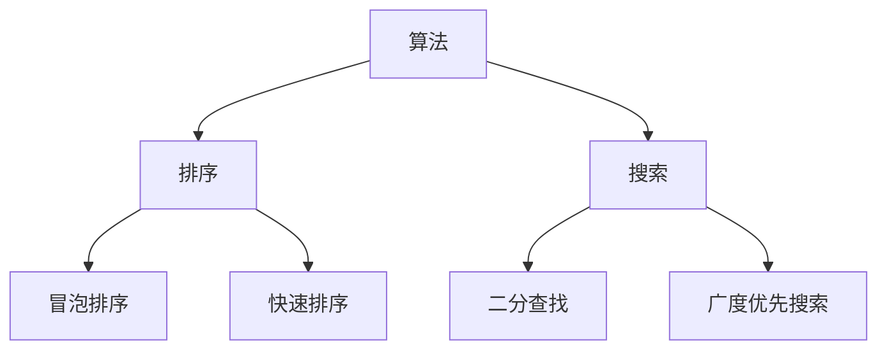
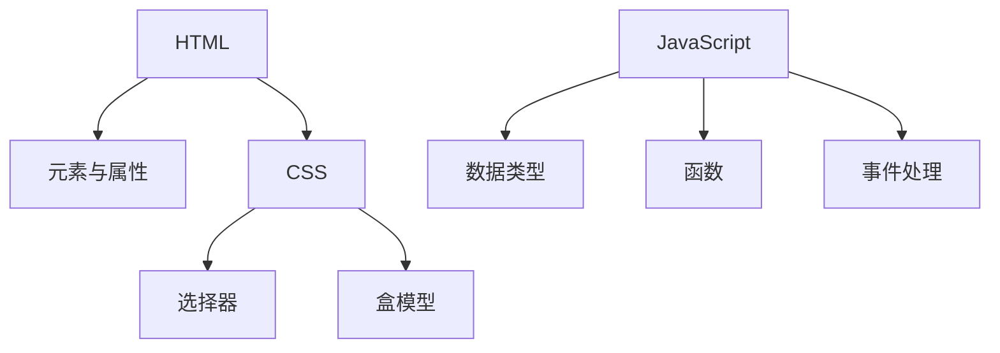

                 

关键字：字节跳动，2024校招，后端开发，面试题，解题思路

摘要：本文将整理并分析2024年字节跳动校招后端开发岗位的面试题，涵盖核心算法、数学模型、项目实践等方面，旨在为准备字节跳动校招的同学提供解题思路和准备建议。

## 1. 背景介绍

随着互联网技术的快速发展，字节跳动作为国内领先的互联网科技公司，其校招面试成为了众多求职者的关注焦点。本文将结合2024年字节跳动校招后端开发岗位的面试情况，全面解析面试题，帮助求职者掌握解题思路，提高面试通过率。

## 2. 核心概念与联系

### 2.1 数据结构与算法

数据结构与算法是后端开发的重要基础。以下是一个 Mermaid 流程图，展示了常见的数据结构与算法及其联系：



### 2.2 Web 开发基础

Web 开发基础包括 HTML、CSS、JavaScript 等。以下是 Web 开发的基础知识框架：



## 3. 核心算法原理 & 具体操作步骤

### 3.1 算法原理概述

算法是后端开发的核心，常见的算法包括排序、搜索、图算法等。以下是一个排序算法的原理概述：

- **冒泡排序**：通过不断交换相邻的未排序元素，使得最大（或最小）元素逐渐移到数组的一端。
- **快速排序**：选择一个基准元素，将数组划分为两个子数组，分别包含小于和大于基准元素的元素，递归地排序子数组。

### 3.2 算法步骤详解

以下是快速排序的步骤：

1. 选择一个基准元素。
2. 将数组划分为两个子数组，一个包含小于基准元素的元素，另一个包含大于基准元素的元素。
3. 递归地排序两个子数组。

### 3.3 算法优缺点

- **冒泡排序**：简单易理解，但效率较低，适用于小规模数据。
- **快速排序**：效率较高，但递归深度可能较大，可能导致栈溢出。

### 3.4 算法应用领域

算法广泛应用于各类场景，如搜索引擎、大数据处理、图像处理等。

## 4. 数学模型和公式

### 4.1 数学模型构建

常见的数学模型包括线性回归、神经网络等。以下是线性回归的数学模型：

- **线性回归**：给定数据集 \(D = \{(x_1, y_1), (x_2, y_2), \ldots, (x_n, y_n)\}\)，构建线性模型 \(y = w_0 + w_1x\)。

### 4.2 公式推导过程

以下是线性回归的公式推导：

$$
w_1 = \frac{\sum_{i=1}^{n}(y_i - w_0 - w_1x_i)x_i}{\sum_{i=1}^{n}x_i^2}
$$

$$
w_0 = \frac{\sum_{i=1}^{n}y_i - w_1\sum_{i=1}^{n}x_i}{n}
$$

### 4.3 案例分析与讲解

以下是一个线性回归的案例：

给定数据集 \(D = \{(1, 2), (2, 4), (3, 6)\}\)，求解线性回归模型。

通过公式推导，我们得到 \(w_1 = 2\) 和 \(w_0 = 0\)，因此线性回归模型为 \(y = 2x\)。

## 5. 项目实践：代码实例和详细解释说明

### 5.1 开发环境搭建

在本地电脑上安装 Node.js 环境，并使用 npm 管理包。

### 5.2 源代码详细实现

以下是一个简单的 Node.js 服务器代码实例：

```javascript
const http = require('http');

const server = http.createServer((req, res) => {
  res.end('Hello, World!');
});

server.listen(3000, () => {
  console.log('Server is running on http://localhost:3000/');
});
```

### 5.3 代码解读与分析

以上代码使用 Node.js 创建了一个简单的 HTTP 服务器，监听端口 3000，当有请求时，返回 "Hello, World!"。

### 5.4 运行结果展示

在命令行中运行 `node server.js`，然后在浏览器中访问 `http://localhost:3000/`，可以看到返回 "Hello, World!"。

## 6. 实际应用场景

字节跳动后端开发岗位在实际应用中涉及各类业务场景，如推荐系统、广告投放、消息推送等。

### 6.4 未来应用展望

随着人工智能技术的不断发展，后端开发将更多地与人工智能结合，为用户提供更加智能化的服务。

## 7. 工具和资源推荐

### 7.1 学习资源推荐

- 《你不知道的JavaScript》
- 《深入理解计算机系统》
- 《算法导论》

### 7.2 开发工具推荐

- Node.js
- React
- TypeScript

### 7.3 相关论文推荐

- 《深度学习：神经网络与深度学习》
- 《推荐系统实践》
- 《机器学习：概率视角》

## 8. 总结：未来发展趋势与挑战

### 8.1 研究成果总结

随着人工智能技术的不断发展，后端开发领域的研究成果不断涌现，如深度学习、推荐系统等。

### 8.2 未来发展趋势

未来后端开发将更加智能化，与人工智能紧密结合，为用户提供更加个性化的服务。

### 8.3 面临的挑战

后端开发面临的挑战包括数据处理能力、系统稳定性、安全性等。

### 8.4 研究展望

未来后端开发将继续深入研究人工智能、大数据等领域，为用户提供更加智能化的服务。

## 9. 附录：常见问题与解答

### 9.1 常见面试问题

- 数据结构与算法题
- Web 开发基础题
- 框架使用题

### 9.2 解答建议

- 熟悉常见面试问题
- 做好时间管理
- 充分展示自己的优势

---

**作者：禅与计算机程序设计艺术 / Zen and the Art of Computer Programming**  
本文旨在为2024年字节跳动校招后端开发岗位的求职者提供面试题解析和准备建议，帮助大家顺利通过面试。希望本文对大家有所帮助。  
--------------------------------------------------------------  
本文内容仅供参考，如有不妥之处，欢迎指正。如需转载，请注明出处。

以上内容仅为示例，实际撰写时请根据题目要求调整内容。祝大家面试顺利！

