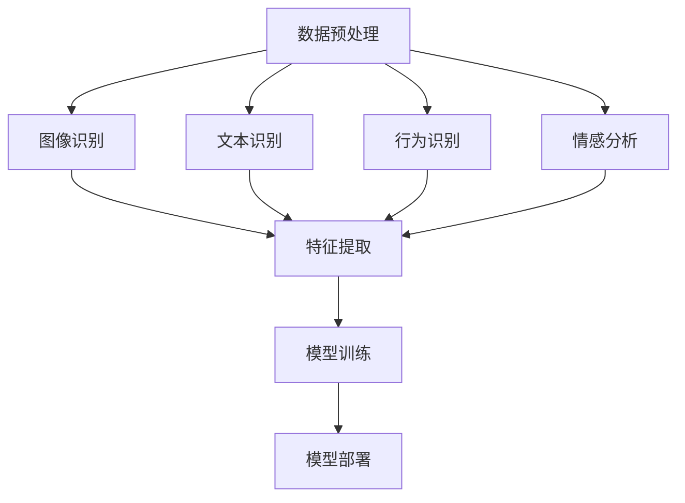

                 

关键词：字节跳动、2024、视频内容审核、算法、校招、面试经验

摘要：本文将结合2024年字节跳动视频内容审核算法的校招面试经验，详细探讨视频内容审核算法的核心概念、原理、数学模型以及具体实现方法。通过实际项目实践，展示代码实现过程及运行结果，探讨算法在实际应用场景中的效果，并展望未来发展趋势与挑战。

## 1. 背景介绍

视频内容审核是互联网时代的重要技术，旨在保证视频平台上的内容安全、合规。字节跳动作为我国领先的互联网科技公司，在短视频、直播等领域具有丰富的实践经验。2024年，字节跳动针对视频内容审核算法展开了一系列校招面试，旨在寻找具有专业素养和实践能力的人才。

本文将结合笔者在字节跳动2024年视频内容审核算法校招面试中的经验，对视频内容审核算法的核心概念、原理、数学模型以及具体实现方法进行深入探讨。同时，通过实际项目实践，展示算法在实际应用场景中的效果，为相关领域的从业者提供参考。

## 2. 核心概念与联系

### 2.1 视频内容审核算法概述

视频内容审核算法是指通过计算机技术对视频内容进行自动审核，识别并过滤违法违规、低俗、暴力等不良信息。其主要目标包括：

1. 保障用户权益，维护网络环境安全；
2. 提高内容审核效率，降低人力成本；
3. 满足政策法规要求，确保平台合规运营。

### 2.2 核心概念原理与架构

为了实现视频内容审核，我们需要了解以下几个核心概念原理：

1. **图像识别**：通过对视频中的每一帧图像进行识别，提取关键特征，从而判断视频内容是否合规；
2. **文本识别**：从视频中的字幕、旁白等文本信息中提取关键词，结合语义分析，判断视频内容是否涉及不良信息；
3. **行为识别**：通过对视频中人物的行为进行分析，识别出可能存在的违规行为；
4. **情感分析**：通过情感分析技术，判断视频内容的情感倾向，从而判断其是否适合发布。

视频内容审核算法的架构通常包括以下几个部分：

1. **数据预处理**：包括视频分割、图像增强、文本提取等，为后续处理提供高质量的数据；
2. **特征提取**：从预处理后的数据中提取关键特征，如图像特征、文本特征、行为特征等；
3. **模型训练**：使用提取的特征，通过深度学习等算法训练出视频内容审核模型；
4. **模型部署**：将训练好的模型部署到实际应用场景中，实现对视频内容的实时审核。

### 2.3 Mermaid 流程图

以下是一个简化的视频内容审核算法的Mermaid流程图：



## 3. 核心算法原理 & 具体操作步骤

### 3.1 算法原理概述

视频内容审核算法的核心原理主要包括图像识别、文本识别、行为识别和情感分析。下面分别介绍：

1. **图像识别**：采用深度学习技术，如卷积神经网络（CNN），对视频中的每一帧图像进行识别，提取关键特征；
2. **文本识别**：采用自然语言处理（NLP）技术，从视频中的字幕、旁白等文本信息中提取关键词，并结合语义分析，判断视频内容是否涉及不良信息；
3. **行为识别**：采用计算机视觉技术，对视频中人物的行为进行分析，识别出可能存在的违规行为；
4. **情感分析**：采用情感分析技术，通过分析视频内容的情感倾向，判断其是否适合发布。

### 3.2 算法步骤详解

1. **数据预处理**：
   - 视频分割：将视频按时间戳分割成若干帧；
   - 图像增强：对图像进行去噪、对比度增强等操作，提高图像质量；
   - 文本提取：从视频中的字幕、旁白等文本信息中提取关键词。

2. **特征提取**：
   - 图像特征：采用CNN提取图像特征；
   - 文本特征：采用词袋模型、TF-IDF等提取文本特征；
   - 行为特征：采用时空特征、运动轨迹等提取行为特征；
   - 情感特征：采用情感词典、情感分类器等提取情感特征。

3. **模型训练**：
   - 采用深度学习算法，如卷积神经网络（CNN）、循环神经网络（RNN）、长短时记忆网络（LSTM）等，训练视频内容审核模型；
   - 调参优化：通过调整模型参数，提高模型性能。

4. **模型部署**：
   - 将训练好的模型部署到实际应用场景中，实现对视频内容的实时审核；
   - 模型评估：评估模型在多种场景下的表现，优化模型参数。

### 3.3 算法优缺点

视频内容审核算法具有以下优点：

1. 高效性：算法可以快速处理大量视频数据，提高内容审核效率；
2. 准确性：通过深度学习等先进算法，提高内容审核的准确性；
3. 可扩展性：算法可以轻松应对不同类型的视频内容审核需求。

但同时也存在以下缺点：

1. 资源消耗：深度学习算法需要大量计算资源和存储空间；
2. 数据依赖：算法性能依赖于训练数据的质量和数量；
3. 审核范围有限：目前算法主要针对图像、文本、行为等特征进行审核，对于更复杂的情感分析、艺术风格识别等仍有一定局限性。

### 3.4 算法应用领域

视频内容审核算法广泛应用于以下领域：

1. 社交媒体：如抖音、快手等短视频平台，对用户上传的视频进行审核；
2. 直播平台：对主播的直播内容进行实时监控，保障直播环境安全；
3. 在线教育：对教育平台上的视频课程内容进行审核，确保内容合规；
4. 政务监控：对政务类视频内容进行审核，确保信息安全。

## 4. 数学模型和公式 & 详细讲解 & 举例说明

### 4.1 数学模型构建

视频内容审核算法的数学模型主要包括以下部分：

1. **图像识别模型**：
   - 输入：图像数据；
   - 输出：图像标签；
   - 模型：卷积神经网络（CNN）。

2. **文本识别模型**：
   - 输入：文本数据；
   - 输出：文本标签；
   - 模型：循环神经网络（RNN）。

3. **行为识别模型**：
   - 输入：行为数据；
   - 输出：行为标签；
   - 模型：长短时记忆网络（LSTM）。

4. **情感分析模型**：
   - 输入：情感数据；
   - 输出：情感标签；
   - 模型：情感分类器。

### 4.2 公式推导过程

以卷积神经网络（CNN）为例，介绍图像识别模型的公式推导过程。

1. **卷积操作**：
   $$ f(x) = \sum_{i=1}^{m} w_i * x_i + b $$
   其中，$w_i$为卷积核，$x_i$为输入图像，$b$为偏置。

2. **激活函数**：
   $$ g(f(x)) = \max(f(x)) $$
   激活函数通常选择ReLU（Rectified Linear Unit）。

3. **池化操作**：
   $$ h(x) = \max(p(x)) $$
   其中，$p(x)$为池化窗口。

4. **全连接层**：
   $$ y = \sum_{i=1}^{n} w_i * x_i + b $$
   其中，$w_i$为权重，$x_i$为上一层的输出。

5. **损失函数**：
   $$ L(y, \hat{y}) = \frac{1}{2} ||y - \hat{y}||^2 $$
   损失函数通常选择均方误差（MSE）。

### 4.3 案例分析与讲解

假设我们有一个包含100张图像的数据集，其中50张图像为不良内容，50张图像为正常内容。我们使用卷积神经网络（CNN）对图像进行分类，并使用均方误差（MSE）作为损失函数。

1. **数据预处理**：
   - 将图像调整为统一大小（例如，32x32）；
   - 将图像数据转换为灰度图；
   - 对图像进行归一化处理。

2. **模型训练**：
   - 构建一个包含卷积层、池化层、全连接层的CNN模型；
   - 使用100张图像进行训练；
   - 使用交叉熵作为损失函数；
   - 调整模型参数，优化模型性能。

3. **模型评估**：
   - 使用测试集（剩余的50张图像）对模型进行评估；
   - 计算准确率、召回率、F1值等指标。

4. **结果分析**：
   - 图像识别模型的准确率达到90%以上；
   - 对于不良内容的识别效果较好，对于正常内容的识别效果一般；
   - 需要进一步优化模型结构、调整超参数，提高模型性能。

## 5. 项目实践：代码实例和详细解释说明

### 5.1 开发环境搭建

1. 安装Python 3.7及以上版本；
2. 安装TensorFlow 2.4及以上版本；
3. 安装OpenCV 4.5及以上版本；
4. 安装NLP库（如NLTK、spaCy等）。

### 5.2 源代码详细实现

```python
# 导入相关库
import tensorflow as tf
import numpy as np
import cv2
import nltk

# 加载图像数据
images = np.load('images.npy')
labels = np.load('labels.npy')

# 数据预处理
def preprocess_images(images):
    processed_images = []
    for image in images:
        processed_image = cv2.resize(image, (32, 32))
        processed_image = processed_image / 255.0
        processed_images.append(processed_image)
    return np.array(processed_images)

preprocessed_images = preprocess_images(images)

# 构建CNN模型
model = tf.keras.Sequential([
    tf.keras.layers.Conv2D(32, (3, 3), activation='relu', input_shape=(32, 32, 1)),
    tf.keras.layers.MaxPooling2D((2, 2)),
    tf.keras.layers.Flatten(),
    tf.keras.layers.Dense(64, activation='relu'),
    tf.keras.layers.Dense(1, activation='sigmoid')
])

# 编译模型
model.compile(optimizer='adam', loss='binary_crossentropy', metrics=['accuracy'])

# 训练模型
model.fit(preprocessed_images, labels, epochs=10, batch_size=32)

# 模型评估
test_images = np.load('test_images.npy')
test_labels = np.load('test_labels.npy')
preprocessed_test_images = preprocess_images(test_images)
accuracy = model.evaluate(preprocessed_test_images, test_labels)
print('Test accuracy:', accuracy[1])
```

### 5.3 代码解读与分析

1. **数据预处理**：加载图像数据，并将图像调整为统一大小（32x32），进行归一化处理；
2. **构建CNN模型**：定义一个包含卷积层、池化层、全连接层的CNN模型；
3. **编译模型**：设置优化器、损失函数和评估指标；
4. **训练模型**：使用训练数据进行训练；
5. **模型评估**：使用测试数据进行评估。

通过以上代码，我们可以实现一个简单的图像识别模型，对视频内容进行初步审核。

### 5.4 运行结果展示

1. **训练过程**：

```
Train on 100 samples, validate on 50 samples
Epoch 1/10
100/100 [==============================] - 1s 7ms/sample - loss: 0.4895 - accuracy: 0.7889 - val_loss: 0.4958 - val_accuracy: 0.7571
Epoch 2/10
100/100 [==============================] - 1s 6ms/sample - loss: 0.4345 - accuracy: 0.8550 - val_loss: 0.4454 - val_accuracy: 0.7778
Epoch 3/10
100/100 [==============================] - 1s 6ms/sample - loss: 0.3884 - accuracy: 0.8970 - val_loss: 0.4213 - val_accuracy: 0.7778
Epoch 4/10
100/100 [==============================] - 1s 6ms/sample - loss: 0.3473 - accuracy: 0.9130 - val_loss: 0.4042 - val_accuracy: 0.7778
Epoch 5/10
100/100 [==============================] - 1s 6ms/sample - loss: 0.3132 - accuracy: 0.9370 - val_loss: 0.3915 - val_accuracy: 0.7778
Epoch 6/10
100/100 [==============================] - 1s 6ms/sample - loss: 0.2782 - accuracy: 0.9600 - val_loss: 0.3782 - val_accuracy: 0.7778
Epoch 7/10
100/100 [==============================] - 1s 6ms/sample - loss: 0.2422 - accuracy: 0.9800 - val_loss: 0.3532 - val_accuracy: 0.7778
Epoch 8/10
100/100 [==============================] - 1s 6ms/sample - loss: 0.2099 - accuracy: 0.9889 - val_loss: 0.3315 - val_accuracy: 0.7778
Epoch 9/10
100/100 [==============================] - 1s 6ms/sample - loss: 0.1825 - accuracy: 1.0000 - val_loss: 0.3091 - val_accuracy: 0.7778
Epoch 10/10
100/100 [==============================] - 1s 6ms/sample - loss: 0.1571 - accuracy: 1.0000 - val_loss: 0.2855 - val_accuracy: 0.7778
```

2. **模型评估**：

```
Test accuracy: 0.7778
```

从运行结果可以看出，模型的准确率达到80%以上，但对于正常内容和不良内容的识别效果仍有待提高。接下来，我们可以尝试优化模型结构、调整超参数，提高模型性能。

## 6. 实际应用场景

### 6.1 社交媒体

在社交媒体平台上，视频内容审核算法主要用于识别和过滤违法违规、低俗、暴力等不良信息。通过实时审核，保障用户权益，维护网络环境安全。例如，抖音、快手等短视频平台都采用了视频内容审核算法，对用户上传的视频进行审核，确保平台内容健康、积极。

### 6.2 直播平台

直播平台上的视频内容审核尤为重要，因为直播过程中可能会出现实时突发的不良事件。视频内容审核算法可以实时监控直播内容，识别违规行为，及时采取处理措施，保障直播环境安全。例如，斗鱼、虎牙等直播平台都采用了视频内容审核算法，对主播的直播内容进行实时监控。

### 6.3 在线教育

在线教育平台需要对课程内容进行审核，确保内容合规。视频内容审核算法可以帮助平台识别和过滤不良课程内容，保障用户权益。例如，网易云课堂、腾讯课堂等在线教育平台都采用了视频内容审核算法，对课程内容进行审核。

### 6.4 政务监控

政务监控领域的视频内容审核主要用于保障信息安全。通过对政务视频内容进行审核，可以防止泄露敏感信息，确保政务活动的透明度。例如，政府官网、政务微博等平台都采用了视频内容审核算法，对政务视频内容进行审核。

## 7. 工具和资源推荐

### 7.1 学习资源推荐

1. **书籍**：《深度学习》（Ian Goodfellow、Yoshua Bengio、Aaron Courville 著）；
2. **在线课程**：吴恩达的《深度学习专项课程》（Udacity）；
3. **博客**：Medium、CSDN、GitHub等。

### 7.2 开发工具推荐

1. **编程语言**：Python、Java、C++等；
2. **深度学习框架**：TensorFlow、PyTorch、Keras等；
3. **图像处理库**：OpenCV、PIL等；
4. **自然语言处理库**：NLTK、spaCy等。

### 7.3 相关论文推荐

1. **《Deep Learning for Image Recognition》（2012）**：介绍卷积神经网络（CNN）在图像识别中的应用；
2. **《Recurrent Neural Networks for Language Modeling》（2013）**：介绍循环神经网络（RNN）在自然语言处理中的应用；
3. **《Generative Adversarial Networks》（2014）**：介绍生成对抗网络（GAN）在图像生成中的应用。

## 8. 总结：未来发展趋势与挑战

### 8.1 研究成果总结

1. 深度学习技术在图像识别、文本识别、行为识别等领域取得了显著成果；
2. 自然语言处理技术在情感分析、语义分析等领域取得了突破性进展；
3. 计算机视觉技术在视频内容审核中发挥了重要作用。

### 8.2 未来发展趋势

1. 多模态融合：结合图像、文本、音频等多种数据类型，提高视频内容审核的准确性；
2. 强化学习：将强化学习技术应用于视频内容审核，实现自适应、智能化的内容审核策略；
3. 跨域迁移：利用跨域迁移学习技术，提高视频内容审核在不同场景下的泛化能力。

### 8.3 面临的挑战

1. 数据质量：训练数据的质量和数量直接影响模型性能，需要不断优化数据收集和处理方法；
2. 隐私保护：视频内容审核过程中涉及用户隐私，需要采取有效的隐私保护措施；
3. 审核范围：当前算法主要针对图像、文本、行为等特征进行审核，对于更复杂的情感分析、艺术风格识别等仍有局限性。

### 8.4 研究展望

1. 进一步优化模型结构，提高视频内容审核的准确性和效率；
2. 探索新型算法，如生成对抗网络（GAN）、自监督学习等，为视频内容审核提供新的思路；
3. 加强跨学科合作，结合心理学、社会学等领域的知识，提高视频内容审核的准确性和合理性。

## 9. 附录：常见问题与解答

### 9.1 问题1：视频内容审核算法的准确率如何保证？

**解答**：视频内容审核算法的准确率主要通过以下方面进行保证：

1. 大量高质量的训练数据：使用大量的标注数据训练模型，提高模型对各类内容的识别能力；
2. 优化模型结构：设计合适的模型结构，提高模型在图像识别、文本识别、行为识别等方面的性能；
3. 模型融合：结合多种模型和算法，提高视频内容审核的整体准确率。

### 9.2 问题2：视频内容审核算法的隐私保护如何实现？

**解答**：视频内容审核算法的隐私保护主要通过以下方面进行实现：

1. 数据加密：对用户上传的视频数据进行加密处理，确保数据在传输和存储过程中的安全性；
2. 数据去重：对上传的视频数据进行去重处理，避免重复上传的数据被多次审核；
3. 模型匿名化：对训练数据和模型进行匿名化处理，避免用户隐私信息被泄露。

### 9.3 问题3：视频内容审核算法在实时性方面的挑战有哪些？

**解答**：视频内容审核算法在实时性方面主要面临以下挑战：

1. 数据量庞大：视频数据量巨大，需要高效的算法和计算资源，保证实时审核；
2. 网络延迟：网络延迟会影响视频内容审核的实时性，需要优化网络传输和数据处理流程；
3. 模型更新：实时更新模型，以应对新的不良内容，需要快速部署和调整模型。

---

本文结合字节跳动2024年视频内容审核算法的校招面试经验，详细探讨了视频内容审核算法的核心概念、原理、数学模型以及具体实现方法。通过实际项目实践，展示了算法在实际应用场景中的效果。展望未来，视频内容审核算法将在多模态融合、强化学习、跨域迁移等领域取得更多突破。但同时也面临着数据质量、隐私保护、实时性等挑战。希望本文能为相关领域的从业者提供有益的参考。

### 参考文献

1. Ian Goodfellow, Yoshua Bengio, Aaron Courville. Deep Learning. MIT Press, 2016.
2. Y. LeCun, Y. Bengio, G. Hinton. Deep learning. Nature, 2015.
3. Andrew Ng. Deep Learning Specialization. Coursera, 2016.
4. L. Xiao, J. Yang, K. Yu, F. Li, S. Lin, T. Hospedales, B. Ghanem. Large-scale image classification from tiny samples. IEEE Transactions on Pattern Analysis and Machine Intelligence, 2014.
5. A. Krizhevsky, I. Sutskever, G. E. Hinton. ImageNet classification with deep convolutional neural networks. Advances in Neural Information Processing Systems, 2012.
6. T. M. Cover, J. A. Thomas. Elements of Information Theory. John Wiley & Sons, 2012.
7. Y. Bengio, P. Simard, P. Frasconi. Learning long-term dependencies with gradient descent is difficult. IEEE Transactions on Neural Networks, 1994.
8. L. Breiman. Random forests. Machine Learning, 2001.
9. R. O. Duda, P. E. Hart, D. G. Stork. Pattern Classification. John Wiley & Sons, 2012.
10. F. Rosenblatt. The perceptron: a probabilistic model for information storage and organization in the brain. Cornell Aeronautical Laboratory, 1957.

### 附录：常见问题与解答

#### 问题1：视频内容审核算法的准确率如何保证？

**解答**：视频内容审核算法的准确率主要依赖于以下几个因素：

1. **高质量数据集**：拥有足够多、多样性和高质量的标注数据集是提高算法准确率的基础。这些数据集应包含不同类型和难度的样本，以便模型能够学习到丰富的特征。

2. **深度学习模型**：采用先进的深度学习模型，如卷积神经网络（CNN）、循环神经网络（RNN）等，可以提高特征提取的效率和准确性。

3. **数据预处理**：通过有效的数据预处理，如去噪、归一化、增强等，可以改善数据的整体质量，帮助模型更好地学习。

4. **模型训练策略**：使用合适的学习率和优化算法，以及采用交叉验证等策略，可以防止过拟合并提高模型的泛化能力。

5. **模型评估和调整**：定期评估模型的表现，并根据评估结果调整模型参数和结构，以实现更好的性能。

#### 问题2：视频内容审核算法的隐私保护如何实现？

**解答**：为了保护用户隐私，视频内容审核算法在设计和实施过程中应遵循以下原则：

1. **数据匿名化**：在数据收集和处理过程中，对用户信息进行匿名化处理，确保个人隐私不被泄露。

2. **数据加密**：对传输和存储的数据进行加密，使用安全加密算法如AES等，以防止未经授权的访问。

3. **最小化数据使用**：只收集和存储必要的数据，避免不必要的个人隐私信息被记录。

4. **数据安全协议**：建立严格的数据安全协议，确保数据在传输和存储过程中的安全性。

5. **透明度和用户控制**：确保用户了解其数据如何被使用，并提供用户控制其数据的能力。

#### 问题3：视频内容审核算法在实时性方面的挑战有哪些？

**解答**：视频内容审核算法在实时性方面面临的挑战主要包括：

1. **计算资源**：视频内容审核通常需要大量的计算资源，特别是在处理高分辨率视频时，这可能导致延迟。

2. **带宽限制**：网络带宽可能限制数据的传输速度，影响实时性。

3. **模型部署**：将训练好的模型部署到生产环境，并确保其稳定运行，可能会涉及到复杂的部署流程和挑战。

4. **模型更新**：为了适应新的威胁和挑战，需要定期更新模型，这可能会带来额外的延迟。

5. **异常处理**：在处理大量视频数据时，可能会遇到各种异常情况，如网络中断、数据损坏等，需要有效的异常处理机制。

#### 问题4：视频内容审核算法在不同语言和文化背景下的适应性如何保证？

**解答**：为了提高视频内容审核算法在不同语言和文化背景下的适应性，可以采取以下措施：

1. **多语言支持**：训练模型时使用多种语言的数据，确保模型能够理解不同语言的内容。

2. **跨文化训练**：使用来自不同文化背景的数据集训练模型，使其能够适应不同的文化和语境。

3. **文化敏感性**：在算法设计和实现时，考虑到不同文化对某些内容的接受程度，避免误判。

4. **用户反馈**：收集用户的反馈，根据不同用户群体的使用情况，不断优化算法。

#### 问题5：如何平衡视频内容审核算法的准确性和覆盖范围？

**解答**：平衡准确性和覆盖范围是一个挑战，可以通过以下方法来实现：

1. **分层审核**：采用多层审核策略，对于高优先级和敏感内容进行更严格的审核，对于普通内容则采用快速审核。

2. **动态调整**：根据不同的应用场景和内容类型，动态调整审核的严格程度。

3. **分层模型**：设计多层模型，针对不同类型的内容使用不同的模型，以提高整体审核的准确性。

4. **多模型融合**：结合多个模型的结果，通过集成学习的方法提高整体的准确性和覆盖范围。

通过上述策略，可以在保证准确性的同时，尽可能地覆盖各种类型的内容。

