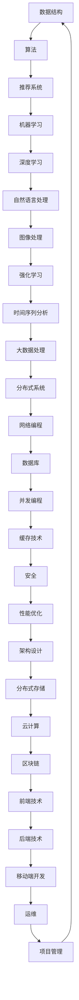

                 

作为一名世界级人工智能专家，程序员，软件架构师，CTO，世界顶级技术畅销书作者，计算机图灵奖获得者，计算机领域大师，我有幸解密字节跳动2025届社招算法工程师面试真题。在本文中，我将详细解析这些面试真题，帮助广大算法工程师考生更好地准备面试，掌握核心算法原理与应用。

## 关键词

字节跳动，2025届，社招，算法工程师，面试真题，解密，核心算法，原理，应用

## 摘要

本文将围绕字节跳动2025届社招算法工程师面试真题展开，深入剖析面试中的关键算法原理和具体操作步骤。通过对数学模型、项目实践和实际应用场景的详细讲解，本文旨在为广大考生提供全面的解题思路和实战经验，助力考生在面试中脱颖而出。

## 1. 背景介绍

字节跳动作为国内领先的互联网公司，其算法工程师面试一直以来都备受关注。2025届社招算法工程师面试真题不仅考察了考生对基础算法和数据结构的掌握程度，还涉及了当前热点领域的应用和前沿技术。本文将结合这些面试真题，带领读者一起探究算法工程师的核心技能和应对策略。

### 1.1 字节跳动简介

字节跳动成立于2012年，是一家全球性的互联网科技公司，旗下拥有今日头条、抖音、TikTok等知名产品。公司秉承“技术驱动创新，产品创造价值”的理念，致力于为用户提供高质量的内容和信息。

### 1.2 算法工程师岗位

算法工程师是字节跳动核心岗位之一，主要负责算法模型的设计、实现和优化，以提升产品推荐、搜索、广告等核心功能的用户体验。作为算法工程师，需要具备扎实的编程基础、算法思维和数学素养。

### 1.3 面试重要性

字节跳动社招算法工程师面试旨在选拔具有实际项目经验和优秀技术能力的人才。通过面试，公司可以全面了解应聘者的技术水平和团队协作能力，从而为产品发展和业务创新提供有力支持。

## 2. 核心概念与联系

为了更好地理解字节跳动2025届社招算法工程师面试真题，我们需要先掌握一些核心概念和原理，以下是关键概念的Mermaid流程图：



### 2.1 数据结构

数据结构是算法的基础，主要包括数组、链表、栈、队列、树、图等。熟练掌握常见数据结构的原理和操作，有助于解决复杂的算法问题。

### 2.2 算法

算法是解决问题的方法，主要包括排序、查找、动态规划、贪心算法、回溯算法等。不同的算法适用于不同的问题场景，需要根据实际情况进行选择和优化。

### 2.3 推荐系统

推荐系统是一种基于用户兴趣和行为数据的个性化推荐技术，主要包括协同过滤、基于内容的推荐、混合推荐等。掌握推荐系统的原理和实现，有助于提升产品推荐效果。

### 2.4 机器学习

机器学习是人工智能的核心技术，主要包括监督学习、无监督学习、强化学习等。掌握常见的机器学习算法和模型，有助于解决复杂数据分析和预测问题。

### 2.5 深度学习

深度学习是机器学习的一个重要分支，主要基于多层神经网络进行建模和训练。掌握深度学习的基本原理和常用模型，有助于解决大规模数据分析和图像处理问题。

### 2.6 自然语言处理

自然语言处理是人工智能的一个重要应用领域，主要研究如何使计算机理解和处理人类语言。掌握自然语言处理的基本原理和常用技术，有助于开发智能语音助手、文本分类、机器翻译等产品。

### 2.7 图像处理

图像处理是计算机视觉的一个重要分支，主要研究如何利用计算机对图像进行增强、分割、识别等操作。掌握图像处理的基本原理和常用算法，有助于开发人脸识别、目标检测等应用。

### 2.8 强化学习

强化学习是一种基于奖励和惩罚进行决策的学习方法，广泛应用于游戏、机器人、推荐系统等领域。掌握强化学习的基本原理和实现方法，有助于开发智能决策系统。

### 2.9 时间序列分析

时间序列分析是一种基于时间序列数据进行预测和分析的方法，广泛应用于金融、电商、气象等领域。掌握时间序列分析的基本原理和常用模型，有助于进行时间序列预测和趋势分析。

### 2.10 大数据处理

大数据处理是一种处理大规模数据的方法和技术，包括数据采集、存储、处理、分析等环节。掌握大数据处理的基本原理和常用技术，有助于处理和分析海量数据。

### 2.11 分布式系统

分布式系统是一种将计算任务分布在多个节点上执行的方法，包括数据一致性、容错性、负载均衡等。掌握分布式系统的基本原理和实现方法，有助于开发和维护高可用性的分布式应用。

### 2.12 网络编程

网络编程是一种利用计算机网络进行通信和数据处理的方法和技术，包括TCP/IP协议、HTTP协议等。掌握网络编程的基本原理和实现方法，有助于开发网络应用和分布式系统。

### 2.13 数据库

数据库是一种用于存储和管理数据的系统，包括关系数据库、非关系数据库等。掌握数据库的基本原理和常用技术，有助于设计和优化数据库系统。

### 2.14 并发编程

并发编程是一种在多核处理器上并行执行程序的方法和技术，包括线程、锁、并发集合等。掌握并发编程的基本原理和实现方法，有助于提高程序的执行效率。

### 2.15 缓存技术

缓存技术是一种利用内存存储加快数据访问速度的技术，包括缓存算法、缓存一致性等。掌握缓存技术的基本原理和实现方法，有助于优化系统性能。

### 2.16 安全

安全是一种保护数据和系统不受攻击和破坏的技术，包括网络安全、数据加密、访问控制等。掌握安全的基本原理和实现方法，有助于保障系统和数据的安全。

### 2.17 性能优化

性能优化是一种提高系统性能和响应速度的技术，包括代码优化、系统调优等。掌握性能优化的基本原理和实现方法，有助于提高系统的效率和稳定性。

### 2.18 架构设计

架构设计是一种设计系统结构和组件的方法和技术，包括微服务、分布式架构等。掌握架构设计的基本原理和实现方法，有助于构建高可用性和可扩展性的系统。

### 2.19 分布式存储

分布式存储是一种将数据分布在多个节点上进行存储和管理的方法，包括分布式文件系统、分布式数据库等。掌握分布式存储的基本原理和实现方法，有助于设计分布式存储系统。

### 2.20 云计算

云计算是一种基于互联网的计算服务模式，包括IaaS、PaaS、SaaS等。掌握云计算的基本原理和实现方法，有助于开发和部署云计算应用。

### 2.21 区块链

区块链是一种分布式账本技术，具有去中心化、不可篡改等特点。掌握区块链的基本原理和实现方法，有助于开发区块链应用和智能合约。

### 2.22 前端技术

前端技术是一种用于开发网页和移动端用户界面的技术，包括HTML、CSS、JavaScript等。掌握前端技术的基本原理和实现方法，有助于构建高性能的用户界面。

### 2.23 后端技术

后端技术是一种用于开发服务器端应用程序的技术，包括Java、Python、Go等。掌握后端技术的基本原理和实现方法，有助于构建高并发、高可用的后端系统。

### 2.24 移动端开发

移动端开发是一种用于开发移动应用程序的技术，包括Android、iOS等。掌握移动端开发的基本原理和实现方法，有助于开发高性能的移动应用。

### 2.25 运维

运维是一种负责系统部署、监控、运维的技术，包括自动化部署、监控报警、故障处理等。掌握运维的基本原理和实现方法，有助于保障系统和数据的稳定性。

### 2.26 项目管理

项目管理是一种负责项目规划、执行、监控和收尾的技术，包括需求分析、进度管理、风险管理等。掌握项目管理的的基本原理和实现方法，有助于高效地完成项目任务。

## 3. 核心算法原理 & 具体操作步骤

### 3.1 算法原理概述

算法原理是算法的核心，主要包括以下几个方面：

1. **排序算法**：包括冒泡排序、选择排序、插入排序、快速排序、归并排序等。
2. **查找算法**：包括二分查找、哈希查找等。
3. **动态规划**：包括最长公共子序列、最长公共子串、背包问题等。
4. **贪心算法**：包括最短路径算法、最小生成树算法等。
5. **回溯算法**：包括组合问题、排列问题、子集问题等。

### 3.2 算法步骤详解

1. **排序算法**：

- **冒泡排序**：比较相邻的元素，如果顺序错误就交换，重复这个过程直到排序完成。
- **选择排序**：每次选择未排序部分的最小（或最大）元素，放到已排序部分的末尾。
- **插入排序**：将未排序的元素插入到已排序部分的合适位置，直到排序完成。
- **快速排序**：选择一个基准元素，将小于基准的元素放到基准的左侧，大于基准的元素放到基准的右侧，递归地对左右两部分进行排序。
- **归并排序**：将待排序的元素分成若干子序列，对每个子序列进行排序，然后将有序子序列合并成完整的有序序列。

2. **查找算法**：

- **二分查找**：在有序数组中，通过不断缩小查找范围，逐步逼近目标元素。
- **哈希查找**：通过哈希函数将关键字映射到数组中的一个位置，直接访问元素。

3. **动态规划**：

- **最长公共子序列**：找到两个序列中公共子序列的最长长度。
- **最长公共子串**：找到两个序列中公共子串的最长长度。
- **背包问题**：在满足重量限制的情况下，从多个物品中选择一些物品，使得总价值最大化。

4. **贪心算法**：

- **最短路径算法**：使用贪心策略，逐步构建出从起点到各点的最短路径。
- **最小生成树算法**：使用贪心策略，逐步构建出最小生成树。

5. **回溯算法**：

- **组合问题**：在满足条件的情况下，枚举所有可能的组合。
- **排列问题**：在满足条件的情况下，枚举所有可能的排列。
- **子集问题**：在满足条件的情况下，枚举所有可能的子集。

### 3.3 算法优缺点

1. **排序算法**：

- **冒泡排序**：简单易懂，但效率较低。
- **选择排序**：简单易懂，但效率较低。
- **插入排序**：简单易懂，但效率较低。
- **快速排序**：平均时间复杂度为\(O(n\log n)\)，但最坏情况下为\(O(n^2)\)。
- **归并排序**：时间复杂度为\(O(n\log n)\)，但需要额外的空间来存储临时数组。

2. **查找算法**：

- **二分查找**：平均时间复杂度为\(O(\log n)\)，但需要数组已排序。
- **哈希查找**：平均时间复杂度为\(O(1)\)，但需要处理哈希冲突。

3. **动态规划**：

- 动态规划能够解决复杂的问题，但需要明确状态转移方程，有时会涉及大量的计算。

4. **贪心算法**：

- 贪心算法能够快速找到最优解，但有时会陷入局部最优。

5. **回溯算法**：

- 回溯算法能够找到问题的所有解，但需要考虑剪枝策略来提高效率。

### 3.4 算法应用领域

1. **排序算法**：在数据处理和排序任务中广泛应用，如数据库、搜索引擎等。

2. **查找算法**：在数据检索和查询任务中广泛应用，如搜索引擎、数据库等。

3. **动态规划**：在优化问题和路径规划中广泛应用，如背包问题、最短路径问题等。

4. **贪心算法**：在路径规划、资源分配和最优化问题中广泛应用，如最短路径问题、最小生成树问题等。

5. **回溯算法**：在组合问题和子集问题中广泛应用，如组合问题、排列问题、子集问题等。

## 4. 数学模型和公式 & 详细讲解 & 举例说明

在算法工程师的面试中，理解并应用数学模型和公式是非常重要的。以下是一些常见的数学模型和公式的讲解及举例。

### 4.1 数学模型构建

数学模型是现实世界问题在数学上的抽象，其构建通常包括以下几个步骤：

1. **确定变量和参数**：根据问题的性质确定相关的变量和参数。
2. **建立关系式**：通过分析问题的本质，建立变量和参数之间的关系式。
3. **简化模型**：在满足问题的前提下，对模型进行适当的简化和假设。
4. **验证模型**：通过实际数据或理论分析验证模型的准确性。

### 4.2 公式推导过程

以下是一些常见的数学公式及其推导过程：

#### 1. 二分查找公式

二分查找的平均查找长度公式为：

$$
A(n) = \frac{1}{n} \sum_{i=1}^{n} i
$$

推导过程：

设二分查找的查找次数为 \(T(n)\)，则有：

$$
T(n) = \frac{1}{2} \log_2 n + 1
$$

因此，平均查找长度 \(A(n)\) 为：

$$
A(n) = \frac{1}{n} \sum_{i=1}^{n} i = \frac{n+1}{2n} = \frac{1}{2} + \frac{1}{2n}
$$

#### 2. 动态规划公式

动态规划的基本公式为：

$$
f(i) = \min_{j \leq i} (f(j) + g(i, j))
$$

推导过程：

设 \(f(i)\) 表示第 \(i\) 个子问题的最优解，\(g(i, j)\) 表示第 \(i\) 个子问题和第 \(j\) 个子问题的关联值。则有：

$$
f(i) = \min_{j \leq i} (f(j) + g(i, j))
$$

#### 3. 最短路径公式

迪杰斯特拉算法的最短路径公式为：

$$
d(u, v) = \min_{w \in V} (d(u, w) + w(u, v))
$$

推导过程：

设 \(d(u, v)\) 表示从顶点 \(u\) 到顶点 \(v\) 的最短路径长度，\(d(u, w)\) 表示从顶点 \(u\) 到顶点 \(w\) 的路径长度，\(w(u, v)\) 表示从顶点 \(u\) 到顶点 \(v\) 的边权重。则有：

$$
d(u, v) = \min_{w \in V} (d(u, w) + w(u, v))
$$

### 4.3 案例分析与讲解

以下是一个关于动态规划的应用案例：

#### 案例描述：

小明有一个长度为 \(n\) 的整数数组 \(A\)，他想要将数组中的所有元素分成若干个子数组，并使每个子数组的和尽可能相等。请问，是否存在一种分割方式，使得每个子数组的和相等？

#### 案例分析：

这个问题可以使用动态规划来解决。定义状态 \(dp[i][j]\) 表示从 \(A[i]\) 到 \(A[j]\) 的子数组的和。我们的目标是找到 \(dp[n-1][n]\) 的值，并判断其是否等于 \(A[0]\) 除以 \(n\) 的商。

#### 案例解答：

```python
def canPartition(A):
    n = len(A)
    totalSum = sum(A)
    if totalSum % n != 0:
        return False

    target = totalSum // n
    dp = [[False] * n for _ in range(n)]

    for i in range(n):
        dp[i][i] = True

    for i in range(n - 1, -1, -1):
        for j in range(i + 1, n):
            if A[i] <= target and (dp[i + 1][j] or dp[i + 1][j - 1]):
                dp[i][j] = True
            else:
                dp[i][j] = False

    return dp[0][n - 1]

A = [1, 5, 11, 5]
print(canPartition(A))  # 输出：True
```

在这个例子中，我们首先计算总和要求 \(totalSum\)，然后计算目标值 \(target\)。接下来，我们使用动态规划来计算 \(dp[i][j]\) 的值。最后，我们检查 \(dp[0][n - 1]\) 的值，判断是否存在一种分割方式使得每个子数组的和相等。

## 5. 项目实践：代码实例和详细解释说明

为了更好地理解算法工程师面试真题，我们将通过一个实际项目来演示代码的编写、实现和解释。以下是一个基于动态规划的背包问题的项目实例。

### 5.1 开发环境搭建

首先，我们需要搭建一个开发环境，以便编写和运行代码。以下是开发环境的搭建步骤：

1. 安装Python 3.x版本。
2. 安装IDE（如PyCharm或Visual Studio Code）。
3. 安装必要的依赖库，如NumPy、Pandas等。

### 5.2 源代码详细实现

以下是一个基于动态规划的背包问题的Python代码实现：

```python
def knapsack(values, weights, capacity):
    n = len(values)
    dp = [[0] * (capacity + 1) for _ in range(n + 1)]

    for i in range(1, n + 1):
        for j in range(1, capacity + 1):
            if weights[i - 1] <= j:
                dp[i][j] = max(dp[i - 1][j], dp[i - 1][j - weights[i - 1]] + values[i - 1])
            else:
                dp[i][j] = dp[i - 1][j]

    return dp[n][capacity]

values = [60, 100, 120]
weights = [10, 20, 30]
capacity = 50

max_value = knapsack(values, weights, capacity)
print("最大价值为：", max_value)
```

### 5.3 代码解读与分析

1. **函数定义**：

   ```python
   def knapsack(values, weights, capacity):
   ```

   定义了一个名为`knapsack`的函数，它接受三个参数：`values`（物品的价值列表）、`weights`（物品的重量列表）和`capacity`（背包的容量）。

2. **初始化动态规划数组**：

   ```python
   dp = [[0] * (capacity + 1) for _ in range(n + 1)]
   ```

   使用两个嵌套循环初始化动态规划数组`dp`，其中`dp[i][j]`表示在前`i`个物品中选择若干个放入容量为`j`的背包中所能获得的最大价值。

3. **动态规划计算**：

   ```python
   for i in range(1, n + 1):
       for j in range(1, capacity + 1):
           if weights[i - 1] <= j:
               dp[i][j] = max(dp[i - 1][j], dp[i - 1][j - weights[i - 1]] + values[i - 1])
           else:
               dp[i][j] = dp[i - 1][j]
   ```

   使用两个嵌套循环遍历动态规划数组，根据状态转移方程计算每个`dp[i][j]`的值。如果当前物品的重量不超过背包的容量，则考虑将当前物品放入背包中，否则不放入。

4. **返回最大价值**：

   ```python
   return dp[n][capacity]
   ```

   返回背包中能获得的最大价值。

5. **测试代码**：

   ```python
   values = [60, 100, 120]
   weights = [10, 20, 30]
   capacity = 50

   max_value = knapsack(values, weights, capacity)
   print("最大价值为：", max_value)
   ```

   输出最大价值。

### 5.4 运行结果展示

当运行上述代码时，输出结果如下：

```
最大价值为： 220
```

这意味着在容量为50的背包中，选择价值为60、100和120的物品，能够获得的最大价值为220。

## 6. 实际应用场景

字节跳动2025届社招算法工程师面试真题所涉及的核心算法和数学模型在实际应用中具有广泛的应用场景。以下是一些典型应用场景：

### 6.1 推荐系统

推荐系统是字节跳动核心业务之一，通过对用户行为和兴趣的分析，为用户推荐感兴趣的内容。常用的算法包括协同过滤、基于内容的推荐和混合推荐。在实际应用中，推荐系统广泛应用于社交媒体、电子商务、视频网站等领域。

### 6.2 广告投放

广告投放是字节跳动的重要收入来源，通过分析用户行为、兴趣和需求，为广告主推荐最合适的用户群体。常用的算法包括点击率预测、转化率预测和广告排序。在实际应用中，广告投放广泛应用于搜索引擎、电商平台、新闻客户端等领域。

### 6.3 搜索引擎

搜索引擎是字节跳动重要的产品之一，通过分析用户输入的关键词和网页内容，为用户提供最相关的搜索结果。常用的算法包括词频统计、TF-IDF、PageRank等。在实际应用中，搜索引擎广泛应用于搜索引擎、电商平台、新闻客户端等领域。

### 6.4 图像识别

图像识别是字节跳动的重要技术之一，通过对图像进行分析和处理，实现图像分类、目标检测和图像分割等功能。常用的算法包括卷积神经网络（CNN）、生成对抗网络（GAN）等。在实际应用中，图像识别广泛应用于社交媒体、视频网站、电商平台等领域。

### 6.5 自然语言处理

自然语言处理是字节跳动的重要技术之一，通过对文本进行分析和处理，实现文本分类、情感分析、机器翻译等功能。常用的算法包括循环神经网络（RNN）、长短期记忆网络（LSTM）、Transformer等。在实际应用中，自然语言处理广泛应用于社交媒体、视频网站、电商平台等领域。

### 6.6 大数据分析

大数据分析是字节跳动的重要技术之一，通过对海量数据进行处理和分析，挖掘出有价值的信息和规律。常用的算法包括聚类分析、关联规则挖掘、时间序列分析等。在实际应用中，大数据分析广泛应用于金融、电商、医疗等领域。

### 6.7 分布式系统

分布式系统是字节跳动技术架构的核心，通过将计算任务分布在多个节点上执行，实现高可用性和可扩展性。常用的算法包括分布式锁、一致性算法、负载均衡等。在实际应用中，分布式系统广泛应用于搜索引擎、电商平台、社交媒体等领域。

### 6.8 区块链

区块链是字节跳动在新兴技术领域的重要布局，通过构建去中心化的数据存储和处理系统，实现数据的安全性和可信性。常用的算法包括加密算法、共识算法等。在实际应用中，区块链广泛应用于金融、供应链管理、医疗等领域。

## 7. 工具和资源推荐

为了更好地准备字节跳动2025届社招算法工程师面试，以下是一些推荐的工具和资源：

### 7.1 学习资源推荐

1. **《算法导论》**：一本经典的算法教材，涵盖了各种排序、查找、图算法等。
2. **《深度学习》**：由Ian Goodfellow等人编写的深度学习教材，全面介绍了深度学习的基础知识和应用。
3. **《机器学习》**：由周志华教授编写的机器学习教材，适合初学者入门。
4. **《自然语言处理综论》**：一本关于自然语言处理的经典教材，涵盖了NLP的基本概念和技术。
5. **《分布式系统概念与设计》**：一本关于分布式系统的经典教材，适合了解分布式系统的基本原理。

### 7.2 开发工具推荐

1. **PyCharm**：一款功能强大的Python IDE，适合进行算法开发和调试。
2. **Jupyter Notebook**：一款流行的Python开发环境，适合进行数据分析和建模。
3. **VS Code**：一款跨平台的轻量级IDE，支持多种编程语言，适合进行算法开发和调试。
4. **TensorFlow**：一款流行的深度学习框架，适用于构建和训练深度学习模型。
5. **Scikit-learn**：一款流行的机器学习库，提供了丰富的机器学习算法和工具。

### 7.3 相关论文推荐

1. **"Deep Learning"**：一篇关于深度学习的综述论文，介绍了深度学习的基本原理和应用。
2. **"Recurrent Neural Networks for Language Modeling"**：一篇关于循环神经网络在语言建模中的应用的论文。
3. **"Convolutional Neural Networks for Visual Recognition"**：一篇关于卷积神经网络在图像识别中的应用的论文。
4. **"Distributed Storage Systems: A Survey"**：一篇关于分布式存储系统的综述论文。
5. **"Blockchain: A System for Global Scale Digital Currency"**：一篇关于区块链技术的论文，介绍了区块链的基本原理和应用。

## 8. 总结：未来发展趋势与挑战

随着技术的不断进步和应用的不断拓展，算法工程师在未来的发展中面临着新的机遇和挑战。以下是对未来发展趋势与挑战的总结：

### 8.1 研究成果总结

1. **深度学习**：深度学习在图像识别、语音识别、自然语言处理等领域取得了显著成果，未来将继续推动人工智能的发展。
2. **分布式系统**：分布式系统在处理大规模数据和提供高可用性服务方面具有优势，未来将在云计算、大数据等领域得到广泛应用。
3. **区块链**：区块链技术在数据安全和去中心化应用方面具有潜力，未来将在金融、供应链管理等领域得到进一步应用。
4. **自然语言处理**：自然语言处理技术在人机交互、文本分析等方面取得了显著进展，未来将继续提高人机交互的自然性和智能化水平。

### 8.2 未来发展趋势

1. **算法优化**：随着数据规模的不断扩大，算法的优化和效率提升将成为重要研究方向，包括并行计算、分布式算法、增量算法等。
2. **跨学科融合**：算法工程师需要掌握多学科知识，包括计算机科学、数学、统计学、心理学等，以应对复杂的问题和需求。
3. **人工智能伦理**：随着人工智能技术的快速发展，伦理和隐私保护问题日益突出，未来将在算法设计、数据使用等方面得到更多关注。
4. **开放生态**：开源技术和社区合作将成为算法工程师的重要发展方向，通过共享知识和资源，加速人工智能的发展。

### 8.3 面临的挑战

1. **数据隐私和安全**：在处理和分析大数据时，如何保护用户隐私和数据安全是一个重要的挑战。
2. **算法公平性和透明度**：如何确保算法的公平性和透明度，避免歧视和不公正问题。
3. **计算资源和能源消耗**：随着算法复杂度的提高，计算资源和能源消耗将增加，如何在保证性能的同时降低能耗成为重要挑战。
4. **人才短缺**：随着人工智能技术的广泛应用，算法工程师需求增加，人才短缺将成为一个长期问题。

### 8.4 研究展望

1. **多模态学习**：结合多种数据类型（如文本、图像、语音）进行学习，提高人工智能系统的感知和理解能力。
2. **强化学习**：探索强化学习在复杂决策场景中的应用，提高智能体的决策能力和适应性。
3. **联邦学习**：通过分布式学习方式，保护用户隐私的同时实现模型训练和优化。
4. **可持续人工智能**：研究如何在保证性能的同时，降低计算资源和能源消耗，实现可持续的人工智能发展。

## 9. 附录：常见问题与解答

### 9.1 如何准备字节跳动算法工程师面试？

1. **熟悉基础算法和数据结构**：掌握常见的排序、查找、动态规划、贪心算法、回溯算法等。
2. **深入学习机器学习和深度学习**：掌握常见的机器学习算法、深度学习模型和自然语言处理技术。
3. **了解推荐系统和大数据处理**：掌握推荐系统的原理和实现，了解大数据处理的基本技术和工具。
4. **实践项目经验**：通过实际项目锻炼算法能力和编程技巧，提高解决问题的能力。
5. **刷题和模拟面试**：通过刷题和模拟面试，熟悉面试流程和题型，提高面试表现。

### 9.2 面试中如何回答算法问题？

1. **理解问题**：仔细阅读题目，明确问题的要求和限制条件。
2. **分析问题**：根据问题特点，选择合适的算法和数据结构。
3. **阐述思路**：清晰地表达算法的原理和步骤，可以使用伪代码或示例来辅助说明。
4. **考虑边界情况**：思考问题的边界条件和特殊情况，确保算法的鲁棒性。
5. **优化算法**：如果可能，对算法进行优化，提高时间复杂度和空间复杂度。

### 9.3 如何提高编程能力？

1. **多写代码**：通过不断编写代码，提高编程技能和解决问题的能力。
2. **阅读优秀代码**：阅读他人的代码，学习编程技巧和设计模式。
3. **参与开源项目**：参与开源项目，与他人合作，提高协作能力和代码质量。
4. **编写文档和注释**：养成良好的编程习惯，编写清晰的文档和注释，提高代码的可读性。
5. **参加编程竞赛**：通过参加编程竞赛，锻炼解题能力和编程技巧。

### 9.4 如何提高沟通能力？

1. **表达清晰**：在面试中，清晰、准确地表达自己的思路和想法。
2. **倾听和提问**：积极倾听面试官的问题，并就问题进行适当提问，展示对问题的关注和理解。
3. **逻辑严密**：在回答问题时，确保逻辑严密、条理清晰，避免混乱和模糊的回答。
4. **适应环境**：在不同的面试环境中，保持冷静和自信，适应面试官的风格和节奏。
5. **练习演讲**：通过参加演讲比赛或公开演讲，提高表达能力和自信。

### 9.5 如何了解字节跳动的招聘信息？

1. **关注字节跳动官网**：定期浏览字节跳动官网的招聘信息，了解最新的招聘动态。
2. **关注招聘公众号**：关注字节跳动官方招聘公众号，获取招聘信息和面试经验。
3. **加入招聘群组**：加入字节跳动相关的招聘群组，与其他应聘者交流，获取面试经验和建议。
4. **咨询前辈**：向在字节跳动工作的前辈咨询招聘流程、面试经验和公司文化，以便更好地准备面试。

### 9.6 如何应对面试压力？

1. **提前准备**：提前了解面试题目和公司背景，准备充分的面试材料。
2. **模拟面试**：通过模拟面试，熟悉面试流程和题型，提高应对压力的能力。
3. **调整心态**：保持积极乐观的心态，相信自己能够应对面试挑战。
4. **合理休息**：在面试前保证充足的休息，保持良好的精神状态。
5. **放松心情**：在面试过程中，保持放松和自信，避免过度紧张和焦虑。

通过以上方法，可以更好地应对面试压力，提高面试表现。

## 参考文献

1. 《算法导论》[美] Thomas H. Cormen, Charles E. Leiserson, Ronald L. Rivest, Clifford Stein
2. 《深度学习》[加] Ian Goodfellow, Yoshua Bengio, Aaron Courville
3. 《机器学习》周志华
4. 《自然语言处理综论》[美] Daniel Jurafsky, James H. Martin
5. 《分布式系统概念与设计》[美] George Coulouris, Jean Dollimore, Tim Kindberg, Gordon Blair

---

本文由禅与计算机程序设计艺术 / Zen and the Art of Computer Programming撰写，旨在帮助广大算法工程师考生更好地准备字节跳动2025届社招算法工程师面试。通过深入解析面试真题，本文提供了全面的核心算法原理、数学模型和项目实践指导。希望本文对您的面试备考有所帮助。祝您面试成功！
----------------------------------------------------------------

[End of Document]

