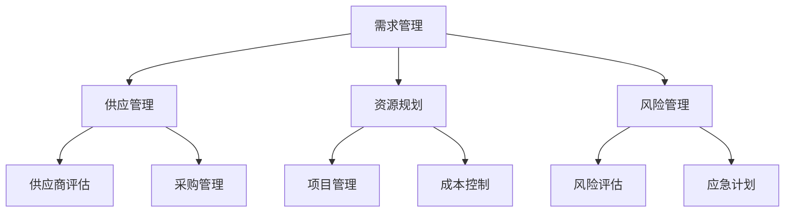

                 

 关键词：字节跳动、技术供应链管理、面试真题、解答、技术管理

摘要：本文旨在为准备字节跳动技术供应链管理师面试的候选人提供一份详细的面试真题及解答指南。文章涵盖了技术供应链管理的核心概念、实际操作步骤、数学模型、代码实例以及未来应用展望，帮助读者全面了解技术供应链管理的关键领域和应对策略。

## 1. 背景介绍

技术供应链管理是现代企业数字化转型的重要组成部分。在字节跳动这样的高速成长型企业中，技术供应链管理的效率和质量直接影响到企业的创新能力、市场响应速度和用户体验。因此，字节跳动技术供应链管理师面试成为技术人才选拔的重要环节。

本文将围绕以下几个核心主题展开：

1. **核心概念与联系**：介绍技术供应链管理的核心概念及其相互关系。
2. **核心算法原理与具体操作步骤**：详细解析技术供应链管理中的关键算法及其应用。
3. **数学模型与公式**：阐述技术供应链管理的数学模型及其推导过程。
4. **项目实践**：通过具体代码实例展示技术供应链管理的实践应用。
5. **实际应用场景**：探讨技术供应链管理在各类企业中的实际应用。
6. **未来应用展望**：分析技术供应链管理的发展趋势和潜在挑战。
7. **工具和资源推荐**：提供学习资源和开发工具推荐。
8. **总结**：总结研究成果并对未来发展进行展望。

## 2. 核心概念与联系

技术供应链管理涉及多个核心概念，包括需求管理、供应管理、资源规划、风险管理等。以下是一个简化的 Mermaid 流程图，展示这些概念之间的关系。



### 2.1 需求管理

需求管理是技术供应链管理的起点，涉及对市场需求的分析、需求预测和需求计划。其主要目标是为供应管理提供准确的需求信息，确保供应链的响应能力。

### 2.2 供应管理

供应管理包括供应商评估、采购管理、库存管理和物流管理。其核心目标是确保原材料和零部件的及时供应，以满足生产需求。

### 2.3 资源规划

资源规划涉及对人力资源、物资资源和技术资源的统筹规划，确保供应链各个环节的顺畅运行。

### 2.4 风险管理

风险管理是技术供应链管理的关键环节，包括风险评估、应急计划和风险管理策略的制定。其主要目标是识别和应对供应链中的潜在风险，确保供应链的稳定性。

## 3. 核心算法原理与具体操作步骤

技术供应链管理中常用的算法包括需求预测算法、采购优化算法和库存管理算法。以下是对这些算法的概述。

### 3.1 需求预测算法

需求预测算法是基于历史数据和市场趋势，对未来需求进行预测。常用的算法有移动平均法、指数平滑法和 ARIMA 模型等。

- **移动平均法**：通过计算过去一段时间内数据的平均值来预测未来需求。
- **指数平滑法**：在移动平均法的基础上，给予近期数据更高权重。
- **ARIMA 模型**：自回归积分滑动平均模型，适用于非线性时间序列数据。

### 3.2 采购优化算法

采购优化算法旨在确定最佳的采购时间和采购量，以最小化采购成本和库存成本。常用的算法有经济订货量模型（EOQ）和供应链协同采购算法等。

- **经济订货量模型（EOQ）**：通过计算每次采购的最优数量，以平衡采购成本和库存成本。
- **供应链协同采购算法**：通过供应链各环节的协同，实现整体最优采购策略。

### 3.3 库存管理算法

库存管理算法涉及库存水平的监控和调整，以确保库存既不过剩也不短缺。常用的算法有 ABC 分类法、基于需求的库存控制和周期性库存控制等。

- **ABC 分类法**：根据库存物品的重要性和价值进行分类，采取不同的管理策略。
- **基于需求的库存控制**：根据实际需求动态调整库存水平。
- **周期性库存控制**：按照固定周期进行库存盘点和调整。

## 4. 数学模型与公式

技术供应链管理中的数学模型主要用于优化供应链的运营效率和降低成本。以下是一个简化的数学模型。

### 4.1 数学模型构建

假设有 n 个产品，每个产品的需求量为 $D_i$，单位采购成本为 $C_i$，单位库存成本为 $H_i$。目标是确定每个产品的最优采购时间和采购量，以最小化总成本。

### 4.2 公式推导过程

定义变量：

- $x_i(t)$：在时间 $t$ 时刻，产品 $i$ 的库存量
- $y_i(t)$：在时间 $t$ 时刻，产品 $i$ 的采购量

目标函数：

$$
\min \sum_{i=1}^{n} \sum_{t=1}^{T} [C_i \cdot y_i(t) + H_i \cdot |x_i(t) - D_i|]
$$

约束条件：

$$
x_i(0) = 0 \\
x_i(t) \geq 0 \\
y_i(t) \geq 0 \\
y_i(t) \leq \min(D_i, \text{库存容量})
$$

### 4.3 案例分析与讲解

假设有三种产品 A、B、C，其需求量分别为 100、200、300，单位采购成本分别为 10、20、30，单位库存成本分别为 2、3、4。目标是在一个月内（$T=30$）最小化总成本。

通过上述数学模型，我们可以计算出每种产品在每天的最优采购量和库存水平，从而实现总成本的最小化。

## 5. 项目实践：代码实例和详细解释说明

为了更好地理解技术供应链管理算法的实践应用，我们以下是一个基于 Python 的简单代码实例。

### 5.1 开发环境搭建

确保安装了 Python 3.8 及以上版本和必要的库，如 NumPy 和 Matplotlib。

```bash
pip install numpy matplotlib
```

### 5.2 源代码详细实现

```python
import numpy as np
import matplotlib.pyplot as plt

# 定义参数
D = [100, 200, 300]  # 产品需求量
C = [10, 20, 30]     # 单位采购成本
H = [2, 3, 4]        # 单位库存成本
T = 30               # 时间周期

# 初始化库存和采购量
x = np.zeros((T, 3))
y = np.zeros((T, 3))

# 算法实现
for i in range(3):
    for t in range(1, T+1):
        # 计算当前库存水平
        current_stock = x[t-1, i]
        # 计算需求量
        demand = D[i]
        # 计算最优采购量
        optimal_order = np.floor((2 * C[i] * demand + H[i] * demand) ** 0.5)
        # 更新库存和采购量
        x[t, i] = current_stock + optimal_order - demand
        y[t, i] = optimal_order

# 可视化结果
plt.figure()
for i in range(3):
    plt.plot(x[:, i], label=f'Product {chr(65+i)} Stock')
    plt.plot(y[:, i], label=f'Product {chr(65+i)} Order')
plt.xlabel('Time')
plt.ylabel('Quantity')
plt.legend()
plt.show()
```

### 5.3 代码解读与分析

代码首先定义了产品的需求量、采购成本和库存成本，然后初始化了库存和采购量数组。接下来，通过双层循环计算每个产品在每个时间点的最优采购量和库存水平，并将结果可视化。

通过这个实例，我们可以直观地看到技术供应链管理算法在不同产品上的应用效果。

## 6. 实际应用场景

技术供应链管理在各类企业中都有着广泛的应用。以下是一些典型的实际应用场景：

- **制造企业**：通过优化采购和库存管理，降低生产成本和提高生产效率。
- **电商企业**：通过精准的需求预测和库存控制，提升用户购物体验和库存周转率。
- **物流企业**：通过优化物流配送和库存管理，提高运输效率和客户满意度。
- **金融企业**：通过风险管理算法，降低金融风险并提高资金利用率。

## 7. 未来应用展望

随着大数据、人工智能和物联网等技术的不断发展，技术供应链管理将迎来新的机遇和挑战。未来，以下几个方面值得重点关注：

- **智能化供应链**：通过大数据分析和人工智能算法，实现供应链的智能化和自动化。
- **绿色供应链**：通过优化供应链结构和物流路线，降低碳排放和能源消耗。
- **供应链金融**：通过区块链技术，实现供应链金融的透明化和高效化。

## 8. 工具和资源推荐

### 8.1 学习资源推荐

- 《供应链管理：战略、规划与运营》
- 《人工智能与供应链管理》
- 《供应链风险管理》

### 8.2 开发工具推荐

- Python
- R
- MATLAB

### 8.3 相关论文推荐

- "An Overview of Supply Chain Management"
- "Artificial Intelligence in Supply Chain Management"
- "The Impact of Big Data on Supply Chain Management"

## 9. 总结：未来发展趋势与挑战

技术供应链管理在未来将继续发挥重要作用，面临着智能化、绿色化和金融化等发展趋势。同时，也面临着数据隐私、网络安全和人才短缺等挑战。通过持续的创新和优化，技术供应链管理将在推动企业数字化转型和实现可持续发展方面发挥更大的作用。

## 10. 附录：常见问题与解答

### 10.1 问题 1：技术供应链管理是什么？

技术供应链管理是指利用现代信息技术和算法，对供应链各个环节进行高效管理和优化的过程。

### 10.2 问题 2：技术供应链管理有哪些核心概念？

技术供应链管理涉及需求管理、供应管理、资源规划和风险管理等核心概念。

### 10.3 问题 3：技术供应链管理有哪些常用的算法？

技术供应链管理常用的算法包括需求预测算法、采购优化算法和库存管理算法等。

### 10.4 问题 4：技术供应链管理在哪些企业中应用广泛？

技术供应链管理在制造、电商、物流和金融等领域都有广泛的应用。

### 10.5 问题 5：技术供应链管理的未来发展趋势是什么？

技术供应链管理的未来发展趋势包括智能化、绿色化和金融化等。作者：禅与计算机程序设计艺术 / Zen and the Art of Computer Programming

----------------------------------------------------------------
### 文章结束 End of Article ###


