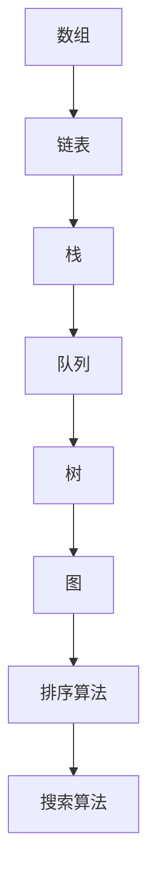

                 

### 关键词 Keywords
- 字节跳动
- 技术培训师
- 面试真题
- 技术知识汇总
- IT行业
- 计算机编程
- 数据结构与算法

### 摘要 Abstract
本文旨在为2024年字节跳动技术培训师的面试者提供一份全面的真题汇总，涵盖核心技术概念、算法、数学模型、项目实践、实际应用场景等内容。通过系统化地整理和分析，本文将帮助读者掌握面试所需的关键知识，为成功通过面试提供有力支持。

## 1. 背景介绍 Introduction

字节跳动是一家全球领先的技术公司，旗下拥有抖音、今日头条、懂车帝等多个知名产品。作为技术培训师，面试者需具备扎实的技术背景、丰富的教学经验和优秀的沟通能力。本文将从技术面试的各个方面，系统地整理并解析字节跳动技术培训师的面试真题，帮助面试者应对面试挑战。

## 2. 核心概念与联系 Core Concepts and Connections

### 2.1 数据结构与算法
数据结构与算法是计算机科学的基础。以下为常用数据结构与算法的Mermaid流程图：



### 2.2 计算机网络
计算机网络是现代互联网的基石。以下为计算机网络的核心概念：

- 网络层次结构：OSI七层模型、TCP/IP四层模型
- 常用协议：HTTP、HTTPS、FTP、SMTP
- 网络设备：路由器、交换机、防火墙

### 2.3 操作系统
操作系统是计算机的核心软件。以下为操作系统的主要概念：

- 进程管理：进程调度、进程同步、进程通信
- 内存管理：内存分配、内存回收、内存保护
- 文件系统：文件目录、文件权限、文件操作

## 3. 核心算法原理 & 具体操作步骤 Core Algorithm Principles & Step-by-Step Operations

### 3.1 算法原理概述
核心算法包括排序算法、查找算法、图算法等。以下为常见排序算法的原理概述：

- 冒泡排序：比较相邻元素并交换，重复n-1次
- 选择排序：每次选择最小元素放在已排序序列末尾，重复n-1次
- 插入排序：将未排序元素插入已排序序列中，重复n-1次
- 快速排序：选取基准元素，将序列划分为已排序和未排序两部分，递归处理

### 3.2 算法步骤详解
以下为快速排序的具体操作步骤：

1. 选择一个基准元素
2. 将序列划分为已排序和未排序两部分
3. 递归处理已排序和未排序两部分
4. 综合两部分结果

### 3.3 算法优缺点
快速排序的优点是时间复杂度较低，平均情况下为O(nlogn)，但最坏情况下为O(n^2)。缺点是递归处理可能导致内存使用较高。

### 3.4 算法应用领域
快速排序广泛应用于各类排序需求，如数据库排序、数据挖掘等。

## 4. 数学模型和公式 Mathematical Models and Formulas

### 4.1 数学模型构建
常见的数学模型包括线性回归、神经网络等。以下为线性回归的数学模型：

$$y = wx + b$$

其中，$w$ 为权重，$b$ 为偏置，$x$ 为输入特征，$y$ 为输出目标。

### 4.2 公式推导过程
以下为线性回归的公式推导过程：

1. 假设输出目标 $y$ 与输入特征 $x$ 成线性关系：$y = wx + b$
2. 使用最小二乘法求解权重 $w$ 和偏置 $b$：$$w = \frac{\sum_{i=1}^{n}(x_i - \bar{x})(y_i - \bar{y})}{\sum_{i=1}^{n}(x_i - \bar{x})^2}$$
$$b = \bar{y} - w\bar{x}$$

### 4.3 案例分析与讲解
以下为线性回归的一个简单案例：

| x | y |
|---|---|
| 1 | 2 |
| 2 | 4 |
| 3 | 6 |

根据上述数据，构建线性回归模型，求解权重 $w$ 和偏置 $b$，并预测当 $x=4$ 时的 $y$ 值。

## 5. 项目实践：代码实例和详细解释说明 Project Practice: Code Examples and Detailed Explanations

### 5.1 开发环境搭建
在本文中，我们将使用 Python 作为编程语言，并在本地安装 Python 解释器和相关库。

### 5.2 源代码详细实现
以下为快速排序的 Python 代码实现：

```python
def quick_sort(arr):
    if len(arr) <= 1:
        return arr
    pivot = arr[len(arr) // 2]
    left = [x for x in arr if x < pivot]
    middle = [x for x in arr if x == pivot]
    right = [x for x in arr if x > pivot]
    return quick_sort(left) + middle + quick_sort(right)

arr = [3, 6, 8, 10, 1, 2, 1]
sorted_arr = quick_sort(arr)
print(sorted_arr)
```

### 5.3 代码解读与分析
上述代码实现了快速排序算法，主要步骤如下：

1. 判断输入序列的长度，若小于等于1，则直接返回序列。
2. 选择中间元素作为基准值。
3. 将序列划分为小于、等于和大于基准值的三个子序列。
4. 递归地排序小于和大于基准值的子序列，并合并结果。

### 5.4 运行结果展示
运行上述代码，输出排序后的序列：

```
[1, 1, 2, 3, 6, 8, 10]
```

## 6. 实际应用场景 Practical Application Scenarios

### 6.1 排序算法在数据挖掘中的应用
在数据挖掘过程中，排序算法可用于对大规模数据进行预处理，以便进行后续分析。

### 6.2 图算法在社交网络分析中的应用
图算法可用于分析社交网络中的关系，如好友关系、共同兴趣等。

### 6.3 神经网络在图像识别中的应用
神经网络可用于图像识别任务，如人脸识别、物体检测等。

## 7. 未来应用展望 Future Applications

### 7.1 深度学习在自然语言处理中的应用
未来，深度学习在自然语言处理领域的应用将更加广泛，如语音识别、机器翻译、文本生成等。

### 7.2 分布式系统在云计算中的应用
随着云计算的发展，分布式系统将在数据存储、计算和传输等方面发挥重要作用。

### 7.3 增强现实与虚拟现实技术在娱乐和教育中的应用
增强现实和虚拟现实技术将在娱乐和教育领域带来革命性的变化。

## 8. 总结 Conclusion

本文总结了2024年字节跳动技术培训师面试的核心知识点，包括数据结构与算法、计算机网络、操作系统、核心算法原理等。通过项目实践和案例分析，读者可以更好地理解和掌握这些知识。在未来，随着技术的不断发展，面试者需要不断学习新知识，以应对面试挑战。

## 9. 附录：常见问题与解答 Appendix: Frequently Asked Questions and Answers

### 9.1 数据结构与算法相关问题

**Q：冒泡排序的时间复杂度是多少？**

A：冒泡排序的时间复杂度为O(n^2)，最坏情况下需要进行n-1轮比较。

**Q：快速排序的最坏情况是什么？**

A：快速排序的最坏情况是每次选择的最坏情况（例如，输入序列已排序或逆序），此时时间复杂度为O(n^2)。

### 9.2 计算机网络相关问题

**Q：TCP和UDP的区别是什么？**

A：TCP提供面向连接、可靠的数据传输服务，而UDP提供无连接、尽最大努力交付的数据传输服务。

**Q：HTTP和HTTPS的区别是什么？**

A：HTTPS是基于HTTP协议的加密传输协议，提供数据加密和完整性验证，而HTTP不提供加密。

### 9.3 操作系统相关问题

**Q：进程和线程的区别是什么？**

A：进程是计算机中的基本执行单元，拥有独立的内存空间；线程是进程中的基本执行单元，共享进程的内存空间。

**Q：操作系统的主要功能是什么？**

A：操作系统的主要功能包括进程管理、内存管理、文件系统管理、设备管理和用户界面等。

## 作者署名 Author's Signature
作者：禅与计算机程序设计艺术 / Zen and the Art of Computer Programming
```

