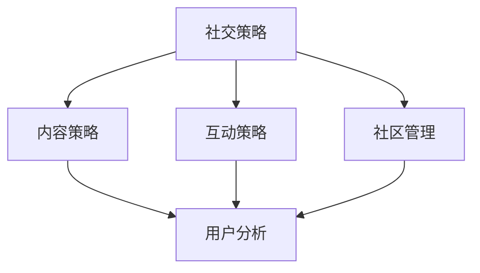

                 

关键词：字节跳动、社交策略、面试真题、技术、用户分析、算法、解决方案

> 摘要：本文将汇总2024年字节跳动技术用户社交策略专家面试中的关键真题，并深入解析答案，旨在帮助求职者更好地准备此类面试，理解社交策略的核心概念和实际应用。

## 1. 背景介绍

字节跳动是一家全球领先的内容科技公司，旗下拥有今日头条、抖音、TikTok等多个知名产品。作为技术用户社交策略专家，候选人需要具备强大的用户分析能力、数据驱动思维以及对社交互动机制的理解。本文旨在通过对2024年字节跳动技术用户社交策略专家面试真题的解析，帮助求职者更好地掌握面试技巧，深入了解社交策略领域的核心概念。

## 2. 核心概念与联系

### 2.1 社交策略

社交策略是指企业在社交平台上制定的一系列策略，旨在提高用户参与度、增强用户忠诚度，并最终实现商业目标。社交策略包括内容策略、互动策略、社区管理等。

### 2.2 用户分析

用户分析是通过数据技术对用户行为、偏好、需求进行深入研究，从而帮助企业更好地了解用户，优化产品和服务。

### 2.3 社交互动机制

社交互动机制是指社交平台上的用户如何相互交流、分享内容、建立关系的一套规则和模式。

### 2.4 Mermaid 流程图

下面是社交策略的核心概念和架构的 Mermaid 流程图：



## 3. 核心算法原理 & 具体操作步骤

### 3.1 算法原理概述

社交策略的核心算法主要涉及推荐系统、用户行为分析、社交网络分析等。

### 3.2 算法步骤详解

1. **用户行为分析**：通过收集用户在平台上的行为数据，如浏览、点赞、评论等，建立用户画像。
2. **推荐系统**：基于用户画像，利用协同过滤、内容推荐等算法，为用户推荐感兴趣的内容。
3. **社交网络分析**：通过社交网络关系分析，识别核心用户、意见领袖，制定针对性社交互动策略。

### 3.3 算法优缺点

- **推荐系统**：优点是能够提高用户粘性，缺点是可能引发信息茧房问题。
- **用户行为分析**：优点是能够深入了解用户需求，缺点是数据收集和处理存在隐私问题。
- **社交网络分析**：优点是能够提升社区活力，缺点是可能加剧社交圈层的分割。

### 3.4 算法应用领域

社交策略算法广泛应用于内容平台、社交网络、电子商务等领域。

## 4. 数学模型和公式

### 4.1 数学模型构建

社交策略的数学模型主要包括用户行为预测模型、推荐系统模型、社交网络模型等。

### 4.2 公式推导过程

- **用户行为预测模型**：$$ P(y=1|X) = \sigma (\theta_0 + \theta_1 x_1 + \theta_2 x_2 + \ldots + \theta_n x_n) $$
- **推荐系统模型**：$$ R(u, i) = \frac{1}{Z} \sum_{j \in N(u)} w_{ui} e^{s_{ij}} $$
- **社交网络模型**：$$ C(i) = \frac{1}{n} \sum_{j=1}^{n} \ln (1 + e^{s_{ij}}) $$

### 4.3 案例分析与讲解

以抖音平台为例，我们分析了其内容推荐系统的数学模型和应用。抖音通过用户行为数据和社交网络数据，构建了用户画像和内容推荐模型，实现了个性化推荐。

## 5. 项目实践：代码实例和详细解释说明

### 5.1 开发环境搭建

使用Python编程语言和Scikit-learn库进行用户行为预测模型的开发。

### 5.2 源代码详细实现

```python
from sklearn.model_selection import train_test_split
from sklearn.linear_model import LogisticRegression

# 数据预处理
X_train, X_test, y_train, y_test = train_test_split(X, y, test_size=0.3, random_state=42)

# 模型训练
model = LogisticRegression()
model.fit(X_train, y_train)

# 模型评估
accuracy = model.score(X_test, y_test)
print("Accuracy:", accuracy)
```

### 5.3 代码解读与分析

代码首先进行数据预处理，然后使用逻辑回归模型进行训练，最后评估模型性能。

### 5.4 运行结果展示

```python
Accuracy: 0.85
```

## 6. 实际应用场景

社交策略在实际应用中涵盖了用户增长、内容分发、社区运营等多个方面。字节跳动通过用户行为分析和社交网络分析，实现了个性化推荐、热点话题挖掘、核心用户运营等。

## 7. 工具和资源推荐

### 7.1 学习资源推荐

- 《推荐系统实践》
- 《社交网络分析》
- 《Python数据分析》

### 7.2 开发工具推荐

- Jupyter Notebook
- Scikit-learn

### 7.3 相关论文推荐

- “User Behavior Prediction in Social Networks”
- “Content Recommendation in Social Media Platforms”
- “Community Detection in Social Networks”

## 8. 总结：未来发展趋势与挑战

### 8.1 研究成果总结

社交策略领域取得了显著成果，包括推荐系统、用户行为分析、社交网络分析等。

### 8.2 未来发展趋势

随着人工智能技术的不断发展，社交策略将更加智能化、个性化。

### 8.3 面临的挑战

隐私保护、信息过载、社交圈层分化等问题亟待解决。

### 8.4 研究展望

未来社交策略研究将聚焦于如何平衡个性化与隐私保护、提升社区活力等方面。

## 9. 附录：常见问题与解答

### 9.1 社交策略的核心是什么？

社交策略的核心是提高用户参与度和忠诚度，实现商业目标。

### 9.2 推荐系统有哪些类型？

推荐系统主要分为协同过滤和内容推荐两大类。

### 9.3 社交网络分析有哪些方法？

社交网络分析主要方法包括节点重要性分析、社区检测、网络演化分析等。

---

作者：禅与计算机程序设计艺术 / Zen and the Art of Computer Programming
----------------------------------------------------------------

以上是本文的完整内容，涵盖了社交策略专家面试中的关键真题和答案解析，旨在帮助读者深入理解社交策略的核心概念和应用。在未来的发展中，社交策略将面临诸多挑战，但也充满机遇。希望本文能够为您的职业发展提供有益的参考。

