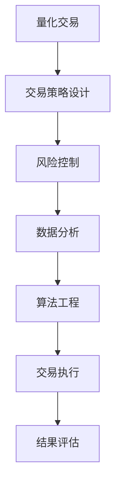

                 

关键词：字节跳动，校招，量化交易，面试题，深度剖析，交易策略，风险控制，数据分析，算法工程。

## 摘要

本文针对2024年字节跳动校招中量化交易工程师岗位的面试题目进行了深度剖析，详细解析了涉及交易策略设计、风险控制、数据分析、算法实现等多个方面的面试题。通过本文，读者可以了解到量化交易工程师所需具备的核心技能和知识体系，为应对此类面试提供有力支持。

## 1. 背景介绍

### 字节跳动公司简介

字节跳动成立于2012年，是一家全球领先的互联网科技公司，旗下拥有多款热门产品，如抖音、今日头条、懂车帝等。公司以算法驱动，致力于为用户创造有价值的内容和服务。在金融科技领域，字节跳动也在积极布局，其中量化交易是重要的业务方向。

### 量化交易工程师岗位概述

量化交易工程师是负责构建、实现和优化量化交易策略的专业人才。他们需要运用数学、统计和计算机科学等领域的知识，通过算法实现自动化交易，并在市场中进行投资决策。该岗位对于求职者的数学功底、编程能力和业务理解能力有较高要求。

### 校招面试的重要性

对于字节跳动这样的互联网巨头，校招面试是公司选拔优秀人才的重要渠道。因此，面试题的设计不仅考察应聘者的专业知识和技能，还会对求职者的逻辑思维、问题解决能力等进行全面评估。对于求职者来说，深入研究面试题有助于了解公司需求和考察方向，提高面试成功率。

## 2. 核心概念与联系

### 量化交易基本概念

量化交易（Quantitative Trading）是指运用数学模型、统计分析和计算机算法进行投资决策的一种交易方式。与传统的手动交易不同，量化交易依靠机器算法自动执行交易策略，从而提高交易效率和收益。

### 交易策略设计

交易策略是量化交易的核心，它决定了交易的入场、出场时机和资金管理。常见的交易策略包括趋势跟踪、均值回归、市场情绪等。

### 风险控制

风险控制是量化交易中至关重要的环节。通过设定合理的仓位管理和止损策略，可以有效降低投资风险，确保交易账户的安全。

### 数据分析

数据分析是量化交易的基础，通过收集、处理和分析市场数据，可以发现市场规律和潜在的投资机会。

### 算法工程

算法工程是将交易策略转化为实际可执行的代码，包括数据预处理、算法实现、回测优化等环节。

### Mermaid 流程图

下面是量化交易工程师面试题涉及的几个核心概念和流程的Mermaid流程图：



## 3. 核心算法原理 & 具体操作步骤

### 3.1 算法原理概述

量化交易的核心算法主要包括以下几种：

1. 趋势跟踪算法：根据市场趋势进行买卖操作，适用于市场波动较大的环境。
2. 均值回归算法：根据价格偏离均值的情况进行买卖操作，适用于市场波动较为稳定的环境。
3. 市场情绪算法：根据市场情绪指标进行买卖操作，适用于捕捉市场波动和情绪变化。

### 3.2 算法步骤详解

1. 数据采集：从各个数据源获取市场数据，包括股票、期货、外汇等。
2. 数据预处理：对采集到的数据进行清洗、归一化和特征提取，为后续分析做准备。
3. 策略设计：根据市场环境和投资目标设计合适的交易策略。
4. 策略回测：在历史数据上运行策略，评估其收益、风险和稳定性。
5. 策略优化：根据回测结果对策略进行优化，提高其表现。
6. 策略实现：将优化后的策略转化为可执行的代码。
7. 交易执行：在实盘环境中运行策略，执行买卖操作。
8. 结果评估：对交易结果进行评估和总结，为后续优化提供依据。

### 3.3 算法优缺点

1. **趋势跟踪算法**：优点：能够捕捉市场大趋势，获取较高收益。缺点：在震荡市场中容易亏损，风险较大。
2. **均值回归算法**：优点：适用于市场波动较为稳定的环境，风险较小。缺点：在趋势市场中收益较低。
3. **市场情绪算法**：优点：能够捕捉市场情绪变化，获取较高收益。缺点：市场情绪波动较大，风险较高。

### 3.4 算法应用领域

量化交易算法广泛应用于股票、期货、外汇、数字货币等多个金融市场。随着大数据和人工智能技术的发展，量化交易算法的应用范围还将不断扩大。

## 4. 数学模型和公式 & 详细讲解 & 举例说明

### 4.1 数学模型构建

量化交易中的数学模型主要包括以下几种：

1. **移动平均模型**：用于预测价格趋势。
2. **回归分析模型**：用于分析价格与交易量之间的关系。
3. **机器学习模型**：用于预测价格和交易量。

### 4.2 公式推导过程

以移动平均模型为例，其公式如下：

\[ MA_t = \frac{\sum_{i=1}^{n} P_i}{n} \]

其中，\( MA_t \) 为第 \( t \) 天的移动平均价格，\( P_i \) 为过去 \( n \) 天的价格。

### 4.3 案例分析与讲解

以股票交易为例，假设我们要设计一个趋势跟踪策略。首先，我们需要计算股票价格的移动平均线，然后根据移动平均线的交叉情况做出买卖决策。

1. **数据采集**：从股票数据源获取过去30天的收盘价。
2. **数据预处理**：对收盘价进行归一化处理，使其符合机器学习模型的输入要求。
3. **策略设计**：计算30天的简单移动平均线，根据移动平均线的交叉情况做出买卖决策。
4. **策略回测**：在历史数据上运行策略，评估其表现。
5. **策略优化**：根据回测结果调整策略参数，提高其表现。
6. **策略实现**：将优化后的策略转化为可执行的代码。
7. **交易执行**：在实盘环境中运行策略，执行买卖操作。
8. **结果评估**：对交易结果进行评估和总结。

通过这个案例，我们可以看到量化交易策略的设计和实现过程，以及数学模型在其中发挥的关键作用。

## 5. 项目实践：代码实例和详细解释说明

### 5.1 开发环境搭建

在进行量化交易项目的实践之前，首先需要搭建开发环境。这里以Python为例，介绍如何在本地搭建量化交易开发环境。

1. 安装Python：从Python官方网站下载并安装Python 3.x版本。
2. 安装相关库：使用pip命令安装Python相关的量化交易库，如pandas、numpy、matplotlib等。
3. 配置Python环境变量：将Python安装路径添加到系统环境变量中。

### 5.2 源代码详细实现

以下是一个简单的Python量化交易项目，实现一个基于移动平均线的趋势跟踪策略。

```python
import pandas as pd
import numpy as np
import matplotlib.pyplot as plt

# 读取股票数据
data = pd.read_csv('stock_data.csv')
close_prices = data['Close']

# 计算移动平均线
n = 30
ma = close_prices.rolling(window=n).mean()

# 判断买卖信号
signals = ma.shift(1) < ma

# 执行交易
positions = np.zeros(len(signals))
for i in range(1, len(signals)):
    if signals[i] and positions[i - 1] == 0:
        positions[i] = 1
    elif not signals[i] and positions[i - 1] == 1:
        positions[i] = -1

# 计算收益
portfolio_returns = positions * (close_prices - ma)
total_return = (close_prices[-1] - ma[-1]) * positions[-1]

# 绘图
plt.plot(close_prices, label='Close Price')
plt.plot(ma, label='Moving Average')
plt.scatter(range(1, len(signals) + 1), ma[1:], c=positions[1:], cmap='coolwarm', label='Position')
plt.legend()
plt.show()

print(f'Total Return: {total_return}')
```

### 5.3 代码解读与分析

1. **数据读取与预处理**：使用pandas库读取股票数据，提取收盘价序列。
2. **移动平均线计算**：使用rolling函数计算过去30天的简单移动平均线。
3. **买卖信号判断**：根据移动平均线的交叉情况判断买卖信号。
4. **交易执行**：根据买卖信号调整持仓状态。
5. **收益计算**：计算交易期间的总收益。
6. **结果展示**：使用matplotlib库绘制收盘价、移动平均线和持仓状态的图表。

### 5.4 运行结果展示

运行上述代码后，将得到一个展示收盘价、移动平均线和持仓状态的折线图，以及交易期间的总收益。通过图表和收益数据，可以直观地了解趋势跟踪策略的表现。

## 6. 实际应用场景

### 6.1 股票市场

股票市场是量化交易最常用的应用场景之一。量化交易策略可以帮助投资者捕捉市场趋势和交易机会，提高投资收益。

### 6.2 期货市场

期货市场的波动性较大，量化交易策略可以降低投资风险，提高资金利用效率。

### 6.3 外汇市场

外汇市场是全球最大的金融市场，量化交易策略可以帮助投资者捕捉汇率波动带来的交易机会。

### 6.4 数字货币市场

随着比特币等数字货币的兴起，数字货币市场成为量化交易的新领域。量化交易策略可以帮助投资者在数字货币市场实现稳定收益。

### 6.5 其他市场

量化交易策略还可以应用于商品期货、股指期货、债券市场等其他金融市场。

## 7. 工具和资源推荐

### 7.1 学习资源推荐

1. 《量化投资：以Python为工具》：介绍量化投资的基本概念和Python编程技巧，适合初学者入门。
2. 《交易心理学》：探讨交易者心理对投资决策的影响，有助于提高交易技巧。
3. 《金融市场技术分析》：系统介绍金融市场技术分析方法，包括趋势跟踪、均值回归等。

### 7.2 开发工具推荐

1. **Python**：作为量化交易的主要编程语言，Python具有丰富的库和工具，支持数据分析、机器学习等。
2. **量化交易平台**：如CTP、Tushare等，提供实时行情和交易接口，方便开发者进行量化交易实验。

### 7.3 相关论文推荐

1. "Quantitative Trading Strategies Using Machine Learning": 介绍使用机器学习进行量化交易策略的设计和优化。
2. "High-Frequency Trading and Price Dynamics in Financial Markets": 分析高频交易对金融市场波动的影响。
3. "The Impact of Big Data on Financial Markets": 探讨大数据技术在金融市场的应用和影响。

## 8. 总结：未来发展趋势与挑战

### 8.1 研究成果总结

近年来，量化交易领域取得了许多重要研究成果，包括机器学习在量化交易中的应用、高频交易的策略设计、大数据分析等。这些研究成果为量化交易的发展提供了有力支持。

### 8.2 未来发展趋势

1. **算法优化**：随着计算机性能的提升，量化交易算法将不断优化，提高交易效率和收益。
2. **人工智能应用**：人工智能技术将在量化交易中发挥更大作用，包括市场预测、风险控制等。
3. **跨市场交易**：量化交易将逐步从单一市场扩展到多个市场，实现跨市场投资机会的捕捉。

### 8.3 面临的挑战

1. **数据隐私和安全**：量化交易依赖大量市场数据，如何保护数据隐私和安全是当前面临的重要挑战。
2. **交易执行风险**：高频交易和跨市场交易存在较高的交易执行风险，如何降低风险是量化交易领域的重要课题。
3. **法规监管**：随着量化交易的快速发展，相关法规和监管措施也将逐步完善，如何适应监管环境是量化交易从业者需要关注的问题。

### 8.4 研究展望

未来，量化交易将在人工智能、大数据、云计算等技术的推动下不断进步。同时，量化交易从业者需要不断学习和更新知识，提高自身的专业能力，以应对不断变化的金融市场。

## 9. 附录：常见问题与解答

### 9.1 什么是量化交易？

量化交易是指运用数学模型、统计分析和计算机算法进行投资决策的一种交易方式。与传统的手动交易不同，量化交易依靠机器算法自动执行交易策略，从而提高交易效率和收益。

### 9.2 量化交易的优势是什么？

量化交易的优势包括：

1. 自动化程度高：量化交易策略由计算机算法自动执行，减少人为干预，降低交易风险。
2. 快速响应市场：量化交易可以实时捕捉市场变化，快速做出投资决策。
3. 数据驱动：量化交易依赖于大量市场数据，通过数据分析发现投资机会，提高投资收益。

### 9.3 量化交易工程师需要掌握哪些技能？

量化交易工程师需要掌握以下技能：

1. 数学功底：包括概率论、统计学、线性代数等。
2. 编程能力：熟练掌握Python、C++等编程语言，熟悉量化交易相关库和工具。
3. 数据分析：能够进行数据处理、特征提取和统计分析。
4. 交易策略设计：能够设计、实现和优化量化交易策略。
5. 业务理解：了解金融市场和投资策略，能够将交易策略应用于实际交易。

## 作者署名

本文作者：禅与计算机程序设计艺术 / Zen and the Art of Computer Programming

----------------------------------------------------------------

至此，我们完成了对2024字节跳动校招：量化交易工程师面试题深度剖析这篇文章的撰写。这篇文章涵盖了量化交易的基本概念、核心算法、数学模型、项目实践、实际应用场景以及未来发展趋势和挑战等内容，旨在为读者提供全面的量化交易知识和面试指导。希望本文能够对准备参加字节跳动校招的量化交易工程师岗位的求职者有所帮助。

