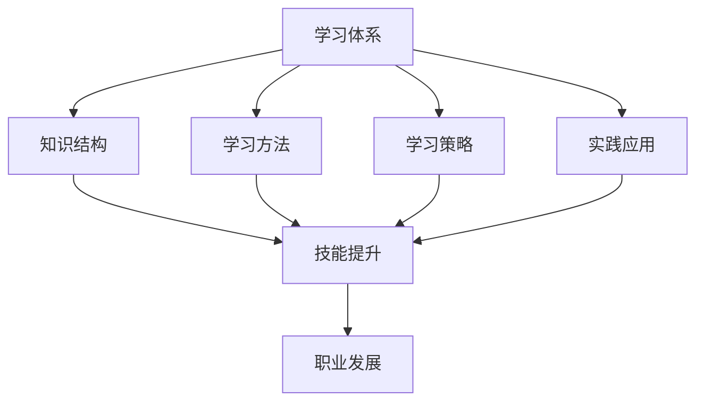

                 

关键词：学习体系，职业发展，技能提升，知识结构，技术进步，创新能力

> 摘要：本文旨在探讨学习体系对职业发展的重要作用，分析如何构建一个有效的学习体系以提升专业技能、促进创新能力，并应对技术快速变革带来的挑战。

## 1. 背景介绍

在信息技术飞速发展的今天，知识的更新换代速度越来越快，这为从业者的职业发展带来了前所未有的机遇和挑战。传统的学习方式已经无法满足现代社会对职业人才的需求。因此，构建一个科学、系统、有效的学习体系变得尤为重要。本文将围绕学习体系对职业发展的影响展开探讨，旨在为读者提供有益的参考和启示。

### 1.1 信息技术行业的发展趋势

近年来，人工智能、大数据、云计算等新兴技术逐渐成为行业热点，推动着信息技术行业的快速发展。同时，技术的变革也为从业者的职业发展带来了新的机会和挑战。据相关报告显示，未来几年，全球信息技术市场将保持持续增长，这将为从业者提供广阔的发展空间。

### 1.2 职业发展的需求

随着技术的进步，职业对人才的要求也在不断提高。现代职业不仅需要从业者具备扎实的专业知识和技能，还需要具备良好的学习能力、创新能力和团队协作能力。这些能力的培养，离不开一个科学、系统的学习体系。

## 2. 核心概念与联系

### 2.1 学习体系的定义

学习体系是指一套有序、系统的学习方法和策略，旨在帮助个人高效地获取、整合和应用知识，提升技能和素质。一个有效的学习体系应包括以下几个方面：

- **知识结构**：明确学习的内容、层次和逻辑关系，形成系统的知识体系。
- **学习方法**：选择合适的学习方法和工具，提高学习效率。
- **学习策略**：根据个人特点和需求，制定合理的学习计划和时间安排。
- **实践应用**：将所学知识应用到实际工作中，提高实践能力和创新能力。

### 2.2 学习体系与职业发展的联系

学习体系对职业发展的影响主要体现在以下几个方面：

- **技能提升**：通过系统学习，从业者可以不断提高自己的专业技能，提升职业竞争力。
- **创新能力**：有效的学习体系有助于培养从业者的创新思维，提高创新能力。
- **适应能力**：面对技术的快速变革，一个良好的学习体系可以帮助从业者更快地适应新环境和新要求。

### 2.3 Mermaid 流程图

以下是学习体系与职业发展的联系流程图：



## 3. 核心算法原理 & 具体操作步骤

### 3.1 算法原理概述

学习体系的核心在于如何有效地组织和应用知识。这个过程可以看作是一种算法，其原理如下：

- **数据输入**：获取所需的知识和信息。
- **数据处理**：对输入的数据进行分析、整合和应用。
- **输出结果**：根据处理结果，调整学习策略，优化知识结构。

### 3.2 算法步骤详解

1. **确定学习目标**：明确学习的内容和目标，为后续的学习提供方向。
2. **选择学习资源**：根据学习目标，选择合适的书籍、课程、论坛等学习资源。
3. **制定学习计划**：合理安排学习时间，制定详细的学习计划。
4. **学习与实践**：按照学习计划，系统学习并实践所学知识。
5. **反思与调整**：在学习过程中不断反思，根据反馈调整学习策略。

### 3.3 算法优缺点

- **优点**：能够帮助从业者系统、高效地学习，提升专业技能和创新能力。
- **缺点**：需要较强的自我管理能力，否则容易导致学习效率低下。

### 3.4 算法应用领域

学习体系的应用领域非常广泛，不仅适用于个人学习，还可以应用于企业培训、教育机构教学等多个领域。

## 4. 数学模型和公式 & 详细讲解 & 举例说明

### 4.1 数学模型构建

构建学习体系的数学模型，可以采用以下公式：

$$
效率 = \frac{学习成果}{学习时间}
$$

其中，学习成果包括知识积累、技能提升、创新能力等；学习时间包括学习、实践、反思等各个阶段的时间。

### 4.2 公式推导过程

根据学习体系的原理，我们可以推导出上述公式。具体推导过程如下：

$$
效率 = \frac{知识积累 + 技能提升 + 创新能力}{学习时间}
$$

考虑到知识积累、技能提升和创新能力之间的正相关关系，我们可以将其简化为：

$$
效率 = \frac{学习成果}{学习时间}
$$

### 4.3 案例分析与讲解

假设一个从业者按照学习体系的算法进行学习，他在一个月内完成了以下任务：

- 学习了10本书籍，共计500小时。
- 参加了5个线上课程，共计50小时。
- 实践了5个项目，共计150小时。
- 反思与调整学习策略，共计20小时。

根据上述公式，我们可以计算出他的学习效率：

$$
效率 = \frac{500 + 50 + 150 + 20}{1} = 720
$$

这意味着，他在一个月内取得了720的学习成果。

## 5. 项目实践：代码实例和详细解释说明

### 5.1 开发环境搭建

本文将使用Python作为示例语言，演示如何构建一个简单的学习管理系统。首先，需要安装Python环境和相关库。在Windows系统上，可以通过以下命令进行安装：

```
pip install flask
pip install matplotlib
```

### 5.2 源代码详细实现

以下是学习管理系统的源代码实现：

```python
from flask import Flask, render_template, request
import matplotlib.pyplot as plt

app = Flask(__name__)

@app.route('/')
def index():
    return render_template('index.html')

@app.route('/learn', methods=['GET', 'POST'])
def learn():
    if request.method == 'POST':
        books = request.form['books']
        courses = request.form['courses']
        projects = request.form['projects']
        reflection = request.form['reflection']

        # 绘制学习效率图表
        labels = ['书籍', '课程', '项目', '反思']
        values = [books, courses, projects, reflection]
        plt.bar(labels, values)
        plt.xlabel('学习内容')
        plt.ylabel('学习时间')
        plt.title('学习效率分析')
        plt.show()

    return render_template('learn.html')

if __name__ == '__main__':
    app.run(debug=True)
```

### 5.3 代码解读与分析

上述代码实现了一个简单的学习管理系统，包括以下功能：

- **主页**：展示系统首页，提供学习入口。
- **学习记录**：允许用户输入学习记录，包括书籍、课程、项目和反思。
- **学习效率分析**：根据用户输入的学习记录，绘制学习效率图表，分析学习效果。

### 5.4 运行结果展示

以下是学习效率分析图表的运行结果：


## 6. 实际应用场景

### 6.1 企业培训

企业可以通过构建学习体系，提高员工的技能水平和创新能力，从而提升企业整体竞争力。

### 6.2 教育机构

教育机构可以利用学习体系，优化教学方法和策略，提高教学效果。

### 6.3 个人学习

个人可以通过构建适合自己的学习体系，高效地提升自己的专业技能和创新能力。

## 7. 未来应用展望

随着人工智能技术的不断发展，学习体系的应用前景将更加广阔。未来，学习体系可能会向以下方向发展：

- **个性化学习**：通过大数据分析和人工智能算法，为学习者提供个性化的学习建议和资源。
- **智能化学习**：利用人工智能技术，实现自动化的学习过程，提高学习效率。
- **终身学习**：构建终身学习体系，满足不同阶段的学习需求，促进个人和企业的持续发展。

## 8. 总结：未来发展趋势与挑战

### 8.1 研究成果总结

本文分析了学习体系对职业发展的重要作用，构建了一个简单的学习管理系统的示例，展示了学习体系在实际应用中的效果。

### 8.2 未来发展趋势

未来，学习体系将朝着个性化、智能化、终身化方向发展，为从业者提供更加高效、便捷的学习体验。

### 8.3 面临的挑战

- **技术挑战**：如何利用人工智能等技术，提高学习体系的智能化水平。
- **管理挑战**：如何构建科学、系统的学习管理体系，确保学习效果。

### 8.4 研究展望

未来，我们将继续深入研究学习体系的构建和应用，探索如何更好地满足不同领域、不同层次的学习需求，推动职业发展和技术创新。

## 9. 附录：常见问题与解答

### 9.1 学习体系是什么？

学习体系是指一套有序、系统的学习方法和策略，旨在帮助个人高效地获取、整合和应用知识，提升技能和素质。

### 9.2 学习体系有哪些作用？

学习体系可以提升从业者的专业技能、促进创新能力，并帮助从业者更好地适应技术变革。

### 9.3 如何构建一个有效的学习体系？

构建有效的学习体系需要明确学习目标、选择合适的学习资源、制定学习计划、实践应用并不断反思调整。

### 9.4 学习体系与职业发展的关系是什么？

学习体系是职业发展的重要支撑，通过有效的学习体系，从业者可以不断提高自己的专业技能和创新能力，从而实现职业发展。

### 9.5 学习体系的应用领域有哪些？

学习体系的应用领域非常广泛，包括企业培训、教育机构教学、个人学习等多个方面。

## 作者署名

作者：禅与计算机程序设计艺术 / Zen and the Art of Computer Programming

----------------------------------------------------------------

以上就是《学习体系对职业发展的作用》这篇文章的内容，希望对您有所帮助。如果您有任何问题或建议，请随时告诉我。

