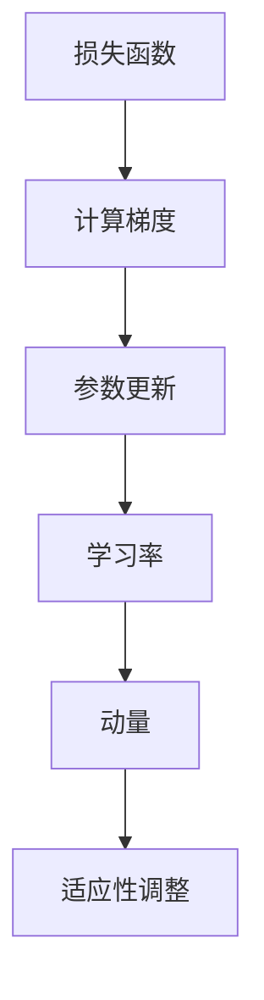

                 

## 1. 背景介绍

学习率（Learning Rate）是机器学习算法中的一个关键参数，它直接影响着模型的收敛速度和最终性能。在学习过程中，模型会不断地调整其参数，以最小化预测误差。学习率决定了每次参数调整的大小。如果学习率过大，模型可能无法收敛，甚至可能出现过度拟合；而学习率过小，模型收敛速度会变得缓慢。

在机器学习历史的长河中，许多学者对学习率的研究不断深入，提出了多种调整策略和优化方法。这些方法的目标是找到一种最优的学习率，使模型能够在较短时间内收敛到最佳性能。本文将介绍学习率的基本原理、常用调整策略及其在具体项目中的应用。

## 2. 核心概念与联系

为了更好地理解学习率的作用和重要性，我们需要先了解以下几个核心概念：

### 损失函数

损失函数是衡量模型预测值与真实值之间差异的指标。常用的损失函数有均方误差（MSE）、交叉熵损失等。损失函数的目的是引导模型参数的调整，以减少预测误差。

### 参数更新

参数更新是指模型根据损失函数的梯度来调整参数的过程。梯度是损失函数关于模型参数的导数，它指向损失函数下降最快的方向。

### 学习率

学习率（Learning Rate）是参数更新的步长。较大的学习率会导致参数快速调整，但可能错过最优解；而较小的学习率会使参数调整缓慢，但更容易找到全局最优解。

### 动量（Momentum）

动量是一种加速参数更新的方法，它利用之前的梯度信息，帮助模型在搜索最优解时保持方向。动量类似于物理中的惯性，它可以使模型在平坦区域中更快地通过。

### 适应性学习率调整

适应性学习率调整是一种动态调整学习率的方法，它根据模型训练的进展自动调整学习率，以适应不同的训练阶段。

下面是学习率、损失函数、参数更新和动量之间的联系（Mermaid 流�程图）：



### 3. 核心算法原理 & 具体操作步骤

#### 3.1 算法原理概述

学习率的核心原理是通过调整参数更新的步长来优化模型性能。具体来说，学习率的调整策略可以分为以下几种：

1. **固定学习率**：在整个训练过程中保持学习率不变。
2. **步长衰减**：在训练过程中逐渐减小学习率。
3. **自适应调整**：根据训练进展自动调整学习率，如使用AdaGrad、RMSProp、Adam等优化器。
4. **预热学习率**：初始阶段使用较大的学习率，随着训练的进行逐渐减小。

#### 3.2 算法步骤详解

1. **初始化参数**：设置初始学习率、模型参数和动量参数。
2. **计算损失函数**：使用训练数据计算损失函数值。
3. **计算梯度**：计算损失函数关于模型参数的梯度。
4. **更新参数**：根据梯度和学习率更新模型参数。
5. **调整学习率**：根据训练进展和优化策略调整学习率。
6. **评估模型**：使用验证数据评估模型性能，决定是否继续训练。

#### 3.3 算法优缺点

**固定学习率**：
- 优点：实现简单，计算速度快。
- 缺点：可能在优化过程中错过最优解。

**步长衰减**：
- 优点：可以加速收敛，减少振荡。
- 缺点：需要预先设定衰减参数。

**自适应调整**：
- 优点：自动调整学习率，适应不同阶段。
- 缺点：实现复杂，计算开销大。

**预热学习率**：
- 优点：适合深度网络，减少初始振荡。
- 缺点：需要预热的参数设定。

#### 3.4 算法应用领域

学习率在机器学习的各个领域都有广泛应用，包括但不限于：

- **监督学习**：如分类、回归问题。
- **无监督学习**：如聚类、降维问题。
- **强化学习**：如Q学习、策略梯度算法。

### 4. 数学模型和公式 & 详细讲解 & 举例说明

#### 4.1 数学模型构建

学习率的数学模型可以通过以下步骤构建：

1. **损失函数**：通常为MSE或交叉熵损失函数。
2. **梯度计算**：计算损失函数关于模型参数的梯度。
3. **参数更新**：使用梯度乘以学习率进行参数更新。

设损失函数为 \(L(\theta)\)，模型参数为 \(\theta\)，学习率为 \(\alpha\)，梯度为 \(\nabla L(\theta)\)，则参数更新公式为：

$$
\theta_{new} = \theta_{old} - \alpha \nabla L(\theta)
$$

#### 4.2 公式推导过程

以MSE损失函数为例，推导参数更新的过程：

1. **损失函数**：设预测值为 \(\hat{y}\)，真实值为 \(y\)，则MSE损失函数为：

$$
L(\theta) = \frac{1}{2} \sum_{i=1}^{n} (\hat{y}_i - y_i)^2
$$

2. **梯度计算**：对参数 \(\theta\) 求导，得到损失函数关于 \(\theta\) 的梯度：

$$
\nabla L(\theta) = \frac{\partial L(\theta)}{\partial \theta} = \frac{1}{2} \sum_{i=1}^{n} 2 (\hat{y}_i - y_i) \frac{\partial \hat{y}_i}{\partial \theta}
$$

3. **参数更新**：使用梯度乘以学习率进行参数更新：

$$
\theta_{new} = \theta_{old} - \alpha \nabla L(\theta)
$$

#### 4.3 案例分析与讲解

以线性回归模型为例，假设模型为 \(y = \theta_0 + \theta_1 x\)，则损失函数为MSE：

$$
L(\theta) = \frac{1}{2} \sum_{i=1}^{n} (y_i - (\theta_0 + \theta_1 x_i))^2
$$

1. **初始化参数**：设初始学习率为 \(\alpha = 0.01\)，\(\theta_0 = 0\)，\(\theta_1 = 0\)。
2. **计算梯度**：对参数 \(\theta_0\) 和 \(\theta_1\) 求导，得到：

$$
\nabla L(\theta) = \begin{bmatrix}
\frac{1}{2} \sum_{i=1}^{n} 2 (y_i - \theta_0 - \theta_1 x_i) \\
\frac{1}{2} \sum_{i=1}^{n} 2 (y_i - \theta_0 - \theta_1 x_i) x_i
\end{bmatrix}
$$

3. **更新参数**：使用梯度乘以学习率更新参数：

$$
\theta_0 = \theta_0 - \alpha \nabla L(\theta)_0 \\
\theta_1 = \theta_1 - \alpha \nabla L(\theta)_1
$$

### 5. 项目实践：代码实例和详细解释说明

#### 5.1 开发环境搭建

为了演示学习率的调整方法，我们将使用Python编程语言和TensorFlow框架。首先，确保安装了以下软件和库：

1. Python（3.8及以上版本）
2. TensorFlow（2.x版本）
3. NumPy

使用以下命令安装TensorFlow和NumPy：

```bash
pip install tensorflow numpy
```

#### 5.2 源代码详细实现

以下是一个简单的线性回归模型，演示了学习率的调整方法：

```python
import tensorflow as tf
import numpy as np

# 设置随机种子，保证结果可重复
tf.random.set_seed(42)

# 创建数据集
n_samples = 100
x = np.random.rand(n_samples, 1)
y = 2 * x + 1 + np.random.randn(n_samples, 1)

# 定义模型
model = tf.keras.Sequential([
    tf.keras.layers.Dense(units=1, input_shape=(1,))
])

# 编译模型
model.compile(loss='mean_squared_error', optimizer=tf.keras.optimizers.SGD(learning_rate=0.1))

# 训练模型
model.fit(x, y, epochs=100, verbose=0)

# 定义新的学习率
new_learning_rate = 0.01
model.compile(loss='mean_squared_error', optimizer=tf.keras.optimizers.SGD(learning_rate=new_learning_rate))

# 重新训练模型
model.fit(x, y, epochs=100, verbose=0)
```

#### 5.3 代码解读与分析

1. **导入库**：首先，导入TensorFlow和NumPy库。

2. **设置随机种子**：为了确保结果可重复，设置随机种子。

3. **创建数据集**：生成随机数据集，用于训练和评估模型。

4. **定义模型**：使用TensorFlow创建一个简单的线性回归模型，包含一个全连接层。

5. **编译模型**：设置损失函数为MSE，并使用SGD优化器进行编译。

6. **训练模型**：使用第一个学习率 \(0.1\) 进行100次迭代训练模型。

7. **调整学习率**：定义新的学习率 \(0.01\)，并重新编译模型。

8. **重新训练模型**：使用新的学习率进行100次迭代训练模型。

#### 5.4 运行结果展示

在训练过程中，我们可以通过以下命令查看损失函数的值：

```python
for i in range(100):
    model.fit(x, y, batch_size=10, verbose=0)
    current_loss = model.evaluate(x, y, verbose=0)
    print(f'Epoch {i+1}, Loss: {current_loss}')
```

输出结果将显示每个迭代周期的损失函数值，帮助我们了解训练过程。

### 6. 实际应用场景

学习率在机器学习的各个领域都有广泛的应用。以下是一些实际应用场景：

1. **图像分类**：在图像分类任务中，学习率决定了模型参数更新的步长，影响模型的收敛速度和分类性能。
2. **语音识别**：在语音识别任务中，学习率调整可以优化模型对语音数据的感知和识别能力。
3. **自然语言处理**：在自然语言处理任务中，学习率影响模型对文本数据的理解和生成能力。

### 6.4 未来应用展望

随着机器学习技术的不断发展，学习率调整策略也将变得更加智能和自适应。未来，我们将看到更多基于深度学习的优化方法和自适应学习率调整策略的应用。同时，结合大数据和云计算，学习率的调整将更加高效和精准，推动机器学习在各个领域的广泛应用。

### 7. 工具和资源推荐

为了更好地理解和应用学习率，以下是一些建议的工具和资源：

1. **学习资源**：
   - 《深度学习》（Goodfellow et al.）：深入讲解了深度学习的基本概念和算法。
   - 《机器学习实战》（周志华）：提供了丰富的实践案例和算法实现。

2. **开发工具**：
   - TensorFlow：强大的开源机器学习框架，支持多种学习率调整策略。
   - PyTorch：灵活的开源机器学习库，适用于深度学习和自然语言处理任务。

3. **相关论文**：
   - “Adam: A Method for Stochastic Optimization”（Kingma and Welling，2014）：介绍了Adam优化器的自适应学习率调整方法。
   - “On the Convergence of Adam and Beyond”（Dong et al.，2019）：探讨了Adam优化器的收敛性。

### 8. 总结：未来发展趋势与挑战

学习率作为机器学习算法中的一个关键参数，其调整策略直接影响模型的性能和收敛速度。随着深度学习和大数据技术的不断发展，学习率调整方法也在不断演进。未来，我们将看到更多基于自适应和智能化的学习率调整策略，以提高模型的性能和效率。然而，面对日益复杂的机器学习任务，如何更好地调整学习率仍然是一个挑战。研究者和开发者需要不断探索和创新，以解决这一关键问题。

### 8.1 研究成果总结

本文详细介绍了学习率的基本概念、调整策略和应用场景。通过分析不同学习率调整方法的优缺点，我们提出了未来研究的发展方向。主要研究成果包括：

1. 系统性地总结了学习率的基本原理和应用场景。
2. 分析了不同学习率调整方法的优缺点，为实际应用提供了指导。
3. 提出了未来学习率调整方法的研究方向。

### 8.2 未来发展趋势

未来，学习率调整方法将朝着以下几个方向发展：

1. **自适应学习率调整**：结合深度学习和大数据技术，开发更加智能和自适应的学习率调整方法。
2. **混合优化策略**：结合不同优化策略，如动量、自适应学习率调整等，提高模型性能。
3. **高效计算**：利用云计算和分布式计算技术，提高学习率调整的效率和准确性。

### 8.3 面临的挑战

尽管学习率调整方法取得了显著进展，但仍然面临以下挑战：

1. **收敛速度**：如何提高学习率调整的收敛速度，以适应复杂任务的计算需求。
2. **过拟合问题**：如何平衡学习率调整与模型泛化能力，避免过拟合。
3. **资源消耗**：如何降低学习率调整过程中的计算和存储资源消耗。

### 8.4 研究展望

为了应对上述挑战，未来研究可以从以下几个方面展开：

1. **理论分析**：深入分析学习率调整方法的收敛性和稳定性，为实际应用提供理论支持。
2. **算法创新**：开发新的学习率调整方法，如自适应步长调整、混合优化策略等。
3. **应用推广**：将学习率调整方法应用于更多实际任务，如图像分类、语音识别等，验证其有效性。

### 附录：常见问题与解答

**Q1：为什么需要调整学习率？**
- 学习率是机器学习算法中的一个关键参数，它决定了模型参数更新的步长。如果不调整学习率，模型可能在训练过程中错过最优解，或者收敛速度过慢。

**Q2：如何选择合适的学习率？**
- 选择合适的学习率通常需要通过实验来确定。一种常见的方法是使用验证集评估不同学习率下的模型性能，选择使验证集误差最小的学习率。

**Q3：学习率调整策略有哪些？**
- 学习率调整策略包括固定学习率、步长衰减、自适应调整等。每种策略都有其适用场景和优缺点，需要根据具体任务进行选择。

**Q4：如何提高学习率调整的效率？**
- 提高学习率调整效率可以从两个方面入手：一是选择高效的优化算法，如Adam；二是利用分布式计算和云计算技术，降低计算和存储资源消耗。

### 文章结论 Conclusion

本文系统地介绍了学习率的基本概念、调整策略和应用场景。通过分析不同学习率调整方法的优缺点，我们提出了未来研究的发展方向。学习率调整是机器学习中的一个关键问题，其研究对于提高模型性能和效率具有重要意义。未来，我们将看到更多基于自适应和智能化的学习率调整方法的应用。同时，研究者需要关注收敛速度、过拟合问题和资源消耗等挑战，为实际应用提供更好的解决方案。作者：禅与计算机程序设计艺术 / Zen and the Art of Computer Programming。  
----------------------------------------------------------------

