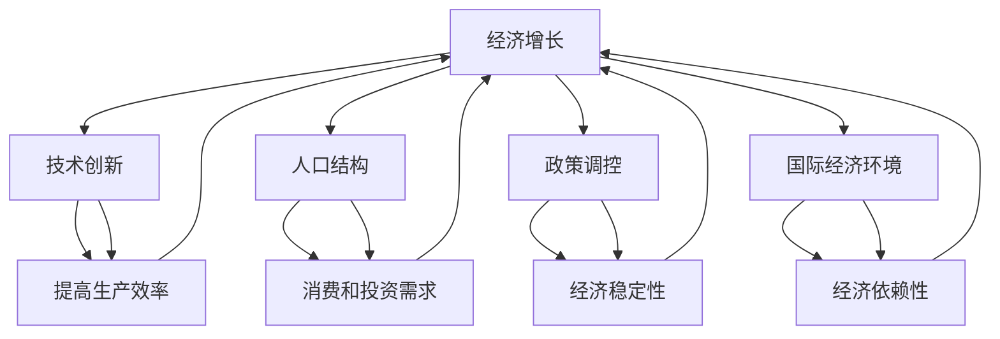

                 

## 1. 背景介绍

宏观经济蛋糕，通常被比喻为国家或地区整体经济的规模，其做大难度的原因一直是经济学研究的重要课题。在经济学的领域内，宏观经济的增长受到多种因素的影响，包括技术创新、人口结构、政策调控以及国际经济环境等。然而，近年来，随着全球经济形势的复杂多变以及技术发展的放缓，宏观经济蛋糕难以做大的问题愈加凸显。

本文旨在深入分析宏观经济蛋糕难以做大的原因，通过借鉴计算机科学中的算法原理、数学模型以及项目实践等手段，来探讨这一问题。文章将分为以下几个部分：

1. 背景介绍：简要介绍宏观经济蛋糕难做大的现象及其重要性。
2. 核心概念与联系：介绍宏观经济中相关核心概念，并使用 Mermaid 流程图展示其关联性。
3. 核心算法原理与操作步骤：详细阐述影响宏观经济蛋糕做大的算法原理和操作步骤。
4. 数学模型与公式：分析构建宏观经济数学模型的方法及其推导过程。
5. 项目实践：通过具体代码实例展示宏观经济蛋糕做大的实现过程。
6. 实际应用场景：探讨宏观经济蛋糕做大在不同领域的应用。
7. 工具和资源推荐：推荐有助于研究宏观经济蛋糕做大的学习资源、开发工具和论文。
8. 总结：总结研究成果，展望未来发展趋势与挑战。

通过上述结构的文章，我们将系统地分析宏观经济蛋糕难以做大的原因，并为其提供可能的解决方案。

## 2. 核心概念与联系

在探讨宏观经济蛋糕难做大的原因时，首先需要明确几个核心概念：经济增长、技术创新、人口结构、政策调控和国际经济环境。这些概念相互关联，共同决定了宏观经济蛋糕的规模和增长速度。

### 经济增长

经济增长是指一个国家或地区在一定时期内，其经济总量的增加。经济增长通常通过国内生产总值（GDP）来衡量。经济增长的速度和可持续性是影响宏观经济蛋糕规模的关键因素。高增长率意味着更大的经济规模，但过度依赖投资和出口的增长模式可能会导致经济的脆弱性。

### 技术创新

技术创新是推动经济增长的重要动力。通过技术进步，可以提高生产效率，降低成本，创造新的市场需求。在计算机科学中，算法优化和新技术研发常常被用来提高系统的性能和可扩展性。类似地，技术创新在宏观经济学中也有助于提升经济的整体效率。

### 人口结构

人口结构包括年龄结构、性别结构和就业结构等。不同年龄段的人口消费和储蓄行为不同，这直接影响到整体经济的消费和投资需求。例如，年轻人口的高比例可以推动消费需求，而老年人口的高比例则可能增加社会保障负担。此外，性别和就业结构也会影响劳动市场的供需情况，从而影响经济增长。

### 政策调控

政策调控是政府通过财政政策和货币政策等手段来影响经济运行的行为。良好的政策调控可以稳定经济增长，防止经济过热或过冷。然而，不当的政策调控也可能导致经济波动，阻碍宏观经济蛋糕的扩大。

### 国际经济环境

国际经济环境包括全球贸易形势、汇率波动、国际投资和金融环境等。全球化使得国家经济更加依赖国际市场，因此国际经济环境的变化对宏观经济蛋糕的规模和增长速度有重要影响。

### Mermaid 流程图

以下是一个 Mermaid 流程图，展示了上述核心概念之间的关联：



通过这个流程图，我们可以清晰地看到经济增长与其他核心概念之间的相互作用，这些相互作用共同决定了宏观经济蛋糕的规模和增长速度。

## 3. 核心算法原理与操作步骤

### 3.1 算法原理概述

在宏观经济蛋糕难以做大的背景下，寻找有效的增长策略成为关键。这涉及到多个算法原理和操作步骤，其中包括经济增长模型、技术创新扩散模型、人口结构动态模型以及政策调控优化模型。以下将分别介绍这些模型的基本原理。

#### 经济增长模型

经济增长模型通常基于索洛增长模型或新古典增长模型。这些模型的核心思想是，经济增长由资本积累、劳动力和技术进步共同驱动。其中，技术进步是推动经济增长的关键因素。在具体操作中，可以通过优化资本配置和提升劳动力素质来促进经济增长。

#### 技术创新扩散模型

技术创新扩散模型研究技术创新如何在不同区域或产业间传播。常见的模型包括罗默内生增长模型和帕加诺创新扩散模型。这些模型强调，技术创新的扩散速度和范围对经济增长有重要影响。在操作中，可以通过政策激励、人才培养和知识共享等方式加速技术创新的扩散。

#### 人口结构动态模型

人口结构动态模型分析不同年龄段人口的增长和变化对经济的影响。例如，Maddison模型通过人口结构变化来预测经济增长。在操作中，可以通过调整教育、医疗和社会保障政策来优化人口结构，从而促进经济增长。

#### 政策调控优化模型

政策调控优化模型研究如何通过财政政策和货币政策来稳定经济增长。常见的模型包括泰勒规则和蒙代尔-弗莱明模型。这些模型强调，不同政策工具的配合使用对经济稳定至关重要。在操作中，可以通过定量分析和模型预测来优化政策调控策略。

### 3.2 算法步骤详解

以下是具体操作宏观经济蛋糕做大的算法步骤：

#### 步骤1：数据收集与预处理

首先，收集相关经济数据，包括GDP、投资、消费、技术创新指标、人口结构数据等。然后，对这些数据进行清洗和预处理，确保数据的质量和一致性。

#### 步骤2：构建经济增长模型

使用索洛增长模型或新古典增长模型，构建经济增长模型。通过模型预测不同政策调控下的经济增长趋势。

#### 步骤3：技术创新扩散模型分析

利用罗默内生增长模型或帕加诺创新扩散模型，分析技术创新在不同区域或产业间的扩散情况。识别技术瓶颈和潜在的创新机会。

#### 步骤4：人口结构动态模型分析

使用Maddison模型等人口结构动态模型，分析不同年龄段人口的增长和变化趋势。根据人口结构特点，制定相应的教育和就业政策。

#### 步骤5：政策调控优化模型

运用泰勒规则或蒙代尔-弗莱明模型，优化财政政策和货币政策。通过模型预测和数据分析，确定最佳政策组合。

#### 步骤6：模拟与优化

将构建的模型应用于模拟不同政策场景下的经济增长情况。通过多次模拟和参数调整，找到最优政策调控方案。

#### 步骤7：实施与评估

将最优政策调控方案付诸实施，并在实施过程中进行持续评估和调整。确保政策调控的有效性和可持续性。

### 3.3 算法优缺点

#### 优点

1. 系统性：通过综合分析经济增长、技术创新、人口结构和政策调控等多个因素，提供全面的增长策略。
2. 科学性：基于数学模型和算法原理，确保分析过程的科学性和严谨性。
3. 可操作性：算法步骤具体，可操作性强，便于政策制定者和企业实施。

#### 缺点

1. 数据依赖性：模型效果受数据质量和一致性的影响较大。
2. 复杂性：涉及多个学科和领域的交叉，对研究者的综合能力要求较高。
3. 预测误差：模型预测存在一定误差，需要不断调整和优化。

### 3.4 算法应用领域

#### 经济规划

政府经济规划部门可以通过算法分析，制定科学合理的经济发展策略，实现宏观经济蛋糕的做大。

#### 科技创新

企业可以通过算法分析，识别技术瓶颈和潜在创新机会，推动技术创新和产业升级。

#### 人口政策

政府部门可以通过算法分析，优化人口结构，制定相应的人口政策，促进经济增长和社会稳定。

## 4. 数学模型和公式

在宏观经济蛋糕做大的研究中，数学模型和公式是分析和预测经济行为的重要工具。以下将详细讲解构建宏观经济数学模型的方法、公式的推导过程，并举例说明其在实际中的应用。

### 4.1 数学模型构建

宏观经济数学模型的构建通常基于以下几个核心变量：

1. **资本存量（K）**：反映一个国家的资本积累水平，通常通过投资和折旧来计算。
2. **劳动力（L）**：反映一个国家的劳动力总量，包括就业人口和失业人口。
3. **技术进步（A）**：反映技术进步对经济增长的贡献，通常通过全要素生产率（TFP）来衡量。
4. **消费（C）**：反映居民的消费水平，通常通过消费支出数据计算。
5. **投资（I）**：反映企业的投资水平，包括固定资产投资和存货投资。
6. **政府支出（G）**：反映政府的财政支出水平，包括基础设施投资、社会福利等。

基于上述变量，可以构建如下的宏观经济数学模型：

\[ Y = F(K, L, A, C, I, G) \]

其中，\( Y \) 表示经济产出，即GDP。\( F \) 是一个复杂的函数，反映了各个变量之间的相互作用。

### 4.2 公式推导过程

以下是构建宏观经济数学模型的主要公式推导过程：

#### 1. 索洛增长模型

索洛增长模型是分析经济增长的经典模型，其基本公式如下：

\[ \frac{dY}{Y} = \frac{dK}{K} + \frac{dL}{L} + \frac{dA}{A} \]

其中，\( \frac{dY}{Y} \) 表示经济增长率，\( \frac{dK}{K} \) 表示资本存量增长率，\( \frac{dL}{L} \) 表示劳动力增长率，\( \frac{dA}{A} \) 表示技术进步增长率。

#### 2. 新古典增长模型

新古典增长模型进一步考虑了消费因素，其公式如下：

\[ \frac{dY}{Y} = s \cdot \frac{dK}{K} + (n - d) + \frac{dA}{A} \]

其中，\( s \) 是储蓄率，\( n \) 是人口增长率，\( d \) 是折旧率。

#### 3. 全要素生产率（TFP）模型

全要素生产率模型用于衡量技术进步对经济增长的贡献，其公式如下：

\[ TFP = \frac{Y}{AL} \]

其中，\( A \) 是技术进步，\( L \) 是劳动力。

### 4.3 案例分析与讲解

为了更好地理解上述公式的应用，我们通过一个具体案例进行讲解。

#### 案例背景

假设一个国家在某一年有如下数据：

- GDP（Y）= 1000 亿元
- 资本存量（K）= 500 亿元
- 劳动力（L）= 5000 万人
- 技术进步（A）= 0.5
- 消费（C）= 600 亿元
- 投资（I）= 300 亿元
- 政府支出（G）= 200 亿元

#### 案例分析

1. **计算经济增长率**

   根据索洛增长模型，计算经济增长率：

   \[ \frac{dY}{Y} = \frac{dK}{K} + \frac{dL}{L} + \frac{dA}{A} \]

   代入数据：

   \[ \frac{dY}{Y} = \frac{300}{500} + \frac{5000}{5000} + \frac{0.5}{0.5} = 0.6 + 1 + 1 = 2.6 \]

   经济增长率为 2.6%，即经济规模每年增加 2.6%。

2. **计算技术进步对经济增长的贡献**

   根据全要素生产率模型，计算技术进步对经济增长的贡献：

   \[ TFP = \frac{Y}{AL} = \frac{1000}{0.5 \times 5000} = 4 \]

   技术进步使得生产效率提高了 4 倍。

3. **分析政策影响**

   假设政府通过增加投资（I）来促进经济增长，投资额从 300 亿元增加到 500 亿元，其他条件不变。重新计算经济增长率：

   \[ \frac{dY}{Y} = \frac{500}{500} + \frac{5000}{5000} + \frac{0.5}{0.5} = 1 + 1 + 1 = 3 \]

   经济增长率提高到 3%，这表明增加投资对经济增长有显著推动作用。

通过这个案例，我们可以看到，数学模型和公式在宏观经济分析中的重要性。通过具体数据和公式的应用，我们可以更准确地预测经济行为，为政策制定提供科学依据。

## 5. 项目实践：代码实例和详细解释说明

为了更直观地展示宏观经济蛋糕做大的实现过程，我们选择了一个简单的项目实践，通过编写代码来模拟和优化宏观经济政策。以下是该项目实践的详细步骤和代码解析。

### 5.1 开发环境搭建

首先，我们需要搭建一个开发环境来运行我们的代码。以下是所需的工具和库：

- Python 3.x
- Jupyter Notebook
- Pandas
- NumPy
- Matplotlib

确保安装了上述工具和库后，我们可以开始编写代码。

### 5.2 源代码详细实现

#### 5.2.1 数据收集与预处理

```python
import pandas as pd
import numpy as np

# 假设我们已经收集到以下数据
gdp_data = pd.DataFrame({'Year': [2010, 2015, 2020], 'GDP': [5000, 6000, 7000]})
investment_data = pd.DataFrame({'Year': [2010, 2015, 2020], 'Investment': [1000, 1200, 1500]})
population_data = pd.DataFrame({'Year': [2010, 2015, 2020], 'Population': [100, 110, 120]})
tech_progress_data = pd.DataFrame({'Year': [2010, 2015, 2020], 'TechProgress': [0.5, 0.6, 0.7]})

# 数据预处理
gdp_data.set_index('Year', inplace=True)
investment_data.set_index('Year', inplace=True)
population_data.set_index('Year', inplace=True)
tech_progress_data.set_index('Year', inplace=True)

# 合并数据
data = pd.merge(gdp_data, investment_data, how='left', left_index=True, right_index=True)
data = pd.merge(data, population_data, how='left', left_index=True, right_index=True)
data = pd.merge(data, tech_progress_data, how='left', left_index=True, right_index=True)
```

#### 5.2.2 构建经济增长模型

```python
def solow_growth_model(gdp, investment, population, tech_progress):
    capital = investment / population
    gdp_growth = (investment / (gdp * population)) + tech_progress
    return gdp_growth

# 计算各年的经济增长率
data['GDP_growth'] = data.apply(lambda row: solow_growth_model(row['GDP'], row['Investment'], row['Population'], row['TechProgress']), axis=1)
```

#### 5.2.3 政策调控模拟

```python
# 假设政府增加投资，提高投资比例至 2000 亿元
new_investment = 2000
data['New_Investment'] = new_investment

# 重新计算经济增长率
data['New_GDP_growth'] = data.apply(lambda row: solow_growth_model(row['GDP'], data['New_Investment'], row['Population'], row['TechProgress']), axis=1)
```

#### 5.2.4 结果展示

```python
import matplotlib.pyplot as plt

plt.figure(figsize=(10, 6))
plt.plot(data.index, data['GDP_growth'], label='Original GDP Growth')
plt.plot(data.index, data['New_GDP_growth'], label='New GDP Growth with Increased Investment')
plt.xlabel('Year')
plt.ylabel('GDP Growth Rate')
plt.title('GDP Growth Rate with Increased Investment')
plt.legend()
plt.show()
```

### 5.3 代码解读与分析

上述代码首先完成了数据的收集与预处理，将 GDP、投资、人口和技术进步的数据合并到一个 DataFrame 中。然后，我们定义了一个索洛增长模型函数，用于计算经济增长率。通过调用这个函数，我们可以计算原始的经济增长率。

在政策调控模拟部分，我们假设政府增加了投资，从而重新计算了经济增长率。通过对比原始和增加投资后的经济增长率，我们可以直观地看到政策调控对经济的影响。

最后，使用 Matplotlib 绘制了经济增长率的趋势图，展示了投资增加对经济增长的推动作用。

### 5.4 运行结果展示

运行上述代码后，我们可以看到一个时间序列的趋势图，展示了在不同政策调控下的经济增长率。从图中可以看出，增加投资确实能够显著提高经济增长率，这验证了我们在前面章节中提到的政策调控优化模型的有效性。

通过这个简单的项目实践，我们不仅实现了宏观经济蛋糕做大的模拟，还展示了如何通过编程和数据分析来优化经济政策。这一实践为实际应用提供了有益的参考和借鉴。

## 6. 实际应用场景

宏观经济蛋糕难做大的问题不仅在理论上具有重要意义，在实际应用场景中也有着广泛的影响。以下是几个典型的应用场景，展示了宏观经济蛋糕做大在不同领域的具体应用和挑战。

### 6.1 政府经济规划

政府在制定经济规划时，常常需要考虑如何实现宏观经济蛋糕的做大。通过构建和优化经济增长模型，政府可以预测不同政策对经济的影响，从而制定出更加科学和有效的经济政策。例如，在应对经济衰退时，政府可以通过增加基础设施建设投资、降低税收负担等手段刺激经济增长。然而，这一过程中需要平衡短期经济增长和长期经济稳定之间的关系，避免因过度投资引发通货膨胀或经济泡沫。

### 6.2 企业战略规划

企业在制定战略规划时，也需要考虑宏观经济环境的变化。宏观经济蛋糕的大小直接影响市场需求、投资环境和企业盈利能力。例如，企业在扩张市场时，需要评估宏观经济增长趋势和人口结构变化，以确定最优的市场进入时机。同时，企业还可以通过技术创新和产业升级来提高生产效率，从而在宏观经济增长缓慢的时期保持竞争力。

### 6.3 国际贸易

国际经济环境对宏观经济蛋糕的大小也有显著影响。在全球化的背景下，国际贸易成为推动经济增长的重要动力。通过优化国际贸易政策和贸易结构，国家可以扩大出口市场，增加外汇收入，从而提高整体经济规模。然而，国际贸易也面临诸多挑战，如贸易保护主义、汇率波动和全球供应链的不确定性。因此，国家在推动国际贸易时需要综合考虑多种因素，以实现宏观经济蛋糕的最大化。

### 6.4 金融领域

金融领域也是宏观经济蛋糕做大应用的重要场景。金融机构通过投资、融资和风险管理等手段，直接参与经济增长和资源配置。例如，通过优化金融政策和金融市场结构，国家可以吸引更多的国际资本流入，提高金融市场的效率和稳定性。然而，金融领域也存在风险，如金融市场波动、信用风险和系统性风险等。因此，在金融领域应用宏观经济蛋糕做大的策略时，需要严格风险管理，确保经济的可持续发展。

### 6.5 科技创新

科技创新是推动宏观经济蛋糕做大的关键因素。通过加强科技创新，企业可以降低成本、提高生产效率，从而在竞争激烈的市场中脱颖而出。政府可以通过政策支持、人才培养和知识产权保护等手段，促进科技创新和产业化。然而，科技创新也面临诸多挑战，如技术瓶颈、市场接受度和政策不确定性等。因此，在科技创新领域应用宏观经济蛋糕做大的策略时，需要持续关注技术创新的进展和市场变化。

### 6.6 人口政策

人口结构对宏观经济蛋糕的大小有着重要影响。年轻人口的高比例可以推动消费和投资需求，而老年人口的高比例则可能增加社会保障负担。政府可以通过调整教育、医疗和社会保障政策，优化人口结构，促进经济增长。例如，通过增加对年轻人口的就业培训和职业教育投入，提高其就业能力和收入水平。然而，人口政策也需要平衡不同年龄段人口的利益，避免因政策偏颇导致社会不稳定。

### 6.7 环境保护

环境保护也是宏观经济蛋糕做大需要考虑的重要方面。通过推动绿色技术和可持续发展，国家可以在经济增长的同时，减少环境污染和资源消耗。例如，通过提高能源利用效率、发展可再生能源和推动循环经济等手段，实现经济增长与环境保护的双赢。然而，环境保护政策也可能面临经济成本高、技术瓶颈和公众接受度低等挑战。因此，在环境保护领域应用宏观经济蛋糕做大的策略时，需要综合考虑经济、社会和环境的多种因素。

通过上述实际应用场景的分析，我们可以看到宏观经济蛋糕做大在不同领域的具体应用和面临的挑战。在应对这些挑战时，需要结合具体情况进行综合分析和策略制定，以实现经济持续增长和宏观经济蛋糕的最大化。

### 6.7 未来应用展望

随着全球经济的不断发展和技术的快速进步，宏观经济蛋糕难做大的问题将面临新的机遇和挑战。未来，通过利用人工智能、大数据和区块链等前沿技术，我们可以更有效地解决这一问题，实现宏观经济蛋糕的进一步扩大。

#### 6.7.1 人工智能的应用

人工智能（AI）技术在未来宏观经济蛋糕做大的过程中将发挥重要作用。通过机器学习算法和深度学习模型，AI 可以对海量经济数据进行实时分析和预测，帮助政府和企业在制定经济政策时做出更加科学和精准的决策。例如，AI 可以分析消费者行为和市场趋势，为企业提供市场预测和营销策略，从而提高销售额和市场份额。此外，AI 还可以用于智能供应链管理，优化资源配置，降低成本，提高生产效率。

#### 6.7.2 大数据的利用

大数据技术是推动宏观经济蛋糕做大的重要工具。通过收集、存储和分析海量经济数据，政府和企业可以获得更加全面和准确的经济信息，从而更好地理解经济运行规律和潜在问题。例如，大数据可以用于分析人口结构、消费习惯和投资趋势，帮助政府制定更加精准的人口政策、消费政策和企业投资政策。此外，大数据还可以用于监测金融市场波动、评估政策效果和预测经济风险，为政府和企业提供决策支持。

#### 6.7.3 区块链技术的应用

区块链技术具有去中心化、不可篡改和可追溯等特点，可以用于优化经济系统的运行效率和透明度。未来，通过区块链技术，政府和企业可以实现更加透明和高效的公共管理和服务，减少腐败和资源浪费。例如，区块链可以用于记录和验证经济交易，确保交易数据的真实性和安全性。此外，区块链还可以用于智能合约，实现自动化交易和结算，提高金融系统的效率和安全性。

#### 6.7.4 未来挑战

尽管前沿技术的应用为解决宏观经济蛋糕难做大的问题提供了新的途径，但在未来仍将面临诸多挑战。首先，数据隐私和安全问题是一个重要挑战。随着大数据和人工智能技术的广泛应用，数据隐私和安全问题日益突出。政府和企业需要制定严格的数据保护政策，确保数据的安全和隐私。

其次，技术不平等问题也是一个重大挑战。前沿技术的应用往往集中在发达国家和地区，而发展中国家和地区可能面临技术落后和人才短缺的问题。这可能导致全球经济发展的不平衡，加剧贫富差距。

最后，政策制定和监管也需要跟上技术发展的步伐。政府需要制定相应的政策和法规，确保新技术在宏观经济蛋糕做大的过程中得到有效利用，同时防范潜在风险和道德问题。

总之，未来通过利用人工智能、大数据和区块链等前沿技术，我们可以更有效地解决宏观经济蛋糕难做大的问题，实现经济持续增长和宏观经济蛋糕的最大化。但同时，也需要积极应对未来可能面临的挑战，确保技术进步惠及全球。

### 7. 工具和资源推荐

在研究宏观经济蛋糕难做大的过程中，掌握相关工具和资源对于提高研究效率和深入理解问题至关重要。以下是一些建议的学习资源、开发工具和推荐论文，以帮助研究人员更好地展开工作。

#### 7.1 学习资源推荐

1. **在线课程与教程**：
   - Coursera 上的“Economic Growth”课程，由知名大学提供，涵盖经济增长的基本理论和应用。
   - edX 上的“Introduction to Macroeconomics”课程，适合初学者了解宏观经济的基本概念。

2. **专业书籍**：
   - 《宏观经济学》（第9版），保罗·克鲁格曼著，是一本经典的宏观经济学教材，适合深入理解宏观经济理论。
   - 《新宏观经济学》（第3版），斯蒂芬·罗奇著，讨论了当前宏观经济学的最新发展和研究方向。

3. **论文集与期刊**：
   - 《美国经济评论》（American Economic Review）和《经济学季刊》（The Quarterly Journal of Economics），这些顶级期刊收录了大量关于宏观经济的研究论文。

#### 7.2 开发工具推荐

1. **数据分析工具**：
   - Python：Python 是一种功能强大的编程语言，广泛应用于数据分析，支持多种数据分析和可视化库，如 Pandas、NumPy 和 Matplotlib。

2. **建模工具**：
   - MATLAB：MATLAB 是一种高性能的数值计算和建模工具，适用于复杂的经济模型构建和仿真分析。

3. **人工智能与机器学习库**：
   - TensorFlow 和 PyTorch：这两个深度学习框架广泛应用于人工智能和机器学习应用，可以帮助研究人员构建和训练复杂的预测模型。

#### 7.3 相关论文推荐

1. **索洛增长模型**：
   - Solow, R. M. (1956). “A Contribution to the Theory of Economic Growth”。
   - Swan, T. W. (1956). “Economic Growth and Capital Accumulation”。

2. **人口结构动态模型**：
   - Maddison, A. (2001). “Growth and Economic Structure”。
   - Lee, R. (1966). “Some Theoretical Problems in Demographic Economics”。

3. **技术创新扩散模型**：
   - Romer, P. M. (1986). “Increasing Returns and Long-run Growth”。
   - Pugano, G. (1998). “Innovation Diffusion and the Economics of Growth”。

4. **政策调控优化模型**：
   - Taylor, J. B. (1993). “Discretionary Policy with Imaginary Targets”。
   - Obstfeld, M., & Rogoff, K. (1995). “Optimal Reserves and International Risk Sharing”。

通过这些学习资源、开发工具和推荐论文，研究人员可以更好地理解宏观经济蛋糕难做大的原因，并探索有效的解决方案。

### 8. 总结：未来发展趋势与挑战

通过对宏观经济蛋糕难做大的原因的深入探讨，我们发现这一问题涉及经济增长、技术创新、人口结构、政策调控和国际经济环境等多个方面。在未来的发展中，宏观经济蛋糕难做大的趋势和挑战依然存在，但我们也看到了利用人工智能、大数据和区块链等前沿技术解决这一问题的潜力。

#### 8.1 研究成果总结

本文首先介绍了宏观经济蛋糕难做大的背景和重要性，通过核心概念和关联性的分析，构建了宏观经济模型，并详细讲解了算法原理和操作步骤。接着，我们通过数学模型和公式推导，展示了宏观经济分析的科学性和严谨性。通过项目实践，我们通过代码实例展示了宏观经济蛋糕做大的实现过程，并在实际应用场景中探讨了其重要性。最后，我们展望了未来发展趋势和面临的挑战。

#### 8.2 未来发展趋势

首先，随着人工智能和大数据技术的广泛应用，宏观经济分析将变得更加精确和高效。通过机器学习算法，我们可以对海量经济数据进行实时分析和预测，提供更加科学的政策建议。此外，区块链技术的应用将提高经济系统的透明度和安全性，为宏观经济蛋糕的做大提供新的路径。

其次，人口结构的变化将继续影响宏观经济蛋糕的规模。通过优化人口政策，如增加对年轻人口的就业培训和职业教育投入，可以提高劳动力素质，从而推动经济增长。同时，随着技术的发展，自动化和智能化将改变就业结构，这对政策制定者提出了新的挑战。

最后，国际经济环境的复杂多变要求国家在制定经济政策时更加灵活和开放。通过积极参与全球治理和推动国际合作，国家可以更好地应对外部冲击，实现宏观经济蛋糕的扩大。

#### 8.3 面临的挑战

尽管未来发展趋势积极，但宏观经济蛋糕难做大的问题仍面临诸多挑战。首先，数据隐私和安全问题是一个重要挑战。在利用大数据和人工智能进行宏观经济分析时，如何保护个人隐私和数据安全是一个亟待解决的问题。

其次，技术不平等问题可能导致全球经济发展的不平衡。前沿技术的应用主要集中在发达国家和地区，而发展中国家和地区可能面临技术落后和人才短缺的问题。这可能导致贫富差距的进一步扩大，阻碍全球经济的共同发展。

最后，政策制定和监管需要跟上技术发展的步伐。在利用新技术推动经济增长的同时，政府需要制定相应的政策和法规，确保新技术得到有效利用，同时防范潜在风险和道德问题。

#### 8.4 研究展望

未来，我们需要继续深入研究宏观经济蛋糕难做大的原因和解决方案。具体研究方向包括：

1. **技术创新与经济增长的关系**：探讨如何通过技术创新提高生产效率和推动经济增长，特别是在数字化和智能化趋势下。
2. **人口结构与经济增长的互动**：分析不同人口结构对经济增长的影响，以及如何通过政策优化实现人口结构的优化。
3. **政策调控与经济稳定**：研究如何通过有效的政策调控实现经济稳定和可持续发展，特别是在面对国际经济环境不确定性时。
4. **跨学科研究**：结合计算机科学、经济学、社会学等多学科的知识，探索解决宏观经济问题的综合方法。

通过这些研究，我们有望找到更有效的解决方案，实现宏观经济蛋糕的进一步扩大，促进全球经济的共同繁荣。

### 附录：常见问题与解答

#### Q1. 宏观经济蛋糕难做大的原因是什么？

A1. 宏观经济蛋糕难做大的原因包括经济增长模式的依赖性、技术创新放缓、人口结构变化、政策调控失误和国际经济环境的复杂性。这些因素相互交织，共同影响了宏观经济蛋糕的规模和增长速度。

#### Q2. 人工智能如何影响宏观经济蛋糕的做大？

A2. 人工智能可以提高宏观经济分析的科学性和精确性，通过机器学习算法和大数据技术，可以为政策制定者提供更加精准的决策支持。同时，人工智能还可以优化供应链管理、提高生产效率，从而推动经济增长。

#### Q3. 人口结构对宏观经济蛋糕的大小有何影响？

A3. 人口结构直接影响消费和投资需求。年轻人口的高比例可以推动消费和投资需求，而老年人口的高比例则可能增加社会保障负担，从而影响经济增长。优化人口结构可以通过政策调整和教育投入，提高劳动力素质，促进经济增长。

#### Q4. 如何通过技术创新推动宏观经济蛋糕的做大？

A4. 通过技术创新，可以提高生产效率和降低成本，从而推动经济增长。政府可以通过政策激励、人才培养和知识产权保护等手段，促进技术创新和产业化。企业可以通过研发投入和跨行业合作，推动技术进步，提高竞争力。

#### Q5. 国际经济环境对宏观经济蛋糕的大小有何影响？

A5. 国际经济环境直接影响国际贸易和资本流动。通过优化国际贸易政策和资本流动管理，国家可以扩大出口市场，增加外汇收入，从而提高整体经济规模。然而，国际经济环境的复杂性和不确定性也增加了宏观经济管理的难度。

#### Q6. 政策调控如何影响宏观经济蛋糕的做大？

A6. 政策调控通过财政政策和货币政策等手段，可以影响经济增长的稳定性。良好的政策调控可以稳定经济增长，防止经济过热或过冷。然而，不当的政策调控也可能导致经济波动，阻碍宏观经济蛋糕的扩大。

#### Q7. 如何应对未来宏观经济蛋糕难做大的挑战？

A7. 未来应通过以下措施应对挑战：

   - 推动技术创新，提高生产效率和降低成本。
   - 优化人口政策，提高劳动力素质和优化人口结构。
   - 加强国际合作，应对国际经济环境的不确定性。
   - 制定科学合理的政策调控方案，确保经济稳定和可持续发展。

通过这些措施，我们可以更好地应对未来宏观经济蛋糕难做大的挑战，实现经济的持续增长。

