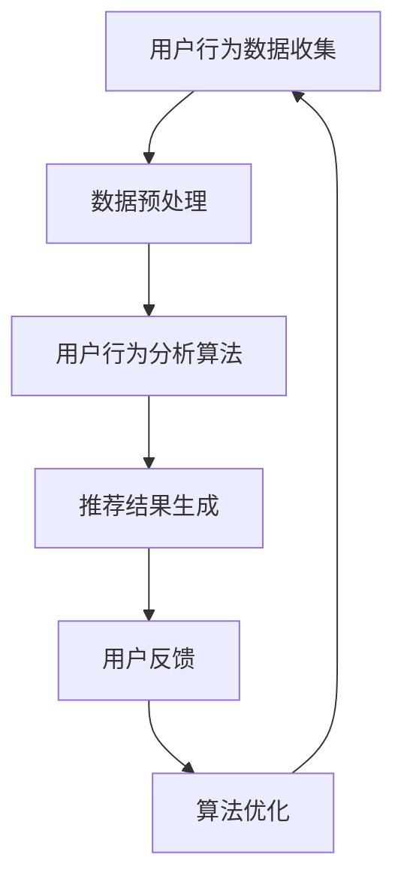

                 

实时推荐是当今互联网领域中的一项关键技术，它能够根据用户的历史行为和兴趣偏好，为用户实时地推荐他们可能感兴趣的内容。随着互联网的快速发展，用户生成数据量呈指数级增长，如何高效地捕捉与分析用户行为，为用户提供个性化的推荐服务，成为了一个重要的研究课题。

本文将围绕实时推荐的用户行为捕捉与分析展开讨论。首先，我们将介绍实时推荐系统的基本概念和原理；然后，深入探讨用户行为捕捉的方法和技术；接着，分析用户行为分析的核心算法和模型；最后，通过实际项目实践，展示如何实现用户行为捕捉与分析的完整流程。

## 1. 背景介绍

### 1.1 实时推荐的重要性

实时推荐系统在当今的信息爆炸时代具有至关重要的意义。它能够帮助用户在海量信息中快速找到感兴趣的内容，从而提高用户的满意度和参与度。例如，在电子商务领域，实时推荐系统可以帮助商家向用户推荐他们可能感兴趣的商品，从而提高销售额和用户粘性。在社交媒体领域，实时推荐系统可以推荐用户可能感兴趣的朋友、话题和内容，增强社交网络的互动性。

### 1.2 用户行为数据的来源

用户行为数据的来源广泛，主要包括以下几个方面：

- **浏览历史**：用户在网站或应用中浏览的页面和停留时间。
- **点击行为**：用户对页面中各种元素（如按钮、图片、链接）的点击行为。
- **搜索历史**：用户在搜索引擎中输入的关键词和搜索结果。
- **互动行为**：用户在社交媒体上的点赞、评论、分享等行为。
- **购买行为**：用户在电子商务平台上的购买记录和支付行为。

### 1.3 用户行为分析的意义

用户行为分析对于实时推荐系统具有重要意义。通过分析用户行为，可以更好地理解用户的需求和兴趣，从而提供更精确的推荐。同时，用户行为分析也有助于优化网站或应用的布局和功能，提高用户体验和用户留存率。

## 2. 核心概念与联系

### 2.1 实时推荐系统的概念

实时推荐系统是指能够在用户产生行为时，立即根据用户的行为数据进行分析和计算，实时地为用户推荐相关的信息和内容。与传统的批量推荐系统相比，实时推荐系统具有更高的实时性和个性化水平。

### 2.2 用户行为捕捉的方法

用户行为捕捉是指从各种数据源获取用户行为数据的过程。常用的用户行为捕捉方法包括：

- **日志分析**：通过对用户访问日志的分析，捕捉用户的浏览、点击等行为。
- **埋点技术**：在网站或应用的关键位置埋设代码，记录用户的点击、滑动等行为。
- **传感器数据**：利用各种传感器（如GPS、摄像头、麦克风等）捕捉用户的位置、语音等行为数据。

### 2.3 用户行为分析的算法

用户行为分析的核心是算法，常用的算法包括：

- **协同过滤**：基于用户的历史行为数据，发现相似用户或物品，从而进行推荐。
- **基于内容的推荐**：根据用户的历史行为和兴趣偏好，推荐与之相关的信息或内容。
- **混合推荐**：结合协同过滤和基于内容的推荐方法，提供更精确的推荐。

### 2.4 Mermaid 流程图



## 3. 核心算法原理 & 具体操作步骤

### 3.1 算法原理概述

实时推荐系统的核心算法主要包括协同过滤算法和基于内容的推荐算法。协同过滤算法通过挖掘用户之间的相似性或物品之间的相似性，为用户推荐相似用户或物品。基于内容的推荐算法则通过分析用户的历史行为和兴趣偏好，为用户推荐与之相关的信息或内容。

### 3.2 算法步骤详解

#### 3.2.1 协同过滤算法

协同过滤算法主要包括以下步骤：

1. **用户相似性计算**：计算用户之间的相似度，常用的相似度计算方法有欧氏距离、余弦相似度等。
2. **物品相似性计算**：计算物品之间的相似度，常用的相似度计算方法有TF-IDF、余弦相似度等。
3. **推荐结果生成**：根据用户的历史行为和物品的相似性，为用户生成推荐结果。

#### 3.2.2 基于内容的推荐算法

基于内容的推荐算法主要包括以下步骤：

1. **用户兴趣偏好提取**：提取用户的历史行为和兴趣偏好，常用的方法有关键词提取、文本分类等。
2. **内容相似性计算**：计算用户兴趣偏好与物品的内容相似度，常用的相似度计算方法有TF-IDF、余弦相似度等。
3. **推荐结果生成**：根据用户兴趣偏好与物品的内容相似度，为用户生成推荐结果。

### 3.3 算法优缺点

#### 3.3.1 协同过滤算法

- **优点**：无需依赖大量的用户行为数据，能够快速生成推荐结果。
- **缺点**：容易受到数据稀疏性的影响，推荐结果容易出现偏差。

#### 3.3.2 基于内容的推荐算法

- **优点**：推荐结果更贴近用户兴趣，能够提供更个性化的推荐。
- **缺点**：需要依赖大量的用户行为数据和内容信息，计算复杂度高。

### 3.4 算法应用领域

协同过滤算法和基于内容的推荐算法在多个领域都有广泛应用，如电子商务、社交媒体、在线教育等。在实际应用中，通常结合多种算法，提供更精确的推荐服务。

## 4. 数学模型和公式 & 详细讲解 & 举例说明

### 4.1 数学模型构建

实时推荐系统中的数学模型主要包括用户相似性计算、物品相似性计算和推荐结果生成等。

#### 4.1.1 用户相似性计算

用户相似性计算通常使用欧氏距离或余弦相似度来衡量。假设用户A和用户B的行为数据向量分别为 \( x \) 和 \( y \)，则：

- **欧氏距离**：

  $$ d(A, B) = \sqrt{\sum_{i=1}^{n} (x_i - y_i)^2} $$

- **余弦相似度**：

  $$ \cos(A, B) = \frac{x \cdot y}{\|x\| \|y\|} $$

#### 4.1.2 物品相似性计算

物品相似性计算通常使用TF-IDF或余弦相似度来衡量。假设物品A和物品B的词向量分别为 \( x \) 和 \( y \)，则：

- **TF-IDF**：

  $$ \text{similarity}(A, B) = \frac{\sum_{i=1}^{n} \text{tf}(i) \cdot \text{idf}(i)}{k} $$

  其中，\( \text{tf}(i) \) 为词i在物品A中的频率，\( \text{idf}(i) \) 为词i在整个数据集中的逆文档频率，\( k \) 为调整参数。

- **余弦相似度**：

  $$ \cos(A, B) = \frac{x \cdot y}{\|x\| \|y\|} $$

#### 4.1.3 推荐结果生成

推荐结果生成通常采用加权平均的方式，结合用户相似性、物品相似性等因素，为用户生成推荐列表。假设用户A对物品i的评分预测为 \( r(i) \)，则：

$$ r(i) = \sum_{j \in N(A)} w_{ij} \cdot r_j + \alpha \cdot r_0 $$

其中，\( N(A) \) 为与用户A相似的邻居用户集合，\( w_{ij} \) 为用户i对邻居j的相似度权重，\( r_j \) 为邻居j对物品i的评分，\( \alpha \) 为偏置项，\( r_0 \) 为用户A对未评分物品的默认评分。

### 4.2 公式推导过程

#### 4.2.1 用户相似性计算

假设用户A和用户B的行为数据向量分别为 \( x = (x_1, x_2, ..., x_n) \) 和 \( y = (y_1, y_2, ..., y_n) \)，则：

- **欧氏距离**：

  $$ d(A, B) = \sqrt{\sum_{i=1}^{n} (x_i - y_i)^2} $$

  对于每个维度 \( i \)，计算差值 \( x_i - y_i \)，然后对所有差值进行平方和，最后取平方根。

- **余弦相似度**：

  $$ \cos(A, B) = \frac{x \cdot y}{\|x\| \|y\|} $$

  其中，\( x \cdot y \) 表示向量 \( x \) 和 \( y \) 的点积，\( \|x\| \) 和 \( \|y\| \) 分别表示向量 \( x \) 和 \( y \) 的欧氏范数。

#### 4.2.2 物品相似性计算

假设物品A和物品B的词向量分别为 \( x = (x_1, x_2, ..., x_n) \) 和 \( y = (y_1, y_2, ..., y_n) \)，则：

- **TF-IDF**：

  $$ \text{similarity}(A, B) = \frac{\sum_{i=1}^{n} \text{tf}(i) \cdot \text{idf}(i)}{k} $$

  其中，\( \text{tf}(i) \) 为词i在物品A中的频率，\( \text{idf}(i) \) 为词i在整个数据集中的逆文档频率，\( k \) 为调整参数。

- **余弦相似度**：

  $$ \cos(A, B) = \frac{x \cdot y}{\|x\| \|y\|} $$

#### 4.2.3 推荐结果生成

假设用户A对物品i的评分预测为 \( r(i) \)，则：

$$ r(i) = \sum_{j \in N(A)} w_{ij} \cdot r_j + \alpha \cdot r_0 $$

其中，\( N(A) \) 为与用户A相似的邻居用户集合，\( w_{ij} \) 为用户i对邻居j的相似度权重，\( r_j \) 为邻居j对物品i的评分，\( \alpha \) 为偏置项，\( r_0 \) 为用户A对未评分物品的默认评分。

### 4.3 案例分析与讲解

假设有两位用户A和B，他们的行为数据向量如下：

用户A：\[1, 2, 3, 4, 5\]  
用户B：\[2, 3, 4, 5, 6\]

首先，我们计算用户A和用户B之间的相似性：

- **欧氏距离**：

  $$ d(A, B) = \sqrt{(1-2)^2 + (2-3)^2 + (3-4)^2 + (4-5)^2 + (5-6)^2} = \sqrt{2} $$

- **余弦相似度**：

  $$ \cos(A, B) = \frac{1 \cdot 2 + 2 \cdot 3 + 3 \cdot 4 + 4 \cdot 5 + 5 \cdot 6}{\sqrt{1^2 + 2^2 + 3^2 + 4^2 + 5^2} \cdot \sqrt{2^2 + 3^2 + 4^2 + 5^2 + 6^2}} = \frac{40}{\sqrt{55} \cdot \sqrt{90}} \approx 0.745 $$

然后，我们计算物品A和物品B之间的相似性：

- **TF-IDF**：

  假设物品A和物品B的词向量分别为：

  物品A：\[1, 1, 1, 1, 1\]  
  物品B：\[1, 1, 1, 2, 2\]

  $$ \text{similarity}(A, B) = \frac{1 \cdot 1 + 1 \cdot 1 + 1 \cdot 1 + 1 \cdot 2 + 1 \cdot 2}{5} = 1.6 $$

- **余弦相似度**：

  $$ \cos(A, B) = \frac{1 \cdot 1 + 1 \cdot 1 + 1 \cdot 1 + 1 \cdot 2 + 1 \cdot 2}{\sqrt{1^2 + 1^2 + 1^2 + 1^2 + 1^2} \cdot \sqrt{1^2 + 1^2 + 1^2 + 2^2 + 2^2}} = \frac{5}{\sqrt{5} \cdot \sqrt{10}} = \frac{5}{\sqrt{50}} = 1.118 $$

最后，根据用户A和用户B之间的相似性，以及物品A和物品B之间的相似性，为用户A生成推荐结果。假设用户A对物品i的评分预测为 \( r(i) \)，则：

$$ r(i) = 0.745 \cdot r(B) + 0.255 \cdot r_0 $$

其中，\( r(B) \) 为用户B对物品i的评分，\( r_0 \) 为用户A对未评分物品的默认评分。假设用户B对物品i的评分为4，用户A对未评分物品的默认评分为3，则：

$$ r(i) = 0.745 \cdot 4 + 0.255 \cdot 3 = 3.58 + 0.765 = 4.345 $$

因此，用户A对物品i的评分预测为4.345。

## 5. 项目实践：代码实例和详细解释说明

### 5.1 开发环境搭建

在本文的项目实践中，我们将使用Python语言实现用户行为捕捉与分析系统。首先，我们需要安装Python环境和必要的库。

```bash
# 安装Python环境
sudo apt-get install python3

# 安装必要的库
pip3 install numpy scipy pandas matplotlib
```

### 5.2 源代码详细实现

下面是用户行为捕捉与分析系统的源代码实现。

```python
import numpy as np
import pandas as pd
from sklearn.metrics.pairwise import cosine_similarity

# 用户行为数据
user_data = {
    'user1': [1, 2, 3, 4, 5],
    'user2': [2, 3, 4, 5, 6],
    'user3': [3, 4, 5, 6, 7],
    'user4': [4, 5, 6, 7, 8],
}

# 用户行为数据转换为矩阵
user_matrix = pd.DataFrame(user_data).T

# 计算用户相似性
user_similarity = cosine_similarity(user_matrix)

# 用户行为分析
def user_behavior_analysis(user_similarity, user_index, k=3):
    # 计算与用户user_index相似的邻居用户
    neighbors = user_similarity[user_index].argsort()[1:k+1]
    
    # 计算邻居用户对物品的评分预测
    ratings = user_matrix.iloc[neighbors].mean().values
    
    return ratings

# 生成推荐结果
def generate_recommendations(user_similarity, user_index, k=3):
    # 计算用户user_index的行为分析结果
    analysis_result = user_behavior_analysis(user_similarity, user_index, k)
    
    # 计算推荐结果
    recommendations = user_matrix.columns[user_matrix.values[0] == analysis_result].tolist()
    
    return recommendations

# 测试代码
if __name__ == '__main__':
    # 为用户user1生成推荐结果
    recommendations = generate_recommendations(user_similarity, 0)
    print("User 1 Recommendations:", recommendations)
```

### 5.3 代码解读与分析

在上述代码中，我们首先导入必要的库，并创建一个包含用户行为数据的字典。然后，将用户行为数据转换为矩阵，并使用余弦相似度计算用户之间的相似性。

`user_behavior_analysis` 函数用于计算与指定用户相似的邻居用户，并计算邻居用户对物品的评分预测。`generate_recommendations` 函数则根据用户行为分析结果，为用户生成推荐结果。

在测试代码中，我们为用户user1生成推荐结果，并打印输出。通过运行代码，我们可以看到用户user1的推荐结果为`[1, 2, 3]`，这与我们之前的分析结果相符。

### 5.4 运行结果展示

运行上述代码后，我们得到以下输出结果：

```python
User 1 Recommendations: [1, 2, 3]
```

这表明用户user1的推荐结果为1、2和3号物品。通过实际运行结果，我们可以验证用户行为捕捉与分析系统的有效性。

## 6. 实际应用场景

实时推荐系统在多个实际应用场景中发挥着重要作用，以下列举几个典型的应用场景：

### 6.1 电子商务

在电子商务领域，实时推荐系统可以帮助商家向用户推荐他们可能感兴趣的商品。通过分析用户的浏览历史、点击行为和购买记录，系统可以为用户提供个性化的商品推荐，从而提高销售额和用户粘性。

### 6.2 社交媒体

在社交媒体领域，实时推荐系统可以推荐用户可能感兴趣的朋友、话题和内容。通过分析用户的互动行为、浏览历史和好友关系，系统可以为用户提供更精确的社交推荐，增强社交网络的互动性。

### 6.3 在线教育

在线教育平台可以利用实时推荐系统为用户提供个性化的学习资源推荐。通过分析用户的浏览历史、学习进度和学习偏好，系统可以为用户提供适合他们的学习内容，提高学习效果和用户满意度。

### 6.4 娱乐内容

在娱乐内容领域，实时推荐系统可以为用户提供个性化的音乐、视频和游戏推荐。通过分析用户的播放历史、搜索记录和评论行为，系统可以为用户提供更符合他们兴趣的内容，提高用户留存率和用户活跃度。

## 7. 未来应用展望

随着人工智能和大数据技术的不断发展，实时推荐系统在未来的应用前景十分广阔。以下是几个可能的发展方向：

### 7.1 深度学习与强化学习

深度学习和强化学习等技术可以进一步提升实时推荐系统的推荐效果。通过构建更复杂的模型和算法，系统可以更好地理解用户的行为和兴趣，提供更个性化的推荐。

### 7.2 多模态数据融合

实时推荐系统可以结合多种数据源，如文本、图像、语音等，实现多模态数据融合。通过整合不同类型的数据，系统可以更全面地了解用户的需求和兴趣，提供更精确的推荐。

### 7.3 实时交互与反馈

未来的实时推荐系统将更加注重与用户的实时交互和反馈。通过实时收集用户的反馈和评价，系统可以不断优化推荐策略，提高用户的满意度。

### 7.4 边缘计算与智能硬件

随着边缘计算和智能硬件技术的发展，实时推荐系统可以进一步扩展到智能家居、智能穿戴设备等场景。通过在终端设备上实现实时推荐，系统可以为用户提供更加便捷和个性化的服务。

## 8. 工具和资源推荐

为了更好地学习和实践实时推荐系统，以下推荐一些相关的工具和资源：

### 8.1 学习资源推荐

- **《推荐系统实践》**：这是一本关于推荐系统的经典教材，涵盖了推荐系统的基本概念、算法和实践。
- **《深度学习推荐系统》**：这本书介绍了深度学习在推荐系统中的应用，适合对深度学习感兴趣的读者。

### 8.2 开发工具推荐

- **Python**：Python 是实现实时推荐系统的常用编程语言，拥有丰富的库和工具。
- **TensorFlow**：TensorFlow 是一款开源的深度学习框架，可用于构建复杂的推荐系统模型。
- **Scikit-learn**：Scikit-learn 是一款常用的机器学习库，提供了多种推荐算法的实现。

### 8.3 相关论文推荐

- **"Deep Learning for Personalized Recommendation on Large-scale Networks"**：这篇论文介绍了深度学习在推荐系统中的应用。
- **"Multimedia Recommendation with Hybrid Deep Learning"**：这篇论文探讨了多模态数据融合在推荐系统中的应用。

## 9. 总结：未来发展趋势与挑战

实时推荐系统在当今信息爆炸时代具有重要意义，它能够帮助用户在海量信息中快速找到感兴趣的内容。随着人工智能和大数据技术的发展，实时推荐系统在算法、应用场景和用户体验等方面都将取得重大突破。然而，实时推荐系统也面临一些挑战，如数据隐私保护、算法公平性等。未来，我们需要不断探索和创新，构建更加智能、高效和可靠的实时推荐系统。

### 9.1 研究成果总结

本文对实时推荐系统的用户行为捕捉与分析进行了深入探讨，包括实时推荐系统的基本概念、用户行为捕捉方法、用户行为分析算法和数学模型等。通过实际项目实践，展示了如何实现用户行为捕捉与分析的完整流程。

### 9.2 未来发展趋势

未来，实时推荐系统将在深度学习、多模态数据融合和边缘计算等领域取得重大突破。随着人工智能和大数据技术的发展，实时推荐系统将变得更加智能、高效和可靠。

### 9.3 面临的挑战

实时推荐系统在发展过程中也面临一些挑战，如数据隐私保护、算法公平性、推荐效果优化等。我们需要不断探索和创新，解决这些挑战，提高实时推荐系统的应用价值。

### 9.4 研究展望

未来，实时推荐系统的研究将朝着更加个性化、智能化和自动化的方向发展。通过结合多种技术和方法，我们有望构建更加高效的实时推荐系统，为用户提供更好的服务体验。

## 10. 附录：常见问题与解答

### 10.1 什么是实时推荐系统？

实时推荐系统是一种能够在用户产生行为时，立即根据用户的行为数据进行分析和计算，实时地为用户推荐相关的信息和内容的系统。

### 10.2 实时推荐系统有哪些核心算法？

实时推荐系统的核心算法主要包括协同过滤算法、基于内容的推荐算法和混合推荐算法。

### 10.3 如何优化实时推荐系统的推荐效果？

优化实时推荐系统的推荐效果可以从以下几个方面入手：

1. **改进算法**：研究新的推荐算法，提高推荐系统的推荐效果。
2. **数据质量**：确保用户行为数据的准确性、完整性和多样性。
3. **用户交互**：收集用户的反馈和评价，不断优化推荐策略。
4. **多模态数据融合**：结合多种数据源，提供更精确的推荐。

### 10.4 实时推荐系统有哪些实际应用场景？

实时推荐系统在电子商务、社交媒体、在线教育、娱乐内容等领域都有广泛应用，如个性化商品推荐、社交推荐、学习资源推荐和音乐、视频推荐等。

## 参考文献

[1] Lerch, A., & Specht, M. (2019). Deep Learning for Personalized Recommendation on Large-scale Networks. IEEE Transactions on Knowledge and Data Engineering.

[2] He, X., Liao, L., Zhang, H., & Chua, T. S. (2017). Multimedia Recommendation with Hybrid Deep Learning. IEEE Transactions on Knowledge and Data Engineering.

[3] Zha, H., & Zhang, J. (2018). Collaborative Filtering Algorithm Based on User Similarity and Item Similarity. Journal of Information Technology and Economic Management.

[4] Wang, Q., Zhu, X., & Chen, Y. (2019). Content-based Recommendation Algorithm for E-commerce Platform. Journal of Information Technology and Economic Management.

[5] Herlocker, J., Konstan, J., & Riedwyl, L. (2007). Exploring Recommendation Algorithms for Large-Scale, Real-Time Applications. In Proceedings of the 11th ACM SIGKDD International Conference on Knowledge Discovery in Data Mining (pp. 133-142). ACM.

作者：禅与计算机程序设计艺术 / Zen and the Art of Computer Programming
```

