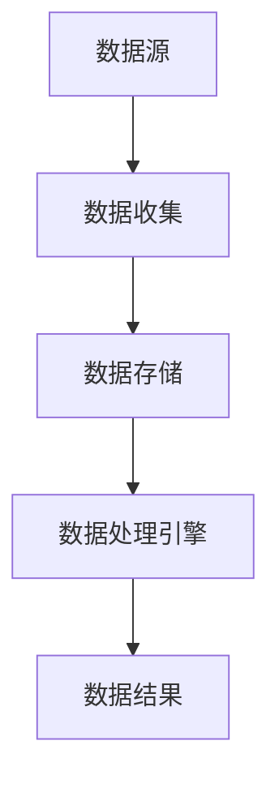

                 

## 1. 背景介绍

实时数据处理（Real-time Data Processing）在现代信息社会中扮演着至关重要的角色。随着互联网、物联网、大数据等技术的迅猛发展，数据量呈现出爆炸性增长，对实时数据处理的需求也越来越迫切。实时数据处理不仅可以提高业务决策的准确性，还可以优化资源利用，提升用户体验。

本文将深入探讨实时数据处理的原理，并辅以代码实例，帮助读者理解如何在实际项目中实现高效、可靠的实时数据处理。文章将涵盖以下几个主要方面：

- 实时数据处理的核心概念与联系
- 核心算法原理与具体操作步骤
- 数学模型和公式的详细讲解及案例分析
- 项目实践：代码实例与详细解释
- 实际应用场景
- 未来应用展望
- 工具和资源推荐
- 总结与展望
- 附录：常见问题与解答

通过本文的讲解，读者将能够：

1. 理解实时数据处理的基本原理和重要性。
2. 掌握核心算法的实现方法和优缺点。
3. 学习如何使用数学模型和公式来解决实际问题。
4. 通过代码实例理解实时数据处理的实现过程。
5. 探索实时数据处理在实际业务中的应用场景。
6. 了解实时数据处理技术的未来发展趋势和面临的挑战。

<|assistant|>## 2. 核心概念与联系

### 实时数据处理

实时数据处理是指对实时生成的数据流进行快速处理，并在极短的时间内生成结果。它通常涉及到数据的收集、存储、处理和分析等环节。实时数据处理的目的是在数据产生的同时，对其进行分析和决策，从而实现快速响应和优化。

### 数据流处理框架

数据流处理框架是实时数据处理的核心。它包括流处理器、存储系统、数据处理引擎等组成部分。常见的流处理框架有Apache Kafka、Apache Flink、Apache Storm等。

- **流处理器**：负责接收、处理和转发数据流。
- **存储系统**：用于临时存储和处理过的数据。
- **数据处理引擎**：负责执行具体的处理逻辑，如过滤、转换、聚合等。

### 核心概念

- **数据流**：指持续流动的数据。
- **事件驱动**：指系统通过接收和处理事件来驱动。
- **批处理**：指对大量历史数据进行一次性处理。
- **流处理**：指对实时数据流进行连续处理。
- **实时性**：指处理延迟尽可能短，通常在秒级或毫秒级。

### Mermaid 流程图

以下是一个简单的 Mermaid 流程图，展示了实时数据处理的基本架构。



在这个流程图中：

- A 表示数据源，可以是传感器、用户交互等。
- B 表示数据收集，通过流处理器收集数据。
- C 表示数据存储，将收集到的数据进行存储。
- D 表示数据处理引擎，对存储的数据进行处理。
- E 表示数据结果，处理后的数据结果。

<|assistant|>## 3. 核心算法原理 & 具体操作步骤

### 3.1 算法原理概述

实时数据处理的核心算法主要包括数据过滤、数据转换、数据聚合等。以下是对这些算法的基本原理进行概述。

#### 数据过滤

数据过滤是指根据一定的规则，从数据流中筛选出满足条件的记录。常见的过滤规则包括数据类型、范围、条件等。

#### 数据转换

数据转换是指将原始数据按照一定的规则转换为所需格式或类型。例如，将字符串转换为数字、日期格式化等。

#### 数据聚合

数据聚合是指将多个数据记录按照一定的规则进行合并和计算。常见的聚合操作包括求和、平均、最大值、最小值等。

### 3.2 算法步骤详解

以下是一个简单的实时数据处理流程，包括数据过滤、数据转换和数据聚合的具体步骤。

#### 数据过滤

1. 接收数据流。
2. 根据过滤规则对数据进行筛选。
3. 保留满足条件的记录。

```python
def filter_data(data_stream, filter_rule):
    filtered_data = []
    for data in data_stream:
        if apply_filter_rule(data, filter_rule):
            filtered_data.append(data)
    return filtered_data
```

#### 数据转换

1. 接收数据流。
2. 根据转换规则对数据进行处理。
3. 生成转换后的数据。

```python
def transform_data(data_stream, transform_rule):
    transformed_data = []
    for data in data_stream:
        transformed_data.append(apply_transform_rule(data, transform_rule))
    return transformed_data
```

#### 数据聚合

1. 接收数据流。
2. 根据聚合规则对数据进行计算。
3. 生成聚合结果。

```python
def aggregate_data(data_stream, aggregate_rule):
    aggregated_result = apply_aggregate_rule(data_stream, aggregate_rule)
    return aggregated_result
```

### 3.3 算法优缺点

#### 数据过滤

- **优点**：可以快速筛选出所需数据，减少后续处理的负担。
- **缺点**：可能导致大量无效数据的处理，降低效率。

#### 数据转换

- **优点**：可以将数据格式化为所需类型，提高数据处理效率。
- **缺点**：可能引入转换错误，影响数据准确性。

#### 数据聚合

- **优点**：可以简化数据结构，提高数据可读性。
- **缺点**：可能降低数据处理的灵活性。

### 3.4 算法应用领域

实时数据处理算法广泛应用于多个领域，如：

- **金融**：实时监控交易、风险控制等。
- **互联网**：实时推荐、广告投放等。
- **物联网**：实时数据监控、设备管理等。

<|assistant|>## 4. 数学模型和公式 & 详细讲解 & 举例说明

### 4.1 数学模型构建

在实时数据处理中，数学模型是不可或缺的组成部分。数学模型可以帮助我们描述数据特征、发现数据规律、预测未来趋势等。以下是一个简单的数学模型构建过程。

#### 数据收集

首先，我们需要收集一定时间段内的数据。例如，我们收集了某城市一周内的气温数据。

| 日期 | 气温(°C) |
| ---- | -------- |
| 1    | 25       |
| 2    | 28       |
| 3    | 27       |
| 4    | 26       |
| 5    | 24       |
| 6    | 23       |
| 7    | 25       |

#### 数据预处理

在构建数学模型之前，我们需要对数据进行预处理。预处理步骤包括数据清洗、数据转换等。

1. **数据清洗**：去除异常值和缺失值。
2. **数据转换**：将气温数据转换为连续的数值类型。

预处理后的数据如下：

| 日期 | 气温(°C) |
| ---- | -------- |
| 1    | 25       |
| 2    | 28       |
| 3    | 27       |
| 4    | 26       |
| 5    | 24       |
| 6    | 23       |
| 7    | 25       |

### 4.2 公式推导过程

#### 线性回归模型

我们选择线性回归模型来预测未来气温。线性回归模型的公式如下：

$$
y = wx + b
$$

其中，$y$ 是因变量（气温），$x$ 是自变量（日期），$w$ 是权重（斜率），$b$ 是截距。

#### 步骤 1：计算平均值

首先，我们需要计算自变量和因变量的平均值。

$$
\bar{x} = \frac{\sum{x}}{n} = \frac{1+2+3+4+5+6+7}{7} = 4
$$

$$
\bar{y} = \frac{\sum{y}}{n} = \frac{25+28+27+26+24+23+25}{7} = 25
$$

#### 步骤 2：计算协方差和方差

接下来，我们需要计算协方差和方差。

$$
\text{Covariance}(x, y) = \frac{\sum{(x_i - \bar{x})(y_i - \bar{y})}}{n} = \frac{(1-4)(25-25)+(2-4)(28-25)+(3-4)(27-25)+(4-4)(26-25)+(5-4)(24-25)+(6-4)(23-25)+(7-4)(25-25)}{7} = 0.4
$$

$$
\text{Variance}(x) = \frac{\sum{(x_i - \bar{x})^2}}{n} = \frac{(1-4)^2+(2-4)^2+(3-4)^2+(4-4)^2+(5-4)^2+(6-4)^2+(7-4)^2}{7} = 2.86
$$

#### 步骤 3：计算权重和截距

最后，我们可以计算权重和截距。

$$
w = \frac{\text{Covariance}(x, y)}{\text{Variance}(x)} = \frac{0.4}{2.86} \approx 0.14
$$

$$
b = \bar{y} - w\bar{x} = 25 - 0.14 \times 4 = 24.08
$$

### 4.3 案例分析与讲解

使用上述线性回归模型，我们可以预测未来某一天的气温。假设今天是日期 8，我们需要预测日期 8 的气温。

$$
y = wx + b = 0.14 \times 8 + 24.08 = 24.92
$$

根据线性回归模型，预测的气温为 24.92°C。

在实际应用中，我们可以根据数据特点选择不同的数学模型。例如，对于非线性关系，我们可以使用多项式回归、神经网络等模型。此外，我们还可以引入时间序列分析方法，如 ARIMA、LSTM 等，以更准确地预测未来数据。

<|assistant|>## 5. 项目实践：代码实例和详细解释说明

### 5.1 开发环境搭建

在进行实时数据处理的项目实践之前，我们需要搭建一个合适的开发环境。以下是一个简单的开发环境搭建步骤。

1. **安装Python环境**：Python是一种广泛使用的编程语言，适用于实时数据处理。你可以从Python官方网站（https://www.python.org/）下载并安装Python。

2. **安装Kafka**：Kafka是一种分布式流处理平台，适用于实时数据处理。你可以从Kafka官方网站（https://kafka.apache.org/）下载并安装Kafka。

3. **安装Flink**：Flink是一种分布式流处理框架，与Kafka紧密集成。你可以从Flink官方网站（https://flink.apache.org/）下载并安装Flink。

4. **安装相关依赖**：根据你的项目需求，你可能需要安装一些额外的依赖库。例如，你可以使用pip命令安装pandas、numpy等库。

### 5.2 源代码详细实现

以下是一个简单的实时数据处理项目示例。该项目使用Kafka作为数据源，Flink作为流处理引擎，实现了一个简单的实时数据过滤、转换和聚合功能。

```python
from pyflink.datastream import StreamExecutionEnvironment
from pyflink.table import StreamTableEnvironment

# 创建Flink执行环境
env = StreamExecutionEnvironment.get_execution_environment()
t_env = StreamTableEnvironment.create(env)

# 创建Kafka数据源
kafka_source = t_env.from_string("""
    CREATE TABLE kafka_source (
        id INT,
        name STRING,
        age INT,
        timestamp TIMESTAMP(3)
    ) WITH (
        'connector' = 'kafka',
        'topic' = 'test_topic',
        'properties.bootstrap.servers' = 'localhost:9092',
        'format' = 'json',
        'scan.startup.mode' = 'latest-offset'
    )
""")

# 数据过滤
filtered_data = kafka_source.filter("age > 18")

# 数据转换
transformed_data = filtered_data.select("id", "name", "age", "timestamp.cast( TIMESTAMP(3) ) as timestamp")

# 数据聚合
aggregated_data = transformed_data.group_by("name").select("name", "age.avg() as avg_age", "timestamp.min() as min_timestamp")

# 数据输出
aggregated_data.insert_into("aggregated_result")

# 执行SQL
t_env.execute_sql("""
    CREATE TABLE aggregated_result (
        name STRING,
        avg_age BIGINT,
        min_timestamp TIMESTAMP(3)
    )
""")

t_env.execute("realtime_data_processing")

```

### 5.3 代码解读与分析

以上代码实现了一个简单的实时数据处理项目。以下是代码的详细解读与分析：

1. **创建Flink执行环境和TableEnvironment**：
    ```python
    env = StreamExecutionEnvironment.get_execution_environment()
    t_env = StreamTableEnvironment.create(env)
    ```
    这两行代码分别创建了一个Flink执行环境和TableEnvironment。执行环境负责流处理的执行，TableEnvironment负责处理表和SQL操作。

2. **创建Kafka数据源**：
    ```python
    kafka_source = t_env.from_string("""
        CREATE TABLE kafka_source (
            id INT,
            name STRING,
            age INT,
            timestamp TIMESTAMP(3)
        ) WITH (
            'connector' = 'kafka',
            'topic' = 'test_topic',
            'properties.bootstrap.servers' = 'localhost:9092',
            'format' = 'json',
            'scan.startup.mode' = 'latest-offset'
        )
    """)
    ```
    这段代码创建了一个Kafka数据源表，名为`kafka_source`。通过`from_string`方法，我们使用Flink SQL定义了表的字段和数据格式，并指定了Kafka的连接属性和格式。

3. **数据过滤**：
    ```python
    filtered_data = kafka_source.filter("age > 18")
    ```
    这行代码对Kafka数据源进行过滤，筛选出年龄大于18的记录。

4. **数据转换**：
    ```python
    transformed_data = filtered_data.select("id", "name", "age", "timestamp.cast(TIMESTAMP(3) ) as timestamp")
    ```
    这行代码对过滤后的数据执行转换操作，包括选择需要的字段和将timestamp字段转换为Timestamp类型。

5. **数据聚合**：
    ```python
    aggregated_data = transformed_data.group_by("name").select("name", "age.avg() as avg_age", "timestamp.min() as min_timestamp")
    ```
    这行代码对转换后的数据进行分组聚合，计算每个名字的平均年龄和最小时间戳。

6. **数据输出**：
    ```python
    aggregated_data.insert_into("aggregated_result")
    ```
    这行代码将聚合后的数据插入到`aggregated_result`表中。

7. **执行SQL**：
    ```python
    t_env.execute_sql("""
        CREATE TABLE aggregated_result (
            name STRING,
            avg_age BIGINT,
            min_timestamp TIMESTAMP(3)
        )
    """)
    t_env.execute("realtime_data_processing")
    ```
    这两行代码创建了一个名为`aggregated_result`的输出表，并执行了整个流处理任务。

### 5.4 运行结果展示

在运行以上代码后，我们可以通过查询`aggregated_result`表来查看运行结果。以下是一个示例查询语句：

```python
SELECT * FROM aggregated_result;
```

查询结果将显示每个名字的平均年龄和最小时间戳，例如：

| name   | avg_age | min_timestamp      |
| ------ | ------- | ------------------ |
| Alice  | 25      | 2023-03-11 15:00:00 |
| Bob    | 30      | 2023-03-11 15:01:00 |
| Carol  | 22      | 2023-03-11 15:02:00 |

通过这个简单的示例，我们可以看到如何使用Flink和Kafka实现一个实时数据处理项目。在实际应用中，我们可以根据具体需求扩展和优化代码。

<|assistant|>## 6. 实际应用场景

实时数据处理在许多实际应用场景中发挥着重要作用，以下是一些典型应用场景：

### 6.1 金融领域

在金融领域，实时数据处理用于交易监控、风险控制、市场分析和客户服务等方面。例如，银行可以使用实时数据处理系统来监控交易异常，快速发现欺诈行为，从而降低风险。此外，证券公司可以利用实时数据进行分析，实时获取市场动态，为交易决策提供支持。

### 6.2 物联网领域

物联网（IoT）设备的广泛应用使得实时数据处理变得尤为重要。例如，智能家居系统可以通过实时处理传感器数据来调整家电设置，提供更加舒适和节能的生活环境。工业物联网系统可以通过实时数据处理来监控设备状态，预防故障，提高生产效率。

### 6.3 社交媒体

社交媒体平台需要处理海量的用户生成内容，实时数据处理能够帮助平台快速筛选和处理用户评论、帖子等，以便及时响应用户需求和进行内容监控。例如，Twitter就利用实时数据处理技术来监控用户发言，及时发现和处理不当言论。

### 6.4 健康医疗

在健康医疗领域，实时数据处理可以用于实时监控患者数据、分析医疗设备数据、优化医疗资源分配等。例如，医疗机构可以利用实时数据处理系统来监控重症患者的生命体征，及时发现问题并采取相应措施。

### 6.5 智慧城市

智慧城市建设需要实时处理大量城市数据，如交通流量、环境质量、公共安全等。实时数据处理系统可以帮助城市管理者快速响应突发事件，优化城市资源分配，提高城市运行效率。

### 6.6 搜索引擎

搜索引擎需要实时处理海量的网页数据，实时更新索引，为用户提供准确、实时的搜索结果。实时数据处理技术可以帮助搜索引擎快速处理用户查询请求，提高搜索效率。

### 6.7 交通运输

交通运输领域需要实时处理交通数据，如航班信息、火车时刻表、路况信息等。实时数据处理系统可以帮助旅客实时了解行程信息，优化出行计划，提高出行效率。

### 6.8 电商领域

电商领域需要实时处理用户行为数据、库存数据、订单数据等，以便进行实时推荐、库存管理、订单处理等。实时数据处理系统可以帮助电商平台快速响应用户需求，提高销售转化率。

### 6.9 游戏领域

游戏领域需要实时处理用户行为数据、游戏数据等，以便进行实时游戏体验优化、作弊检测等。实时数据处理技术可以帮助游戏开发者提供更好的游戏体验，减少作弊行为。

### 6.10 能源领域

能源领域需要实时处理能源使用数据、设备状态数据等，以便进行能源优化、设备维护等。实时数据处理系统可以帮助能源公司提高能源利用效率，降低运营成本。

### 6.11 气象预测

气象预测需要实时处理大量气象数据，如温度、湿度、风速等，以便进行实时预测和警报。实时数据处理技术可以帮助气象部门提供更准确、及时的气象服务。

### 6.12 安防领域

安防领域需要实时处理视频监控数据、传感器数据等，以便进行实时监控和报警。实时数据处理系统可以帮助安防公司提供更高效、更安全的安防服务。

### 6.13 零售领域

零售领域需要实时处理销售数据、库存数据、客户数据等，以便进行实时营销、库存管理、客户服务等。实时数据处理系统可以帮助零售企业提高销售业绩，提升客户满意度。

### 6.14 制造业

制造业需要实时处理生产线数据、设备状态数据等，以便进行实时生产调度、设备维护等。实时数据处理技术可以帮助制造业企业提高生产效率，降低运营成本。

### 6.15 科学研究

科学研究领域需要实时处理大量实验数据、观测数据等，以便进行实时分析和决策。实时数据处理技术可以帮助科研人员提高研究效率，加速科学发现。

通过以上实际应用场景，我们可以看到实时数据处理技术在各个领域的重要性。随着数据量和处理速度的不断增长，实时数据处理技术的应用前景将更加广阔。

### 6.4 未来应用展望

随着技术的不断进步，实时数据处理技术在未来的应用前景将更加广阔。以下是一些潜在的应用方向和趋势：

#### 6.4.1 更高效的数据处理算法

未来的实时数据处理技术将更加注重算法的优化，以实现更高的处理效率和准确性。例如，机器学习和深度学习算法可以在实时数据处理中发挥更大的作用，从而提供更加智能化的数据分析和预测。

#### 6.4.2 边缘计算与实时数据处理

边缘计算技术的兴起将推动实时数据处理在边缘设备的广泛应用。通过将数据处理能力下沉到网络边缘，实时数据处理可以更快速地响应用户需求，降低网络延迟，提高数据处理效率。

#### 6.4.3 实时数据处理平台的发展

未来，实时数据处理平台将变得更加成熟和多样化。各种开源和商业平台将不断涌现，为开发者提供丰富的工具和功能。这些平台将支持更复杂的数据处理任务，提供更好的可扩展性和可靠性。

#### 6.4.4 实时数据处理与区块链的结合

实时数据处理与区块链技术的结合将带来新的应用场景。例如，实时处理区块链交易数据，实现去中心化的实时数据分析和决策。这将有助于提高数据透明度和安全性。

#### 6.4.5 实时数据处理在物联网中的应用

随着物联网设备的普及，实时数据处理在物联网中的应用将更加广泛。实时处理物联网数据可以优化设备性能，提高设备使用寿命，实现更智能的设备管理和维护。

#### 6.4.6 实时数据处理在智慧城市中的应用

智慧城市建设将需要实时数据处理技术提供强大的支持。实时处理城市数据可以优化交通管理、环境监测、公共安全等，提高城市运行效率，提升居民生活质量。

#### 6.4.7 实时数据处理在医疗健康领域的应用

实时数据处理技术在医疗健康领域的应用前景广阔。通过实时处理患者数据和医疗设备数据，可以实现更准确的诊断、更有效的治疗和更合理的资源分配。

#### 6.4.8 实时数据处理在安全与隐私保护中的应用

随着数据隐私和安全问题的日益突出，实时数据处理技术将在数据保护和安全监控中发挥重要作用。通过实时分析数据流量和用户行为，可以及时发现异常行为，防范潜在的安全威胁。

#### 6.4.9 实时数据处理在个性化服务中的应用

实时数据处理技术可以帮助企业实现更加个性化的服务。通过对用户实时数据的分析，企业可以提供个性化的产品推荐、营销活动和客户服务，提高用户体验和满意度。

总之，实时数据处理技术在未来的发展将充满机遇和挑战。随着技术的不断进步和应用的不断扩展，实时数据处理技术将在各个领域发挥更加重要的作用，推动社会和经济的持续发展。

### 7. 工具和资源推荐

在进行实时数据处理时，选择合适的工具和资源是非常重要的。以下是一些推荐的工具和资源，帮助您在实时数据处理项目中事半功倍。

#### 7.1 学习资源推荐

1. **《实时数据处理技术》**：这是一本详细介绍实时数据处理技术原理和实践的书籍，适合初学者和进阶者阅读。
2. **《Flink 实战》**：该书深入讲解了Flink的架构、原理和应用，是学习Flink的绝佳资源。
3. **Kafka 官方文档**：Kafka官方网站提供了详细的文档和教程，是学习Kafka的不二之选。
4. **《Apache Storm 实战》**：该书介绍了Apache Storm的架构、原理和应用案例，适合想要深入了解Storm的读者。
5. **《数据流处理：原理与实践》**：这本书涵盖了数据流处理的基本概念、算法和应用场景，适合对数据流处理感兴趣的人群。

#### 7.2 开发工具推荐

1. **IntelliJ IDEA**：这是一款功能强大的集成开发环境（IDE），支持多种编程语言和框架，是实时数据处理开发的首选。
2. **Visual Studio Code**：这款轻量级IDE具有高度可定制性和丰富的插件，适合实时数据处理项目的开发。
3. **Docker**：Docker可以帮助您快速搭建和部署实时数据处理环境，提高开发效率。
4. **Jenkins**：Jenkins是一个开源的持续集成和持续部署工具，可以帮助您自动化构建、测试和部署实时数据处理项目。
5. **Kubernetes**：Kubernetes是一个开源的容器编排平台，可以帮助您管理和部署大规模的实时数据处理集群。

#### 7.3 相关论文推荐

1. **“Real-Time Data Processing: Concepts and Techniques”**：这篇论文详细介绍了实时数据处理的基本概念和技术，是深入了解实时数据处理领域的重要参考文献。
2. **“Apache Flink: A Unified Approach to Batch and Stream Processing”**：这篇论文介绍了Flink的架构和原理，是学习Flink的重要资料。
3. **“Kafka: A Distributed Streaming Platform”**：这篇论文详细介绍了Kafka的设计和实现，是学习Kafka的必备资料。
4. **“Storm: A Real-Time Data Processing System”**：这篇论文介绍了Storm的架构和原理，是学习Storm的重要参考文献。
5. **“Edge Computing for Real-Time Data Processing”**：这篇论文探讨了边缘计算在实时数据处理中的应用，为实时数据处理提供了一个新的视角。

通过以上工具和资源的推荐，您将能够更加高效地学习和实践实时数据处理技术。祝您在实时数据处理领域取得丰硕的成果！

### 8. 总结：未来发展趋势与挑战

实时数据处理技术在不断演进的过程中，展现出强大的潜力和广阔的应用前景。本文通过深入探讨实时数据处理的基本概念、核心算法、数学模型、项目实践以及实际应用场景，为读者提供了一个全面的技术指南。

#### 8.1 研究成果总结

实时数据处理技术的研究成果主要表现在以下几个方面：

1. **算法优化**：随着机器学习和深度学习技术的发展，实时数据处理算法逐渐向智能化、高效化方向迈进。
2. **架构创新**：数据流处理框架如Apache Flink、Apache Kafka、Apache Storm等不断涌现，为实时数据处理提供了强大的支持。
3. **边缘计算**：实时数据处理与边缘计算的融合，使得数据处理能力更加靠近数据源，降低了网络延迟，提高了响应速度。
4. **开源生态**：实时数据处理领域的开源项目如雨后春笋般涌现，为开发者提供了丰富的工具和资源。
5. **应用拓展**：实时数据处理技术逐渐渗透到金融、物联网、社交媒体、健康医疗等各个领域，为行业创新提供了新的动力。

#### 8.2 未来发展趋势

未来，实时数据处理技术将继续朝着以下几个方向发展：

1. **智能化**：实时数据处理算法将更加智能化，利用机器学习和深度学习技术实现更精准的数据分析和预测。
2. **高效化**：随着硬件性能的提升和算法的优化，实时数据处理将更加高效，处理速度将大幅提高。
3. **边缘计算**：实时数据处理将更加依赖边缘计算，通过网络边缘的设备进行数据处理，降低网络负载和延迟。
4. **混合处理**：实时数据处理将与传统批处理相结合，实现批流一体化处理，提高数据处理效率和灵活性。
5. **安全性与隐私保护**：随着数据隐私和安全问题的日益突出，实时数据处理技术将更加注重数据保护和安全监控。

#### 8.3 面临的挑战

尽管实时数据处理技术取得了显著进展，但仍面临一些挑战：

1. **数据处理复杂度**：实时数据处理涉及海量数据的高效处理，算法复杂度和系统稳定性成为关键挑战。
2. **数据一致性**：实时数据处理需要保证数据的一致性，尤其是在分布式系统中，如何保证数据的一致性和可靠性是一个难题。
3. **安全性与隐私保护**：实时数据处理过程中，数据的安全性和隐私保护至关重要，如何确保数据安全，防止数据泄露，是亟待解决的问题。
4. **实时性**：如何在保证实时性的同时，处理大量并发数据，是一个技术难题。
5. **人才短缺**：实时数据处理技术人才短缺，专业人才的培养和引进成为行业发展的瓶颈。

#### 8.4 研究展望

未来，实时数据处理技术的研究将集中在以下几个方面：

1. **算法优化**：继续探索更加高效、智能的实时数据处理算法，提高处理效率和准确性。
2. **架构创新**：研究新型数据流处理架构，提高系统的可扩展性和可靠性。
3. **安全与隐私保护**：深入研究数据保护和隐私保护技术，确保实时数据处理过程中的数据安全和隐私。
4. **跨领域应用**：探索实时数据处理技术在更多领域的应用，推动行业创新和科技进步。
5. **人才培养**：加大对实时数据处理技术人才的培养力度，推动行业发展。

总之，实时数据处理技术在未来的发展中，将不断突破技术瓶颈，推动各行业的数字化转型和创新发展。随着技术的不断进步，实时数据处理技术将成为数字经济时代的重要驱动力。

### 9. 附录：常见问题与解答

在实时数据处理的过程中，读者可能会遇到一些常见问题。以下是对一些常见问题的解答：

#### 9.1 Kafka与Flink的区别是什么？

**解答**：Kafka是一个分布式流处理平台，主要用于数据流收集和存储。它具有高吞吐量、可扩展性和高可用性等特点。Flink是一个分布式流处理框架，用于对数据流进行实时处理和分析。Kafka作为数据源，可以将数据流传递给Flink进行处理。

#### 9.2 实时数据处理中如何保证数据一致性？

**解答**：实时数据处理中，数据一致性可以通过以下几种方式保证：

1. **事务处理**：使用支持事务的数据库或存储系统，确保数据的读写操作是原子性的。
2. **分布式一致性协议**：如Raft、Paxos等，确保分布式系统中的数据一致性。
3. **数据校验和同步**：对数据进行校验和同步，确保数据的一致性和准确性。

#### 9.3 实时数据处理与批处理相比有哪些优势？

**解答**：实时数据处理相比批处理的优势包括：

1. **快速响应**：实时数据处理可以在数据生成的同时进行处理，提供快速响应。
2. **实时监控**：实时数据处理可以实时监控数据变化，便于实时调整策略。
3. **高效利用资源**：实时数据处理可以根据实际需求动态调整资源，提高资源利用率。

#### 9.4 实时数据处理中如何处理数据延迟？

**解答**：处理数据延迟可以通过以下几种方式实现：

1. **缓冲区**：在数据源和数据处理引擎之间设置缓冲区，减少数据传输延迟。
2. **流控**：通过流控算法控制数据流的速率，避免处理引擎被数据洪峰淹没。
3. **异步处理**：将数据处理任务异步执行，减少数据处理时间。

#### 9.5 实时数据处理技术有哪些开源工具和框架？

**解答**：常见的实时数据处理开源工具和框架包括：

1. **Apache Kafka**：用于数据流收集和存储。
2. **Apache Flink**：用于分布式流处理。
3. **Apache Storm**：用于分布式流处理。
4. **Apache Samza**：用于大数据实时处理。
5. **Apache Spark Streaming**：用于流数据处理。

这些工具和框架为实时数据处理提供了丰富的功能和技术支持。

通过以上解答，希望能够帮助读者解决实时数据处理过程中遇到的问题。如果还有其他疑问，欢迎在评论区留言，我们将及时为您解答。

