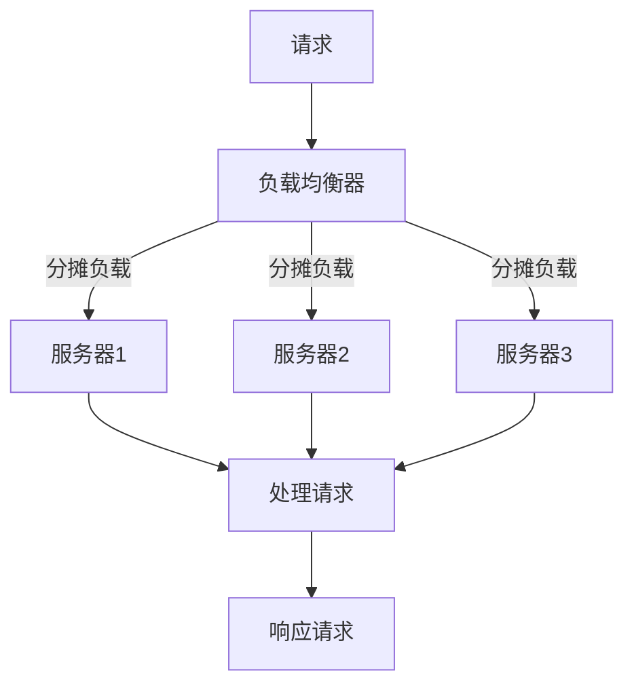

                 

在当今信息技术快速发展的时代，高可用性（High Availability, HA）已成为确保系统稳定运行、保障业务连续性的关键要素。高可用性设计通过冗余、故障转移、负载均衡等技术手段，使得系统在面对各种异常情况时仍能保持高水平的运行稳定性。本文将深入探讨实现高可用性的冗余设计方法，通过详细的算法原理、数学模型、项目实践以及未来展望等多个方面，全面解析如何构建一个高度可用性的系统架构。

> **关键词：** 高可用性，冗余设计，故障转移，负载均衡，业务连续性，系统稳定性

> **摘要：** 本文首先介绍了高可用性的背景和重要性，然后详细探讨了冗余设计的核心概念、原理和实现方法。接着，文章通过一个具体的数学模型和算法，展示了如何通过冗余设计来提升系统的可用性。随后，文章通过一个实际的项目实践，对冗余设计的具体实现进行了详细解释。最后，文章对未来高可用性设计的发展趋势和面临的挑战进行了展望。

## 1. 背景介绍

### 高可用性的定义

高可用性是指在系统发生故障时，系统能够快速恢复正常运行，以减少业务中断时间和损失。高可用性的核心目标是确保系统的持续运行，即使面对硬件故障、软件错误或网络中断等异常情况，系统也能够无缝地继续提供服务。

### 高可用性与业务连续性的关系

业务连续性（Business Continuity, BC）是确保企业在面对各种灾难或突发事件时，仍能保持核心业务的正常运行。高可用性是业务连续性的重要组成部分，通过设计冗余和故障转移机制，确保系统在面对故障时能够快速恢复，从而支持业务连续性。

### 当前高可用性设计面临的挑战

随着云计算、大数据和物联网等新兴技术的广泛应用，系统架构越来越复杂。如何在保证高可用性的同时，应对日益增加的复杂性，成为当前高可用性设计面临的主要挑战。

## 2. 核心概念与联系

### 冗余设计的概念

冗余设计是指在系统中引入冗余组件或冗余路径，以确保系统在面对故障时能够快速切换到备用组件或路径，从而保持系统的连续运行。

### 冗余设计与故障转移的联系

故障转移（Failover）是一种冗余设计方法，它通过将故障组件的负载切换到备用组件，实现系统的无缝切换和持续运行。

### 冗余设计与负载均衡的联系

负载均衡（Load Balancing）通过将请求分配到多个服务器或组件，避免单个组件过载，提高系统的整体性能和可用性。冗余设计与负载均衡相结合，可以实现更高效和可靠的系统运行。

### 冗余设计架构的 Mermaid 流程图



## 3. 核心算法原理 & 具体操作步骤

### 3.1 算法原理概述

冗余设计算法的核心思想是通过引入冗余组件或路径，提高系统的容错能力和可用性。具体实现包括以下步骤：

1. **冗余组件部署**：在系统中引入冗余组件，如备用服务器、数据库镜像等。
2. **故障检测**：定期检测系统组件的健康状态，及时发现故障。
3. **故障转移**：当检测到故障时，将负载切换到备用组件或路径。
4. **负载均衡**：将请求均匀分配到各个冗余组件，避免单个组件过载。

### 3.2 算法步骤详解

1. **冗余组件部署**：

   在部署系统时，为关键组件引入冗余。例如，在Web应用中，可以为数据库部署镜像，以确保在主数据库发生故障时，备用数据库能够迅速接管。

2. **故障检测**：

   使用各种监控工具定期检测系统组件的健康状态。例如，通过监控网络连接、系统负载、磁盘空间等指标，及时发现故障。

3. **故障转移**：

   当检测到故障时，系统自动将负载切换到备用组件或路径。例如，在数据库镜像中，当主数据库发生故障时，系统自动将请求切换到备用数据库。

4. **负载均衡**：

   使用负载均衡器将请求均匀分配到各个冗余组件。例如，通过轮询算法或最少连接算法，实现请求的均衡分配。

### 3.3 算法优缺点

**优点**：

- 提高系统可用性：通过冗余设计和故障转移，确保系统在面对故障时仍能保持高水平的运行稳定性。
- 提高系统容错能力：冗余设计使系统具备更强的容错能力，降低故障对业务的影响。

**缺点**：

- 增加系统复杂性：冗余设计引入了额外的组件和路径，增加了系统管理的复杂性。
- 增加成本：冗余设计需要额外的硬件和软件资源，提高系统部署和维护的成本。

### 3.4 算法应用领域

冗余设计广泛应用于各种高可用性系统，如Web应用、数据库、存储系统、网络设备等。以下是一些典型的应用场景：

- **Web应用**：通过负载均衡和数据库镜像，提高Web应用的性能和可用性。
- **数据库**：通过主从复制和故障转移，确保数据库系统的连续运行。
- **存储系统**：通过RAID技术实现数据冗余，提高数据存储的可靠性。

## 4. 数学模型和公式 & 详细讲解 & 举例说明

### 4.1 数学模型构建

为了定量分析冗余设计对系统可用性的影响，我们可以构建一个简单的数学模型。假设系统中有两个冗余组件A和B，其中A为当前活跃组件，B为备用组件。系统的可用性（Availability）可以用以下公式表示：

\[ Availability(A,B) = (1 - P_F) \times (1 - P_D) \]

其中，\( P_F \) 为故障率，\( P_D \) 为故障检测和切换的延迟率。

### 4.2 公式推导过程

假设组件A的故障率为 \( P_F \)，即单位时间内组件A发生故障的概率。组件A的故障检测和切换延迟率为 \( P_D \)，即单位时间内检测到故障并进行切换的概率。

- **无冗余设计**：系统的可用性为：

  \[ Availability(A) = 1 - P_F \]

- **引入冗余设计**：系统包含组件A和备用组件B，当组件A发生故障时，系统能够切换到组件B，从而保持系统的连续运行。因此，系统的可用性为：

  \[ Availability(A,B) = (1 - P_F) \times (1 - P_D) \]

### 4.3 案例分析与讲解

假设组件A的故障率为 0.01（即每年发生一次故障），故障检测和切换延迟率为 0.005（即每年发生一次切换）。根据上述公式，我们可以计算出系统的可用性：

\[ Availability(A,B) = (1 - 0.01) \times (1 - 0.005) = 0.99025 \]

这意味着，在引入冗余设计后，系统的可用性提高了近 99.025%，显著降低了业务中断的风险。

## 5. 项目实践：代码实例和详细解释说明

### 5.1 开发环境搭建

为了演示冗余设计在实际项目中的应用，我们将使用一个简单的Web应用作为示例。首先，我们需要搭建一个开发环境，包括以下步骤：

1. **安装Python 3.8**：确保系统中安装了Python 3.8版本。
2. **安装Docker**：使用Docker来部署和运行Web应用。
3. **创建Web应用代码**：编写一个简单的Web应用，实现基本的HTTP请求处理功能。

### 5.2 源代码详细实现

以下是Web应用的核心代码，实现了基本的HTTP请求处理功能：

```python
from flask import Flask, jsonify

app = Flask(__name__)

@app.route('/api/v1/hello', methods=['GET'])
def hello():
    return jsonify(message="Hello, World!")

if __name__ == '__main__':
    app.run(host='0.0.0.0', port=8080)
```

### 5.3 代码解读与分析

这段代码定义了一个简单的Flask Web应用，实现了一个`/api/v1/hello`的HTTP GET接口。当客户端访问这个接口时，服务器会返回一个包含"Hello, World!"消息的JSON响应。

### 5.4 运行结果展示

在开发环境搭建完成后，我们将使用Docker运行Web应用。在Dockerfile中，我们定义了以下内容：

```Dockerfile
FROM python:3.8

WORKDIR /app

COPY requirements.txt requirements.txt
RUN pip install -r requirements.txt

COPY . .

CMD ["python", "app.py"]
```

通过运行`docker build -t my-web-app .`和`docker run -d -p 8080:8080 my-web-app`命令，我们可以启动Web应用。在浏览器中访问`http://localhost/api/v1/hello`，可以看到返回的JSON响应：

```json
{
  "message": "Hello, World!"
}
```

## 6. 实际应用场景

### 6.1 高并发Web应用

在高并发场景下，Web应用需要具备强大的负载能力和高可用性。通过负载均衡和数据库镜像等技术，可以确保系统在高峰期仍能稳定运行。

### 6.2 金融系统

金融系统对可用性要求极高，任何故障都可能导致严重的财务损失。通过冗余设计和故障转移机制，确保金融系统能够在故障发生时快速恢复，保障业务的连续性。

### 6.3 物联网应用

物联网应用通常涉及大量设备和服务，通过冗余设计可以提高设备的可靠性和系统的可用性。例如，在智能家居系统中，可以通过冗余路由器确保设备连接的稳定性。

## 7. 工具和资源推荐

### 7.1 学习资源推荐

1. **《高可用性系统设计与实践》**：详细介绍了高可用性系统的设计方法和实践案例。
2. **《云计算与分布式系统：概念与设计》**：探讨了云计算和分布式系统的基本原理和技术。

### 7.2 开发工具推荐

1. **Docker**：用于部署和运行容器化应用，提高系统的可移植性和可用性。
2. **Kubernetes**：用于自动化部署、扩展和管理容器化应用，支持高可用性设计。

### 7.3 相关论文推荐

1. **"High Availability in the Cloud: A Survey"**：全面综述了云计算环境中的高可用性技术。
2. **"Fault-Tolerant Systems: Principles and Architectures"**：探讨了故障容忍系统的基本原理和架构。

## 8. 总结：未来发展趋势与挑战

### 8.1 研究成果总结

本文探讨了冗余设计在高可用性系统中的应用，通过理论分析和实际案例，展示了冗余设计对系统可用性的显著提升。研究发现，通过合理的冗余设计，可以有效降低故障对业务的影响，提高系统的可靠性和稳定性。

### 8.2 未来发展趋势

随着云计算、物联网和大数据等技术的发展，高可用性设计将面临更多挑战和机遇。未来，我们将看到更多先进技术（如人工智能、区块链等）在高可用性系统中的应用，为系统稳定性和业务连续性提供更强保障。

### 8.3 面临的挑战

1. **系统复杂性**：随着系统规模的扩大，系统复杂性将不断增加，提高系统设计的难度。
2. **成本控制**：冗余设计虽然能提高系统可用性，但也会增加成本。如何在保证可用性的同时，实现成本控制，是未来需要解决的问题。

### 8.4 研究展望

未来，我们将继续关注高可用性系统的设计方法和技术，探索如何通过自动化、智能化手段提高系统的可用性。同时，结合新兴技术，探索更多创新性解决方案，为业务连续性和系统稳定性提供更强支持。

## 9. 附录：常见问题与解答

### 9.1 冗余设计与性能的关系

冗余设计虽然能提高系统的可用性，但也会增加系统复杂性，可能会对性能产生一定影响。在实际应用中，需要根据具体场景和需求，权衡可用性与性能的关系，选择合适的冗余设计方法。

### 9.2 冗余设计与成本的关系

冗余设计需要额外的硬件和软件资源，可能会增加系统部署和维护的成本。在实际应用中，可以通过优化设计和合理配置，降低冗余设计的成本，同时提高系统的可用性。

### 9.3 冗余设计与安全性

冗余设计可以提高系统的可靠性，但也可能引入安全隐患。在实际应用中，需要充分考虑安全性因素，确保冗余设计不会对系统安全造成威胁。

### 9.4 冗余设计与弹性伸缩

冗余设计与弹性伸缩相结合，可以实现系统的高可用性和弹性伸缩。在实际应用中，可以根据业务需求，灵活配置冗余组件和伸缩策略，实现系统的高效运行。

## 作者署名

**作者：禅与计算机程序设计艺术 / Zen and the Art of Computer Programming**

本文由禅与计算机程序设计艺术（Zen and the Art of Computer Programming）撰写，旨在深入探讨高可用性系统的设计方法，为读者提供实用的技术见解和解决方案。希望本文能对您在高可用性系统设计方面有所启发和帮助。

