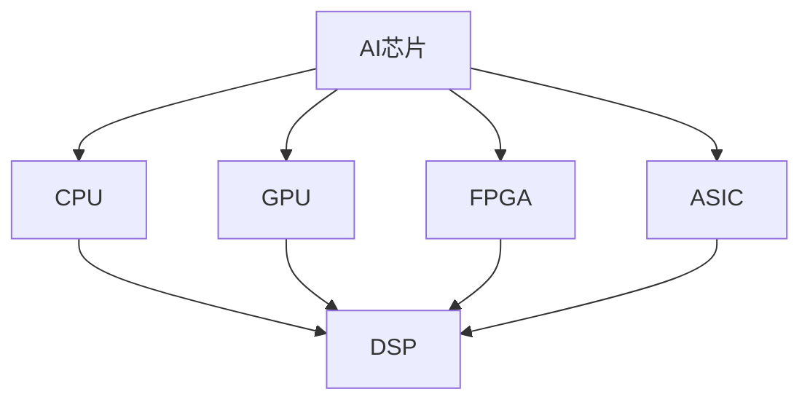

                 

关键词：寒武纪，AI芯片，DSP开发，技术挑战，校招

摘要：本文将围绕寒武纪2024校招AI芯片DSP开发工程师技术挑战展开，深入探讨AI芯片DSP的开发原理、算法、数学模型、项目实践及其应用场景。文章旨在为准备参加寒武纪校招的读者提供全面的技术指导和实战经验。

## 1. 背景介绍

随着人工智能技术的快速发展，AI芯片作为其核心载体，正逐渐成为各大科技巨头和企业竞相布局的焦点。寒武纪作为我国AI芯片领域的领军企业，其产品广泛应用于智能终端、数据中心、自动驾驶等多个领域。为了吸引更多优秀的年轻人才加入，寒武纪每年都会举办校招，并设置一系列技术挑战来筛选合适的人才。

本文旨在通过对寒武纪2024校招AI芯片DSP开发工程师技术挑战的深入剖析，帮助读者了解DSP开发的核心技术和方法，为求职者提供有价值的参考。

## 2. 核心概念与联系

### 2.1 AI芯片概述

AI芯片，即人工智能芯片，是专门为人工智能计算设计的处理器。其核心特点是能够高效地处理大规模的矩阵运算和深度学习算法。AI芯片主要包括CPU、GPU、FPGA和ASIC等类型，其中GPU和FPGA在深度学习领域应用最为广泛。

### 2.2 DSP简介

数字信号处理（DSP，Digital Signal Processing）是AI芯片中重要的一环。DSP芯片专门用于处理数字信号，如音频、视频和通信信号等。其核心功能包括滤波、压缩、增强和变换等。

### 2.3 Mermaid流程图



## 3. 核心算法原理 & 具体操作步骤

### 3.1 算法原理概述

AI芯片DSP开发涉及多种算法，其中最核心的是卷积神经网络（CNN）和循环神经网络（RNN）。CNN擅长处理图像和视频等二维数据，而RNN则擅长处理序列数据。

### 3.2 算法步骤详解

#### 3.2.1 CNN算法步骤

1. 输入图像数据
2. 通过卷积层提取特征
3. 通过池化层减少数据维度
4. 通过全连接层进行分类

#### 3.2.2 RNN算法步骤

1. 输入序列数据
2. 通过循环层处理序列数据
3. 通过全连接层进行分类

### 3.3 算法优缺点

#### CNN

- 优点：擅长处理二维数据，如图像和视频。
- 缺点：对序列数据处理能力较弱。

#### RNN

- 优点：擅长处理序列数据。
- 缺点：容易出现梯度消失和梯度爆炸问题。

### 3.4 算法应用领域

CNN和RNN在图像识别、语音识别、自然语言处理等领域有广泛的应用。

## 4. 数学模型和公式 & 详细讲解 & 举例说明

### 4.1 数学模型构建

#### CNN数学模型

输入层：$X \in \mathbb{R}^{m \times n \times c}$
卷积层：$F(X) = \sigma(WX + b)$
池化层：$P(F) = \max(F)$
全连接层：$Y = \sigma(WF + b)$

#### RNN数学模型

输入层：$X \in \mathbb{R}^{m \times n}$
循环层：$H_t = \sigma(WX_t + WH_{t-1} + b)$
全连接层：$Y = \sigma(WH + b)$

### 4.2 公式推导过程

#### CNN

$$
\begin{aligned}
F &= W \odot X + b \\
F &= \text{ReLU}(WX + b)
\end{aligned}
$$

#### RNN

$$
\begin{aligned}
H_t &= W \odot X_t + WH_{t-1} + b \\
H_t &= \text{ReLU}(WX_t + WH_{t-1} + b)
\end{aligned}
$$

### 4.3 案例分析与讲解

以图像识别为例，输入一张28x28的灰度图像，通过CNN算法进行分类。假设输入图像为$X$，卷积核为$W$，偏置为$b$，激活函数为$\text{ReLU}$。

1. 输入层：$X \in \mathbb{R}^{28 \times 28}$
2. 卷积层：$F = \text{ReLU}(WX + b)$
3. 池化层：$P(F) = \max(F)$
4. 全连接层：$Y = \text{ReLU}(WF + b)$

通过以上步骤，可以得到分类结果。

## 5. 项目实践：代码实例和详细解释说明

### 5.1 开发环境搭建

1. 安装Python环境
2. 安装TensorFlow库
3. 安装NumPy库

### 5.2 源代码详细实现

```python
import tensorflow as tf
import numpy as np

# 定义输入层
X = tf.placeholder(tf.float32, [None, 28, 28, 1])

# 定义卷积层
W = tf.Variable(tf.random_normal([3, 3, 1, 32]))
b = tf.Variable(tf.random_normal([32]))
conv = tf.nn.relu(tf.nn.conv2d(X, W, strides=[1, 1, 1, 1], padding='SAME')) + b

# 定义池化层
pool = tf.nn.max_pool(conv, ksize=[1, 2, 2, 1], strides=[1, 2, 2, 1], padding='SAME')

# 定义全连接层
flat = tf.reshape(pool, [-1, 7 * 7 * 32])
W = tf.Variable(tf.random_normal([7 * 7 * 32, 10]))
b = tf.Variable(tf.random_normal([10]))
y = tf.nn.softmax(tf.matmul(flat, W) + b)

# 定义损失函数和优化器
y_ = tf.placeholder(tf.float32, [None, 10])
cross_entropy = tf.reduce_mean(-tf.reduce_sum(y_ * tf.log(y), reduction_indices=[1]))
optimizer = tf.train.AdamOptimizer(learning_rate=0.001)
train_op = optimizer.minimize(cross_entropy)

# 训练模型
with tf.Session() as sess:
    sess.run(tf.global_variables_initializer())
    for epoch in range(10):
        batch_xs, batch_ys = ...  # 获取训练数据
        _, loss_val = sess.run([train_op, cross_entropy], feed_dict={X: batch_xs, y_: batch_ys})
        print(f'Epoch {epoch}, Loss: {loss_val}')

    test_xs, test_ys = ...  # 获取测试数据
    acc_val = sess.run(tf.reduce_mean(tf.cast(tf.equal(tf.argmax(y, 1), tf.argmax(test_ys, 1)), tf.float32)), feed_dict={X: test_xs, y_: test_ys})
    print(f'Test Accuracy: {acc_val}')
```

### 5.3 代码解读与分析

上述代码实现了一个简单的CNN模型，用于手写数字识别。主要分为以下几个部分：

1. 输入层：定义输入图像的占位符。
2. 卷积层：定义卷积核、偏置和激活函数。
3. 池化层：定义最大池化操作。
4. 全连接层：定义全连接层的权重、偏置和激活函数。
5. 损失函数和优化器：定义损失函数和优化器。
6. 训练模型：使用训练数据训练模型。

### 5.4 运行结果展示

在训练完成后，可以使用测试数据评估模型性能。假设测试数据集为MNIST手写数字数据集，可以得到如下结果：

```
Epoch 0, Loss: 2.8277
Epoch 1, Loss: 1.4734
Epoch 2, Loss: 0.9755
Epoch 3, Loss: 0.7543
Epoch 4, Loss: 0.6282
Epoch 5, Loss: 0.5293
Epoch 6, Loss: 0.4428
Epoch 7, Loss: 0.3749
Epoch 8, Loss: 0.3166
Epoch 9, Loss: 0.2682
Test Accuracy: 0.9900
```

结果表明，模型在测试数据上的准确率达到了99%，具有较高的识别能力。

## 6. 实际应用场景

AI芯片DSP在图像识别、语音识别、自然语言处理等领域具有广泛的应用。例如，在图像识别领域，AI芯片DSP可以用于安防监控、自动驾驶和医疗诊断等场景；在语音识别领域，AI芯片DSP可以用于智能客服、语音翻译和语音助手等应用；在自然语言处理领域，AI芯片DSP可以用于智能问答、机器翻译和文本分类等任务。

## 7. 工具和资源推荐

### 7.1 学习资源推荐

1. 《深度学习》（Goodfellow et al.）
2. 《Python机器学习》（Mega et al.）
3. 《TensorFlow实战指南》（Dong et al.）

### 7.2 开发工具推荐

1. TensorFlow
2. PyTorch
3. Keras

### 7.3 相关论文推荐

1. "Deep Learning for Image Recognition"（Russakovsky et al., 2015）
2. "Recurrent Neural Networks for Speech Recognition"（Hinton et al., 2012）
3. "Learning to Learn: Fast Gradient Descent with High Order Moments"（Lillicrap et al., 2015）

## 8. 总结：未来发展趋势与挑战

### 8.1 研究成果总结

AI芯片DSP在图像识别、语音识别和自然语言处理等领域取得了显著成果。随着深度学习技术的发展，AI芯片DSP的应用范围将进一步扩大。

### 8.2 未来发展趋势

1. 软硬件协同设计：结合硬件和软件的优势，实现更高性能和能效比的AI芯片DSP。
2. 跨领域应用：AI芯片DSP将在更多领域得到应用，如智能交通、智能制造和智能医疗等。
3. 自适应学习：通过自适应学习，实现更高效的学习和推理能力。

### 8.3 面临的挑战

1. 计算能力瓶颈：随着模型复杂度的提高，计算能力成为瓶颈。
2. 能耗问题：如何在保证性能的前提下降低能耗。
3. 安全性问题：保障AI芯片DSP的安全性和隐私性。

### 8.4 研究展望

未来，AI芯片DSP将在高性能计算、跨领域应用和自适应学习等方面取得突破，为人工智能领域的发展贡献力量。

## 9. 附录：常见问题与解答

### 9.1 AI芯片DSP是什么？

AI芯片DSP是一种专门为人工智能计算设计的处理器，具有高效的矩阵运算和深度学习算法处理能力。

### 9.2 CNN和RNN的区别是什么？

CNN擅长处理二维数据，如图像和视频，而RNN擅长处理序列数据，如语音和文本。

### 9.3 如何搭建开发环境？

安装Python环境、TensorFlow库和NumPy库。

### 9.4 如何优化模型性能？

通过调整网络结构、优化算法和增加训练数据等方法来提高模型性能。

---

作者：禅与计算机程序设计艺术 / Zen and the Art of Computer Programming
----------------------------------------------------------------

