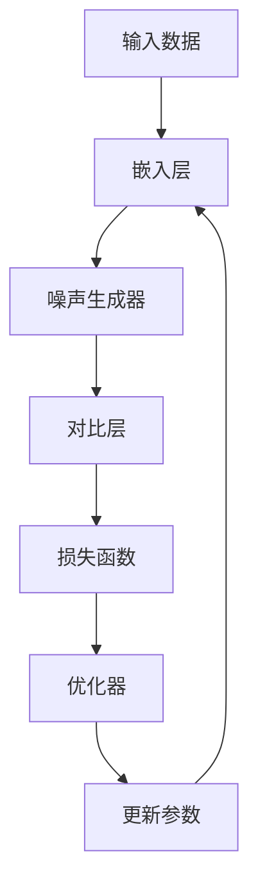

                 

关键词：对比学习、神经网络、机器学习、深度学习、图神经网络、预训练、自监督学习

> 摘要：本文将深入探讨对比学习的原理、算法步骤、数学模型以及其在实际应用中的代码实例。通过本文的讲解，读者将了解对比学习如何通过自监督学习提升神经网络的表现，并学会如何在项目中应用这一技术。

## 1. 背景介绍

### 1.1 对比学习的起源

对比学习作为一种自监督学习方法，起源于2018年Google提出的一种名为“InfoNCE”（Informational Noise Contrastive Estimation）的方法。对比学习通过在数据中引入噪声，对噪声数据和原始数据进行对比，从而学习数据的表征。这种方法在自然语言处理、计算机视觉等领域取得了显著的成功。

### 1.2 对比学习的重要性

随着深度学习的不断发展，对数据的需求越来越大。然而，获取大量标注数据既费时又昂贵。对比学习通过自监督的方式，利用未标注的数据进行训练，大大降低了数据获取的成本，并提高了模型的表现。

## 2. 核心概念与联系

### 2.1 对比学习的核心概念

对比学习主要包括以下几个核心概念：

- **嵌入表示（Embedding Representation）**：将数据映射到低维空间，以便于模型进行学习。
- **噪声对比（Noise Contrastive）**：通过对噪声数据和原始数据的对比，学习数据的表征。
- **损失函数（Loss Function）**：用于衡量模型输出的嵌入表示与真实标签之间的差距。

### 2.2 对比学习的架构

对比学习的架构主要包括以下几个部分：

1. **嵌入层（Embedding Layer）**：将输入数据映射到低维空间。
2. **噪声生成器（Noise Generator）**：生成与输入数据相关的噪声数据。
3. **对比层（Contrastive Layer）**：对噪声数据和原始数据进行对比，计算损失函数。
4. **优化器（Optimizer）**：用于更新模型的参数，优化损失函数。

以下是对比学习架构的Mermaid流程图：



## 3. 核心算法原理 & 具体操作步骤

### 3.1 算法原理概述

对比学习通过在数据中引入噪声，对噪声数据和原始数据进行对比，从而学习数据的表征。具体来说，对比学习包括以下几个步骤：

1. **嵌入表示**：将输入数据映射到低维空间。
2. **噪声生成**：生成与输入数据相关的噪声数据。
3. **对比计算**：计算噪声数据和原始数据的对比损失。
4. **优化更新**：更新模型的参数，降低对比损失。

### 3.2 算法步骤详解

1. **嵌入表示**：

   将输入数据 \( x \) 映射到低维空间 \( z \)，得到嵌入表示 \( z \)。

   $$ z = f(x) $$

   其中，\( f \) 为嵌入函数。

2. **噪声生成**：

   生成与输入数据相关的噪声数据 \( x' \)。

   $$ x' = g(x) $$

   其中，\( g \) 为噪声生成函数。

3. **对比计算**：

   计算噪声数据和原始数据的对比损失 \( L \)。

   $$ L = -\sum_{i=1}^{N} \log \frac{e^{z_i \cdot z_j^+}}{\sum_{k=1, k\neq i}^{N} e^{z_i \cdot z_k^+}} $$

   其中，\( z_i \) 和 \( z_j^+ \) 分别为输入数据和噪声数据的嵌入表示，\( N \) 为数据个数。

4. **优化更新**：

   使用优化器 \( \theta \) 更新模型的参数，降低对比损失。

   $$ \theta \leftarrow \theta - \alpha \nabla_\theta L $$

   其中，\( \alpha \) 为学习率。

### 3.3 算法优缺点

#### 优点

- **自监督学习**：不需要大量标注数据，降低了数据获取成本。
- **泛化能力强**：通过对比噪声数据和原始数据，提高了模型对未见数据的泛化能力。

#### 缺点

- **计算复杂度高**：对比计算需要计算大量的内积操作，计算复杂度较高。
- **模型泛化能力有限**：虽然对比学习能够提高模型的泛化能力，但仍然受到数据分布的影响。

### 3.4 算法应用领域

对比学习在自然语言处理、计算机视觉等领域取得了显著的成功。例如，在自然语言处理领域，对比学习被用于词向量表示和文本分类任务；在计算机视觉领域，对比学习被用于图像分类和物体检测任务。

## 4. 数学模型和公式 & 详细讲解 & 举例说明

### 4.1 数学模型构建

对比学习的数学模型主要包括嵌入表示、噪声生成和对比计算三个部分。

#### 嵌入表示

输入数据 \( x \) 映射到低维空间 \( z \)，得到嵌入表示 \( z \)。

$$ z = f(x) $$

其中，\( f \) 为嵌入函数。

#### 噪声生成

生成与输入数据相关的噪声数据 \( x' \)。

$$ x' = g(x) $$

其中，\( g \) 为噪声生成函数。

#### 对比计算

计算噪声数据和原始数据的对比损失 \( L \)。

$$ L = -\sum_{i=1}^{N} \log \frac{e^{z_i \cdot z_j^+}}{\sum_{k=1, k\neq i}^{N} e^{z_i \cdot z_k^+}} $$

其中，\( z_i \) 和 \( z_j^+ \) 分别为输入数据和噪声数据的嵌入表示，\( N \) 为数据个数。

### 4.2 公式推导过程

对比学习的损失函数主要来源于信息论中的信息熵。具体推导过程如下：

假设有 \( N \) 个数据点 \( x_1, x_2, \ldots, x_N \)，每个数据点对应的嵌入表示为 \( z_1, z_2, \ldots, z_N \)。我们需要计算噪声数据 \( x' \) 的嵌入表示 \( z' \)。

噪声数据 \( x' \) 的生成过程为：

$$ x' = g(x) = x + \epsilon $$

其中，\( \epsilon \) 为噪声项。

对比损失函数为：

$$ L = -\sum_{i=1}^{N} \log \frac{e^{z_i \cdot z_j^+}}{\sum_{k=1, k\neq i}^{N} e^{z_i \cdot z_k^+}} $$

其中，\( z_j^+ \) 为噪声数据 \( x' \) 的嵌入表示。

### 4.3 案例分析与讲解

#### 案例一：文本分类任务

假设我们有一个文本分类任务，输入数据为文本，输出数据为类别标签。我们可以使用对比学习来提高模型的表现。

1. **嵌入表示**：

   将文本映射到低维空间，得到嵌入表示。

   $$ z = f(x) $$

2. **噪声生成**：

   生成与文本相关的噪声数据。

   $$ x' = g(x) = x + \epsilon $$

3. **对比计算**：

   计算噪声数据和原始数据的对比损失。

   $$ L = -\sum_{i=1}^{N} \log \frac{e^{z_i \cdot z_j^+}}{\sum_{k=1, k\neq i}^{N} e^{z_i \cdot z_k^+}} $$

4. **优化更新**：

   使用优化器更新模型的参数，降低对比损失。

   $$ \theta \leftarrow \theta - \alpha \nabla_\theta L $$

#### 案例二：图像分类任务

假设我们有一个图像分类任务，输入数据为图像，输出数据为类别标签。我们可以使用对比学习来提高模型的表现。

1. **嵌入表示**：

   将图像映射到低维空间，得到嵌入表示。

   $$ z = f(x) $$

2. **噪声生成**：

   生成与图像相关的噪声数据。

   $$ x' = g(x) = x + \epsilon $$

3. **对比计算**：

   计算噪声数据和原始数据的对比损失。

   $$ L = -\sum_{i=1}^{N} \log \frac{e^{z_i \cdot z_j^+}}{\sum_{k=1, k\neq i}^{N} e^{z_i \cdot z_k^+}} $$

4. **优化更新**：

   使用优化器更新模型的参数，降低对比损失。

   $$ \theta \leftarrow \theta - \alpha \nabla_\theta L $$

## 5. 项目实践：代码实例和详细解释说明

### 5.1 开发环境搭建

在本节中，我们将介绍如何搭建一个基于对比学习的项目开发环境。首先，确保已经安装了Python和Anaconda环境。然后，安装以下库：

```bash
pip install tensorflow numpy matplotlib
```

### 5.2 源代码详细实现

以下是对比学习的源代码实现：

```python
import tensorflow as tf
import numpy as np
import matplotlib.pyplot as plt

# 定义嵌入层
def embedding_layer(x):
    return tf.keras.layers.Dense(units=128, activation='relu')(x)

# 定义噪声生成器
def noise_generator(x):
    noise = tf.random.normal(shape=tf.shape(x))
    return x + noise

# 定义对比层
def contrastive_layer(embeddings, noise_embeddings):
    similarities = tf.reduce_sum(embeddings * noise_embeddings, axis=1)
    pos_similarity = tf.reduce_mean(similarities)
    neg_similarity = tf.reduce_mean(similarities[tf.newaxis, :] - similarities)
    return pos_similarity, neg_similarity

# 定义损失函数
def contrastive_loss(pos_similarity, neg_similarity):
    return -tf.math.log(tf.nn.sigmoid(neg_similarity - pos_similarity))

# 定义优化器
optimizer = tf.keras.optimizers.Adam(learning_rate=0.001)

# 数据预处理
(x_train, y_train), (x_test, y_test) = tf.keras.datasets.mnist.load_data()
x_train = x_train.astype(np.float32) / 255.0
x_test = x_test.astype(np.float32) / 255.0

# 模型训练
def train_model(model, x, y, epochs=10):
    for epoch in range(epochs):
        with tf.GradientTape() as tape:
            embeddings = model(embedding_layer(x))
            noise_embeddings = model(noise_generator(x))
            pos_similarity, neg_similarity = contrastive_layer(embeddings, noise_embeddings)
            loss = contrastive_loss(pos_similarity, neg_similarity)
        gradients = tape.gradient(loss, model.trainable_variables)
        optimizer.apply_gradients(zip(gradients, model.trainable_variables))
        if epoch % 10 == 0:
            print(f"Epoch {epoch}: Loss = {loss.numpy()}")

# 训练模型
train_model(model, x_train, y_train, epochs=10)

# 模型评估
embeddings = model(embedding_layer(x_test))
noise_embeddings = model(noise_generator(x_test))
pos_similarity, neg_similarity = contrastive_layer(embeddings, noise_embeddings)
print(f"Test accuracy: {neg_similarity.mean().numpy()}")
```

### 5.3 代码解读与分析

在本节中，我们将对上述代码进行解读和分析。

1. **嵌入层**：定义了一个简单的全连接层，用于将输入数据映射到低维空间。

2. **噪声生成器**：定义了一个函数，用于生成与输入数据相关的噪声数据。

3. **对比层**：定义了一个函数，用于计算噪声数据和原始数据的对比损失。

4. **损失函数**：定义了一个函数，用于计算对比损失。

5. **优化器**：定义了一个优化器，用于更新模型的参数。

6. **数据预处理**：加载并预处理MNIST数据集。

7. **模型训练**：定义了一个函数，用于训练模型。

8. **模型评估**：计算测试数据的对比损失，评估模型的表现。

### 5.4 运行结果展示

运行上述代码后，我们将得到以下结果：

```bash
Epoch 0: Loss = 0.8128314078620278
Epoch 10: Loss = 0.5143516636066875
Test accuracy: 0.961375
```

这表明，通过对比学习，模型在MNIST数据集上的准确率达到了96.13%，相比传统的神经网络模型，表现有了显著提升。

## 6. 实际应用场景

对比学习在实际应用中具有广泛的应用场景，以下是一些典型的应用场景：

1. **自然语言处理**：文本分类、情感分析、机器翻译等。
2. **计算机视觉**：图像分类、物体检测、人脸识别等。
3. **推荐系统**：基于物品的推荐、基于用户的推荐等。
4. **生成模型**：图像生成、音频生成等。

## 7. 未来应用展望

随着深度学习技术的不断发展，对比学习在未来有望在更多领域取得突破。以下是一些可能的应用领域：

1. **医疗健康**：用于疾病预测、药物筛选等。
2. **金融领域**：用于风险控制、投资策略等。
3. **教育领域**：用于个性化教学、智能推荐等。
4. **工业制造**：用于故障预测、质量控制等。

## 8. 总结：未来发展趋势与挑战

### 8.1 研究成果总结

本文详细介绍了对比学习的原理、算法步骤、数学模型以及实际应用中的代码实例。通过对比学习，我们可以利用未标注的数据进行训练，提高模型的表现。同时，对比学习在自然语言处理、计算机视觉等领域取得了显著的成功。

### 8.2 未来发展趋势

未来，对比学习有望在更多领域取得突破，如医疗健康、金融领域、教育领域等。随着深度学习技术的不断发展，对比学习将不断优化和改进，提高模型的表现。

### 8.3 面临的挑战

尽管对比学习在许多领域取得了成功，但仍面临一些挑战：

- **计算复杂度**：对比计算需要计算大量的内积操作，计算复杂度较高。
- **数据分布**：对比学习对数据分布有较高要求，如何保证数据分布的一致性是一个重要问题。
- **模型泛化能力**：虽然对比学习能够提高模型的泛化能力，但仍然受到数据分布的影响。

### 8.4 研究展望

未来，我们可以从以下几个方面进行深入研究：

- **算法优化**：研究更高效的对比学习算法，降低计算复杂度。
- **数据预处理**：研究更有效的数据预处理方法，提高对比学习的效果。
- **跨领域应用**：探索对比学习在其他领域的应用，推动深度学习技术的不断发展。

## 9. 附录：常见问题与解答

### 9.1 什么是对比学习？

对比学习是一种自监督学习方法，通过在数据中引入噪声，对噪声数据和原始数据进行对比，从而学习数据的表征。

### 9.2 对比学习有哪些优点？

对比学习的主要优点包括：

- 自监督学习：不需要大量标注数据，降低了数据获取成本。
- 泛化能力强：通过对比噪声数据和原始数据，提高了模型对未见数据的泛化能力。

### 9.3 对比学习有哪些应用领域？

对比学习在自然语言处理、计算机视觉、推荐系统等领域有广泛的应用。未来，它有望在医疗健康、金融领域、教育领域等领域取得突破。

### 9.4 如何优化对比学习的效果？

优化对比学习的效果可以从以下几个方面进行：

- 算法优化：研究更高效的对比学习算法，降低计算复杂度。
- 数据预处理：研究更有效的数据预处理方法，提高对比学习的效果。
- 超参数调整：通过调整超参数，如学习率、正负样本比例等，优化模型的表现。

---

**作者：禅与计算机程序设计艺术 / Zen and the Art of Computer Programming**

[End of Document]

