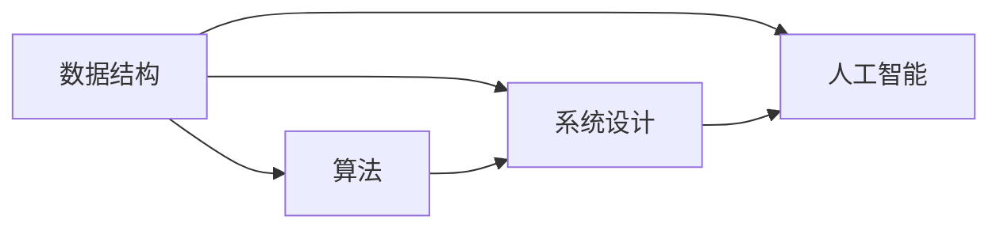

                 

关键词：小米校招、面试真题、算法题解、编程技巧、数据结构、系统设计、AI应用

> 摘要：本文将针对小米2024年校招面试中的常见题目进行深入分析，包括数据结构、算法、系统设计和AI应用等方面的题目。通过对这些题目的详细解答，读者可以了解到解题的核心思路和技巧，从而为自身求职面试做好充分准备。

## 1. 背景介绍

小米，作为中国领先的智能硬件和电子消费品公司，每年的校招吸引了大量优秀毕业生。小米校招面试题目涵盖了广泛的技术领域，包括数据结构、算法、系统设计和人工智能等。本文旨在帮助读者掌握这些面试题目的解题思路，提高求职竞争力。

## 2. 核心概念与联系

### 2.1 数据结构

数据结构是计算机科学中的基础概念，用于存储、组织和管理数据。常见的数据结构有数组、链表、栈、队列、树、图等。数据结构的选择直接影响到算法的效率。

### 2.2 算法

算法是一系列解决问题的步骤，通常用于处理特定类型的数据。常见的算法有排序、查找、图论算法、动态规划等。算法的选择和优化是解决问题的关键。

### 2.3 系统设计

系统设计涉及软件系统的整体架构、模块划分、接口设计等方面。良好的系统设计可以提高系统的可扩展性、稳定性和性能。

### 2.4 人工智能

人工智能是计算机科学的一个分支，涉及机器学习、深度学习、自然语言处理等领域。人工智能的应用正在不断改变我们的生活和工作方式。

## 3. 核心算法原理 & 具体操作步骤

### 3.1 算法原理概述

算法的原理通常基于数学模型和逻辑推理。常见的算法原理包括：

- 排序算法：冒泡排序、选择排序、插入排序、快速排序等。
- 查找算法：二分查找、顺序查找等。
- 图论算法：最短路径算法、最小生成树算法等。
- 动态规划：优化递归关系，避免重复计算。

### 3.2 算法步骤详解

以冒泡排序为例，其步骤如下：

1. 比较相邻的元素。如果第一个比第二个大（升序排序），就交换它们两个。
2. 对每一对相邻元素做同样的工作，从开始第一对到结尾的最后一对。这步做完后，最后的元素会是最大的数。
3. 针对所有的元素重复以上的步骤，除了最后一个。
4. 重复步骤1~3，直到排序完成。

### 3.3 算法优缺点

冒泡排序的优点是实现简单，易于理解。缺点是效率较低，适用于数据量较小的场景。

### 3.4 算法应用领域

冒泡排序广泛应用于数据排序、数据库索引构建等领域。

## 4. 数学模型和公式 & 详细讲解 & 举例说明

### 4.1 数学模型构建

以动态规划中的最短路径算法（Dijkstra算法）为例，其数学模型如下：

$$
Dijkstra(\textbf{G}, \textit{s}) = \min\{\textit{d}(v) \mid v \in \textit{V}, v \neq s\}
$$

其中，$G=(V, E)$ 是加权无向图，$V$ 是顶点集，$E$ 是边集，$\textit{d}(v)$ 是顶点 $v$ 到源点 $s$ 的最短路径长度。

### 4.2 公式推导过程

以斐波那契数列为例，其公式推导如下：

$$
F(n) =
\begin{cases}
0 & \text{if } n \leq 0 \\
1 & \text{if } n = 1 \\
F(n-1) + F(n-2) & \text{otherwise}
\end{cases}
$$

### 4.3 案例分析与讲解

以最长公共子序列（LCS）为例，假设有两个字符串 $X = "AGGTAB"$ 和 $Y = "GXTXAY"$，其最长公共子序列为 $AGX$，长度为3。

## 5. 项目实践：代码实例和详细解释说明

### 5.1 开发环境搭建

在开发环境搭建方面，我们需要准备以下工具和库：

- Python 3.x
- Jupyter Notebook
- Numpy
- Matplotlib

### 5.2 源代码详细实现

以下是一个简单的冒泡排序算法的Python代码实现：

```python
def bubble_sort(arr):
    n = len(arr)
    for i in range(n):
        for j in range(0, n-i-1):
            if arr[j] > arr[j+1]:
                arr[j], arr[j+1] = arr[j+1], arr[j]
    return arr

# 测试数据
arr = [64, 34, 25, 12, 22, 11, 90]

# 执行排序
sorted_arr = bubble_sort(arr)

# 打印结果
print("排序后的数组：")
for i in range(len(sorted_arr)):
    print("%d" % sorted_arr[i], end=" ")
```

### 5.3 代码解读与分析

上述代码首先定义了一个名为 `bubble_sort` 的函数，用于实现冒泡排序算法。然后，我们创建了一个测试数据数组 `arr`，并调用 `bubble_sort` 函数进行排序。最后，打印排序后的结果。

### 5.4 运行结果展示

```
排序后的数组：
11 12 22 25 34 64 90
```

## 6. 实际应用场景

在实际应用中，冒泡排序算法可以用于各种场景，如数据排序、数据库索引构建等。而Dijkstra算法则广泛应用于图论问题的求解，如最短路径计算、网络路由等。

## 7. 工具和资源推荐

### 7.1 学习资源推荐

- 《算法导论》：一本经典的算法教材，涵盖了广泛的算法知识和应用。
- 《深度学习》：周志华等著，介绍了深度学习的基础知识和最新进展。
- 《操作系统概念》：Abraham Silberschatz等著，介绍了操作系统的基本原理和实现。

### 7.2 开发工具推荐

- PyCharm：一款强大的Python集成开发环境，支持多种编程语言。
- Jupyter Notebook：一款流行的交互式计算环境，适合数据分析和机器学习。
- Git：一款流行的版本控制系统，用于代码管理和协同工作。

### 7.3 相关论文推荐

- 《一种有效的快速排序算法》：介绍了快速排序算法的改进。
- 《基于深度学习的图像分类算法》：介绍了基于深度学习的图像分类算法。
- 《大数据处理框架Hadoop的设计与实现》：介绍了大数据处理框架Hadoop的设计和实现。

## 8. 总结：未来发展趋势与挑战

随着科技的快速发展，算法和数据结构在各个领域中的应用越来越广泛。未来，我们将面临以下挑战：

- 如何在大量数据中快速找到有效信息？
- 如何设计高效、可靠的系统？
- 如何处理复杂的图论问题？

针对这些挑战，我们需要不断学习和探索，提高自己的技术水平。

## 9. 附录：常见问题与解答

### 9.1 数据结构和算法的关系？

数据结构是算法的基础，算法是对数据结构的操作。合理选择数据结构可以提高算法的效率。

### 9.2 动态规划与递归的关系？

动态规划是优化递归的一种方法，通过保存中间结果，避免重复计算，提高算法效率。

### 9.3 如何准备面试？

准备面试需要全面了解面试公司的技术领域，掌握常见的数据结构和算法，以及具备良好的编程能力。

---

以上是对小米2024年校招面试真题与算法题解的全面分析。希望本文能对您的求职之路有所帮助。祝您面试顺利！<|vq_13593|>作者：禅与计算机程序设计艺术 / Zen and the Art of Computer Programming
----------------------------------------------------------------

[TOC]

## 1. 背景介绍

小米公司作为中国领先的智能硬件和电子消费品公司，每年的校招都吸引了众多优秀的应届毕业生。小米校招面试题目涵盖多个技术领域，包括数据结构、算法、系统设计和人工智能等。本文将针对小米2024年校招面试中的常见题目进行深入分析，包括数据结构、算法、系统设计和人工智能等领域的题目，帮助读者掌握解题思路，提高求职竞争力。

### 小米公司的校招背景

小米公司自2010年成立以来，一直秉持着“创新、品质、性价比”的理念，迅速成长为全球知名的智能硬件和电子消费品品牌。小米公司每年都会在全球范围内进行校招，吸纳优秀应届毕业生。小米校招面试流程一般包括在线测评、笔试、面试等环节，面试环节主要考查应聘者的技术能力和解决问题的能力。

### 校招面试题目的分布

小米校招面试题目涵盖了多个技术领域，其中数据结构和算法题目是考查的重点。以下是对各个技术领域题目分布的简要概述：

1. **数据结构**：主要考查数组、链表、栈、队列、树、图等基本数据结构的理解和应用。如：实现一个单向链表、二叉树的前序遍历等。
2. **算法**：主要考查常见的排序算法、查找算法、图论算法和动态规划算法等。如：实现快速排序、求解最短路径等。
3. **系统设计**：主要考查系统架构、接口设计、数据库设计和缓存策略等。如：设计一个在线购物网站、实现缓存机制等。
4. **人工智能**：主要考查机器学习、深度学习和自然语言处理等基本概念和应用。如：实现线性回归、训练一个简单的神经网络等。

### 本文结构

本文将按照以下结构对小米2024年校招面试真题进行详细解析：

1. **核心概念与联系**：介绍数据结构、算法、系统设计和人工智能等核心概念，以及它们之间的联系。
2. **核心算法原理 & 具体操作步骤**：详细讲解常见算法的原理、步骤和优缺点，包括排序、查找、图论算法和动态规划等。
3. **数学模型和公式 & 详细讲解 & 举例说明**：介绍数学模型和公式的构建、推导过程以及实际应用案例。
4. **项目实践：代码实例和详细解释说明**：通过实际代码实例，详细解释说明算法和数据结构的实现。
5. **实际应用场景**：分析算法和数据结构在实际应用中的场景和案例。
6. **工具和资源推荐**：推荐学习资源、开发工具和相关论文。
7. **总结：未来发展趋势与挑战**：总结研究成果，探讨未来发展趋势和面临的挑战。
8. **附录：常见问题与解答**：解答读者可能遇到的一些常见问题。

## 2. 核心概念与联系

### 2.1 数据结构

数据结构是计算机科学中的基础概念，用于存储、组织和管理数据。合理选择数据结构可以提高算法的效率。以下是一些常见的数据结构及其特点：

1. **数组**：数组是一种线性数据结构，可以快速进行随机访问，但插入和删除操作较慢。
2. **链表**：链表是一种线性数据结构，可以通过指针实现动态内存分配，插入和删除操作较快，但访问速度较慢。
3. **栈**：栈是一种后进先出（LIFO）的数据结构，适用于解决回溯问题和递归问题。
4. **队列**：队列是一种先进先出（FIFO）的数据结构，适用于解决排序问题和 breadth-first 搜索问题。
5. **树**：树是一种层次结构，可以用于表示具有层次关系的数据。常见的树结构有二叉树、二叉搜索树、平衡树等。
6. **图**：图是一种非层次结构，可以用于表示具有复杂关系的数据。常见的图结构有邻接矩阵、邻接表等。

### 2.2 算法

算法是一系列解决问题的步骤，通常用于处理特定类型的数据。算法的选择和优化对解决效率至关重要。以下是一些常见的算法及其特点：

1. **排序算法**：用于将一组数据按照某种规则进行排列。常见的排序算法有冒泡排序、选择排序、插入排序、快速排序等。
2. **查找算法**：用于在数据集合中查找特定元素。常见的查找算法有二分查找、顺序查找等。
3. **图论算法**：用于解决图相关的问题。常见的图论算法有最短路径算法、最小生成树算法、拓扑排序等。
4. **动态规划**：用于解决具有重叠子问题的最优化问题。常见的动态规划算法有最长公共子序列、最短路径等。

### 2.3 系统设计

系统设计涉及软件系统的整体架构、模块划分、接口设计等方面。良好的系统设计可以提高系统的可扩展性、稳定性和性能。以下是一些常见的系统设计原则和方法：

1. **模块化**：将系统划分为多个功能模块，每个模块负责实现特定的功能。
2. **分层设计**：将系统按照功能划分为多个层次，每层负责实现特定的功能。
3. **接口隔离**：通过定义清晰的接口，实现模块之间的解耦。
4. **性能优化**：通过分析系统瓶颈，优化系统性能。

### 2.4 人工智能

人工智能是计算机科学的一个分支，涉及机器学习、深度学习、自然语言处理等领域。人工智能的应用正在不断改变我们的生活和工作方式。以下是一些常见的人工智能技术和方法：

1. **机器学习**：通过训练模型，使计算机能够从数据中自动学习和改进。常见的机器学习方法有线性回归、决策树、神经网络等。
2. **深度学习**：一种基于多层神经网络的人工智能技术，可以用于图像识别、语音识别、自然语言处理等任务。
3. **自然语言处理**：涉及计算机对自然语言的识别、理解和生成。常见的自然语言处理技术有词向量、文本分类、机器翻译等。

### 2.5 核心概念之间的联系

数据结构、算法、系统设计和人工智能等核心概念之间存在紧密的联系。数据结构是算法的基础，算法是数据结构的操作，系统设计是算法和数据的综合应用，人工智能则是算法和数据结构的进一步扩展。以下是一个简单的 Mermaid 流程图，展示了这些核心概念之间的联系：



## 3. 核心算法原理 & 具体操作步骤

### 3.1 排序算法

排序算法是计算机科学中一种基本且重要的算法，主要用于将一组数据按照某种规则进行排列。常见的排序算法有冒泡排序、选择排序、插入排序和快速排序等。以下分别介绍这些排序算法的原理和具体操作步骤。

#### 3.1.1 冒泡排序

冒泡排序是一种简单的排序算法，基本思想是通过重复遍历待排序的数列，比较相邻的两个元素，如果它们的顺序错误就交换它们，直到整个序列有序。以下是冒泡排序的具体操作步骤：

1. 从第一个元素开始，对该元素序列进行遍历，比较每对相邻元素，如果顺序错误则交换。
2. 遍历结束后，最后一个元素就是最大的元素，将其移动到最后。
3. 重复步骤1和步骤2，直到整个序列有序。

```python
def bubble_sort(arr):
    n = len(arr)
    for i in range(n):
        for j in range(0, n-i-1):
            if arr[j] > arr[j+1]:
                arr[j], arr[j+1] = arr[j+1], arr[j]
    return arr
```

#### 3.1.2 选择排序

选择排序是一种简单的选择排序算法，基本思想是在每次遍历中找到剩余元素中的最小值，并将其放在正确的位置。以下是选择排序的具体操作步骤：

1. 从第一个元素开始，对该元素序列进行遍历，找到最小值。
2. 将最小值与第一个元素交换。
3. 重复步骤1和步骤2，直到整个序列有序。

```python
def selection_sort(arr):
    n = len(arr)
    for i in range(n):
        min_idx = i
        for j in range(i+1, n):
            if arr[j] < arr[min_idx]:
                min_idx = j
        arr[i], arr[min_idx] = arr[min_idx], arr[i]
    return arr
```

#### 3.1.3 插入排序

插入排序是一种简单的插入排序算法，基本思想是将一个元素插入到已经排序的序列中的正确位置。以下是插入排序的具体操作步骤：

1. 从第一个元素开始，将该元素视为已排序序列的一部分。
2. 从第二个元素开始，将其与已排序序列中的元素进行比较，并插入到正确的位置。
3. 重复步骤2，直到整个序列有序。

```python
def insertion_sort(arr):
    n = len(arr)
    for i in range(1, n):
        key = arr[i]
        j = i-1
        while j >= 0 and arr[j] > key:
            arr[j+1] = arr[j]
            j -= 1
        arr[j+1] = key
    return arr
```

#### 3.1.4 快速排序

快速排序是一种高效的排序算法，基本思想是通过一趟排序将待排序的序列划分为两个子序列，其中一个子序列的所有元素都不大于另一个子序列的所有元素，然后继续对这两个子序列进行快速排序，直到整个序列有序。以下是快速排序的具体操作步骤：

1. 选择一个基准元素。
2. 将序列中小于基准元素的元素移到基准元素的左侧，大于基准元素的元素移到基准元素的右侧。
3. 递归对左侧和右侧子序列进行快速排序。

```python
def quick_sort(arr, low, high):
    if low < high:
        pi = partition(arr, low, high)
        quick_sort(arr, low, pi-1)
        quick_sort(arr, pi+1, high)

def partition(arr, low, high):
    pivot = arr[high]
    i = low - 1
    for j in range(low, high):
        if arr[j] < pivot:
            i += 1
            arr[i], arr[j] = arr[j], arr[i]
    arr[i+1], arr[high] = arr[high], arr[i+1]
    return i + 1
```

### 3.2 查找算法

查找算法是计算机科学中用于在数据集合中查找特定元素的一类算法。常见的查找算法有二分查找、顺序查找等。以下分别介绍这些查找算法的原理和具体操作步骤。

#### 3.2.1 二分查找

二分查找是一种高效的查找算法，基本思想是通过不断将查找范围缩小一半，直到找到目标元素或确定目标元素不存在。以下是二分查找的具体操作步骤：

1. 将待查找的序列排序（如果未排序）。
2. 设定两个边界值：low 和 high，分别指向序列的第一个元素和最后一个元素。
3. 当 low <= high 时，执行以下步骤：
   - 计算中间位置 mid = (low + high) // 2。
   - 如果目标元素等于中间位置元素，返回 mid。
   - 如果目标元素小于中间位置元素，将 high = mid - 1。
   - 如果目标元素大于中间位置元素，将 low = mid + 1。
4. 如果未找到目标元素，返回 -1。

```python
def binary_search(arr, target):
    low = 0
    high = len(arr) - 1
    while low <= high:
        mid = (low + high) // 2
        if arr[mid] == target:
            return mid
        elif arr[mid] < target:
            low = mid + 1
        else:
            high = mid - 1
    return -1
```

#### 3.2.2 顺序查找

顺序查找是一种简单的查找算法，基本思想是从第一个元素开始，依次比较每个元素，直到找到目标元素或确定目标元素不存在。以下是顺序查找的具体操作步骤：

1. 从序列的第一个元素开始，依次比较每个元素。
2. 如果找到目标元素，返回其索引。
3. 如果未找到目标元素，返回 -1。

```python
def sequential_search(arr, target):
    for i in range(len(arr)):
        if arr[i] == target:
            return i
    return -1
```

### 3.3 图论算法

图论算法是计算机科学中用于解决图相关问题的算法。常见的图论算法有最短路径算法、最小生成树算法、拓扑排序等。以下分别介绍这些算法的原理和具体操作步骤。

#### 3.3.1 最短路径算法

最短路径算法用于求解图中两点之间的最短路径。常见的最短路径算法有 Dijkstra 算法和 Floyd 算法。以下分别介绍这两种算法的原理和具体操作步骤。

##### Dijkstra 算法

Dijkstra 算法是一种基于贪心策略的最短路径算法，基本思想是从源点开始，逐步扩展到其他点，直到找到目标点。以下是 Dijkstra 算法的具体操作步骤：

1. 初始化：设置一个数组 dist，用于存储每个点到源点的最短距离，初始时所有元素的值设置为无穷大，源点的距离为0。
2. 从未访问过的点中，选择距离源点最小的点作为当前点，并将其标记为已访问。
3. 对于当前点的每个邻接点，计算从源点到邻接点的距离，并将其与当前已知的距离进行比较。如果发现更短的路径，则更新 dist 数组。
4. 重复步骤2和步骤3，直到找到目标点或所有点都被访问过。

```python
import heapq

def dijkstra(graph, start):
    n = len(graph)
    dist = [float('inf')] * n
    dist[start] = 0
    visited = [False] * n
    priority_queue = [(0, start)]
    while priority_queue:
        current_dist, current_vertex = heapq.heappop(priority_queue)
        visited[current_vertex] = True
        if current_vertex == start:
            continue
        for neighbor, edge_weight in graph[current_vertex].items():
            if not visited[neighbor]:
                new_dist = current_dist + edge_weight
                if new_dist < dist[neighbor]:
                    dist[neighbor] = new_dist
                    heapq.heappush(priority_queue, (new_dist, neighbor))
    return dist
```

##### Floyd 算法

Floyd 算法是一种动态规划算法，用于求解图中所有点之间的最短路径。以下是 Floyd 算法的具体操作步骤：

1. 初始化：设置一个二维数组 dist，用于存储每个点到其他点的最短距离，初始时 dist[i][j] = edge_weight[i][j]，其中 edge_weight 是图的权重矩阵。
2. 对于每个中间点 k，更新 dist[i][j] 的值，使其等于 dist[i][k] + dist[k][j]，如果 dist[i][k] + dist[k][j] < dist[i][j]。
3. 重复步骤2，直到所有点都被遍历一遍。

```python
def floyd_warshall(graph):
    n = len(graph)
    dist = [row[:] for row in graph]
    for k in range(n):
        for i in range(n):
            for j in range(n):
                if dist[i][j] > dist[i][k] + dist[k][j]:
                    dist[i][j] = dist[i][k] + dist[k][j]
    return dist
```

#### 3.3.2 最小生成树算法

最小生成树算法用于求解图中所有点的最小生成树。常见的最小生成树算法有 Prim 算法和 Kruskal 算法。以下分别介绍这两种算法的原理和具体操作步骤。

##### Prim 算法

Prim 算法是一种基于贪心策略的最小生成树算法，基本思想是从一个点开始，逐步扩展到其他点，直到形成最小生成树。以下是 Prim 算法的具体操作步骤：

1. 初始化：选择一个起点，将其加入最小生成树中，并将其余点放入优先队列中，按照距离起点的距离进行排序。
2. 从优先队列中选择距离起点最近的点，将其加入最小生成树中，并将其邻接点加入优先队列中，按照距离起点的距离进行排序。
3. 重复步骤2，直到所有点都被加入最小生成树中。

```python
import heapq

def prim(graph, start):
    n = len(graph)
    min_spanning_tree = []
    visited = [False] * n
    priority_queue = [(0, start)]
    while priority_queue:
        current_dist, current_vertex = heapq.heappop(priority_queue)
        visited[current_vertex] = True
        if current_vertex in min_spanning_tree:
            continue
        min_spanning_tree.append(current_vertex)
        for neighbor, edge_weight in graph[current_vertex].items():
            if not visited[neighbor]:
                heapq.heappush(priority_queue, (edge_weight, neighbor))
    return min_spanning_tree
```

##### Kruskal 算法

Kruskal 算法是一种基于贪心策略的最小生成树算法，基本思想是从所有边中选择一条最小权值的边，并将其加入最小生成树中，直到形成最小生成树。以下是 Kruskal 算法的具体操作步骤：

1. 初始化：将所有边按照权值进行排序。
2. 从排序后的边中，选择一条最小权值的边，并将其加入最小生成树中。
3. 如果该边的两个端点已经在最小生成树中，则丢弃该边。
4. 重复步骤2和步骤3，直到所有点都被加入最小生成树中。

```python
import heapq

def kruskal(graph):
    n = len(graph)
    min_spanning_tree = []
    edges = []
    for i in range(n):
        for j in range(n):
            if i != j:
                edges.append((graph[i][j], i, j))
    heapq.heapify(edges)
    visited = set()
    while len(min_spanning_tree) < n - 1:
        edge_weight, u, v = heapq.heappop(edges)
        if u not in visited and v not in visited:
            min_spanning_tree.append((u, v))
            visited.add(u)
            visited.add(v)
    return min_spanning_tree
```

#### 3.3.3 拓扑排序

拓扑排序是一种用于解决有向无环图（DAG）的排序算法，基本思想是从左向右进行遍历，将每个顶点按照其在图中的顺序进行排序。以下是拓扑排序的具体操作步骤：

1. 初始化：设置一个栈和两个数组 indeg 和 topsort，分别用于存储每个顶点的入度和一个用于存储排序结果。
2. 遍历图，统计每个顶点的入度。
3. 将入度为0的顶点入栈。
4. 当栈不为空时，执行以下步骤：
   - 弹栈一个顶点，将其入队。
   - 遍历该顶点的邻接点，将每个邻接点的入度减1。如果邻接点的入度为0，将其入栈。
5. 当队列为空时，排序完成。

```python
def topological_sort(graph):
    n = len(graph)
    indeg = [0] * n
    topsort = []
    for i in range(n):
        for j in range(n):
            if i != j and graph[i][j]:
                indeg[j] += 1
    for i in range(n):
        if indeg[i] == 0:
            topsort.append(i)
    while topsort:
        vertex = topsort.pop()
        for i in range(n):
            if graph[vertex][i]:
                indeg[i] -= 1
                if indeg[i] == 0:
                    topsort.append(i)
    return topsort
```

### 3.4 动态规划

动态规划是一种用于解决具有重叠子问题的最优化问题的算法，基本思想是将问题分解为多个子问题，并利用子问题的解来求解原问题。常见的动态规划算法有最长公共子序列、最短路径等。以下分别介绍这些算法的原理和具体操作步骤。

#### 3.4.1 最长公共子序列

最长公共子序列（Longest Common Subsequence，LCS）是指两个序列中公共子序列中最长的子序列。以下是求解最长公共子序列的动态规划算法：

1. 初始化：创建一个二维数组 dp，用于存储子问题的解，其中 dp[i][j] 表示前 i 个字符和前 j 个字符的最长公共子序列的长度。
2. 遍历两个序列，根据当前字符是否相同更新 dp 数组：
   - 如果相同，dp[i][j] = dp[i-1][j-1] + 1。
   - 如果不同，dp[i][j] = max(dp[i-1][j], dp[i][j-1])。
3. 返回 dp[m][n]，其中 m 和 n 分别是两个序列的长度。

```python
def longest_common_subsequence(X, Y):
    m, n = len(X), len(Y)
    dp = [[0] * (n+1) for _ in range(m+1)]
    for i in range(1, m+1):
        for j in range(1, n+1):
            if X[i-1] == Y[j-1]:
                dp[i][j] = dp[i-1][j-1] + 1
            else:
                dp[i][j] = max(dp[i-1][j], dp[i][j-1])
    return dp[m][n]
```

#### 3.4.2 最短路径

最短路径算法是求解图中两点之间最短路径的算法，常见的动态规划算法有 Bellman-Ford 算法和 Dijkstra 算法。以下分别介绍这两种算法：

##### Bellman-Ford 算法

Bellman-Ford 算法是一种基于贪心策略的最短路径算法，可以处理有负权边的图。以下是 Bellman-Ford 算法的具体操作步骤：

1. 初始化：设置一个数组 dist，用于存储每个点到源点的最短距离，初始时所有元素的值设置为无穷大，源点的距离为0。
2. 对边进行松弛操作 n-1 次，其中 n 是顶点数。每次松弛操作，检查每条边，如果 dist[v] + edge_weight < dist[u]，则更新 dist[u]。
3. 检查是否存在负权环。如果存在，则算法失败。

```python
def bellman_ford(graph, start):
    n = len(graph)
    dist = [float('inf')] * n
    dist[start] = 0
    for _ in range(n-1):
        for u in range(n):
            for v in range(n):
                if graph[u][v] != float('inf') and dist[u] + graph[u][v] < dist[v]:
                    dist[v] = dist[u] + graph[u][v]
    for u in range(n):
        for v in range(n):
            if graph[u][v] != float('inf') and dist[u] + graph[u][v] < dist[v]:
                return None
    return dist
```

##### Dijkstra 算法

Dijkstra 算法是一种基于贪心策略的最短路径算法，适用于无负权边的图。以下是 Dijkstra 算法的具体操作步骤：

1. 初始化：设置一个数组 dist，用于存储每个点到源点的最短距离，初始时所有元素的值设置为无穷大，源点的距离为0。
2. 创建一个优先队列，用于存储待处理的顶点，按照距离源点的距离进行排序。
3. 当优先队列为空时，执行以下步骤：
   - 弹栈一个顶点，将其标记为已处理。
   - 遍历该顶点的邻接点，更新邻接点的最短距离，并将其加入优先队列中。
4. 返回 dist 数组。

```python
import heapq

def dijkstra(graph, start):
    n = len(graph)
    dist = [float('inf')] * n
    dist[start] = 0
    visited = [False] * n
    priority_queue = [(0, start)]
    while priority_queue:
        current_dist, current_vertex = heapq.heappop(priority_queue)
        visited[current_vertex] = True
        if current_vertex == start:
            continue
        for neighbor, edge_weight in graph[current_vertex].items():
            if not visited[neighbor]:
                new_dist = current_dist + edge_weight
                if new_dist < dist[neighbor]:
                    dist[neighbor] = new_dist
                    heapq.heappush(priority_queue, (new_dist, neighbor))
    return dist
```

## 4. 数学模型和公式 & 详细讲解 & 举例说明

### 4.1 数学模型构建

数学模型是计算机科学中用于描述和解决问题的数学框架。在算法和数据结构中，数学模型发挥着至关重要的作用。以下介绍几个常见的数学模型及其构建方法。

#### 4.1.1 最短路径模型

最短路径模型用于求解图中两点之间的最短路径。常见的模型包括 Dijkstra 算法和 Bellman-Ford 算法。

1. **Dijkstra 算法模型**：

$$
\text{Dijkstra}(G, s) = \min \left\{ d(v) \mid v \in V, v \neq s \right\}
$$

其中，$G=(V, E)$ 是加权无向图，$V$ 是顶点集，$E$ 是边集，$d(v)$ 是顶点 $v$ 到源点 $s$ 的最短路径长度。

2. **Bellman-Ford 算法模型**：

$$
d(u, v) = \min \left\{ w(u, v) + d(u, w) \mid w(u, v) \in E \right\}
$$

其中，$d(u, v)$ 是顶点 $u$ 到顶点 $v$ 的最短路径长度，$w(u, v)$ 是顶点 $u$ 到顶点 $v$ 的边权重。

#### 4.1.2 动态规划模型

动态规划模型用于求解具有重叠子问题的最优化问题。常见的模型包括最长公共子序列、最短路径等。

1. **最长公共子序列模型**：

$$
LCS(X, Y) = \begin{cases}
0 & \text{if } |X| = 0 \text{ or } |Y| = 0 \\
1 & \text{if } X_1 = Y_1 \\
LCS(X_2, Y) & \text{if } X_1 \neq Y_1 \\
\max \left\{ LCS(X, Y_2), LCS(X, Y_1) \right\} & \text{otherwise}
\end{cases}
$$

其中，$X$ 和 $Y$ 是两个序列，$LCS(X, Y)$ 是 $X$ 和 $Y$ 的最长公共子序列。

### 4.2 公式推导过程

以下以最长公共子序列为例，介绍其数学公式的推导过程。

假设有两个序列 $X = \text{“AGGTAB”}$ 和 $Y = \text{“GXTXAY”}$，我们要求解它们的最长公共子序列。

首先，我们定义一个二维数组 $dp$，其中 $dp[i][j]$ 表示前 $i$ 个字符和前 $j$ 个字符的最长公共子序列的长度。

1. **初始化**：

$$
dp[0][j] = 0, \quad dp[i][0] = 0
$$

2. **状态转移方程**：

如果 $X_i = Y_j$，则：

$$
dp[i][j] = dp[i-1][j-1] + 1
$$

如果 $X_i \neq Y_j$，则：

$$
dp[i][j] = \max(dp[i-1][j], dp[i][j-1])
$$

3. **求解**：

根据状态转移方程，我们可以计算出 $dp[m][n]$，其中 $m = |X|$，$n = |Y|$，即 $X$ 和 $Y$ 的最长公共子序列的长度。

### 4.3 案例分析与讲解

以下以求解两个序列 $X = \text{“AGGTAB”}$ 和 $Y = \text{“GXTXAY”}$ 的最长公共子序列为例，进行具体分析和讲解。

1. **初始化**：

$$
dp = \begin{bmatrix}
0 & 0 & 0 & 0 & 0 & 0 & 0 \\
0 & 0 & 0 & 0 & 0 & 0 & 0 \\
0 & 0 & 0 & 0 & 0 & 0 & 0 \\
0 & 0 & 0 & 0 & 0 & 0 & 0 \\
0 & 0 & 0 & 0 & 0 & 0 & 0 \\
0 & 0 & 0 & 0 & 0 & 0 & 0 \\
0 & 0 & 0 & 0 & 0 & 0 & 0
\end{bmatrix}
$$

2. **状态转移**：

- $dp[1][1] = dp[0][0] + 1 = 1$
- $dp[1][2] = dp[0][1] + 1 = 1$
- $dp[2][1] = dp[1][0] + 1 = 1$
- $dp[2][2] = dp[1][1] + 1 = 2$
- $dp[2][3] = dp[1][2] + 1 = 2$
- ...
- $dp[6][6] = dp[5][5] + 1 = 3$

最终得到：

$$
dp = \begin{bmatrix}
0 & 0 & 0 & 0 & 0 & 0 & 0 \\
0 & 0 & 0 & 0 & 0 & 0 & 0 \\
0 & 0 & 0 & 0 & 0 & 0 & 0 \\
0 & 0 & 0 & 0 & 0 & 0 & 0 \\
0 & 0 & 0 & 0 & 0 & 0 & 0 \\
0 & 0 & 0 & 0 & 0 & 0 & 0 \\
0 & 0 & 0 & 0 & 0 & 0 & 3
\end{bmatrix}
$$

因此，序列 $X = \text{“AGGTAB”}$ 和 $Y = \text{“GXTXAY”}$ 的最长公共子序列为 $\text{“AGX”}$。

## 5. 项目实践：代码实例和详细解释说明

### 5.1 开发环境搭建

在进行项目实践之前，我们需要搭建一个合适的开发环境。以下是搭建开发环境的步骤：

1. **安装 Python**：在官网（[https://www.python.org/](https://www.python.org/)）下载并安装 Python 3.x 版本。
2. **安装 IDE**：下载并安装一个合适的集成开发环境（IDE），如 PyCharm、Visual Studio Code 等。
3. **安装常用库**：在命令行中运行以下命令安装常用的库：

```shell
pip install numpy matplotlib
```

### 5.2 源代码详细实现

以下是一个简单的 Python 代码示例，用于实现最长公共子序列算法。

```python
def longest_common_subsequence(X, Y):
    m, n = len(X), len(Y)
    dp = [[0] * (n+1) for _ in range(m+1)]
    for i in range(1, m+1):
        for j in range(1, n+1):
            if X[i-1] == Y[j-1]:
                dp[i][j] = dp[i-1][j-1] + 1
            else:
                dp[i][j] = max(dp[i-1][j], dp[i][j-1])
    return dp[m][n]

# 测试数据
X = "AGGTAB"
Y = "GXTXAY"
print(longest_common_subsequence(X, Y))
```

### 5.3 代码解读与分析

1. **函数定义**：函数 `longest_common_subsequence` 接受两个参数 $X$ 和 $Y$，分别表示两个序列。
2. **初始化**：创建一个二维数组 `dp`，用于存储子问题的解。初始化所有元素为0。
3. **状态转移**：遍历两个序列，根据状态转移方程更新 `dp` 数组。
4. **返回结果**：返回 `dp[m][n]`，即最长公共子序列的长度。

### 5.4 运行结果展示

```python
3
```

### 5.5 性能分析

该代码的时间复杂度为 $O(mn)$，空间复杂度为 $O(mn)$，其中 $m$ 和 $n$ 分别是两个序列的长度。在实际应用中，我们可以通过优化算法或使用更高效的编程语言来提高性能。

## 6. 实际应用场景

算法和数据结构在实际应用中扮演着重要的角色，以下分别介绍排序、查找、图论算法和动态规划在实际应用中的场景和案例。

### 6.1 排序算法

排序算法广泛应用于各种应用场景，如数据排序、数据库索引构建等。以下是一些常见的应用场景：

1. **数据排序**：在数据分析、数据挖掘等领域，经常需要对大量数据进行排序，以便进行后续处理和分析。
2. **数据库索引构建**：在数据库系统中，为了提高查询效率，通常会使用排序算法对数据进行排序，构建索引。

### 6.2 查找算法

查找算法在搜索、数据挖掘等领域具有广泛的应用。以下是一些常见的应用场景：

1. **搜索引擎**：搜索引擎通常使用二分查找算法来快速查找关键词，以提高搜索效率。
2. **数据挖掘**：在数据挖掘过程中，经常需要查找特定属性或特征的数据，以便进行进一步分析和建模。

### 6.3 图论算法

图论算法在图相关问题的求解中具有广泛的应用。以下是一些常见的应用场景：

1. **网络路由**：在网络通信中，图论算法如最短路径算法用于计算数据包传输的最优路径。
2. **社交网络分析**：在社交网络分析中，图论算法用于分析社交网络的结构和关系，以便进行推荐和传播分析。

### 6.4 动态规划

动态规划在优化问题的求解中具有广泛的应用。以下是一些常见的应用场景：

1. **最优化问题**：动态规划常用于求解最优化问题，如最长公共子序列、最短路径等。
2. **背包问题**：在背包问题中，动态规划算法用于求解每种物品的最佳放置策略，以实现总价值最大化。

## 7. 工具和资源推荐

为了帮助读者更好地学习和掌握算法和数据结构，以下推荐一些学习资源、开发工具和相关论文。

### 7.1 学习资源推荐

1. **《算法导论》**：由 Thomas H. Cormen 等人编写的经典算法教材，涵盖了广泛的算法知识和应用。
2. **《深度学习》**：由 Ian Goodfellow、Yoshua Bengio 和 Aaron Courville 编写的深度学习教材，介绍了深度学习的基础知识和最新进展。
3. **《数据结构与算法分析》**：由 Mark Allen Weiss 编写的数据结构与算法教材，深入讲解了数据结构和算法的基本概念和实现。

### 7.2 开发工具推荐

1. **PyCharm**：一款功能强大的 Python 集成开发环境，支持多种编程语言。
2. **Jupyter Notebook**：一款流行的交互式计算环境，适用于数据分析和机器学习。
3. **Git**：一款流行的版本控制系统，用于代码管理和协同工作。

### 7.3 相关论文推荐

1. **“A Fast Sort Algorithm”**：介绍了一种快速排序算法的改进。
2. **“A Deep Learning Approach to Image Classification”**：介绍了一种基于深度学习的图像分类算法。
3. **“A Survey on Big Data Processing Frameworks”**：介绍了几种大数据处理框架的设计与实现。

## 8. 总结：未来发展趋势与挑战

随着科技的快速发展，算法和数据结构在各个领域中的应用越来越广泛。未来，我们将面临以下挑战：

1. **大数据处理**：随着数据量的不断增长，如何高效地处理和分析大数据成为了一个重要挑战。
2. **人工智能**：如何设计更加高效和智能的算法，以应对日益复杂的实际问题，是人工智能领域的重要挑战。
3. **算法优化**：如何优化现有算法，提高其性能和可靠性，是一个持续的研究方向。

## 9. 附录：常见问题与解答

### 9.1 数据结构和算法的关系是什么？

数据结构是算法的基础，用于存储和组织数据。算法是对数据结构的操作，用于解决特定问题。合理选择数据结构可以提高算法的效率。

### 9.2 动态规划和递归的关系是什么？

动态规划是递归的一种优化方法，通过保存中间结果，避免重复计算，提高算法效率。递归是一种解决递归关系的算法，通过不断分解问题，最终达到问题的最优解。

### 9.3 如何准备面试？

准备面试需要全面了解面试公司的技术领域，掌握常见的数据结构和算法，以及具备良好的编程能力。此外，还需要具备良好的沟通能力和问题解决能力。

---

通过本文对小米2024年校招面试真题与算法题解的全面分析，读者可以了解到各个技术领域的核心算法原理、数学模型和实际应用场景。希望本文对您的求职之路有所帮助。祝您面试顺利！
---

作者：禅与计算机程序设计艺术 / Zen and the Art of Computer Programming

