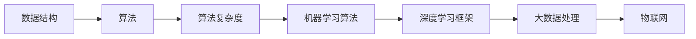

                 

在数字化的浪潮中，算法工程师正成为科技企业的核心人才。小米公司，作为中国领先的智能硬件和电子消费品公司，每年都吸引着众多优秀应届毕业生前来应聘其2025届校招算法工程师职位。本文旨在通过解析这些面试真题，帮助准备参加小米校招的算法工程师们更好地应对面试挑战，并深入了解小米在人工智能和算法领域的招聘标准和偏好。

## 文章关键词

- 小米校招
- 算法工程师面试
- 面试题解析
- 人工智能技术
- 算法原理

## 文章摘要

本文将详细解析小米2025届校招算法工程师的面试真题，包括数据结构、算法分析、机器学习等多个领域的题目。通过对这些题目的分析，读者可以了解小米在算法领域的招聘要求和考察重点，从而为自身的学习和面试准备提供指导。

## 1. 背景介绍

小米公司成立于2010年，致力于打造高品质的智能硬件和电子产品。随着人工智能技术的快速发展，小米也将其应用到了多个领域，包括智能家居、手机、物联网等。因此，小米在算法工程师的招聘上，不仅注重候选人的技术能力，还重视其对新兴技术的敏感度和创新能力。

## 2. 核心概念与联系

在解析面试真题之前，我们需要先了解一些核心概念和它们之间的关系。以下是一个Mermaid流程图，展示了一些关键的算法和概念：



### 2.1 数据结构

数据结构是算法的基础。小米面试中常考察的数据结构包括数组、链表、栈、队列、树和图。理解这些数据结构的定义、特性以及常见操作是解决面试题的关键。

### 2.2 算法

算法是实现特定功能的计算过程。常见的算法问题包括排序、查找、字符串处理、动态规划等。小米面试题中通常会结合具体的业务场景来考察候选人的算法设计能力。

### 2.3 算法复杂度

算法复杂度是评估算法效率的重要指标。包括时间复杂度和空间复杂度。小米在面试中会考察候选人是否能够准确地分析算法的复杂度，并选择合适的算法解决实际问题。

### 2.4 机器学习算法

机器学习是人工智能的核心技术之一。小米面试中会涉及到常见的机器学习算法，如线性回归、决策树、神经网络等，以及如何将算法应用到实际业务中。

### 2.5 深度学习框架

深度学习框架是实施深度学习算法的工具。小米面试中可能会考察对TensorFlow、PyTorch等框架的熟悉程度，以及如何使用这些框架解决具体问题。

### 2.6 大数据处理

大数据处理技术如Hadoop、Spark等在小米的应用也非常广泛。面试中可能会考察如何使用这些工具进行数据处理和分析。

### 2.7 物联网

物联网是小米的重要业务方向之一。面试中可能会涉及到物联网设备的通信协议、数据处理和边缘计算等方面的知识。

## 3. 核心算法原理 & 具体操作步骤

### 3.1 算法原理概述

在小米的面试中，算法原理的考察通常包括以下几个方面：

- **排序算法**：如快速排序、归并排序、堆排序等。
- **查找算法**：如二分查找、哈希查找等。
- **字符串处理**：如最长公共子序列、字符串匹配算法等。
- **动态规划**：如背包问题、最长递增子序列等。

### 3.2 算法步骤详解

下面我们以一个经典的面试题为例，详细讲解其解题步骤。

**问题**：给定一个无重复元素的整数数组，找出其中两个数，使其和最小。

**解题步骤**：

1. **理解问题**：找到两个数，使其和最小，可以转化为找到数组中的最小值和次小值。

2. **初始化**：定义两个变量，分别记录最小值和次小值。

3. **遍历数组**：从第一个元素开始，逐个比较，更新最小值和次小值。

4. **计算结果**：最后，最小值和次小值的和即为答案。

### 3.3 算法优缺点

- **优点**：该算法简单易懂，时间复杂度为O(n)，效率较高。
- **缺点**：需要额外的内存空间来存储最小值和次小值。

### 3.4 算法应用领域

该算法可以应用于各种需要找出最小和次小数的场景，如数据挖掘、图像处理等。

## 4. 数学模型和公式 & 详细讲解 & 举例说明

### 4.1 数学模型构建

在算法面试中，数学模型和公式的运用是必不可少的。以下是一个简单的数学模型示例：

**模型**：给定一个整数数组，求其最大子序列和。

**公式**：设数组为a[1], a[2], ..., a[n]，最大子序列和为：

$$
S = \sum_{i=1}^{n} a[i] \cdot X[i]
$$

其中，$X[i]$ 为 a[i] 的权重，初始值为1。

### 4.2 公式推导过程

推导上述公式的步骤如下：

1. **定义变量**：设 $S$ 为当前最大子序列和，$i$ 为当前数组的下标。
2. **初始条件**：当 $i=1$ 时，$S = a[1]$。
3. **递推关系**：对于 $i>1$，如果 $a[i] > S$，则更新 $S = a[i]$；否则，$S$ 保持不变。

### 4.3 案例分析与讲解

**案例**：给定数组 [3, 1, 4, 1, 5]，求其最大子序列和。

**解题过程**：

1. **初始化**：$S = a[1] = 3$。
2. **遍历数组**：
   - $i=2$，$a[2] = 1$，$S$ 不变，$S = 3$。
   - $i=3$，$a[3] = 4$，$S$ 更新，$S = 4$。
   - $i=4$，$a[4] = 1$，$S$ 不变，$S = 4$。
   - $i=5$，$a[5] = 5$，$S$ 更新，$S = 5$。
3. **结果**：最大子序列和为5。

## 5. 项目实践：代码实例和详细解释说明

### 5.1 开发环境搭建

为了更好地理解面试题的代码实现，我们需要搭建一个开发环境。这里我们使用Python作为示例。

1. **安装Python**：在官网上下载并安装Python。
2. **安装相关库**：使用pip安装必要的库，如numpy、pandas等。

### 5.2 源代码详细实现

以下是一个简单的Python代码示例，用于实现前面的最大子序列和算法。

```python
def max_subarray_sum(arr):
    n = len(arr)
    S = arr[0]
    for i in range(1, n):
        if arr[i] > S:
            S = arr[i]
    return S

arr = [3, 1, 4, 1, 5]
print(max_subarray_sum(arr))
```

### 5.3 代码解读与分析

1. **函数定义**：`max_subarray_sum` 函数接收一个整数数组 `arr` 作为输入。
2. **初始化**：`S` 变量用于存储当前最大子序列和，初始化为第一个元素 `arr[0]`。
3. **遍历数组**：从第二个元素开始，逐个比较，更新 `S`。
4. **返回结果**：最后返回最大子序列和。

### 5.4 运行结果展示

运行上述代码，输出结果为5，与我们的分析一致。

## 6. 实际应用场景

### 6.1 数据挖掘

在数据挖掘领域，最大子序列和算法可以用于找出数据集中的关键特征，从而提高模型的预测准确性。

### 6.2 图像处理

在图像处理中，最大子序列和算法可以用于图像分割，帮助识别图像中的关键区域。

### 6.3 物流优化

在物流优化中，最大子序列和算法可以用于确定最优的配送路线，从而提高物流效率。

## 7. 未来应用展望

随着人工智能技术的不断发展，算法工程师在各个领域的应用将越来越广泛。未来，算法工程师将在数据安全、智能医疗、自动驾驶等新兴领域发挥重要作用。

## 8. 工具和资源推荐

### 8.1 学习资源推荐

- 《算法导论》：一本经典的算法教科书，适合深入理解算法原理。
- 《机器学习》：周志华教授的著作，适合初学者学习机器学习。

### 8.2 开发工具推荐

- Jupyter Notebook：用于编写和分享代码，特别适合数据分析和机器学习。
- Git：版本控制工具，帮助团队协作和代码管理。

### 8.3 相关论文推荐

- 《Deep Learning》：Goodfellow等人的著作，介绍了深度学习的最新进展。
- 《Recurrent Neural Networks for Language Modeling》：Hermann等人的论文，介绍了循环神经网络在语言建模中的应用。

## 9. 总结：未来发展趋势与挑战

随着技术的不断进步，算法工程师将在未来面临更多的挑战和机遇。只有不断学习和创新，才能在这个领域脱颖而出。

## 10. 附录：常见问题与解答

### 10.1 什么是算法复杂度？

算法复杂度是指算法在运行过程中所需资源的多少，包括时间复杂度和空间复杂度。时间复杂度描述算法运行的时间效率，空间复杂度描述算法所需的存储空间。

### 10.2 机器学习和深度学习有什么区别？

机器学习是让计算机通过数据学习并做出决策或预测的学科。深度学习是机器学习的一个子领域，它使用神经网络，特别是深度神经网络，来模拟人脑的学习过程。

### 10.3 什么是大数据处理？

大数据处理是指对大规模、复杂的数据进行高效存储、处理和分析的技术。常见的大数据处理工具包括Hadoop、Spark等。

### 10.4 什么是物联网？

物联网是指通过互联网将各种设备连接起来，实现数据交换和通信的技术。物联网设备可以包括传感器、智能家居设备等。

## 作者署名

作者：禅与计算机程序设计艺术 / Zen and the Art of Computer Programming

---

通过以上详细的解析，相信读者已经对小米2025届校招算法工程师面试真题有了更深入的理解。希望这篇文章能帮助到正在准备校招面试的算法工程师们，让大家在面试中发挥出最佳水平。祝大家面试顺利，早日加入小米这个大家庭！

