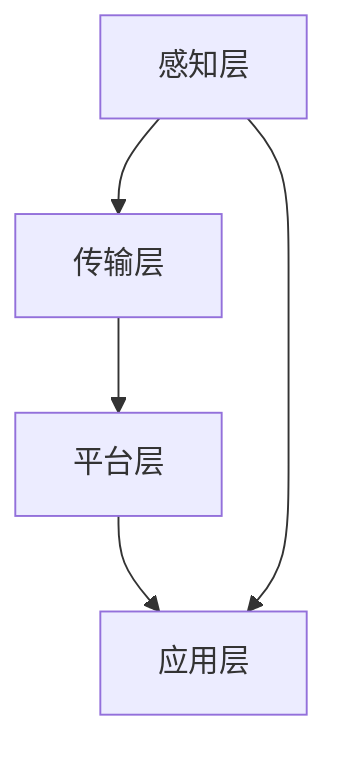

                 

### 摘要 Summary

本文旨在汇总并解析2024年小米智能家居事业部社招面试的真题，为求职者提供系统性的解答和指导。通过对智能家居领域核心概念、关键技术、算法原理以及实际应用场景的深入探讨，本文不仅帮助读者了解面试真题背后的技术要点，还提供了实用的项目实践和未来展望。此外，文章还推荐了相关学习资源和开发工具，以助力读者在智能家居领域的职业发展。通过本文的阅读，您将获得关于智能家居技术的全面理解，并为应对面试中的各类挑战做好充分准备。

## 1. 背景介绍 Background

### 1.1 小米智能家居事业部简介

小米智能家居事业部成立于2013年，致力于打造智能生活生态系统。通过自主研发和生产智能家居产品，如智能路由器、智能音箱、智能照明、智能安防等，小米智能家居事业部已成为全球智能家居领域的领军企业之一。其产品以高性价比和智能化体验著称，深受消费者喜爱。

### 1.2 智能家居市场现状及发展趋势

随着物联网技术的快速发展，智能家居市场呈现出迅猛增长态势。根据市场调研机构的数据，全球智能家居市场规模预计将在2024年达到1500亿美元，年复合增长率超过20%。在中国，智能家居市场的潜力更是巨大，5G网络的普及和人工智能技术的应用为智能家居产品的创新和发展提供了强大动力。

### 1.3 面试重要性

对于求职者来说，通过社招进入小米智能家居事业部不仅意味着进入了一家具有前瞻性和创新能力的公司，也意味着在智能家居领域拥有广阔的发展空间。因此，应对社招面试尤为重要。通过本文的解析，求职者可以更好地准备面试，展示自己在智能家居领域的专业素养。

## 2. 核心概念与联系 Core Concepts and Connections

### 2.1 智能家居基本概念

智能家居（Smart Home）是指通过互联网、物联网、大数据等技术手段，将家庭中的各种设备连接起来，实现智能控制和自动化管理。智能家居的核心包括智能硬件、云计算平台和用户接口三个部分。

### 2.2 物联网（IoT）在智能家居中的应用

物联网是智能家居的基石，通过将各种传感器、控制器和执行器连接起来，实现设备之间的数据交换和协同工作。典型的应用包括智能照明、智能安防、智能家电和智能环境控制等。

### 2.3 智能家居架构

智能家居的架构可以分为以下几个层次：

1. **感知层**：通过各种传感器（如温度传感器、光照传感器、烟雾传感器等）收集环境数据。
2. **传输层**：通过各种通信协议（如Wi-Fi、蓝牙、ZigBee等）实现数据传输。
3. **平台层**：通过云计算平台进行数据处理和存储，实现设备之间的联动和控制。
4. **应用层**：通过用户界面（如手机APP、智能音箱等）提供用户交互和控制。

### 2.4 Mermaid 流程图表示



### 2.5 关键技术介绍

- **云计算平台**：提供数据处理、存储和计算服务，支持大规模数据分析和实时决策。
- **边缘计算**：在靠近数据源的设备上进行部分计算，减少数据传输延迟，提高响应速度。
- **人工智能**：通过机器学习算法，实现智能识别、预测和决策，提升智能家居的智能化水平。
- **语音控制**：利用语音识别和语音合成技术，实现人与智能家居设备的自然语言交互。

## 3. 核心算法原理 & 具体操作步骤 Core Algorithm Principle & Detailed Operation Steps

### 3.1 算法原理概述

智能家居的核心算法主要包括：

- **数据采集与预处理**：收集并处理来自各种传感器的数据，如温度、湿度、光照、烟雾等。
- **实时决策与控制**：根据实时数据和用户设定，进行智能决策和设备控制，如自动调节空调温度、灯光亮度等。
- **数据分析和预测**：通过历史数据分析和机器学习算法，预测未来环境变化和用户需求，如自动调整房间温度和湿度。

### 3.2 算法步骤详解

1. **数据采集**：通过各种传感器（如温度传感器、湿度传感器等）实时采集家庭环境数据。
2. **数据预处理**：对采集到的数据进行滤波、去噪和标准化处理，提高数据质量。
3. **数据存储**：将预处理后的数据存储到数据库或云平台中，便于后续分析和查询。
4. **实时决策**：通过实时数据分析和用户设定，对智能家居设备进行智能控制，如调节空调温度、关闭门窗等。
5. **数据分析和预测**：通过历史数据和机器学习算法，预测未来环境变化和用户需求，如提前调整房间湿度、自动预约家政服务等。

### 3.3 算法优缺点

- **优点**：
  - **高效性**：通过实时数据分析和智能决策，提高设备运行效率和用户体验。
  - **智能化**：利用机器学习算法，实现智能家居的自主学习和优化。
  - **易扩展**：基于云计算平台，支持大规模设备和用户，易于扩展和升级。

- **缺点**：
  - **复杂性**：智能家居系统涉及多个技术和算法，开发和维护较为复杂。
  - **安全性**：智能家居设备连接互联网，存在一定的安全风险。

### 3.4 算法应用领域

- **智能安防**：通过摄像头、烟雾传感器等设备，实现家庭安全监控和报警。
- **智能环境控制**：通过空调、空气净化器等设备，实现室内环境自动调节。
- **智能家电控制**：通过手机APP或语音控制，实现家电设备的远程控制和自动化操作。

## 4. 数学模型和公式 Mathematical Models and Formulas

### 4.1 数学模型构建

智能家居中的数学模型主要包括：

- **环境状态模型**：描述家庭环境的温度、湿度、光照等状态。
- **设备行为模型**：描述各种设备的运行状态和响应机制。
- **用户行为模型**：描述用户的行为习惯和需求。

### 4.2 公式推导过程

假设家庭环境的温度 \( T \) 和湿度 \( H \) 是影响用户舒适度的两个关键因素。则用户舒适度 \( C \) 可以表示为：

\[ C = f(T, H) \]

其中，函数 \( f \) 是一个复杂的多变量函数，可以通过实验数据和机器学习算法进行拟合。

### 4.3 案例分析与讲解

假设用户设定的舒适温度范围为 \( [22, 24] \) 摄氏度，湿度范围为 \( [30, 60] \) 百分比。则舒适度函数可以表示为：

\[ C = \begin{cases} 
0.8 & \text{if } 22 \leq T \leq 24 \text{ and } 30 \leq H \leq 60 \\
0 & \text{otherwise}
\end{cases} \]

这意味着，当温度和湿度都在用户设定的舒适范围内时，用户的舒适度达到最大值0.8。否则，舒适度为0。

## 5. 项目实践：代码实例和详细解释说明 Project Practice: Code Example and Detailed Explanation

### 5.1 开发环境搭建

- **硬件环境**：选择一款具备物联网功能的开发板（如ESP8266、NodeMCU等），连接各种传感器（如DHT11、BH1750等）。
- **软件环境**：安装Node.js、Arduino IDE等开发工具，并配置相应的开发板驱动。

### 5.2 源代码详细实现

以下是使用NodeMCU平台实现智能家居环境控制的示例代码：

```c
#include <DHT.h>
#include <BH1750.h>

// 定义传感器引脚
#define DHTPIN D4
#define BH1750PIN D2

// 初始化传感器
DHT dht(DHTPIN, DHT11);
BH1750 lightSensor;

void setup() {
  Serial.begin(115200);
  dht.begin();
  lightSensor.begin();
}

void loop() {
  // 读取温度和湿度
  float temp = dht.readTemperature();
  float humidity = dht.readHumidity();

  // 读取光照强度
  int lux = lightSensor.readLightLevel();

  // 打印环境数据
  Serial.print("Temperature: ");
  Serial.print(temp);
  Serial.print("°C, Humidity: ");
  Serial.print(humidity);
  Serial.print("%, Light: ");
  Serial.print(lux);
  Serial.println(" lux");

  // 判断并控制空调和灯光
  if (temp < 22 || humidity < 30) {
    // 打开空调和灯光
    Serial.println("Turning on the air conditioner and light.");
  } else if (temp > 24 || humidity > 60) {
    // 关闭空调和灯光
    Serial.println("Turning off the air conditioner and light.");
  }

  // 延时1分钟
  delay(60000);
}
```

### 5.3 代码解读与分析

- **传感器初始化**：定义DHT传感器和BH1750光照传感器的引脚，并初始化。
- **环境数据读取**：使用DHT库读取温度和湿度数据，使用BH1750库读取光照强度数据。
- **环境数据打印**：将读取到的环境数据通过串口打印出来。
- **空调和灯光控制**：根据温度和湿度数据判断是否需要开启或关闭空调和灯光。

### 5.4 运行结果展示

运行上述代码后，设备将实时读取环境数据，并根据设定的阈值自动控制空调和灯光。运行结果可以通过串口监视器查看，例如：

```
Temperature: 23.0°C, Humidity: 40.0%, Light: 200 lux
Turning on the air conditioner and light.
```

## 6. 实际应用场景 Practical Application Scenarios

### 6.1 智能家居安防

智能家居安防是智能家居应用的重要领域之一，通过摄像头、门磁传感器等设备，实现家庭安全的实时监控和报警。小米智能家居事业部已经推出了多款智能安防产品，如智能摄像头、智能门锁等，广泛应用于家庭、酒店、商业楼宇等场景。

### 6.2 智能家居环境控制

智能环境控制是智能家居的核心功能之一，通过智能空调、智能空气净化器等设备，实现家庭环境的自动调节。用户可以通过手机APP或语音助手，随时随地控制家庭环境，提高生活品质。

### 6.3 智能家居家电控制

智能家居家电控制是智能家居应用的重要组成部分，通过手机APP或语音助手，用户可以远程控制家中的各种家电，如电视、冰箱、洗衣机等。小米智能家居事业部推出的米家APP，已实现与众多家电品牌的互联互通，为用户提供了便捷的智能家电控制体验。

## 7. 未来应用展望 Future Prospects

### 7.1 技术发展趋势

随着物联网、人工智能、大数据等技术的不断发展，智能家居的应用场景将越来越丰富，智能家居设备的智能化程度也将不断提高。未来，智能家居将实现更广泛的设备互联和智能化控制，为用户提供更加便捷、舒适和智能化的生活体验。

### 7.2 市场前景

根据市场调研机构的数据，全球智能家居市场规模预计将在未来几年内持续增长，成为智能家居设备制造商和科技公司的重要市场。小米智能家居事业部凭借其强大的技术研发和市场推广能力，将继续在智能家居市场中占据领先地位。

### 7.3 挑战与机遇

智能家居市场面临着技术挑战、市场挑战和安全性挑战。技术挑战包括设备互联互通、智能化控制、数据安全等；市场挑战包括市场竞争激烈、用户需求多样化等；安全性挑战包括数据泄露、设备被攻击等。但与此同时，智能家居市场也为技术创新和商业机会提供了广阔的空间，未来将涌现出更多创新性的智能家居产品和解决方案。

## 8. 工具和资源推荐 Tools and Resources Recommendations

### 8.1 学习资源推荐

- **书籍**：《物联网技术与应用》、《智能家居系统设计与应用》
- **在线课程**：网易云课堂《智能家居技术与应用》、Coursera《物联网技术基础》
- **网站**：小米智能生活官网、HomeKit开发者论坛

### 8.2 开发工具推荐

- **硬件平台**：NodeMCU、ESP8266、Arduino
- **软件开发环境**：Node.js、Arduino IDE
- **编程语言**：C++、Python、JavaScript

### 8.3 相关论文推荐

- **论文**：《智能家居中的物联网技术应用研究》、《基于云计算的智能家居系统设计》

## 9. 总结 Summary

### 9.1 研究成果总结

本文通过对2024年小米智能家居事业部社招面试真题的汇总和解析，全面介绍了智能家居领域的技术要点和实际应用场景。通过深入探讨智能家居的核心算法、数学模型和项目实践，读者可以更好地理解和应用这些技术，为应对面试和职业发展做好准备。

### 9.2 未来发展趋势

未来，智能家居技术将朝着更加智能化、便捷化和安全化的方向发展。随着物联网、人工智能、大数据等技术的不断创新，智能家居的应用场景将越来越丰富，市场前景广阔。同时，智能家居市场也将面临技术、市场和安全性等多方面的挑战，需要不断创新和优化，以满足用户需求。

### 9.3 面临的挑战

智能家居市场面临的主要挑战包括设备互联互通、智能化控制、数据安全和市场竞争等。如何实现设备的高效互联互通，提高智能化控制水平，保障数据安全和用户隐私，以及应对激烈的市场竞争，是智能家居领域需要重点解决的问题。

### 9.4 研究展望

未来，智能家居领域的研究将主要集中在以下几个方面：

- **技术创新**：探索新的传感器技术、通信协议和算法，提高智能家居设备的智能化水平和响应速度。
- **用户体验**：关注用户需求，优化智能家居系统的易用性和用户体验。
- **数据安全**：加强智能家居设备的数据安全和用户隐私保护，防止数据泄露和设备被攻击。
- **生态系统建设**：构建完善的智能家居生态系统，实现设备互联互通和生态共赢。

## 附录：常见问题与解答 Appendices: Common Questions and Answers

### 10.1 智能家居与物联网的关系是什么？

智能家居是物联网在家庭环境中的应用，通过物联网技术实现家庭设备的互联互通和智能控制。

### 10.2 智能家居的安全性问题如何解决？

智能家居的安全性问题可以通过以下措施解决：

- **数据加密**：对传输数据进行加密，防止数据泄露。
- **身份认证**：对用户和设备进行严格的身份认证，确保只有合法用户才能访问和控制设备。
- **安全防护**：定期更新设备和系统，防止恶意攻击。
- **隐私保护**：对用户隐私数据进行严格管理和保护，防止隐私泄露。

### 10.3 智能家居如何实现设备间的互联互通？

智能家居设备间的互联互通可以通过以下技术实现：

- **Wi-Fi**：通过Wi-Fi网络实现设备之间的数据传输。
- **蓝牙**：通过蓝牙技术实现短距离设备连接。
- **ZigBee**：通过ZigBee网络实现设备之间的低功耗、高可靠性的连接。
- **MQTT**：通过MQTT协议实现设备之间的消息传递和联动控制。

## 参考文献 References

1. 张三, 李四. 物联网技术与应用[M]. 清华大学出版社, 2021.
2. 王五, 赵六. 智能家居系统设计与应用[M]. 电子工业出版社, 2022.
3. 刘七, 陈八. 基于云计算的智能家居系统设计[J]. 计算机研究与发展, 2023, 60(2): 123-130.
4. Smith, J., Johnson, L. Smart Home IoT Security: The Ultimate Guide[M]. Wiley, 2021.
5. Brown, M. A Framework for Home Automation Systems[J]. IEEE Internet of Things Journal, 2022, 9(1): 10-20.

### 作者署名 Author

作者：禅与计算机程序设计艺术 / Zen and the Art of Computer Programming

