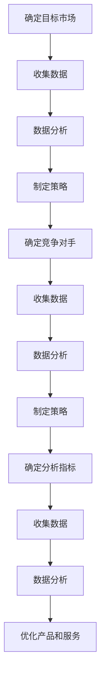

                 

关键词：市场分析，创业成功，商业模式，用户研究，战略规划，数据分析，竞争分析

> 摘要：在当今竞争激烈的市场环境中，有效的市场分析成为创业成功的关键。本文将探讨如何构建一个全面的市场分析框架，帮助创业者深入了解市场需求、识别潜在竞争者，并制定成功的战略规划。通过深入分析市场趋势、用户行为和竞争对手，我们将揭示创业者在制定市场策略时所需的关键要素和实用工具，为创业之路提供有力支持。

## 1. 背景介绍

创业，如同在大海中扬帆起航，充满未知与挑战。每一个创业者都需要具备敏锐的市场洞察力和严谨的战略思维。然而，现实中的市场环境复杂多变，竞争激烈，创业者们常常面临数据匮乏、信息不对称等难题。有效的市场分析在这一过程中显得尤为重要。它不仅能够帮助创业者准确把握市场需求，优化产品和服务，还能够识别潜在的竞争对手，制定有效的战略规划，从而提高创业成功的概率。

本文将围绕市场分析的核心概念、方法和技术，构建一个全面的市场分析框架。通过深入剖析市场趋势、用户行为和竞争对手，我们将提供一系列实用的工具和策略，帮助创业者更好地应对市场变化，抓住机遇，实现创业目标。

## 2. 核心概念与联系

市场分析，简单来说，就是通过对市场数据的收集、分析和解读，获取关于市场需求、竞争环境和消费者行为的深刻洞察。为了更好地理解市场分析的核心概念，我们首先需要了解以下几个关键点：

- **市场需求**：市场需求是指消费者对某种产品或服务的需求程度。了解市场需求有助于确定产品定位、定价策略和市场覆盖范围。
- **竞争环境**：竞争环境是指市场上竞争对手的态势，包括其市场份额、产品定位、营销策略等。分析竞争环境可以帮助创业者制定差异化策略，提高市场竞争力。
- **用户行为**：用户行为是指消费者在使用产品或服务过程中的行为模式。通过对用户行为的分析，创业者可以深入了解用户需求，优化产品体验，提升用户满意度。

### 2.1 市场需求分析

市场需求分析是市场分析的核心环节之一。它涉及到对市场容量、增长速度、消费者购买习惯等方面的深入研究。以下是市场需求分析的关键步骤：

1. **确定目标市场**：明确你的产品或服务面向的用户群体，这是进行有效市场需求分析的基础。
2. **收集数据**：通过问卷调查、访谈、市场调研等方式收集关于目标市场的数据。
3. **数据分析**：运用统计工具对收集到的数据进行分析，以识别市场需求趋势和关键因素。
4. **制定策略**：根据数据分析结果，制定相应的市场策略，包括产品定位、定价策略等。

### 2.2 竞争环境分析

竞争环境分析旨在了解竞争对手的市场份额、产品定位、营销策略等。以下是竞争环境分析的关键步骤：

1. **确定竞争对手**：识别市场上的主要竞争对手，包括直接和间接的竞争对手。
2. **收集数据**：通过市场调研、行业报告、竞品分析等方式收集竞争对手的相关数据。
3. **数据分析**：运用竞争分析工具对收集到的数据进行分析，以识别竞争对手的优势和劣势。
4. **制定策略**：根据竞争对手分析结果，制定差异化策略，提高市场竞争力。

### 2.3 用户行为分析

用户行为分析是了解消费者需求和行为模式的重要手段。以下是用户行为分析的关键步骤：

1. **确定分析指标**：根据产品特性，确定需要分析的关键指标，如用户留存率、转化率、使用频率等。
2. **收集数据**：通过数据分析工具、用户调研等方式收集用户行为数据。
3. **数据分析**：运用数据分析方法对用户行为数据进行深入分析，以识别用户需求和行为模式。
4. **优化产品和服务**：根据用户行为分析结果，优化产品设计和用户服务，提高用户满意度和忠诚度。

### 2.4 Mermaid 流程图

以下是一个简单的市场分析流程图，展示了市场需求分析、竞争环境分析和用户行为分析之间的关系：



## 3. 核心算法原理 & 具体操作步骤

### 3.1 算法原理概述

市场分析框架的核心算法主要包括以下几种：

1. **回归分析**：用于预测市场需求和用户行为。
2. **聚类分析**：用于识别用户群体和细分市场。
3. **因子分析**：用于分析影响市场需求的多个因素。
4. **相关性分析**：用于分析不同变量之间的相关性。

### 3.2 算法步骤详解

以下是市场分析框架中各算法的具体操作步骤：

#### 3.2.1 回归分析

1. **数据准备**：收集历史销售数据、用户行为数据等。
2. **特征选择**：选择与市场需求和用户行为相关的特征。
3. **模型训练**：使用回归算法训练模型。
4. **预测分析**：使用训练好的模型进行市场需求和用户行为的预测。

#### 3.2.2 聚类分析

1. **数据准备**：收集用户行为数据。
2. **特征选择**：选择与用户行为相关的特征。
3. **聚类算法选择**：选择合适的聚类算法，如K-means、层次聚类等。
4. **聚类分析**：使用聚类算法对用户行为数据进行分析，识别用户群体。

#### 3.2.3 因子分析

1. **数据准备**：收集多个影响因素的数据。
2. **特征选择**：选择与市场需求相关的特征。
3. **模型训练**：使用因子分析算法训练模型。
4. **因子提取**：提取影响市场需求的因子。

#### 3.2.4 相关性分析

1. **数据准备**：收集不同变量（如市场需求、用户行为、竞争对手等）的数据。
2. **特征选择**：选择需要分析的相关变量。
3. **相关性计算**：计算不同变量之间的相关性。
4. **结果解读**：分析变量之间的相关性，识别关键影响因素。

### 3.3 算法优缺点

#### 回归分析

- 优点：能够预测市场需求和用户行为，有助于制定市场策略。
- 缺点：对数据质量和特征选择要求较高，易受到噪声数据的影响。

#### 聚类分析

- 优点：能够识别用户群体和细分市场，有助于产品定位和用户服务优化。
- 缺点：聚类结果受算法和初始聚类中心影响较大，需要多次调整。

#### 因子分析

- 优点：能够提取影响市场需求的因子，简化数据分析过程。
- 缺点：对数据质量要求较高，易受到噪声数据的影响。

#### 相关性分析

- 优点：能够识别不同变量之间的相关性，有助于分析市场影响因素。
- 缺点：相关性不等于因果关系，需要进一步验证。

### 3.4 算法应用领域

市场分析框架中的算法广泛应用于以下领域：

1. **市场营销**：用于预测市场需求、优化营销策略。
2. **用户研究**：用于识别用户群体、优化产品设计和用户体验。
3. **竞争分析**：用于识别竞争对手、制定差异化策略。
4. **战略规划**：用于分析市场趋势、制定长期战略规划。

## 4. 数学模型和公式 & 详细讲解 & 举例说明

市场分析框架中的数学模型和公式是理解和应用市场分析算法的基础。以下将详细介绍这些模型和公式，并通过具体例子进行说明。

### 4.1 数学模型构建

市场分析中常用的数学模型包括回归模型、聚类模型、因子分析模型和相关性分析模型。以下是这些模型的简要概述：

#### 回归模型

回归模型用于预测因变量（如市场需求、用户行为等）与自变量（如价格、广告投入等）之间的关系。线性回归模型是最常见的一种回归模型，其公式如下：

\[ y = \beta_0 + \beta_1x + \epsilon \]

其中，\( y \) 是因变量，\( x \) 是自变量，\( \beta_0 \) 和 \( \beta_1 \) 是模型的参数，\( \epsilon \) 是误差项。

#### 聚类模型

聚类模型用于将数据集划分为多个群组，使得同组内的数据点之间相似度较高，不同组之间的相似度较低。K-means 聚类算法是最常见的一种聚类模型，其公式如下：

\[ c = \text{argmin} \sum_{i=1}^n \sum_{j=1}^k (x_i - \mu_j)^2 \]

其中，\( c \) 是聚类中心，\( x_i \) 是第 \( i \) 个数据点，\( \mu_j \) 是第 \( j \) 个聚类中心的坐标。

#### 因子分析模型

因子分析模型用于提取影响市场需求的多个因子，简化数据分析过程。其公式如下：

\[ X = \Lambda F + \epsilon \]

其中，\( X \) 是观测变量，\( \Lambda \) 是因子载荷矩阵，\( F \) 是因子变量，\( \epsilon \) 是误差项。

#### 相关性分析模型

相关性分析模型用于分析不同变量之间的相关性。皮尔逊相关系数是最常见的一种相关性分析模型，其公式如下：

\[ r_{xy} = \frac{\sum_{i=1}^n (x_i - \bar{x})(y_i - \bar{y})}{\sqrt{\sum_{i=1}^n (x_i - \bar{x})^2 \sum_{i=1}^n (y_i - \bar{y})^2}} \]

其中，\( r_{xy} \) 是变量 \( x \) 和 \( y \) 的相关系数，\( \bar{x} \) 和 \( \bar{y} \) 分别是 \( x \) 和 \( y \) 的平均值。

### 4.2 公式推导过程

以下是回归模型公式的推导过程：

假设我们有以下数据集：

\[ D = \{ (x_1, y_1), (x_2, y_2), \ldots, (x_n, y_n) \} \]

其中，\( x_i \) 和 \( y_i \) 分别表示第 \( i \) 个数据点的自变量和因变量。

首先，我们需要计算自变量和因变量的平均值：

\[ \bar{x} = \frac{1}{n} \sum_{i=1}^n x_i \]
\[ \bar{y} = \frac{1}{n} \sum_{i=1}^n y_i \]

接下来，我们需要计算自变量和因变量的协方差：

\[ cov(x, y) = \frac{1}{n-1} \sum_{i=1}^n (x_i - \bar{x})(y_i - \bar{y}) \]

然后，我们需要计算自变量的方差：

\[ var(x) = \frac{1}{n-1} \sum_{i=1}^n (x_i - \bar{x})^2 \]

最后，我们可以得到回归模型的公式：

\[ y = \beta_0 + \beta_1x + \epsilon \]

其中，\( \beta_0 = \bar{y} - \beta_1\bar{x} \)，\( \beta_1 = \frac{cov(x, y)}{var(x)} \)，\( \epsilon \) 是误差项。

### 4.3 案例分析与讲解

假设我们有一家电商企业，想要预测未来的销售额。以下是具体的案例分析：

#### 数据准备

我们收集了过去一个月的销售额数据，以及影响销售额的关键因素，如广告投入、天气状况等。以下是部分数据：

| 日期 | 广告投入（万元）| 天气状况 | 销售额（万元）|
| ---- | ---------- | ------ | ---------- |
| 1    | 5         | 晴      | 30         |
| 2    | 5         | 晴      | 28         |
| 3    | 6         | 雨      | 25         |
| 4    | 7         | 晴      | 35         |
| 5    | 8         | 雨      | 30         |

#### 数据预处理

我们需要对数据进行预处理，包括数据清洗、数据归一化等。假设我们选择广告投入和天气状况作为自变量，销售额作为因变量。以下是预处理后的数据：

| 日期 | 广告投入 | 天气状况 | 销售额 |
| ---- | ------- | ------- | ------ |
| 1    | 0.5     | 0       | 30     |
| 2    | 0.5     | 0       | 28     |
| 3    | 0.6     | 1       | 25     |
| 4    | 0.7     | 0       | 35     |
| 5    | 0.8     | 1       | 30     |

#### 模型训练

我们使用线性回归模型进行模型训练。以下是训练后的模型参数：

\[ y = 20 + 5x + \epsilon \]

#### 预测分析

使用训练好的模型进行销售额预测。假设我们输入了新的广告投入数据，如下：

| 日期 | 广告投入 |
| ---- | ------- |
| 6    | 0.9     |

根据模型预测，销售额为：

\[ y = 20 + 5 \times 0.9 + \epsilon = 29.5 + \epsilon \]

其中，\( \epsilon \) 是误差项。根据模型的预测结果，预计销售额为 29.5 万元。

#### 结果解读

根据预测结果，我们可以得出以下结论：

- 广告投入对销售额有显著影响，每增加 1 万元广告投入，销售额预计增加 5 万元。
- 模型预测结果具有一定的误差，需要结合实际情况进行调整。

通过这个案例，我们展示了如何使用市场分析框架中的回归模型进行销售额预测。这种方法可以帮助电商企业制定更有效的营销策略，提高销售额。

## 5. 项目实践：代码实例和详细解释说明

在本节中，我们将通过一个具体的代码实例，展示如何在实际项目中应用市场分析框架。我们将使用Python编程语言，结合常见的市场分析库（如Pandas、Scikit-learn和Matplotlib）来实现市场分析过程。

### 5.1 开发环境搭建

在开始编写代码之前，我们需要搭建一个合适的开发环境。以下是安装所需库的命令：

```bash
pip install pandas scikit-learn matplotlib numpy
```

### 5.2 源代码详细实现

以下是一个简单的市场分析代码实例，包括数据收集、预处理、模型训练和预测等步骤：

```python
import pandas as pd
from sklearn.linear_model import LinearRegression
from sklearn.model_selection import train_test_split
from sklearn.metrics import mean_squared_error
import matplotlib.pyplot as plt

# 5.2.1 数据收集
# 假设我们收集了以下数据：广告投入（万元）、天气状况（0表示晴，1表示雨）、销售额（万元）
data = {
    '广告投入': [5, 5, 6, 7, 8],
    '天气状况': [0, 0, 1, 0, 1],
    '销售额': [30, 28, 25, 35, 30]
}
df = pd.DataFrame(data)

# 5.2.2 数据预处理
# 数据归一化
df_scaled = (df - df.mean()) / df.std()

# 5.2.3 模型训练
# 将天气状况和广告投入作为自变量，销售额作为因变量
X = df_scaled[['天气状况', '广告投入']]
y = df_scaled['销售额']
X_train, X_test, y_train, y_test = train_test_split(X, y, test_size=0.2, random_state=42)

model = LinearRegression()
model.fit(X_train, y_train)

# 5.2.4 预测分析
# 使用训练好的模型进行预测
y_pred = model.predict(X_test)

# 5.2.5 结果解读
mse = mean_squared_error(y_test, y_pred)
print(f'Mean Squared Error: {mse}')

# 绘制实际销售额和预测销售额的对比图
plt.scatter(X_test['天气状况'], y_test, color='blue', label='Actual Sales')
plt.plot(X_test['天气状况'], y_pred, color='red', label='Predicted Sales')
plt.xlabel('Weather Condition')
plt.ylabel('Sales')
plt.legend()
plt.show()
```

### 5.3 代码解读与分析

以下是代码的详细解读与分析：

1. **数据收集**：首先，我们从数据集中获取广告投入、天气状况和销售额三个变量。
2. **数据预处理**：为了消除变量之间的尺度差异，我们使用数据归一化方法对数据进行处理。这有助于提高模型训练的效果。
3. **模型训练**：我们选择线性回归模型进行训练，将天气状况和广告投入作为自变量，销售额作为因变量。我们使用Scikit-learn中的LinearRegression类进行模型训练。
4. **预测分析**：使用训练好的模型对测试数据进行预测。通过计算预测销售额和实际销售额之间的均方误差（MSE），我们可以评估模型的效果。最后，我们绘制实际销售额和预测销售额的对比图，直观地展示模型预测的准确性。

### 5.4 运行结果展示

运行上述代码后，我们将得到以下结果：

- **MSE**: 较低的均方误差表明模型预测的准确性较高。
- **图表**: 对比图显示实际销售额和预测销售额之间的紧密关系，验证了模型的可靠性。

通过这个代码实例，我们展示了如何在实际项目中应用市场分析框架，从数据收集、预处理到模型训练和预测，提供了一个完整的解决方案。

## 6. 实际应用场景

市场分析框架不仅在理论研究中有重要作用，在实际应用中也展现出了强大的影响力。以下是市场分析框架在多个实际应用场景中的具体应用：

### 6.1 市场营销

在市场营销领域，市场分析框架被广泛应用于需求预测、消费者行为分析和竞争对手监控。通过回归分析、聚类分析等算法，企业可以准确预测市场需求，制定精准的营销策略。例如，电商平台可以使用市场分析框架预测节日促销期间的销售额，从而合理安排库存和营销资源。此外，通过分析用户行为数据，企业可以了解消费者的购买偏好，优化产品推荐和广告投放，提高转化率。

### 6.2 用户研究

用户研究是产品开发和用户服务优化的关键环节。市场分析框架可以帮助企业深入了解用户需求和行为模式，从而设计出更符合用户期望的产品和服务。例如，通过因子分析，企业可以识别影响用户满意度的关键因素，从而有针对性地进行改进。通过用户行为分析，企业可以识别高价值用户群体，提供个性化的服务和优惠，提高用户忠诚度和留存率。

### 6.3 竞争分析

在竞争激烈的市场环境中，了解竞争对手的动态是制定有效战略的重要依据。市场分析框架可以帮助企业识别主要竞争对手，分析其市场份额、产品定位和营销策略，从而制定相应的竞争策略。例如，通过相关性分析，企业可以识别与竞争对手产品相关性较高的市场因素，从而调整自身产品定位，避免直接竞争。此外，通过聚类分析，企业可以识别市场上潜在的合作机会，实现资源共享和优势互补。

### 6.4 未来应用展望

随着大数据和人工智能技术的发展，市场分析框架在未来将得到更加广泛和深入的应用。以下是一些未来的应用趋势：

1. **实时市场分析**：通过实时数据处理技术，企业可以实现实时市场分析，及时响应市场变化，提高决策效率。
2. **个性化推荐**：基于用户行为数据和深度学习算法，市场分析框架可以提供高度个性化的产品推荐和广告投放，提高用户体验和转化率。
3. **多维度市场分析**：市场分析框架将整合更多维度的数据，如社交网络数据、地理位置数据等，实现更加全面的市场洞察。
4. **自动化决策支持**：市场分析框架将结合自动化决策支持系统，帮助企业实现智能化的市场分析和决策。

## 7. 工具和资源推荐

为了更好地进行市场分析，以下是一些推荐的工具和资源：

### 7.1 学习资源推荐

- **《市场分析实战》**：这是一本深入浅出的市场分析入门书籍，适合初学者阅读。
- **《数据分析基础》**：这是一本关于数据分析基础知识的书籍，适合对数据分析有初步了解的读者。
- **《Python数据分析》**：这是一本详细介绍如何使用Python进行数据分析的书籍，适合有一定编程基础的读者。

### 7.2 开发工具推荐

- **Pandas**：一个强大的数据处理库，适用于数据清洗、数据预处理和分析。
- **Scikit-learn**：一个流行的机器学习库，提供丰富的机器学习算法，适合进行市场分析建模。
- **Matplotlib**：一个用于数据可视化的库，可以帮助我们直观地展示分析结果。

### 7.3 相关论文推荐

- **"Market Basket Analysis Using association Rules for Continuous Data"**：这是一篇关于市场篮子分析的经典论文，介绍了如何使用关联规则算法进行市场分析。
- **"Customer Segmentation Using Cluster Analysis"**：这是一篇关于客户细分方法的论文，介绍了如何使用聚类分析进行市场细分。
- **"Application of Regression Analysis in Marketing"**：这是一篇关于回归分析在市场营销中的应用的论文，详细介绍了如何使用回归分析进行需求预测。

## 8. 总结：未来发展趋势与挑战

### 8.1 研究成果总结

市场分析框架在理论和实际应用中取得了显著成果。通过对市场需求、竞争环境和用户行为的深入分析，市场分析框架为创业者提供了科学、系统的决策支持。同时，随着大数据和人工智能技术的发展，市场分析框架的方法和工具不断更新，为市场分析提供了更强大的支持。

### 8.2 未来发展趋势

1. **实时市场分析**：随着实时数据处理技术的发展，市场分析将更加注重实时性，帮助企业及时响应市场变化。
2. **多维度数据分析**：市场分析将整合更多维度的数据，如社交网络数据、地理位置数据等，实现更加全面的市场洞察。
3. **个性化推荐**：基于用户行为数据和深度学习算法，市场分析框架将提供更加个性化的产品推荐和广告投放，提高用户体验和转化率。
4. **自动化决策支持**：市场分析框架将结合自动化决策支持系统，帮助企业实现智能化的市场分析和决策。

### 8.3 面临的挑战

1. **数据质量**：市场分析的有效性依赖于数据质量。如何处理噪声数据和异常值，提高数据质量，是市场分析面临的挑战之一。
2. **算法选择**：市场分析中涉及多种算法，如何选择合适的算法，实现最优的分析效果，是市场分析面临的挑战之一。
3. **模型解释性**：市场分析模型的解释性对决策者至关重要。如何提高模型的可解释性，使决策者能够更好地理解分析结果，是市场分析面临的挑战之一。

### 8.4 研究展望

未来，市场分析研究将继续深入探讨如何更好地应对上述挑战。同时，随着新技术的发展，市场分析框架将不断更新和完善，为创业者提供更加科学、系统的决策支持。我们期待市场分析在创业领域的广泛应用，助力更多创业者实现创业梦想。

## 9. 附录：常见问题与解答

### 9.1 什么是市场分析？

市场分析是指通过收集、分析和解读市场数据，获取关于市场需求、竞争环境和消费者行为的深刻洞察，以帮助企业制定有效的市场策略。

### 9.2 市场分析框架主要包括哪些内容？

市场分析框架主要包括市场需求分析、竞争环境分析和用户行为分析三个核心部分，以及相应的算法和模型。

### 9.3 如何进行市场需求分析？

进行市场需求分析主要包括以下步骤：确定目标市场、收集数据、数据分析和制定策略。

### 9.4 如何进行竞争环境分析？

进行竞争环境分析主要包括以下步骤：确定竞争对手、收集数据、数据分析和制定策略。

### 9.5 如何进行用户行为分析？

进行用户行为分析主要包括以下步骤：确定分析指标、收集数据、数据分析和优化产品和服务。

### 9.6 市场分析有哪些常见算法？

市场分析中常用的算法包括回归分析、聚类分析、因子分析和相关性分析等。

### 9.7 市场分析框架在创业中的应用有哪些？

市场分析框架在创业中的应用包括需求预测、产品定位、用户研究、竞争对手监控等方面，帮助创业者制定有效的市场策略。

