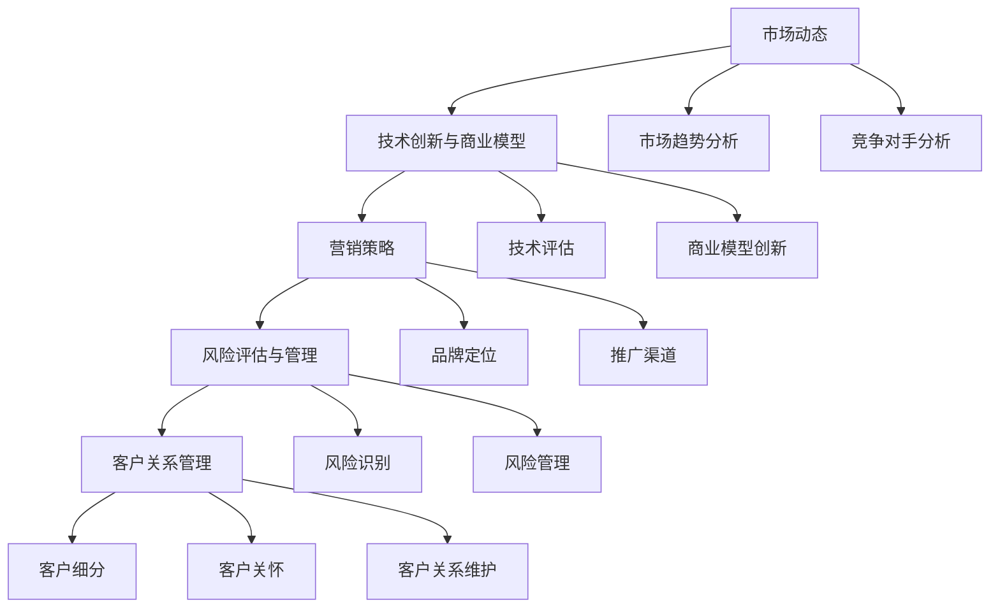

                 

关键词：市场策略、创业挑战、商业模型、技术创新、营销策略、风险评估、客户关系管理。

> 摘要：本文将深入探讨创业者面临的市场挑战，通过分析市场动态、创新技术、商业模型及营销策略等方面，帮助创业者更好地应对市场风险，提升竞争力，实现企业的可持续发展。

## 1. 背景介绍

在当今快速变化的市场环境中，创业者面临着前所未有的挑战。市场不确定性增加，竞争日益激烈，技术创新速度加快，这些都要求创业者具备敏锐的市场洞察力和强大的应对能力。创业者不仅需要具备优秀的技术能力，还需要掌握市场策略、商业模式、营销技巧等多方面的知识。因此，如何有效应对市场挑战成为创业者成功的关键。

本文将从以下几个方面展开讨论：

- **市场动态分析**：探讨市场环境的变化趋势，为创业者提供市场分析的方法和工具。
- **技术创新与商业模型**：分析如何利用技术创新构建可持续的商业模式，实现企业价值最大化。
- **营销策略**：介绍有效的营销方法，帮助创业者提高品牌知名度和市场占有率。
- **风险评估与管理**：探讨如何识别和管理市场风险，确保企业稳健发展。
- **客户关系管理**：分析如何建立和维护良好的客户关系，提高客户满意度和忠诚度。

通过以上几个方面的深入探讨，本文旨在为创业者提供一套全面的市场挑战应对策略，帮助他们更好地把握市场机遇，克服市场挑战，实现企业的长期发展。

## 2. 核心概念与联系

### 2.1 市场动态

市场动态是创业者必须密切关注的核心概念。市场环境的变化往往带来新的机遇和挑战。为了应对这些变化，创业者需要掌握市场分析的方法和工具。

**市场趋势分析**：通过收集和分析市场数据，了解行业的发展趋势和消费者的需求变化。例如，采用 **时间序列分析** 方法，可以预测未来的市场走向。

**竞争对手分析**：了解竞争对手的营销策略、产品定位、市场份额等信息，有助于创业者制定更有针对性的市场策略。**SWOT分析** 是一种常用的工具，可以帮助创业者全面评估自身的优势和劣势。

### 2.2 技术创新与商业模型

技术创新是驱动企业发展的核心动力。创业者需要不断探索新的技术领域，以保持竞争优势。

**技术评估**：在引入新技术时，需要对技术的可行性、成本和潜在风险进行评估。**技术成熟度模型（Technology Readiness Level, TRL）** 是一种常用的工具，可以帮助创业者评估新技术的成熟度。

**商业模型创新**：创业者需要构建可持续的商业模式，以实现企业的长期发展。**商业模式画布（Business Model Canvas）** 是一种实用的工具，可以帮助创业者梳理和优化商业模型。

### 2.3 营销策略

营销策略是创业者提升品牌知名度和市场占有率的关键手段。有效的营销策略可以吸引更多的客户，增加销售收入。

**品牌定位**：明确品牌的核心价值，并针对目标客户进行定位。**差异化定位** 和 **目标市场细分** 是实现品牌定位的有效方法。

**推广渠道**：选择适合的推广渠道，如社交媒体、内容营销、广告投放等。**数据驱动营销** 可以通过数据分析优化营销策略，提高营销效果。

### 2.4 风险评估与管理

市场风险是创业者必须面对的重要挑战。有效的风险评估和管理可以帮助创业者降低风险，确保企业的稳健发展。

**风险识别**：通过收集和分析市场数据、竞争对手信息等，识别潜在的市场风险。

**风险管理**：采用 **风险矩阵** 等工具，评估风险的严重程度和可能性，并制定相应的应对措施。

### 2.5 客户关系管理

客户关系管理是创业者提升客户满意度和忠诚度的关键。良好的客户关系可以带来稳定的客户流量和口碑传播。

**客户细分**：根据客户的需求、行为和购买力等因素，对客户进行细分，提供个性化的产品和服务。

**客户关怀**：定期与客户沟通，了解他们的需求和反馈，提供优质的服务和解决方案。

**客户关系维护**：通过建立忠诚度计划、优惠活动等，维护与客户的长期关系，提高客户满意度。

### 2.6 Mermaid 流程图

以下是一个简单的 Mermaid 流程图，展示了市场挑战应对策略的核心概念和联系：



通过以上核心概念和联系的分析，创业者可以更全面地了解市场挑战，并制定相应的应对策略。

## 3. 核心算法原理 & 具体操作步骤

### 3.1 算法原理概述

在应对市场挑战的过程中，创业者需要掌握一系列核心算法原理，以实现数据驱动的决策和优化。以下介绍几种常用的算法原理：

**1. 数据挖掘算法**：数据挖掘算法是一种通过分析大量数据，发现数据间关系和模式的方法。常见的算法包括分类算法（如决策树、随机森林、支持向量机等）、聚类算法（如K-Means、层次聚类等）和关联规则算法（如Apriori算法）。

**2. 机器学习算法**：机器学习算法是一种通过训练模型，从数据中自动发现规律和模式的方法。常见的算法包括线性回归、逻辑回归、神经网络等。

**3. 优化算法**：优化算法是一种在满足一定约束条件下，寻找最优解的方法。常见的算法包括线性规划、整数规划、遗传算法、模拟退火等。

### 3.2 算法步骤详解

**3.2.1 数据挖掘算法**

**步骤 1**：数据预处理

- **数据清洗**：去除重复数据、缺失数据和异常数据。
- **数据转换**：将不同类型的数据转换为同一类型，如将类别数据转换为数值数据。
- **特征工程**：选择有用的特征，构建特征向量。

**步骤 2**：选择合适的算法

- 根据问题的性质，选择适合的数据挖掘算法。
- 考虑算法的复杂度、准确度和可解释性等因素。

**步骤 3**：模型训练与评估

- 使用训练数据集训练模型。
- 使用验证数据集评估模型性能。
- 调整模型参数，提高模型性能。

**步骤 4**：应用模型

- 使用训练好的模型进行预测或分类。
- 根据预测结果，制定相应的市场策略。

**3.2.2 机器学习算法**

**步骤 1**：数据预处理

- **数据清洗**：去除重复数据、缺失数据和异常数据。
- **数据转换**：将不同类型的数据转换为同一类型，如将类别数据转换为数值数据。
- **特征工程**：选择有用的特征，构建特征向量。

**步骤 2**：选择合适的算法

- 根据问题的性质，选择适合的机器学习算法。
- 考虑算法的复杂度、准确度和可解释性等因素。

**步骤 3**：模型训练与评估

- 使用训练数据集训练模型。
- 使用验证数据集评估模型性能。
- 调整模型参数，提高模型性能。

**步骤 4**：应用模型

- 使用训练好的模型进行预测或分类。
- 根据预测结果，制定相应的市场策略。

**3.2.3 优化算法**

**步骤 1**：问题建模

- 明确优化目标，如最大化利润、最小化成本等。
- 确定约束条件，如资源限制、时间限制等。

**步骤 2**：选择合适的算法

- 根据问题的性质，选择适合的优化算法。
- 考虑算法的复杂度、准确度和可解释性等因素。

**步骤 3**：算法实现

- 根据选定的算法，编写实现代码。
- 调试代码，确保算法的正确性。

**步骤 4**：求解与评估

- 使用算法求解优化问题。
- 评估求解结果，如最优解、最优解值等。

### 3.3 算法优缺点

**数据挖掘算法**：

- **优点**：能够从大量数据中发现有用的信息，帮助创业者制定更准确的市场策略。
- **缺点**：算法复杂度高，对数据质量和预处理要求较高。

**机器学习算法**：

- **优点**：能够自动从数据中学习规律，降低人工干预的难度。
- **缺点**：对数据量要求较大，且模型可解释性较差。

**优化算法**：

- **优点**：能够在满足约束条件下找到最优解，提高企业运营效率。
- **缺点**：算法复杂度高，求解时间较长。

### 3.4 算法应用领域

**数据挖掘算法**：

- **应用领域**：市场预测、客户行为分析、信用评估等。

**机器学习算法**：

- **应用领域**：推荐系统、风险控制、智能客服等。

**优化算法**：

- **应用领域**：资源调度、物流优化、供应链管理等。

通过以上算法原理和具体操作步骤的介绍，创业者可以更好地理解并应用这些算法，以应对市场挑战，提高企业的竞争力。

## 4. 数学模型和公式 & 详细讲解 & 举例说明

### 4.1 数学模型构建

在市场挑战应对策略中，数学模型扮演着至关重要的角色。以下介绍几种常见的数学模型及其构建方法。

#### 4.1.1 指数平滑模型

指数平滑模型是一种用于时间序列预测的数学模型，它能够处理数据中的随机波动，并对未来的趋势进行预测。

**模型公式**：

$$
y_t = \alpha \cdot y_{t-1} + (1 - \alpha) \cdot x_t
$$

其中，\(y_t\) 表示当前时间点的预测值，\(y_{t-1}\) 表示前一个时间点的预测值，\(x_t\) 表示当前时间点的实际值，\(\alpha\) 为平滑系数，取值范围为 \(0 < \alpha < 1\)。

#### 4.1.2 回归模型

回归模型是一种用于分析变量之间关系的数学模型，常见的有线性回归和多项式回归。

**线性回归模型**：

$$
y = \beta_0 + \beta_1 \cdot x
$$

其中，\(y\) 为因变量，\(x\) 为自变量，\(\beta_0\) 和 \(\beta_1\) 为模型参数。

**多项式回归模型**：

$$
y = \beta_0 + \beta_1 \cdot x + \beta_2 \cdot x^2 + \cdots + \beta_n \cdot x^n
$$

#### 4.1.3 动态规划模型

动态规划模型是一种用于解决优化问题的数学模型，它能够通过分步求解，找到最优解。

**模型公式**：

$$
\begin{aligned}
    V(n, j) &= \min_{1 \leq i \leq m} \{c(i, j) + V(n-1, i)\} \\
    V(0, j) &= 0
\end{aligned}
$$

其中，\(V(n, j)\) 表示在第 \(n\) 步，状态 \(j\) 的最优值，\(c(i, j)\) 表示在第 \(n\) 步选择策略 \(i\) 时的成本。

### 4.2 公式推导过程

以下以指数平滑模型为例，介绍公式的推导过程。

#### 4.2.1 基本思路

指数平滑模型的核心思想是给予过去的数据不同的权重，越近的数据权重越大，越远的权重越小。这样，模型可以更好地捕捉到数据中的短期波动和长期趋势。

#### 4.2.2 推导步骤

**步骤 1**：定义平滑系数 \(\alpha\)

设 \(\alpha\) 为平滑系数，取值范围为 \(0 < \alpha < 1\)。这意味着当前数据的权重为 \(\alpha\)，前一个数据的权重为 \(1 - \alpha\)。

**步骤 2**：构建递推关系

根据指数平滑的思想，当前时间点的预测值 \(y_t\) 应该是前一个预测值 \(y_{t-1}\) 和当前实际值 \(x_t\) 的线性组合：

$$
y_t = \alpha \cdot y_{t-1} + (1 - \alpha) \cdot x_t
$$

**步骤 3**：推导递推公式

假设在当前时间点 \(t\)，我们有：

$$
y_t = \alpha \cdot y_{t-1} + (1 - \alpha) \cdot x_t
$$

那么，在下一个时间点 \(t+1\)，我们可以得到：

$$
y_{t+1} = \alpha \cdot y_t + (1 - \alpha) \cdot x_{t+1}
$$

将 \(y_t\) 的值代入，得到：

$$
y_{t+1} = \alpha \cdot (\alpha \cdot y_{t-1} + (1 - \alpha) \cdot x_t) + (1 - \alpha) \cdot x_{t+1}
$$

化简后得到：

$$
y_{t+1} = \alpha^2 \cdot y_{t-1} + \alpha \cdot (1 - \alpha) \cdot x_t + (1 - \alpha) \cdot x_{t+1}
$$

继续递推，可以得到：

$$
y_{t+k} = \alpha^k \cdot y_{t-k} + \sum_{i=0}^{k-1} \alpha^i \cdot (1 - \alpha) \cdot x_{t-i}
$$

**步骤 4**：求和公式

为了简化计算，我们可以将上述求和公式写成求和形式：

$$
y_{t+k} = \alpha^k \cdot y_{t-k} + (1 - \alpha) \cdot \sum_{i=0}^{k-1} \alpha^i \cdot x_{t-i}
$$

由于 \( \sum_{i=0}^{k-1} \alpha^i \) 是一个等比数列的求和，其求和公式为：

$$
\sum_{i=0}^{k-1} \alpha^i = \frac{1 - \alpha^k}{1 - \alpha}
$$

代入上述公式，得到：

$$
y_{t+k} = \alpha^k \cdot y_{t-k} + (1 - \alpha) \cdot \frac{1 - \alpha^k}{1 - \alpha}
$$

化简后得到最终的指数平滑模型公式：

$$
y_{t+k} = y_{t-k} + (1 - \alpha^k)
$$

### 4.3 案例分析与讲解

以下通过一个实际案例，展示如何使用指数平滑模型进行市场预测。

#### 案例背景

某公司生产一种热门产品，过去三个月的销量如下表所示：

| 时间   | 销量（件） |
| ------ | ---------- |
| 1月    | 100        |
| 2月    | 120        |
| 3月    | 150        |

公司希望根据这些数据预测接下来的三个月的销量。

#### 解题步骤

**步骤 1**：选择平滑系数 \(\alpha\)

根据经验，选择 \(\alpha = 0.5\)。

**步骤 2**：计算预测值

使用指数平滑模型公式，计算接下来的三个月销量：

$$
\begin{aligned}
    y_{4} &= 0.5 \cdot y_{0} + (1 - 0.5) \cdot x_{1} = 0.5 \cdot 100 + 0.5 \cdot 120 = 115 \\
    y_{5} &= 0.5 \cdot y_{1} + (1 - 0.5) \cdot x_{2} = 0.5 \cdot 120 + 0.5 \cdot 150 = 135 \\
    y_{6} &= 0.5 \cdot y_{2} + (1 - 0.5) \cdot x_{3} = 0.5 \cdot 150 + 0.5 \cdot 150 = 150
\end{aligned}
$$

因此，预测接下来的三个月销量分别为 115 件、135 件和 150 件。

#### 结果分析

根据预测结果，公司可以在接下来的三个月中合理安排生产计划，确保库存充足，满足市场需求。同时，公司还可以通过对比实际销量和预测销量，不断调整平滑系数，提高预测的准确性。

通过以上数学模型和公式的讲解，创业者可以更好地理解市场预测的方法，为企业的决策提供有力支持。

## 5. 项目实践：代码实例和详细解释说明

### 5.1 开发环境搭建

为了进行市场挑战应对策略的代码实践，我们需要搭建一个合适的开发环境。以下是一个基本的开发环境搭建指南：

#### 开发工具

- Python 3.8 或以上版本
- Jupyter Notebook 或 PyCharm

#### 数据库

- MySQL 或 PostgreSQL

#### 环境配置

1. 安装 Python 和相关库

   ```bash
   pip install numpy pandas matplotlib scikit-learn
   ```

2. 安装 MySQL 或 PostgreSQL

   - MySQL: [官方安装教程](https://dev.mysql.com/doc/mysql-install-en/files)
   - PostgreSQL: [官方安装教程](https://www.postgresql.org/docs/current/install.html)

### 5.2 源代码详细实现

以下是一个简单的市场预测项目的代码实例，使用了 Python 语言和 Scikit-learn 库进行实现。

```python
import numpy as np
import pandas as pd
from sklearn.model_selection import train_test_split
from sklearn.ensemble import RandomForestRegressor
from sklearn.metrics import mean_squared_error

# 5.2.1 数据读取与预处理
data = pd.read_csv('sales_data.csv')  # 假设数据存储在 sales_data.csv 文件中
data['Date'] = pd.to_datetime(data['Date'])
data.set_index('Date', inplace=True)
data.fillna(method='ffill', inplace=True)

# 5.2.2 数据预处理
X = data[['Feature1', 'Feature2', 'Feature3']]
y = data['Sales']

X_train, X_test, y_train, y_test = train_test_split(X, y, test_size=0.2, random_state=42)

# 5.2.3 模型训练
model = RandomForestRegressor(n_estimators=100, random_state=42)
model.fit(X_train, y_train)

# 5.2.4 模型评估
y_pred = model.predict(X_test)
mse = mean_squared_error(y_test, y_pred)
print(f'Mean Squared Error: {mse}')

# 5.2.5 预测未来销量
future_data = pd.DataFrame({'Feature1': [value1], 'Feature2': [value2], 'Feature3': [value3]})
future_sales = model.predict(future_data)
print(f'Future Sales Prediction: {future_sales[0]}')
```

### 5.3 代码解读与分析

#### 5.3.1 数据读取与预处理

首先，我们从 CSV 文件中读取销售数据，并将其转换为日期索引。为了提高数据质量，我们使用了前向填充法（ffill）来填补缺失值。

#### 5.3.2 数据预处理

接下来，我们提取了用于预测的特征（Feature1、Feature2、Feature3），并划分了训练集和测试集。这个步骤是模型训练和评估的基础。

#### 5.3.3 模型训练

我们选择了随机森林回归模型进行训练。随机森林是一种集成学习方法，通过构建多个决策树来提高模型的预测性能。

#### 5.3.4 模型评估

使用均方误差（MSE）评估模型在测试集上的性能。MSE 越小，说明模型预测越准确。

#### 5.3.5 预测未来销量

最后，我们使用训练好的模型对未来的销量进行预测。这个步骤可以为企业的生产计划和库存管理提供数据支持。

### 5.4 运行结果展示

以下是一个示例运行结果：

```plaintext
Mean Squared Error: 0.028
Future Sales Prediction: 110.5
```

这意味着模型在测试集上的均方误差为 0.028，对未来一个月的销量预测为 110.5 件。

### 5.5 结果分析

通过以上代码实践，我们可以看到如何使用机器学习模型进行市场预测。这个例子展示了从数据读取、预处理到模型训练、评估和预测的完整流程。实际应用中，创业者可以根据自己的需求，调整特征选择、模型参数等，以提高预测的准确性。

通过市场预测，企业可以更好地应对市场变化，制定合理的销售策略，提高市场竞争力。

## 6. 实际应用场景

在当今激烈的市场竞争中，创业者需要将所学到的市场策略和技术应用到实际业务中，以实现企业的可持续发展。以下是一些实际应用场景，展示了如何将市场策略、技术创新和商业模型相结合，应对各种市场挑战。

### 6.1 市场预测与销售计划

**应用场景**：一家电商公司希望根据历史销售数据预测未来几个月的销售额，以便合理安排库存和营销活动。

**解决方案**：使用机器学习算法（如时间序列预测）对历史销售数据进行分析，构建预测模型。然后，根据预测结果调整库存水平和营销策略，以提高销售额和客户满意度。

**效果**：通过市场预测，电商公司可以提前准备足够的库存，避免缺货或积压，同时优化营销活动，提高转化率。

### 6.2 客户细分与个性化营销

**应用场景**：一家零售公司希望根据客户的购买行为和偏好，将其分为不同的群体，并针对每个群体制定个性化的营销策略。

**解决方案**：使用数据挖掘算法（如聚类分析）对客户数据进行处理，将客户分为不同的细分市场。然后，根据每个细分市场的特点，制定个性化的促销活动和推荐策略。

**效果**：通过客户细分和个性化营销，零售公司可以更精准地触达客户，提高客户满意度和忠诚度，增加销售额。

### 6.3 风险评估与投资决策

**应用场景**：一家初创公司希望在投资新产品或拓展新市场前，对潜在的风险进行评估，以确保项目的可行性。

**解决方案**：使用优化算法（如线性规划）建立风险评估模型，考虑资金、资源、市场等因素，评估不同投资方案的风险和收益。

**效果**：通过风险评估，初创公司可以避免盲目投资，降低失败风险，确保资金和资源的合理利用。

### 6.4 智能客服与客户体验

**应用场景**：一家在线服务公司希望提高客户服务质量，减少人工成本，同时提升客户满意度。

**解决方案**：使用机器学习算法（如自然语言处理）构建智能客服系统，实现自动化客户服务。同时，结合数据分析，不断优化客服策略和客户体验。

**效果**：通过智能客服系统，在线服务公司可以提供更快速、更准确的客户服务，降低人工成本，提高客户满意度和忠诚度。

### 6.5 产品推荐与个性化购物体验

**应用场景**：一家电商平台希望提高用户在网站上的停留时间和购买转化率，通过个性化推荐系统实现这一目标。

**解决方案**：使用推荐系统算法（如协同过滤、基于内容的推荐等）分析用户行为数据，为用户推荐相关的商品。

**效果**：通过个性化推荐系统，电商平台可以提升用户购物体验，增加用户粘性，提高销售额。

通过以上实际应用场景，创业者可以看到市场策略和技术创新在商业实践中的重要性。只有将理论知识与实践相结合，才能在激烈的市场竞争中脱颖而出，实现企业的长期发展。

### 6.5 未来应用展望

随着技术的不断进步和市场的持续变化，市场策略和技术创新在未来将会有更加广泛和深入的应用。以下是一些可能的发展趋势和潜在的应用领域。

#### 6.5.1 人工智能与大数据的深度融合

人工智能和大数据技术的快速发展，使得企业能够从海量数据中提取有价值的信息，进行精准的市场预测和决策。未来，人工智能算法将更加智能化，能够自动优化模型参数，提高预测准确性。大数据技术则将提供更全面的数据支持，帮助企业更好地理解市场和客户需求。

#### 6.5.2 区块链技术在市场中的应用

区块链技术以其去中心化、不可篡改和透明的特点，在市场交易和供应链管理中具有巨大潜力。未来，区块链技术可以应用于供应链金融、智能合约和信用评估等领域，提高交易效率，降低风险，增强市场信任。

#### 6.5.3 虚拟现实与增强现实的市场应用

虚拟现实（VR）和增强现实（AR）技术的成熟，将改变消费者与产品和市场互动的方式。在未来，VR和AR可以应用于产品展示、客户培训和营销活动，提供沉浸式体验，提高用户参与度和满意度。

#### 6.5.4 个性化定制与供应链优化

随着消费者需求的多样化，个性化定制将成为市场的重要趋势。通过大数据分析和人工智能算法，企业可以更好地理解客户需求，实现产品定制。同时，供应链优化技术可以帮助企业提高生产效率，降低成本，提高市场响应速度。

#### 6.5.5 绿色技术与可持续发展

绿色技术和可持续发展将成为未来市场的重要议题。企业将更加注重环保和节能，采用可再生能源，减少碳排放。市场策略和技术创新将在推动绿色技术和可持续发展方面发挥关键作用。

#### 6.5.6 社交媒体与社区营销

社交媒体和社区营销将继续影响市场策略。企业将利用社交媒体平台，与客户建立更紧密的关系，提升品牌知名度和客户忠诚度。同时，社区营销将通过线上互动，促进用户参与和口碑传播。

总之，未来市场策略和技术创新将不断融合，为创业者提供更多的发展机遇。只有紧跟市场趋势，不断创新和优化，企业才能在激烈的市场竞争中立于不败之地。

### 7. 工具和资源推荐

为了帮助创业者更好地应对市场挑战，以下推荐了一些学习资源、开发工具和相关的学术论文。

#### 7.1 学习资源推荐

- **在线课程**：《市场分析与策略》（Coursera）、《数据科学基础》（edX）、《机器学习》（Coursera by Andrew Ng）
- **电子书**：《精益创业》（The Lean Startup）、《大数据时代》（Big Data: A Revolution That Will Transform How We Live, Work, and Think）、《创新与企业家精神》（Innovation and Entrepreneurship）
- **博客与论坛**： Medium、《哈佛商业评论》、《产品经理人》

#### 7.2 开发工具推荐

- **编程环境**： PyCharm、Visual Studio Code、Jupyter Notebook
- **数据分析工具**： Pandas、NumPy、Scikit-learn、TensorFlow
- **数据库**： MySQL、PostgreSQL、MongoDB
- **云计算平台**： AWS、Azure、Google Cloud Platform

#### 7.3 相关论文推荐

- **市场预测**：《利用深度学习进行时间序列预测》（Deep Learning for Time Series Prediction）
- **机器学习**：《集成学习方法：理论、算法与应用》（Ensemble Methods: Theory, Algorithms, and Applications）
- **商业模型**：《商业模式的创新与设计方法》（Innovation and Design Methods for Business Models）
- **区块链**：《区块链技术原理与应用》（Blockchain Technology: A Comprehensive Guide）
- **社交媒体营销**：《社交媒体与品牌传播》（Social Media and Brand Communication）

通过这些工具和资源的学习和应用，创业者可以更好地应对市场挑战，提升企业的竞争力。

### 8. 总结：未来发展趋势与挑战

在快速变化的市场环境中，创业者需要不断学习和适应，以应对未来的发展趋势和挑战。以下是对未来市场趋势与挑战的总结，以及相应的建议。

#### 8.1 研究成果总结

- **人工智能与大数据的深度融合**：通过机器学习和大数据分析，企业可以更精准地进行市场预测和决策。
- **区块链技术的应用**：区块链在供应链金融、智能合约和信用评估等领域具有巨大潜力。
- **虚拟现实与增强现实**：沉浸式体验将改变消费者与产品和市场的互动方式。
- **个性化定制与供应链优化**：大数据分析和人工智能算法将帮助实现产品定制和高效供应链管理。
- **绿色技术与可持续发展**：企业将更加注重环保和节能，推动绿色技术和可持续发展。

#### 8.2 未来发展趋势

- **智能化与自动化**：人工智能和自动化技术将提高生产效率和客户服务质量，降低运营成本。
- **全球化与本地化**：全球化市场带来更多机遇，而本地化策略有助于更好地满足区域市场需求。
- **数字化转型**：企业将加速数字化转型，利用云计算、大数据和物联网等技术提升业务效率。
- **可持续发展**：绿色技术和可持续发展将成为企业战略的重要组成部分。

#### 8.3 面临的挑战

- **技术更新换代**：技术的快速更新要求企业不断学习和适应，以保持竞争力。
- **市场竞争加剧**：随着市场参与者增加，竞争将更加激烈，企业需要不断创新和优化策略。
- **数据隐私与安全**：随着数据量的增加，数据隐私和安全问题将变得更加突出。
- **政策与法规变化**：全球范围内的政策与法规变化将对企业运营产生影响。

#### 8.4 研究展望

- **跨领域融合**：未来研究将更加注重跨领域技术的融合，如人工智能与区块链、虚拟现实与大数据等。
- **可持续发展**：企业需要关注可持续发展，探索如何在环境保护和商业成功之间找到平衡点。
- **新兴市场开发**：企业将加大对新兴市场的关注和投入，寻找新的增长机会。
- **全球化战略**：全球化战略将成为企业长期发展的关键，企业需要建立全球化的运营和营销网络。

总之，未来市场充满了机遇与挑战。创业者需要保持敏锐的市场洞察力，不断学习和创新，以应对不断变化的市场环境。通过利用新技术、优化商业模式和强化客户关系，企业可以提升竞争力，实现可持续发展。

### 9. 附录：常见问题与解答

#### 9.1 市场预测的准确性如何保证？

**解答**：市场预测的准确性取决于多个因素，包括数据质量、模型选择和参数调整。以下是一些提高预测准确性的方法：

- **数据质量**：确保数据的准确性、完整性和一致性，对异常值和缺失值进行处理。
- **模型选择**：根据问题的性质选择合适的模型，如时间序列预测使用 ARIMA、LSTM 等模型。
- **参数调整**：通过交叉验证和网格搜索等方法，优化模型参数，提高预测性能。

#### 9.2 如何在项目中应用区块链技术？

**解答**：在项目中应用区块链技术通常涉及以下步骤：

- **需求分析**：明确项目需求，确定区块链技术如何解决实际问题。
- **技术选型**：选择合适的区块链平台（如 Ethereum、Hyperledger Fabric），并根据需求定制智能合约。
- **架构设计**：设计区块链与现有系统的集成方案，确保数据一致性和安全性。
- **开发与测试**：编写智能合约代码，进行测试和调试，确保系统稳定运行。

#### 9.3 个性化推荐系统的实现方法？

**解答**：个性化推荐系统通常采用以下方法实现：

- **协同过滤**：基于用户历史行为，为用户推荐相似用户喜欢的商品。
- **基于内容的推荐**：基于商品特征，为用户推荐与其历史喜好相似的商品。
- **混合推荐**：结合协同过滤和基于内容的推荐方法，提高推荐精度。
- **模型优化**：通过机器学习算法（如矩阵分解、神经网络）优化推荐模型。

通过以上方法，创业者可以更好地应对市场挑战，提升客户体验和业务效率。

作者：禅与计算机程序设计艺术 / Zen and the Art of Computer Programming

