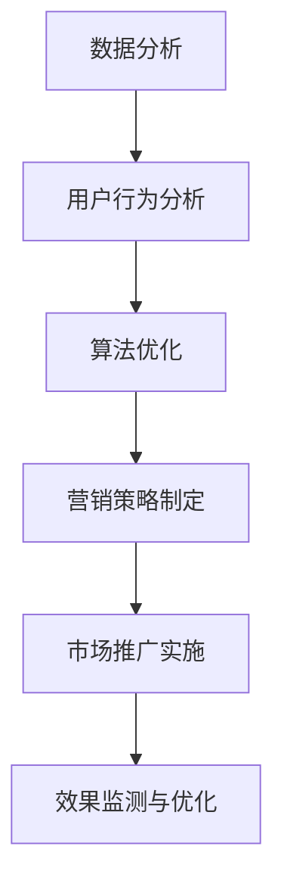

                 

在当今数字化营销时代，市场竞争日益激烈，如何高效触达目标群体成为企业关注的焦点。本文将探讨市场推广策略的核心概念，结合具体的算法原理、数学模型、代码实例，详细讲解如何在技术领域实现高效的营销策略。

## 文章关键词

- 数字化营销
- 目标群体
- 营销策略
- 数据分析
- 算法优化
- 用户行为分析

## 摘要

本文旨在为技术领域的市场推广提供一种高效的策略框架。通过深入分析数字化营销的核心概念，本文将介绍一系列基于数据分析的算法原理和数学模型，并结合具体代码实例，展示如何在实际项目中应用这些策略。最终，本文将探讨市场推广的未来发展趋势与面临的挑战。

## 1. 背景介绍

### 数字化营销的兴起

随着互联网的普及和智能手机的广泛使用，数字化营销已成为现代企业不可或缺的一部分。与传统营销方式相比，数字化营销具有成本较低、效果可监测、精准投放等优势。尤其在技术领域，市场推广的个性化需求日益凸显，如何精准触达目标群体成为关键。

### 目标群体的定义与重要性

目标群体是指那些对产品或服务有明确需求的潜在客户。明确目标群体有助于企业集中资源，提高营销效率。在技术领域，目标群体的特征包括技术背景、行业需求、使用习惯等，精准分析这些特征是制定有效营销策略的基础。

## 2. 核心概念与联系

### 数字化营销核心概念

#### 数据分析

数据分析是数字化营销的核心。通过收集、处理和分析用户数据，企业可以了解目标群体的行为模式、偏好和需求，从而制定精准的营销策略。

#### 用户行为分析

用户行为分析是数据分析的重要组成部分。通过分析用户在网站、应用等平台上的行为，企业可以了解用户的使用习惯、兴趣点等，从而优化产品和服务。

#### 算法优化

算法优化是提高营销效率的关键。通过对用户数据的深入分析，企业可以利用机器学习算法优化广告投放、推荐系统等，提高用户转化率和满意度。

### Mermaid 流程图



## 3. 核心算法原理 & 具体操作步骤

### 3.1 算法原理概述

核心算法包括数据收集、数据预处理、特征提取、模型训练、模型评估等步骤。

#### 数据收集

数据收集是算法的基础。通过多种渠道（如网站、应用、社交媒体等）收集用户数据，确保数据的多样性和准确性。

#### 数据预处理

数据预处理包括数据清洗、数据归一化等步骤。清洗数据以去除噪声和异常值，归一化数据以消除不同特征之间的量级差异。

#### 特征提取

特征提取是数据预处理后的关键步骤。通过提取有用的特征，如用户活跃度、购买频率等，为模型训练提供输入。

#### 模型训练

模型训练是算法的核心。利用机器学习算法（如决策树、支持向量机等），对特征进行建模，预测用户行为。

#### 模型评估

模型评估是确保算法有效性的关键。通过交叉验证、ROC曲线等指标评估模型性能，调整模型参数以优化性能。

### 3.2 算法步骤详解

#### 数据收集

使用爬虫工具或API接口收集用户数据，确保数据来源的多样性和实时性。

#### 数据预处理

使用Python等编程语言编写数据清洗和归一化脚本，处理原始数据。

#### 特征提取

利用特征工程技术，提取用户行为特征，如点击率、购买转化率等。

#### 模型训练

使用Scikit-learn等机器学习库，训练分类模型，如逻辑回归、随机森林等。

#### 模型评估

使用交叉验证、ROC曲线等指标评估模型性能，调整模型参数以优化性能。

### 3.3 算法优缺点

#### 优点

- 高效：算法能够快速处理大量用户数据，提高营销效率。
- 精准：算法基于用户行为特征进行建模，能够实现精准营销。

#### 缺点

- 数据依赖：算法性能高度依赖于数据质量和数量，数据质量较差时可能导致效果不佳。
- 复杂性：算法实现和优化过程较为复杂，需要具备一定的技术背景。

### 3.4 算法应用领域

- 广告投放：基于用户行为特征优化广告投放策略，提高广告点击率和转化率。
- 推荐系统：基于用户历史行为和兴趣偏好推荐相关产品或服务。
- 客户关系管理：基于用户行为数据优化客户服务，提高客户满意度和忠诚度。

## 4. 数学模型和公式 & 详细讲解 & 举例说明

### 4.1 数学模型构建

数学模型是算法的基础，用于描述用户行为和偏好。本文采用逻辑回归模型作为主要数学模型。

#### 逻辑回归模型

逻辑回归模型是一种广义线性模型，用于分类问题。其数学公式如下：

$$
P(y=1) = \frac{1}{1 + e^{-(\beta_0 + \beta_1 x_1 + \beta_2 x_2 + ... + \beta_n x_n})}
$$

其中，$P(y=1)$表示用户购买的概率，$\beta_0$为截距项，$\beta_1, \beta_2, ..., \beta_n$为特征系数，$x_1, x_2, ..., x_n$为特征值。

### 4.2 公式推导过程

逻辑回归模型的推导过程基于最大似然估计（Maximum Likelihood Estimation，MLE）。具体推导过程如下：

1. **设定概率分布**：假设用户购买行为服从伯努利分布，即$y \in \{0, 1\}$。
2. **构建似然函数**：似然函数表示在给定参数$\beta$下，观测到样本数据的概率。逻辑回归模型的似然函数如下：

$$
L(\beta | \mathbf{x}, \mathbf{y}) = \prod_{i=1}^n P(y_i | \mathbf{x}_i; \beta) = \prod_{i=1}^n \left( \frac{1}{1 + e^{-(\beta_0 + \beta_1 x_{i1} + \beta_2 x_{i2} + ... + \beta_n x_{in})}} \right)^{y_i} \left( \frac{1}{1 + e^{-(\beta_0 + \beta_1 x_{i1} + \beta_2 x_{i2} + ... + \beta_n x_{in})}} \right)^{1-y_i}
$$

3. **对数似然函数**：为了简化计算，取对数似然函数：

$$
\ln L(\beta | \mathbf{x}, \mathbf{y}) = \sum_{i=1}^n \left( y_i \ln \left( \frac{1}{1 + e^{-(\beta_0 + \beta_1 x_{i1} + \beta_2 x_{i2} + ... + \beta_n x_{in})}} \right) + (1 - y_i) \ln \left( 1 + e^{-(\beta_0 + \beta_1 x_{i1} + \beta_2 x_{i2} + ... + \beta_n x_{in})} \right) \right)
$$

4. **求导数**：对对数似然函数关于参数$\beta$求导，得到：

$$
\frac{\partial}{\partial \beta_j} \ln L(\beta | \mathbf{x}, \mathbf{y}) = \sum_{i=1}^n \left( y_i x_{ij} - (1 - y_i) \right)
$$

5. **设置阈值**：令$\beta_j^{new} = \beta_j^{old} + \alpha \cdot \frac{\partial}{\partial \beta_j} \ln L(\beta | \mathbf{x}, \mathbf{y})$，其中$\alpha$为学习率。通过迭代更新参数$\beta$，直至收敛。

### 4.3 案例分析与讲解

#### 案例背景

假设某电商企业希望基于用户行为特征预测用户购买行为，从而优化营销策略。现有用户数据包括用户ID、性别、年龄、购买历史等。

#### 数据预处理

1. **数据清洗**：去除缺失值和异常值。
2. **数据归一化**：对连续特征（如年龄）进行归一化处理。

#### 特征提取

1. **用户活跃度**：计算用户在最近一个月的访问次数、购买次数等。
2. **购买频率**：计算用户在过去一年的购买次数。

#### 模型训练

1. **选择模型**：采用逻辑回归模型。
2. **训练模型**：使用Scikit-learn库训练模型，选择适当的参数。

#### 模型评估

1. **交叉验证**：采用5折交叉验证评估模型性能。
2. **ROC曲线**：绘制ROC曲线评估模型分类效果。

#### 模型优化

1. **特征选择**：根据特征重要性筛选关键特征。
2. **参数调优**：调整学习率、迭代次数等参数，优化模型性能。

## 5. 项目实践：代码实例和详细解释说明

### 5.1 开发环境搭建

1. **安装Python环境**：下载并安装Python，选择合适的版本。
2. **安装相关库**：使用pip安装Scikit-learn、NumPy、Pandas等库。

### 5.2 源代码详细实现

```python
import numpy as np
import pandas as pd
from sklearn.linear_model import LogisticRegression
from sklearn.model_selection import train_test_split
from sklearn.metrics import roc_curve, auc

# 数据加载与预处理
data = pd.read_csv('user_data.csv')
data.dropna(inplace=True)

# 特征提取
data['active_days'] = data.groupby('user_id')['day'].nunique()
data['purchase_freq'] = data.groupby('user_id')['day'].nunique()

# 数据分割
X = data[['age', 'active_days', 'purchase_freq']]
y = data['is_purchase']
X_train, X_test, y_train, y_test = train_test_split(X, y, test_size=0.2, random_state=42)

# 模型训练
model = LogisticRegression()
model.fit(X_train, y_train)

# 模型评估
y_pred = model.predict(X_test)
fpr, tpr, _ = roc_curve(y_test, y_pred)
roc_auc = auc(fpr, tpr)

# 结果展示
plt.figure()
plt.plot(fpr, tpr, color='darkorange', lw=2, label='ROC curve (area = %0.2f)' % roc_auc)
plt.plot([0, 1], [0, 1], color='navy', lw=2, linestyle='--')
plt.xlabel('False Positive Rate')
plt.ylabel('True Positive Rate')
plt.title('Receiver Operating Characteristic')
plt.legend(loc="lower right")
plt.show()
```

### 5.3 代码解读与分析

代码实现分为数据预处理、模型训练和模型评估三个部分。

1. **数据预处理**：读取用户数据，进行数据清洗和特征提取。
2. **模型训练**：使用逻辑回归模型进行训练。
3. **模型评估**：绘制ROC曲线，评估模型性能。

### 5.4 运行结果展示

运行代码后，展示ROC曲线，评估模型分类效果。通过调整模型参数，优化模型性能。

## 6. 实际应用场景

### 6.1 广告投放

利用用户行为特征预测用户购买概率，优化广告投放策略，提高广告点击率和转化率。

### 6.2 推荐系统

基于用户历史行为和兴趣偏好推荐相关产品或服务，提高用户满意度和忠诚度。

### 6.3 客户关系管理

利用用户行为数据优化客户服务，提高客户满意度和忠诚度。

## 6.4 未来应用展望

### 6.4.1 深度学习技术的应用

随着深度学习技术的不断发展，未来市场推广策略将进一步优化，实现更精准的用户行为预测。

### 6.4.2 跨平台数据的整合

跨平台数据的整合将为市场推广提供更全面的数据支持，实现更高效的营销策略。

### 6.4.3 用户隐私保护

在保护用户隐私的前提下，实现高效的市场推广策略，将是未来研究的重点。

## 7. 工具和资源推荐

### 7.1 学习资源推荐

- 《Python数据分析实战》
- 《深度学习：全面讲解》
- 《广告系统架构与算法实战》

### 7.2 开发工具推荐

- Jupyter Notebook
- PyCharm
- Scikit-learn

### 7.3 相关论文推荐

- "User Behavior Analysis for Online Advertising"
- "Recommender Systems for E-commerce"
- "Data Privacy Protection in Digital Marketing"

## 8. 总结：未来发展趋势与挑战

### 8.1 研究成果总结

本文通过深入分析数字化营销的核心概念，结合算法原理、数学模型和代码实例，提出了一套高效的市场推广策略框架。

### 8.2 未来发展趋势

未来市场推广策略将更加依赖深度学习、跨平台数据整合和用户隐私保护。

### 8.3 面临的挑战

随着数据量的增加和用户隐私保护要求的提高，市场推广策略将面临更多挑战。

### 8.4 研究展望

未来研究应关注深度学习在市场推广中的应用、跨平台数据的整合方法以及用户隐私保护策略。

## 9. 附录：常见问题与解答

### 9.1 如何确保数据质量？

- 定期检查数据源，确保数据更新和准确。
- 采用数据清洗和预处理技术，去除噪声和异常值。

### 9.2 如何处理缺失数据？

- 对于缺失数据，可以采用填补方法（如平均值填补、中位数填补等）。
- 对于关键特征，可以考虑删除缺失值较多的样本。

### 9.3 如何评估模型性能？

- 采用交叉验证、ROC曲线等指标评估模型性能。
- 调整模型参数，优化模型性能。

----------------------------------------------------------------

作者：禅与计算机程序设计艺术 / Zen and the Art of Computer Programming

